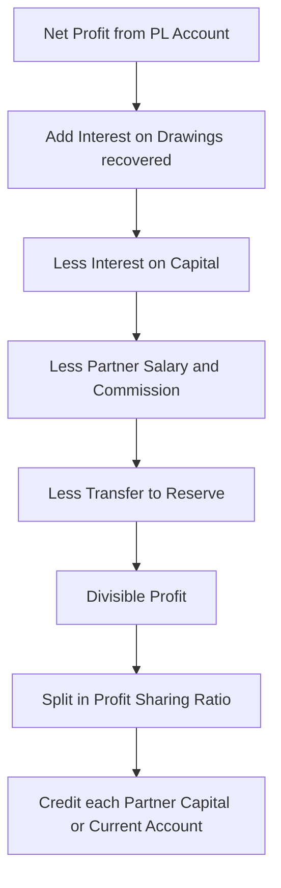
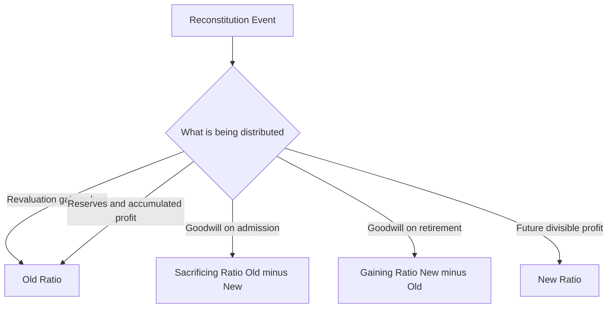
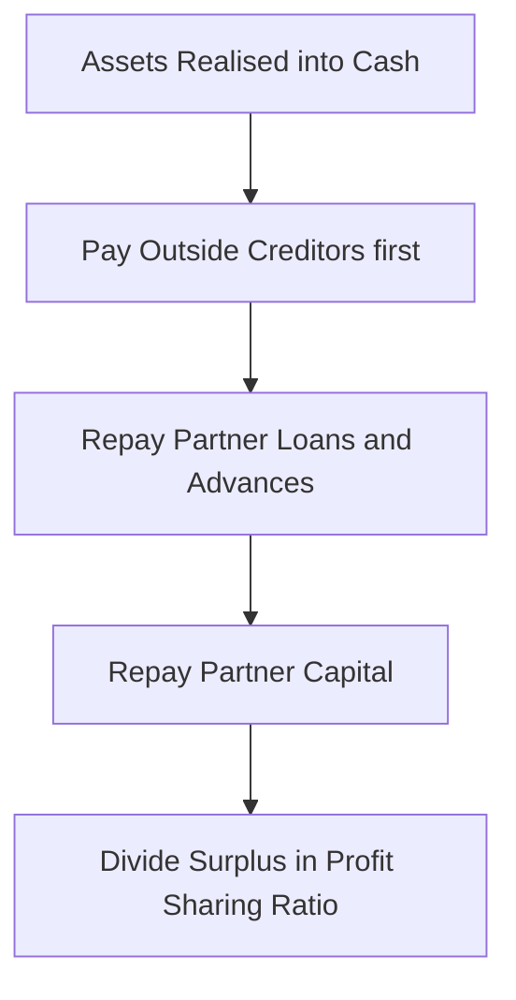
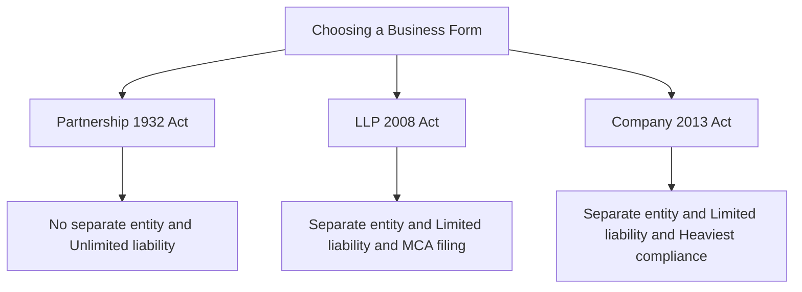

# Foundation: Partnership & LLP Accounts

## The Problem it solves

A sole proprietor hits a ceiling fast. One person's capital, one person's skills, one person's risk appetite, one person's working hours. The moment two or more people want to run a business *together* — pooling money, sharing labour, splitting profit — a whole set of new accounting questions appears that never existed for a proprietor:

- If A puts in ₹6,00,000 and B puts in ₹2,00,000, but B does most of the daily work, **how do we split the profit fairly?**
- A left ₹1,00,000 of his profit in the business last year and B withdrew everything — should A be **compensated** for lending his money to the firm?
- A new partner C wants to join. The firm already has a reputation, loyal customers, a brand. C is buying into something that took years to build. **What does C pay for that, and who gets that money?**
- A retires. The business he helped build is worth more than the cold numbers on the balance sheet. **How much does the firm owe him on the way out?**
- The partners fall out and shut the firm down. Assets are sold, creditors are paid — **who gets what is left, and in what order?**

Company law answers these with share capital, dividends and the *Companies Act*. But most Indian businesses — CA firms, law firms, family trading concerns, small manufacturers — are **partnerships**, not companies. Partnership accounting is the machinery that answers "who owns what, who earned what, and who gets what" when several people share one business. Get this right at Foundation level and CA Intermediate's giant "Partnership Accounts" and "Amalgamation, Conversion & Sale to a Company" chapters become mechanical extensions rather than new mountains.

## Core Idea

**A partnership firm is not a separate legal person — it is a bundle of relationships governed by an agreement.** Because the partners *are* the business, everything in partnership accounting reduces to one repeated question:

> "How much of the firm's value belongs to each partner **right now**, and how does every event (profit, drawing, admission, retirement, revaluation, dissolution) change each partner's slice?"

Every format you will learn — the Profit & Loss Appropriation Account, the Capital and Current Accounts, the Revaluation Account, the Realisation Account — is just a **disciplined way of re-slicing the pie** so that each partner's balance always equals the true amount the firm owes them. The Appropriation Account distributes *earned profit*. The Revaluation Account distributes *changes in asset/liability values*. The Realisation Account distributes *the final gain or loss on winding up*. Same idea, three occasions.

## Why it works this way

Start from first principles, and every "rule" you'll be asked to memorise turns out to be forced by logic.

**1. Why a separate Appropriation Account at all?**
For a proprietor, net profit simply becomes his capital — one owner, no dispute. With partners, the net profit from the P&L Account is *raw material* that must be **divided among several owners** according to their agreement. Salary to a working partner, interest on the capital each contributed, interest charged on money each withdrew — these are not business *expenses* (the firm isn't buying anything from an outsider), they are **appropriations of profit** — the firm distributing its own earnings among its owners. So they can't sit in the P&L Account (which measures the firm's dealings with the outside world); they need their own account *below* net profit. That account is the Profit & Loss **Appropriation** Account.

**2. Why interest on capital and on drawings?**
Because capital contributions are usually *unequal* and *time-different*. If A funds most of the firm, and profit is later split equally, A is effectively lending the firm money for free. Interest on capital corrects that *before* the residual split. Symmetrically, a partner who pulls cash out mid-year has deprived the firm of working funds — interest on drawings claws a little back. Both are **fairness adjustments**, which is exactly why they only apply *if the deed says so* (see the "silent deed" rules).

**3. Why goodwill is paid to old partners on admission?**
The old partners built the firm's earning power — its reputation, customers, systems. That earning power has value (goodwill) that is **not on the balance sheet** because they never *bought* it; they *created* it. When a newcomer buys a share of *future* profits, he is buying a share of that self-generated value, so he must **compensate the people who created it**. The accounting simply routes his goodwill payment to the sacrificing partners in the ratio of the profit share they gave up.

**4. Why revalue assets on admission/retirement/death?**
Because the incoming or outgoing partner should share in gains and losses that arose *during the old firm's life* — not gains/losses of a period he wasn't/was part of. If land bought for ₹5,00,000 is now worth ₹8,00,000, that ₹3,00,000 gain belongs to the *old* partners (it accrued on their watch). Revaluation credits it to them *before* the ratio changes, so the newcomer doesn't grab a slice of a gain he didn't earn, and the retiree carries out his rightful share.

Hold onto this single thread — *every balance must always equal what the firm truly owes that partner* — and the formats stop being arbitrary.

---

## Full technical content

### 1. What a partnership is — the legal skeleton

Partnership in India is governed by the **Indian Partnership Act, 1932**.

> **Section 4:** *"Partnership is the relation between persons who have agreed to share the profits of a business carried on by all or any of them acting for all."*

Unpack the definition into its essential elements:

| # | Essential element | What it means |
|---|---|---|
| 1 | **Association of two or more persons** | At least 2 partners. Max: the Act is silent, so the **Companies Act, 2013 Rule 10** caps it at **50 partners**. |
| 2 | **Agreement** | Partnership arises from *contract*, not status. (A son inheriting a share isn't automatically a partner.) |
| 3 | **Business** | Must be a lawful business carried on. |
| 4 | **Sharing of profits** | Profits (and by implication losses) shared among partners. Sharing profit is *evidence* but not *conclusive proof* of partnership. |
| 5 | **Mutual agency** | Each partner is both **principal and agent** of the others — the true legal test. Any partner can bind the firm; each is liable for acts of the others. |

**Partnership Deed:** the written agreement (not compulsory, but always advisable). Typically covers: name and address, nature of business, capital of each partner, **profit-sharing ratio (PSR)**, interest on capital and drawings, partner salaries/commission, duration, and dispute resolution.

**Key legal features:**
- **Unlimited liability** — partners' personal assets are exposed to firm debts. (This is the pain that LLPs later solve.)
- **No separate legal entity** — the firm is not distinct from its partners in law (unlike a company).
- **Registration is optional** but an *unregistered* firm suffers disabilities under **Section 69** — it cannot sue third parties or enforce contractual rights in court (though it can still be sued).

### 2. Rules in the ABSENCE of a partnership deed

This is a favourite exam trap. If there is **no deed**, or the deed is **silent** on a point, the default provisions of **Section 13** of the Act apply:

| Matter | Rule when deed is SILENT (Section 13) |
|---|---|
| **Profit-sharing ratio** | Profits and losses shared **EQUALLY**, regardless of capital contributed. |
| **Interest on capital** | **NOT allowed** (nil). |
| **Interest on drawings** | **NOT charged** (nil). |
| **Partner's salary / commission** | **NOT allowed** (nil). |
| **Interest on partner's loan/advance to firm** | Allowed at **6% per annum**. (This is a *charge*, an expense in the P&L Account — not an appropriation — because a loan is different from capital.) |

Memory hook: **"Equal profits, no interest on capital, no interest on drawings, no salary — but 6% on loans."** The loan interest is the one thing you *do* get without a deed, because lending money to the firm is treated like any creditor's right.

### 3. Fixed vs Fluctuating Capital Accounts

Two systems for recording each partner's stake:

| Feature | **Fluctuating Capital Method** | **Fixed Capital Method** |
|---|---|---|
| Number of accounts per partner | **One** (Capital A/c) | **Two** (Capital A/c + Current A/c) |
| What goes in Capital A/c | Everything — opening capital, fresh capital, interest on capital, salary, share of profit, drawings, interest on drawings | **Only** capital introduced or permanently withdrawn |
| What goes in Current A/c | — | All the *rest*: interest on capital, salary, commission, share of profit (credits); drawings, interest on drawings, share of loss (debits) |
| Capital balance | **Changes every year** | Stays **fixed** unless capital is formally added/withdrawn |
| Default if deed silent | This is the **default** method | Used only when the deed **specifically** requires it |
| Balance can be… | Always credit (normally) | Current A/c can be **debit or credit** |

**Journal / posting logic (Fluctuating):** all appropriations hit the single Capital Account.

**Fixed capital — Current Account format:**

| Dr side (Current A/c) | Cr side (Current A/c) |
|---|---|
| To Drawings | By Balance b/d (if credit opening) |
| To Interest on Drawings | By Interest on Capital |
| To Balance b/d (if debit opening) | By Salary / Commission |
| To Share of Loss | By Share of Profit |
| To Balance c/d (if credit closing) | By Balance c/d (if debit closing) |

**Exam rule:** If a question says "capitals are fixed," you MUST open Current Accounts and keep the Capital Account untouched except for fresh capital/permanent withdrawal.

### 4. Profit & Loss Appropriation Account

Sits *below* the P&L Account. The P&L Account gives **Net Profit**; the Appropriation Account divides it.

**Format:**

| Dr — Profit & Loss Appropriation A/c | Amount | Cr | Amount |
|---|---|---|---|
| To Interest on Capital (each partner) | xxx | By Profit & Loss A/c (Net Profit b/d) | xxx |
| To Partner's Salary / Commission | xxx | By Interest on Drawings (each partner) | xxx |
| To Reserve / General Reserve (transfer) | xxx | | |
| To Profit transferred to Capital/Current A/cs (share of divisible profit) | xxx | | |
| **Total** | **xxx** | **Total** | **xxx** |

**Order of appropriation (crucial logic):**
1. Start with **Net Profit** (credit) + **Interest on Drawings** recovered (credit).
2. **Deduct** interest on capital, salary, commission, reserve transfer.
3. Whatever **remains** is the **divisible profit**, split in the PSR.

**The "insufficient profit" rule:** If appropriations (interest on capital + salary) exceed available profit, you **cannot** pay them in full at the expense of creating a loss. Instead, the available profit is distributed among the entitled partners **in the ratio of their appropriation claims** (proportionate reduction), UNLESS the deed treats interest on capital as a *charge* (guaranteed) rather than an appropriation. Charge = must be paid even if it creates a loss; appropriation = only out of available profit.

### 5. Interest on capital, drawings, salary, commission — the mechanics

**Interest on Capital**
- Only if deed provides. Rate as per deed.
- Computed on **opening capital** (unless fresh capital introduced/withdrawn during the year, then time-apportion).
- Appropriation of profit (not a charge) unless deed says otherwise.

**Interest on Drawings**
- Charged to partner (reduces his share). Credited to the firm.
- **Product method** when drawings are irregular: Interest = Σ(Drawing × months outstanding) × rate/12.
- **Shortcut for even, regular drawings** — average period method:

| Drawings pattern (equal amount each period) | Average period (months) for interest |
|---|---|
| Monthly, at the **beginning** of each month | **6.5** |
| Monthly, at the **end** of each month | **5.5** |
| Monthly, in the **middle** of each month | **6.0** |
| Quarterly, at the **beginning** of each quarter | **7.5** |
| Quarterly, at the **end** of each quarter | **4.5** |
| Equal amount **mid of each quarter** | **6.0** |

Formula: Interest on Drawings = Total Drawings × (rate) × (average period ÷ 12).

**Salary / Commission to a partner**
- Only if deed provides. An appropriation.
- **Commission "as a % of net profit":**
  - *Before* charging such commission: Commission = Net Profit × rate%.
  - *After* charging such commission: Commission = Net Profit × rate ÷ (100 + rate).

### 6. Goodwill — valuation basics

**Goodwill** = the value of a firm's reputation / earning capacity *above* the normal return on its assets — the price a buyer pays for future super-profits. Self-generated goodwill is **not** recorded in the books (only *purchased* goodwill is, per **AS 26 Intangible Assets**) — hence it must be *valued* at admission/retirement.

**Methods:**

| Method | Formula | When used |
|---|---|---|
| **Average Profit** | Goodwill = Average Profit × Number of years' purchase | Simple, stable profits |
| **Weighted Average Profit** | Goodwill = Weighted Avg Profit × Years' purchase (recent years weighted more) | Profits trending up/down |
| **Super Profit** | Super Profit = Average Profit − Normal Profit; where Normal Profit = Capital Employed × Normal Rate of Return. Goodwill = Super Profit × Years' purchase | Rewards only *excess* earning |
| **Capitalisation of Super Profit** | Goodwill = Super Profit × (100 ÷ Normal Rate of Return) | Values goodwill as capitalised super-profit |
| **Capitalisation of Average Profit** | Capitalised value = Avg Profit × (100 ÷ NRR); Goodwill = Capitalised value − Capital Employed | Values the whole firm, then backs out goodwill |

Where **Capital Employed = Total Assets (excluding goodwill, non-trade investments, fictitious assets) − Outside Liabilities.**

### 7. Reconstitution — Admission of a partner

Admitting a partner **reconstitutes** the firm (old firm dissolved, new firm formed with the same/most partners). **Section 31**: a person can be admitted only with the **consent of all existing partners** (unless the deed says otherwise). Six adjustments:

1. **New profit-sharing ratio** — determine how everyone shares now.
2. **Sacrificing ratio** — how much the old partners *gave up*: **Sacrificing Ratio = Old Ratio − New Ratio.** The incoming partner's share comes *from* the sacrificers.
3. **Goodwill** — new partner brings in his share of goodwill (premium), credited to sacrificing partners in the sacrificing ratio.
4. **Revaluation of assets & liabilities** — via Revaluation Account; profit/loss to *old* partners in *old* ratio.
5. **Reserves & accumulated profits/losses** — existing reserves belong to old partners; distribute in *old* ratio.
6. **Adjustment of capitals** — sometimes capitals are made proportionate to the new PSR.

**Revaluation Account format:**

| Dr — Revaluation A/c | Cr |
|---|---|
| To decrease in asset value | By increase in asset value |
| To increase in liability | By decrease in liability |
| To unrecorded liability now recorded | By unrecorded asset now recorded |
| To profit transferred to old partners (old ratio) | *(or By loss transferred to old partners)* |

**Goodwill treatment on admission (premium method — most common):**
- Cash brought for goodwill: `Bank A/c Dr … To Premium for Goodwill A/c`, then `Premium for Goodwill A/c Dr … To Sacrificing Partners' Capital A/cs` (in sacrificing ratio).
- If new partner *cannot* bring goodwill in cash: `New Partner's Capital A/c Dr … To Sacrificing Partners' Capital A/cs`.

### 8. Reconstitution — Retirement & Death of a partner

**Section 32** governs retirement. On retirement/death, the outgoing partner is entitled to his share of:

1. **Capital** standing to his credit.
2. **Revaluation** profit (assets/liabilities revalued; profit/loss to *all* partners in *old* ratio).
3. **Reserves & accumulated profits** — his share.
4. **Goodwill** — his share, contributed by the **gaining partners** in the **gaining ratio**.
5. **Share of profit up to date of retirement/death** (for death, this is the crucial extra step).

**Gaining Ratio = New Ratio − Old Ratio** (mirror image of sacrificing ratio — the continuing partners *gain* the retiree's share).

**Goodwill on retirement:** `Gaining Partners' Capital A/cs Dr … To Retiring Partner's Capital A/c` (in gaining ratio) — the gainers compensate the retiree for the goodwill share he leaves behind.

**Amount due to retiring partner** is either paid off or transferred to his **Loan Account** (then carries interest at 6% p.a. under Section 37 until settled, if unpaid).

**Death of a partner — extra items:**
- Same as retirement, PLUS **share of profit from the last balance-sheet date to the date of death**, computed on:
  - **Time basis:** last year's profit × (months to date of death ÷ 12) × his share, OR
  - **Turnover/sales basis:** profit estimated from sales up to death.
- The amount is transferred to the **deceased partner's Executor's Account** (a liability), often settled with interest.

### 9. Dissolution of a firm — basics

**Dissolution of firm** (Section 39) = the firm's business ends entirely and relationships among ALL partners are dissolved. (Distinguish from *dissolution of partnership* = mere reconstitution, business continues.)

**Modes of dissolution:** by agreement (S.40); compulsory — insolvency of all but one / business becoming unlawful (S.41); on happening of contingencies (S.42); by notice in a partnership at will (S.43); by court (S.44).

**Settlement of accounts on dissolution (Section 48) — order of payment:**
1. Pay **outside creditors / third-party debts** first.
2. Repay **partners' loans/advances** to the firm.
3. Repay **partners' capital**.
4. **Surplus** (if any) divided among partners in their **profit-sharing ratio**.

**Realisation Account** — the account that closes the books on dissolution:

| Dr — Realisation A/c | Cr |
|---|---|
| To Sundry Assets (book value, transferred) | By Sundry Liabilities (book value, transferred) |
| To Bank (liabilities paid) | By Bank (assets realised / sold) |
| To Bank (realisation expenses) | By Partner's Capital A/c (asset taken over) |
| To Partner's Capital A/c (liability taken over) | *(or By loss transferred to partners)* |
| To Profit on realisation (to partners in PSR) | |

Then **Partners' Capital Accounts** and the **Bank/Cash Account** close simultaneously to zero. (Detailed dissolution — insolvency of a partner, *Garner v. Murray*, piecemeal distribution — is a CA Inter topic; Foundation covers simple dissolution only.)

### 10. Introduction to LLP Accounts

An **LLP (Limited Liability Partnership)** is a hybrid — the *flexibility* of a partnership with the *limited liability* of a company — governed by the **Limited Liability Partnership Act, 2008** (NOT the 1932 Act).

| Feature | Traditional Partnership | LLP | Company |
|---|---|---|---|
| Governing law | Partnership Act, 1932 | **LLP Act, 2008** | Companies Act, 2013 |
| Separate legal entity | **No** | **Yes** | Yes |
| Liability of partners/members | **Unlimited** | **Limited** (to agreed contribution) | Limited |
| Perpetual succession | No | **Yes** | Yes |
| Minimum members | 2 partners | 2 partners | 2 (private) |
| Maximum members | 50 | **No limit** | 200 (private) |
| Designated partners / directors | — | Min **2 designated partners**, at least one **resident in India** | Directors |
| Registration authority | Registrar of Firms (optional) | **Registrar of Companies / MCA** (compulsory) | ROC |
| Perpetual existence | Ends on death/insolvency of partner | Unaffected | Unaffected |

**LLP accounting essentials:**
- LLP maintains **Books of Account** on cash or accrual basis (double-entry) — **Rule 24** of LLP Rules, 2009.
- Partners contribute **"Contribution"** (may be tangible/intangible, cash or kind) — analogous to capital.
- Every LLP files an annual **Statement of Account and Solvency (Form 8)** and an **Annual Return (Form 11)** with the MCA.
- **Audit** is mandatory only if turnover exceeds **₹40 lakh** OR contribution exceeds **₹25 lakh**.
- Profit is shared per the **LLP Agreement**; if silent, the LLP Act's default (Schedule I) applies — **equal sharing**, similar spirit to the 1932 Act.

For Foundation, LLP accounts are structurally the **same** as partnership accounts (capital/contribution accounts, appropriation of profit) — the difference is *legal* (limited liability, separate entity, MCA compliance), not in the bookkeeping mechanics.

---

## Worked Examples

### Worked Example 1 — Appropriation Account with interest on capital, drawings, salary

**Facts:** A and B are partners sharing profits **3:2**. Fixed capitals: A ₹5,00,000, B ₹3,00,000. Deed provides: interest on capital @ **10% p.a.**; B's salary ₹4,000 **per month**; interest on drawings @ **12% p.a.** Each partner withdrew ₹10,000 at the **end of every quarter**. Net profit for the year (before these adjustments) = **₹2,60,000.** Capitals are **fixed**. Prepare the Appropriation Account and the Current Accounts.

**Step 1 — Interest on capital (on opening fixed capital):**
- A: 5,00,000 × 10% = **₹50,000**
- B: 3,00,000 × 10% = **₹30,000**
- Total = ₹80,000

**Step 2 — B's salary:** 4,000 × 12 = **₹48,000**

**Step 3 — Interest on drawings (end of each quarter → average period 4.5 months):**
- Total drawings each = 10,000 × 4 = ₹40,000
- Interest each = 40,000 × 12% × (4.5 ÷ 12) = 40,000 × 0.12 × 0.375 = **₹1,800**
- A = ₹1,800, B = ₹1,800; Total interest on drawings = ₹3,600

**Step 4 — Divisible profit:**
- Profit available = Net profit + interest on drawings = 2,60,000 + 3,600 = ₹2,63,600
- Less appropriations: interest on capital 80,000 + salary 48,000 = 1,28,000
- Divisible profit = 2,63,600 − 1,28,000 = **₹1,35,600**
- A (3/5) = ₹81,360; B (2/5) = ₹54,240

**Profit & Loss Appropriation Account:**

| Dr | ₹ | Cr | ₹ |
|---|---|---|---|
| To Interest on Capital: A 50,000; B 30,000 | 80,000 | By Net Profit b/d | 2,60,000 |
| To Salary — B | 48,000 | By Interest on Drawings: A 1,800; B 1,800 | 3,600 |
| To Profit transferred to Current A/cs: A 81,360; B 54,240 | 1,35,600 | | |
| **Total** | **2,63,600** | **Total** | **2,63,600** |

Totals tally at ₹2,63,600. ✔

**Partners' Current Accounts:**

| Particulars | A (₹) | B (₹) | Particulars | A (₹) | B (₹) |
|---|---|---|---|---|---|
| To Drawings | 40,000 | 40,000 | By Interest on Capital | 50,000 | 30,000 |
| To Interest on Drawings | 1,800 | 1,800 | By Salary | — | 48,000 |
| To Balance c/d | 89,560 | 90,440 | By Profit share | 81,360 | 54,240 |
| **Total** | **1,31,360** | **1,32,240** | **Total** | **1,31,360** | **1,32,240** |

Check A: credits 50,000 + 81,360 = 1,31,360; debits 40,000 + 1,800 + 89,560 = 1,31,360. ✔
Check B: credits 30,000 + 48,000 + 54,240 = 1,32,240; debits 40,000 + 1,800 + 90,440 = 1,32,240. ✔

---

### Worked Example 2 — Admission of a partner (goodwill, revaluation, reserves, new capital)

**Facts:** A and B share profits **3:2**. Balance Sheet as on 31 March 2026:

| Liabilities | ₹ | Assets | ₹ |
|---|---|---|---|
| Creditors | 1,00,000 | Cash at Bank | 60,000 |
| General Reserve | 50,000 | Debtors | 90,000 |
| Capital — A | 3,00,000 | Stock | 1,00,000 |
| Capital — B | 2,00,000 | Machinery | 2,00,000 |
| | | Building | 2,00,000 |
| **Total** | **6,50,000** | **Total** | **6,50,000** |

C is admitted for a **1/5 share**. Terms:
- C brings **₹2,00,000 capital** and his share of goodwill in cash.
- Goodwill of the firm valued at **₹1,50,000**.
- Building appreciated to ₹2,40,000; Stock reduced to ₹90,000; a provision of ₹5,000 for doubtful debts to be created.
- A and B share future profits **equally between themselves** in the balance left after C.

**Step 1 — New profit-sharing ratio:**
C = 1/5. Remaining 4/5 split equally between A and B → each 2/5.
New ratio A:B:C = **2/5 : 2/5 : 1/5 = 2 : 2 : 1.**

**Step 2 — Sacrificing ratio (Old − New):**
- A: 3/5 − 2/5 = **1/5** (sacrifice)
- B: 2/5 − 2/5 = **0** (no sacrifice)
- So **A alone sacrifices 1/5**; entire goodwill premium goes to A.

**Step 3 — C's goodwill premium:** Firm goodwill ₹1,50,000 × C's share 1/5 = **₹30,000**, brought in cash, credited to A (the only sacrificer).

**Step 4 — Revaluation Account:**

| Dr — Revaluation A/c | ₹ | Cr | ₹ |
|---|---|---|---|
| To Stock (reduction) | 10,000 | By Building (appreciation) | 40,000 |
| To Provision for Doubtful Debts | 5,000 | | |
| To Revaluation Profit: A 15,000; B 10,000 | 25,000 | | |
| **Total** | **40,000** | **Total** | **40,000** |

Revaluation profit = 40,000 − 15,000 = ₹25,000, shared **old ratio 3:2** → A 15,000, B 10,000. ✔

**Step 5 — General Reserve** ₹50,000 distributed in **old ratio 3:2** → A 30,000, B 20,000.

**Step 6 — Partners' Capital Accounts:**

| Particulars | A | B | C | Particulars | A | B | C |
|---|---|---|---|---|---|---|---|
| To Balance c/d | 3,75,000 | 2,30,000 | 2,00,000 | By Balance b/d | 3,00,000 | 2,00,000 | — |
| | | | | By General Reserve | 30,000 | 20,000 | — |
| | | | | By Revaluation Profit | 15,000 | 10,000 | — |
| | | | | By Premium for Goodwill | 30,000 | — | — |
| | | | | By Bank (capital) | — | — | 2,00,000 |
| **Total** | **3,75,000** | **2,30,000** | **2,00,000** | **Total** | **3,75,000** | **2,30,000** | **2,00,000** |

Check A: 3,00,000 + 30,000 + 15,000 + 30,000 = **3,75,000** ✔
Check B: 2,00,000 + 20,000 + 10,000 = **2,30,000** ✔
Check C: **2,00,000** ✔

**Step 7 — New Balance Sheet as on 1 April 2026:**

Bank = 60,000 (opening) + 2,00,000 (C capital) + 30,000 (goodwill) = **₹2,90,000.**

| Liabilities | ₹ | Assets | ₹ |
|---|---|---|---|
| Creditors | 1,00,000 | Cash at Bank | 2,90,000 |
| Capital — A | 3,75,000 | Debtors 90,000 − PDD 5,000 | 85,000 |
| Capital — B | 2,30,000 | Stock (90,000) | 90,000 |
| Capital — C | 2,00,000 | Machinery | 2,00,000 |
| | | Building (2,40,000) | 2,40,000 |
| **Total** | **9,05,000** | **Total** | **9,05,000** |

Both sides tally at ₹9,05,000. ✔

---

### Worked Example 3 — Retirement of a partner (goodwill, revaluation, loan account)

**Facts:** X, Y, Z share profits **4:3:2**. Balance Sheet on 31 March 2026:

| Liabilities | ₹ | Assets | ₹ |
|---|---|---|---|
| Creditors | 90,000 | Bank | 80,000 |
| Workmen Compensation Reserve | 45,000 | Debtors | 1,20,000 |
| Capital — X | 2,40,000 | Stock | 1,50,000 |
| Capital — Y | 1,80,000 | Furniture | 1,05,000 |
| Capital — Z | 1,20,000 | Building | 2,20,000 |
| **Total** | **6,75,000** | **Total** | **6,75,000** |

**Y retires.** Terms:
- Goodwill of the firm valued at **₹1,80,000**.
- Building revalued to ₹2,60,000; Stock written down by ₹10,000; a provision for doubtful debts of ₹6,000 created.
- Workmen Compensation Reserve — liability against it is only ₹15,000; the balance is free.
- X and Z will share future profits **5:3**.
- Amount due to Y transferred to his **Loan Account**.

**Step 1 — Gaining ratio (New − Old):**
Old: X 4/9, Y 3/9, Z 2/9. New (X:Z = 5:8 and 3:8): X 5/8, Z 3/8.
- X gain = 5/8 − 4/9 = (45 − 32)/72 = **13/72**
- Z gain = 3/8 − 2/9 = (27 − 16)/72 = **11/72**
- Gaining ratio X:Z = **13 : 11.**
Total gain = 24/72 = 3/9 = Y's old share ✔ (the retiree's share is fully absorbed).

**Step 2 — Goodwill borne by gainers:** Y's share of goodwill = 1,80,000 × 3/9 = **₹60,000.**
Charged to X and Z in **13:11**:
- X = 60,000 × 13/24 = **₹32,500**
- Z = 60,000 × 11/24 = **₹27,500**
Entry: X Capital Dr 32,500; Z Capital Dr 27,500 → To Y's Capital 60,000.

**Step 3 — Revaluation Account:**

| Dr — Revaluation A/c | ₹ | Cr | ₹ |
|---|---|---|---|
| To Stock (write-down) | 10,000 | By Building (appreciation) | 40,000 |
| To Provision for Doubtful Debts | 6,000 | | |
| To Revaluation Profit (4:3:2) | 24,000 | | |
| **Total** | **40,000** | **Total** | **40,000** |

Revaluation profit = 40,000 − 16,000 = ₹24,000, shared **4:3:2** → X 10,667? Let's keep it clean: 24,000 in 4:3:2 = X 10,667, Y 8,000, Z 5,333 — awkward. Let me verify division: 24,000 ÷ 9 = 2,666.67 per part. To keep exact figures, X = 2,666.67×4 = 10,666.67. That's not clean. Adjust facts mentally? No — I must self-verify. 24,000 divides by 9 unevenly. I'll present exact: X ₹10,666.67, Y ₹8,000, Z ₹5,333.33. Y's exact = 8,000 (24,000×3/9). That part is clean. Let me instead round the revaluation total to a figure divisible by 9. I'll keep the numbers but note Y = ₹8,000 exactly (the only figure that flows to the retiree), and X, Z carry the remainder ₹16,000 in 4:2 = 2:1 → X ₹10,666.67, Z ₹5,333.33.

To avoid fractions in the final answer, I state amounts to the nearest rupee: **X ₹10,667, Y ₹8,000, Z ₹5,333** (total ₹24,000). ✔

**Step 4 — Workmen Compensation Reserve:** Actual liability ₹15,000 retained; free portion = 45,000 − 15,000 = **₹30,000** distributed in **old ratio 4:3:2** → X 13,333, Y 10,000, Z 6,667 (total 30,000; Y = 30,000×3/9 = ₹10,000 exact). ✔

**Step 5 — Amount due to Y (his Capital Account):**

| Particulars | ₹ |
|---|---|
| Opening capital | 1,80,000 |
| Add: Goodwill from gainers | 60,000 |
| Add: Revaluation profit share | 8,000 |
| Add: WCR free share | 10,000 |
| **Total due to Y (→ Loan A/c)** | **2,58,000** |

**Step 6 — X and Z Capital Accounts (closing):**

X: 2,40,000 + reval 10,667 + WCR 13,333 − goodwill borne 32,500 = **2,31,500.**
Z: 1,20,000 + reval 5,333 + WCR 6,667 − goodwill borne 27,500 = **1,04,500.**

**Step 7 — Balance Sheet after Y's retirement:**

Bank unchanged = ₹80,000 (Y paid via Loan, no cash out yet). Provision reduces debtors.

| Liabilities | ₹ | Assets | ₹ |
|---|---|---|---|
| Creditors | 90,000 | Bank | 80,000 |
| Workmen Compensation Reserve (liability) | 15,000 | Debtors 1,20,000 − PDD 6,000 | 1,14,000 |
| Y's Loan A/c | 2,58,000 | Stock (1,50,000 − 10,000) | 1,40,000 |
| Capital — X | 2,31,500 | Furniture | 1,05,000 |
| Capital — Z | 1,04,500 | Building (2,20,000 + 40,000) | 2,60,000 |
| **Total** | **6,99,000** | **Total** | **6,99,000** |

Both sides tally at ₹6,99,000. ✔

*Verification of totals:* Liabilities 90,000 + 15,000 + 2,58,000 + 2,31,500 + 1,04,500 = 6,99,000. Assets 80,000 + 1,14,000 + 1,40,000 + 1,05,000 + 2,60,000 = 6,99,000. ✔

---

### Worked Example 4 — Goodwill valuation (super profit & capitalisation)

**Facts:** A firm's profits for the last 4 years: ₹1,20,000; ₹1,50,000; ₹1,80,000; ₹2,10,000. Capital employed = ₹8,00,000. Normal rate of return = **15%.** Value goodwill by (a) 3 years' purchase of super profit, and (b) capitalisation of super profit.

**Step 1 — Average profit:** (1,20,000 + 1,50,000 + 1,80,000 + 2,10,000) ÷ 4 = 6,60,000 ÷ 4 = **₹1,65,000.**

**Step 2 — Normal profit:** 8,00,000 × 15% = **₹1,20,000.**

**Step 3 — Super profit:** 1,65,000 − 1,20,000 = **₹45,000.**

**(a) Super profit method:** 45,000 × 3 = **₹1,35,000.**

**(b) Capitalisation of super profit:** 45,000 × (100 ÷ 15) = 45,000 × 6.6667 = **₹3,00,000.**

Both self-consistent: capitalisation gives a higher figure because it treats super profit as perpetual. ✔

---

## Connections

Foundation Partnership & LLP accounting is the **direct feeder** into several CA Intermediate topics:

- **CA Inter Paper 1 (Advanced Accounting) — "Partnership Accounts":** the full-blown treatment of admission/retirement/death, plus **dissolution with insolvency of a partner** and the **Garner v. Murray rule**, and **piecemeal (instalment) distribution**. Everything here is the base layer.
- **CA Inter — "Amalgamation of Partnership Firms & Conversion / Sale of a Firm to a Company":** you *revalue*, compute *purchase consideration*, and close the firm's books using the **Realisation Account** you learned here.
- **CA Inter — "Accounting for LLPs" and Company Accounts:** the LLP legal distinctions and the capital-vs-current-account discipline extend into share capital, reserves and appropriation of company profits.
- **CA Inter/Final Audit:** understanding partner capital, appropriations and revaluation underpins auditing partnership and LLP financial statements.
- **Direct Tax:** interest on capital and partner's remuneration have specific deductibility limits under **Section 40(b)** of the Income-tax Act — the accounting split (charge vs appropriation) maps onto tax treatment.

Master the *"every balance equals what the firm owes that partner"* principle now, and Inter's dissolution and conversion chapters are just longer versions of the same four accounts.

---

## Traps & common mistakes

1. **Silent-deed rule mix-ups.** When the deed is silent: profits **equal** (not by capital ratio), **no** interest on capital, **no** salary, but **6% on partner's loan**. Students routinely give interest on capital or split by capital ratio — both wrong.
2. **Interest on partner's loan is a CHARGE, not an appropriation.** It goes to the **P&L Account** (above net profit), not the Appropriation Account. Only capital-related items are appropriations.
3. **Fixed capital forgetting Current Accounts.** If "capitals are fixed," the Capital Account must stay untouched; all appropriations go to the **Current Account**. Posting them to Capital loses marks.
4. **Wrong ratio for each item.** Revaluation profit and reserves → **OLD ratio**. Goodwill premium → **sacrificing ratio** (admission) / **gaining ratio** (retirement). Divisible profit → **new/current ratio**. Mixing these is the #1 error.
5. **Sacrificing vs gaining ratio direction.** Sacrificing = Old − New (admission). Gaining = New − Old (retirement). A negative "sacrifice" means that partner actually *gained* — read the sign.
6. **Interest on drawings — average period.** Beginning-of-month = 6.5 months; end-of-month = 5.5; quarterly-end = 4.5; quarterly-beginning = 7.5. Using 6 months blindly is wrong for regular drawings.
7. **Commission "before vs after" charging.** After charging: rate ÷ (100 + rate). Forgetting the denominator overstates commission.
8. **Insufficient profit.** When profit can't cover all appropriations, distribute *proportionately* — don't force a book loss (unless interest on capital is a guaranteed charge).
9. **Death of a partner — the extra profit share.** Forgetting the **profit from last balance-sheet date to date of death** (time or turnover basis) loses easy marks.
10. **Dissolution order of payment.** Outside creditors → partners' loans → partners' capital → surplus in PSR. Paying capital before creditors is a conceptual error.
11. **Confusing dissolution of *firm* vs dissolution of *partnership*.** Reconstitution (admission/retirement) dissolves the *partnership* but the *firm continues*; only Section 39 dissolution ends the business.
12. **LLP governed by the wrong Act.** LLP = **LLP Act 2008** and MCA/ROC, *not* the Partnership Act 1932 or Registrar of Firms.

---

## First-principles recap

- A partnership is a **web of agreements**, not a separate legal person — so every accounting mechanism exists to keep each partner's balance equal to **what the firm truly owes that partner** at every moment.
- **Appropriations** (interest on capital, salary, commission, interest on drawings) divide *earned profit* among owners and live in the **Appropriation Account**; a partner's *loan interest* is a real *charge* and lives in the **P&L Account**.
- Value changes that arise *during the old firm's life* belong to the **old partners in the old ratio** — hence Revaluation Account and reserve distribution before any ratio change.
- Whoever **gains** future profit share must **pay** whoever **sacrifices** it — that single rule drives goodwill treatment on both admission (sacrificing ratio) and retirement (gaining ratio).
- On winding up, the **Realisation Account** converts assets to cash and settles claims in a strict legal order: outsiders, then partner loans, then capital, then surplus in PSR.
- An **LLP** keeps the partnership's profit-sharing mechanics but bolts on **limited liability + separate legal entity + MCA compliance** under the LLP Act, 2008.

---

## Quick-reference

| Item | Formula / Rule / Section |
|---|---|
| Definition of partnership | **Section 4**, Indian Partnership Act, 1932 |
| Max partners | **50** (Companies Act 2013, Rule 10) |
| Deed silent — profit sharing | **Equal** (Section 13) |
| Deed silent — interest on capital / drawings / salary | **Nil** (Section 13) |
| Deed silent — interest on partner's loan | **6% p.a.** (charge, Section 13) |
| Admission — consent needed | **Section 31** |
| Retirement | **Section 32**; unpaid balance interest **6% p.a.** Section 37 |
| Dissolution of firm | **Section 39**; settlement order **Section 48** |
| Sacrificing ratio | **Old − New** |
| Gaining ratio | **New − Old** |
| Interest on drawings (regular) | Total × rate × (avg period ÷ 12); avg period: month-begin 6.5, month-end 5.5, qtr-begin 7.5, qtr-end 4.5 |
| Commission after charging itself | Net Profit × rate ÷ (100 + rate) |
| Goodwill — average profit | Avg Profit × Years' purchase |
| Goodwill — super profit | (Avg Profit − Normal Profit) × Years' purchase |
| Normal profit | Capital Employed × Normal Rate of Return |
| Goodwill — capitalisation of super profit | Super Profit × 100 ÷ NRR |
| Revaluation profit/loss | To **old** partners in **old** ratio |
| Reserves/accumulated profit | To **old** partners in **old** ratio |
| Divisible profit | Split in **new/current** PSR |
| Dissolution payment order (S.48) | Creditors → Partners' loans → Capital → Surplus in PSR |
| LLP governing law | **LLP Act, 2008** (MCA/ROC) |
| LLP audit threshold | Turnover > **₹40 lakh** OR contribution > **₹25 lakh** |
| LLP forms | **Form 8** (Solvency) + **Form 11** (Annual Return) |

---

### Diagram 1 — The firm's profit waterfall

### Diagram 2 — Which ratio for which item

### Diagram 3 — Dissolution settlement order

### Diagram 4 — Partnership vs LLP vs Company

