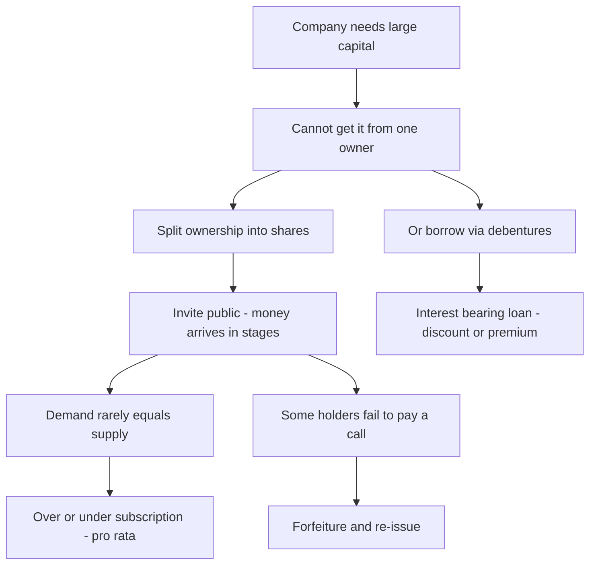
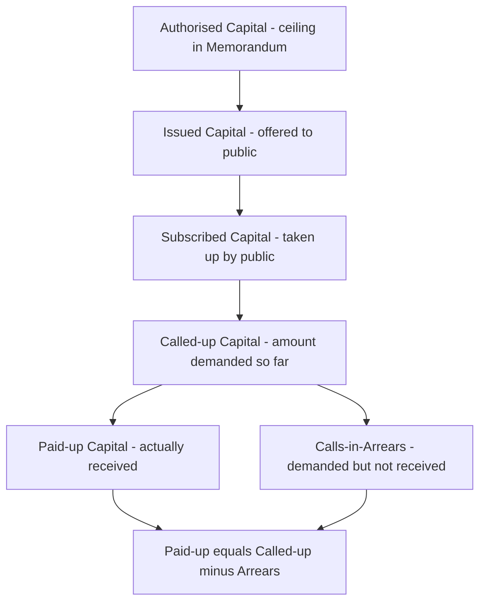
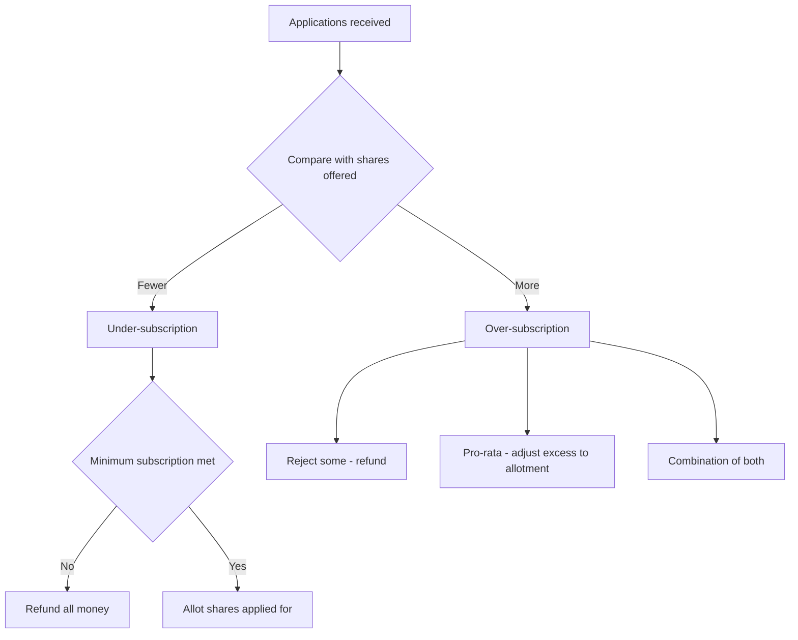
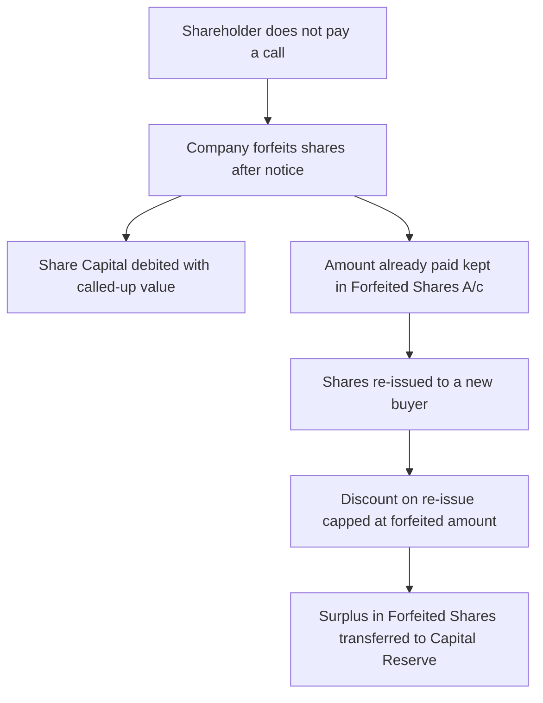

<!-- v2-deep -->

# Foundation: Company Accounts — Introduction (Shares & Debentures)

*Every business you have studied so far — sole trader, partnership, not-for-profit — was owned by people you could point at. A company is different: it is an artificial legal person that raises money from thousands of strangers by selling them small, standardised slices of ownership called shares, and by borrowing from others through instruments called debentures. This chapter teaches the accounting language of that fund-raising: how the rupees flow in stages from application to allotment to calls, what happens when the public asks for more shares than are on offer, and what the company does when a shareholder refuses to pay. Master these mechanics and the entire company-accounts world of CA Inter opens up — because redemption, bonus, rights, buy-back and reconstruction are all just this same machinery run in reverse or at scale.*

---

## 1. The Problem it solves

A sole trader who wants ₹50,000 more capital takes it out of his savings. A partnership firm of four people who want ₹40 lakh split it four ways. But suppose a business needs ₹500 crore to build a steel plant. No single person and no small group has that money. The only way to raise it is to break the ownership of the business into millions of tiny, identical, transferable units and sell them to the general public — a factory worker in Pune buying 50 units, a retired teacher in Chennai buying 200, a mutual fund buying 2 crore. Each unit is a **share**, and the person who holds it is a **shareholder** and a part-owner of the company.

This creates three problems that the accounting in this chapter is built to solve:

1. **The money does not arrive all at once, and it does not arrive from a known person.** When a company invites the public to subscribe, tens of thousands of anonymous applicants send money with their applications. The company has not yet decided who will actually get shares. So the cash cannot immediately be called "capital" — it is, at that instant, closer to a refundable deposit. The accounting must track the money through distinct legal stages (application → allotment → calls) and must be ready to *refund* money to people who applied but were not allotted shares.

2. **The demand rarely matches the supply exactly.** A company offering 1,00,000 shares might receive applications for 3,00,000 shares (**over-subscription**) or for only 80,000 (**under-subscription**). It cannot give everyone what they asked for when over-subscribed, and it cannot legally proceed if it is badly under-subscribed. The chapter's rules on **pro-rata allotment** and **minimum subscription** exist precisely to handle this mismatch fairly and lawfully.

3. **Some shareholders promise to pay and then don't.** A company may collect the price of a share in instalments — some on application, some on allotment, some on later "calls." A shareholder who paid the first two instalments may fail to pay a call. The company needs a lawful mechanism to cancel that person's shares (**forfeiture**), keep the money already paid, and re-sell the shares to someone else (**re-issue**). This is a legal surgery with a precise accounting.

Alongside shares, a company that would rather **borrow** than dilute ownership issues **debentures** — a formal acknowledgement of a loan, usually carrying a fixed rate of interest and a promise to repay. Debentures raise a parallel set of questions: at what price are they issued, how is the discount or premium accounted for, and how is the eventual repayment obligation recognised?

So this chapter is the grammar of corporate fund-raising. It is not glamorous, but it is *foundational*: you cannot understand a company's Balance Sheet, its financial statements, or any advanced corporate-accounting topic until you can read the "Share Capital" and "Borrowings" lines and know exactly how the rupees behind them arrived.


*Figure 1 — Why company fund-raising needs its own accounting grammar.*

---

## 2. Core Idea

**A share is a unit of ownership whose price is collected in legally-defined instalments, and share-capital accounting is simply the disciplined tracking of those instalments — recognising cash when it arrives, moving it out of "money received" and into "capital" only as each stage is legally completed, and keeping premium, arrears, advances and forfeitures in separate boxes so the true owned capital is never overstated.**

Everything else in the chapter — pro-rata, forfeiture, debenture discount — is a special case of that one idea: *keep each rupee in the correct legal box, and never call money "capital" before the law says it has become capital.*

---

## 3. Why it works this way — first principles

Six pieces of underlying logic explain almost every rule you are about to learn. If you understand these, you will rarely need to memorise an entry.

**(a) A company is a separate legal person, so its capital is legally sacred.** Unlike a sole trader who can pull cash out at will, a company's share capital is a buffer that protects creditors. This is the doctrine of **maintenance of capital**. It is *why* you cannot casually reduce capital, *why* forfeited money and premium are ring-fenced, and *why* the Companies Act polices every reduction. The accounting mirrors a legal reality: shareholders' contributed capital is locked in.

**(b) Money received is not capital until the shares are allotted.** When 3 lakh people send application money, the company owes each of them either shares or a refund. Legally there is no share, and therefore no capital, until the board passes an **allotment** resolution accepting the offer. That is why "Share Application A/c" is a *holding* account, not part of capital, until allotment happens — at which point the application money is *transferred* into Share Capital.

**(c) The face (nominal) value and the issue price are two different things.** A share of nominal value ₹10 can be *issued* at ₹10 (at par) or ₹14 (at premium of ₹4). The **₹10 nominal value is share capital**; the **₹4 premium is not capital** — it is a distinct reserve (Securities Premium) that the law restricts to specific uses. This separation exists because capital is what the shareholder's liability is measured against, while premium is a bonus to the company that must not be dressed up as, or freely spent like, ordinary profit. *(Note: issuing shares at a discount below face value is prohibited under the Companies Act, 2013, except for the narrow case of sweat-equity shares — a Foundation exam will not require you to pass "shares issued at a discount" entries.)*

**(d) A shareholder's liability is limited, but the unpaid amount is still a debt.** In a company limited by shares, a member can be asked to pay only up to the unpaid amount on his shares — no more. But until he pays that unpaid amount, it is a genuine receivable. **Calls-in-arrears** is that receivable; **calls-in-advance** is the mirror image, money paid ahead of a call, which is a liability the company owes back into capital later.

**(e) Forfeiture is cancellation, not confiscation of profit.** When shares are forfeited, the shares themselves cease to exist for that holder, so their nominal value must leave Share Capital. But the money the defaulter already paid is *retained* — because he broke the contract, not the company. That retained money sits in a **Forfeited Shares Account** until the shares are re-issued; only after re-issue can any surplus be treated as a **capital reserve** (a non-distributable profit, because it arose from a capital transaction, not from trading).

**(f) A debenture is debt, so its accounting follows lending logic, not ownership logic.** A debenture-holder is a *creditor*, not an owner. Interest on debentures is a *charge against profit* (an expense), unlike dividend on shares which is an *appropriation* of profit. And because a lender will not lend ₹100 to get ₹98 back, companies often sweeten debentures with a **discount on issue** (raise ₹98, promise to repay ₹100) or a **premium on redemption** (raise ₹100, promise to repay ₹105). Those sweeteners are *losses/costs of borrowing*, recognised as such.

Hold these six ideas in your head and the entries stop being arbitrary. They become the only sensible way to record what is actually, legally happening.

---

## 4. Full technical content

### 4.1 What is a company, and what kinds are there?

A **company** is an association of persons, registered under the Companies Act, 2013, having a separate legal personality, perpetual succession, a common seal (optional now), limited liability, and freely transferable shares (in a public company). For accounting purposes the key classifications are:

| Basis of classification | Types | Accounting relevance |
|---|---|---|
| **Liability of members** | Limited by shares; Limited by guarantee; Unlimited | "Limited by shares" is the default this chapter assumes — member's liability capped at unpaid amount on shares |
| **Number of members / access to public funds** | Public company; Private company; One Person Company (OPC) | Only a **public** company can invite the *general public* to subscribe; a private company raises capital privately |
| **Control / ownership** | Holding company; Subsidiary; Associate | Relevant later for consolidation (CA Inter) |
| **Listing** | Listed; Unlisted | Listed companies face SEBI rules on issue of capital |

For this Foundation chapter, assume a **public company limited by shares** unless told otherwise.

### 4.2 The vocabulary of share capital

The word "capital" means several different things depending on which stage you are looking at. The Companies Act and Schedule III require these to be disclosed separately:

| Term | Meaning |
|---|---|
| **Authorised / Nominal / Registered capital** | The maximum capital the company is *authorised* by its Memorandum to raise. A ceiling, not an amount raised. |
| **Issued capital** | The part of authorised capital actually *offered* to the public for subscription. |
| **Subscribed capital** | The part of issued capital that the public has actually *agreed to take up* (applied for and been allotted). |
| **Called-up capital** | The part of the subscribed (nominal) amount the company has so far *demanded* (called) from shareholders. |
| **Paid-up capital** | Called-up capital *minus calls-in-arrears* — i.e., what has actually been received. Paid-up = Called-up − Calls-in-arrears. |
| **Reserve capital** | The portion of uncalled capital that the company resolves (by special resolution) to call **only in the event of winding up**. Not to be confused with "capital reserve." |


*Figure 2 — The nested layers of capital. Each is a subset of the one above it.*

### 4.3 Classes of shares

| Feature | Equity (Ordinary) Shares | Preference Shares |
|---|---|---|
| **Dividend** | Fluctuating, decided each year | Fixed rate, paid *before* equity |
| **Priority on winding-up** | Last, after preference | Ahead of equity for capital repayment |
| **Voting rights** | Full voting rights | Restricted (vote only on matters affecting them) |
| **Sub-types** | With or without differential rights | Cumulative/Non-cumulative; Participating/Non-participating; Convertible/Non-convertible; Redeemable/Irredeemable |

**Cumulative** preference shares carry forward unpaid dividends of loss years; **redeemable** ones must be bought back by the company. (Redemption itself is a CA Inter topic — here you only need to know the vocabulary.)

### 4.4 The stages of collecting share money

When shares are issued to the public, the issue price is collected in instalments. The typical sequence for a ₹10 share issued at ₹14 (₹4 premium) might be:

| Stage | Legal event | Amount in this example |
|---|---|---|
| **Application** | Public applies, sends money with application form | ₹5 (say ₹4 capital + ₹1 premium) |
| **Allotment** | Board accepts applications, allots shares, a contract is formed | ₹6 (say ₹3 capital + ₹3 premium) |
| **First Call** | Company demands a further instalment | ₹2 (capital) |
| **Second / Final Call** | Company demands the last instalment | ₹1 (capital) |
| | **Totals** | ₹10 capital + ₹4 premium = ₹14 |

The company decides the split; the exam gives it to you. The **premium**, whatever stage it is collected at, always goes into **Securities Premium Account**, never into Share Capital.

### 4.5 The core journal entries (issue at par and at premium)

Below is the master set of entries. Learn the *shape* — the reasoning is always: cash comes in (Bank Dr), a holding account is created, then the holding account is emptied into Capital (and Premium) as each stage is legally completed.

**(1) On receipt of application money:**
```
Bank A/c                          Dr.
    To Share Application A/c
(Being application money received on ... shares)
```

**(2) On allotment — application money transferred to capital (and premium):**
```
Share Application A/c             Dr.
    To Share Capital A/c
    To Securities Premium A/c        (if any premium collected on application)
(Being application money on allotted shares transferred)
```

**(3) Allotment money becoming due:**
```
Share Allotment A/c               Dr.
    To Share Capital A/c
    To Securities Premium A/c        (if premium collected at allotment)
(Being allotment money due on ... shares)
```

**(4) On receipt of allotment money:**
```
Bank A/c                          Dr.
    To Share Allotment A/c
```

**(5) Call money becoming due (repeat for each call):**
```
Share First Call A/c              Dr.
    To Share Capital A/c
```

**(6) On receipt of call money:**
```
Bank A/c                          Dr.
    To Share First Call A/c
```

Note the discipline: "**...A/c due**" entries are the *demand* (they raise the receivable and increase Share Capital); the "**Bank Dr**" entries are the *collection*. Keeping demand and collection separate is what lets you spot arrears.

### 4.6 Calls-in-arrears and calls-in-advance

**Calls-in-Arrears (CIA):** money called but not yet received. Two treatments are permitted:
- *Without a separate account:* the relevant Allotment/Call account simply shows a debit balance (money still due).
- *With a separate account:* transfer the unpaid amount to a **Calls-in-Arrears A/c**:
```
Calls-in-Arrears A/c              Dr.
    To Share Allotment / Call A/c
```
Calls-in-arrears is **shown as a deduction from Called-up capital** on the Balance Sheet to arrive at Paid-up capital. The Articles (Table F) permit charging **interest up to 10% p.a.** on arrears.

**Calls-in-Advance (CIAdv):** money received for a call *not yet made*. It is a **liability** (the company owes it back into capital when the call is eventually made). Table F allows paying **interest up to 12% p.a.** on advance. Entry on receipt:
```
Bank A/c                          Dr.
    To Calls-in-Advance A/c
```
When the call is later made, Calls-in-Advance is transferred to the relevant Call account. Calls-in-advance is shown under "Other Current Liabilities," **not** added to paid-up capital, and carries **no voting rights** until the call is actually made.

### 4.7 Over-subscription, under-subscription and pro-rata allotment

**Under-subscription:** applications received are *fewer* than shares offered. Legal safeguard: the company must receive a **minimum subscription** (at least 90% of the issued amount per SEBI norms) or it must refund all application money. If minimum subscription is met, allotment proceeds for the shares applied for.

**Over-subscription:** applications exceed shares on offer. The board cannot allot more shares than were issued, so it deals with the excess in one (or a mix) of three ways:

| Method | What happens to excess application money |
|---|---|
| **(a) Outright rejection** | Reject some applications entirely; **refund** their money in full |
| **(b) Pro-rata allotment** | Allot fewer shares than applied for, to *all* (or a group of) applicants; the **excess application money is adjusted against allotment** (and, if still excess, refunded) |
| **(c) Combination** | Reject some, pro-rata the rest |

**Pro-rata mechanics:** if 1,00,000 shares are offered and 1,50,000 are applied for on a pro-rata basis, the ratio is **1,50,000 : 1,00,000 = 3 : 2**. An applicant for 3,000 shares gets **2,000**. The excess money that applicant paid on the 1,000 shares he did *not* get is not refunded straight away — it is **carried forward and adjusted against the allotment money** he owes. Entry:
```
Share Application A/c             Dr.
    To Share Allotment A/c              (excess adjusted)
    To Bank A/c                          (any balance refunded)
```
Getting this adjustment right is the single most-examined numerical skill in the chapter.


*Figure 3 — Decision logic for subscription outcomes.*

### 4.8 Forfeiture of shares

When a shareholder fails to pay allotment or a call, the company (if the Articles permit) may **forfeit** the shares after due notice. Forfeiture *cancels* the shares. The accounting must:
1. **Remove the called-up nominal value** from Share Capital (Debit Share Capital with the *called-up* amount per share, not the issue price).
2. **Cancel the unpaid amounts** (the allotment/calls not received) — Credit those receivable accounts.
3. **Retain the amount already paid** by the defaulter — Credit Forfeited Shares (Shares Forfeited) A/c.

**Entry on forfeiture (shares issued at par):**
```
Share Capital A/c    Dr.   (No. of shares x called-up value per share)
    To Forfeited Shares A/c   (amount already received on these shares)
    To Share Allotment A/c    (unpaid allotment, if any)
    To Share Calls A/c        (unpaid calls)
```

**Special rule when shares were issued at a premium:** if the premium was **already received**, it is *not* cancelled on forfeiture — Securities Premium once received stays. If the premium was **due but not received**, it *is* cancelled (Debit Securities Premium A/c) on forfeiture, because that premium never actually came in.

### 4.9 Re-issue of forfeited shares

Forfeited shares are the company's to re-sell. It may re-issue them at any price, but with a hard limit: the **discount allowed on re-issue cannot exceed the amount forfeited (paid-up) on those shares.** In other words, (amount received from new buyer) + (amount forfeited) must at least equal the paid-up/called-up value being credited to capital.

**Entry on re-issue:**
```
Bank A/c              Dr.   (amount received on re-issue)
Forfeited Shares A/c  Dr.   (discount allowed, i.e., the shortfall)
    To Share Capital A/c     (paid-up value credited)
```

**After re-issue, transfer the surplus to Capital Reserve:** the balance left in Forfeited Shares A/c relating to the *re-issued* shares is a profit of a capital nature and is transferred to **Capital Reserve** (a non-distributable reserve).
```
Forfeited Shares A/c  Dr.
    To Capital Reserve A/c
```
**Key nuance:** only the forfeited amount **of the shares actually re-issued** goes to Capital Reserve. If only some forfeited shares are re-issued, the forfeited money on the *un-re-issued* shares stays in Forfeited Shares A/c until they too are re-issued.


*Figure 4 — The forfeiture and re-issue cycle.*

### 4.10 Issue of debentures

A **debenture** is a written instrument acknowledging a debt, usually under the company's seal, carrying a fixed rate of interest and specifying repayment terms. Because it is a *loan*, the money raised is a **liability** (Long-term Borrowings), not capital.

Debentures can be issued at **par**, at a **premium**, or at a **discount**, and redeemed at par or at a premium. Combining issue price and redemption terms gives the classic cases. The face value must always be credited to **Debentures A/c** at its nominal amount; the difference between cash received and the redemption commitment is recorded through discount/premium accounts.

**(a) Issued at par, redeemable at par:**
```
Bank A/c                              Dr.   (face value)
    To Debentures A/c                        (face value)
```

**(b) Issued at premium, redeemable at par:**
```
Bank A/c                              Dr.   (cash = face + premium)
    To Debentures A/c                        (face value)
    To Securities Premium A/c               (premium on issue)
```

**(c) Issued at discount, redeemable at par:**
```
Bank A/c                              Dr.   (cash received)
Discount on Issue of Debentures A/c   Dr.   (discount)
    To Debentures A/c                        (face value)
```
The **Discount on Issue** is a capital loss, shown on the assets side (or netted against the debenture liability under Schedule III) and written off over the life of the debentures.

**(d) Issued at par, redeemable at a premium:**
```
Bank A/c                              Dr.   (face value)
Loss on Issue of Debentures A/c       Dr.   (premium payable on redemption)
    To Debentures A/c                        (face value)
    To Premium on Redemption of Debentures A/c  (a liability, the extra to be repaid)
```
Here **no premium is received** — the "premium" is an *extra amount the company will have to pay later*, so it is recognised now as a **Loss on Issue** with a matching liability (Premium on Redemption).

**Debenture interest** is a charge against profit. On payment:
```
Debenture Interest A/c    Dr.
    To Bank A/c   (net of TDS)
    To TDS Payable A/c
```
and Debenture Interest is transferred to the Statement of Profit & Loss.

**Debentures issued as collateral security** (given to a bank as a backup security for a loan) may be recorded either by a note only, or by the entry: Debenture Suspense A/c Dr. To Debentures A/c — but this is a light-touch topic at Foundation.

### 4.11 Shares vs Debentures — the master comparison

| Point | Share | Debenture |
|---|---|---|
| Holder is | Owner (member) | Creditor (lender) |
| Return | Dividend (appropriation of profit) | Interest (charge against profit) |
| Return is | Variable (equity) / fixed (pref) | Fixed |
| Paid | Only out of profits | Whether or not there is profit |
| On winding-up | Repaid last | Repaid before shareholders |
| Voting | Yes (equity) | No |
| Can be issued at discount | No (except sweat equity) | Yes |
| Convertible into | — | May be convertible into shares |

---

## 5. Worked examples

### Example 1 — Issue at premium, fully subscribed, with an arrear

**Facts.** Sunrise Ltd issued **10,000 equity shares of ₹10 each at a premium of ₹2 per share** (issue price ₹12), payable:
- On application ₹3 (including ₹1 premium)
- On allotment ₹5 (including ₹1 premium)
- On first & final call ₹4

All shares were applied for and allotted. All money was received **except the first & final call on 200 shares** held by Mr. A, which remained unpaid.

**Step 1 — Amounts per stage (all 10,000 shares).**
- Application: 10,000 × ₹3 = ₹30,000 (of which premium 10,000 × ₹1 = ₹10,000; capital ₹20,000)
- Allotment: 10,000 × ₹5 = ₹50,000 (premium 10,000 × ₹1 = ₹10,000; capital ₹40,000)
- Call: 10,000 × ₹4 = ₹40,000 (all capital). But 200 shares × ₹4 = ₹800 **not received**, so cash on call = ₹39,200.

**Step 2 — Journal entries.**

| Particulars | Dr (₹) | Cr (₹) |
|---|---|---|
| Bank A/c ................................ Dr | 30,000 | |
| &nbsp;&nbsp;To Share Application A/c | | 30,000 |
| Share Application A/c ................ Dr | 30,000 | |
| &nbsp;&nbsp;To Share Capital A/c (10,000 × ₹2) | | 20,000 |
| &nbsp;&nbsp;To Securities Premium A/c (10,000 × ₹1) | | 10,000 |
| Share Allotment A/c ................. Dr | 50,000 | |
| &nbsp;&nbsp;To Share Capital A/c (10,000 × ₹4) | | 40,000 |
| &nbsp;&nbsp;To Securities Premium A/c (10,000 × ₹1) | | 10,000 |
| Bank A/c ................................ Dr | 50,000 | |
| &nbsp;&nbsp;To Share Allotment A/c | | 50,000 |
| Share First & Final Call A/c .... Dr | 40,000 | |
| &nbsp;&nbsp;To Share Capital A/c (10,000 × ₹4) | | 40,000 |
| Bank A/c ................................ Dr | 39,200 | |
| Calls-in-Arrears A/c ............... Dr | 800 | |
| &nbsp;&nbsp;To Share First & Final Call A/c | | 40,000 |

**Step 3 — Verify.** Total capital credited = 20,000 + 40,000 + 40,000 = **₹1,00,000** (= 10,000 × ₹10 ✓). Securities Premium = 10,000 + 10,000 = **₹20,000** (= 10,000 × ₹2 ✓). Cash received = 30,000 + 50,000 + 39,200 = **₹1,19,200**. Expected cash = full ₹1,20,000 − arrear ₹800 = **₹1,19,200 ✓**.

**Step 4 — Balance Sheet extract (Schedule III).**

| Equity & Liabilities | ₹ |
|---|---|
| Share Capital: Called-up 10,000 × ₹10 | 1,00,000 |
| &nbsp;&nbsp;*Less:* Calls-in-Arrears | (800) |
| **Paid-up capital** | **99,200** |
| Reserves & Surplus: Securities Premium | 20,000 |
| **Total** | **1,19,200** |

| Assets | ₹ |
|---|---|
| Cash & Cash Equivalents (Bank) | 1,19,200 |
| **Total** | **1,19,200** |

Balance Sheet tallies at **₹1,19,200 ✓**.

---

### Example 2 — Over-subscription with pro-rata and adjustment of excess

**Facts.** Meghna Ltd offered **20,000 equity shares of ₹10 each at par**, payable ₹3 on application, ₹4 on allotment, ₹3 on first & final call. Applications were received for **30,000 shares**. The company made a **pro-rata allotment to all applicants**, and applied the excess application money towards allotment. All allotment and call money was duly received.

**Step 1 — The pro-rata ratio.** Applied 30,000 : Allotted 20,000 = **3 : 2**. So an applicant for 3 shares gets 2.

**Step 2 — Application money and the excess.**
- Total application money received = 30,000 × ₹3 = **₹90,000**.
- Application money *properly attributable to allotted shares* = 20,000 × ₹3 = **₹60,000** (this is transferred to capital).
- **Excess application money** = ₹90,000 − ₹60,000 = **₹30,000**. This excess is carried forward and adjusted against allotment (no refund, since a pure pro-rata was made to all).

**Step 3 — Allotment money.**
- Allotment due = 20,000 × ₹4 = **₹80,000**.
- Less excess application money adjusted = **₹30,000**.
- **Cash to be received on allotment** = 80,000 − 30,000 = **₹50,000**.

**Step 4 — Journal entries.**

| Particulars | Dr (₹) | Cr (₹) |
|---|---|---|
| Bank A/c ................................ Dr | 90,000 | |
| &nbsp;&nbsp;To Share Application A/c | | 90,000 |
| Share Application A/c ................ Dr | 90,000 | |
| &nbsp;&nbsp;To Share Capital A/c (20,000 × ₹3) | | 60,000 |
| &nbsp;&nbsp;To Share Allotment A/c (excess) | | 30,000 |
| Share Allotment A/c ................. Dr | 80,000 | |
| &nbsp;&nbsp;To Share Capital A/c (20,000 × ₹4) | | 80,000 |
| Bank A/c ................................ Dr | 50,000 | |
| &nbsp;&nbsp;To Share Allotment A/c | | 50,000 |
| Share First & Final Call A/c .... Dr | 60,000 | |
| &nbsp;&nbsp;To Share Capital A/c (20,000 × ₹3) | | 60,000 |
| Bank A/c ................................ Dr | 60,000 | |
| &nbsp;&nbsp;To Share First & Final Call A/c | | 60,000 |

**Step 5 — Verify.** Share Capital credited = 60,000 + 80,000 + 60,000 = **₹2,00,000** (= 20,000 × ₹10 ✓). 

Share Allotment A/c: Debited 80,000; Credited (30,000 excess + 50,000 bank) = 80,000 → **balances to nil ✓**. 

Total cash = 90,000 + 50,000 + 60,000 = **₹2,00,000**, which equals full paid-up capital ✓.

**Balance Sheet:** Share Capital (paid-up) ₹2,00,000 = Bank ₹2,00,000. **Tallies ✓.**

---

### Example 3 — Forfeiture and re-issue (shares issued at a premium)

**Facts.** Kaveri Ltd issued equity shares of **₹10 each at a premium of ₹2**, payable ₹2 on application, ₹5 on allotment (**including the ₹2 premium**), ₹3 on first call, ₹2 on final call. Mr. B, holding **300 shares**, paid application and allotment but **failed to pay both calls (₹3 + ₹2 = ₹5 per share)**. His shares were **forfeited**. Later, **200 of these forfeited shares were re-issued to Mr. C at ₹8 per share, fully paid up**.

**Step 1 — What Mr. B had paid before forfeiture (per share).**
- Application ₹2 + Allotment ₹5 = **₹7 received** per share. But allotment ₹5 includes ₹2 premium, so of that ₹7: **capital portion = ₹2 (appln) + ₹3 (allot capital) = ₹5**, and **premium = ₹2**.
- **Not received:** first call ₹3 + final call ₹2 = ₹5 (all capital), on 300 shares.

Since the **premium was already received**, it is *not* reversed on forfeiture.

**Step 2 — Forfeiture entry (300 shares).** On forfeiture, Share Capital is debited with the **called-up value**. All four instalments had been called (application, allotment, first call, final call), so called-up = full ₹10 per share.
- Share Capital debit = 300 × ₹10 = **₹3,000**.
- Calls unpaid to be cancelled = 300 × ₹5 = **₹1,500** (first call ₹900 + final call ₹600).
- Amount retained in Forfeited Shares A/c = capital actually received = 300 × ₹5 = **₹1,500**.

| Particulars | Dr (₹) | Cr (₹) |
|---|---|---|
| Share Capital A/c (300 × ₹10) ......... Dr | 3,000 | |
| &nbsp;&nbsp;To Share First Call A/c (300 × ₹3) | | 900 |
| &nbsp;&nbsp;To Share Final Call A/c (300 × ₹2) | | 600 |
| &nbsp;&nbsp;To Forfeited Shares A/c (300 × ₹5) | | 1,500 |

Check: 3,000 = 900 + 600 + 1,500 ✓ (premium untouched, correctly).

**Step 3 — Re-issue of 200 shares at ₹8, fully paid (₹10).**
- Cash received = 200 × ₹8 = **₹1,600**.
- Discount allowed on re-issue = 200 × (₹10 − ₹8) = 200 × ₹2 = **₹400**.
- This ₹400 is debited to Forfeited Shares A/c. (Permissible? Forfeited amount per share = ₹5; discount ₹2 < ₹5 ✓.)

| Particulars | Dr (₹) | Cr (₹) |
|---|---|---|
| Bank A/c (200 × ₹8) ...................... Dr | 1,600 | |
| Forfeited Shares A/c (200 × ₹2) ..... Dr | 400 | |
| &nbsp;&nbsp;To Share Capital A/c (200 × ₹10) | | 2,000 |

Check: 1,600 + 400 = 2,000 ✓.

**Step 4 — Transfer surplus on re-issued shares to Capital Reserve.**
- Forfeited amount per share = ₹5. On the **200 re-issued** shares, forfeited money = 200 × ₹5 = ₹1,000.
- Less discount used on re-issue = ₹400.
- **Surplus to Capital Reserve = ₹1,000 − ₹400 = ₹600.**

| Particulars | Dr (₹) | Cr (₹) |
|---|---|---|
| Forfeited Shares A/c ...................... Dr | 600 | |
| &nbsp;&nbsp;To Capital Reserve A/c | | 600 |

**Step 5 — Verify the Forfeited Shares A/c.**

| Forfeited Shares A/c | Dr (₹) | Cr (₹) |
|---|---|---|
| To Share Capital (re-issue discount) | 400 | |
| To Capital Reserve | 600 | |
| By Share Capital (forfeiture, 300 sh) | | 1,500 |
| **Balance c/d (100 shares not yet re-issued)** | 500 | |
| **Totals** | **1,500** | **1,500** |

The **balance ₹500** in Forfeited Shares A/c corresponds to the **100 shares still un-re-issued** (100 × ₹5 forfeited = ₹500). It stays there until those shares are re-issued — a correct, tallying result ✓. Only the profit on the *re-issued* 200 shares (₹600) hit Capital Reserve, exactly as principle (e) requires.

---

## 6. Connections — what this unlocks in CA Inter

This Foundation chapter is the *literal* prerequisite for a large block of **CA Intermediate Paper 1 (Advanced Accounting)**:

- **Redemption of Preference Shares** (Inter): you buy back the preference shares issued here; needs the "maintenance of capital" and Capital Redemption Reserve logic that starts with premium and reserve concepts introduced above.
- **Bonus Issue** and **Rights Issue** (Inter): both re-use Securities Premium and reserves as the funding source — you must already know what those accounts are.
- **Buy-back of Securities** (Inter): the reverse of issue; the arithmetic of forfeiture/capital reserve here is its foundation.
- **Redemption of Debentures** (Inter): directly continues section 4.10 — the Discount/Loss on Issue and Premium on Redemption accounts opened here are closed there, plus DRR and sinking-fund methods.
- **Underwriting of Shares & Debentures** (Inter): builds on over/under-subscription and pro-rata logic.
- **Company Financial Statements — Schedule III** (Inter): the Balance Sheet presentation of Share Capital, Reserves & Surplus and Borrowings you practised in the worked examples is exactly what Schedule III formalises.
- **Internal Reconstruction & Amalgamation** (Inter): both manipulate share capital and reserves wholesale; impossible without this grounding.

In short: **almost every company-accounts chapter in CA Inter is this chapter, scaled up or run in reverse.**

---

## 7. Traps & common mistakes

1. **Debiting Share Capital with the issue price instead of the called-up value on forfeiture.** On forfeiture, Share Capital is debited only with the **nominal called-up amount** (₹10 here), *never* including premium. Premium already received is never reversed.
2. **Reversing premium that was already received.** If the premium was collected before default, it stays in Securities Premium on forfeiture. Only *unreceived* premium is cancelled.
3. **Refunding excess application money in a pure pro-rata question.** In a pro-rata to all applicants, the excess is **adjusted against allotment first**, not refunded. Refund only the balance, if the question specifically allows it.
4. **Transferring the whole Forfeited Shares balance to Capital Reserve when only some shares are re-issued.** Only the profit on the **re-issued** shares goes to Capital Reserve; the rest waits.
5. **Adding calls-in-advance to paid-up capital.** Calls-in-advance is a **liability**, shown separately; it is not part of paid-up capital and carries no voting rights.
6. **Deducting calls-in-arrears from the wrong figure.** Paid-up = **Called-up − Calls-in-arrears**. Do not deduct arrears from authorised or issued capital.
7. **Treating debenture interest as an appropriation.** Debenture interest is a **charge against profit** (expense), unlike dividend. It is payable whether or not there is a profit.
8. **Issuing shares at a discount.** Prohibited under the Companies Act, 2013 (except sweat equity). A Foundation problem will not ask you to record it — if you think you need a "discount on shares," re-read the question.
9. **Discount on re-issue exceeding forfeited amount.** The discount allowed on re-issue can never exceed the amount forfeited on those shares. If your entry needs more discount than was forfeited, you have made an error.
10. **Forgetting that "Reserve Capital" ≠ "Capital Reserve."** Reserve capital = uncalled capital callable only on winding-up. Capital Reserve = a non-distributable reserve (e.g., profit on re-issue). Totally different animals.

---

## 8. First-principles recap

- A **company** raises large capital by splitting ownership into standardised, transferable **shares**, or by borrowing through **debentures**; each needs its own accounting grammar because the money arrives from strangers, in stages, and rarely matches supply.
- Money received is **not capital until shares are allotted** — the application account is a holding box that is emptied into Share Capital (and Securities Premium) only as each legal stage completes.
- **Nominal value is capital; premium is a separate ring-fenced reserve.** Paid-up capital = Called-up − Calls-in-arrears; calls-in-advance is a liability, not capital.
- On **over-subscription**, excess money is rejected-and-refunded or adjusted via **pro-rata**; on **under-subscription**, minimum subscription must be met or all money is refunded.
- **Forfeiture cancels shares** (remove called-up value from capital, retain what was paid); **re-issue** resells them with discount capped at the forfeited amount, and only the surplus on re-issued shares becomes **Capital Reserve**.
- A **debenture is a loan**, so interest is a charge against profit, and issue discount / redemption premium are recognised as costs of borrowing.

---

## 9. Quick-reference

| Item | Formula / Entry format / Key point |
|---|---|
| Paid-up capital | Called-up capital − Calls-in-arrears |
| Pro-rata ratio | Shares applied : Shares allotted |
| Excess application money | (Applied − Allotted) × application money per share → adjust vs allotment |
| Application received | Bank Dr / To Share Application |
| Application → capital | Share Application Dr / To Share Capital, To Securities Premium |
| Allotment due | Share Allotment Dr / To Share Capital, To Securities Premium |
| Calls-in-arrears | CIA Dr / To Allotment or Call A/c; shown as deduction from called-up capital |
| Calls-in-advance | Bank Dr / To Calls-in-Advance A/c; a liability |
| Forfeiture (at par) | Share Capital Dr (called-up) / To Forfeited Shares, To unpaid Allotment/Calls |
| Re-issue | Bank Dr + Forfeited Shares Dr (discount) / To Share Capital |
| Surplus on re-issue | Forfeited Shares Dr / To Capital Reserve (only on re-issued shares) |
| Max discount on re-issue | ≤ amount forfeited on those shares |
| Debenture at discount | Bank Dr + Discount on Issue Dr / To Debentures |
| Debenture redeemable at premium | Bank Dr + Loss on Issue Dr / To Debentures, To Premium on Redemption |
| Interest on calls-in-arrears (Table F) | up to 10% p.a. |
| Interest on calls-in-advance (Table F) | up to 12% p.a. |
| Minimum subscription (SEBI) | 90% of the issue |
| Governing law | Companies Act, 2013; issue at discount prohibited (except sweat equity, Sec 54) |
