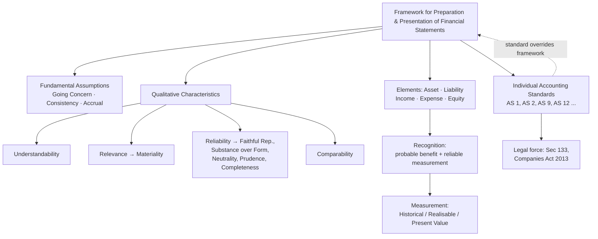

# Q&A — Why Accounting Standards Exist (and the Framework beneath them)

*CA Intermediate — Advanced Accounting. Standards referenced: ICAI Accounting Standards (AS). Amounts in Rupees (₹).*

---

## Section A — Concept-Check (short answer)

**A1. In one sentence, why do Accounting Standards exist at all?**
They exist to reduce the *choices* management has when telling the story of a business, so that two firms in similar circumstances produce comparable numbers and users can trust the financial statements without personally auditing every judgement.

**A2. Name the three problems that arise in the absence of standards.**
(i) *Non-comparability* — every firm invents its own rules, so profits cannot be compared; (ii) *Manipulation* — management picks the treatment that flatters results; (iii) *Information asymmetry* — outsiders (lenders, investors) cannot tell a genuinely profitable firm from a dressed-up one.

**A3. What is the difference between the *Framework* and an *Accounting Standard*?**
The Framework (ICAI's *Framework for Preparation and Presentation of Financial Statements*) is the constitution — it defines assets, liabilities, income, expenses, and the qualitative characteristics. A Standard is a specific law built on that constitution (e.g. AS 2 on inventory). When a standard is silent, you reason from the Framework; where a standard exists, it overrides the Framework.

**A4. State the four principal qualitative characteristics under the Framework.**
Understandability, Relevance, Reliability, Comparability. Relevance carries *materiality*; Reliability carries *faithful representation, substance over form, neutrality, prudence, completeness*.

**A5. Define "substance over form" and give a one-line example.**
Transactions are accounted for by their economic reality, not their legal wrapper. Example: a "sale with a buy-back at a pre-agreed price" is a financing (loan) in substance, so no sale/profit is booked despite the legal sale document.

**A6. What are the fundamental accounting assumptions under AS 1, and what happens if one is not followed?**
Going Concern, Consistency, Accrual. They need not be disclosed if followed; if *not* followed, the fact must be *disclosed*.

**A7. Distinguish "recognition" from "measurement".**
Recognition asks *whether* an item enters the statements (does it meet the definition + probable inflow/outflow + reliable measurement?). Measurement asks *at what amount* — historical cost, realisable value, present value, etc.

**A8. Why is "prudence" not the same as deliberately understating profit?**
Prudence means exercising caution under uncertainty — do not overstate assets/income, do not understate liabilities/expenses. But creating *secret reserves* or excessive provisions is a violation of *neutrality*; the estimate must be unbiased, merely cautious.

**A9. What is the status of Accounting Standards in law?**
Under Section 133 of the Companies Act, 2013, standards notified by the Central Government (on ICAI/NFRA recommendation) are legally binding on companies. For non-corporate entities, ICAI mandates them for its members' audits.

**A10. What does "true and fair" have to do with standards?**
Compliance with applicable AS is presumed to give a true and fair view. Deviation is permitted only in the rare case where compliance would be misleading — and then full disclosure of the deviation, its reason and financial effect is required.

---

## Section B — Graded Computational Problems

Each problem states the AS logic, solves step-by-step, gives entries, and self-verifies.

### B1 (Easy) — Accrual vs Cash: getting the concept into numbers

A trader's records for the year ended 31 Mar 2026 show: cash received from customers ₹8,00,000; opening debtors ₹1,20,000; closing debtors ₹1,50,000. Cash paid to suppliers ₹5,00,000; opening creditors ₹90,000; closing creditors ₹70,000. Compute **sales** and **purchases** on the accrual basis.

**Logic (AS 1 – Accrual):** income/expense is recognised when *earned/incurred*, not when cash moves.

**Step 1 — Sales.**
Sales = Cash received + Closing debtors − Opening debtors
= 8,00,000 + 1,50,000 − 1,20,000 = **₹8,30,000**

**Step 2 — Purchases.**
Purchases = Cash paid + Closing creditors − Opening creditors
= 5,00,000 + 70,000 − 90,000 = **₹4,80,000**

**Self-verify (Debtors control a/c):** Opening 1,20,000 + Sales 8,30,000 = 9,50,000; less cash 8,00,000 = closing 1,50,000. ✓
**Self-verify (Creditors control a/c):** Opening 90,000 + Purchases 4,80,000 = 5,70,000; less cash 5,00,000 = closing 70,000. ✓

---

### B2 (Moderate) — Substance over form: sale-and-buyback

On 1 Apr 2025 Alpha Ltd "sells" goods (cost ₹4,00,000) to a financier for ₹5,00,000 and undertakes to buy them back on 31 Mar 2026 for ₹5,60,000. Show the correct treatment.

**Logic:** The 12% mark-up (56,000/5,00,000) is *interest*. The financier bears no inventory risk; Alpha retains it. In substance this is a **secured borrowing**, not a sale (substance over form).

**Entries:**

| Date | Particulars | Dr (₹) | Cr (₹) |
|---|---|---|---|
| 1 Apr 25 | Bank A/c | 5,00,000 | |
| | To Borrowing A/c | | 5,00,000 |
| 31 Mar 26 | Interest A/c | 60,000 | |
| | To Borrowing A/c | | 60,000 |
| 31 Mar 26 | Borrowing A/c | 5,60,000 | |
| | To Bank A/c | | 5,60,000 |

Inventory of ₹4,00,000 **stays on Alpha's books** throughout; **no ₹1,00,000 profit** is recognised on 1 Apr 2025.

**Self-verify:** Borrowing opens 5,00,000, +60,000 interest = 5,60,000, repaid 5,60,000 → nil. P&L impact = interest ₹60,000 expense only. ✓ Had form prevailed, Alpha would have booked ₹1,00,000 phantom profit and lost the asset — exactly the manipulation standards exist to stop.

---

### B3 (Moderate) — Prudence & the asymmetry of gains and losses

Beta Ltd, 31 Mar 2026, has: (a) a lawsuit it is *likely* to lose, estimated damages ₹2,00,000; (b) a lawsuit it is *likely* to win, expected award ₹3,00,000; (c) closing stock cost ₹6,00,000, net realisable value ₹5,40,000. Determine the net effect on profit.

**Logic (Prudence, AS 4/AS 2):** recognise probable *losses*; do **not** recognise probable *gains* until realised.

- (a) Probable loss → **provide ₹2,00,000** (expense).
- (b) Probable gain → **ignore** (contingent asset, not recognised).
- (c) Stock at *lower of cost and NRV* (AS 2) → write down 6,00,000 − 5,40,000 = **₹60,000** loss.

**Net reduction in profit = 2,00,000 + 60,000 = ₹2,60,000.**

**Entries:**

| Particulars | Dr (₹) | Cr (₹) |
|---|---|---|
| P&L (Provision for damages) | 2,00,000 | |
| To Provision for Claim | | 2,00,000 |
| P&L (Stock write-down) | 60,000 | |
| To Inventory | | 60,000 |

**Self-verify:** Symmetry test — if we had booked the ₹3,00,000 gain, profit would be *overstated* and neutrality-cum-prudence violated. Correct impact is a ₹2,60,000 hit; the winnable claim is only *disclosed* as a contingent asset if virtually certain. ✓

---

### B4 (Hard) — Deviation from a Standard: the "true and fair" override, fully reconciled

Gamma Ltd depreciates plant on WDV. During FY 2025-26 it changed to SLM because SLM better reflects the pattern of use (a change in method → treated as change in *estimate/policy* requiring disclosure). Plant cost ₹10,00,000, bought 1 Apr 2023, useful life 5 years, no residual. WDV rate 40%. On 1 Apr 2025 the company switches to SLM *retrospectively* (recomputing from 2023). Compute the adjustment.

**Step 1 — Depreciation already charged under WDV (2023-24, 2024-25):**
- 2023-24: 40% × 10,00,000 = 4,00,000 → WDV 6,00,000
- 2024-25: 40% × 6,00,000 = 2,40,000 → WDV 3,60,000
- Total charged under WDV = **6,40,000**

**Step 2 — Depreciation that *should* have stood under SLM to 31 Mar 2025:**
SLM annual = 10,00,000 / 5 = 2,00,000. For 2 years = **4,00,000**.

**Step 3 — Excess already charged (the retrospective adjustment):**
6,40,000 − 4,00,000 = **₹2,40,000 written back** (credited to P&L in 2025-26, disclosed as change with effect).

**Step 4 — Depreciation for 2025-26 onward under SLM:** ₹2,00,000 p.a.

**Entry for the adjustment (1 Apr 2025):**

| Particulars | Dr (₹) | Cr (₹) |
|---|---|---|
| Accumulated Depreciation A/c | 2,40,000 | |
| To P&L A/c (Excess depreciation written back) | | 2,40,000 |

**Self-verify — book value must agree both ways.**
- Under old WDV, carrying value on 1 Apr 2025 = ₹3,60,000.
- After write-back, accumulated depreciation = 6,40,000 − 2,40,000 = 4,00,000, so carrying value = 10,00,000 − 4,00,000 = **₹6,00,000**, which equals cost less 2 years SLM (10,00,000 − 4,00,000). ✓
- Remaining SLM over 3 years: 6,00,000 / 3 = 2,00,000 p.a. — consistent with Step 4. ✓

*Disclosure required:* nature of change, the ₹2,40,000 effect, and reason (SLM more representative). This is the Framework's *relevance vs reliability* trade-off resolved by transparency, not silence.

---

## Section C — Past-Paper-Style Questions

**C1 (Theory, ~5 marks).** *"Accounting Standards standardise diverse accounting policies with a view to eliminate non-comparability and add reliability."* Explain the **benefits** and **limitations** of Accounting Standards.

**Model answer.**
*Benefits:* (i) reduce/eliminate confusing variations in treatment; (ii) call for disclosures beyond legal requirements; (iii) facilitate *comparability* across firms and across years; (iv) add *reliability* and lend credence to audited statements; (v) assist regulators and reduce scope for fraud/manipulation.
*Limitations:* (i) **alternatives** still permitted within a standard reduce comparability (e.g. FIFO vs weighted average under AS 2); (ii) **rigidity** — a standard cannot fit every industry; (iii) standards **cannot override statute** — where law conflicts, law prevails; (iv) choice between standards and *judgement* remains; a standard is a floor, not a substitute for professional reasoning.

---

**C2 (Application, ~4 marks).** Delta Ltd received a government grant of ₹50,00,000 towards a plant costing ₹2,00,00,000. It wants to credit the whole grant to its Profit & Loss in the year of receipt to boost profits. Comment with reference to the Framework and relevant AS.

**Model answer.**
Under AS 12 (Government Grants) a grant related to a *depreciable asset* is recognised in P&L over the periods that bear the cost of the asset (matching), either by deducting from asset cost or as deferred income — **not** upfront. Crediting the entire ₹50,00,000 in year one violates the **accrual/matching** basis (AS 1) and the Framework's *relevance–reliability* balance; income would be *overstated* and profit *not faithfully represented*. Correct: spread the grant over the plant's useful life. If plant life is 10 years, only ₹5,00,000 relates to the current year. The board's motive (boosting profit) is precisely the manipulation standards exist to curb.

---

**C3 (Framework reasoning, ~4 marks).** State whether each item meets the Framework's definition of an **asset** and should be recognised. Justify.
(a) A well-trained, loyal workforce; (b) a machine on a 10-year finance lease; (c) ₹80,000 spent on staff training this year; (d) an order received from a customer for goods not yet delivered.

**Model answer.**
An *asset* = a resource *controlled* by the entity from past events, from which *future economic benefits* are *probable* and cost/value is *measurable reliably*.
(a) **No** — no control over people; not recognised despite obvious value.
(b) **Yes** — finance lease gives control of benefits (substance over form); recognise the asset even though legal title rests with the lessor.
(c) **No asset / expense** — benefit exists but no control and not reliably measurable as a separate resource; charge to P&L.
(d) **No** — the order is a future event; no past transaction, so no asset/revenue yet (AS 9 revenue recognition awaits delivery).

---

**C4 (Fundamental assumptions, ~3 marks).** Epsilon Ltd's management has decided to liquidate the company within 6 months. It nonetheless prepares accounts on the usual historical-cost, going-concern basis. Is this acceptable?

**Model answer.**
No. **Going concern (AS 1)** is invalid when liquidation is intended or forced. The statements must instead be drawn up on a *break-up (net realisable value)* basis, and the fact that the going-concern assumption is *not* followed must be **disclosed**, with the reason. Continuing on historical cost would overstate assets that cannot be realised at book value and mislead users — a failure of *reliability* and *faithful representation*.

---

## Framework at a glance (Mermaid)

---

## Section D — Multiple Choice (with reasoning)

**D1.** When an Accounting Standard conflicts with a specific provision of law, which prevails?
(a) The Standard (b) The law (c) Whichever gives higher profit (d) ICAI's discretion
**Answer: (b).** Standards operate within the statute; law overrides. Standards cannot compel a treatment forbidden by statute.

**D2.** A company follows going concern, accrual and consistency. Under AS 1, it must:
(a) Disclose all three (b) Disclose none, but disclose if any is *not* followed (c) Disclose only accrual (d) Disclose only going concern
**Answer: (b).** Fundamental assumptions are presumed; only *departures* need disclosure.

**D3.** Recognising a probable loss but ignoring a probable gain reflects:
(a) Consistency (b) Materiality (c) Prudence (d) Going concern
**Answer: (c).** Prudence — caution against overstating income/assets under uncertainty.

**D4.** A "sale with a commitment to repurchase at cost plus interest" is shown as a loan, not a sale. This applies:
(a) Materiality (b) Substance over form (c) Comparability (d) Understandability
**Answer: (b).** Economic reality (financing) governs over legal form (sale).

**D5.** Which is **not** a qualitative characteristic under the ICAI Framework?
(a) Relevance (b) Reliability (c) Profitability (d) Comparability
**Answer: (c).** Profitability is an outcome, not a characteristic of information quality.

**D6.** The primary reason omitting an item can be ignored if it "would not influence users' decisions" is:
(a) Prudence (b) Materiality (c) Neutrality (d) Accrual
**Answer: (b).** Materiality is the threshold of relevance.

**D7.** Deviation from an Accounting Standard is permitted only when:
(a) It raises profit (b) Management prefers it (c) Compliance would fail to give a true and fair view, with full disclosure (d) The auditor agrees informally
**Answer: (c).** The rare "true and fair override," accompanied by disclosure of the deviation, reason and effect.

**D8.** Creating an excessive provision to keep a *secret reserve* violates chiefly:
(a) Prudence (b) Neutrality (c) Accrual (d) Going concern
**Answer: (b).** Estimates must be unbiased; deliberate understatement breaches neutrality, even under the guise of prudence.

**D9.** An asset is recognised when future economic benefit is *probable* **and**:
(a) Legal title is held (b) Cash has been paid (c) Its cost/value can be measured reliably (d) It is physically tangible
**Answer: (c).** Control + probable benefit + reliable measurement; title and tangibility are not prerequisites.

**D10.** Under Section 133 of the Companies Act 2013, notified Accounting Standards are:
(a) Advisory (b) Optional for listed firms (c) Legally mandatory for companies (d) Applicable only to banks
**Answer: (c).** Notified standards carry statutory force for companies.

---

*End of Q&A bank. Work each Section B problem by rebuilding the control account or carrying-value check yourself before reading the solution — the reconciliation is the learning, not the final figure.*
