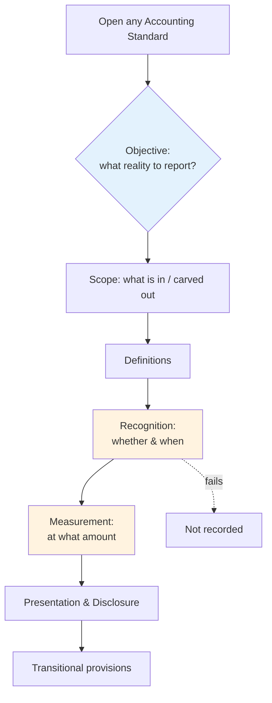

# Q&A — How to Read Any Accounting Standard (+ AS 1: Accounting Policies)

> Scope: The universal reading method for any ICAI Accounting Standard, plus AS 1 *Disclosure of Accounting Policies*. All amounts in Rupees (₹). Standards referenced are ICAI AS (not Ind AS).

---

## Section A — Concept Check (short answers)

**A1. What is the single most useful question to ask when you open any Accounting Standard?**
"What transaction or event is this standard trying to *measure and report faithfully*, and where could a preparer cheat?" Every AS exists to close a gap between what management *wants* to show and what economic reality *is*. Reading it as an anti-manipulation rulebook — rather than a list of clauses — makes the logic self-explanatory.

**A2. Give the reusable skeleton common to almost every AS.**
Objective → Scope (what's in / carved out) → Definitions → Recognition (when it enters the books) → Measurement (at what amount, initial and subsequent) → Presentation & Disclosure → Transitional provisions. If you can locate these seven layers, you can read *any* standard, even one you've never seen.

**A3. Distinguish "recognition" from "measurement."**
Recognition answers *whether and when* an item is recorded (does it meet the definition of an asset/liability and is inflow/outflow probable and reliably measurable?). Measurement answers *at what amount* (cost, net realisable value, fair value, present value). They are sequential gates: fail recognition and measurement never arises.

**A4. What is an "accounting policy"? How does it differ from an accounting estimate?**
Accounting policies are the specific *principles, bases, conventions, rules and practices* adopted in preparing and presenting financial statements (e.g., choosing FIFO for inventory, straight-line for depreciation). An estimate is a *judgement of an uncertain amount* (e.g., useful life, provision for doubtful debts). A policy is a *chosen method*; an estimate is a *number filled into* that method.

**A5. State the three fundamental accounting assumptions under AS 1.**
Going Concern, Consistency, and Accrual. If these are followed, no disclosure is required. If any one is *not* followed, that fact must be disclosed.

**A6. What are the three major considerations governing the *selection* of accounting policies under AS 1?**
Prudence, Substance over Form, and Materiality. Prudence = don't anticipate profits, do provide for known losses. Substance over form = record the economic reality, not just the legal shell. Materiality = disclose everything whose omission/misstatement could influence a user's decision.

**A7. AS 1 requires disclosure of all *significant* accounting policies. Where and how?**
At one place, normally as the *first note* to the financial statements ("Significant Accounting Policies"), so users get context before reading the numbers. Any *change* in policy with a material effect must be disclosed; if the effect is ascertainable, the amount must be stated; if not ascertainable wholly or in part, that fact must be disclosed.

**A8. Does AS 1 permit a change in accounting policy? Under what conditions?**
Yes, but only if the change is required by statute, or by an accounting standard, or if it results in a *more appropriate* presentation of the financial statements. Change for cosmetic profit management is not permitted.

**A9. "A change in the method of depreciation is a change in accounting policy." True or false under current ICAI position?**
False (post AS 10 revision). A change in the method of depreciation is now treated as a change in *accounting estimate*, applied prospectively. This is a favourite trap — historically it was a policy change; know the current position.

**A10. Why does AS 1 put prudence before optimism?**
Because users (lenders, investors) are harmed more by *overstated* profits and assets than by understated ones. Prudence builds a margin of safety: unrealised gains wait for realisation, but foreseeable losses are booked immediately.

---

## Section B — Graded Computational Problems (with full solutions)

### B1 (Easy) — Prudence: booking a foreseeable loss

**Problem.** M/s Anand Traders holds inventory that cost ₹5,00,000. Due to damage, its estimated net realisable value (NRV) is ₹4,20,000. Separately, the firm has a firm sales order that it expects will earn a profit of ₹60,000 next year. Applying the prudence concept of AS 1, what value goes into the Balance Sheet for inventory, and how is the expected profit treated?

**Solution — step by step.**
1. Prudence: provide for known/foreseeable losses; do not anticipate unrealised profits.
2. Inventory is carried at *lower of cost and NRV* = lower of ₹5,00,000 and ₹4,20,000 = **₹4,20,000**.
3. The write-down (loss) = ₹5,00,000 − ₹4,20,000 = **₹80,000**, recognised now.
4. The expected ₹60,000 profit is *unrealised* — anticipating it violates prudence. It is **not recognised** until realised.

**Journal entry**
| Particulars | Dr (₹) | Cr (₹) |
|---|---|---|
| Profit & Loss A/c ................ Dr | 80,000 | |
| &nbsp;&nbsp;To Inventory A/c | | 80,000 |

**Self-verify.** Loss booked (80,000) + Balance Sheet value (4,20,000) = 5,00,000 = original cost. ✔ Expected profit recognised = 0. ✔

---

### B2 (Easy–Moderate) — Consistency and disclosure of a policy change

**Problem.** Beta Ltd changed its inventory valuation policy from Weighted Average to FIFO in FY 2025–26. Closing inventory under Weighted Average would be ₹8,00,000; under FIFO it is ₹8,90,000. State the treatment under AS 1 and pass the effect.

**Solution — step by step.**
1. This is a change in *accounting policy* (a change of the method/basis of valuation).
2. Permitted only if it gives a *more appropriate* presentation (or is required by statute/standard). Assume it does.
3. AS 1 requires **disclosure** of the change and, since the effect is ascertainable, disclosure of the **amount of the effect**.
4. Effect on profit = increase in closing inventory = ₹8,90,000 − ₹8,00,000 = **₹90,000 higher profit** (closing stock higher → cost of goods sold lower → profit higher).

**Entry (closing stock carried at FIFO value)**
| Particulars | Dr (₹) | Cr (₹) |
|---|---|---|
| Closing Inventory A/c ........ Dr | 8,90,000 | |
| &nbsp;&nbsp;To Trading A/c | | 8,90,000 |

**Disclosure note.** "During the year the company changed its method of inventory valuation from Weighted Average to FIFO to reflect a more appropriate presentation. The change increased the value of closing inventory and profit before tax by ₹90,000."

**Self-verify.** Difference stated (90,000) equals FIFO − WA (8,90,000 − 8,00,000). ✔

---

### B3 (Moderate) — Substance over form: sale-and-repurchase

**Problem.** Gamma Ltd "sold" goods costing ₹3,00,000 to a financier for ₹3,50,000 on 1 Jan 2026, with a *firm commitment* to repurchase them on 30 Jun 2026 for ₹3,71,000. The ₹21,000 excess reflects a financing charge. Advise the accounting treatment under the substance-over-form consideration of AS 1, and pass entries at inception.

**Solution — step by step.**
1. Legal form: a sale. Economic substance: a *secured borrowing* — Gamma retains the risks/rewards and is obliged to buy back at a higher price. The ₹21,000 is *interest*, not profit.
2. Substance over form (AS 1): record it as a loan of ₹3,50,000, keep the inventory on Gamma's books, and accrue ₹21,000 as interest over 6 months.
3. No profit of ₹50,000 (350,000 − 300,000) is recognised — there is no genuine sale.

**Entries at inception (1 Jan 2026)**
| Particulars | Dr (₹) | Cr (₹) |
|---|---|---|
| Bank A/c .................... Dr | 3,50,000 | |
| &nbsp;&nbsp;To Borrowing (Financier) A/c | | 3,50,000 |

Inventory remains at cost ₹3,00,000 (no de-recognition).

**Interest accrual over 6 months** (₹21,000):
| Particulars | Dr (₹) | Cr (₹) |
|---|---|---|
| Interest Expense A/c ........ Dr | 21,000 | |
| &nbsp;&nbsp;To Borrowing (Financier) A/c | | 21,000 |

**On repurchase (30 Jun 2026):**
| Particulars | Dr (₹) | Cr (₹) |
|---|---|---|
| Borrowing (Financier) A/c ... Dr | 3,71,000 | |
| &nbsp;&nbsp;To Bank A/c | | 3,71,000 |

**Self-verify.** Cash in (3,50,000) − cash out (3,71,000) = −21,000 = total interest expensed. ✔ Inventory never left the books, so no phantom ₹50,000 profit. ✔

---

### B4 (Moderate–Hard) — Materiality threshold decision

**Problem.** Delta Ltd has profit before tax of ₹40,00,000 and total assets of ₹6,00,00,000. During finalisation the following unrecorded items are found: (i) an under-provision of expenses ₹18,000; (ii) a misclassification moving ₹2,10,000 from "other income" that should be "sales." The firm's internal materiality benchmark is 5% of profit before tax for P&L items and 1% of total assets for balance-sheet items. Which items must be corrected/disclosed under the materiality consideration of AS 1?

**Solution — step by step.**
1. Materiality threshold (P&L) = 5% × ₹40,00,000 = **₹2,00,000**.
2. Item (i) ₹18,000 < ₹2,00,000 → *immaterial* by amount. It may be left or adjusted at management's discretion; no mandatory disclosure purely on size.
3. Item (ii) ₹2,10,000 > ₹2,00,000 → **material**. Even though it does not change *total* profit (a reclassification between income lines), it affects the *quality/composition* of revenue, which influences users assessing operating performance. It must be corrected.
4. Note: materiality is not only about amount — nature matters. A small fraud or a director-related transaction can be material by nature even below threshold.

**Self-verify.** Threshold ₹2,00,000; the ₹2,10,000 reclassification exceeds it → correct; the ₹18,000 falls below → immaterial by size. Logic consistent. ✔

---

### B5 (Hard) — Going concern breakdown and its accounting consequences

**Problem.** Epsilon Ltd's board decides on 31 Mar 2026 to liquidate the company within 6 months. Its plant is in the books at ₹50,00,000 (cost ₹80,00,000 less accumulated depreciation ₹30,00,000). Forced-sale value is ₹28,00,000. Prepaid advertising of ₹1,20,000 has no resale value. Explain the AS 1 treatment and pass entries.

**Solution — step by step.**
1. The *going concern* assumption no longer holds. AS 1 requires that this fact — and the basis on which the statements are drawn — be **disclosed**.
2. Under a break-up (liquidation) basis, assets are measured at *realisable* amounts, not historical cost less depreciation.
3. Plant: write down from carrying ₹50,00,000 to realisable ₹28,00,000 → loss **₹22,00,000**.
4. Prepaid advertising: no future benefit on liquidation → write off **₹1,20,000**.

**Entries**
| Particulars | Dr (₹) | Cr (₹) |
|---|---|---|
| Profit & Loss A/c ............ Dr | 22,00,000 | |
| &nbsp;&nbsp;To Plant A/c | | 22,00,000 |
| Profit & Loss A/c ............ Dr | 1,20,000 | |
| &nbsp;&nbsp;To Prepaid Advertising A/c | | 1,20,000 |

**Disclosure note.** "The financial statements have been prepared on a break-up basis as the company intends to liquidate. Assets have accordingly been stated at estimated realisable values; the going concern assumption has not been followed."

**Self-verify.** Plant new carrying value 50,00,000 − 22,00,000 = 28,00,000 = forced-sale value. ✔ Prepaid fully written off → nil. ✔ Both departures from going concern disclosed. ✔

---

## Section C — Past-Paper-Style Questions

**C1 (Theory, 4 marks).** *"AS 1 does not prescribe any particular set of accounting policies; instead it lays down principles for their selection and disclosure." Explain.*

**Model answer.** AS 1 is a *meta-standard*: it governs *how* policies are chosen and communicated, not *which* policy is correct for a given item (that is left to the item-specific standards — AS 2 for inventory, AS 10 for PPE, etc.). Its contribution is threefold. (1) It identifies three *fundamental assumptions* — going concern, consistency, accrual — presumed followed unless disclosed otherwise. (2) It names three *major considerations* governing selection — prudence, substance over form, materiality. (3) It mandates that *all significant accounting policies* be disclosed at one place, that changes with material effect be disclosed (with amounts where ascertainable), and that non-adherence to a fundamental assumption be disclosed. Thus AS 1 secures comparability and transparency without dictating a uniform national chart of policies.

**C2 (Application, 5 marks).** *A company valued its finished goods at cost, ignoring a significant decline in selling prices, arguing "consistency requires us to keep the same policy every year." Comment.*

**Model answer.** The company confuses *consistency* with *prudence*. Consistency requires applying the *same policy from period to period* so figures are comparable — it does not freeze the *measurement outcome* against economic reality. AS 2 (guided by AS 1's prudence consideration) requires inventory at *lower of cost and net realisable value*. When selling prices fall below cost, NRV is lower, and the stock must be written down. Prudence overrides a mechanical appeal to consistency: consistency governs the *method*, prudence governs the *amount*. The correct treatment is to write finished goods down to NRV and recognise the loss immediately. Refusal to do so overstates both profit and assets and breaches AS 1.

**C3 (Application, 5 marks).** *Zeta Ltd changed the estimated useful life of its machinery from 10 years to 7 years during the year, and also changed its depreciation method from WDV to SLM. Classify each change and state the accounting treatment.*

**Model answer.** Two distinct changes. (a) *Change in useful life* (10 → 7 years) is a change in **accounting estimate** — it revises a judgement about an uncertain amount. Treatment: **prospective**, spreading the remaining carrying amount over the revised remaining life; disclose if material. (b) *Change in depreciation method* (WDV → SLM) is, under the revised AS 10 position, **also treated as a change in accounting estimate**, applied prospectively (not a retrospective policy change). Both are therefore applied prospectively with disclosure of the effect where material. The trap the examiner sets is expecting the old answer ("method change = policy change, retrospective") — the current ICAI position is prospective for both.

**C4 (Theory, 3 marks).** *List the disclosures AS 1 requires in respect of accounting policies.*

**Model answer.** (i) All *significant accounting policies* adopted, disclosed together at one place (usually the first note). (ii) The fact and, where ascertainable, the *amount* of any *change* in accounting policy that has a material effect in the current period, or is expected to have a material effect in later periods; where the amount is not ascertainable, that fact. (iii) The fact of *non-adherence* to any fundamental accounting assumption (going concern, consistency, accrual).

---

## Section D — Multiple Choice Questions (with reasoning)

**D1.** Which is NOT one of the three fundamental accounting assumptions under AS 1?
(a) Going concern (b) Consistency (c) Prudence (d) Accrual

**Answer: (c) Prudence.** Reasoning: Prudence is a *consideration governing selection* of policies, not a fundamental *assumption*. The three assumptions are going concern, consistency, accrual. Classic wording trap — prudence, substance over form and materiality are the "considerations," not the "assumptions."

**D2.** A change in accounting policy that has a material effect should be:
(a) Ignored if immaterial to the auditor (b) Disclosed, with the amount if ascertainable (c) Applied only from the next 5 years (d) Approved by shareholders before adoption

**Answer: (b).** Reasoning: AS 1 requires disclosure of the change and its amount where ascertainable; where not ascertainable wholly/partly, that fact is disclosed. Shareholder approval is not an AS 1 requirement.

**D3.** Recording a sale-and-repurchase arrangement as a secured loan rather than a sale is an application of:
(a) Materiality (b) Going concern (c) Substance over form (d) Consistency

**Answer: (c) Substance over form.** Reasoning: The legal form is a sale, but the economic substance is financing; AS 1 requires reporting the substance.

**D4.** Under prudence, which is correct?
(a) Anticipate profits, provide for losses (b) Anticipate neither profits nor losses (c) Do not anticipate profits, provide for all known/foreseeable losses (d) Provide for profits, ignore losses

**Answer: (c).** Reasoning: Prudence = conservatism with a downward bias — unrealised gains wait, foreseeable losses are booked now.

**D5.** If a company follows all three fundamental assumptions, AS 1 requires:
(a) A specific disclosure confirming each (b) No specific disclosure of those assumptions (c) Auditor certification of each (d) Board resolution for each

**Answer: (b).** Reasoning: The assumptions are *presumed* followed; disclosure is triggered only by *non-adherence*. Confirming them is unnecessary.

**D6.** The "lower of cost and NRV" rule for inventory is primarily an expression of which AS 1 consideration?
(a) Consistency (b) Prudence (c) Substance over form (d) Accrual

**Answer: (b) Prudence.** Reasoning: It provides for a foreseeable loss (fall below cost) while never anticipating profit above cost.

**D7.** Under the current ICAI position, a change in the *method of depreciation* is treated as:
(a) A change in accounting policy, retrospective (b) A change in accounting estimate, prospective (c) A prior period item (d) An extraordinary item

**Answer: (b).** Reasoning: Post the AS 10 revision, a depreciation method change is a change in estimate applied prospectively — not a retrospective policy change.

**D8.** Materiality under AS 1 depends on:
(a) Amount only (b) Nature only (c) Both amount and nature of the item (d) The auditor's fee

**Answer: (c).** Reasoning: An item can be material by *size* or by *nature* (e.g., director-related or fraudulent transactions), even when small in amount.

---

### One-line revision hooks
- Seven-layer skeleton = Objective, Scope, Definitions, Recognition, Measurement, Presentation/Disclosure, Transition.
- AS 1 assumptions (3) = Going concern, Consistency, Accrual → disclose only if *broken*.
- AS 1 considerations (3) = Prudence, Substance over form, Materiality.
- Change of policy → disclose + amount if ascertainable. Method of depreciation change → *estimate*, prospective.
