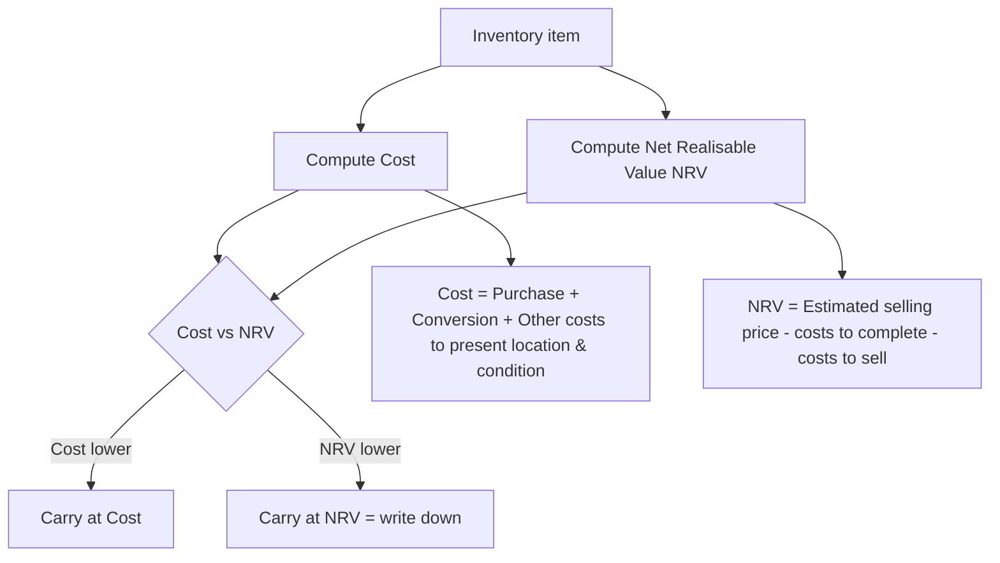

# Q&A — AS 2: Valuation of Inventories

> Scope: ICAI Accounting Standard 2 (Valuation of Inventories), CA Intermediate — Advanced Accounting. All amounts in Rupees (₹). Every question is followed by a full model answer. Work every computational problem yourself first, then check the reconciliation.

---

## The core rule at a glance



**One-line statement of AS 2:** Inventories are valued at the **lower of cost and net realisable value (NRV)**, applied normally on an **item-by-item** basis.

---

## Section A — Concept Check

**A1. State the measurement rule in AS 2 and the two components it compares.**
Inventories are measured at the **lower of (a) cost and (b) net realisable value**. Cost is the total expenditure to bring inventory to its present location and condition; NRV is the estimated selling price in the ordinary course of business less estimated costs of completion and estimated costs necessary to make the sale.

**A2. What items make up "cost of inventories" under AS 2?**
Cost comprises: (i) **cost of purchase** — purchase price, duties and taxes not subsequently recoverable, freight inward, and other directly attributable acquisition costs, **less** trade discounts, rebates and duty drawbacks; (ii) **cost of conversion** — direct labour plus systematically allocated fixed and variable production overheads; and (iii) **other costs** incurred in bringing inventories to their present location and condition (e.g., certain design costs for a specific customer).

**A3. Define Net Realisable Value. Is it the same as fair value / market value?**
NRV = estimated selling price in the ordinary course of business − estimated cost of completion − estimated costs necessary to make the sale. It is an **entity-specific** value and is **not** the same as fair value/market value, which is a general market exit price. NRV may be lower than market value because it nets off the entity's own selling and completion costs.

**A4. How is fixed production overhead absorbed? Explain "normal capacity."**
Fixed production overhead is allocated based on **normal capacity** — the production expected on average over a number of periods under normal circumstances. In periods of **low production / idle plant**, the per-unit fixed overhead is **not** increased; unabsorbed fixed overhead is charged as an **expense** in the period. In periods of **abnormally high production**, allocation per unit is reduced so inventory is not carried above cost.

**A5. List four costs specifically excluded from the cost of inventories.**
(i) Abnormal amounts of wasted materials, labour or other production costs; (ii) storage costs, unless necessary in the production process before a further stage; (iii) administrative overheads not contributing to bringing inventories to present location/condition; (iv) selling and distribution costs.

**A6. When may FIFO or Weighted Average be used, and what is barred?**
For items ordinarily interchangeable, cost is assigned using **FIFO** or **weighted average cost**. For items not ordinarily interchangeable and goods produced for specific projects, **specific identification** is used. **LIFO is not permitted** under AS 2.

**A7. When can inventory be valued below the lower-of-cost-and-NRV item basis by grouping?**
Ordinarily the comparison is **item-by-item**. Grouping of similar or related items is permitted where it is **not practicable to evaluate items separately** (e.g., items in the same product line with similar purposes/end use, produced and marketed in the same geographical area). Inventory should **not** be written down on the basis of a whole classification (e.g., all finished goods) or a whole business segment.

**A8. Are raw materials always written down when their price falls?**
No. Raw materials are **not written down below cost if the finished products in which they will be incorporated are expected to be sold at or above cost.** Only when the decline in raw material price indicates that finished goods cost will **exceed** NRV are the materials written down — and then **replacement cost** is the best available measure of their NRV.

**A9. How are trade discounts and cash (settlement) discounts treated?**
**Trade discounts and rebates** are **deducted** in determining cost of purchase. **Cash/settlement discounts** are a financing item and are **not** deducted from cost.

**A10. Can a write-down to NRV be reversed?**
Yes. When the circumstances that caused the write-down no longer exist, or there is clear evidence of an increase in NRV, the amount of the write-down is **reversed** (limited to the amount of the original write-down) so the new carrying amount is the lower of cost and revised NRV.

**A11. What disclosures does AS 2 require?**
(i) The **accounting policies** adopted in measuring inventories, including the **cost formula** used; and (ii) the **total carrying amount** of inventories and its **classification** appropriate to the enterprise (e.g., raw materials, WIP, finished goods, stores & spares, loose tools).

**A12. Which inventories are outside AS 2's scope?**
AS 2 does **not** apply to WIP under construction contracts (AS 7), WIP of service providers, shares/debentures and other financial instruments held as stock-in-trade, and producers' inventories of livestock, agricultural and forest products, and mineral oils/ores/gases measured at NRV per established industry practices.

---

## Section B — Graded Computational Problems

### B1. Cost of purchase (easy)

X Ltd buys raw material. Invoice price ₹5,00,000; GST (fully recoverable as input credit) ₹90,000; non-refundable customs duty ₹40,000; freight inward ₹15,000; trade discount ₹25,000; cash discount availed ₹8,000; unloading charges ₹5,000. Compute the cost of purchase.

**Solution (step-by-step):**
| Component | ₹ | Include? |
|---|---|---|
| Invoice price | 5,00,000 | Yes |
| Less: Trade discount | (25,000) | Deduct |
| Non-refundable customs duty | 40,000 | Yes |
| Freight inward | 15,000 | Yes |
| Unloading charges | 5,000 | Yes |
| GST (recoverable) | — | Exclude (recoverable) |
| Cash discount | — | Exclude (financing) |
| **Cost of purchase** | **5,35,000** | |

**Self-check:** 5,00,000 − 25,000 = 4,75,000; + 40,000 + 15,000 + 5,000 = **₹5,35,000.** Recoverable GST and cash discount correctly excluded.

---

### B2. Lower of cost and NRV, item-by-item (easy–moderate)

A trader holds three products. Value the closing inventory.
| Product | Units | Cost/unit ₹ | Selling price/unit ₹ | Selling cost/unit ₹ |
|---|---|---|---|---|
| P | 100 | 200 | 250 | 20 |
| Q | 150 | 300 | 310 | 30 |
| R | 80 | 400 | 380 | 10 |

**Solution:** NRV/unit = Selling price − Selling cost. Value each at lower of cost and NRV, then × units.
| Product | Cost ₹ | NRV ₹ | Lower ₹ | Units | Value ₹ |
|---|---|---|---|---|---|
| P | 200 | 250−20=230 | 200 | 100 | 20,000 |
| Q | 300 | 310−30=280 | 280 | 150 | 42,000 |
| R | 400 | 380−10=370 | 370 | 80 | 29,600 |
| | | | | | **91,600** |

**Self-check (reconcile):** If valued naively at cost: 100×200 + 150×300 + 80×400 = 20,000 + 45,000 + 32,000 = 97,000. Write-downs: Q ₹3,000 (45,000−42,000) + R ₹2,400 (32,000−29,600) = ₹5,400. 97,000 − 5,400 = **₹91,600.** Reconciles. (P not written up — cost < NRV.)

---

### B3. Fixed overhead absorption at normal capacity (moderate)

Normal capacity = 10,000 units/period. Fixed production overhead = ₹3,00,000/period. Actual production in the period = 7,500 units (low production). Variable production cost = ₹40/unit; direct material = ₹60/unit. All 7,500 units remain in closing stock. Compute cost per unit and the amount charged to P&L for unabsorbed overhead.

**Solution:**
Step 1 — Fixed OH absorption rate at **normal** capacity = 3,00,000 / 10,000 = **₹30/unit** (must NOT use actual 7,500).
Step 2 — Cost per unit in inventory = Material 60 + Variable 40 + Fixed OH 30 = **₹130/unit.**
Step 3 — Fixed OH absorbed into 7,500 units = 7,500 × 30 = ₹2,25,000.
Step 4 — Unabsorbed fixed OH (idle capacity) = 3,00,000 − 2,25,000 = **₹75,000 charged to P&L as an expense.**
Step 5 — Closing inventory value = 7,500 × 130 = **₹9,75,000.**

**Self-check:** Total fixed OH 3,00,000 = 2,25,000 (in inventory) + 75,000 (expensed). Reconciles. Had we (wrongly) used actual capacity, rate = 40/unit and all ₹3,00,000 would sit in stock — overstating inventory by ₹75,000.

---

### B4. Raw material write-down test (moderate)

Y Ltd holds raw material costing ₹8,00,000 (replacement cost now ₹7,00,000). Two scenarios:
(a) Finished goods made from it will sell **above cost**.
(b) Finished goods will sell **below cost** (NRV of finished goods < cost).
State the value of raw material in each case.

**Solution:**
- **(a)** Because finished goods are expected to be sold at or above cost, the raw material is **not written down**. Value = **₹8,00,000 (cost).**
- **(b)** The fall in raw material price signals finished goods will not recover cost, so raw material is written down to NRV, best measured by **replacement cost = ₹7,00,000.** Write-down = ₹1,00,000 charged to P&L.

**Self-check:** The write-down decision hinges on the **finished product's** NRV, not the raw material's price alone — the AS 2 linkage rule.

---

### B5. Comprehensive valuation with entries (moderate–hard)

Z Ltd, at 31 March 2026, has:
- Raw materials at cost ₹4,00,000; replacement cost ₹3,60,000.
- Finished goods: cost ₹12,00,000; expected selling price ₹11,50,000; estimated selling & distribution cost ₹80,000.
- WIP: cost ₹5,00,000; will need ₹1,50,000 to complete; the resulting finished goods will sell for ₹7,20,000 with ₹40,000 selling cost.

The finished goods are made from this raw material. Value each and pass the write-down entry.

**Solution:**
*Finished goods:* NRV = 11,50,000 − 80,000 = **₹10,70,000** < cost 12,00,000 → carry at **₹10,70,000** (write-down ₹1,30,000).

*Raw materials:* Finished goods are selling **below cost** (NRV 10,70,000 < cost 12,00,000), so the linked raw material **is** written down to replacement cost = **₹3,60,000** (write-down ₹40,000).

*WIP:* NRV of eventual finished goods = 7,20,000 − 40,000 = 6,80,000. NRV of WIP = 6,80,000 − 1,50,000 (cost to complete) = **₹5,30,000.** Cost of WIP = 5,00,000. Lower = **₹5,00,000** (no write-down; NRV exceeds cost).

| Item | Cost ₹ | NRV/RC ₹ | Carrying value ₹ |
|---|---|---|---|
| Raw materials | 4,00,000 | 3,60,000 | 3,60,000 |
| WIP | 5,00,000 | 5,30,000 | 5,00,000 |
| Finished goods | 12,00,000 | 10,70,000 | 10,70,000 |
| **Total** | 21,00,000 | | **19,30,000** |

**Journal entry (write-down of ₹1,70,000):**
```
Profit & Loss A/c            Dr.  1,70,000
    To Inventory Write-down A/c        1,70,000
(Being finished goods written down by ₹1,30,000 and
 raw material by ₹40,000 to lower of cost and NRV)
```

**Self-check:** Total write-down = 40,000 (RM) + 0 (WIP) + 1,30,000 (FG) = ₹1,70,000. Cost 21,00,000 − 1,70,000 = **₹19,30,000.** Reconciles.

---

### B6. FIFO vs Weighted Average (hard)

Opening stock 1 Apr: 200 units @ ₹50. Purchases: 5 Apr 300 @ ₹55; 20 Apr 500 @ ₹60. Sales: 10 Apr 400 units; 25 Apr 300 units. Compute closing inventory under (a) FIFO and (b) Weighted Average (periodic).

**Solution:**
Total available = 200 + 300 + 500 = 1,000 units, cost = 200×50 + 300×55 + 500×60 = 10,000 + 16,500 + 30,000 = ₹56,500. Sold = 700; **Closing = 300 units.**

**(a) FIFO** — closing 300 units are the most recent: all from 20 Apr @ ₹60 = **₹18,000.**

**(b) Weighted Average (periodic)** — average cost = 56,500 / 1,000 = ₹56.50/unit. Closing = 300 × 56.50 = **₹16,950.**

**Self-check (COGS reconciliation):**
- FIFO: COGS = 56,500 − 18,000 = ₹38,500. Direct: 200@50 + 300@55 + 200@60 = 10,000 + 16,500 + 12,000 = ₹38,500. ✔
- WA: COGS = 700 × 56.50 = ₹39,550; +closing 16,950 = ₹56,500. ✔

FIFO gives higher closing value in a rising-price market (₹18,000 > ₹16,950), as expected.

---

### B7. Reversal of write-down (hard)

At 31 Mar 2025, W Ltd wrote inventory of cost ₹10,00,000 down to NRV ₹8,50,000 (write-down ₹1,50,000). The stock is still on hand at 31 Mar 2026, when NRV has recovered to ₹9,20,000. What is the carrying amount at 31 Mar 2026 and the reversal amount?

**Solution:**
New carrying amount = lower of cost (₹10,00,000) and revised NRV (₹9,20,000) = **₹9,20,000.**
Previous carrying amount = ₹8,50,000. Reversal = 9,20,000 − 8,50,000 = **₹70,000** (credited to P&L, reducing the current period's cost of inventory).
The reversal is **capped**: it cannot exceed the original write-down of ₹1,50,000 and cannot carry inventory above cost. Here ₹70,000 is within the cap.

**Self-check:** Even though NRV rose to ₹9,20,000, we never exceed cost ₹10,00,000. Recovery to, say, ₹10,50,000 would still cap carrying value at cost ₹10,00,000 (max reversal ₹1,50,000).

---

## Section C — Past-Paper-Style Questions

**C1.** *"Raw materials are always valued at cost or below." Comment with reference to AS 2.* (4 marks)

**Model answer:** The statement is **partly incorrect** as a blanket rule. Under AS 2, materials held for use in production are **not written down below cost** if the finished products in which they will be incorporated are expected to be sold **at or above cost**. Thus raw materials are ordinarily carried at **cost** even when their market/replacement price has fallen. Only when the decline in raw material prices indicates that the finished goods' cost will **exceed NRV** are the materials written down — and then to **replacement cost**, which is the best measure of NRV in this situation. So raw materials are valued at cost, and only *conditionally* below cost — never above cost.

---

**C2.** *A company includes the following in its inventory cost. State which are correct per AS 2 and recompute the cost.* Storage of finished goods ₹50,000; abnormal wastage of material ₹30,000; fixed factory overhead (normal) ₹1,20,000; selling commission ₹25,000; carriage inward ₹18,000; interest on working capital loan ₹40,000. Reported cost includes all these plus base cost ₹6,00,000. (6 marks)

**Model answer:**
| Item | Amount ₹ | Include in cost? | Reason |
|---|---|---|---|
| Base cost | 6,00,000 | Yes | Purchase/conversion |
| Storage of finished goods | 50,000 | No | Not needed before a further production stage |
| Abnormal wastage | 30,000 | No | Abnormal cost — expense |
| Fixed factory OH (normal) | 1,20,000 | Yes | Conversion cost at normal capacity |
| Selling commission | 25,000 | No | Selling cost |
| Carriage inward | 18,000 | Yes | Cost of purchase |
| Interest on WC loan | 40,000 | No | Financing/borrowing cost — not attributable |

Correct inventory cost = 6,00,000 + 1,20,000 + 18,000 = **₹7,38,000.** The remaining ₹1,45,000 (50,000 + 30,000 + 25,000 + 40,000) is charged to **P&L as period expense**.

**Self-check:** Reported (wrong) total 8,83,000 − 1,45,000 = ₹7,38,000. ✔

---

**C3.** *From the following, determine the value of closing inventory of finished goods per AS 2.* Finished goods on hand 1,000 units. Cost of production per unit: material ₹80, labour ₹40, variable OH ₹20, fixed OH ₹30 (at normal capacity). Selling price ₹150/unit; selling expenses ₹25/unit. Additionally, 200 of these units are damaged and can be sold only at ₹90/unit after ₹15/unit reconditioning. (6 marks)

**Model answer:**
*Good units (800):* Cost/unit = 80+40+20+30 = ₹170. NRV/unit = 150 − 25 = ₹125. Lower = **₹125.** Value = 800 × 125 = ₹1,00,000. (Write-down ₹45/unit as NRV < cost.)

*Damaged units (200):* NRV = 90 − 15 (recondition) − 25 (selling)? — reconditioning and selling costs both reduce NRV: 90 − 15 − 25 = **₹50/unit** (or if selling expense already embedded, use 90 − 15 = ₹75; standard treatment nets all costs to sell). Using full costs to sell: value = 200 × 50 = ₹10,000. Cost ₹170 is far higher, so carry at NRV ₹50.

**Closing inventory = 1,00,000 + 10,000 = ₹1,10,000.**

**Self-check:** Both good and damaged units are below cost, so both are written down — item/group basis applied by condition. Total cost would have been 1,000 × 170 = ₹1,70,000; write-down ₹60,000 → ₹1,10,000. ✔ (Note: examiners accept either treatment of the damaged-unit selling cost provided stated; show the assumption.)

---

**C4.** *Explain the treatment of fixed production overheads when actual production is (i) below and (ii) above normal capacity.* (4 marks)

**Model answer:** Fixed production overheads are allocated using **normal capacity**.
(i) **Below normal (low production/idle plant):** the allocation rate per unit stays at the normal-capacity rate; the **unabsorbed** portion is recognised as an **expense** in the period, not capitalised into inventory. This prevents inventory being carried above cost.
(ii) **Above normal:** the allocation rate per unit is **reduced** (spread over the higher actual output) so that inventories are measured at actual cost and not above it.

---

## Section D — MCQs with Reasoning

**D1.** Under AS 2, inventories are valued at:
A. Cost B. NRV C. Lower of cost and NRV D. Higher of cost and NRV

**Answer: C.** AS 2's fundamental rule is prudence — lower of cost and NRV. A/B ignore the comparison; D would overstate assets, violating prudence.

---

**D2.** Which cost formula is prohibited by AS 2?
A. FIFO B. Weighted Average C. Specific identification D. LIFO

**Answer: D — LIFO.** AS 2 permits FIFO and weighted average for interchangeable items and specific identification for non-interchangeable/project goods. LIFO is not allowed because it can misstate inventory value on the balance sheet.

---

**D3.** Trade discount received on purchase of raw material is:
A. Added to cost B. Deducted from cost C. Credited to P&L D. Ignored

**Answer: B — deducted from cost.** Cost of purchase is net of trade discounts and rebates. (Contrast: **cash/settlement discount** is financing and is *not* deducted.)

---

**D4.** Abnormal wastage of materials is:
A. Included in inventory cost B. Charged to P&L as expense C. Deferred D. Added to NRV

**Answer: B.** Abnormal amounts of wasted material/labour are excluded from cost and expensed in the period incurred; only normal loss is absorbed into cost.

---

**D5.** Raw material costing ₹5,00,000 has replacement cost ₹4,50,000. Finished goods using it will sell above cost. Raw material is valued at:
A. ₹4,50,000 B. ₹5,00,000 C. ₹4,75,000 D. Lower of the two

**Answer: B — ₹5,00,000 (cost).** Since finished goods sell at/above cost, the material is not written down despite the price fall. Replacement cost is used only when finished goods are expected to sell below cost.

---

**D6.** NRV is best described as:
A. Current market/replacement price B. Selling price less costs to complete and sell C. Historical cost D. Fair value less tax

**Answer: B.** NRV is entity-specific: estimated selling price in the ordinary course of business less estimated costs of completion and costs necessary to make the sale — distinct from general market/fair value.

---

**D7.** Storage costs are included in inventory cost:
A. Always B. Never C. Only if necessary before a further production stage D. Only for finished goods

**Answer: C.** Storage is generally excluded, except where it is **necessary in the production process before a further stage** of production.

---

**D8.** A write-down of inventory to NRV in an earlier year may be:
A. Never reversed B. Reversed without limit C. Reversed up to the amount of the original write-down D. Reversed only on sale

**Answer: C.** When NRV recovers, the write-down is reversed but only to the extent of the original write-down, and the carrying amount can never exceed cost.

---

**D9.** Which is **outside** the scope of AS 2?
A. Finished goods B. WIP under a construction contract (AS 7) C. Stores and spares D. Raw materials

**Answer: B.** WIP under construction contracts is covered by AS 7. Also excluded: service providers' WIP, financial instruments held as stock, and certain producers' agricultural/mineral inventories at NRV.

---

**D10.** Interest on a loan taken for working capital is:
A. Part of inventory cost B. Excluded from inventory cost C. Deducted from NRV D. Added to conversion cost

**Answer: B — excluded.** General borrowing/financing costs are not attributable to bringing inventory to present location and condition and are not included in cost of inventories under AS 2.

---

*End of Q&A — AS 2: Valuation of Inventories.*
