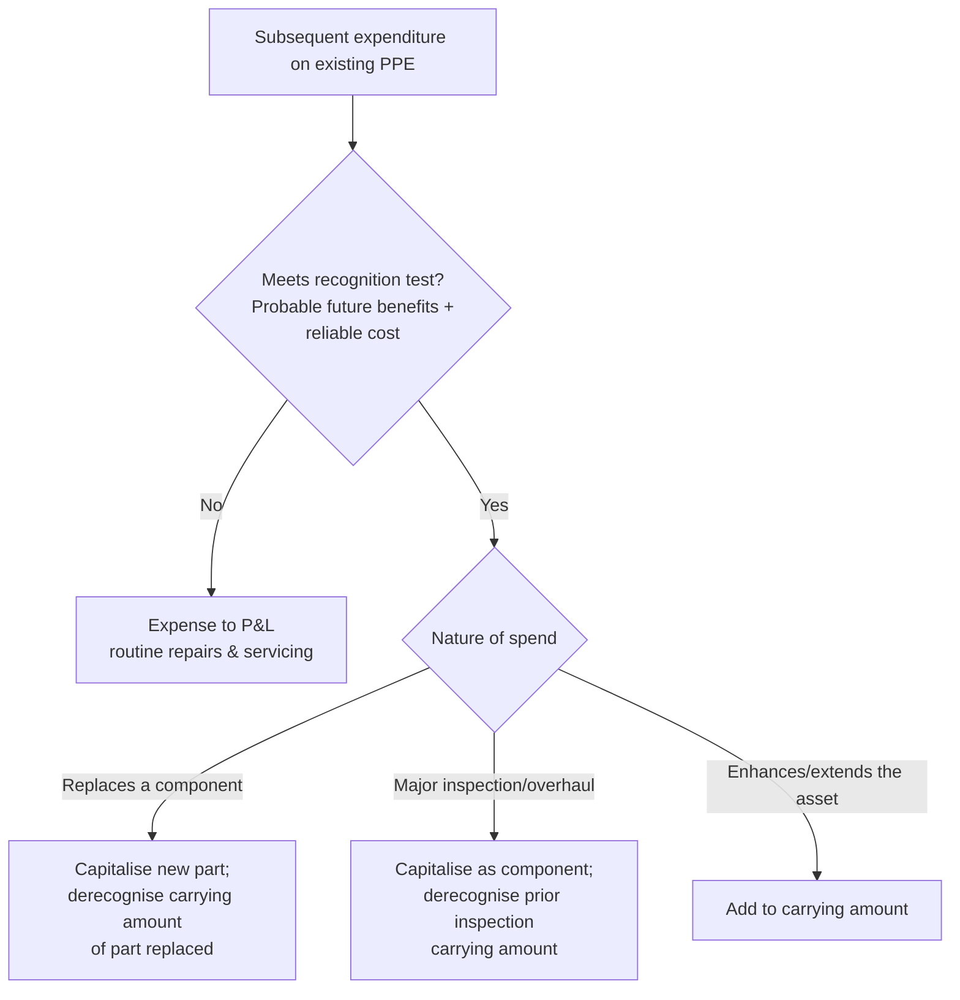

# Q&A — AS 10: Property, Plant & Equipment (and why depreciation exists)

> Companion question bank to the concept chapter. Every question is followed immediately by a complete model answer. All figures in Rupees (₹). Based on ICAI AS 10 (Revised) *Property, Plant and Equipment*.

---

## Section A — Concept-check Questions (test the WHY)

**A1. What are the two recognition criteria for an item of PPE, and why does AS 10 insist on both?**
An item is recognised as PPE only if (a) it is **probable that future economic benefits** associated with it will flow to the enterprise, and (b) its **cost can be measured reliably**. Both are demanded because an asset is fundamentally a *future benefit*: without probable benefits there is nothing to carry forward, and without a reliable cost figure the balance sheet number would be a guess. The two together stop firms from parking wishful spending on the asset side.

**A2. Why does depreciation exist at all? Answer the "why", not the mechanics.**
A long-lived asset is *pre-paid* future benefit. Those benefits are consumed over several years, so the matching principle demands the cost be spread across the periods that enjoy the benefit — not dumped entirely in the year of purchase. Depreciation is therefore **cost allocation, not valuation**: it does not try to track market price, it systematically writes off the *depreciable amount* over *useful life* so each year bears its fair share of the asset's consumption. It is emphatically **not** a fund set aside for replacement.

**A3. Distinguish "cost model" and "revaluation model" and state AS 10's stance on frequency and class.**
Under the **cost model** an item is carried at cost less accumulated depreciation less accumulated impairment. Under the **revaluation model** it is carried at fair value at revaluation date less subsequent depreciation and impairment. Revaluation must be done with **sufficient regularity** so carrying amount does not differ materially from fair value, and must be applied to the **entire class** (e.g. all land, all plant) — not cherry-picked items — to prevent selective value inflation.

**A4. How is a revaluation increase, and a subsequent decrease, treated? Explain the asymmetry.**
An **increase** is credited to **Revaluation Surplus** (equity/OCI) — unless it reverses a decrease of the same asset previously charged to P&L, in which case it is credited to P&L to that extent. A **decrease** is charged to **P&L** — unless it reverses a surplus of the same asset still standing in the Revaluation Surplus, in which case it is debited to that surplus first. The asymmetry reflects **prudence**: unrealised gains stay out of profit, but losses hit profit unless there is a matching prior gain to absorb them.

**A5. What is "component accounting" and why is it mandatory under AS 10?**
Where an item of PPE has **significant parts with different useful lives**, each significant part must be **depreciated separately** (e.g. an aircraft's engines vs. its airframe, a furnace's lining vs. its shell). Reason: depreciating the whole at one rate would systematically misstate expense — over-depreciating long-life parts and under-depreciating short-life ones. Component accounting aligns the write-off with actual consumption.

**A6. Why is the cost of a major inspection or overhaul capitalised rather than expensed?**
If a regular major inspection is a **condition of continuing to operate** the asset, its cost is capitalised as a replacement of the previous inspection's carrying amount (the old inspection component is derecognised). It meets the recognition test — it secures future economic benefits (continued operation) — so expensing it would violate matching. Routine **day-to-day servicing (repairs and maintenance)**, which merely maintains, is expensed.

**A7. Is a change in the method of depreciation (SLM to WDV) a change in accounting policy? What does AS 10 say?**
No. Under AS 10 (Revised), the depreciation method, useful life and residual value are **estimates**. A change in any of them is a **change in accounting estimate** under AS 5, applied **prospectively** — the remaining carrying amount is written off over the remaining useful life on the new basis. (Under the old AS 6, a method change was retrospective; AS 10 revised deliberately reversed this.)

**A8. When does depreciation begin and end?**
Depreciation begins when the asset is **available for use** — i.e. in the location and condition necessary for it to operate as management intends — not when it is first actually used. It ceases at the **earlier** of the date the asset is classified as held for sale (or derecognised) and the date it is derecognised. Crucially, depreciation does **not** stop merely because the asset is idle or retired from active use (unless fully depreciated).

**A9. What happens to the Revaluation Surplus over the asset's life and on disposal?**
The surplus may be transferred to **retained earnings** as the asset is used — the amount transferred each year being the difference between depreciation on the revalued amount and depreciation on original cost. On disposal, the balance of surplus relating to that asset is transferred to retained earnings. These transfers go **directly through reserves, never through P&L** — the gain was never a realised profit.

**A10. Are spare parts, standby equipment and servicing equipment PPE or inventory?**
Major spare parts and standby/servicing equipment qualify as **PPE** when the enterprise expects to use them for **more than one period**, or when they can be used only in connection with a specific item of PPE. Otherwise they are classified as **inventory** and charged to P&L as consumed.

---

## Section B — Graded Computational Problems

### B1 (Easy) — Building up the cost of PPE

**Q.** Deccan Ltd. acquired a machine. Costs incurred: invoice price ₹40,00,000; trade discount ₹2,00,000; GST (fully recoverable as input credit) ₹6,84,000; freight ₹1,20,000; installation and site preparation ₹80,000; initial testing (net of ₹15,000 realised from sale of samples produced in testing) ₹50,000; staff training on the new machine ₹60,000; opening-ceremony expenses ₹40,000. Compute the cost to be capitalised.

**Solution.**

| Item | ₹ | Include? |
|---|---:|---|
| Invoice price | 40,00,000 | Yes |
| Less: trade discount | (2,00,000) | Deducted |
| GST (recoverable input credit) | — | No (recoverable, not a cost) |
| Freight | 1,20,000 | Yes (bringing to location) |
| Installation & site preparation | 80,000 | Yes |
| Testing, net of sample proceeds (50,000 − 15,000) | 35,000 | Yes (net of ₹15,000) |
| Staff training | — | No (not a cost of the *asset*) |
| Opening ceremony | — | No (not directly attributable) |

**Cost capitalised = 40,00,000 − 2,00,000 + 1,20,000 + 80,000 + 35,000 = ₹40,35,000**

*Self-check:* Training and inauguration are period costs (benefit the enterprise, not attributable to getting *this asset* ready); recoverable GST is not a cost; sample proceeds during testing reduce the capitalised amount. Entry:
```
Machinery A/c        Dr.   40,35,000
   To Bank / Creditors A/c        40,35,000
```

---

### B2 (Easy–Moderate) — SLM depreciation with residual value

**Q.** A plant costs ₹22,00,000, estimated useful life 8 years, residual value ₹2,00,000. Compute annual depreciation (SLM) and the carrying amount at end of Year 3.

**Solution.**
- Depreciable amount = Cost − Residual = 22,00,000 − 2,00,000 = **₹20,00,000**
- Annual depreciation = 20,00,000 ÷ 8 = **₹2,50,000**
- Accumulated depreciation after 3 years = 2,50,000 × 3 = 7,50,000
- **Carrying amount end of Year 3 = 22,00,000 − 7,50,000 = ₹14,50,000**

*Self-check:* After 8 full years, accumulated depreciation = 20,00,000, carrying amount = ₹2,00,000 = residual value. Reconciles. Entry each year:
```
Depreciation A/c        Dr.   2,50,000
   To Accumulated Depreciation A/c   2,50,000
```

---

### B3 (Moderate) — Change in estimate of useful life (AS 5, prospective)

**Q.** An asset cost ₹30,00,000 on 1 April 2020, useful life 10 years, nil residual, SLM. On 1 April 2023, after 3 years, management revises the **total** useful life to 8 years (i.e. 5 remaining). Compute depreciation for FY 2023-24 and show the reconciliation.

**Solution.**
- Original annual depreciation = 30,00,000 ÷ 10 = 3,00,000
- Accumulated depreciation to 31 Mar 2023 (3 years) = 9,00,000
- Carrying amount 1 Apr 2023 = 30,00,000 − 9,00,000 = **₹21,00,000**
- Remaining useful life = 8 − 3 = **5 years**
- **Revised depreciation FY 2023-24 = 21,00,000 ÷ 5 = ₹4,20,000**

*Self-check:* No restatement of prior years (change in estimate is prospective). Over the next 5 years, 4,20,000 × 5 = 21,00,000 = carrying amount, fully written off by end of Year 8. Reconciles.

---

### B4 (Moderate) — Revaluation upward, then depreciation, then surplus transfer

**Q.** Land-and-building carried at cost ₹50,00,000, accumulated depreciation ₹10,00,000 (carrying amount ₹40,00,000, remaining life 8 years, SLM, nil residual). On 1 April 2024 it is revalued to ₹56,00,000. Show (i) the revaluation entry, (ii) depreciation for FY 2024-25, (iii) the surplus transfer to retained earnings.

**Solution.**
(i) Revaluation surplus = 56,00,000 − 40,00,000 = **₹16,00,000** (credited to Revaluation Surplus).
Using the **elimination method** (net carrying amount restated):
```
Building A/c (net)          Dr.   16,00,000
   To Revaluation Surplus A/c        16,00,000
```
(ii) Depreciation on revalued amount = 56,00,000 ÷ 8 = **₹7,00,000**
```
Depreciation A/c        Dr.   7,00,000
   To Accumulated Depreciation A/c   7,00,000
```
(iii) Depreciation on original carrying base = 40,00,000 ÷ 8 = 5,00,000. Excess = 7,00,000 − 5,00,000 = **₹2,00,000** transferred:
```
Revaluation Surplus A/c        Dr.   2,00,000
   To Retained Earnings A/c              2,00,000
```
*Self-check:* Surplus ₹16,00,000 ÷ 8 years = ₹2,00,000 released per year — the surplus is fully cleared to retained earnings over the remaining life, and the transfer never touches P&L. Reconciles.

---

### B5 (Moderate–Hard) — Revaluation decrease then reversal (the asymmetry)

**Q.** Machine A (carrying amount ₹12,00,000) is revalued on 31 Mar 2024 to ₹9,00,000. On 31 Mar 2025 (ignore intervening depreciation for clarity) it is revalued back up to ₹11,00,000. Show the treatment of both movements.

**Solution.**
- **31 Mar 2024:** decrease = 12,00,000 − 9,00,000 = ₹3,00,000. No prior surplus exists, so **charge entirely to P&L**:
```
Revaluation Loss (P&L) A/c   Dr.   3,00,000
   To Machine A/c                       3,00,000
```
- **31 Mar 2025:** increase = 11,00,000 − 9,00,000 = ₹2,00,000. Because a decrease of ₹3,00,000 was previously charged to P&L, the increase is **credited to P&L up to ₹2,00,000** (it does not exceed the prior loss):
```
Machine A/c            Dr.   2,00,000
   To Revaluation Gain (P&L) A/c        2,00,000
```
*Self-check:* Had the increase been ₹4,00,000, then ₹3,00,000 goes to P&L (reversing the earlier loss) and the remaining ₹1,00,000 to Revaluation Surplus. The rule: reversals follow where the original hit landed. Reconciles.

---

### B6 (Hard) — Component accounting with major overhaul

**Q.** A furnace costs ₹60,00,000, comprising a shell (life 20 years) worth ₹48,00,000 and a lining (life 5 years) worth ₹12,00,000; nil residual for both; SLM. After 5 years the lining is replaced at a cost of ₹15,00,000. Compute (a) annual depreciation for Years 1–5, (b) the entries on replacement, (c) depreciation of the new lining.

**Solution.**
(a) Shell: 48,00,000 ÷ 20 = 2,40,000 p.a. Lining: 12,00,000 ÷ 5 = 2,40,000 p.a. **Total Years 1–5 = ₹4,80,000 p.a.**

(b) After 5 years the old lining is fully depreciated (carrying amount nil), so it is **derecognised** with no gain/loss, and the new lining is capitalised:
```
Accumulated Depreciation A/c   Dr.   12,00,000
   To Furnace – Lining (old) A/c          12,00,000
(Derecognise fully-depreciated old lining)

Furnace – Lining (new) A/c     Dr.   15,00,000
   To Bank A/c                              15,00,000
(Capitalise replacement lining)
```
(c) New lining depreciation = 15,00,000 ÷ 5 = **₹3,00,000 p.a.** Shell continues at 2,40,000. **Total Years 6–10 = ₹5,40,000 p.a.**

*Self-check:* Because the lining was tracked as a separate component, its full cost had already been written off exactly when it wore out — the replacement is cleanly capitalised, and no distortion arises. Had the whole furnace been depreciated at one blended rate, the replacement would have been messy and expense mismatched. Reconciles.

---

### B7 (Hard) — Disposal of a revalued asset

**Q.** Equipment carried under the revaluation model: carrying amount ₹18,00,000, and Revaluation Surplus relating to it ₹4,00,000. It is sold for ₹20,00,000. Show the disposal treatment.

**Solution.**
- Profit on disposal (to P&L) = Sale proceeds − Carrying amount = 20,00,000 − 18,00,000 = **₹2,00,000**
```
Bank A/c              Dr.   20,00,000
   To Equipment A/c                 18,00,000
   To Profit on Sale of PPE (P&L)    2,00,000
```
- The Revaluation Surplus of ₹4,00,000 is now **realised**; transfer directly to retained earnings (not through P&L):
```
Revaluation Surplus A/c   Dr.   4,00,000
   To Retained Earnings A/c            4,00,000
```
*Self-check:* Only the ₹2,00,000 excess of proceeds over carrying amount hits profit; the previously-recognised revaluation gain bypasses P&L entirely (it was already recognised in equity). Reconciles with AS 10's rule that surplus is never routed through profit.

---

## Section C — Past-paper-style Questions

**C1.** *State four costs that are NOT part of the cost of an item of PPE under AS 10, with one-line reasons.*
**Answer.** (i) **Costs of opening a new facility** (e.g. inauguration) — not attributable to getting the asset ready. (ii) **Costs of introducing a new product/service** (advertising, promotion) — a marketing cost. (iii) **Costs of conducting business in a new location or with a new class of customer** (staff training) — benefits operations, not the asset. (iv) **Administration and general overheads** — not directly attributable. Also excluded: costs incurred while an asset capable of operating is **not yet in use or operating below capacity**, and initial operating losses.

**C2.** *Sun Ltd. self-constructs a machine. Direct materials ₹8,00,000; direct labour ₹3,00,000; allocable production overheads ₹1,50,000; abnormal wastage of material ₹70,000; general admin overheads ₹90,000; borrowing cost (qualifying asset, AS 16) ₹60,000; estimated dismantling/restoration obligation present value ₹40,000. Compute the cost of the self-constructed machine.*
**Answer.**

| Item | ₹ | Treatment |
|---|---:|---|
| Direct materials | 8,00,000 | Include |
| Direct labour | 3,00,000 | Include |
| Allocable production overheads | 1,50,000 | Include |
| Abnormal wastage | — | Exclude (abnormal → P&L) |
| General admin overheads | — | Exclude (not directly attributable) |
| Borrowing cost (AS 16) | 60,000 | Include |
| Dismantling/restoration (PV) | 40,000 | Include (initial estimate of decommissioning) |

**Cost = 8,00,000 + 3,00,000 + 1,50,000 + 60,000 + 40,000 = ₹13,50,000.** Internal profit is never included; abnormal wastage and general admin are expensed.

**C3.** *An enterprise stopped using a fully operational machine (carrying amount ₹5,00,000) and kept it idle for the whole year, arguing no depreciation is due because it produced nothing. Comment.*
**Answer.** The argument is **wrong**. Under AS 10, depreciation is not suspended merely because an asset is idle or retired from active use. Depreciation continues (unless the asset is fully depreciated or classified as held for sale) because useful life reflects not only usage but also **technical/commercial obsolescence and physical wear from the passage of time**. Under a usage-based method (units of production) the charge could be nil, but under time-based SLM/WDV, depreciation must still be provided. So the year's depreciation must be charged.

**C4.** *Explain, with the flow of decisions, how a subsequent expenditure on an existing item of PPE is treated.*
**Answer.** Ask: does the expenditure meet the recognition criteria (probable future economic benefits + reliable cost)?
- **Day-to-day servicing / routine repairs** → merely restore or maintain → **expense** to P&L.
- **Replacement of a component** (e.g. new lining, new engine) → **capitalise** the replacement and **derecognise** the carrying amount of the part replaced.
- **Major inspection/overhaul** that is a condition of continued operation → **capitalise** as a component, derecognising the previous inspection's remaining carrying amount.



**C5.** *Give the disclosure requirements for each class of PPE under the cost model (list any six).*
**Answer.** For each class: (1) measurement bases used; (2) depreciation methods; (3) useful lives or depreciation rates; (4) gross carrying amount and accumulated depreciation (with accumulated impairment) at beginning and end of period; (5) a **reconciliation** of the carrying amount at the beginning and end of the period showing additions, disposals, acquisitions through amalgamations, depreciation, impairment losses/reversals, and other movements; (6) existence and amounts of **restrictions on title** and PPE **pledged as security**; plus expenditure on PPE under construction and contractual commitments to acquire PPE.

---

## Section D — MCQs (with reasoning)

**D1.** Depreciation is best described as:
(a) a method of asset valuation (b) a fund for asset replacement (c) systematic allocation of depreciable amount over useful life (d) a provision for market-price decline.
**Answer: (c).** Depreciation is **cost allocation**, matching consumed benefit to periods. It is neither a valuation exercise (a/d) nor a cash fund (b) — no money is set aside.

**D2.** Under AS 10, a change from SLM to WDV is:
(a) change in accounting policy, applied retrospectively (b) change in accounting estimate, applied prospectively (c) a prior-period error (d) not permitted.
**Answer: (b).** AS 10 (Revised) treats the depreciation method as an **estimate**; a change is prospective under AS 5. (The old AS 6 treated it as a policy change — a common trap.)

**D3.** A revaluation increase is credited to P&L only when:
(a) it is the first revaluation (b) it reverses a decrease of the same asset previously charged to P&L (c) always (d) the surplus exceeds carrying amount.
**Answer: (b).** The increase reverses a prior P&L loss to that extent; any balance goes to Revaluation Surplus. Prudence keeps unmatched unrealised gains out of profit.

**D4.** Recoverable GST paid on purchase of plant is:
(a) capitalised as part of cost (b) not part of cost (c) expensed immediately (d) added to depreciable amount.
**Answer: (b).** Only **non-refundable** taxes/duties form part of cost. Recoverable input credit is not a cost of the asset — it is receivable from the government.

**D5.** Depreciation of an item of PPE begins when:
(a) it is first physically used (b) it is available for use (in location/condition intended by management) (c) legal title passes (d) production reaches full capacity.
**Answer: (b).** AS 10 ties commencement to **availability for use**, regardless of whether actual use has begun — idleness after readiness does not defer depreciation.

**D6.** An aircraft's engines (life 6 years) and airframe (life 20 years) must be:
(a) depreciated together at a blended rate (b) depreciated as separate components (c) not depreciated as engines are repaired (d) written off when the aircraft is grounded.
**Answer: (b).** Significant parts with different useful lives require **component (separate) depreciation** so expense tracks actual consumption of each part.

**D7.** On disposal of a revalued asset, the related Revaluation Surplus is:
(a) credited to P&L as profit (b) transferred to retained earnings directly (c) carried forward indefinitely (d) refunded to shareholders.
**Answer: (b).** The surplus, now realised, moves to retained earnings **without passing through P&L** — it was never an operating profit.

**D8.** Initial operating losses incurred before the asset reaches planned performance are:
(a) capitalised as part of PPE cost (b) recognised in P&L (c) deferred and amortised (d) added to residual value.
**Answer: (b).** AS 10 explicitly excludes initial operating losses from the cost of PPE — they are period expenses, not costs of *getting the asset ready*.

---

*End of Q&A bank — AS 10: Property, Plant & Equipment.*
