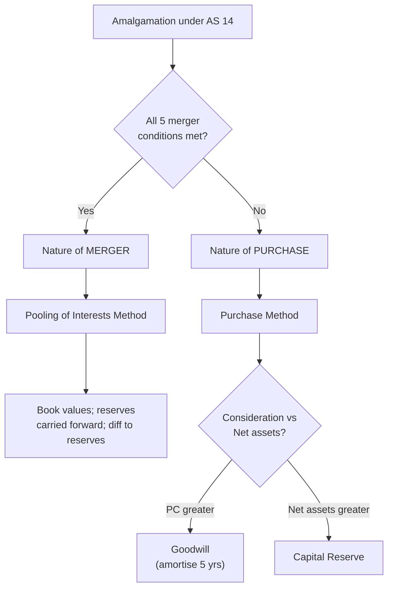

# Q&A — AS 14 — Accounting for Amalgamations

> Self-study question bank. Every question is followed immediately by a full model answer. Amounts in Rupees (Rs.). Based on ICAI AS 14 (Accounting for Amalgamations). No invented provisions.

---

## SECTION A — Concept Checks (with answers)

**A1. State the two methods of accounting for an amalgamation under AS 14.**
Answer: (i) The **Pooling of Interests Method** — used for an amalgamation in the *nature of merger*; (ii) The **Purchase Method** — used for an amalgamation in the *nature of purchase*.

**A2. List the five conditions that must ALL be satisfied for an amalgamation in the nature of merger.**
Answer (RMPD-style checklist — all five mandatory):
1. **All assets and liabilities** of the transferor become those of the transferee after amalgamation.
2. **Shareholders holding ≥ 90%** of the face value of equity shares of the transferor (other than shares already held by the transferee) become equity shareholders of the transferee.
3. The consideration for those shareholders is **discharged wholly by equity shares** of the transferee (except cash for fractional shares).
4. The **business** of the transferor is **intended to be carried on** by the transferee.
5. **No adjustment** is intended to the book values of assets and liabilities of the transferor, except to ensure **uniformity of accounting policies**.
If any one condition fails, it is an amalgamation in the nature of **purchase**.

**A3. Define "consideration" as per AS 14.**
Answer: Consideration is the aggregate of **shares and other securities issued and payment made in cash or other assets by the transferee company to the shareholders** of the transferor company. It **excludes** amounts payable to debenture-holders and creditors (they are settled separately, not part of purchase consideration).

**A4. How is goodwill/capital reserve arising under the Purchase Method dealt with?**
Answer: Under the Purchase Method, if consideration **exceeds** the net assets taken over (at their assigned/agreed values) → the excess is **Goodwill**; if consideration is **less** than net assets → the difference is **Capital Reserve**. AS 14 requires goodwill arising on amalgamation to be **amortised over a period not exceeding five years** unless a longer period is justified.

**A5. Under the Pooling of Interests Method, how is the difference between consideration and share capital of the transferor adjusted?**
Answer: The difference between the **consideration** and the **share capital** of the transferor is adjusted in **reserves** (e.g., General Reserve, and if inadequate, other reserves). No goodwill/capital reserve arises. Assets, liabilities and reserves are recorded at existing carrying (book) values.

**A6. What happens to the reserves of the transferor company under each method?**
Answer: **Pooling of Interests** — all reserves (including statutory reserves and the profit & loss balance) are **carried forward** and appear in the transferee's books at the same figures. **Purchase Method** — only **statutory reserves** (e.g., under Income-tax) are carried forward via an "Amalgamation Adjustment Reserve"; other reserves of the transferor are **not** carried forward (they are subsumed in net assets / not recorded separately).

**A7. What is the "Amalgamation Adjustment Reserve"?**
Answer: Under the Purchase Method, when statutory reserves of the transferor must be maintained (legal requirement), the transferee records the statutory reserve by a corresponding debit to **"Amalgamation Adjustment Reserve"**, which is shown as a **separate line under Reserves and Surplus** (as a negative/deduction). When the legal requirement ceases, both are reversed.

**A8. Name the two methods to compute purchase consideration seen in problems.**
Answer: (i) **Net Assets Method** — agreed value of assets taken over *minus* agreed value of liabilities taken over; (ii) **Net Payments Method** — total of payments/securities given to the transferor's shareholders. Note: purchase consideration under AS 14 is essentially the **Net Payments** view (what is given to shareholders); Net Assets is used to derive/verify or where consideration is defined as net assets.

---

## SECTION B — Graded Computational Problems (full solutions)

### B1 (Easy) — Purchase consideration by Net Payments

A Ltd. takes over B Ltd. It agrees to: issue 3 equity shares of Rs. 10 each (market value Rs. 12) for every 2 shares in B Ltd. (B Ltd. has 40,000 equity shares); pay Rs. 2,00,000 in cash; issue 10% debentures worth Rs. 1,50,000 to B Ltd.'s shareholders. Compute the purchase consideration.

**Solution (Net Payments Method):**

| Component | Working | Rs. |
|---|---|---|
| Equity shares | 40,000 × 3/2 = 60,000 shares × Rs. 12 (fair value) | 7,20,000 |
| Cash | given | 2,00,000 |
| Debentures to shareholders | given | 1,50,000 |
| **Purchase Consideration** | | **10,70,000** |

Note: shares are valued at their **fair/market value** (Rs. 12), not face value, for consideration. Debentures here are issued **to shareholders** so they form part of consideration.

---

### B2 (Easy–Medium) — Net Assets Method & Goodwill/Capital Reserve

P Ltd. acquires S Ltd. (Purchase Method). Agreed values of S Ltd.'s assets: Land Rs. 5,00,000; Plant Rs. 3,00,000; Stock Rs. 1,20,000; Debtors Rs. 80,000. Liabilities taken over: Creditors Rs. 90,000; 12% Debentures Rs. 2,00,000. Purchase consideration agreed at Rs. 8,50,000. Determine goodwill or capital reserve.

**Solution:**

Net assets taken over = Assets − Liabilities:

| Assets (agreed) | Rs. |
|---|---|
| Land | 5,00,000 |
| Plant | 3,00,000 |
| Stock | 1,20,000 |
| Debtors | 80,000 |
| **Total assets** | **10,00,000** |

| Liabilities (taken over) | Rs. |
|---|---|
| Creditors | 90,000 |
| 12% Debentures | 2,00,000 |
| **Total liabilities** | **2,90,000** |

Net assets = 10,00,000 − 2,90,000 = **Rs. 7,10,000**

Purchase consideration = Rs. 8,50,000

Since PC (8,50,000) > Net assets (7,10,000):

**Goodwill = 8,50,000 − 7,10,000 = Rs. 1,40,000**

(Goodwill to be amortised over not more than 5 years.)

---

### B3 (Medium) — Full journal in transferee's books (Purchase Method)

Using B2 data, pass journal entries in P Ltd.'s books, assuming consideration of Rs. 8,50,000 is discharged by issuing 70,000 equity shares of Rs. 10 each (Rs. 7,00,000) plus Rs. 1,50,000 cash.

**Solution — Journal in the books of P Ltd. (transferee):**

```
(1) Business Purchase A/c ........................ Dr. 8,50,000
        To Liquidator of S Ltd. A/c                     8,50,000
    (Being purchase consideration due)

(2) Land A/c ..................................... Dr. 5,00,000
    Plant A/c ................................... Dr. 3,00,000
    Stock A/c .................................. Dr. 1,20,000
    Debtors A/c ............................... Dr.   80,000
    Goodwill A/c .............................. Dr. 1,40,000
        To Creditors A/c                                 90,000
        To 12% Debentures A/c                          2,00,000
        To Business Purchase A/c                       8,50,000
    (Being assets and liabilities recorded at agreed
     values and goodwill for the balance)

(3) Liquidator of S Ltd. A/c ..................... Dr. 8,50,000
        To Equity Share Capital A/c                    7,00,000
        To Bank A/c                                     1,50,000
    (Being consideration discharged)
```

**Verification:** Debits in entry (2) = 5,00,000+3,00,000+1,20,000+80,000+1,40,000 = 11,40,000; credits = 90,000+2,00,000+8,50,000 = 11,40,000. Balanced. Goodwill Rs. 1,40,000 ties to B2.

---

### B4 (Medium) — Pooling of Interests Method

X Ltd. and Y Ltd. amalgamate to form XY Ltd. (nature of merger — pooling). Y Ltd.'s balances: Equity Share Capital Rs. 5,00,000; General Reserve Rs. 1,20,000; P&L (Cr.) Rs. 60,000; 10% Debentures Rs. 2,00,000; Sundry assets (book) Rs. 8,00,000; Creditors Rs. 20,000 (check: 8,00,000 = 5,00,000+1,20,000+60,000+2,00,000... = 8,80,000? reconcile below). XY Ltd. issues equity shares of Rs. 4,80,000 to Y's shareholders. Record entries.

First reconcile Y Ltd.'s balance sheet:

| Liabilities | Rs. | Assets | Rs. |
|---|---|---|---|
| Equity Share Capital | 5,00,000 | Sundry assets | 8,80,000 |
| General Reserve | 1,20,000 | | |
| P&L (Cr.) | 60,000 | | |
| 10% Debentures | 2,00,000 | | |
| Creditors | — | | |
| **Total** | **8,80,000** | **Total** | **8,80,000** |

(Assets adjusted to Rs. 8,80,000 so the sheet balances; no creditors.)

**Solution — Pooling of Interests in XY Ltd.'s books:**

Under pooling, assets, liabilities and reserves are recorded at **book value**. The difference between consideration (Rs. 4,80,000) and share capital of transferor (Rs. 5,00,000) is adjusted in reserves.

Difference = Share capital 5,00,000 − Consideration 4,80,000 = Rs. 20,000 → **added to reserves** (since consideration is *less* than share capital, reserves increase by 20,000).

```
Sundry Assets A/c ............................ Dr. 8,80,000
        To 10% Debentures A/c                          2,00,000
        To General Reserve A/c                         1,20,000
        To Profit & Loss A/c                             60,000
        To Equity Share Capital A/c (issued)          4,80,000
        To General Reserve A/c (balancing adj.)         20,000
    (Being assets, liabilities and reserves of Y Ltd.
     recorded at book values under pooling; excess of
     share capital over consideration added to reserves)
```

**Verification:** Credits = 2,00,000+1,20,000+60,000+4,80,000+20,000 = 8,80,000 = Debit (Sundry Assets). Balanced. All reserves carried forward at book value — hallmark of pooling.

---

### B5 (Exam-hard) — Choice of method, consideration, and goodwill with policy uniformity

A Ltd. absorbs B Ltd. as on 31 March 2026. B Ltd.'s Balance Sheet:

| Liabilities | Rs. | Assets | Rs. |
|---|---|---|---|
| Equity Capital (Rs.10) | 10,00,000 | Land & Building | 6,00,000 |
| General Reserve | 3,00,000 | Plant & Machinery | 5,00,000 |
| P&L A/c | 1,50,000 | Stock | 3,20,000 |
| 12% Debentures | 4,00,000 | Debtors | 2,80,000 |
| Creditors | 1,50,000 | Cash & Bank | 3,00,000 |
| **Total** | **20,00,000** | **Total** | **20,00,000** |

Terms: A Ltd. will (a) take over all assets and liabilities; (b) revalue Land & Building to Rs. 8,00,000 and Plant to Rs. 4,50,000; (c) provide Rs. 20,000 on debtors; (d) discharge 12% debenture-holders by issuing 13% debentures of equal amount; (e) pay shareholders: 4 equity shares of Rs. 10 (issued at Rs. 12) for every 5 shares held, plus Rs. 1 cash per share held. Determine the method, purchase consideration, and goodwill/capital reserve. Show the entry for consideration.

**Step 1 — Which method?**
Consideration to shareholders is **partly in cash** (Rs. 1 per share) — so it is **not** wholly by equity shares. Condition 3 for a merger fails → **Amalgamation in the nature of Purchase → Purchase Method.**

**Step 2 — Purchase consideration (Net Payments to shareholders):**
B Ltd. has 10,00,000 / 10 = **1,00,000 equity shares.**

| Component | Working | Rs. |
|---|---|---|
| Equity shares | 1,00,000 × 4/5 = 80,000 shares × Rs. 12 | 9,60,000 |
| Cash | 1,00,000 × Rs. 1 | 1,00,000 |
| **Purchase Consideration** | | **10,60,000** |

(Debentures issued to debenture-holders are **not** part of PC.)

**Step 3 — Net assets taken over (at agreed/revalued figures):**

| Assets (agreed) | Rs. |
|---|---|
| Land & Building | 8,00,000 |
| Plant & Machinery | 4,50,000 |
| Stock | 3,20,000 |
| Debtors (2,80,000 − 20,000) | 2,60,000 |
| Cash & Bank | 3,00,000 |
| **Total assets** | **21,30,000** |

| Liabilities taken over | Rs. |
|---|---|
| 12% Debentures (discharged by 13% deb. of equal value) | 4,00,000 |
| Creditors | 1,50,000 |
| **Total liabilities** | **5,50,000** |

Net assets = 21,30,000 − 5,50,000 = **Rs. 15,80,000**

**Step 4 — Goodwill or Capital Reserve:**
PC Rs. 10,60,000 − Net assets Rs. 15,80,000 = **negative Rs. 5,20,000.**
Since net assets **exceed** consideration → **Capital Reserve = Rs. 5,20,000.**

**Step 5 — Entry for consideration in A Ltd.'s books:**

```
Business Purchase A/c ........................ Dr. 10,60,000
        To Liquidator of B Ltd. A/c                   10,60,000

Liquidator of B Ltd. A/c ..................... Dr. 10,60,000
        To Equity Share Capital A/c (80,000×10)         8,00,000
        To Securities Premium A/c (80,000×2)            1,60,000
        To Bank A/c                                      1,00,000
```

**Verification:** 8,00,000 + 1,60,000 + 1,00,000 = 10,60,000 = PC. Note: General Reserve and P&L of B Ltd. are **not** carried forward (Purchase Method); they are absorbed into the capital reserve computation. Balanced.

---

## SECTION C — Past-Paper-Style Full Questions (model answers)

### C1. "Distinguish between the Pooling of Interests Method and the Purchase Method." (5 marks)

**Model answer:**

| Basis | Pooling of Interests | Purchase Method |
|---|---|---|
| Applies to | Amalgamation in the nature of **merger** | Amalgamation in the nature of **purchase** |
| Recording of assets/liabilities | At existing **book values** | At **agreed / fair values** (or book value where not revalued) |
| Reserves of transferor | **Carried forward** entirely (incl. P&L) | Not carried forward (only **statutory reserves** via Amalgamation Adjustment Reserve) |
| Goodwill/Capital Reserve | Does **not** arise | Difference is **Goodwill or Capital Reserve** |
| Difference (consideration vs share capital) | Adjusted in **reserves** | Not applicable |
| Goodwill treatment | N/A | **Amortised over ≤ 5 years** |

### C2. "Explain 'consideration' under AS 14 and how it differs from net assets acquired." (4 marks)

**Model answer:** Consideration under AS 14 is the aggregate of shares and other securities issued and cash/other assets paid by the transferee **to the shareholders** of the transferor. It **excludes** liabilities taken over (debentures, creditors) which are settled directly and are not "given to shareholders". Net assets acquired = agreed value of assets − agreed value of liabilities assumed. The two are usually **different**; their difference under the Purchase Method is recognised as **goodwill (if consideration > net assets)** or **capital reserve (if net assets > consideration)**. Only under a specific term "consideration = net assets" would they coincide.

### C3. Full problem (10 marks)

Sun Ltd. is absorbed by Moon Ltd. Sun Ltd.'s Balance Sheet: Equity Capital (Rs.10 shares) Rs. 6,00,000; Reserves Rs. 2,00,000; 10% Debentures Rs. 2,00,000; Creditors Rs. 1,00,000. Assets: Fixed Assets Rs. 7,00,000; Current Assets Rs. 4,00,000. Moon Ltd. agrees to take over all assets and liabilities, values Fixed Assets at Rs. 8,50,000 and Current Assets at Rs. 3,60,000, discharges debentures by 11% debentures of same value, and issues to Sun's shareholders 5 shares of Rs. 10 (at par) for every 4 held. Compute consideration, goodwill/capital reserve, and show entries.

**Model answer:**

Sun Ltd. shares = 6,00,000 / 10 = 60,000.

**Purchase consideration** = 60,000 × 5/4 = 75,000 shares × Rs. 10 = **Rs. 7,50,000** (wholly in equity, at par).

**Net assets taken over:**

| Item | Rs. |
|---|---|
| Fixed Assets (agreed) | 8,50,000 |
| Current Assets (agreed) | 3,60,000 |
| Less: 10% Debentures | (2,00,000) |
| Less: Creditors | (1,00,000) |
| **Net assets** | **9,10,000** |

PC 7,50,000 < Net assets 9,10,000 → **Capital Reserve = Rs. 1,60,000.**

**Entries in Moon Ltd.'s books:**

```
Business Purchase A/c ..................... Dr. 7,50,000
        To Liquidator of Sun Ltd. A/c              7,50,000

Fixed Assets A/c .......................... Dr. 8,50,000
Current Assets A/c ........................ Dr. 3,60,000
        To 10% Debentures A/c                      2,00,000
        To Creditors A/c                           1,00,000
        To Business Purchase A/c                   7,50,000
        To Capital Reserve A/c                     1,60,000

Liquidator of Sun Ltd. A/c ................ Dr. 7,50,000
        To Equity Share Capital A/c                7,50,000
```

**Verification:** Second entry debits 12,10,000; credits 2,00,000+1,00,000+7,50,000+1,60,000 = 12,10,000. Balanced. Since consideration is wholly equity but assets were **revalued**, the "no adjustment to book values" merger condition fails → correctly the **Purchase Method** applies.

---

## Decision-flow (Mermaid)



---

## SECTION D — MCQs and Case Scenarios (answer + one-line reason)

**D1.** Purchase consideration under AS 14 includes payments to:
(a) Debenture-holders (b) Creditors (c) Shareholders of transferor (d) Employees
**Answer: (c)** — consideration is what is given to the transferor's **shareholders** only.

**D2.** Goodwill arising on amalgamation should be amortised over a period not exceeding:
(a) 3 years (b) 5 years (c) 10 years (d) 20 years
**Answer: (b)** — AS 14 prescribes amortisation over **not more than 5 years** unless a longer period is justified.

**D3.** Under the Pooling of Interests Method, the difference between consideration and share capital of the transferor is:
(a) Goodwill (b) Capital reserve (c) Adjusted in reserves (d) Debited to P&L
**Answer: (c)** — adjusted in **reserves**; goodwill/capital reserve never arise under pooling.

**D4.** Statutory reserves under the Purchase Method are recorded by crediting the reserve and debiting:
(a) Goodwill (b) Capital Reserve (c) Amalgamation Adjustment Reserve (d) P&L
**Answer: (c)** — the **Amalgamation Adjustment Reserve** balances the statutory reserve carried forward.

**D5.** Which condition, if failed, converts a merger into a purchase?
(a) Business continued (b) 90% shareholders become equity holders (c) Both (a) and (b), and other three (d) None
**Answer: (c)** — **all five** conditions must be met; failure of any one → purchase.

**D6 (Case).** T Ltd. takes over all assets/liabilities of R Ltd. at book value, continues R's business, issues equity shares to 95% of R's shareholders wholly in equity, no revaluation. Method?
**Answer: Pooling of Interests (nature of merger)** — all five conditions satisfied (≥90% equity holders, wholly equity, book values retained, business continued, all A&L taken).

**D7 (Case).** In an amalgamation, net assets = Rs. 12,00,000 and purchase consideration = Rs. 10,00,000 (Purchase Method). The Rs. 2,00,000 difference is:
**Answer: Capital Reserve of Rs. 2,00,000** — net assets exceed consideration, so it is a capital reserve (a "bargain" acquisition).

**D8.** Amortisation of goodwill on amalgamation is charged to:
(a) Capital Reserve (b) Securities Premium (c) Profit & Loss Account (d) General Reserve
**Answer: (c)** — amortisation is a charge to the **Profit & Loss Account** over the amortisation period.

---

## First-Principles Recap (one-line each)
- Classify first (merger vs purchase) → method follows classification, never the reverse.
- Consideration = what goes to **shareholders**; liabilities are settled separately.
- Pooling = book values + full reserve carry-forward + difference to reserves.
- Purchase = agreed values + goodwill/capital reserve + statutory reserves via Amalgamation Adjustment Reserve.
- Goodwill on amalgamation → amortise over **≤ 5 years** through P&L.
