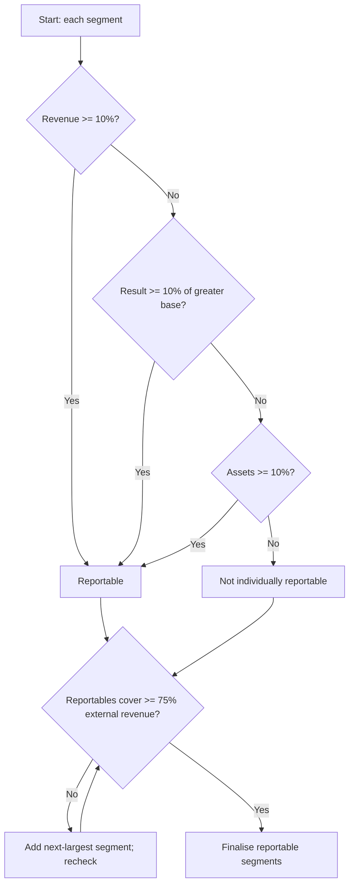

# Q&A — AS 17 — Segment Reporting

> CA Intermediate · Advanced Accounting · Exam-oriented question bank.
> All figures in Rupees (₹). Based on ICAI AS 17. Self-verified; no invented provisions.

---

## Section A — Concept-Check (Short Answer)

**A1. What is the objective of AS 17?**
To require enterprises to report financial information *by segment* so that users can better understand past performance, assess risks and returns, and make informed judgements about the enterprise as a whole. It disaggregates an enterprise operating in different products/services (business segments) or geographical areas (geographical segments).

**A2. Distinguish a business segment from a geographical segment.**
A **business segment** is a distinguishable component providing an individual product/service (or group) whose *risks and returns differ* from other components. A **geographical segment** provides products/services within a *particular economic environment* subject to risks/returns different from components operating in other environments.

**A3. State the three quantitative (10%) thresholds for identifying a *reportable* segment.**
A segment is reportable if any one is satisfied:
(a) Segment **revenue** (external + inter-segment) ≥ 10% of total revenue of all segments;
(b) Segment **result** (profit or loss) ≥ 10% of the *greater* (in absolute amount) of combined profit of all profit-making segments **or** combined loss of all loss-making segments;
(c) Segment **assets** ≥ 10% of total assets of all segments.

**A4. What is the 75% rule?**
The identified reportable segments must together account for **at least 75% of total *external* revenue**. If not, additional segments are designated reportable (even below 10%) until the 75% threshold is met.

**A5. Primary vs secondary segment — what decides which is which?**
The **dominant source and nature of risks and returns** governs. If risks/returns are affected predominantly by *products/services*, business segments are primary and geographical secondary; if predominantly by *geography*, geographical segments are primary. The organisational/internal reporting structure is the normal basis.

**A6. What is a "segment result"?**
Segment revenue **less** segment expense. It **excludes** extraordinary items, interest (unless the segment is financial), income tax, and general/head-office expenses not allocable on a reasonable basis.

**A7. Name four items *excluded* from segment revenue.**
Extraordinary items; interest/dividend income (unless financial segment); gains on sale of investments/extinguishment of debt (unless financial segment); and items relating to the enterprise as a whole (e.g., general HO income).

**A8. Is AS 17 applicable to all enterprises?**
No. It is mandatory for enterprises whose equity/debt securities are listed (or in the process of listing) and enterprises above the Companies (Accounting Standards) threshold. Small/medium-sized entities meeting relaxation criteria are exempt. (Under Ind AS 108, the "operating segment / management approach" replaces this, but AS 17 governs the ICAI AS syllabus.)

---

## Section B — Graded Computational Problems

### B1 (Easy) — Applying the three 10% tests

An enterprise has five business segments. Data (₹ lakh):

| Segment | External Rev | Inter-seg Rev | Result (P/L) | Assets |
|---|---|---|---|---|
| A | 300 | 20 | 90 | 400 |
| B | 250 | 0 | (50) | 300 |
| C | 40 | 10 | 15 | 60 |
| D | 30 | 0 | (10) | 40 |
| E | 20 | 0 | 5 | 30 |
| **Total** | **640** | **30** | **50** | **830** |

**Required:** Identify reportable segments.

**Solution.**
Total segment revenue = external + inter-segment = 640 + 30 = **670**. 10% = **67**.
- A: 320 ≥ 67 → revenue test met.
- B: 250 ≥ 67 → met.
- C: 50 < 67; D: 30 < 67; E: 20 < 67.

*Result test:* combined profit of profit-makers = 90 + 15 + 5 = **110**; combined loss = 50 + 10 = **60**. Greater absolute = **110**. 10% = **11**.
- A(90), B(50), C(15) ≥ 11 → met (B and C now qualify too).
- D(10) < 11; E(5) < 11.

*Assets test:* total = 830, 10% = **83**.
- A(400), B(300) ≥ 83 → met.
- C(60), D(40), E(30) < 83.

**Reportable by any test: A, B, C.**

*75% check:* external revenue of A+B+C = 300+250+40 = **590**; total external = 640. 590/640 = **92.2% ≥ 75%.** No extra segment needed.

**Answer:** A, B and C are reportable; D and E are shown under "Other/unallocated".

---

### B2 (Moderate) — The 75% top-up rule

Six segments, external revenue (₹): P 4,00,000; Q 90,000; R 80,000; S 70,000; T 60,000; U 50,000. Total = **7,50,000**. Only **P** independently crosses all three 10% tests (assume Q–U each fail all tests).

**Required:** Determine the final list of reportable segments.

**Solution.**
Reportable so far: **P** only → external revenue covered = 4,00,000 = **53.3%** of 7,50,000. Below 75%.

75% target of external revenue = 0.75 × 7,50,000 = **5,62,500**.
Add segments (largest external revenue first) until reached:
- P (4,00,000) → 4,00,000
- + Q (90,000) → 4,90,000 (65.3%)
- + R (80,000) → 5,70,000 (**76.0% ≥ 75%** ✔)

**Answer:** Reportable segments = **P, Q, R.** S, T, U combined (external 1,80,000) fall in "Other segments". Verification: 5,70,000/7,50,000 = 76% ≥ 75%.

---

### B3 (Moderate) — Computing segment result

Segment X figures (₹): External sales 10,00,000; Inter-segment sales 2,00,000; Cost of sales 6,50,000; Segment-specific selling expenses 1,50,000; Interest income on trade receivables 20,000; Allocated general HO expenses (reasonable basis) 40,000; Unallocable HO expenses 30,000; Interest on enterprise borrowings 25,000; Extraordinary loss (flood) 60,000; Income tax 50,000. Segment X is **not** a financial segment.

**Required:** Compute segment revenue, segment expense and segment result.

**Solution.**

| Item | ₹ | Include? |
|---|---:|---|
| External sales | 10,00,000 | Yes |
| Inter-segment sales | 2,00,000 | Yes |
| Interest income (non-financial seg) | 20,000 | **No** |
| **Segment revenue** | **12,00,000** | |

| Expense | ₹ | Include? |
|---|---:|---|
| Cost of sales | 6,50,000 | Yes |
| Selling expenses (segment-specific) | 1,50,000 | Yes |
| Allocated HO (reasonable basis) | 40,000 | Yes |
| Unallocable HO | 30,000 | **No** |
| Interest on borrowings | 25,000 | **No** |
| Extraordinary flood loss | 60,000 | **No** |
| Income tax | 50,000 | **No** |
| **Segment expense** | **8,40,000** | |

**Segment result = 12,00,000 − 8,40,000 = ₹3,60,000.**

Reconciliation to enterprise profit before tax: Segment result 3,60,000 − Unallocable HO 30,000 − Interest 25,000 − Extraordinary loss 60,000 = **₹2,45,000** PBT; less tax 50,000 = **₹1,95,000** net profit. (Self-consistent.)

---

### B4 (Exam-hard) — Full identification + reconciliation

XYZ Ltd has four business segments (₹ crore):

| Segment | External Rev | Inter-seg Rev | Segment Expense | Segment Assets |
|---|---:|---:|---:|---:|
| Textiles | 120 | 10 | 100 | 150 |
| Chemicals | 90 | 5 | 70 | 110 |
| Power | 25 | 15 | 45 | 60 |
| Retail | 15 | 0 | 12 | 20 |
| **Total** | **250** | **30** | **227** | **340** |

Unallocated corporate expenses ₹8 cr; interest on borrowings ₹6 cr; income-tax ₹9 cr. No extraordinary items.

**Required:** (i) Compute each segment's result; (ii) identify reportable segments applying all tests; (iii) reconcile total segment result to enterprise net profit.

**Solution.**

**(i) Segment result = (external + inter-seg revenue) − segment expense:**
- Textiles: 130 − 100 = **30**
- Chemicals: 95 − 70 = **25**
- Power: 40 − 45 = **(5)**
- Retail: 15 − 12 = **3**

**(ii) Tests.**
*Revenue:* total = 250 + 30 = **280**; 10% = **28**.
Textiles 130 ✔, Chemicals 95 ✔, Power 40 ✔, Retail 15 ✗.

*Result:* profit-makers 30+25+3 = **58**; loss-makers = **5**. Greater = 58; 10% = **5.8**.
Textiles 30 ✔, Chemicals 25 ✔, Power |−5| = 5 ✗ (5 < 5.8), Retail 3 ✗.

*Assets:* total 340; 10% = **34**.
Textiles 150 ✔, Chemicals 110 ✔, Power 60 ✔, Retail 20 ✗.

Reportable by any test: **Textiles, Chemicals, Power.**

*75% check:* external of the three = 120+90+25 = 235; total external 250 → **94% ≥ 75%** ✔. Retail → "Other".

**(iii) Reconciliation (₹ cr):**
Total segment result = 30 + 25 − 5 + 3 = **53**.
Less unallocated corporate expenses (8), interest (6) → PBT = 53 − 8 − 6 = **39**.
Less income tax (9) → **Net profit = ₹30 cr.** (Reconciles.)

**Diagram — reportability decision flow:**

---

## Section C — Past-Paper-Style Full Questions

### C1. "M/s Vertex Ltd" (identification + presentation)

Vertex Ltd operates three business segments — **Consumer**, **Industrial**, **Services** — and two geographical areas. Business risks predominate. Data (₹ lakh):

| Segment | Ext Rev | Inter-seg | Result | Assets | Liabilities |
|---|---:|---:|---:|---:|---:|
| Consumer | 500 | 40 | 120 | 600 | 200 |
| Industrial | 380 | 20 | 80 | 450 | 150 |
| Services | 60 | 10 | (10) | 90 | 40 |
| **Total** | **940** | **70** | **190** | **1,140** | **390** |

Unallocated: corporate assets 60, corporate liabilities 30, corporate expenses 25, interest 15, tax 45.

**Required:** State primary segment basis, identify reportable segments, and prepare the primary-segment disclosure.

**Model Answer.**
*Primary basis:* Because risks/returns are driven predominantly by products, **business segments are primary**, geographical secondary.

*Tests.* Total revenue = 940 + 70 = 1,010; 10% = 101. Consumer 540 ✔, Industrial 400 ✔, Services 70 ✗ (revenue).
Result base: profits 120+80 = 200 vs loss 10 → greater 200; 10% = 20. Consumer/Industrial ✔; Services |−10|=10 ✗.
Assets: total 1,140; 10% = 114. Consumer 600 ✔, Industrial 450 ✔, Services 90 ✗.
So Services fails all three. But apply **75%**: reportables (Consumer+Industrial) external = 880; total external 940 → 93.6% ≥ 75%. Services may still be shown separately or as "Other". Reportable: **Consumer, Industrial** (Services → Other).

*Primary segment disclosure (₹ lakh):*

| Particulars | Consumer | Industrial | Other | Elim/Unalloc | Total |
|---|---:|---:|---:|---:|---:|
| External revenue | 500 | 380 | 60 | – | 940 |
| Inter-segment revenue | 40 | 20 | 10 | (70) | – |
| **Total revenue** | 540 | 400 | 70 | (70) | 940 |
| Segment result | 120 | 80 | (10) | – | 190 |
| Unallocated corp. expenses | | | | (25) | (25) |
| Operating profit | | | | | 165 |
| Interest | | | | (15) | (15) |
| Profit before tax | | | | | 150 |
| Income tax | | | | (45) | (45) |
| **Net profit** | | | | | **105** |
| Segment assets | 600 | 450 | 90 | – | 1,140 |
| Unallocated corp. assets | | | | 60 | 60 |
| **Total assets** | | | | | 1,200 |
| Segment liabilities | 200 | 150 | 40 | – | 390 |
| Unallocated corp. liabilities | | | | 30 | 30 |
| **Total liabilities** | | | | | 420 |

Reconciliation: 190 − 25 − 15 = 150 PBT; 150 − 45 = **105 net profit.** ✔

### C2. Short theory (past-paper favourite)

**Q:** "Under AS 17, how are segment revenue, segment expense, segment assets and segment liabilities defined, and what is expressly excluded?"

**Model Answer.**
- **Segment revenue** — revenue directly attributable + reasonably allocable to a segment, including inter-segment transfers; **excludes** extraordinary items, interest/dividend/investment gains (unless financial segment), and enterprise-wide items.
- **Segment expense** — expense directly attributable + reasonably allocable, including inter-segment transfer expense; **excludes** extraordinary items, interest (unless financial), losses on investments (unless financial), income tax, and general HO/administrative expenses not attributable to segments.
- **Segment result** = segment revenue − segment expense.
- **Segment assets/liabilities** — operating assets/liabilities directly attributable or reasonably allocable; **exclude** income-tax assets/liabilities and assets/liabilities relating to the enterprise as a whole. Allocations must be **symmetrical** (an item allocated to a segment's result must also allocate its related asset/liability).

---

## Section D — MCQs / Case Scenarios

**D1.** A segment's revenue is ₹9 lakh, total segment revenue ₹100 lakh. On the revenue test the segment is:
(a) Reportable (b) **Not reportable on revenue test** (c) Automatically an "Other" (d) Eliminated
**Answer: (b).** 9 < 10% of 100 = 10, so it fails the revenue test (may still qualify on result/assets or 75%).

**D2.** Combined profit of profit-making segments = ₹80; combined loss = ₹100. The 10% result base is:
(a) ₹8 (b) ₹18 (c) **₹10** (d) ₹9
**Answer: (c).** Base = greater absolute = 100; 10% = 10.

**D3.** Interest income is included in *segment revenue* only when:
(a) It is recurring (b) **The segment is a financial (banking/finance) segment** (c) It exceeds 10% (d) Always
**Answer: (b).** For non-financial segments interest/dividend income is excluded.

**D4.** Which is *always excluded* from segment result?
(a) Inter-segment sales (b) Directly attributable depreciation (c) **Income-tax expense** (d) Allocable selling costs
**Answer: (c).** Income tax and extraordinary items are excluded.

**D5.** If reportable segments cover only 68% of external revenue, the enterprise must:
(a) Merge segments (b) **Designate additional segments reportable until ≥75%** (c) Ignore the rule (d) Restate prior year
**Answer: (b).** The 75% top-up rule applies.

**D6 (Case).** Alpha Ltd earns 70% of revenue and 80% of profit from India and the rest from three overseas regions with distinct currencies/regulations; product lines are similar. Which should be **primary**?
(a) Business (b) **Geographical** (c) Either (d) None
**Answer: (b).** Risks/returns are driven predominantly by geography, so geographical segments are primary and business secondary.

**D7 (Case).** A segment has result 10.5% (met) but assets only 4%. Management wants to drop it because assets are small. Correct treatment?
(a) Drop it (b) **Report it — meeting *any one* test makes it reportable** (c) Report only assets (d) Merge with HO
**Answer: (b).** Satisfying any single 10% test (here the result test) makes the segment reportable in full.

**D8.** Symmetry principle means:
(a) Revenue = expense (b) **An item allocated to segment result must have its related asset/liability allocated to that segment** (c) Assets = liabilities (d) Equal segment sizes
**Answer: (b).**

---

## Quick-Revision Recap

1. **Two segment types:** business (products) and geographical (economic environments).
2. **Primary/secondary** decided by dominant source of risks & returns.
3. **10% tests** (any one): revenue, result (greater of aggregate profit/loss base), assets.
4. **75% rule:** reportables must cover ≥75% of external revenue; top up if short.
5. **Result excludes** extraordinary items, interest/tax (non-financial), unallocable HO.
6. **Symmetry** in allocating results and related assets/liabilities.
7. Always **reconcile** segment totals to enterprise revenue, profit, assets, liabilities.
