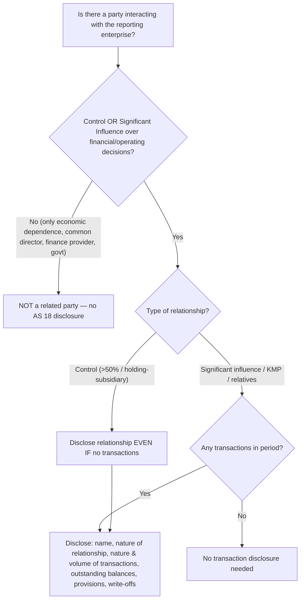

# Q&A — AS 18 — Related Party Disclosures

> Exam-oriented question bank. Every question is immediately followed by a complete model answer. All amounts in Rupees (Rs.). Based strictly on ICAI AS 18. RMPD framework = **R**elationship → **M**ateriality → **P**arties → **D**isclosure.

---

## Section A — Concept Check (with answers)

**A1. What is the objective of AS 18?**
**Answer:** AS 18 deals only with **disclosure** of related party relationships and transactions. It does not deal with measurement or recognition. Its aim is transparency: users of financial statements should know that reported results/financial position may have been affected by the existence of related parties, because related parties can enter into transactions that unrelated parties would not.

**A2. Define a "related party" as per AS 18.**
**Answer:** Parties are related if at any time during the reporting period one party has the ability to **control** the other party or **exercise significant influence** over the other party in making financial and/or operating decisions.

**A3. List the situations deemed "related party relationships" under AS 18.**
**Answer:**
1. Enterprises that directly/indirectly control, are controlled by, or are under common control with the reporting enterprise (holding, subsidiaries, fellow subsidiaries).
2. Associates and joint ventures; and the investing party/venturer for which the reporting enterprise is an associate/JV.
3. Individuals owning (directly/indirectly) voting power giving control or significant influence, and their **relatives**.
4. **Key Management Personnel (KMP)** and their relatives.
5. Enterprises over which any person in (3) or (4) is able to exercise significant influence.

**A4. Give the FIVE relationships EXCLUDED (deemed NOT related) by AS 18.**
**Answer:** (a) Two companies merely having a common director (no control/significant influence); (b) A single customer, supplier, franchiser, distributor or general agent with whom there is significant volume of business but only economic dependence; (c) Providers of finance, trade unions, public utilities, government departments/agencies in the course of their normal dealings; (d) Two venturers merely sharing joint control over a JV; (e) Relationships already excluded by definition of control/significant influence.

**A5. Define "significant influence" and the presumption threshold.**
**Answer:** Significant influence is participation in the financial and/or operating **policy** decisions but **not control** of those policies. It is presumed when an investor holds, directly or indirectly, **20% or more** of the voting power (unless clearly demonstrated otherwise). Below 20% is presumed no significant influence (unless clearly demonstrated).

**A6. Who are "Key Management Personnel" (KMP)?**
**Answer:** Persons having **authority and responsibility for planning, directing and controlling** the activities of the reporting enterprise — e.g., whole-time/executive/managing directors, CEO, CFO. A **non-executive director** is NOT KMP merely by being a director unless he has such authority.

**A7. Who qualifies as a "relative" of an individual under AS 18?**
**Answer:** A relative is one who may be expected to **influence, or be influenced by,** that individual in dealings with the reporting enterprise — specifically the **spouse, son, daughter, brother, sister, father and mother**.

**A8. When is disclosure NOT required even though a related party exists?**
**Answer:** (a) In **consolidated financial statements** for intra-group transactions eliminated on consolidation; (b) In financial statements of a **state-controlled enterprise** as regards transactions with other state-controlled enterprises; (c) Where disclosure would conflict with duties of **confidentiality** specifically imposed by statute or regulator.

**A9. Must a related party relationship be disclosed even if there were NO transactions?**
**Answer:** Yes — where **control** exists, the relationship must be disclosed **irrespective of whether transactions took place**. For other relationships (significant influence), disclosure is required only if transactions occurred during the period.

**A10. Name the items to be disclosed for related party transactions.**
**Answer:** (i) Name of the related party and **nature of the relationship** (where control exists); (ii) Nature of transactions; (iii) Volume (amount or proportion); (iv) Amounts/appropriate proportions of outstanding items at the balance sheet date and provisions for doubtful debts; (v) Amounts written off/back in the period for such debts.

---

## Section B — Graded Computational / Application Problems

### B1 (Easy) — Identify related parties

**Q.** A Ltd holds 60% of B Ltd and 25% of C Ltd. Mr. X is Managing Director of A Ltd. Mr. X's brother owns 80% of D Ltd. State each relationship with A Ltd.

**Answer (step-by-step):**
| Party | Basis | Related to A Ltd? | Type |
|---|---|---|---|
| B Ltd | 60% voting → control | Yes | Subsidiary |
| C Ltd | 25% voting → significant influence | Yes | Associate |
| Mr. X | MD → KMP | Yes | KMP |
| Mr. X's brother | Relative of KMP | Yes | Relative of KMP |
| D Ltd | Brother (relative of KMP) controls it → enterprise over which KMP's relative has significant influence/control | Yes | Related |

All five are related parties of A Ltd.

---

### B2 (Easy–Medium) — Common director trap

**Q.** P Ltd and Q Ltd have Mr. R as a **common non-executive director**. During the year P sold goods worth Rs. 40,00,000 to Q at normal market prices. Is disclosure required?

**Answer:** **No.** AS 18 specifically excludes two companies **merely** having a common director from being related parties, provided that director does not have control or significant influence over either. Mr. R is non-executive (not KMP) and there is no control/significant influence link. Hence P and Q are **not related**, and no AS 18 disclosure is required for the Rs. 40,00,000 sale.

---

### B3 (Medium) — Indirect control chain

**Q.** H Ltd owns 70% of S Ltd. S Ltd owns 60% of SS Ltd. H Ltd also owns 30% of A Ltd directly. Determine related-party status of SS Ltd and A Ltd with H Ltd, and classify.

**Answer (step-by-step):**
1. H → S: 70% = control → **Subsidiary**.
2. S → SS: 60% = control; since S is controlled by H, SS is **indirectly controlled** by H → SS is a **subsidiary** (fellow relationship within group) of H Ltd.
3. H → A: 30% direct voting (≥20%) = **significant influence** → **Associate**.

**Conclusion:** SS Ltd is a related party (subsidiary via indirect control); A Ltd is a related party (associate). All are related to H Ltd.

---

### B4 (Medium) — KMP remuneration disclosure

**Q.** Mr. K is the Managing Director (KMP) of T Ltd. During FY 2025–26 he received: salary Rs. 24,00,000, commission Rs. 6,00,000, and a company-provided flat (perquisite valued Rs. 3,00,000). T Ltd also gave him an interest-free loan of Rs. 10,00,000 (outstanding Rs. 8,00,000 at year end). Draft the AS 18 disclosure.

**Answer:**
Managerial remuneration is a related-party transaction with KMP and must be disclosed.

**Disclosure — Transactions with Key Management Personnel (FY 2025–26):**
| Nature of transaction | Amount (Rs.) |
|---|---|
| Short-term employee benefits (salary + commission + perquisite): 24,00,000 + 6,00,000 + 3,00,000 | 33,00,000 |
| Loan given during the year | 10,00,000 |
| Loan outstanding at 31.03.2026 | 8,00,000 |

Name of KMP: Mr. K, Managing Director. Nature of relationship: Key Management Personnel. The remuneration of Rs. 33,00,000 and the loan (Rs. 10,00,000 granted; Rs. 8,00,000 outstanding) are disclosed as transactions with KMP.

---

### B5 (Exam-hard) — Full disclosure statement with reconciliation

**Q.** Sun Ltd furnishes the following for FY 2025–26. Prepare the related-party transaction disclosure note.
- Sun holds 55% of Moon Ltd (subsidiary) and 22% of Star Ltd (associate).
- Mr. A is CEO of Sun (KMP); his wife owns 100% of Comet Ltd.
- Transactions: Sales to Moon Rs. 50,00,000; Purchases from Star Rs. 20,00,000; Rent paid to Comet Rs. 6,00,000; CEO remuneration Rs. 18,00,000.
- Year-end balances: Amount **receivable** from Moon Rs. 8,00,000; Amount **payable** to Star Rs. 3,00,000; provision for doubtful debt on Moon receivable Rs. 1,00,000; bad debt written off (Moon, earlier year balance) Rs. 50,000.

**Answer (step-by-step):**

**Step 1 — Classify parties.**
- Moon Ltd → 55% control → **Subsidiary**.
- Star Ltd → 22% (≥20%) → **Associate** (significant influence).
- Mr. A → CEO → **KMP**.
- Comet Ltd → controlled by CEO's wife (relative of KMP) → **enterprise over which KMP's relative exercises control** — related party.

**Step 2 — Group transactions by related-party category and present.**

**Related Party Disclosure — FY 2025–26 (Rs.)**

| Nature of transaction | Subsidiary (Moon) | Associate (Star) | KMP (Mr. A) | Enterprise controlled by relative of KMP (Comet) |
|---|---|---|---|---|
| Sales of goods | 50,00,000 | — | — | — |
| Purchases of goods | — | 20,00,000 | — | — |
| Rent paid | — | — | — | 6,00,000 |
| Remuneration | — | — | 18,00,000 | — |
| **Outstanding — receivable** | 8,00,000 | — | — | — |
| **Outstanding — payable** | — | 3,00,000 | — | — |
| Provision for doubtful debts | 1,00,000 | — | — | — |
| Bad debts written off | 50,000 | — | — | — |

**Step 3 — Reconciliation check.** Total transaction volume disclosed = 50,00,000 + 20,00,000 + 6,00,000 + 18,00,000 = **Rs. 94,00,000**. Outstanding receivable Rs. 8,00,000 (net of provision Rs. 1,00,000 → net Rs. 7,00,000) and payable Rs. 3,00,000 are separately shown as required. All figures tie to the data given.

**Names & relationships disclosed:** Moon Ltd (Subsidiary), Star Ltd (Associate), Mr. A (KMP), Comet Ltd (enterprise controlled by relative of KMP).

---

### B6 (Exam-hard) — State-controlled exemption

**Q.** X Ltd is a Government company (state-controlled). During the year it purchased power worth Rs. 2 crore from Y Ltd (another state-controlled enterprise) and sold goods worth Rs. 90,00,000 to Z Ltd, its own 80% subsidiary (privately held). Advise on AS 18 disclosure in X Ltd's **separate** financial statements.

**Answer:**
1. **Transaction with Y Ltd:** Both X and Y are state-controlled enterprises. AS 18 exempts a state-controlled enterprise from disclosing transactions with **other state-controlled enterprises**. Hence the Rs. 2 crore power purchase from Y **need not** be disclosed as a related-party transaction.
2. **Transaction with Z Ltd:** Z is X's subsidiary (control) but is **not** state-controlled. The exemption does not apply. In X Ltd's **separate** financial statements, the sale of Rs. 90,00,000 to subsidiary Z Ltd **must be disclosed**, along with the control relationship and any year-end outstanding balance. (In **consolidated** statements this intra-group sale would be eliminated and not shown.)

---

## Section C — Past-Paper-Style Full Questions

### C1. "Merely economic dependence"

**Q.** Ganga Ltd sells 80% of its output to a single distributor, Yamuna Ltd, and depends heavily on it. There is no shareholding or management link. Is Yamuna a related party of Ganga? (5 marks)

**Model Answer:** No. AS 18 specifically states that a single customer, supplier, franchiser, distributor or general agent with whom an enterprise transacts a **significant volume of business** is **not** a related party merely by virtue of the resulting **economic dependence**. Related-party status requires **control** or **significant influence** over financial/operating decisions. Since Yamuna neither controls nor significantly influences Ganga's policy decisions (only an economic-dependence link exists), Yamuna is **not** a related party. No AS 18 disclosure is required for the sales to Yamuna, even though they are 80% of output.

---

### C2. Non-executive director and associate

**Q.** Mr. B is a non-executive director of L Ltd and simultaneously the Managing Director of M Ltd. L Ltd holds 18% of M Ltd. During the year L purchased goods worth Rs. 25,00,000 from M. Discuss related-party status and disclosure. (5 marks)

**Model Answer:**
- **Shareholding link:** L holds 18% of M — below the 20% presumption threshold, so significant influence is **presumed absent** unless clearly demonstrated. On the facts, no significant influence.
- **Directorship link:** Mr. B is a **non-executive** director of L → **not KMP** of L. But he is **MD of M** → he has significant influence/control over M. Whether M is related to L depends on whether Mr. B can influence L. As a mere non-executive director without control/significant influence over L, he does **not** make L and M related **merely** through the common person.
- **Conclusion:** On these facts L and M are **not** related parties; the Rs. 25,00,000 purchase need not be disclosed under AS 18. (Had Mr. B been an executive/KMP of L, M — an enterprise he significantly influences — would become a related party of L, requiring disclosure.)

---

### C3. Control disclosure without transactions

**Q.** Holdco Ltd owns 100% of Subco Ltd but had **no** transactions with it during FY 2025–26. Subco argues that, since there were no transactions, no AS 18 disclosure is needed in its separate financials. Is Subco correct? (4 marks)

**Model Answer:** Subco is **incorrect**. AS 18 requires that where a **control** relationship exists, the **name of the related party and the nature of the relationship** be disclosed **irrespective of whether or not there have been transactions** between them. This ensures users are aware that the entity is controlled by another and its policies could be affected. Therefore Subco must disclose that it is a wholly-owned subsidiary controlled by Holdco Ltd, even though no transactions occurred. (Disclosure of transaction details, however, arises only where transactions exist.)

---

### C4. Comprehensive scenario

**Q.** Comment on AS 18 applicability for each, giving reasons: (a) A Ltd and its provider of finance, a bank, in the normal course of business; (b) Two venturers, P and Q, who jointly control JV Ltd; (c) A company and a Government department it deals with normally. (6 marks)

**Model Answer:**
(a) **Not related** — providers of finance (banks) in the course of their **normal dealings** with the enterprise are specifically excluded, even though they may influence decisions by virtue of financing arrangements.
(b) **Not related to each other** — two venturers **merely** because they share **joint control** over a joint venture are not related parties (though each venturer IS related to the JV itself).
(c) **Not related** — government departments and agencies in the course of their **normal dealings** with the enterprise are specifically excluded from being related parties.

---

## Solution-Approach Diagram

---

## Section D — MCQs and Case Scenarios

**D1.** AS 18 deals with:
A) Measurement of related party transactions B) Recognition C) Disclosure only D) Elimination on consolidation
**Answer: C.** AS 18 is purely a **disclosure** standard.

**D2.** Significant influence is presumed at a voting power of:
A) 10% B) 20% or more C) 50% D) 51%
**Answer: B.** ≥20% presumes significant influence unless clearly demonstrated otherwise.

**D3.** Which is a "relative" under AS 18?
A) Nephew B) Father-in-law C) Brother D) Cousin
**Answer: C.** Relatives = spouse, son, daughter, brother, sister, father, mother only.

**D4.** Two companies with only a common director are:
A) Always related B) Related if turnover is high C) Not related merely on that basis D) Related if same auditor
**Answer: C.** A common director alone (without control/significant influence) does not create a related-party relationship.

**D5.** A control relationship must be disclosed:
A) Only if transactions occur B) Never in separate statements C) Even if no transactions occur D) Only in consolidated statements
**Answer: C.** Control relationships are disclosed irrespective of transactions.

**D6.** A state-controlled enterprise is exempt from disclosing transactions with:
A) Its private subsidiaries B) Its KMP C) Other state-controlled enterprises D) Its associates
**Answer: C.** Exemption covers dealings with other state-controlled enterprises only.

**D7.** A non-executive director is KMP:
A) Always B) Only if he has authority to plan/direct/control activities C) If he owns shares D) Never
**Answer: B.** KMP status requires actual authority and responsibility for planning, directing and controlling activities.

**D8.** Which is NOT disclosed for related party transactions?
A) Nature of relationship B) Volume of transactions C) Fair value adjustment measurement D) Outstanding balances
**Answer: C.** AS 18 requires no measurement/fair-value adjustment; only disclosure items.

**D9. Case:** G Ltd holds 15% of H Ltd but, by agreement, appoints 3 of H's 5 directors, effectively controlling H's operating policy. Are they related?
**Answer: Yes.** Control/significant influence can exist through means other than shareholding (e.g., board composition/agreement). Despite only 15% equity, control by governing the board makes H a related party (subsidiary in substance).

**D10. Case:** During the year, KMP Mr. Z's daughter's proprietary firm supplied stationery worth Rs. 4,00,000 to the company. Disclosure needed?
**Answer: Yes.** Daughter is a **relative of KMP**; her firm is an enterprise over which a relative of KMP has control. The Rs. 4,00,000 transaction, the relationship, and any outstanding balance must be disclosed under AS 18.

**D11. Case:** In consolidated financial statements, a sale by parent to its 100% subsidiary is:
A) Disclosed as related party transaction B) Eliminated and not disclosed C) Disclosed at fair value D) Shown as contingent
**Answer: B.** Intra-group transactions eliminated on consolidation need not be disclosed as related-party transactions in the CFS.

**D12. Case:** Company advances an interest-free loan to its associate. The disclosure must include:
A) Only the interest foregone B) Nature, volume of loan, and year-end outstanding balance C) Nothing, as it is a loan D) Only the provision
**Answer: B.** Disclose nature of transaction, volume, and outstanding balance (plus any provision/write-off).

---

## Quick Self-Verification Note
All computational answers reconcile with given data (B5 total volume Rs. 94,00,000 = 50L + 20L + 6L + 18L; outstanding and provisions independently listed). No provisions beyond ICAI AS 18 have been invented; the standard is disclosure-only, thresholds used are the 20% significant-influence presumption and the statutory list of relatives (spouse, son, daughter, brother, sister, father, mother).
