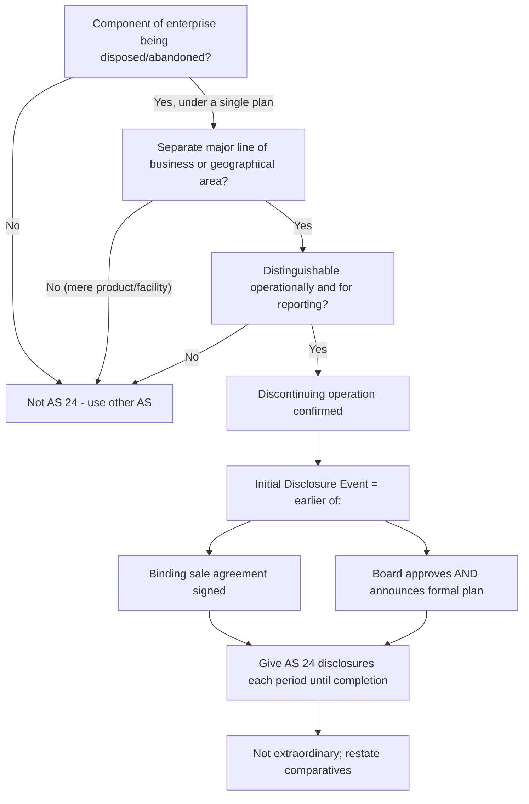

# Q&A — AS 24 — Discontinuing Operations

> ICAI syllabus | CA Intermediate — Advanced Accounting | All amounts in Rupees (Rs.)
> AS 24 governs **presentation and disclosure**; it does **not** create recognition or measurement rules (those come from AS 10, AS 28, AS 29, AS 4, etc.).

---

## SECTION A — Concept-Check (Question + Model Answer)

**A1. What is the objective of AS 24?**
To establish principles for **reporting information about discontinuing operations**, thereby enhancing the ability of users of financial statements to make **projections of an enterprise's cash flows, earnings-generating capacity, and financial position** by segregating information about discontinuing operations from continuing operations.

**A2. Does AS 24 lay down recognition and measurement rules?**
No. AS 24 deals **only with presentation and disclosure**. When an enterprise recognises or measures a gain, loss or impairment on a discontinuing operation, it applies the **relevant other standards** (AS 28 Impairment, AS 29 Provisions, AS 10 PPE, AS 4 events after the balance sheet date).

**A3. State the three cumulative conditions for a "discontinuing operation".**
A component of an enterprise that:
(a) pursuant to a **single plan**, is being (i) disposed of substantially in its entirety, or (ii) disposed of piecemeal, or (iii) terminated through **abandonment**; **and**
(b) represents a **separate major line of business or geographical area of operations**; **and**
(c) can be **distinguished operationally and for financial reporting purposes**.
All three must be satisfied.

**A4. Define the "Initial Disclosure Event".**
It is the **earlier** of:
(a) the enterprise entering into a **binding sale agreement** for substantially all the assets of the discontinuing operation; or
(b) the **board of directors** (or similar governing body) having **both** (i) approved a detailed, formal plan **and** (ii) **announced** the plan.

**A5. Give three situations that are NOT discontinuing operations.**
(1) Gradual or evolutionary **phasing out** of a product line or class of service; (2) discontinuing several products within an **ongoing** line of business; (3) **shifting** production/marketing for a line from one location to another, or **closing a facility** to achieve cost savings/productivity. (Also: selling a subsidiary whose activities are similar to the group's other operations.)

**A6. Should the results of a discontinuing operation be shown as an extraordinary item?**
No. AS 24 specifically states that amounts relating to discontinuing operations shall **not be presented as extraordinary items**.

**A7. When must the disclosures cease?**
Disclosures continue in financial statements for **each period until the discontinuance is completed** (plan substantially completed or abandoned), even though most of the payments are expected in later periods.

**A8. If the disposal plan is later abandoned, what is disclosed?**
The enterprise discloses the **fact and effect** of the abandonment, including reversal of any prior provision or impairment loss recognised in respect of the discontinuing operation.

**A9. How is comparative (prior period) information treated?**
Comparative information for prior periods presented in financial statements **after initial disclosure** should be **restated** to segregate continuing and discontinuing operations' assets, liabilities, income, expenses and cash flows.

---

## SECTION B — Graded Computational Problems (Full Solutions)

### B1 (Easy) — Carrying amount of net assets to be disposed of

On 31 March 2026, Alpha Ltd's "Textiles Division" (a discontinuing operation) has total assets of Rs. 8,00,000 and total liabilities of Rs. 3,00,000 attributable to it. Compute the carrying amount of net assets to be disclosed under AS 24.

**Solution.**
Net assets = Total assets − Total liabilities = Rs. 8,00,000 − Rs. 3,00,000 = **Rs. 5,00,000**.
AS 24 para 20(e) requires disclosure of **both** the total assets (Rs. 8,00,000) and total liabilities (Rs. 3,00,000) to be disposed of, not merely the net figure. The net Rs. 5,00,000 helps assess the disposal outcome.

---

### B2 (Moderate) — Pre-tax result and tax of a discontinuing operation

Beta Ltd's "Chemicals Segment" is a discontinuing operation. For the year ended 31 March 2026:
Revenue Rs. 40,00,000; Operating expenses Rs. 31,00,000; Depreciation Rs. 4,00,000; Interest on segment borrowings Rs. 1,00,000. Applicable tax rate 30%. Prepare the AS 24 income figures.

**Solution.**

| Particulars | Rs. |
|---|---|
| Revenue from ordinary activities | 40,00,000 |
| Less: Operating expenses | (31,00,000) |
| Less: Depreciation | (4,00,000) |
| Less: Interest | (1,00,000) |
| **Pre-tax profit from ordinary activities** | **4,00,000** |
| Less: Income tax @ 30% | (1,20,000) |
| **Profit after tax attributable to discontinuing operation** | **2,80,000** |

Disclosure under AS 24: revenue Rs. 40,00,000, expenses Rs. 36,00,000, **pre-tax profit Rs. 4,00,000** and **related income tax Rs. 1,20,000** are shown separately from continuing operations. **Check:** 40,00,000 − 36,00,000 = 4,00,000 ✓; 4,00,000 − 1,20,000 = 2,80,000 ✓.

---

### B3 (Exam-hard) — Full disclosure with disposal gain, impairment and tax

Gamma Ltd's board approved and announced on **15 January 2026** a detailed formal plan to sell its "Footwear Division" (a separate major line of business). This is the **initial disclosure event**. Data for the year ended **31 March 2026**:

- Attributable revenue Rs. 60,00,000; attributable expenses (excl. items below) Rs. 52,00,000.
- During the year the division **sold surplus machinery** (carrying amount Rs. 5,00,000) for Rs. 6,50,000 cash.
- On 31 March 2026 the remaining assets (carrying amount Rs. 20,00,000) were tested under **AS 28**; recoverable amount Rs. 17,00,000, so an **impairment loss** was recognised.
- Total assets to be disposed of on 31 March 2026 Rs. 22,00,000 (after impairment); total liabilities Rs. 9,00,000.
- Tax rate 30%.

**Required:** (i) pre-tax profit/loss from ordinary activities and related tax; (ii) gain on disposal of assets; (iii) journal entries for the machinery sale and impairment; (iv) net assets to be disclosed.

**Solution.**

**(iii) Journal entries first (drives the numbers).**

Machinery sale — gain = 6,50,000 − 5,00,000 = Rs. 1,50,000:
```
Bank A/c                          Dr. 6,50,000
   To Machinery A/c                        5,00,000
   To Profit on Sale of Machinery A/c      1,50,000
```

Impairment loss = 20,00,000 − 17,00,000 = Rs. 3,00,000 (AS 28):
```
Impairment Loss A/c               Dr. 3,00,000
   To Provision for Impairment / Asset A/c 3,00,000
```

**(i) Pre-tax profit from ordinary activities.** The impairment loss is an expense of ordinary activities of the division; the machinery gain is disclosed **separately** as a gain on disposal (AS 24 para 27), so it is NOT clubbed into the ordinary-activities line.

| Particulars | Rs. |
|---|---|
| Revenue | 60,00,000 |
| Less: Attributable expenses | (52,00,000) |
| Less: Impairment loss (AS 28) | (3,00,000) |
| **Pre-tax profit from ordinary activities** | **5,00,000** |
| Related income tax @ 30% | (1,50,000) |

**(ii) Gain on disposal of assets** = **Rs. 1,50,000** (pre-tax), tax @30% = Rs. 45,000, disclosed separately per para 27(a) and 27(b).

**(iv) Net assets to be disposed of** = Total assets Rs. 22,00,000 − Total liabilities Rs. 9,00,000 = **Rs. 13,00,000** (both gross figures disclosed).

**Self-check.** Total pre-tax impact of the division for the year = ordinary profit 5,00,000 + disposal gain 1,50,000 = Rs. 6,50,000; total tax = 1,50,000 + 45,000 = Rs. 1,95,000; profit after tax = Rs. 4,55,000. All internally consistent ✓. Because the initial disclosure event (15 Jan 2026) fell **within** the reporting year, these disclosures are required in the 31 March 2026 financial statements.

---

### B4 (Exam-hard) — Net selling price under a binding sale agreement

On 20 March 2026 Delta Ltd signed a **binding agreement** to sell its "Publishing Division" for Rs. 30,00,000, with estimated disposal costs (legal, brokerage) of Rs. 1,20,000. Carrying amount of net assets on 31 March 2026 is Rs. 25,00,000. Completion is expected by 30 September 2026. State the AS 24 disclosures and the expected pre-tax gain.

**Solution.**
The binding sale agreement **is itself an initial disclosure event** (para 15). Disclosures required (para 23):
- **Net selling price** = agreed price − expected disposal costs = 30,00,000 − 1,20,000 = **Rs. 28,80,000**.
- **Expected timing** of cash flows: completion by 30 September 2026.
- **Carrying amount of net assets** = Rs. 25,00,000.
- **Expected pre-tax gain** = 28,80,000 − 25,00,000 = **Rs. 3,80,000** (recognised only when AS 4/AS 10 criteria for gain are met on completion; disclosed now as expected). **Check:** 28,80,000 − 25,00,000 = 3,80,000 ✓.

---

## SECTION C — Past-Paper-Style Full Questions (Model Answers)

**C1.** *Epsilon Ltd manufactures garments. During 2025-26 management decided to gradually phase out its older "cotton shirts" product over three years while continuing the overall garments business from the same plant. The CFO wants to treat this as a discontinuing operation under AS 24. Advise.*

**Model Answer.** AS 24 requires **all three** conditions of a discontinuing operation, and the definition **excludes** a "gradual or evolutionary phasing out of a product line or class of service." Here (a) the phase-out is gradual over three years, not a single-plan disposal/abandonment; (b) it is one product **within an ongoing** garments line, not a **separate major line of business or geographical area**; (c) it is not separately distinguishable operationally as an entire component. Therefore this is **not** a discontinuing operation and the special AS 24 presentation/disclosures do **not** apply. Ordinary disclosures under other standards continue.

**C2.** *Zeta Ltd's board approved and publicly announced on 10 February 2026 a formal plan to close and abandon its loss-making "Machine Tools Division" — a separate major line of business — with abandonment to be completed by December 2026. State the initial disclosures Zeta Ltd must give in its 31 March 2026 financial statements.*

**Model Answer.** The **board approval + announcement** on 10 February 2026 is the **initial disclosure event** (earlier of binding sale / approved-and-announced plan). Since abandonment is a permitted mode of discontinuance and Machine Tools is a separate major line, AS 24 applies. Initial disclosures (para 20):
(a) a **description** of the discontinuing operation;
(b) the **business/geographical segment(s)** in which it is reported under AS 17;
(c) the **date and nature** of the initial disclosure event (10 Feb 2026; approval and announcement of formal plan);
(d) the **expected period/date of completion** (December 2026);
(e) **carrying amounts of total assets and total liabilities** to be disposed of as at 31 March 2026;
(f) attributable **revenue and expenses** of ordinary activities for the year;
(g) **pre-tax profit/loss** from ordinary activities and the **related income tax**;
(h) **net cash flows** attributable to operating, investing and financing activities of the division.
These are updated each period until abandonment is complete; nothing is shown as an extraordinary item.

**C3.** *Explain how AS 24 interacts with AS 28 and AS 4.*

**Model Answer.** AS 24 does not itself measure impairment or provisions. When a discontinuance plan is approved, assets of the operation are frequently impaired; the enterprise applies **AS 28** to estimate and recognise any **impairment loss** (recoverable amount vs carrying amount). Provisions for termination/exit costs are recognised only when the **AS 29** obligating-event criteria are met — AS 24 does **not** create new provisions. Under **AS 4**, if the initial disclosure event occurs **after** the balance sheet date but before approval of the financials, it is a **non-adjusting** event requiring disclosure only (assets/liabilities of that year are not restated), whereas an event within the year triggers full AS 24 presentation.

---

## SECTION D — MCQs / Case Scenarios

**D1.** AS 24 primarily prescribes rules for:
A) Measurement of impairment  B) Recognition of provisions  C) Presentation and disclosure  D) Deferred tax
**Answer: C.** AS 24 is a disclosure/presentation standard; measurement comes from other standards.

**D2.** The initial disclosure event is the **earlier** of a binding sale agreement and:
A) Completion of disposal  B) Board approval **and** announcement of a formal plan  C) First asset sale  D) Year-end
**Answer: B.** Both approval and announcement together constitute the event.

**D3.** Which is a discontinuing operation?
A) Closing a plant for cost savings  B) Shifting production to another city  C) Selling an entire separate major line of business under a single plan  D) Phasing out one product in an ongoing line
**Answer: C.** Only C meets all three conditions; A, B, D are expressly excluded.

**D4.** Results of a discontinuing operation are presented as:
A) Extraordinary items  B) Prior period items  C) Segregated from continuing operations, not extraordinary  D) Contingent liabilities
**Answer: C.** AS 24 forbids extraordinary-item treatment.

**D5.** Net selling price under a binding sale agreement is disclosed as:
A) Agreed price gross  B) Agreed price **less** expected disposal costs  C) Carrying amount  D) Recoverable amount
**Answer: B.** Net of expected disposal costs, with timing of cash flows.

**D6. Case.** *Board approved and announced a division-closure plan on 5 April 2026; year-end is 31 March 2026, financials approved 20 May 2026.* The 31 March 2026 statements should:
A) Fully restate the division as discontinuing  B) Ignore it entirely  C) Give AS 24 **disclosure only** as a non-adjusting event under AS 4  D) Provide for all future losses
**Answer: C.** The event is after the balance sheet date — non-adjusting; disclose only.

**D7.** Comparative prior-period figures after initial disclosure should be:
A) Left unchanged  B) Restated to segregate continuing/discontinuing  C) Deleted  D) Shown as extraordinary
**Answer: B.** Restatement of comparatives is required for comparability.

---

## Solution-Path Diagram — Is it a Discontinuing Operation, and what triggers disclosure?



---

## Quick-Revision Trigger List
- Three tests: **single plan** + **major line/geography** + **separately distinguishable**.
- Initial disclosure event = **earlier** of binding sale OR (approve **and** announce).
- Disclose para 20 items (a)–(h); **never** extraordinary; **restate comparatives**.
- Measurement borrowed from **AS 28 / AS 29 / AS 10 / AS 4**.
- Continue disclosures **until completion**; on abandonment disclose **reversal**.
