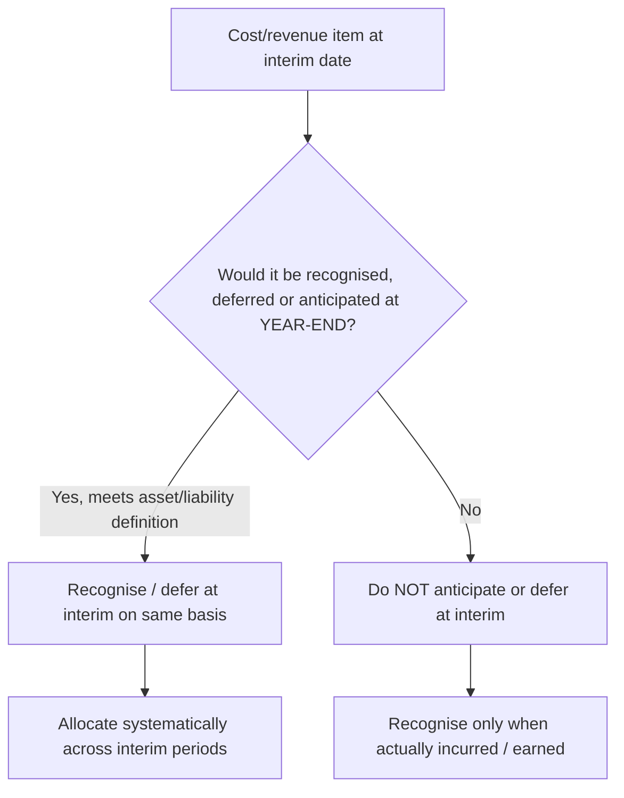

# Q&A — AS 25 — Interim Financial Reporting

> Exam-oriented question bank. Every question is immediately followed by a complete model answer. All amounts in Rupees (₹). Based strictly on AS 25 issued by ICAI. No invented provisions.

---

## Section A — Concept-Check (Short Answer)

**A1. Define an "interim period" and "interim financial report" as per AS 25.**

**Answer.** An *interim period* is a financial reporting period shorter than a full financial year (e.g., a quarter or half-year). An *interim financial report* is a financial report containing either a **complete set** of financial statements (as described in AS 1) or a **set of condensed** financial statements for an interim period.

---

**A2. Does AS 25 make interim reporting mandatory?**

**Answer.** No. AS 25 does **not** mandate *which* enterprises should present interim reports, *how frequently*, or *how soon* after period-end. That is left to statutes/regulators (e.g., SEBI LODR for listed companies). AS 25 only prescribes the **minimum content** and the **recognition and measurement principles** *if and when* an enterprise is required or elects to prepare an interim financial report claiming compliance with Accounting Standards.

---

**A3. List the minimum components of a *condensed* interim financial report.**

**Answer.**
1. Condensed Balance Sheet
2. Condensed Statement of Profit and Loss
3. Condensed Cash Flow Statement
4. Selected explanatory notes

(Each condensed statement carries, at minimum, each of the headings and sub-headings that were in the most recent annual financial statements, plus selected explanatory notes.)

---

**A4. State the two competing views on the objective of interim reporting, and which one AS 25 adopts.**

**Answer.**
- **Discrete view:** each interim period is a standalone accounting period; results measured as if it were a separate full year.
- **Integral view:** each interim period is an integral part of the annual period; annual expenses are allocated across interims via estimates.

AS 25 predominantly follows the **discrete (independent) view** for *recognition and measurement*: the enterprise applies the **same accounting policies** in the interim statements as in its annual statements, measuring income and expenses on a year-to-date basis. Costs are **not anticipated or deferred** at interim date unless such anticipation/deferral would be appropriate at year-end.

---

**A5. What comparative periods must an interim report present?**

**Answer.**
| Statement | Current | Comparative |
|---|---|---|
| Balance Sheet | End of current interim period | End of immediately preceding **financial year** |
| Statement of P&L | Current interim period **and** cumulative (year-to-date) | Comparable interim period & year-to-date of preceding year |
| Cash Flow Statement | Cumulative (year-to-date) current year | Comparable year-to-date of preceding year |

---

**A6. State the "same accounting policies" principle and its one exception.**

**Answer.** An enterprise applies the **same accounting policies** in its interim statements as in its annual statements. The one exception: **accounting policy changes made after the date of the most recent annual statements** that will be reflected in the *next* annual statements — these are applied in the interim report. This ensures a single set of policies is applied to a financial year regardless of interim reporting frequency.

---

**A7. Explain the treatment of a cost that is incurred unevenly during the year.**

**Answer.** Costs incurred unevenly (e.g., advertising, staff bonus) should be **anticipated or deferred at interim date only if it would also be appropriate to anticipate or defer that type of cost at the end of the financial year.** Merely because a cost falls in one quarter does not permit spreading it, unless a liability/asset definition is met.

---

## Section B — Graded Computational Problems

### B1 (Easy) — Estimated annual effective tax rate

**Q.** An enterprise expects annual pre-tax earnings of ₹40,00,000 evenly across four quarters and an estimated weighted-average annual income-tax rate of 30%. Compute the tax expense for Q1 and cumulative tax up to Q2.

**Solution (step-by-step).**
- Income tax in interims is accrued using the **estimated average annual effective tax rate** applied to interim pre-tax income (AS 25).
- Quarterly pre-tax income = 40,00,000 ÷ 4 = **₹10,00,000**.
- Q1 tax = 10,00,000 × 30% = **₹3,00,000**.
- Year-to-date to Q2 pre-tax = 20,00,000; cumulative tax = 20,00,000 × 30% = **₹6,00,000**.

**Verify:** Full-year tax = 40,00,000 × 30% = ₹12,00,000 = 4 × ₹3,00,000. Reconciles. ✔

---

### B2 (Easy–Moderate) — Graduated tax rates / relief

**Q.** An enterprise earns ₹15,00,000 pre-tax in each quarter (annual ₹60,00,000). Tax: 20% on first ₹40,00,000 and 30% on the balance. Compute the effective annual rate and each quarter's tax.

**Solution.**
- Estimated annual tax = (40,00,000 × 20%) + (20,00,000 × 30%) = 8,00,000 + 6,00,000 = **₹14,00,000**.
- Estimated annual **effective rate** = 14,00,000 ÷ 60,00,000 = **23.33%**.
- Each quarter's tax = 15,00,000 × 23.33% = **₹3,50,000**.

**Verify:** 4 × 3,50,000 = ₹14,00,000 = annual tax. ✔ (The blended rate spreads the benefit of the lower slab evenly — not "20% in early quarters, 30% later.")

---

### B3 (Moderate) — Year-to-date measurement & the "true-up"

**Q.** Quarterly pre-tax profits are Q1 ₹8,00,000, Q2 ₹12,00,000. At Q1 the estimated annual effective tax rate was 25%; by Q2, revised estimate is 28%. Show tax expense reported in Q1 and Q2 statements.

**Solution.**
- **Q1:** tax = 8,00,000 × 25% = **₹2,00,000** (reported in Q1).
- **Q2 (year-to-date basis):**
  - Cumulative pre-tax to Q2 = 8,00,000 + 12,00,000 = 20,00,000.
  - Cumulative tax at revised 28% = 20,00,000 × 28% = ₹5,60,000.
  - Tax already reported in Q1 = ₹2,00,000.
  - **Q2 tax expense = 5,60,000 − 2,00,000 = ₹3,60,000.**

**Principle:** Each interim measurement is on a **cumulative (YTD) basis**; a change in estimate is reflected in the current interim period, not by restating the prior interim (AS 25 + AS 5). ✔

---

### B4 (Moderate) — Seasonal revenue must NOT be smoothed

**Q.** A firm selling woollens earns revenue ₹2,00,000 (Q1), ₹1,00,000 (Q2), ₹7,00,000 (Q3), ₹10,00,000 (Q4). Costs are ₹5,00,000 per quarter (even). A manager proposes reporting revenue evenly at ₹5,00,000 per quarter "to smooth results." Comment and prepare correct quarter results.

**Solution.**
Revenues that are received **seasonally, cyclically or occasionally** must **not be anticipated or deferred** as of interim date if such treatment is not appropriate at year-end. Revenue is recognised **when it occurs** (AS 9 / relevant revenue standard). Smoothing is **not permitted**.

| Quarter | Revenue | Cost | Result |
|---|---|---|---|
| Q1 | 2,00,000 | 5,00,000 | (3,00,000) |
| Q2 | 1,00,000 | 5,00,000 | (4,00,000) |
| Q3 | 7,00,000 | 5,00,000 | 2,00,000 |
| Q4 | 10,00,000 | 5,00,000 | 5,00,000 |
| **Year** | **20,00,000** | **20,00,000** | **0** |

**Verify:** Sum of revenue = ₹20,00,000; sum of results = ₹0. ✔ The seasonal loss in H1 must be shown, but AS 25 encourages **additional disclosure** of seasonality (e.g., trailing-12-month figures).

---

### B5 (Exam-hard) — Uneven costs: bonus, major repairs, year-end volume rebate

**Q.** For the year to 31 March, an enterprise has these items. Determine the amount to recognise in the **quarter ended 30 June (Q1)**:
1. Contractual annual staff bonus of ₹4,80,000, payable if employed at year-end; past practice makes payment virtually certain and it accrues with services rendered evenly.
2. Planned major overhaul of machinery costing ₹6,00,000 scheduled for Q4 (no obligation exists before it is incurred).
3. A volume rebate of ₹1,20,000 the enterprise expects to *receive* from a supplier, contingent on annual purchases exceeding a threshold that is virtually certain to be met; purchases are even across quarters.
4. Property insurance premium of ₹2,40,000 paid on 1 April covering the full year.

**Solution (item-by-item, AS 25 recognition principles).**

1. **Staff bonus — accrue.** A present obligation exists that builds up with employee service and payment is virtually certain → recognise on a systematic basis. Q1 = 4,80,000 × 3/12 = **₹1,20,000**.

2. **Major overhaul — do NOT accrue.** No obligation exists at interim date (or at year-end before the work is done); anticipating a future planned cost is not appropriate at year-end, hence not at interim. Q1 = **₹0**. (The cost hits Q4 when incurred.)

3. **Volume rebate receivable — accrue.** Discounts/rebates virtually certain to be earned are anticipated on a systematic basis, mirroring year-end treatment. Q1 credit = 1,20,000 × 3/12 = **₹30,000** (reduce cost of purchases).

4. **Insurance premium — spread.** A prepayment giving benefit over 12 months is deferred and charged systematically. Q1 charge = 2,40,000 × 3/12 = **₹60,000**.

**Net effect on Q1 P&L (expenses/(income)):**
1,20,000 (bonus) + 0 (overhaul) − 30,000 (rebate) + 60,000 (insurance) = **₹1,50,000 net expense**.

**Verify full-year reconciliation:** bonus 4,80,000 + overhaul 6,00,000 − rebate 1,20,000 + insurance 2,40,000 = ₹12,00,000 total annual; of which Q1's fair share for the three spread items (1,20,000+... ) is consistent with 3/12 allocation, and the overhaul stays entirely in Q4. ✔

---

### B6 (Exam-hard) — Change in estimate and journal entries

**Q.** In Q1 an enterprise recognised a warranty provision of ₹90,000 based on 3% of sales of ₹30,00,000. In Q3, based on actual claims trend, it revises the annual warranty rate to 2%. Cumulative sales to Q3 are ₹90,00,000. Show the cumulative provision required at Q3, the Q3 adjustment, and the journal entry.

**Solution.**
- Cumulative provision required at Q3 = 90,00,000 × 2% = **₹1,80,000**.
- Provision already carried (Q1 + Q2 at earlier estimates). Assume Q1 ₹90,000 and Q2 (sales ₹30,00,000 × 3%) ₹90,000 → carried ₹1,80,000... but revised rate applies YTD.
- **Under AS 25, revise on a YTD basis at 2%:** required cumulative = ₹1,80,000. Already recognised at 3% = 90,00,000 × 3% = ₹2,70,000.
- **Q3 reversal = 2,70,000 − 1,80,000 = ₹90,000 credit to P&L** (change in estimate, prospective per AS 5; reflected in current interim).

**Journal entry (Q3):**
```
Provision for Warranty A/c        Dr. 90,000
    To Statement of Profit & Loss              90,000
(Being downward revision of warranty estimate reflected on YTD basis)
```

**Verify:** Post-entry provision balance = 2,70,000 − 90,000 = ₹1,80,000 = 2% × ₹90,00,000. ✔ Prior interims are **not** restated.

---

### B7 (Exam-hard) — Inventory NRV write-down at interim

**Q.** At 30 September (H1 close) inventory cost is ₹10,00,000, NRV ₹8,50,000. At 31 March (year-end) NRV recovers to ₹9,70,000. Show interim and annual treatment.

**Solution.**
- **At interim (H1):** Apply the **same principle as annual** (AS 2). Write inventory down to NRV. Write-down = 10,00,000 − 8,50,000 = **₹1,50,000 charged in H1**.
```
Statement of P&L A/c      Dr. 1,50,000
    To Inventory (Provision)          1,50,000
```
- **At year-end:** NRV ₹9,70,000 < cost ₹10,00,000, so carry at ₹9,70,000. Required write-down = ₹30,000. Since ₹1,50,000 was earlier provided, **reverse ₹1,20,000** in H2.
```
Inventory (Provision) A/c   Dr. 1,20,000
    To Statement of P&L               1,20,000
```

**Verify:** Net annual charge = 1,50,000 − 1,20,000 = ₹30,000 = cost 10,00,000 − year-end NRV 9,70,000. ✔ Interim measurements may need revision as circumstances change; recovery within the year is reflected when it occurs.

---

## Solution-path diagram (Cost recognition at interim date)



---

## Section C — Past-Paper-Style Full Questions

### C1. Explain how income tax expense is measured in interim financial reports under AS 25. Illustrate with weighted-average annual rate and jurisdictional differences.

**Model Answer.**
Interim period income tax is accrued using the **tax rate that would be applicable to expected total annual earnings** — the **estimated average annual effective income-tax rate** applied to the pre-tax income of the interim period. This mirrors the annual computation and avoids distortion from progressive slabs, rebates, or credits falling in particular quarters.

Key rules:
- To the extent practicable, a **separate estimated average annual effective tax rate is determined for each taxing jurisdiction** and applied individually to the interim pre-tax income of each jurisdiction; where impracticable, a weighted average across jurisdictions or categories may be used.
- The rate reflects enacted/substantively enacted changes, expected tax credits, and graduated (slab) rates through a **blended** effective rate.
- The estimate is **revised** as the year progresses; changes are reflected in the **current interim period on a YTD basis** (AS 5 change in estimate), without restating prior interims.
- A **new tax rate change** taking effect during the year is applied from its effective date to relevant income.

*Illustration:* Expected annual profit ₹80,00,000; tax 20% on first ₹50,00,000 and 30% on balance → annual tax = 10,00,000 + 9,00,000 = ₹19,00,000; effective rate = 23.75%. Each quarter's pre-tax income is taxed at 23.75%, so the slab benefit is spread evenly rather than front-loaded.

---

### C2. "Interim reports use the same recognition and measurement principles as annual reports, yet certain estimates are made on a fuller basis." Discuss with reference to the use of estimates and materiality in AS 25.

**Model Answer.**
AS 25 adopts the **integral-with-annual-policies but discrete-measurement** approach:

1. **Same accounting policies** as annual financial statements are used (except a policy change intended for the next annual statements, adopted early).

2. **Use of estimates:** Interim measurement may rely on estimates to a **greater extent** than annual measurement, but the procedures must ensure that the **information is reliable and all material information is disclosed**. Examples: inventories may be estimated using sales margins rather than full physical count; provisions estimated by professionals not necessarily engaged mid-year; income tax via annual effective rate.

3. **Materiality** is assessed **in relation to the interim period financial data**, not the annual data, recognising that interim measurements rely more on estimates. This ensures interim reports include all information relevant to understanding the interim period — an item immaterial annually may be material to a single quarter.

4. **Measurements are YTD:** each interim measurement is made on a year-to-date basis so that the frequency of interim reporting does **not** affect the annual results. Thus a change in estimate in a later quarter adjusts that quarter, not prior ones.

The net effect: consistency of policy with the annual accounts, combined with pragmatic, more-estimated but reliable interim measurement.

---

### C3. State the selected explanatory notes and additional disclosures AS 25 requires in condensed interim reports.

**Model Answer.** At minimum, the following are disclosed in the notes (if material and not disclosed elsewhere), on a year-to-date basis:
1. A statement that the **same accounting policies** are followed as in the most recent annual statements, or a description of the nature and effect of any change.
2. Explanatory comments about the **seasonality or cyclicality** of interim operations.
3. Nature and amount of items affecting assets, liabilities, equity, net income or cash flows that are **unusual** due to nature, size or incidence.
4. Nature and amount of **changes in estimates** of amounts reported in prior interim periods of the current year, or prior financial years, if material.
5. Issuances, buy-backs, repayments and restructuring of **debt, equity and potential equity** shares.
6. **Dividends** (aggregate or per share) separately for equity and other shares.
7. **Segment revenue, segment result** (if the enterprise reports segment information under AS 17).
8. **Material events subsequent** to the interim period end not reflected in the interim statements.
9. Effect of **changes in the composition** of the enterprise (business combinations, acquisitions/disposals of subsidiaries, long-term investments, restructurings, discontinuing operations).
10. Material changes in **contingent liabilities** since the last annual balance sheet date.

Also: if an estimate reported in an interim period changes significantly in the **final interim period** but no separate report is issued for that final period, the nature and amount of the change is disclosed in a **note to the annual financial statements**.

---

## Section D — MCQs / Case Scenarios

**D1.** AS 25 primarily prescribes:
(a) which enterprises must publish interim reports
(b) the minimum content and recognition/measurement principles for interim reports
(c) the frequency of interim reporting
(d) the deadline for filing interim reports

**Answer: (b).** AS 25 governs content and measurement, not who/when/how-often (that is left to regulators).

---

**D2.** A minimum condensed interim report includes all EXCEPT:
(a) Condensed Balance Sheet
(b) Condensed Statement of Profit and Loss
(c) Condensed Cash Flow Statement
(d) Full Directors' Report

**Answer: (d).** A Directors' Report is not a component of the interim financial report under AS 25.

---

**D3.** Interim income tax is measured using:
(a) the marginal tax rate of the quarter
(b) the highest slab rate
(c) the estimated average annual effective tax rate
(d) last year's actual rate

**Answer: (c).** It applies expected annual behaviour to interim pre-tax income, spreading slab benefits.

---

**D4.** A company plans a ₹5,00,000 advertising campaign wholly in Q3. In Q1 it should recognise:
(a) ₹1,25,000
(b) ₹0
(c) ₹5,00,000
(d) ₹2,50,000

**Answer: (b) ₹0.** A cost is anticipated at interim only if it would be anticipated at year-end; a future planned cost creating no present obligation is not accrued.

---

**D5.** In the interim Balance Sheet, the comparative column shows figures as at:
(a) the comparable interim date last year
(b) the end of the immediately preceding financial year
(c) the beginning of the current year only
(d) both (a) and (b)

**Answer: (b).** Balance Sheet comparison is with the end of the immediately preceding **financial year**; P&L and cash flow use comparable interim periods.

---

**D6.** Seasonal revenue of a business should be:
(a) spread evenly across all quarters
(b) recognised when it occurs, with disclosure of seasonality
(c) deferred to the year-end
(d) recognised only in the quarter of highest sales

**Answer: (b).** No smoothing; recognise when earned and disclose the seasonal nature.

---

**D7 (Case).** At Q1 an enterprise recognised tax at 26% on ₹5,00,000 (₹1,30,000). By Q2 the estimated annual rate rises to 29%; cumulative pre-tax to Q2 is ₹11,00,000. Tax reported in Q2 statement is:
(a) ₹1,89,000
(b) ₹3,19,000
(c) ₹1,74,000
(d) ₹1,45,000

**Answer: (a) ₹1,89,000.** YTD tax = 11,00,000 × 29% = ₹3,19,000; less Q1 ₹1,30,000 = **₹1,89,000**.

---

**D8 (Case).** A policy change (new depreciation method) is decided in Q2 and will be adopted in the next annual accounts. In the Q2 interim report the enterprise should:
(a) ignore it until year-end
(b) apply the new policy and disclose its nature and effect
(c) apply it only from next year
(d) restate the prior annual accounts

**Answer: (b).** The one exception to "same policies" — a change intended for the next annual statements is applied in the interim report with disclosure.

---

**D9 (Case).** Inventory written down to NRV in H1 recovers by year-end. The recovery is:
(a) never reversed
(b) reversed in H2 to the extent NRV recovers (capped at original cost basis), reflecting revised interim measurement
(c) taken directly to reserves
(d) treated as prior-period item

**Answer: (b).** Interim measurements are revised as circumstances change; the reversal is recognised when the recovery occurs, subject to AS 2 limits.

---

**D10.** Materiality for interim reporting is judged in relation to:
(a) annual financial data
(b) the interim period financial data
(c) the group's consolidated data
(d) prior year's interim data

**Answer: (b).** Materiality is assessed against the interim period figures, acknowledging greater reliance on estimates.

---

## Quick self-check reconciliations (all verified)
- B1: 4 × 3,00,000 = 12,00,000 ✔
- B2: 4 × 3,50,000 = 14,00,000 ✔
- B3: YTD 5,60,000 = 2,00,000 + 3,60,000 ✔
- B4: quarter results sum to ₹0 on ₹20,00,000 revenue ✔
- B5: annual items total ₹12,00,000; overhaul isolated to Q4 ✔
- B6: post-adjustment provision ₹1,80,000 = 2% × 90,00,000 ✔
- B7: net annual write-down ₹30,000 = cost − year-end NRV ✔

*End of Q&A — AS 25 — Interim Financial Reporting.*
