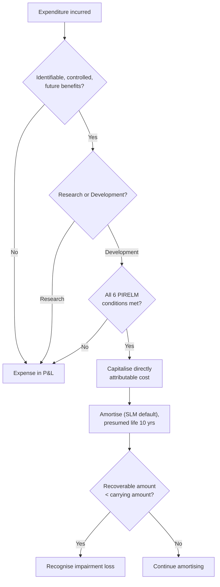

# Q&A — AS 26 — Intangible Assets

> CA Intermediate | Advanced Accounting | ICAI AS 26. All figures in Rupees (Rs.). Self-verified for arithmetic reconciliation.

---

## Section A — Concept Check (with answers)

**A1.** Define an intangible asset as per AS 26.
**Ans.** An intangible asset is an **identifiable non-monetary asset, without physical substance, held for use** in production/supply of goods or services, for rental to others, or for administrative purposes. Three tests: (i) identifiability, (ii) control, (iii) future economic benefits.

**A2.** State the two recognition criteria that must BOTH be met.
**Ans.** (i) It is **probable** that expected future economic benefits attributable to the asset will flow to the enterprise; and (ii) the **cost** of the asset can be **measured reliably**.

**A3.** How is "identifiability" satisfied?
**Ans.** The asset is **separable** (capable of being sold, transferred, licensed) OR arises from **contractual/legal rights** — this distinguishes it from goodwill.

**A4.** Can internally generated goodwill be recognised? Why?
**Ans.** **No.** It is not an identifiable resource controlled by the enterprise that can be measured reliably at cost.

**A5.** Distinguish the Research phase from the Development phase.
**Ans.** **Research** = original planned investigation for new knowledge; all research cost is **expensed**. **Development** = applying research findings to a plan/design for new/improved products before commercial production; capitalised **only if** the enterprise demonstrates the six PIRELM conditions.

**A6.** List the six development-capitalisation conditions.
**Ans.** (i) **T**echnical feasibility of completion; (ii) **I**ntention to complete and use/sell; (iii) **A**bility to use or sell; (iv) probable **future economic benefits** (existence of a market/usefulness); (v) availability of adequate technical, financial and other **resources**; (vi) ability to **measure expenditure reliably**.

**A7.** What is the presumed maximum useful life under AS 26 and can it be exceeded?
**Ans.** Rebuttable presumption of **10 years**. It may be exceeded only if there is **persuasive evidence** of a longer life; then annual impairment testing and disclosure of reasons are required.

**A8.** Which method of amortisation is the default when the consumption pattern cannot be determined reliably?
**Ans.** The **Straight Line Method (SLM)**, with residual value presumed **zero** (unless a committed third-party buyer exists or an active market exists).

**A9.** List four items AS 26 specifically prohibits from being capitalised as intangible assets.
**Ans.** Internally generated **goodwill, brands, mastheads, publishing titles, customer lists**; also expenditure on **research, start-up, training, advertising, relocation**.

**A10.** Can amortisation cease when the asset is temporarily idle?
**Ans.** **No.** Amortisation begins when the asset is available for use and continues even if idle, unless it is fully amortised or derecognised.

---

## Section B — Graded Computational Problems (full solutions)

### B1 (Easy) — Straight-line amortisation
A software licence is acquired on 1 Apr 2024 for Rs. 6,00,000. Useful life 5 years, residual value nil. Compute annual amortisation and the carrying amount on 31 Mar 2026.

**Solution.**
Annual amortisation = 6,00,000 / 5 = **Rs. 1,20,000**.
Accumulated (2 years) = 1,20,000 × 2 = 2,40,000.
Carrying amount 31 Mar 2026 = 6,00,000 − 2,40,000 = **Rs. 3,60,000**.

### B2 (Easy–Moderate) — Cost of acquired intangible
An enterprise imports a patent. Purchase price Rs. 8,00,000; import duty Rs. 50,000; non-refundable purchase taxes Rs. 30,000; legal fees to register Rs. 20,000; staff training on using the patent Rs. 40,000; trade discount Rs. 25,000. Compute capitalised cost.

**Solution.**
| Item | Rs. | Include? |
|---|---|---|
| Purchase price | 8,00,000 | Yes |
| Less trade discount | (25,000) | Deduct |
| Import duty | 50,000 | Yes |
| Non-refundable taxes | 30,000 | Yes |
| Legal registration fees | 20,000 | Yes (directly attributable) |
| Training | 40,000 | **No — expense** |

Capitalised cost = 8,00,000 − 25,000 + 50,000 + 30,000 + 20,000 = **Rs. 8,75,000**.
Training Rs. 40,000 is charged to P&L.

### B3 (Moderate) — Research vs Development split
During 2024-25 Zeta Ltd incurred on a project: market research Rs. 3,00,000; laboratory investigation for new knowledge Rs. 5,00,000; design of a pre-production prototype after feasibility established Rs. 7,00,000; testing of the prototype Rs. 2,00,000. All six recognition conditions were met from the prototype stage onwards. Determine the amount expensed and capitalised.

**Solution.**
- Market research (3,00,000) → **research/expense**.
- Laboratory investigation for new knowledge (5,00,000) → **research/expense**.
- Prototype design (7,00,000) → development, conditions met → **capitalise**.
- Prototype testing (2,00,000) → development, conditions met → **capitalise**.

Expensed to P&L = 3,00,000 + 5,00,000 = **Rs. 8,00,000**.
Capitalised as intangible (development) = 7,00,000 + 2,00,000 = **Rs. 9,00,000**.
Check: total spend 17,00,000 = 8,00,000 + 9,00,000. ✔

### B4 (Moderate) — Expenditure already expensed cannot be reinstated
In B3, suppose Rs. 1,50,000 of the laboratory cost was incurred and expensed in a prior year 2023-24, before feasibility. In 2024-25 conditions are met. Can the Rs. 1,50,000 be capitalised now?

**Solution.**
**No.** AS 26 prohibits reinstating expenditure previously recognised as an expense; it cannot form part of the cost of the intangible asset at a later date. It remains a P&L charge of 2023-24.

### B5 (Exam-hard) — Development cost, capitalisation date, amortisation and impairment
Nova Ltd's project "N-1" (year 2024-25):
- 1 Apr–30 Jun 2024: research Rs. 12,00,000 (feasibility NOT established).
- 1 Jul 2024: all six PIRELM conditions met.
- 1 Jul 2024–31 Dec 2024: development expenditure Rs. 24,00,000 (directly attributable).
- Asset available for use 1 Jan 2025; useful life 6 years; SLM; residual value nil.
- On 31 Mar 2025, recoverable amount of the intangible is estimated at Rs. 21,00,000.

Compute (a) capitalised cost, (b) amortisation for 2024-25, (c) impairment loss, (d) carrying amount on 31 Mar 2025.

**Solution.**
**(a) Capitalised cost.** Only expenditure from 1 Jul 2024 (date conditions met) is capitalised. Research Rs. 12,00,000 is expensed.
Capitalised cost = **Rs. 24,00,000**.

**(b) Amortisation 2024-25.** Amortisation starts when available for use = 1 Jan 2025. Period = 3 months (Jan–Mar).
Annual amortisation = 24,00,000 / 6 = 4,00,000.
For 3 months = 4,00,000 × 3/12 = **Rs. 1,00,000**.

**(c) Impairment.** Carrying amount before impairment = 24,00,000 − 1,00,000 = 23,00,000.
Recoverable amount = 21,00,000.
Impairment loss = 23,00,000 − 21,00,000 = **Rs. 2,00,000**.

**(d) Carrying amount 31 Mar 2025** = 21,00,000.
Reconciliation: 24,00,000 − 1,00,000 amortisation − 2,00,000 impairment = **Rs. 21,00,000**. ✔

**Journal entries (2024-25):**
| Particulars | Dr (Rs.) | Cr (Rs.) |
|---|---|---|
| Research Expenditure A/c ... Dr | 12,00,000 | |
|   To Bank | | 12,00,000 |
| Intangible Asset (Development) A/c ... Dr | 24,00,000 | |
|   To Bank | | 24,00,000 |
| Amortisation A/c ... Dr | 1,00,000 | |
|   To Intangible Asset A/c | | 1,00,000 |
| Impairment Loss A/c ... Dr | 2,00,000 | |
|   To Intangible Asset A/c | | 2,00,000 |
| Profit & Loss A/c ... Dr | 15,00,000 | |
|   To Research Exp / Amortisation / Impairment | | 15,00,000 |

### B6 (Exam-hard) — Useful life exceeding 10 years
Orion Ltd acquired a licence on 1 Apr 2020 for Rs. 40,00,000. Management, with persuasive evidence (a 20-year statutory concession), assessed the life at **20 years**, SLM, nil residual. On 31 Mar 2025 (after 5 years) an impairment review gives a recoverable amount of Rs. 27,00,000. Compute amortisation p.a., carrying amount before impairment on 31 Mar 2025, and impairment loss.

**Solution.**
Annual amortisation = 40,00,000 / 20 = **Rs. 2,00,000**.
Accumulated over 5 years = 2,00,000 × 5 = 10,00,000.
Carrying amount 31 Mar 2025 (pre-impairment) = 40,00,000 − 10,00,000 = **Rs. 30,00,000**.
Recoverable amount = 27,00,000 → Impairment loss = 30,00,000 − 27,00,000 = **Rs. 3,00,000**.
Because life exceeds 10 years, AS 26 requires **annual impairment testing** and disclosure of the reasons for rebutting the 10-year presumption. Carrying amount after impairment = **Rs. 27,00,000**.

---

## Section C — Past-Paper-Style Full Questions

### C1. (Treatment analysis)
Beta Ltd incurred the following during 2024-25. State the correct AS 26 treatment with reasons:
(i) Rs. 5,00,000 on an advertising campaign to launch a product.
(ii) Rs. 9,00,000 to purchase a customer list from another firm.
(iii) Rs. 6,00,000 building an internally generated brand.
(iv) Rs. 2,50,000 relocation of the R&D department.

**Model Answer.**
(i) **Expense.** Advertising/promotion is specifically prohibited from capitalisation; expected benefits are not sufficiently certain. Charge Rs. 5,00,000 to P&L.
(ii) **Capitalise (acquired).** An externally acquired customer list is identifiable and cost is measurable; recognise Rs. 9,00,000 as an intangible asset and amortise. (Note: an **internally generated** customer list cannot be capitalised.)
(iii) **Expense.** Internally generated brands are expressly prohibited (cost cannot be distinguished from developing the business as a whole). Charge Rs. 6,00,000 to P&L.
(iv) **Expense.** Relocation and reorganisation costs are prohibited from capitalisation. Charge Rs. 2,50,000 to P&L.

### C2. (Comprehensive)
Comet Ltd started developing a new manufacturing process. Costs 2024-25: salaries of engineers Rs. 15,00,000; materials consumed Rs. 8,00,000; allocated administrative overhead (general) Rs. 3,00,000; identified inefficiency/wastage Rs. 1,00,000; borrowing cost on funds specifically for development (per AS 16) Rs. 2,00,000. Conditions for capitalisation are met throughout. Compute the cost of the intangible and justify each inclusion/exclusion.

**Model Answer.**
Cost = **directly attributable** costs to create, produce and prepare the asset.
| Item | Rs. | Treatment |
|---|---|---|
| Engineers' salaries | 15,00,000 | Include |
| Materials consumed | 8,00,000 | Include |
| Borrowing cost (AS 16 eligible) | 2,00,000 | Include |
| General admin overhead | 3,00,000 | **Exclude** — not directly attributable |
| Identified inefficiency/wastage | 1,00,000 | **Exclude** — abnormal cost |

Cost of internally generated intangible = 15,00,000 + 8,00,000 + 2,00,000 = **Rs. 25,00,000**.
Rs. 3,00,000 and Rs. 1,00,000 (total Rs. 4,00,000) are charged to P&L.

### C3. (Change in estimate)
Delta Ltd capitalised software at Rs. 24,00,000 on 1 Apr 2022, life 8 years SLM, nil residual. On 1 Apr 2025 management revises remaining life to 3 years. Show amortisation for 2025-26.

**Model Answer.**
Amortisation p.a. (original) = 24,00,000 / 8 = 3,00,000.
Accumulated to 31 Mar 2025 (3 years) = 9,00,000.
Carrying amount 1 Apr 2025 = 24,00,000 − 9,00,000 = 15,00,000.
Revision of useful life is a **change in accounting estimate** — applied **prospectively**.
Amortisation 2025-26 onward = 15,00,000 / 3 remaining years = **Rs. 5,00,000 per year**.

**Solution approach diagram:**

---

## Section D — MCQs / Case Scenarios

**D1.** Internally generated goodwill under AS 26 is:
(a) Capitalised at cost (b) Capitalised at fair value (c) **Not recognised** (d) Amortised over 5 years
**Ans. (c)** — it is not an identifiable resource measurable at cost.

**D2.** The rebuttable presumption of useful life for an intangible asset is:
(a) 5 years (b) **10 years** (c) 20 years (d) Indefinite
**Ans. (b)** — AS 26 caps the presumed life at 10 years unless persuasive evidence exists.

**D3.** Research phase expenditure is:
(a) Always capitalised (b) **Always expensed** (c) Capitalised if feasible (d) Deferred
**Ans. (b)** — the enterprise cannot demonstrate future benefits in the research phase.

**D4.** Residual value of an intangible asset is presumed to be:
(a) 10% of cost (b) **Zero** (c) Fair value (d) Recoverable amount
**Ans. (b)** — unless a committed buyer or active market exists.

**D5.** Which is NOT a directly attributable cost of an internally generated intangible?
(a) Materials used (b) Directly attributable salaries (c) **General administrative overhead** (d) Eligible borrowing cost
**Ans. (c)** — general overheads are excluded.

**D6.** Amortisation of an intangible commences when the asset is:
(a) Ordered (b) Paid for (c) **Available for use** (d) Sold
**Ans. (c)** — mirrors depreciation logic.

**D7 (Case).** Sun Ltd bought a patent for Rs. 10,00,000 (life 10 yrs) and separately incurred Rs. 4,00,000 to internally build a brand around it. What is capitalised?
(a) Rs. 14,00,000 (b) **Rs. 10,00,000** (c) Rs. 4,00,000 (d) Nil
**Ans. (b)** — only the acquired patent; the internally generated brand is prohibited.

**D8 (Case).** A development project met all conditions on 1 Oct; Rs. 6,00,000 was spent Apr–Sep and Rs. 9,00,000 Oct–Mar. Amount capitalised:
(a) Rs. 15,00,000 (b) **Rs. 9,00,000** (c) Rs. 6,00,000 (d) Nil
**Ans. (b)** — only expenditure incurred **after** conditions are met is capitalised; the Rs. 6,00,000 is expensed and cannot be reinstated.

**D9.** If useful life exceeds 10 years, AS 26 requires:
(a) No amortisation (b) **Annual impairment testing + disclosure of reasons** (c) Revaluation (d) Deferred tax
**Ans. (b)**.

**D10.** Expenditure on staff training is:
(a) Capitalised (b) **Expensed** (c) Deferred (d) Added to goodwill
**Ans. (b)** — the enterprise does not control the trained staff sufficiently; benefits are not identifiable.

---

## Quick self-check note
All computational answers reconcile: B5 (24,00,000 − 1,00,000 − 2,00,000 = 21,00,000), B6 (40,00,000 − 10,00,000 − 3,00,000 = 27,00,000), C2 (25,00,000 capitalised + 4,00,000 expensed = 29,00,000 total spend). No provisions beyond ICAI AS 26 have been invented.
