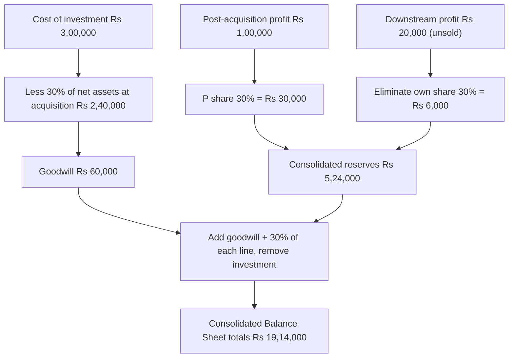

# Q&A — AS 27 — Financial Reporting of Interests in Joint Ventures

> Exam-oriented question bank for CA Intermediate — Advanced Accounting. All amounts in Rupees (Rs). Every question is followed immediately by a complete model answer. Provisions follow AS 27 as notified by ICAI; no invented rules.

---

## Section A — Concept Check (short questions with answers)

**A1. Define a "joint venture" under AS 27.**
A joint venture is a contractual arrangement whereby two or more parties undertake an economic activity that is subject to **joint control**. The existence of a binding contractual arrangement distinguishing it from a mere investment is essential.

**A2. What is "joint control" and how does it differ from "control"?**
*Joint control* is the **contractually agreed sharing of control** over an economic activity; no single venturer can control the activity unilaterally — strategic decisions need the consent of the venturers sharing control. *Control* (AS 21 sense) is the power of **one** party to govern the financial and operating policies of an activity to obtain benefits from it. Joint control removes that unilateral power.

**A3. Name the three forms of joint ventures recognised by AS 27.**
(i) Jointly Controlled Operations (JCO); (ii) Jointly Controlled Assets (JCA); (iii) Jointly Controlled Entities (JCE).

**A4. What does a venturer recognise for a Jointly Controlled Operation?**
In both its separate and consolidated financial statements, the venturer recognises: (a) the **assets it controls** and the **liabilities it incurs**; and (b) the **expenses it incurs** and its **share of income** from the sale of goods or services by the joint venture. No adjustment/consolidation procedure is needed because these items are already in its own books.

**A5. What does a venturer recognise for Jointly Controlled Assets?**
The venturer recognises in its own accounts: (a) its **share of the jointly controlled assets**, classified by nature; (b) any **liabilities it has incurred**; (c) its **share of jointly incurred liabilities**; (d) any **income from its share of output** plus its **share of joint expenses**; and (e) any **expenses incurred for its interest**.

**A6. How does a venturer report its interest in a Jointly Controlled Entity in its Consolidated Financial Statements (CFS)?**
Using the **proportionate consolidation** method — the venturer's share of each asset, liability, income and expense of the JCE is combined **line by line** with similar items in its CFS (or reported as separate line items).

**A7. How is the interest in a JCE reported in the venturer's Separate Financial Statements?**
As an **investment** in accordance with **AS 13** (Accounting for Investments) — normally at cost less any permanent diminution.

**A8. How does an *investor* (a party with an interest but **without** joint control) account for its interest?**
As an ordinary investment under **AS 13**. AS 27's operations/assets/proportionate-consolidation rules do not apply to a mere investor.

**A9. When is proportionate consolidation NOT applied to a JCE interest even in CFS?**
When the interest is (a) acquired and held **exclusively with a view to its subsequent disposal in the near future**, or (b) the JCE operates under **severe long-term restrictions** that significantly impair its ability to transfer funds to the venturer. Such interests are accounted for under AS 13.

**A10. Contribution/sale of assets by a venturer to a JV — how much gain is recognised?**
Only the portion of gain or loss attributable to the **interests of the other venturers** is recognised (the venturer's own share is unrealised and eliminated), provided significant risks and rewards have passed. A **full loss** is recognised immediately where the contribution/sale evidences a reduction in net realisable value or a permanent decline in value.

---

## Section B — Graded Computational Problems (full step-by-step solutions)

### B1 (Easy) — Jointly Controlled Operation: recognition

**Q.** X Ltd and Y Ltd combine to manufacture an aircraft: X makes the wings, Y the fuselage, and they share sales revenue equally. During the year X incurred materials Rs 40,000 and wages Rs 25,000 on wings and holds the machine (cost Rs 3,00,000) used for wings. Total sales of the finished aircraft were Rs 2,00,000, shared 50:50. Show what X Ltd recognises.

**A.** This is a **Jointly Controlled Operation** — each venturer uses its own assets and incurs its own costs. X Ltd recognises in its own financial statements:

| Item | Amount (Rs) |
|---|---|
| Machine (asset it controls) | 3,00,000 |
| Materials expense | 40,000 |
| Wages expense | 25,000 |
| Share of sales income (50% × 2,00,000) | 1,00,000 |

No proportionate consolidation is required; X simply books the assets/expenses it controls/incurs and its agreed **share of income**. Net contribution to profit = 1,00,000 − 65,000 = Rs 35,000 (before depreciation).

---

### B2 (Medium) — Jointly Controlled Asset: pipeline

**Q.** Three oil companies A, B and C jointly own and operate an oil pipeline (cost Rs 90,00,000) in the ratio 40:35:25. Operating costs for the year were Rs 12,00,000 shared in the same ratio. A also separately incurred Rs 50,000 on inspecting its own connecting section. What does A Ltd recognise?

**A.** This is a **Jointly Controlled Asset**. A recognises **its share** of the asset and joint costs, plus its own separately incurred cost:

| Item | Working | Amount (Rs) |
|---|---|---|
| Share of pipeline (asset, by nature) | 40% × 90,00,000 | 36,00,000 |
| Share of joint operating expenses | 40% × 12,00,000 | 4,80,000 |
| Own inspection expense | given | 50,000 |

A shows the Rs 36,00,000 pipeline share among its own fixed assets (classified by nature), and Rs 4,80,000 + Rs 50,000 = **Rs 5,30,000** as expenses.

---

### B3 (Medium-hard) — Proportionate consolidation: single interest

**Q.** H Ltd holds a 25% interest (joint control) in a JCE, M Ltd. M Ltd's Balance Sheet shows: PPE Rs 8,00,000; Inventory Rs 4,00,000; Cash Rs 2,00,000; Share capital Rs 8,00,000; Reserves Rs 4,00,000; Trade payables Rs 2,00,000. H Ltd acquired its interest at par (cost = 25% of share capital + reserves at that date, no goodwill). Show the amounts H Ltd includes by proportionate consolidation.

**A.** Under proportionate consolidation H Ltd adds **25% of each line** of M Ltd (and removes the cost of investment against its share of net assets):

| M Ltd line | 25% share (Rs) |
|---|---|
| PPE | 2,00,000 |
| Inventory | 1,00,000 |
| Cash | 50,000 |
| **Total assets added** | **3,50,000** |
| Trade payables | 50,000 |
| Share of net assets (= reserves + capital share) | 3,00,000 |

Investment carried in H's books (Rs 3,00,000 = 25% × 12,00,000 net assets) is replaced by assets Rs 3,50,000 less payables Rs 50,000 = **Rs 3,00,000 net** — no goodwill/capital reserve arises. The balance sheet stays in balance.

---

### B4 (Exam-hard) — Proportionate consolidation with goodwill + unrealised profit

**Q.** P Ltd acquired a **30%** interest (joint control) in JCE **Q Ltd** on 1 April 2023 for **Rs 3,00,000**, when Q Ltd's share capital was Rs 5,00,000 and reserves Rs 3,00,000. Balance Sheets at 31 March 2024:

| P Ltd | Rs | Q Ltd | Rs |
|---|---|---|---|
| **Equity & Liabilities** | | | |
| Share capital | 10,00,000 | Share capital | 5,00,000 |
| Reserves & surplus | 5,00,000 | Reserves & surplus | 4,00,000 |
| Trade payables | 3,00,000 | Trade payables | 2,00,000 |
| Term loan | — | Term loan | 1,00,000 |
| **Total** | **18,00,000** | **Total** | **12,00,000** |
| **Assets** | | | |
| PPE | 8,00,000 | PPE | 6,00,000 |
| Investment in Q Ltd | 3,00,000 | — | — |
| Inventory | 4,00,000 | Inventory | 3,00,000 |
| Trade receivables | 2,00,000 | Trade receivables | 2,00,000 |
| Cash | 1,00,000 | Cash | 1,00,000 |
| **Total** | **18,00,000** | **Total** | **12,00,000** |

During the year P Ltd sold goods (cost Rs 80,000) to Q Ltd for Rs 1,00,000; all these goods remain in Q Ltd's inventory at year-end. Prepare P Ltd's Consolidated Balance Sheet using proportionate consolidation.

**A.**

**Step 1 — Goodwill on acquisition.**
Share of net assets at acquisition = 30% × (5,00,000 + 3,00,000) = Rs 2,40,000.
Cost of investment = Rs 3,00,000.
**Goodwill = 3,00,000 − 2,40,000 = Rs 60,000.**

**Step 2 — Post-acquisition reserves (P's share).**
Post-acquisition profit of Q = 4,00,000 − 3,00,000 = Rs 1,00,000.
P's share = 30% × 1,00,000 = **Rs 30,000** (added to consolidated reserves).

**Step 3 — Unrealised profit on downstream sale.**
Profit on P's sale to Q = 1,00,000 − 80,000 = Rs 20,000; goods unsold.
Per AS 27, P recognises only the portion attributable to **other venturers** (70%); its **own 30% is unrealised**.
Unrealised profit to eliminate = 30% × 20,000 = **Rs 6,000** (reduce reserves; reduce P's share of Q's inventory).

**Step 4 — Consolidated reserves.**
= P's own reserves 5,00,000 + post-acq share 30,000 − unrealised profit 6,000 = **Rs 5,24,000**.

**Step 5 — Add 30% of Q's assets & liabilities line-by-line, remove investment, add goodwill, adjust inventory.**

| Line | P Ltd | + 30% of Q | Adjustment | Consolidated (Rs) |
|---|---|---|---|---|
| Goodwill | — | — | +60,000 | 60,000 |
| PPE | 8,00,000 | 1,80,000 | — | 9,80,000 |
| Inventory | 4,00,000 | 90,000 | −6,000 (URP) | 4,84,000 |
| Trade receivables | 2,00,000 | 60,000 | — | 2,60,000 |
| Cash | 1,00,000 | 30,000 | — | 1,30,000 |
| Investment in Q | 3,00,000 | — | −3,00,000 | — |
| **Total assets** | | | | **19,14,000** |

| Equity & Liabilities | Consolidated (Rs) |
|---|---|
| Share capital | 10,00,000 |
| Reserves & surplus (Step 4) | 5,24,000 |
| Trade payables (3,00,000 + 60,000) | 3,60,000 |
| Term loan (0 + 30,000) | 30,000 |
| **Total** | **19,14,000** |

**Self-check:** Assets 19,14,000 = Equity & Liabilities 19,14,000. ✔
Net worth check: consolidated equity = 10,00,000 + 5,24,000 = 15,24,000; assets 19,14,000 − liabilities 3,90,000 = 15,24,000. ✔

**Diagram — solution path for B4:**

---

## Section C — Past-paper-style full questions with model answers

### C1. Classification and accounting treatment

**Q.** "The three forms of joint ventures share a common feature but differ in reporting." Explain the common feature and, for each of the three forms, state briefly the reporting treatment prescribed by AS 27. (5 marks)

**A.**
The **common feature** in all three forms is a **binding contractual arrangement establishing joint control** — decisions on the economic activity require the consent of the venturers sharing control; no single venturer can act unilaterally.

- **Jointly Controlled Operations (JCO):** No separate entity is created. Each venturer uses its **own assets**, incurs its **own expenses and liabilities**, and raises its **own finance**. Reporting — the venturer recognises the assets it controls, liabilities and expenses it incurs, and its **share of income** from the joint sale. These are already in its own books; no consolidation adjustment is needed.
- **Jointly Controlled Assets (JCA):** Joint control (often joint ownership) of one or more assets, with no separate entity. Reporting — the venturer recognises its **share of the jointly controlled assets** (by nature), its own and its **share of joint liabilities**, its **income from its share of output**, and its **share of joint expenses** plus own expenses.
- **Jointly Controlled Entities (JCE):** A separate entity (company/partnership) is formed. Reporting — in **CFS**, the venturer uses **proportionate consolidation** (share of each asset, liability, income and expense combined line-by-line); in **separate financial statements**, the interest is carried as an **investment under AS 13**.

### C2. Proportionate consolidation and transactions with a JV

**Q.** R Ltd holds a 40% joint-control interest in S Ltd (a JCE). During the year: (i) R Ltd contributed a machine (book value Rs 5,00,000) to S Ltd at an agreed value of Rs 7,00,000; risks and rewards passed to S Ltd. (ii) R Ltd purchased goods from S Ltd for Rs 2,50,000 (S Ltd's cost Rs 2,00,000); 40% of these goods are still unsold by R Ltd at year-end. State, with amounts, how R Ltd should account for both transactions in its CFS. (5 marks)

**A.**

**(i) Contribution of machine to the JV (downstream).**
Gain on contribution = 7,00,000 − 5,00,000 = Rs 2,00,000. As risks and rewards have passed and there is no NRV reduction, R Ltd recognises **only the portion attributable to other venturers** = 60% × 2,00,000 = **Rs 1,20,000**. Its own share = 40% × 2,00,000 = **Rs 80,000** is **unrealised and eliminated** (deferred until the asset is realised/depreciated by the JV or sold to a third party).

**(ii) Purchase of goods from the JV (upstream).**
Profit in the goods = 2,50,000 − 2,00,000 = Rs 50,000. When a venturer buys assets from a JV, it should **not recognise its share of the JV's profit until it resells the goods to an independent party**. Since 40% remain unsold, unrealised profit = 40% (R's interest) × 40% (unsold) × 50,000 = **Rs 8,000** to be eliminated (reduce R's share of JV profit and the carrying amount of inventory). The remaining profit relating to goods already resold, and the portion attributable to other venturers, stands recognised.

*(Note: had the contribution or purchase evidenced a permanent decline / NRV reduction, the venturer would recognise its share of the loss **in full** immediately.)*

---

## Section D — MCQs / Case Scenarios (correct option + one-line reasoning)

**D1.** AS 27 applies to a party's interest in a joint venture only where there is:
(a) Significant influence (b) Control (c) **Joint control** (d) Any equity holding
**Answer: (c)** — AS 27 is triggered by contractually agreed *joint* control.

**D2.** A venturer's interest in a Jointly Controlled Entity is reflected in its **Consolidated** Financial Statements by:
(a) Equity method (b) **Proportionate consolidation** (c) Cost method (d) Fair value
**Answer: (b)** — AS 27 mandates proportionate consolidation for a JCE in CFS.

**D3.** In its **Separate** Financial Statements, a venturer accounts for a JCE interest:
(a) By proportionate consolidation (b) By equity method (c) **As an investment under AS 13** (d) At revalued amount
**Answer: (c)** — Separate statements carry the JCE interest as an AS 13 investment.

**D4.** A party that holds an interest in a JV but does **not** share joint control (an investor) accounts for it:
(a) By proportionate consolidation (b) By equity method (c) **Under AS 13** (d) Under AS 27's JCA rules
**Answer: (c)** — Without joint control it is a plain investment under AS 13.

**D5.** Two firms jointly own a building and share its rental income; no separate entity exists. This is a:
(a) Jointly Controlled Operation (b) **Jointly Controlled Asset** (c) Jointly Controlled Entity (d) Subsidiary
**Answer: (b)** — Joint ownership/control of an asset with no separate entity = JCA.

**D6.** A venturer sells inventory to its JV at a profit; all goods remain unsold in the JV at year-end. The venturer should:
(a) Recognise the full profit (b) Recognise no profit (c) **Recognise only the other venturers' share of the profit** (d) Recognise a loss
**Answer: (c)** — On sale *to* the JV, only the portion attributable to other venturers is recognised.

**D7.** A venturer buys goods from its JV at a profit to the JV and still holds them. The venturer should recognise its share of the JV's profit:
(a) Immediately (b) **Only when the goods are resold to an independent party** (c) Never (d) Over the useful life
**Answer: (b)** — On purchase *from* the JV, the buyer defers its share of profit until resale to a third party.

**D8.** A venturer acquires a JCE interest exclusively with a view to disposal in the near future. In its CFS the interest is:
(a) Proportionately consolidated (b) Equity accounted (c) **Accounted under AS 13 (as an investment)** (d) Fully consolidated
**Answer: (c)** — Interests held for near-term disposal or under severe long-term restrictions are excluded from proportionate consolidation and carried under AS 13.

**D9 (Case scenario).** T Ltd (interest 20%) and two others jointly control JV-Co. JV-Co has a contingent liability of Rs 10,00,000 for a jointly incurred guarantee, and JV-Co itself discloses a contingent liability of Rs 5,00,000. What does AS 27 require T Ltd to disclose?
(a) Nothing (b) Only Rs 5,00,000 (c) **Its share of contingent liabilities incurred jointly, its own contingent liabilities for the JV, and its share of the JV's own contingent liabilities — separately from other contingencies** (d) The full Rs 15,00,000 as a liability
**Answer: (c)** — AS 27 requires a venturer to disclose, separately, its share of and its own contingent liabilities and capital commitments arising from its interests in joint ventures; contingencies are disclosed, not recognised as liabilities.

---

### Quick-revision anchor
- **Trigger** = joint control (contractual). **Investor without joint control → AS 13.**
- **JCO/JCA** → recognise own + share of items directly in own books.
- **JCE** → **CFS: proportionate consolidation**; **Separate FS: AS 13 investment**.
- **Sell to JV** → recognise only *others'* share of gain; full loss if NRV falls.
- **Buy from JV** → defer *own* share of profit until resold to a third party.
- **Held-for-disposal / severe restrictions** → AS 13, not proportionate consolidation.
