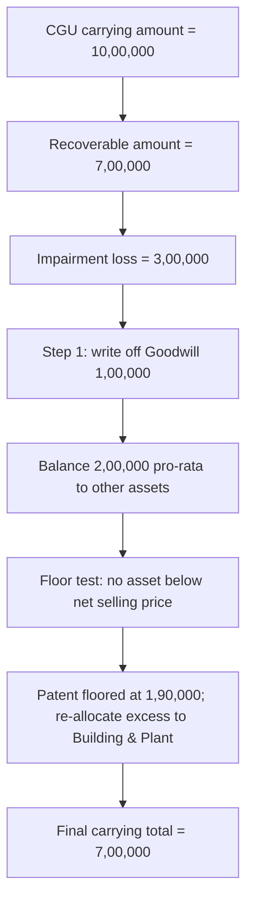

# Q&A — AS 28 — Impairment of Assets

> CA Intermediate | Advanced Accounting | Exam-oriented question bank
> All amounts in Rupees (₹). Based on ICAI Accounting Standard (AS) 28.
> Every question is immediately followed by a complete model answer.

---

## SECTION A — Concept-Check Questions (with answers)

**A1. State the core recognition principle of AS 28 in one sentence.**
**Answer:** An asset is impaired when its **carrying amount** exceeds its **recoverable amount**; the excess is recognised immediately as an **impairment loss** in the Statement of Profit and Loss (unless the asset is carried at revalued amount, in which case it is treated as a revaluation decrease).

**A2. Define "Recoverable Amount".**
**Answer:** Recoverable amount is the **higher** of an asset's (a) **net selling price** (fair value less costs of disposal) and (b) **value in use** (present value of estimated future cash flows from continuing use plus disposal value at end of useful life). Formula: Recoverable Amount = Higher of (Net Selling Price, Value in Use).

**A3. What is "Value in Use"?**
**Answer:** It is the present value of the estimated future cash flows expected to arise from the **continuing use** of an asset and from its **disposal at the end of its useful life**, discounted at a pre-tax rate reflecting current market assessments of the time value of money and asset-specific risks.

**A4. When must an enterprise assess whether an asset is impaired?**
**Answer:** At **each balance sheet date**, the enterprise must assess whether there is any **indication** of impairment (using external and internal indicators). If any indication exists, it must estimate the recoverable amount. (For intangible assets not yet available for use and goodwill in certain cases, an annual test applies as extended by later standards, but AS 28 core rule is the indication-based test.)

**A5. List two external and two internal indicators of impairment.**
**Answer:**
- External: (1) significant **decline in market value**; (2) adverse changes in technology, market, economic or legal environment; increase in market interest rates; carrying amount of net assets > market capitalisation.
- Internal: (1) evidence of **obsolescence or physical damage**; (2) adverse internal reporting showing worse-than-expected economic performance; significant adverse change in the extent/manner of use.

**A6. What is a Cash Generating Unit (CGU)?**
**Answer:** A CGU is the **smallest identifiable group of assets** that generates cash inflows from continuing use that are **largely independent** of the cash inflows from other assets or groups of assets. Recoverable amount is estimated for the individual asset; if not possible, for the CGU to which it belongs.

**A7. How is an impairment loss for a CGU allocated?**
**Answer:** The loss is allocated: **first to goodwill** allocated to the CGU, then to the **other assets** of the unit on a **pro-rata basis** of their carrying amounts. However, no individual asset is written down below the highest of its net selling price, value in use (if determinable) and zero.

**A8. Is reversal of an impairment loss permitted? State the rule for goodwill.**
**Answer:** Yes — if the recoverable amount increases in a later period because of a **change in estimates** used, the impairment loss is reversed (P&L, unless revalued). **Reversal is restricted** so that the carrying amount does not exceed what it would have been (net of depreciation) had no impairment been recognised. An impairment loss for **goodwill is NOT reversed** in a subsequent period **unless** it was caused by a specific **external event of an exceptional nature** not expected to recur, and the reversal is caused by a subsequent external event reversing that effect.

**A9. Which assets are outside the scope of AS 28?**
**Answer:** Inventories (AS 2), assets from construction contracts (AS 7), financial assets, deferred tax assets (AS 22), and assets from employee benefits — these have their own measurement standards.

**A10. On reversal, how is depreciation adjusted?**
**Answer:** After a reversal, the **depreciation charge for future periods** is adjusted to allocate the asset's revised carrying amount, less its residual value, on a systematic basis over its **remaining useful life**.

---

## SECTION B — Graded Computational Problems (full step-by-step solutions)

### B1 (Easy) — Basic impairment loss

A machine has a carrying amount of ₹5,00,000. Its net selling price is ₹3,80,000 and value in use is ₹4,20,000. Compute the impairment loss and pass the journal entry.

**Solution:**
- Recoverable amount = Higher of (Net selling price ₹3,80,000; Value in use ₹4,20,000) = **₹4,20,000**.
- Carrying amount ₹5,00,000 > Recoverable amount ₹4,20,000 → asset is impaired.
- Impairment loss = ₹5,00,000 − ₹4,20,000 = **₹80,000**.

**Journal entry:**
| Particulars | Dr (₹) | Cr (₹) |
|---|---|---|
| Impairment Loss A/c … Dr | 80,000 | |
| &nbsp;&nbsp;To Provision for Impairment / Machinery A/c | | 80,000 |
| (Being impairment loss recognised, charged to P&L) | | |

Revised carrying amount = ₹4,20,000.

---

### B2 (Easy–Moderate) — No impairment case

An asset has carrying amount ₹2,40,000, net selling price ₹2,50,000 and value in use ₹2,10,000. Is there an impairment?

**Solution:**
- Recoverable amount = Higher of (₹2,50,000; ₹2,10,000) = **₹2,50,000**.
- Carrying amount ₹2,40,000 < Recoverable amount ₹2,50,000.
- **No impairment loss** — an asset is NOT written up above cost merely because recoverable amount is higher (AS 28 does not permit upward revaluation). No entry.

---

### B3 (Moderate) — Value in use by discounting

A plant is expected to generate net cash inflows of ₹2,00,000 per year for 4 years and a disposal value of ₹50,000 at the end of year 4. The pre-tax discount rate is 10%. Carrying amount is ₹7,00,000; net selling price is ₹5,90,000. Determine impairment loss.

Discount factors @10%: Yr1 = 0.909, Yr2 = 0.826, Yr3 = 0.751, Yr4 = 0.683.

**Solution:**

Step 1 — Present value of operating inflows (₹2,00,000 each year):
| Year | Cash flow (₹) | DF @10% | PV (₹) |
|---|---|---|---|
| 1 | 2,00,000 | 0.909 | 1,81,800 |
| 2 | 2,00,000 | 0.826 | 1,65,200 |
| 3 | 2,00,000 | 0.751 | 1,50,200 |
| 4 | 2,00,000 | 0.683 | 1,36,600 |
| **Sub-total** | | | **6,33,800** |

Step 2 — PV of disposal value = ₹50,000 × 0.683 = ₹34,150.

Step 3 — Value in use = ₹6,33,800 + ₹34,150 = **₹6,67,950**.

Step 4 — Recoverable amount = Higher of (Net selling price ₹5,90,000; Value in use ₹6,67,950) = **₹6,67,950**.

Step 5 — Impairment loss = Carrying amount ₹7,00,000 − ₹6,67,950 = **₹32,050**.

**Entry:** Impairment Loss A/c Dr ₹32,050 To Plant A/c ₹32,050. Revised carrying amount = ₹6,67,950.

---

### B4 (Moderate) — Reversal of impairment loss with the depreciation cap

On 1 April 2022 a machine was bought for ₹10,00,000; useful life 10 years, no residual value, straight-line depreciation. On 31 March 2024 (after 2 years) an impairment loss was recognised bringing recoverable amount to ₹5,60,000. On 31 March 2025 the indicators reversed and recoverable amount rose to ₹6,50,000. Compute the impairment loss (2024), the reversal (2025) and the capped carrying amount.

**Solution:**

Step 1 — Carrying amount on 31.03.2024 before impairment:
Annual depreciation = ₹10,00,000 / 10 = ₹1,00,000. After 2 years, accumulated = ₹2,00,000.
Carrying amount = ₹10,00,000 − ₹2,00,000 = ₹8,00,000.

Step 2 — Impairment loss (2024) = ₹8,00,000 − ₹5,60,000 = **₹2,40,000**.

Step 3 — Depreciation for FY 2024-25 on impaired value:
Remaining life = 8 years; revised carrying amount = ₹5,60,000.
Depreciation = ₹5,60,000 / 8 = ₹70,000.
Carrying amount on 31.03.2025 (before reversal) = ₹5,60,000 − ₹70,000 = ₹4,90,000.

Step 4 — Cap (carrying amount had there been NO impairment):
Depreciation without impairment = ₹1,00,000 p.a.; after 3 years accumulated = ₹3,00,000.
Historical carrying amount = ₹10,00,000 − ₹3,00,000 = **₹7,00,000** (this is the ceiling).

Step 5 — Recoverable amount 31.03.2025 = ₹6,50,000.
Since ₹6,50,000 < cap ₹7,00,000, the reversal is allowed up to ₹6,50,000.
Reversal of impairment = ₹6,50,000 − ₹4,90,000 = **₹1,60,000**.

**Entry (2025):** Machinery A/c Dr ₹1,60,000 To Reversal of Impairment Loss (P&L) ₹1,60,000.
Carrying amount after reversal = **₹6,50,000**.

*Self-check:* Reversal ₹1,60,000 does not push carrying amount ₹6,50,000 above ceiling ₹7,00,000. ✔

---

### B5 (Exam-hard) — Reversal capped by the ceiling

Facts as in B4, except on 31 March 2025 recoverable amount rose to ₹7,80,000.

**Solution:**
- Carrying amount before reversal = ₹4,90,000 (as computed in B4 Step 3).
- Ceiling (no-impairment carrying amount) = ₹7,00,000 (B4 Step 4).
- Recoverable amount ₹7,80,000 exceeds the ceiling, so reversal is **restricted to the ceiling**.
- Maximum reversal = ₹7,00,000 − ₹4,90,000 = **₹2,10,000** (not ₹7,80,000 − ₹4,90,000).
- Carrying amount after reversal = **₹7,00,000**.

**Rule reinforced:** Reversal can never lift the carrying amount above the depreciated historical cost that would have existed absent the earlier impairment.

---

### B6 (Exam-hard) — CGU impairment allocation with goodwill

A cash-generating unit contains the following assets on 31 March 2025:

| Asset | Carrying amount (₹) |
|---|---|
| Goodwill | 1,00,000 |
| Building | 4,00,000 |
| Plant | 3,00,000 |
| Patent | 2,00,000 |
| **Total** | **10,00,000** |

The recoverable amount of the CGU is ₹7,00,000. The net selling price of the Patent is separately determinable at ₹1,90,000. Allocate the impairment loss.

**Solution:**

Step 1 — Total impairment loss = Carrying amount ₹10,00,000 − Recoverable amount ₹7,00,000 = **₹3,00,000**.

Step 2 — Allocate first to goodwill:
Goodwill written down fully = ₹1,00,000. Balance loss to allocate = ₹3,00,000 − ₹1,00,000 = **₹2,00,000**.

Step 3 — Allocate ₹2,00,000 pro-rata to the other assets (Building : Plant : Patent = 4:3:2, total ₹9,00,000):
| Asset | Carrying (₹) | Pro-rata share of ₹2,00,000 |
|---|---|---|
| Building | 4,00,000 | 2,00,000 × 4/9 = 88,889 |
| Plant | 3,00,000 | 2,00,000 × 3/9 = 66,667 |
| Patent | 2,00,000 | 2,00,000 × 2/9 = 44,444 |
| **Total** | **9,00,000** | **2,00,000** |

Step 4 — Apply the floor test (no asset below its net selling price):
Patent's revised carrying = ₹2,00,000 − ₹44,444 = ₹1,55,556, which is **below its net selling price ₹1,90,000**. So Patent is written down only to ₹1,90,000 → Patent's loss restricted to ₹10,000.

Step 5 — Re-allocate the excess ₹44,444 − ₹10,000 = ₹34,444 to Building and Plant (ratio 4:3, total 7):
| Asset | Additional share |
|---|---|
| Building | 34,444 × 4/7 = 19,682 |
| Plant | 34,444 × 3/7 = 14,762 |

Step 6 — Final allocation:
| Asset | Carrying before (₹) | Impairment (₹) | Carrying after (₹) |
|---|---|---|---|
| Goodwill | 1,00,000 | 1,00,000 | 0 |
| Building | 4,00,000 | 88,889 + 19,682 = 1,08,571 | 2,91,429 |
| Plant | 3,00,000 | 66,667 + 14,762 = 81,429 | 2,18,571 |
| Patent | 2,00,000 | 10,000 | 1,90,000 |
| **Total** | **10,00,000** | **3,00,000** | **7,00,000** |

*Self-check:* Total impairment = ₹1,00,000 + ₹1,08,571 + ₹81,429 + ₹10,000 = **₹3,00,000** ✔; total carrying after = **₹7,00,000** ✔ (equals CGU recoverable amount); Patent not below ₹1,90,000 ✔.

**Approach diagram:**

---

### B7 (Exam-hard) — Impairment of a revalued asset

A building carried at a revalued amount of ₹12,00,000 has a revaluation surplus of ₹1,50,000 in the Revaluation Reserve. Its recoverable amount falls to ₹9,50,000. Show the treatment.

**Solution:**
- Impairment loss = ₹12,00,000 − ₹9,50,000 = **₹2,50,000**.
- For a revalued asset, impairment is treated as a **revaluation decrease**: first adjusted against the related **Revaluation Reserve** (to the extent available), the balance to **P&L**.
- Against Revaluation Reserve = ₹1,50,000; balance to P&L = ₹2,50,000 − ₹1,50,000 = **₹1,00,000**.

**Entries:**
| Particulars | Dr (₹) | Cr (₹) |
|---|---|---|
| Revaluation Reserve A/c … Dr | 1,50,000 | |
| Impairment Loss (P&L) A/c … Dr | 1,00,000 | |
| &nbsp;&nbsp;To Building A/c | | 2,50,000 |

Revised carrying amount = ₹9,50,000.

---

## SECTION C — Past-Paper-Style Full Questions (model answers)

### C1. Explain the meaning of "recoverable amount" and how an enterprise identifies whether an asset is impaired at the balance sheet date. (Theory, ~5 marks)

**Model answer:**
Under AS 28, at each balance sheet date an enterprise must assess whether there is any **indication** that an asset may be impaired, considering both **external sources** (fall in market value, adverse changes in technological/market/economic/legal environment, rise in interest rates affecting the discount rate, carrying amount of net assets exceeding market capitalisation) and **internal sources** (obsolescence or physical damage, adverse changes in use, and internal evidence of worse-than-expected performance).

If any such indication exists, the enterprise estimates the **recoverable amount** = higher of **net selling price** (fair value less costs of disposal) and **value in use** (present value of future cash flows from continued use and eventual disposal, discounted at a pre-tax rate). If the **carrying amount exceeds the recoverable amount**, the asset is impaired and the excess is recognised as an **impairment loss** in the Statement of Profit and Loss (or as a revaluation decrease for revalued assets). The revised carrying amount is then depreciated over the remaining useful life.

---

### C2. Sun Ltd acquired a machine for ₹8,00,000 on 1 April 2021 (life 8 years, nil residual, SLM). On 31 March 2024 there were indications of impairment. The net selling price was ₹3,80,000 and value in use ₹4,10,000. Compute the impairment loss, revised carrying amount and depreciation for 2024-25. (Practical, ~6 marks)

**Model answer:**

Step 1 — Carrying amount on 31.03.2024:
Annual depreciation = ₹8,00,000 / 8 = ₹1,00,000. After 3 years, accumulated = ₹3,00,000.
Carrying amount = ₹8,00,000 − ₹3,00,000 = ₹5,00,000.

Step 2 — Recoverable amount = Higher of (₹3,80,000; ₹4,10,000) = ₹4,10,000.

Step 3 — Impairment loss = ₹5,00,000 − ₹4,10,000 = **₹90,000** (charged to P&L).

Step 4 — Depreciation for 2024-25:
Remaining useful life = 5 years; revised carrying amount = ₹4,10,000.
Depreciation = ₹4,10,000 / 5 = **₹82,000**.
Carrying amount on 31.03.2025 = ₹4,10,000 − ₹82,000 = ₹3,28,000.

---

### C3. State the disclosure requirements of AS 28 in respect of impairment losses. (Theory, ~4 marks)

**Model answer:**
For each class of assets, the financial statements should disclose:
1. The amount of **impairment losses recognised** in the Statement of Profit and Loss during the period, and the line item(s) in which they are included.
2. The amount of **reversals of impairment losses** recognised in the Statement of Profit and Loss, and the line item(s) affected.
3. Impairment losses / reversals recognised **directly against revaluation surplus**.

Additionally, for each **material** impairment loss (or reversal) for an individual asset or CGU, disclose: the events/circumstances that led to it; the amount; the nature of the asset or a description of the CGU; whether recoverable amount is net selling price or value in use; the basis of net selling price; and the **discount rate** used if value in use is the basis. A segment-wise disclosure is also required for enterprises reporting segment information.

---

## SECTION D — MCQs / Case Scenarios (correct option + one-line reasoning)

**D1.** Recoverable amount is the ___ of net selling price and value in use.
(a) lower (b) higher (c) average (d) sum
**Answer: (b) higher** — AS 28 takes the higher because the enterprise would choose the more beneficial of selling or using the asset.

**D2.** An impairment loss on an asset carried at historical cost is charged to:
(a) Revaluation Reserve (b) General Reserve (c) Statement of Profit and Loss (d) Capital Reserve
**Answer: (c) P&L** — for non-revalued assets the loss is an immediate expense.

**D3.** When allocating a CGU's impairment loss, it is applied first to:
(a) plant (b) building (c) goodwill (d) pro-rata to all
**Answer: (c) goodwill** — goodwill absorbs the loss first, then other assets pro-rata.

**D4.** Reversal of an impairment loss on goodwill is:
(a) always allowed (b) never allowed except a non-recurring external event reversal (c) allowed up to cost (d) allowed with RBI approval
**Answer: (b)** — goodwill reversal is prohibited unless caused by a specific external event of an exceptional nature that later reverses.

**D5.** Value in use requires discounting at:
(a) post-tax rate (b) pre-tax rate (c) coupon rate (d) inflation rate
**Answer: (b) pre-tax rate** — reflecting time value of money and asset-specific risks.

**D6.** Carrying amount ₹4,00,000; net selling price ₹4,20,000; value in use ₹3,90,000. Impairment loss is:
(a) ₹10,000 (b) ₹Nil (c) ₹30,000 (d) ₹20,000
**Answer: (b) Nil** — recoverable amount ₹4,20,000 > carrying amount, no impairment (and no write-up).

**D7.** On reversal, the carrying amount cannot exceed:
(a) recoverable amount (b) net selling price (c) depreciated historical cost had no impairment occurred (d) original cost
**Answer: (c)** — the reversal ceiling is the no-impairment depreciated carrying amount.

**D8.** Which is OUTSIDE the scope of AS 28?
(a) Plant (b) Goodwill (c) Inventories (d) Patents
**Answer: (c) Inventories** — covered by AS 2, not AS 28.

**D9. Case:** Moon Ltd's machine (carrying ₹6,00,000) suffered fire damage; net selling price ₹2,00,000, value in use cannot be reliably estimated for the asset alone but the CGU's recoverable amount is intact and exceeds carrying amount. The asset should be:
(a) fully written off (b) impaired to ₹2,00,000 (c) tested as part of the CGU — likely no loss (d) written up
**Answer: (c)** — when value in use of an individual asset is not determinable and it does not generate independent cash inflows, recoverable amount is assessed for the whole CGU.

**D10. Case:** An asset was impaired by ₹50,000 in FY23-24 due to a temporary regulatory ban (an external, non-recurring event). In FY24-25 the ban is lifted and recoverable amount rises. The reversal is:
(a) prohibited (b) permitted, subject to the ceiling (c) taken to Revaluation Reserve (d) permitted only for goodwill
**Answer: (b)** — reversal for a normal asset is permitted when estimates change, capped at the depreciated historical cost ceiling.

---

## Quick Self-Verification Notes
- B1: 5,00,000 − 4,20,000 = 80,000 ✔
- B3: VIU 6,67,950 > NSP 5,90,000 → loss 32,050 ✔
- B4: reversal 1,60,000 → 6,50,000 ≤ ceiling 7,00,000 ✔
- B5: capped reversal 2,10,000 → exactly ceiling 7,00,000 ✔
- B6: allocations total 3,00,000; carrying after 7,00,000; Patent ≥ 1,90,000 ✔
- B7: 1,50,000 to reserve + 1,00,000 to P&L = 2,50,000 ✔
