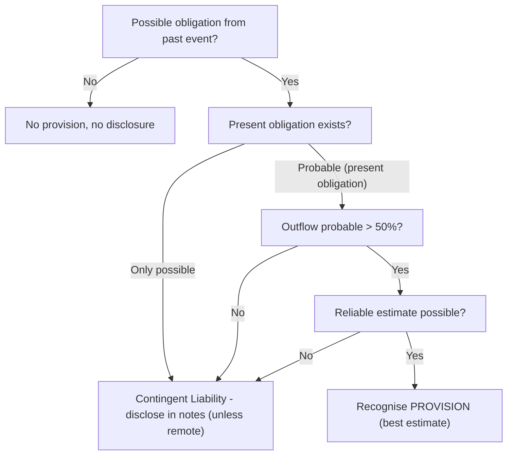

# Q&A — AS 29 — Provisions, Contingent Liabilities & Contingent Assets

> Exam-oriented question bank. Every question is followed immediately by a complete model answer. All figures in Rupees (Rs.). Based on ICAI AS 29. No provisions have been invented; only recognition tests prescribed by the standard are applied.

---

## SECTION A — Concept Check (Q + Answer)

**A1. Define a "provision" under AS 29 and state how it differs from other liabilities.**
**Answer:** A provision is a liability that can be measured only by using a *substantial degree of estimation*. It differs from trade payables / accruals because those are liabilities where the amount and timing are reasonably certain; a provision carries uncertainty of *timing or amount*, but the obligation itself is present and probable.

**A2. State the three cumulative recognition conditions for a provision.**
**Answer:** (i) An entity has a **present obligation** (legal or constructive) as a result of a **past (obligating) event**; (ii) it is **probable** (more likely than not, i.e. > 50%) that an **outflow of resources** embodying economic benefits will be required; and (iii) a **reliable estimate** of the amount can be made. If any one fails, no provision is recognised.

**A3. What is an "obligating event"?**
**Answer:** A past event that creates a present obligation which the entity has **no realistic alternative** but to settle. Under AS 29 the obligation must be a **legal obligation** (arising from contract/legislation) — AS 29 recognises obligations only where settlement can be enforced by law; unlike Ind AS 37 it does not generally recognise purely constructive obligations except where clearly established.

**A4. Define a contingent liability.**
**Answer:** A contingent liability is (a) a **possible obligation** arising from past events whose existence will be confirmed only by uncertain future events *not wholly within the entity's control*; OR (b) a **present obligation** that is **not recognised** because outflow is **not probable** or the amount **cannot be reliably measured**. It is **not recognised** — only **disclosed** by way of note (unless outflow is remote).

**A5. Define a contingent asset and state its treatment.**
**Answer:** A contingent asset is a possible asset arising from past events whose existence will be confirmed only by uncertain future events not wholly within the entity's control. It is **not recognised** in the financial statements (prudence). It is **not even disclosed** in the financial statements under AS 29; disclosure, if any, is made in the **approving authority's/Board's report** when inflow of economic benefit is probable.

**A6. How is the amount of a provision measured?**
**Answer:** At the **best estimate** of the expenditure required to settle the present obligation at the balance sheet date. For a **large population** of items, the "expected value" (probability-weighted) method is used; for a **single obligation**, the individual most likely outcome is generally the best estimate. AS 29 does **not** permit discounting to present value (a key difference from Ind AS 37).

**A7. When may a provision be reversed?**
**Answer:** Provisions must be **reviewed at each balance sheet date** and adjusted to reflect the current best estimate. If it is **no longer probable** that an outflow will be required, the provision is **reversed** to the statement of profit and loss.

**A8. Can a provision be used against expenditure it was not originally created for?**
**Answer:** No. A provision shall be **used only for the expenditure for which it was originally recognised**. Setting other expenditure against it would conceal the impact of two different events.

**A9. State the treatment of reimbursements.**
**Answer:** Where some/all expenditure to settle a provision is expected to be reimbursed by another party, the reimbursement is recognised as a **separate asset** only when it is **virtually certain** to be received. The asset recognised must **not exceed** the provision. In the statement of profit and loss the expense may be presented **net** of the reimbursement.

**A10. List three items specifically excluded from the scope of AS 29.**
**Answer:** (i) Items resulting from **executory contracts** (unless onerous) — contracts under which neither party has performed or both have partially performed equally; (ii) items covered by **another AS** (e.g. income tax — AS 22; construction contracts — AS 7; retirement benefits — AS 15; leases — AS 19); (iii) items arising in **insurance enterprises** from contracts with policyholders. AS 29 also does **not** permit provisions for **future operating losses**.

---

## SECTION B — Graded Computational Problems (Q + full solution)

### B1 (Easy) — Basic recognition and entry
A company sells goods with a warranty. In March 2026 it sold 10,000 units. Past experience shows 4% of units will need repair costing Rs. 150 each. Determine the warranty provision and pass the journal entry as on 31 March 2026.

**Solution — self-verifying:**
Expected defective units = 10,000 × 4% = 400 units.
Provision = 400 × Rs. 150 = **Rs. 60,000**.
Recognition test: present obligation (sale = obligating event) ✓; probable outflow ✓; reliable estimate ✓ → provision recognised.

Journal entry (31.03.2026):
```
Warranty Expense (P&L)      Dr.  60,000
   To Provision for Warranty        60,000
(Being provision for warranty on 10,000 units @ 4% × Rs.150)
```
Check: 400 × 150 = 60,000 reconciles. ✓

---

### B2 (Easy–Medium) — Expected value method
A retailer sells goods with a 1-year warranty. For 60,000 units sold, experience suggests: 85% no defect, 12% minor defect (cost Rs. 100/unit), 3% major defect (cost Rs. 500/unit). Compute the provision.

**Solution:**
| Outcome | Probability | Units | Cost/unit | Amount (Rs.) |
|---|---|---|---|---|
| No defect | 85% | 51,000 | 0 | 0 |
| Minor | 12% | 7,200 | 100 | 7,20,000 |
| Major | 3% | 1,800 | 500 | 9,00,000 |
| **Total** | 100% | 60,000 | | **16,20,000** |

Provision (expected value) = **Rs. 16,20,000**.
Check: units 51,000 + 7,200 + 1,800 = 60,000 ✓; amount 7,20,000 + 9,00,000 = 16,20,000 ✓.

---

### B3 (Medium) — Reimbursement (virtually certain)
A company faces a legal claim for Rs. 40,00,000; its lawyers advise that it is probable it will lose. The company's insurer has confirmed in writing it will reimburse Rs. 30,00,000 (virtually certain). Show recognition and P&L presentation.

**Solution:**
Provision = best estimate of obligation = **Rs. 40,00,000** (recognised in full as a liability).
Reimbursement asset = **Rs. 30,00,000** — recognised separately as an asset because receipt is *virtually certain*; it does not exceed the provision, so allowed in full.
Net charge to P&L = 40,00,000 − 30,00,000 = **Rs. 10,00,000** (expense may be shown net).

Journal entries:
```
Legal Claim Expense        Dr.  40,00,000
   To Provision for Claim          40,00,000

Reimbursement Receivable   Dr.  30,00,000
   To Legal Claim Expense (P&L)    30,00,000
```
Check: Provision Rs. 40,00,000 (liability) and asset Rs. 30,00,000 shown gross in Balance Sheet; net P&L impact Rs. 10,00,000. ✓ Asset ≤ Provision ✓.

---

### B4 (Medium) — Onerous contract
On 1 Jan 2026 a company leased office space for 3 years at Rs. 5,00,000 p.a. (non-cancellable). On 31 March 2026 it vacated and relocated. It can sub-let for only Rs. 2,00,000 p.a. Remaining lease at 31.03.2026 = 2.75 years (say round to 33 months). Compute the onerous-contract provision (ignore discounting per AS 29).

**Solution:**
The lease is now an **onerous contract**: unavoidable cost of meeting the obligation exceeds economic benefit expected.
Remaining period from 01.04.2026 to 31.12.2028 = 2.75 years.
Unavoidable net cost per year = Rent 5,00,000 − Sub-let recovery 2,00,000 = Rs. 3,00,000.
Provision = 3,00,000 × 2.75 = **Rs. 8,25,000**.
Check: 3,00,000 × 2.75 = 8,25,000 ✓. (AS 29 requires provision for onerous contracts; no discounting applied.)

```
Onerous Contract Loss (P&L)   Dr.  8,25,000
   To Provision for Onerous Lease     8,25,000
```

---

### B5 (Medium–Hard) — Restructuring vs. future operating losses
A company's Board decides on 20 March 2026 to close a division. A detailed formal plan is drawn and announced to affected employees on 28 March 2026. Costs: redundancy payments Rs. 25,00,000; expected operating losses of the division until closure Rs. 8,00,000; relocation of continuing staff Rs. 6,00,000; investment in new systems Rs. 10,00,000. Compute the restructuring provision at 31 March 2026.

**Solution:**
A restructuring provision arises only when there is a present obligation — a **detailed formal plan** exists AND a **valid expectation** has been raised (announcement to those affected) by the balance sheet date. Both satisfied on 28.03.2026 ✓.
Include only **direct expenditures necessarily entailed** by restructuring and **not associated with ongoing activities**.

| Item | Include? | Amount (Rs.) |
|---|---|---|
| Redundancy payments | Yes (directly entailed) | 25,00,000 |
| Future operating losses to closure | **No** — AS 29 prohibits provisions for future operating losses | 0 |
| Relocation of continuing staff | **No** — relates to ongoing activities | 0 |
| Investment in new systems | **No** — relates to future conduct of business | 0 |
| **Restructuring provision** | | **25,00,000** |

Provision = **Rs. 25,00,000**.
Check: only redundancy qualifies; all others excluded per AS 29. ✓

---

### B6 (Hard / exam level) — Composite problem with review & reversal
A company gives a 2-year warranty. Movements:
- 31.03.2025: Opening provision Rs. 12,00,000.
- During FY 2025-26: actual warranty spend Rs. 9,50,000 (charged against provision).
- Sales in 2025-26 warrant a fresh provision of Rs. 15,00,000.
- On review, Rs. 1,20,000 of the opening provision relates to warranties now expired and no outflow is expected.

Prepare the Provision for Warranty account and show the P&L charge for 2025-26.

**Solution:**
Provisions must be used only for their purpose (Rs. 9,50,000 utilised), reviewed at year-end, and excess reversed (Rs. 1,20,000).

**Provision for Warranty Account**
| Particulars | Rs. | Particulars | Rs. |
|---|---|---|---|
| To Bank (utilised) | 9,50,000 | By Balance b/d | 12,00,000 |
| To P&L (reversal) | 1,20,000 | By P&L (fresh provision) | 15,00,000 |
| To Balance c/d | 16,30,000 | | |
| **Total** | **27,00,000** | **Total** | **27,00,000** |

Closing provision c/d = 12,00,000 + 15,00,000 − 9,50,000 − 1,20,000 = **Rs. 16,30,000**.
Net charge to P&L 2025-26 = Fresh 15,00,000 − Reversal 1,20,000 = **Rs. 13,80,000**.
Check: Debit side 9,50,000 + 1,20,000 + 16,30,000 = 27,00,000 = Credit side 12,00,000 + 15,00,000 = 27,00,000 ✓.

---

### Solution-approach diagram (recognition decision tree)



---

## SECTION C — Past-Paper-Style Full Questions (Q + model answer)

### C1. (Recognition judgement — 5 marks)
*During 2025-26, X Ltd. gives a guarantee of certain borrowings of Y Ltd., whose financial condition at that time is sound. During 2026-27, Y Ltd.'s financial condition deteriorates and at 31.03.2027 Y Ltd. files for insolvency. Discuss the treatment in both years.*

**Model Answer:**
The **obligating event** is the giving of the guarantee, which creates a legal obligation.
**Year ended 31.03.2026:** At that date Y Ltd.'s condition is sound; therefore outflow of resources under the guarantee is **not probable**. No provision is recognised. Only a **contingent liability** is **disclosed** by way of note (unless outflow is remote).
**Year ended 31.03.2027:** Y Ltd. has filed for insolvency; it is now **probable** that X Ltd. will have to meet the guarantee. All recognition conditions are met (present obligation from past event, probable outflow, reliable estimate). A **provision** is recognised for the best estimate of the obligation. This illustrates that a contingent liability disclosed earlier can crystallise into a provision when circumstances change.

---

### C2. (Contingent asset — 4 marks)
*Z Ltd. has filed a legal suit against a supplier for damages of Rs. 50,00,000. By 31.03.2026 the company's lawyers are confident (probable) that the claim will succeed, but the case is still pending. State the accounting treatment.*

**Model Answer:**
A claim receivable dependent on a favourable court outcome (an event not wholly within the entity's control) is a **contingent asset**.
Under AS 29, a contingent asset is **not recognised** in the financial statements because doing so may result in recognition of income that may never be realised (prudence).
Since inflow of economic benefit is **probable**, the contingent asset is **disclosed in the report of the approving authority (Board of Directors' report)** — **not** in the financial statements/notes.
It would be recognised as an asset only when realisation becomes **virtually certain** (e.g., a decree is passed in Z Ltd.'s favour and is no longer appealable), at which point it ceases to be contingent.

---

### C3. (Full computational — 8 marks)
*A Ltd. manufactures and sells machines with a 3-year warranty. Data:*
- *Opening warranty provision (01.04.2025): Rs. 18,00,000.*
- *Warranty claims paid during 2025-26: Rs. 11,00,000.*
- *A batch previously provided for Rs. 2,00,000 is now out of warranty; no claims expected.*
- *Machines sold in 2025-26: 500 units. Estimated warranty cost: 20% of units will need average repair Rs. 8,000; balance nil.*
- *In addition, A Ltd. is defendant in a suit; lawyers state that it is possible (not probable) that Rs. 6,00,000 will be payable.*

*Compute the closing provision, the P&L charge, and state the treatment of the lawsuit.*

**Model Answer:**
Step 1 — Fresh provision on 2025-26 sales:
Units needing repair = 500 × 20% = 100 units; Cost = 100 × Rs. 8,000 = **Rs. 8,00,000**.

Step 2 — Provision for Warranty Account:
| Particulars | Rs. | Particulars | Rs. |
|---|---|---|---|
| To Bank (claims paid) | 11,00,000 | By Balance b/d | 18,00,000 |
| To P&L (reversal – expired) | 2,00,000 | By P&L (fresh) | 8,00,000 |
| To Balance c/d | 13,00,000 | | |
| **Total** | **26,00,000** | **Total** | **26,00,000** |

Closing provision = 18,00,000 − 11,00,000 − 2,00,000 + 8,00,000 = **Rs. 13,00,000**.
Net P&L charge = Fresh 8,00,000 − Reversal 2,00,000 = **Rs. 6,00,000** (net).

Step 3 — Lawsuit: outflow is only **possible, not probable** → **no provision**. It is a **contingent liability**, disclosed by way of a **note** to the accounts stating the nature and estimated amount Rs. 6,00,000 (unless the possibility of outflow is remote).

Check: Debit 11,00,000 + 2,00,000 + 13,00,000 = 26,00,000 = Credit 18,00,000 + 8,00,000 = 26,00,000 ✓.

---

### C4. (Disclosure format — 4 marks)
*Draft the AS 29 note disclosure format for a provision.*

**Model Answer — required disclosure for each class of provision:**

> **Note — Provisions (movement during the year)**
> | Particulars | Warranty (Rs.) |
> |---|---|
> | Carrying amount at beginning of the year | XX |
> | Additional provisions made during the year | XX |
> | Amounts used (incurred and charged) during the year | (XX) |
> | Unused amounts reversed during the year | (XX) |
> | Carrying amount at end of the year | XX |

Additionally disclose for each class: (i) a **brief description** of the nature of the obligation and expected timing of any resulting outflow; (ii) an indication of the **uncertainties** about amount or timing; and (iii) the amount of any expected **reimbursement**, stating the asset recognised. For each **contingent liability**, disclose a brief description of its nature, an estimate of its financial effect, an indication of uncertainties, and the possibility of any reimbursement — unless the possibility of outflow is **remote**.

---

## SECTION D — MCQs / Case Scenarios (Q + correct option + reasoning)

**D1.** For a provision to be recognised, the probability of outflow must be:
(a) Remote (b) Possible (c) More likely than not (>50%) (d) Virtually certain
**Answer: (c).** "Probable" under AS 29 means more likely than not, i.e., greater than 50%.

**D2.** A reimbursement asset is recognised when receipt is:
(a) Probable (b) Possible (c) Virtually certain (d) Remote
**Answer: (c).** AS 29 requires virtual certainty for a separate reimbursement asset; and it cannot exceed the provision.

**D3.** Which is treated by disclosure only, never recognised, and only in the Board's report if inflow is probable?
(a) Provision (b) Contingent liability (c) Contingent asset (d) Onerous contract
**Answer: (c).** A contingent asset is never recognised in the financial statements; disclosed in the approving authority's report when inflow is probable.

**D4.** AS 29 provisions are measured at best estimate and are:
(a) Discounted to present value (b) Not discounted (c) Always at maximum outcome (d) Always at minimum
**Answer: (b).** Unlike Ind AS 37, AS 29 does not permit discounting; the best estimate (undiscounted) is used.

**D5.** A company plans to incur future operating losses of Rs. 10,00,000 next year. It should:
(a) Provide fully (b) Provide 50% (c) Not provide — no present obligation (d) Disclose as contingent asset
**Answer: (c).** Future operating losses do not meet the definition of a liability (no past obligating event); AS 29 expressly prohibits such provisions.

**D6. (Case)** M Ltd. was, at 31.03.2026, negotiating a possible fine with a regulator; outflow probable and best estimate Rs. 3,00,000, though final amount pending. Treatment?
(a) Contingent liability only (b) Provision of Rs. 3,00,000 (c) No action (d) Contingent asset
**Answer: (b).** Present obligation (breach = past event) + probable outflow + reliable estimate all met → recognise a provision at the best estimate Rs. 3,00,000; uncertainty of exact amount does not prevent recognition.

**D7. (Case)** N Ltd. plans a major overhaul of its plant in 3 years to comply with law, estimated Rs. 20,00,000. At 31.03.2026 should it provide?
(a) Yes, Rs. 20,00,000 (b) Yes, 1/3 (c) No provision (d) Contingent asset
**Answer: (c).** No present obligation exists at the balance sheet date — the company could avoid the cost by, e.g., selling the plant; the obligation arises only as the plant is operated/overhaul becomes due. No obligating event yet, so no provision.

**D8.** A provision originally created for warranty is used to absorb an unrelated litigation cost. This is:
(a) Permitted (b) Not permitted — a provision is used only for its original purpose (c) Permitted if disclosed (d) Permitted if amount is equal
**Answer: (b).** AS 29 requires that a provision be used only against the expenditure for which it was originally recognised; otherwise it masks the effect of two different events.

**D9.** An entity discloses a contingent liability. When may it omit the disclosure entirely?
(a) When outflow is possible (b) When outflow is probable (c) When possibility of outflow is remote (d) Never
**Answer: (c).** If the possibility of any outflow is remote, no disclosure is required.

**D10. (Case)** At year end, a court decree in favour of P Ltd. for Rs. 5,00,000 becomes final and non-appealable. Earlier it was a contingent asset. Now:
(a) Continue as contingent asset (b) Recognise as an asset/income — realisation virtually certain (c) Ignore (d) Disclose in notes only
**Answer: (b).** Once realisation is virtually certain, the item is no longer a contingent asset; the related asset and income are recognised in the financial statements.

---

## Quick self-check summary
- Provision = present obligation + probable outflow + reliable estimate → **recognise** (best estimate, undiscounted).
- Contingent liability → **disclose** (unless remote).
- Contingent asset → **neither recognise nor disclose in FS**; Board's report if inflow probable; recognise only when virtually certain.
- No provisions for **future operating losses**; **onerous contracts** and qualifying **restructurings** are provided for; reimbursements need **virtual certainty** and cannot exceed the provision.
