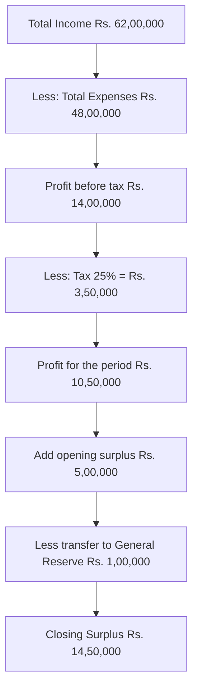

# Q&A — Financial Statements of Companies (Schedule III)

> Scope: Division I (AS-based) presentation under Schedule III to the Companies Act, 2013. All figures in Indian Rupees (Rs.). Aligned to ICAI study material; no invented provisions.

---

## Section A — Concept-Check (with answers)

**A1. What is the prescribed form of the Balance Sheet under Schedule III, Division I?**
Answer: Only the **vertical form** is permitted. It is arranged as (I) Equity and Liabilities and (II) Assets, each further split into non-current and current classifications. The horizontal form is no longer allowed.

**A2. State the "12-month / operating cycle" test for classifying an asset as current.**
Answer: An asset is **current** if it satisfies **any one**: (a) expected to be realised in, or is held for sale/consumption in, the normal operating cycle; (b) held primarily for trading; (c) expected to be realised within 12 months of the reporting date; or (d) it is cash/cash equivalent not restricted beyond 12 months. All others are **non-current**.

**A3. Where is a "Debit balance in the Statement of Profit and Loss" (accumulated loss) shown?**
Answer: Under **Reserves and Surplus** as a **negative figure**. If reserves are insufficient it may make the total of Reserves and Surplus negative; it is never shown on the assets side.

**A4. How is Money Received Against Share Warrants presented?**
Answer: As a **separate line item under Shareholders' Funds** (below Reserves and Surplus), not clubbed with share capital.

**A5. Distinguish the treatment of "Proposed Dividend."**
Answer: Under AS-4 (revised), proposed dividend is a **non-adjusting event**; it is **not** provided as a liability but **disclosed in the notes**. It is recognised as a liability only in the year of approval by shareholders.

**A6. What is "operating cycle" when it cannot be identified?**
Answer: Where the normal operating cycle cannot be identified, it is **assumed to be 12 months**.

**A7. How are current maturities of long-term debt shown?**
Answer: The instalment of a long-term borrowing falling due within 12 months is shown under **Other Current Liabilities**, not under Long-term Borrowings.

**A8. Rounding-off rule under Schedule III (post-2018 amendment).**
Answer: Turnover **< Rs. 100 crore**: round to nearest hundreds/thousands/lakhs/millions. Turnover **>= Rs. 100 crore**: round to nearest lakhs/millions/crores. Rounding, once adopted, must be used uniformly.

---

## Section B — Graded Computational Problems (full solutions)

### B1 (Easy) — Classify current vs non-current
Classify: (i) Trade receivables due in 8 months; (ii) Loan repayable in 5 years; (iii) Current maturity of a term loan (Rs. 2,00,000 due next year); (iv) Inventory held 14 months (operating cycle 18 months); (v) Provision for tax.

Solution:
| Item | Classification | Head |
|---|---|---|
| (i) Receivable 8 months | Current | Trade Receivables |
| (ii) 5-year loan | Non-current | Long-term Borrowings |
| (iii) Current maturity Rs. 2,00,000 | Current | Other Current Liabilities |
| (iv) Inventory (within 18-mo cycle) | Current | Inventories |
| (v) Provision for tax | Current | Short-term Provisions |

### B2 (Moderate) — Reserves and Surplus with a debit balance
Given: General Reserve Rs. 5,00,000; Securities Premium Rs. 2,00,000; Surplus (i.e. balance in Statement of P&L) opening Rs. 1,50,000; loss for the year Rs. 4,00,000. Present Reserves and Surplus.

Solution:
Closing Surplus = 1,50,000 − 4,00,000 = **(2,50,000)** (debit).

| Reserves and Surplus | Rs. |
|---|---|
| Securities Premium | 2,00,000 |
| General Reserve | 5,00,000 |
| Surplus (Statement of P&L): 1,50,000 − 4,00,000 | (2,50,000) |
| **Total** | **4,50,000** |

Self-check: 2,00,000 + 5,00,000 − 2,50,000 = 4,50,000. ✓

### B3 (Exam-level) — Preparation of Balance Sheet extract
From the following trial balances of **XYZ Ltd** as on 31st March 2026, prepare the Balance Sheet as per Schedule III (Division I).

Equity Share Capital Rs. 20,00,000; Securities Premium Rs. 3,00,000; 10% Debentures (redeemable 2031) Rs. 8,00,000; Term loan from bank Rs. 6,00,000 (of which Rs. 1,00,000 due within 12 months); Trade Payables Rs. 4,50,000; Provision for Tax Rs. 2,10,000; Property, Plant & Equipment (net) Rs. 28,00,000; Non-current Investments Rs. 3,00,000; Inventories Rs. 5,60,000; Trade Receivables Rs. 6,40,000; Cash and Bank Rs. 2,30,000; Surplus in Statement of P&L (Cr.) Rs. 7,20,000. Proposed dividend Rs. 2,00,000 (approved after year-end — not to be provided).

Solution — reclassify term loan: Non-current portion = 6,00,000 − 1,00,000 = 5,00,000; Current maturity 1,00,000 → Other Current Liabilities.

**Balance Sheet of XYZ Ltd as at 31 March 2026**

| Particulars | Note | Rs. |
|---|---|---|
| **I. EQUITY AND LIABILITIES** | | |
| (1) Shareholders' Funds | | |
| (a) Share Capital | | 20,00,000 |
| (b) Reserves and Surplus (3,00,000 + 7,20,000) | | 10,20,000 |
| (2) Non-current Liabilities | | |
| (a) Long-term Borrowings (8,00,000 + 5,00,000) | | 13,00,000 |
| (3) Current Liabilities | | |
| (a) Trade Payables | | 4,50,000 |
| (b) Other Current Liabilities (current maturity) | | 1,00,000 |
| (c) Short-term Provisions (Provision for Tax) | | 2,10,000 |
| **TOTAL** | | **50,80,000** |
| **II. ASSETS** | | |
| (1) Non-current Assets | | |
| (a) PPE | | 28,00,000 |
| (b) Non-current Investments | | 3,00,000 |
| (2) Current Assets | | |
| (a) Inventories | | 5,60,000 |
| (b) Trade Receivables | | 6,40,000 |
| (c) Cash and Cash Equivalents | | 2,30,000 |
| **TOTAL** | | **50,80,000** |

Self-check: Liabilities 20,00,000+10,20,000+13,00,000+4,50,000+1,00,000+2,10,000 = 50,80,000; Assets 28,00,000+3,00,000+5,60,000+6,40,000+2,30,000 = 50,80,000. ✓ Proposed dividend Rs. 2,00,000 disclosed in notes only (AS-4 revised).

### B4 (Exam-hard) — Statement of Profit and Loss + appropriation
**ABC Ltd** for the year ended 31 March 2026: Revenue from operations Rs. 60,00,000; Other income Rs. 2,00,000; Cost of materials consumed Rs. 28,00,000; Purchases of stock-in-trade Rs. 4,00,000; Changes in inventories of finished goods (increase) Rs. 1,50,000; Employee benefits expense Rs. 9,00,000; Finance costs Rs. 1,20,000; Depreciation Rs. 3,30,000; Other expenses Rs. 4,00,000. Tax rate 25%. Opening surplus Rs. 5,00,000. Transfer to General Reserve Rs. 1,00,000.

Solution:

**Statement of Profit and Loss for the year ended 31 March 2026**

| Particulars | Note | Rs. |
|---|---|---|
| I. Revenue from operations | | 60,00,000 |
| II. Other income | | 2,00,000 |
| **III. Total Income (I+II)** | | **62,00,000** |
| IV. Expenses: | | |
| Cost of materials consumed | | 28,00,000 |
| Purchases of stock-in-trade | | 4,00,000 |
| Changes in inventories of FG/WIP/stock-in-trade | | (1,50,000) |
| Employee benefits expense | | 9,00,000 |
| Finance costs | | 1,20,000 |
| Depreciation and amortisation expense | | 3,30,000 |
| Other expenses | | 4,00,000 |
| **Total Expenses** | | **48,00,000** |
| V. Profit before tax (III−IV) | | 14,00,000 |
| VI. Tax expense (25%) | | 3,50,000 |
| **VII. Profit for the period** | | **10,50,000** |

Changes in inventories entered as **negative** because an increase in FG stock reduces expense.
Self-check expenses: 28,00,000+4,00,000−1,50,000+9,00,000+1,20,000+3,30,000+4,00,000 = 48,00,000. ✓ PBT 62,00,000−48,00,000 = 14,00,000. ✓

Appropriation (shown in Notes / Reserves movement):
Closing Surplus = 5,00,000 + 10,50,000 − 1,00,000 (transfer to GR) = **Rs. 14,50,000**.

Solution path for B4:

### B5 (Exam-hard) — Trade Receivables ageing & bifurcation
Trade receivables total Rs. 9,00,000: secured considered good Rs. 3,00,000; unsecured considered good Rs. 5,00,000; doubtful Rs. 1,00,000. Provision for doubtful debts Rs. 40,000. Of the good balances, Rs. 6,00,000 is outstanding over 6 months. Present the note.

Solution:

**Note — Trade Receivables**

| Particulars | Rs. |
|---|---|
| Outstanding > 6 months from due date: | |
| — Secured, considered good | (part of below)* |
| Unsecured, considered good | 5,00,000 |
| Secured, considered good | 3,00,000 |
| Doubtful | 1,00,000 |
| Sub-total | 9,00,000 |
| Less: Provision for doubtful debts | (40,000) |
| **Net Trade Receivables** | **8,60,000** |

The over-6-months disclosure (Rs. 6,00,000) is shown as a sub-classification within the note. Net carried to Balance Sheet = **Rs. 8,60,000**. Self-check: 9,00,000 − 40,000 = 8,60,000. ✓ *(Only the ageing split is illustrative; provision netted against gross.)*

---

## Section C — Past-Paper-Style Full Questions (model answers)

### C1. From the following balances of **PQR Ltd** as on 31 March 2026, prepare the Balance Sheet as per Schedule III.
Authorised & issued Equity Share Capital (Rs. 10 each, fully paid) Rs. 25,00,000; Calls-in-arrears Rs. 50,000; Capital Reserve Rs. 1,00,000; Surplus (Cr.) Rs. 6,50,000; 12% Debentures Rs. 10,00,000; Public deposits (repayable in 3 yrs) Rs. 2,00,000; Trade Payables Rs. 3,80,000; Outstanding expenses Rs. 70,000; Provision for tax Rs. 1,50,000; Goodwill Rs. 2,00,000; PPE (net) Rs. 30,00,000; Capital Work-in-Progress Rs. 3,00,000; Long-term investments Rs. 2,50,000; Inventories Rs. 6,00,000; Trade Receivables Rs. 5,80,000; Short-term investments Rs. 1,20,000; Cash and bank Rs. 4,00,000.

Model answer:
Share Capital net of calls-in-arrears = 25,00,000 − 50,000 = 24,50,000.

**Balance Sheet of PQR Ltd as at 31 March 2026**

| Particulars | Rs. |
|---|---|
| **I. EQUITY AND LIABILITIES** | |
| Share Capital (25,00,000 − 50,000 calls-in-arrears) | 24,50,000 |
| Reserves and Surplus (1,00,000 + 6,50,000) | 7,50,000 |
| Long-term Borrowings (10,00,000 + 2,00,000) | 12,00,000 |
| Trade Payables | 3,80,000 |
| Other Current Liabilities (Outstanding expenses) | 70,000 |
| Short-term Provisions (Provision for tax) | 1,50,000 |
| **TOTAL** | **50,00,000** |
| **II. ASSETS** | |
| PPE | 30,00,000 |
| Capital Work-in-Progress | 3,00,000 |
| Goodwill (Intangible) | 2,00,000 |
| Non-current Investments | 2,50,000 |
| Inventories | 6,00,000 |
| Trade Receivables | 5,80,000 |
| Current Investments | 1,20,000 |
| Cash and Cash Equivalents | 4,00,000 |
| **TOTAL** | **50,00,000** |

Self-check: Eq+Liab 24,50,000+7,50,000+12,00,000+3,80,000+70,000+1,50,000 = 50,00,000; Assets 30,00,000+3,00,000+2,00,000+2,50,000+6,00,000+5,80,000+1,20,000+4,00,000 = 50,00,000. ✓

Notes: (a) Calls-in-arrears deducted from subscribed capital; (b) Public deposits repayable in 3 years are Long-term Borrowings; (c) Goodwill and CWIP are separate non-current line items.

### C2. Explain how the following would be shown in the financial statements of a company under Schedule III:
(a) Sundry creditors for capital goods; (b) Interest accrued and due on borrowings; (c) Advance received from customers; (d) Unpaid dividend; (e) Provision for warranty.

Model answer:
(a) **Sundry creditors for capital goods** — shown under **Other Current Liabilities** (they are not trade payables, since not for goods/services in ordinary course of business).
(b) **Interest accrued and due on borrowings** — **Other Current Liabilities**.
(c) **Advance from customers** — **Other Current Liabilities** (an advance is not a trade payable).
(d) **Unpaid/Unclaimed dividend** — **Other Current Liabilities** (statutorily payable to IEPF after 7 years).
(e) **Provision for warranty** — **Short-term Provisions** if expected settlement within 12 months / operating cycle, else Long-term Provisions.

### C3. State any five general instructions for preparation of the Balance Sheet under Schedule III.
Model answer: (1) Only the **vertical format** is prescribed. (2) Every item on the face must be **cross-referenced to a Note**. (3) **Corresponding previous-year figures** must be given for all items. (4) Assets and liabilities are classified into **current and non-current**. (5) Figures must be **rounded off** per the turnover-based scale and used uniformly. (Additional: where compliance with AS requires a change of treatment, Schedule III stands modified accordingly — **Accounting Standards prevail over Schedule III**.)

---

## Section D — MCQs and Case Scenarios (answer + one-line reasoning)

**D1.** Under Schedule III, a Balance Sheet is presented in:
(a) Horizontal form (b) Vertical form (c) Either form (d) T-form
**Answer: (b)** — Only the vertical form is prescribed.

**D2.** Debit balance in the Statement of Profit and Loss is shown:
(a) On assets side (b) Under Reserves and Surplus as negative (c) As miscellaneous expenditure (d) Under current assets
**Answer: (b)** — It is a negative figure within Reserves and Surplus.

**D3.** Current maturity of long-term debt is disclosed under:
(a) Long-term Borrowings (b) Short-term Borrowings (c) Other Current Liabilities (d) Trade Payables
**Answer: (c)** — The portion due within 12 months moves to Other Current Liabilities.

**D4.** Proposed dividend (declared after year-end) under AS-4 (revised) is:
(a) Provided as current liability (b) Disclosed in notes, not provided (c) Deducted from reserves (d) Shown as contingent asset
**Answer: (b)** — It is a non-adjusting event; only disclosed.

**D5.** Calls-in-arrears are:
(a) Added to share capital (b) Deducted from subscribed capital (c) Shown as current asset (d) Ignored
**Answer: (b)** — Deducted from called-up/subscribed capital.

**D6.** Where the operating cycle cannot be identified, it is taken as:
(a) 6 months (b) 12 months (c) 18 months (d) 24 months
**Answer: (b)** — Deemed 12 months.

**D7.** A company with turnover of Rs. 250 crore must round off figures to the nearest:
(a) Hundreds only (b) Lakhs, millions or crores (c) Thousands (d) Rupee
**Answer: (b)** — Turnover >= Rs. 100 crore allows lakhs/millions/crores.

**D8 (Case).** LMN Ltd has: bank overdraft Rs. 3,00,000, term loan (non-current) Rs. 10,00,000 with Rs. 2,00,000 due in 6 months, and unclaimed dividend Rs. 40,000. Classify each.
**Answer:** Bank overdraft → **Short-term Borrowings**; term loan non-current portion Rs. 8,00,000 → **Long-term Borrowings**; Rs. 2,00,000 current maturity and Rs. 40,000 unclaimed dividend → **Other Current Liabilities**. Reasoning: overdrafts are repayable on demand; only the 12-month instalment reclassifies; unclaimed dividend is a statutory current liability.

**D9.** "Securities Premium" is disclosed under:
(a) Share Capital (b) Reserves and Surplus (c) Long-term Borrowings (d) Other current liabilities
**Answer: (b)** — It is a capital reserve within Reserves and Surplus.

**D10.** Which prevails in case of conflict?
(a) Schedule III (b) Accounting Standards (c) The company's policy (d) Auditor's choice
**Answer: (b)** — Where AS treatment differs, Schedule III stands modified; Accounting Standards prevail.

---

*End of Q&A — self-verify totals confirmed; figures reconcile across all problems.*
