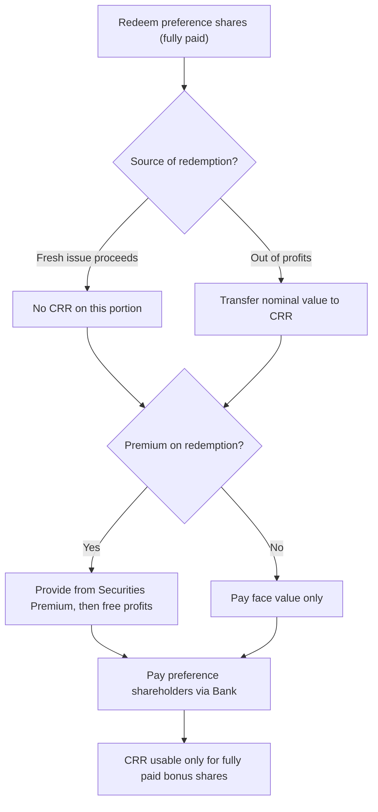

# Q&A — Redemption of Preference Shares

> Self-study question bank. Every question is followed immediately by a full model answer. Amounts in Rupees (Rs.). Based on the Companies Act, 2013 (Section 55 read with Sections 52, 63, 66) and ICAI Advanced Accounting. No invented provisions.

---

## SECTION A — Concept Checks (with answers)

**A1. Can a company issue irredeemable preference shares?**
Answer: **No.** Section 55(1) prohibits issue of **irredeemable** preference shares. A company limited by shares may issue only **redeemable** preference shares, redeemable within **20 years** (except an infrastructure project company, which may issue beyond 20 years subject to redemption of a minimum percentage annually at the option of holders).

**A2. State the two — and only two — permissible sources of redemption under Section 55(2).**
Answer: Preference shares may be redeemed only: (i) **out of profits** of the company which would otherwise be available for dividend (i.e. divisible/free profits); or (ii) **out of the proceeds of a fresh issue of shares** made for the purpose of redemption. A combination of the two is allowed. Redemption can **never** be made out of the sale proceeds of assets or out of capital.

**A3. What is the Capital Redemption Reserve (CRR) and when must it be created?**
Answer: When shares are redeemed **out of profits** (wholly or partly), a sum equal to the **nominal (face) value** of the shares redeemed **out of profits** must be transferred to the **Capital Redemption Reserve**. CRR is treated as **paid-up share capital** for all purposes and can be used **only** to issue **fully paid bonus shares** (Sec 55(3) / Sec 63).

**A4. Two pre-conditions before any preference share can be redeemed.**
Answer: (i) The shares must be **fully paid-up** — partly paid shares cannot be redeemed; (ii) Only shares that are **redeemable** by their terms of issue can be redeemed. (Redemption does not reduce authorised capital.)

**A5. Out of what may the premium payable on redemption be provided?**
Answer: The premium on redemption is provided out of the company's **profits** or out of the **Securities Premium Account** (Sec 52 permits securities premium to be applied for premium on redemption of preference shares). For certain prescribed (compliant) classes of companies, the premium must be provided out of profits **before** using securities premium — but for the standard exam problem, securities premium may be used to meet the premium on redemption.

**A6. Why does the law force creation of CRR (the capital-maintenance idea)?**
Answer: Redemption returns capital to preference shareholders, shrinking the "cushion" available to creditors. To keep the **buffer intact**, an amount equal to the capital redeemed out of profits is **locked away** in CRR — a non-distributable reserve. Free profits are converted into a capital-like reserve, so total protected capital is **maintained**. (Dam analogy: water let out of the reservoir is replaced by pouring in an equal amount and sealing it behind a wall.)

**A7. What is the "minimum fresh issue" and why is it examined?**
Answer: It is the **smallest nominal value of new shares** a company must issue to lawfully complete redemption while using the **maximum available profits**. Formula: **Minimum fresh issue (nominal) = Nominal value of preference shares redeemed − Profits available for transfer to CRR.** Only the **face value** of the fresh issue counts toward the requirement (any securities premium on the new issue does not).

**A8. Can CRR be used to write off the premium payable on redemption?**
Answer: **No.** CRR can be used **only** for issuing fully paid **bonus shares**. Premium on redemption must come from profits or securities premium, never from CRR.

---

## SECTION B — Graded Computational Problems (full solutions)

### B1 (Easy) — Redemption wholly out of a fresh issue

A Ltd. redeems 10,000 8% Redeemable Preference Shares of Rs. 100 each **at par**. To finance this it issues 1,00,000 equity shares of Rs. 10 each at par, expressly for the purpose of redemption. Pass journal entries.

**Solution.** Redemption amount = 10,000 × 100 = **Rs. 10,00,000**. Fresh issue proceeds (nominal) = 1,00,000 × 10 = Rs. 10,00,000. Since redemption is **wholly out of fresh issue**, **no CRR** is required (nothing is redeemed out of profits).

| # | Particulars | Dr (Rs.) | Cr (Rs.) |
|---|---|---|---|
| 1 | Bank A/c ................................ Dr | 10,00,000 | |
| | &nbsp;&nbsp;To Equity Share Capital A/c | | 10,00,000 |
| | *(Fresh issue for redemption)* | | |
| 2 | 8% Redeemable Preference Share Capital A/c ... Dr | 10,00,000 | |
| | &nbsp;&nbsp;To Preference Shareholders A/c | | 10,00,000 |
| 3 | Preference Shareholders A/c ......... Dr | 10,00,000 | |
| | &nbsp;&nbsp;To Bank A/c | | 10,00,000 |

Check: CRR needed = Nominal redeemed (10,00,000) − Nominal fresh issue (10,00,000) = **Nil**. ✔

---

### B2 (Medium) — Redemption wholly out of profits

B Ltd. redeems 5,000 9% Redeemable Preference Shares of Rs. 100 each **at par**, entirely out of General Reserve (balance Rs. 8,00,000). No fresh issue is made. Pass entries and state the CRR.

**Solution.** Redemption = 5,000 × 100 = **Rs. 5,00,000**, all out of profits → transfer **Rs. 5,00,000** to CRR.

| # | Particulars | Dr (Rs.) | Cr (Rs.) |
|---|---|---|---|
| 1 | 9% Redeemable Preference Share Capital A/c ... Dr | 5,00,000 | |
| | &nbsp;&nbsp;To Preference Shareholders A/c | | 5,00,000 |
| 2 | Preference Shareholders A/c ......... Dr | 5,00,000 | |
| | &nbsp;&nbsp;To Bank A/c | | 5,00,000 |
| 3 | General Reserve A/c .................. Dr | 5,00,000 | |
| | &nbsp;&nbsp;To Capital Redemption Reserve A/c | | 5,00,000 |
| | *(Nominal value redeemed out of profits transferred to CRR)* | | |

General Reserve after: 8,00,000 − 5,00,000 = **Rs. 3,00,000**. CRR created = **Rs. 5,00,000**. ✔

---

### B3 (Medium–Hard) — Computing the minimum fresh issue

C Ltd. wishes to redeem Rs. 4,00,000 (face value) of preference shares **at par**. Available balances: General Reserve Rs. 1,50,000; Profit & Loss (Cr.) Rs. 50,000; Securities Premium Rs. 30,000. The company wants to make the **smallest possible fresh issue** of equity shares of Rs. 10 each at par. Find the minimum fresh issue and the CRR.

**Solution.**

Step 1 — Profits available for transfer to CRR (free profits only): General Reserve 1,50,000 + P&L 50,000 = **Rs. 2,00,000**. (Securities Premium is a **capital** reserve; it **cannot** be transferred to CRR.)

Step 2 — Minimum fresh issue (nominal) = Nominal redeemed − Profits available for CRR = 4,00,000 − 2,00,000 = **Rs. 2,00,000**.

Step 3 — Number of equity shares = 2,00,000 / 10 = **20,000 shares**.

Verification of the capital-maintenance rule: CRR (2,00,000, from profits) + Nominal fresh issue (2,00,000) = 4,00,000 = nominal value redeemed. ✔ Securities Premium of Rs. 30,000 stays untouched (redemption is at par, no premium payable).

---

### B4 (Exam-Hard) — Premium on redemption + fresh issue + CRR + bonus, fully reconciled

The Balance Sheet extract of **X Ltd.** as on 31 March 2026 (before redemption):

| Equity & Liabilities | Rs. |
|---|---|
| Equity Share Capital (20,000 equity shares of Rs. 100 each, fully paid) | 20,00,000 |
| 10% Redeemable Preference Share Capital (5,000 shares of Rs. 100 each) | 5,00,000 |
| Securities Premium | 20,000 |
| General Reserve | 4,00,000 |
| Profit & Loss (Cr.) | 1,00,000 |
| Sundry liabilities | 6,80,000 |
| **Total** | **37,00,000** |
| Bank (part of assets) | 8,00,000 |

The preference shares are redeemed at a **premium of 10%**. To part-finance, X Ltd. issues **2,000 equity shares of Rs. 100 each at par**. After redemption, the company uses the CRR to issue fully paid **bonus shares** to equity shareholders in the ratio available. Pass journal entries, show ledger of CRR, and prepare the Balance Sheet extract after all entries.

**Step 1 — Amount payable on redemption.** Face 5,000 × 100 = 5,00,000; Premium 10% = 50,000. Total cash payable = **Rs. 5,50,000**.

**Step 2 — Provide the premium on redemption (Rs. 50,000).** Use Securities Premium first (20,000), balance from General Reserve (30,000): Securities Premium 20,000 + General Reserve 30,000 = **50,000**.

**Step 3 — CRR required.** Nominal redeemed 5,00,000 − Nominal fresh issue (2,000 × 100 = 2,00,000) = **Rs. 3,00,000**, transferred from General Reserve.

**Step 4 — General Reserve check.** Opening 4,00,000 − 30,000 (premium) − 3,00,000 (CRR) = **Rs. 70,000** remaining. Sufficient. ✔

**Step 5 — Bank check.** Opening 8,00,000 + fresh issue 2,00,000 − paid 5,50,000 = **Rs. 4,50,000**. Positive. ✔

**Journal Entries**

| # | Particulars | Dr (Rs.) | Cr (Rs.) |
|---|---|---|---|
| 1 | Bank A/c .............................. Dr | 2,00,000 | |
| | &nbsp;&nbsp;To Equity Share Capital A/c | | 2,00,000 |
| | *(2,000 equity shares of Rs. 100 issued at par for redemption)* | | |
| 2 | 10% Redeemable Preference Share Capital A/c ... Dr | 5,00,000 | |
| | Premium on Redemption of Preference Shares A/c ... Dr | 50,000 | |
| | &nbsp;&nbsp;To Preference Shareholders A/c | | 5,50,000 |
| 3 | Securities Premium A/c ............... Dr | 20,000 | |
| | General Reserve A/c .................. Dr | 30,000 | |
| | &nbsp;&nbsp;To Premium on Redemption of Preference Shares A/c | | 50,000 |
| 4 | Preference Shareholders A/c .......... Dr | 5,50,000 | |
| | &nbsp;&nbsp;To Bank A/c | | 5,50,000 |
| 5 | General Reserve A/c .................. Dr | 3,00,000 | |
| | &nbsp;&nbsp;To Capital Redemption Reserve A/c | | 3,00,000 |
| | *(Nominal value redeemed out of profits transferred to CRR)* | | |
| 6 | Capital Redemption Reserve A/c ....... Dr | 3,00,000 | |
| | &nbsp;&nbsp;To Bonus to Shareholders A/c | | 3,00,000 |
| 7 | Bonus to Shareholders A/c ............ Dr | 3,00,000 | |
| | &nbsp;&nbsp;To Equity Share Capital A/c | | 3,00,000 |
| | *(Bonus shares issued using CRR — Sec 63)* | | |

**Capital Redemption Reserve Account (ledger)**

| Dr | Rs. | Cr | Rs. |
|---|---|---|---|
| To Bonus to Shareholders A/c | 3,00,000 | By General Reserve A/c | 3,00,000 |
| | **3,00,000** | | **3,00,000** |

CRR is fully applied to bonus shares → **nil** balance.

**Balance Sheet extract of X Ltd. after redemption and bonus**

| Equity & Liabilities | Rs. | Working |
|---|---|---|
| Equity Share Capital | 25,00,000 | 20,00,000 + 2,00,000 fresh + 3,00,000 bonus |
| 10% Redeemable Preference Share Capital | Nil | redeemed |
| Securities Premium | Nil | 20,000 − 20,000 |
| Capital Redemption Reserve | Nil | 3,00,000 − 3,00,000 (bonus) |
| General Reserve | 70,000 | 4,00,000 − 30,000 − 3,00,000 |
| Profit & Loss (Cr.) | 1,00,000 | untouched |
| Sundry liabilities | 6,80,000 | |
| **Total** | **33,50,000** | |
| Bank | 4,50,000 | 8,00,000 + 2,00,000 − 5,50,000 |

Reconciliation of the fall in total (37,00,000 → 33,50,000 = **3,50,000**) = cash paid 5,50,000 − fresh cash raised 2,00,000 = **3,50,000**. ✔ Capital maintained: capital + CRR before use (25,00,000 equity incl. bonus) protects creditors as before.

---

## SECTION C — Past-Paper-Style Full Questions (model answers)

**C1.** *"The Board of Y Ltd. proposes to redeem its 6,000 8% Redeemable Preference Shares of Rs. 100 each at a premium of 5%. General Reserve stands at Rs. 3,00,000, Securities Premium at Rs. 40,000, and P&L (Cr.) at Rs. 60,000. The company will issue the minimum number of equity shares of Rs. 10 each at a premium of Rs. 2 per share necessary to comply with the law. Compute the minimum fresh issue (number of shares) and pass the entry for the fresh issue."*

**Model Answer.**
Nominal value to redeem = 6,000 × 100 = **Rs. 6,00,000**. Free profits available for CRR = General Reserve 3,00,000 + P&L 60,000 = **Rs. 3,60,000** (Securities Premium excluded).
Minimum fresh issue (nominal) = 6,00,000 − 3,60,000 = **Rs. 2,40,000** → 2,40,000 / 10 = **24,000 equity shares**.
Proceeds: face 24,000 × 10 = 2,40,000; premium 24,000 × 2 = 48,000; total cash = **Rs. 2,88,000**.

| Particulars | Dr (Rs.) | Cr (Rs.) |
|---|---|---|
| Bank A/c ......................... Dr | 2,88,000 | |
| &nbsp;&nbsp;To Equity Share Capital A/c | | 2,40,000 |
| &nbsp;&nbsp;To Securities Premium A/c | | 48,000 |

Note: only the **face value** (2,40,000) counts toward the redemption requirement; the fresh premium (48,000) is added to Securities Premium and is **not** available for CRR. Premium on redemption (6,000 × 5 = Rs. 30,000) would be met from Securities Premium (40,000 existing + 48,000 new is more than enough).

**C2.** *"Explain how redemption of preference shares is connected to (a) buy-back of shares and (b) reduction of capital under Section 66, and why redemption does NOT require court/Tribunal approval."*

**Model Answer.** (a) **Buy-back (Sec 68):** Like redemption, a buy-back returns capital to members and — where done out of free reserves or securities premium — requires transfer of the **nominal value bought back to CRR**. Both are capital-maintenance devices creating a non-distributable reserve. (b) **Reduction of capital (Sec 66):** A general reduction of share capital is a **variation of the capital structure** and needs a special resolution **plus National Company Law Tribunal confirmation**. Redemption of preference shares is a **pre-agreed contractual repayment** on terms fixed at issue; because CRR replaces the capital redeemed (out of profits), creditor protection is automatically preserved, so **no Tribunal sanction** is required. In short: redemption = self-policing capital maintenance; Sec 66 reduction = court-supervised because the cushion is genuinely being reduced.

**C3.** *"State the accounting treatment where preference shares are redeemed partly out of a fresh issue and partly out of profits, and the fresh issue is made at a discount is not permitted — explain."*

**Model Answer.** Where redemption is **part fresh issue, part profits**: (i) record fresh issue → Bank Dr, Share Capital Cr (and Securities Premium Cr if at premium); (ii) redeem → Preference Share Capital (+ Premium on Redemption) Dr, Preference Shareholders Cr, then paid via Bank; (iii) transfer to **CRR only the portion redeemed out of profits** = Nominal redeemed − Nominal fresh issue. On **discount**: Section 53 of the Companies Act, 2013 **prohibits issue of shares at a discount** (save sweat equity). Therefore a company **cannot** fund redemption through a fresh issue at a discount; the fresh issue must be at par or premium, and only its **face value** reduces the CRR requirement.

---

## SECTION D — MCQs & Case Scenarios

**D1.** CRR can be utilised for:
(a) Paying dividend  (b) Writing off premium on redemption  (c) Issuing fully paid bonus shares  (d) Redeeming debentures.
**Answer: (c).** CRR is treated as paid-up capital and is usable only for fully paid bonus shares (Sec 63).

**D2.** Preference shares of Rs. 6,00,000 are redeemed; fresh issue (face value) is Rs. 2,50,000; balance out of profits. CRR to be created =
(a) Rs. 6,00,000  (b) Rs. 3,50,000  (c) Rs. 2,50,000  (d) Nil.
**Answer: (b) Rs. 3,50,000.** CRR = nominal redeemed − nominal fresh issue = 6,00,000 − 2,50,000.

**D3.** Only ______ preference shares can be redeemed.
(a) partly paid  (b) fully paid  (c) forfeited  (d) any.
**Answer: (b) fully paid.** Partly paid shares must first be made fully paid.

**D4.** The premium payable on redemption may be met out of:
(a) CRR  (b) Securities Premium or profits  (c) Revaluation Reserve  (d) Sale of fixed assets.
**Answer: (b).** Sec 52 allows securities premium; otherwise free profits. CRR and revaluation reserve are not permitted.

**D5 (Case).** Z Ltd. has free reserves of Rs. 5,00,000 and wants to redeem Rs. 5,00,000 preference shares at par **without any fresh issue**, then immediately declare a large dividend from those same reserves. Advise.
**Answer:** Redemption wholly out of profits requires **Rs. 5,00,000 to be transferred to CRR**, which is **non-distributable**. The reserves are effectively locked; they can no longer fund a dividend. The plan defeats capital maintenance and is not permissible — the reserves are converted to CRR, available only for bonus shares.

**D6 (Trap).** A fresh issue of equity shares is made at a premium of Rs. 15 (face Rs. 10). For computing the minimum fresh issue to redeem preference shares, the premium of Rs. 15 —
(a) counts fully  (b) counts half  (c) does not count  (d) counts only if redemption is at par.
**Answer: (c) does not count.** Only the **face value** of the fresh issue reduces the CRR/redemption requirement; the securities premium portion does not.

---

## Decision Path (Mermaid)

---

## Quick-Revision Sheet

- **Sec 55:** only **redeemable** preference shares; redeem within **20 years**; must be **fully paid**.
- **Two sources only:** (1) **fresh issue** proceeds; (2) **free profits**. Never from asset sale or capital.
- **CRR = nominal value redeemed OUT OF PROFITS** (= Nominal redeemed − Nominal fresh issue). CRR is paid-up-capital-equivalent; **only for bonus shares**.
- **Minimum fresh issue (nominal) = Nominal redeemed − Free profits available for CRR.** Securities premium never counts toward CRR.
- **Premium on redemption:** from **Securities Premium (Sec 52)** or **free profits** — never from CRR.
- **Connections:** buy-back (Sec 68) also creates CRR; bonus (Sec 63) consumes CRR; Sec 66 reduction needs NCLT, redemption does not.
- **Traps:** partly paid shares can't be redeemed; fresh-issue premium excluded; CRR can't pay premium/dividend; redemption doesn't cut authorised capital.
