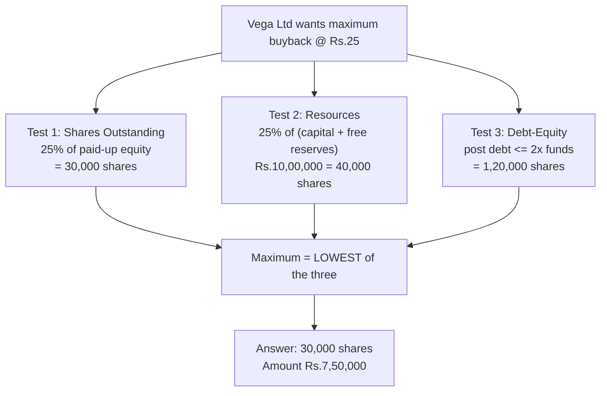

# Q&A — Buyback of Securities

CA Intermediate — Advanced Accounting. All amounts in Rupees (₹). Provisions per the Companies Act, 2013 (Sections 68, 69, 70) and ICAI Study Material. No invented provisions.

---

## Section A — Concept Check (with answers)

**A1. What is buyback of securities?**
It is the purchase by a company of its own shares/specified securities out of its existing resources, resulting in extinguishment (cancellation) of those shares. It reduces the number of shares outstanding and the company's capital base.

**A2. State the sources permitted for buyback under Section 68(1).**
(i) Free reserves, (ii) Securities Premium Account, and (iii) proceeds of a fresh issue of any shares or other specified securities. Buyback cannot be made out of the proceeds of an earlier issue of the same kind of shares/securities.

**A3. What are the three quantitative ceilings (tests) on the quantum of buyback?**
(i) **Shares outstanding test** — number of equity shares bought back in a financial year ≤ 25% of total paid-up equity capital. (ii) **Resources test** — total amount of buyback ≤ 25% of (paid-up capital + free reserves). (iii) **Debt-equity test** — after buyback, (secured + unsecured debts) ≤ 2 × (paid-up capital + free reserves). Maximum permissible buyback = the **lowest** of the three.

**A4. When is only a Board resolution enough, and when is a Special Resolution required?**
Board resolution suffices where buyback is ≤ 10% of (paid-up equity capital + free reserves). Beyond that (up to 25%), a **Special Resolution** authorised by the Articles is required.

**A5. What is Capital Redemption Reserve (CRR) and why is it created on buyback? (Section 69)**
Where shares are bought back out of free reserves or securities premium, a sum equal to the **nominal (face) value** of shares bought back is transferred to CRR. It preserves capital: free reserves used to return capital are "locked" so creditors' cushion is not eroded. CRR can be used only to issue fully paid **bonus shares**.

**A6. Is CRR created when buyback is financed from a fresh issue?**
No. To the extent buyback is financed out of proceeds of a fresh issue, no CRR is required. CRR = face value of shares bought back − face value of fresh shares issued to fund the buyback.

**A7. State any four procedural conditions under Section 68(2).**
Buyback must be authorised by Articles; shares must be **fully paid-up**; buyback must be **completed within one year** of the resolution; and no further buyback within **one year** from completion of the previous one. (Also: shares bought back to be **extinguished within 7 days**; no fresh issue of same kind of shares for **6 months** except bonus/ESOP/conversion.)

**A8. Can free reserves used for buyback be the securities premium? Which reserves are NOT free reserves?**
Securities premium may be used to pay the **premium** on buyback and to create CRR, and is treated as available for the resources test. Capital reserves, revaluation reserve, and CRR itself are **not** free reserves and cannot fund buyback.

---

## Section B — Graded Computational Problems (full solutions)

### B1 (Easy) — Simple buyback out of free reserves

Nova Ltd buys back 20,000 equity shares of ₹10 each at par (₹10) out of General Reserve. Pass journal entries.

**Solution.** Buyback amount = 20,000 × ₹10 = ₹2,00,000. No premium (at par). CRR = face value = ₹2,00,000.

| Particulars | Dr (₹) | Cr (₹) |
|---|---|---|
| Equity Share Capital A/c ..... Dr | 2,00,000 | |
| &nbsp;&nbsp;To Equity Shares Buy-back A/c | | 2,00,000 |
| Equity Shares Buy-back A/c ..... Dr | 2,00,000 | |
| &nbsp;&nbsp;To Bank A/c | | 2,00,000 |
| General Reserve A/c ..... Dr | 2,00,000 | |
| &nbsp;&nbsp;To Capital Redemption Reserve A/c | | 2,00,000 |

**Check:** Free reserves fall ₹2,00,000; CRR rises ₹2,00,000; net worth attributable to members reduced by cash paid ₹2,00,000. ✔

---

### B2 (Moderate) — Buyback at a premium

Orion Ltd buys back 30,000 equity shares of ₹10 each at ₹18. Securities Premium balance ₹1,50,000; General Reserve ₹8,00,000. Pass entries.

**Solution.**
- Buyback amount = 30,000 × 18 = ₹5,40,000; Face value = 30,000 × 10 = ₹3,00,000; Premium = 30,000 × 8 = ₹2,40,000.
- Premium met first from Securities Premium ₹1,50,000, balance ₹90,000 from General Reserve.
- CRR = face value bought back = ₹3,00,000 (no fresh issue).

| Particulars | Dr (₹) | Cr (₹) |
|---|---|---|
| Equity Share Capital A/c ..... Dr | 3,00,000 | |
| Securities Premium A/c ..... Dr | 1,50,000 | |
| General Reserve A/c ..... Dr | 90,000 | |
| &nbsp;&nbsp;To Equity Shares Buy-back A/c | | 5,40,000 |
| Equity Shares Buy-back A/c ..... Dr | 5,40,000 | |
| &nbsp;&nbsp;To Bank A/c | | 5,40,000 |
| General Reserve A/c ..... Dr | 3,00,000 | |
| &nbsp;&nbsp;To Capital Redemption Reserve A/c | | 3,00,000 |

**Check:** Cash out ₹5,40,000 = face 3,00,000 + premium 2,40,000. Reserves consumed = premium (1,50,000 + 90,000) + CRR transfer 3,00,000 = ₹5,40,000. ✔

---

### B3 (Moderate) — Buyback part-financed by fresh issue

Sirius Ltd buys back 40,000 equity shares of ₹10 at ₹15. To part-finance it, it issues 10,000 new equity shares of ₹10 at par. Free reserves (General Reserve) ₹9,00,000; Securities Premium nil. Pass entries and compute CRR.

**Solution.**
- Buyback = 40,000 × 15 = ₹6,00,000; Face bought back = ₹4,00,000; Premium = 40,000 × 5 = ₹2,00,000.
- Fresh issue proceeds = 10,000 × 10 = ₹1,00,000 (at par).
- **CRR = face value bought back − face value of fresh issue = 4,00,000 − 1,00,000 = ₹3,00,000.**
- Premium ₹2,00,000 met from General Reserve (no securities premium available).

| Particulars | Dr (₹) | Cr (₹) |
|---|---|---|
| Bank A/c ..... Dr | 1,00,000 | |
| &nbsp;&nbsp;To Equity Share Capital A/c | | 1,00,000 |
| Equity Share Capital A/c ..... Dr | 4,00,000 | |
| General Reserve A/c ..... Dr | 2,00,000 | |
| &nbsp;&nbsp;To Equity Shares Buy-back A/c | | 6,00,000 |
| Equity Shares Buy-back A/c ..... Dr | 6,00,000 | |
| &nbsp;&nbsp;To Bank A/c | | 6,00,000 |
| General Reserve A/c ..... Dr | 3,00,000 | |
| &nbsp;&nbsp;To Capital Redemption Reserve A/c | | 3,00,000 |

**Check:** Net cash outflow = 6,00,000 − 1,00,000 = ₹5,00,000. Reserves used = premium 2,00,000 + CRR 3,00,000 = ₹5,00,000. Capital: −4,00,000 (buyback) +1,00,000 (issue) = net −3,00,000, matched by CRR. ✔

---

### B4 (Exam-hard) — Maximum permissible buyback (three tests) + entries

Vega Ltd's Balance Sheet extract:

| Equity & Liabilities | ₹ |
|---|---|
| Equity Share Capital (1,20,000 shares of ₹10) | 12,00,000 |
| General Reserve | 18,00,000 |
| Securities Premium | 6,00,000 |
| Profit & Loss (Cr.) | 4,00,000 |
| 12% Secured Loan | 15,00,000 |
| Unsecured Loan | 5,00,000 |

The company decides to buy back the **maximum** permissible equity shares at ₹25 per share. Determine the maximum number of shares, verify all three tests, and pass journal entries (buyback financed fully from reserves).

**Step 1 — Shares outstanding test (25% of paid-up equity):**
25% × 12,00,000 = ₹3,00,000 → 3,00,000 ÷ 10 = **30,000 shares**.

**Step 2 — Resources test (25% of capital + free reserves):**
Free reserves = 18,00,000 + 6,00,000 + 4,00,000 = ₹28,00,000. Paid-up capital + free reserves = 12,00,000 + 28,00,000 = ₹40,00,000. 25% = ₹10,00,000. At ₹25/share → 10,00,000 ÷ 25 = **40,000 shares**.

**Step 3 — Debt-equity test (post-buyback debt ≤ 2 × funds):**
Total debt = 15,00,000 + 5,00,000 = ₹20,00,000. Minimum post-buyback funds required = 20,00,000 ÷ 2 = ₹10,00,000. Maximum permissible outflow of funds = 40,00,000 − 10,00,000 = ₹30,00,000 → 30,00,000 ÷ 25 = **1,20,000 shares**.

**Maximum buyback = lowest of (30,000; 40,000; 1,20,000) = 30,000 shares.**

**Step 4 — Amounts:** Buyback amount = 30,000 × 25 = ₹7,50,000. Face value = ₹3,00,000. Premium = 30,000 × 15 = ₹4,50,000 (met from Securities Premium ₹4,50,000, available ₹6,00,000). CRR = face value = ₹3,00,000.

| Particulars | Dr (₹) | Cr (₹) |
|---|---|---|
| Equity Share Capital A/c ..... Dr | 3,00,000 | |
| Securities Premium A/c ..... Dr | 4,50,000 | |
| &nbsp;&nbsp;To Equity Shares Buy-back A/c | | 7,50,000 |
| Equity Shares Buy-back A/c ..... Dr | 7,50,000 | |
| &nbsp;&nbsp;To Bank A/c | | 7,50,000 |
| General Reserve A/c ..... Dr | 3,00,000 | |
| &nbsp;&nbsp;To Capital Redemption Reserve A/c | | 3,00,000 |

**Check:** Cash out ₹7,50,000 = face 3,00,000 + premium 4,50,000. Securities Premium after = 6,00,000 − 4,50,000 = ₹1,50,000. ✔

---

## Section C — Past-Paper-Style Full Question

**C1.** The summarised Balance Sheet of Comet Ltd as on 31 March 2026 is:

| Liabilities | ₹ | Assets | ₹ |
|---|---|---|---|
| Equity Capital (2,00,000 shares of ₹10) | 20,00,000 | Fixed Assets | 40,00,000 |
| General Reserve | 22,00,000 | Investments | 6,00,000 |
| Securities Premium | 8,00,000 | Bank | 14,00,000 |
| Profit & Loss (Cr.) | 6,00,000 | Other Current Assets | 16,00,000 |
| 10% Debentures (secured) | 12,00,000 | | |
| Trade Payables | 8,00,000 | | |
| **Total** | **76,00,000** | **Total** | **76,00,000** |

The Board resolved to buy back the maximum permissible shares at ₹20 per share, financed wholly out of reserves. Trade payables are unsecured. Determine the maximum buyback and pass journal entries.

**Solution.**

*Test 1 (shares outstanding):* 25% × 20,00,000 = ₹5,00,000 → 50,000 shares.
*Test 2 (resources):* Free reserves = 22,00,000 + 8,00,000 + 6,00,000 = ₹36,00,000. Capital + free reserves = ₹56,00,000. 25% = ₹14,00,000 → 14,00,000 ÷ 20 = 70,000 shares.
*Test 3 (debt-equity):* Total debt = 12,00,000 + 8,00,000 = ₹20,00,000. Minimum funds post = ₹10,00,000. Maximum outflow = 56,00,000 − 10,00,000 = ₹46,00,000 → 2,30,000 shares.

**Maximum = lowest (50,000; 70,000; 2,30,000) = 50,000 shares.**

Amounts: Buyback = 50,000 × 20 = ₹10,00,000; Face = ₹5,00,000; Premium = 50,000 × 10 = ₹5,00,000 (from Securities Premium ₹5,00,000, available ₹8,00,000). CRR = ₹5,00,000.

| Particulars | Dr (₹) | Cr (₹) |
|---|---|---|
| Equity Share Capital A/c ..... Dr | 5,00,000 | |
| Securities Premium A/c ..... Dr | 5,00,000 | |
| &nbsp;&nbsp;To Equity Shares Buy-back A/c | | 10,00,000 |
| Equity Shares Buy-back A/c ..... Dr | 10,00,000 | |
| &nbsp;&nbsp;To Bank A/c | | 10,00,000 |
| General Reserve A/c ..... Dr | 5,00,000 | |
| &nbsp;&nbsp;To Capital Redemption Reserve A/c | | 5,00,000 |

**Balance Sheet after buyback (extract):**

| Liabilities | ₹ | Assets | ₹ |
|---|---|---|---|
| Equity Capital (1,50,000 × ₹10) | 15,00,000 | Fixed Assets | 40,00,000 |
| Capital Redemption Reserve | 5,00,000 | Investments | 6,00,000 |
| General Reserve (22,00,000 − 5,00,000) | 17,00,000 | Bank (14,00,000 − 10,00,000) | 4,00,000 |
| Securities Premium (8,00,000 − 5,00,000) | 3,00,000 | Other Current Assets | 16,00,000 |
| Profit & Loss | 6,00,000 | | |
| 10% Debentures | 12,00,000 | | |
| Trade Payables | 8,00,000 | | |
| **Total** | **66,00,000** | **Total** | **66,00,000** |

**Check:** Both sides fall by ₹10,00,000 (cash paid). ✔ CRR + reduction in reserves reconciles: capital −5,00,000 replaced by CRR +5,00,000; reserves down by premium 5,00,000 + CRR 5,00,000 = ₹10,00,000. ✔

---

## Section D — MCQs / Case Scenarios

**D1.** Maximum equity shares buyback in a financial year cannot exceed __ of total paid-up equity capital.
(a) 10% (b) 15% (c) 20% (d) **25%**
**Ans: (d)** — the shares-outstanding ceiling under Section 68(2).

**D2.** Buyback up to 10% of (paid-up equity capital + free reserves) can be authorised by:
(a) **Board resolution** (b) Special resolution (c) Ordinary resolution (d) NCLT order
**Ans: (a)** — only a Board resolution is needed up to 10%.

**D3.** After buyback, the ratio of total debt to (paid-up capital + free reserves) must not exceed:
(a) 1:1 (b) **2:1** (c) 3:1 (d) 1.5:1
**Ans: (b)** — the debt-equity test caps debt at twice the funds.

**D4.** On buyback out of free reserves, the amount transferred to CRR equals:
(a) buyback price (b) **nominal (face) value of shares bought back** (c) premium paid (d) securities premium used
**Ans: (b)** — Section 69 mandates CRR = nominal value of shares purchased.

**D5.** Shares bought back must be physically extinguished within:
(a) 30 days (b) 15 days (c) **7 days** (d) 3 days
**Ans: (c)** — extinguishment within 7 days of completion of buyback.

**D6.** CRR created on buyback can be used to:
(a) pay dividend (b) **issue fully paid bonus shares** (c) write off losses freely (d) fund a further buyback directly
**Ans: (b)** — CRR is available only for fully paid bonus shares.

**D7 (Case).** Zeta Ltd: paid-up equity ₹40,00,000; free reserves ₹60,00,000; total debt ₹1,90,00,000. Can it undertake any buyback?
**Ans: No.** Post-buyback debt-equity test fails at the outset — even before buyback, debt ₹1,90,00,000 exceeds 2 × (40,00,000 + 60,00,000) = ₹2,00,00,000 only marginally; any buyback reduces funds below ₹95,00,000, breaching the 2:1 cap. The debt-equity test blocks it (highly restrictive).

**D8 (Case).** Delta Ltd wants to re-issue the same class of equity shares two months after completing a buyback. Permissible?
**Ans: No.** A company cannot make a further issue of the **same kind** of shares within **6 months** of buyback completion, except by way of bonus shares, ESOP, sweat equity, or conversion of preference shares/debentures.

---

## Quick-Revision Ready-Reckoner

- Sources: free reserves + securities premium + fresh-issue proceeds (not proceeds of same kind).
- Three ceilings → take the **lowest**: 25% of equity (nos.), 25% of (capital + free reserves) (₹), debt ≤ 2 × funds (post).
- CRR = face value bought back − face value of fresh issue; usable only for bonus shares.
- Premium on buyback ← securities premium first, then free reserves.
- Timelines: complete in **1 year**; extinguish in **7 days**; gap of **1 year** between buybacks; no same-kind issue for **6 months**.
