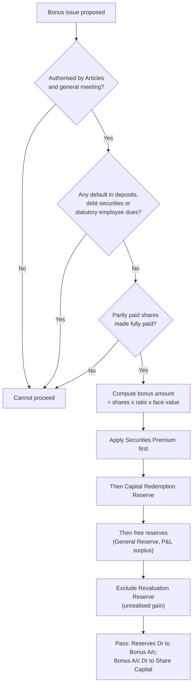

# Q&A — Bonus Issue

> Exam-oriented question bank for **CA Intermediate — Advanced Accounting**, chapter *Bonus Issue*. Every question is immediately followed by a complete model answer. All figures in **Rupees (Rs.)**, all provisions per **Companies Act, 2013 (Section 63)** and applicable SEBI (ICDR) Regulations as taught by ICAI.

---

## Section A — Concept-Check Questions (with Answers)

**A1. Define a bonus issue and state the statutory section that governs it.**
**Answer:** A bonus issue is the issue of additional fully paid-up shares to existing shareholders *free of cost*, in proportion to their existing holding, by capitalising the company's accumulated profits and reserves. It is governed by **Section 63 of the Companies Act, 2013** (read with Rule 14 of the Companies (Share Capital and Debentures) Rules, 2014). No fresh cash flows into the company; reserves are merely converted into share capital.

**A2. List the sources from which a bonus issue MAY be made.**
**Answer:** Per Section 63(1), a bonus issue may be made **only** out of:
(i) its **free reserves**;
(ii) the **securities premium account**; and
(iii) the **capital redemption reserve** account.

**A3. Name two reserves/accounts that CANNOT be used for a bonus issue.**
**Answer:** (i) **Revaluation reserve** (created by revaluation of assets — it is an unrealised gain), and (ii) reserves created out of **revaluation of assets** generally. Also, free reserves "capitalised" must not include reserves created by revaluation. (Securities premium and CRR *can* be used, so they are not the answer here.)

**A4. State the conditions of Section 63(2) that must be satisfied before a bonus issue.**
**Answer:** A company may capitalise its profits/reserves for a bonus issue only if:
(a) it is **authorised by its Articles of Association**;
(b) it has been **authorised in general meeting** on the Board's recommendation;
(c) it has **not defaulted** in payment of interest or principal on fixed deposits or debt securities;
(d) it has **not defaulted** in payment of statutory dues of employees (PF, gratuity, bonus);
(e) **partly paid-up shares, if any, are made fully paid-up** on the date of allotment; and
(f) it complies with such conditions as prescribed.

**A5. Can a bonus issue be made in lieu of dividend? Can partly paid shares be made fully paid by a bonus?**
**Answer:** **No** on both counts. Section 63(3) prohibits issuing bonus shares **in lieu of dividend**. Rule 14 further provides that bonus shares **shall not be issued to convert partly paid-up shares into fully paid-up** shares. A bonus can only be a fresh issue of *fully paid* shares; existing partly paid shares must first be made fully paid before the bonus.

**A6. Once recommended/announced, can a bonus issue be withdrawn?**
**Answer:** **No.** Once the Board recommends and it is approved/declared, the bonus issue **cannot be withdrawn** (Rule 14). This protects shareholder expectations.

**A7. What is the effect of a bonus issue on (a) total net worth, (b) EPS, (c) shareholder wealth?**
**Answer:** (a) **No change** in total net worth — reserves merely move to share capital. (b) **EPS falls** because the number of shares rises while profit is unchanged. (c) **No change** in a shareholder's total wealth — she holds more shares, but market price per share adjusts downward proportionately.

**A8. Distinguish a bonus issue from a share split.**
**Answer:** In a **bonus issue**, reserves are capitalised, share capital increases, and the face value per share is unchanged. In a **share split (sub-division)**, no reserves are capitalised; total share capital is unchanged; only the **face value per share is reduced** (e.g., Rs. 10 into two Rs. 5 shares).

---

## Section B — Graded Computational Problems (Easy → Exam-Hard)

### B1 (Easy) — Simple bonus out of general reserve

**Q:** A Ltd. has 1,00,000 equity shares of Rs. 10 each fully paid and a General Reserve of Rs. 8,00,000. It declares a bonus of **1 share for every 2 held**. Pass journal entries and show the balances after.

**Solution:**
Bonus shares = 1,00,000 × 1/2 = **50,000 shares** of Rs. 10 = **Rs. 5,00,000**.

| Particulars | Dr (Rs.) | Cr (Rs.) |
|---|---|---|
| General Reserve A/c ..... Dr | 5,00,000 | |
| &nbsp;&nbsp;To Bonus to Shareholders A/c | | 5,00,000 |
| *(Being profit capitalised for bonus)* | | |
| Bonus to Shareholders A/c ..... Dr | 5,00,000 | |
| &nbsp;&nbsp;To Equity Share Capital A/c | | 5,00,000 |
| *(Being bonus shares of Rs. 10 each issued)* | | |

**After:** Equity Share Capital = 10,00,000 + 5,00,000 = **Rs. 15,00,000**; General Reserve = 8,00,000 − 5,00,000 = **Rs. 3,00,000**. Net worth unchanged (23,00,000 → 23,00,000). ✔

---

### B2 (Easy–Moderate) — Choosing sources in priority order

**Q:** B Ltd. wishes to make a bonus issue of Rs. 6,00,000. Its reserves are: Securities Premium Rs. 1,50,000; Capital Redemption Reserve Rs. 2,00,000; General Reserve Rs. 5,00,000; Revaluation Reserve Rs. 3,00,000. Show how the bonus is funded and pass entries.

**Solution:**
Revaluation Reserve **cannot** be used. Usable = Securities Premium 1,50,000 + CRR 2,00,000 + General Reserve 5,00,000 = 8,50,000 (adequate). Best practice: exhaust **capital reserves usable only for bonus** (Securities Premium, CRR) first, then free reserves.

Funding: Securities Premium 1,50,000 + CRR 2,00,000 + General Reserve 2,50,000 = **Rs. 6,00,000**.

| Particulars | Dr (Rs.) | Cr (Rs.) |
|---|---|---|
| Securities Premium A/c ..... Dr | 1,50,000 | |
| Capital Redemption Reserve A/c ..... Dr | 2,00,000 | |
| General Reserve A/c ..... Dr | 2,50,000 | |
| &nbsp;&nbsp;To Bonus to Shareholders A/c | | 6,00,000 |
| Bonus to Shareholders A/c ..... Dr | 6,00,000 | |
| &nbsp;&nbsp;To Equity Share Capital A/c | | 6,00,000 |

Revaluation Reserve Rs. 3,00,000 remains untouched. ✔

---

### B3 (Moderate) — Making partly paid shares fully paid + bonus

**Q:** C Ltd. has 60,000 equity shares of Rs. 10 each, **Rs. 8 called and paid**. The company resolves to (i) declare a final call of Rs. 2 and make the shares fully paid by capitalising reserves (bonus), and (ii) issue fully paid bonus shares in the ratio 1:4. Reserves available: Securities Premium Rs. 90,000; General Reserve Rs. 4,00,000. Pass entries.

> **Trap check:** Section 63 says partly-paid shares must be made fully paid before bonus. But Rule 14 bars bonus shares being used to **convert partly paid into fully paid**. ICAI's classic problem *does* permit a company to declare a bonus to make existing partly-paid shares fully paid by using reserves — this is a *bonus in the form of making shares fully paid*, treated distinctly from the prohibition. **However, only free reserves and CRR may be used to make partly-paid shares fully paid — Securities Premium and CRR cannot be applied to pay up unpaid capital except that Securities Premium CANNOT be used to make partly paid shares fully paid.** Securities Premium's permitted uses (Sec 52) do **not** include paying up unpaid capital on existing shares; it can only be used to issue **fully paid bonus shares**.

**Solution:**

*Step 1 — Making existing shares fully paid (final call of Rs. 2 met out of General Reserve — Securities Premium NOT permitted here):*
Amount = 60,000 × Rs. 2 = **Rs. 1,20,000** from General Reserve.

| Particulars | Dr (Rs.) | Cr (Rs.) |
|---|---|---|
| Equity Share Final Call A/c ..... Dr | 1,20,000 | |
| &nbsp;&nbsp;To Equity Share Capital A/c | | 1,20,000 |
| General Reserve A/c ..... Dr | 1,20,000 | |
| &nbsp;&nbsp;To Bonus to Shareholders A/c | | 1,20,000 |
| Bonus to Shareholders A/c ..... Dr | 1,20,000 | |
| &nbsp;&nbsp;To Equity Share Final Call A/c | | 1,20,000 |

*Step 2 — Fully paid bonus 1:4:* shares = 60,000 × 1/4 = 15,000 × Rs. 10 = **Rs. 1,50,000**. Fund from Securities Premium 90,000 + General Reserve 60,000.

| Particulars | Dr (Rs.) | Cr (Rs.) |
|---|---|---|
| Securities Premium A/c ..... Dr | 90,000 | |
| General Reserve A/c ..... Dr | 60,000 | |
| &nbsp;&nbsp;To Bonus to Shareholders A/c | | 1,50,000 |
| Bonus to Shareholders A/c ..... Dr | 1,50,000 | |
| &nbsp;&nbsp;To Equity Share Capital A/c | | 1,50,000 |

**Check:** General Reserve used = 1,20,000 + 60,000 = 1,80,000; balance = 4,00,000 − 1,80,000 = **Rs. 2,20,000**. Securities Premium fully used. Capital = 4,80,000 + 1,20,000 + 1,50,000 = **Rs. 7,50,000** (= 75,000 shares × Rs. 10 fully paid). ✔

---

### B4 (Exam-Hard) — Comprehensive with Balance Sheet extract

**Q:** The following are the balances of D Ltd. as on 31.03.2026:

| Liabilities | Rs. |
|---|---|
| Equity share capital (Rs. 10 each, fully paid) | 20,00,000 |
| Securities Premium | 3,00,000 |
| Capital Redemption Reserve | 1,00,000 |
| General Reserve | 6,50,000 |
| Surplus (P&L) | 4,00,000 |
| Revaluation Reserve | 2,50,000 |

The Board resolves to capitalise reserves by issuing bonus shares in the ratio **2 shares for every 5 held**, using minimum free reserves (i.e., exhaust Securities Premium and CRR first). Pass journal entries and prepare the reserves portion of the Balance Sheet after the bonus.

**Solution:**
Existing shares = 20,00,000 / 10 = 2,00,000. Bonus = 2,00,000 × 2/5 = **80,000 shares** × Rs. 10 = **Rs. 8,00,000**.

Funding (exhaust capital-nature reserves first): Securities Premium 3,00,000 + CRR 1,00,000 = 4,00,000; balance 4,00,000 from General Reserve.

| Particulars | Dr (Rs.) | Cr (Rs.) |
|---|---|---|
| Securities Premium A/c ..... Dr | 3,00,000 | |
| Capital Redemption Reserve A/c ..... Dr | 1,00,000 | |
| General Reserve A/c ..... Dr | 4,00,000 | |
| &nbsp;&nbsp;To Bonus to Shareholders A/c | | 8,00,000 |
| *(Capitalisation of reserves)* | | |
| Bonus to Shareholders A/c ..... Dr | 8,00,000 | |
| &nbsp;&nbsp;To Equity Share Capital A/c | | 8,00,000 |
| *(Issue of 80,000 bonus shares of Rs. 10 each)* | | |

**Balance Sheet extract after bonus:**

| Particulars | Rs. |
|---|---|
| Equity Share Capital (2,80,000 × Rs. 10) | 28,00,000 |
| Securities Premium | Nil |
| Capital Redemption Reserve | Nil |
| General Reserve (6,50,000 − 4,00,000) | 2,50,000 |
| Surplus (P&L) | 4,00,000 |
| Revaluation Reserve (untouched) | 2,50,000 |

**Verify:** Total before = 20,00,000+3,00,000+1,00,000+6,50,000+4,00,000+2,50,000 = **37,00,000**. After = 28,00,000+0+0+2,50,000+4,00,000+2,50,000 = **37,00,000**. Net worth unchanged. ✔

---

## Section C — Past-Paper-Style Full Questions (with Model Answers)

### C1
**Q:** E Ltd. furnishes the following on 31.03.2026: 5,00,000 equity shares of Rs. 10 each fully paid; Securities Premium Rs. 6,00,000; General Reserve Rs. 30,00,000; Profit & Loss (surplus) Rs. 12,00,000; Revaluation Reserve Rs. 8,00,000; 10% Preference share capital Rs. 20,00,000. The company decides to issue bonus shares at **1:5** and to write down nothing else. Advise on legality, pass journal entries, and compute pre- and post-bonus EPS if profit after preference dividend is Rs. 25,00,000.

**Model Answer:**
*Legality:* Bonus of Rs. 10,00,000 (below) can be funded from Securities Premium + free reserves. Revaluation Reserve of Rs. 8,00,000 is **excluded**. Assuming Articles authorise it and no default in deposits/debt/statutory dues exists, the issue is valid under Section 63.

Bonus shares = 5,00,000 × 1/5 = **1,00,000 shares** × Rs. 10 = **Rs. 10,00,000**.
Funding: Securities Premium 6,00,000 + General Reserve 4,00,000.

| Particulars | Dr (Rs.) | Cr (Rs.) |
|---|---|---|
| Securities Premium A/c ..... Dr | 6,00,000 | |
| General Reserve A/c ..... Dr | 4,00,000 | |
| &nbsp;&nbsp;To Bonus to Shareholders A/c | | 10,00,000 |
| Bonus to Shareholders A/c ..... Dr | 10,00,000 | |
| &nbsp;&nbsp;To Equity Share Capital A/c | | 10,00,000 |

*EPS:*
- Pre-bonus EPS = 25,00,000 / 5,00,000 = **Rs. 5.00**
- Post-bonus EPS = 25,00,000 / 6,00,000 = **Rs. 4.17**

Since a bonus issue has no cash inflow, AS 20 requires the increased shares to be treated as if outstanding from the **beginning of the earliest period reported** — hence the comparative prior-year EPS is also restated on 6,00,000 shares.

---

### C2
**Q:** State whether each is TRUE or FALSE with reason:
(a) Bonus shares can be issued out of revaluation reserve.
(b) Securities premium can be used to make partly paid shares fully paid.
(c) A company that has defaulted on interest to fixed depositors can still declare a bonus.
(d) After a bonus, a shareholder's proportionate ownership changes.

**Model Answer:**
(a) **False** — revaluation reserve is an unrealised gain; Section 63 excludes it.
(b) **False** — Sec 52 permits securities premium only for issuing **fully paid** bonus shares, not to pay up unpaid calls on existing shares.
(c) **False** — Section 63(2)(c) bars a bonus if the company has defaulted in payment of interest/principal on fixed deposits or debt securities.
(d) **False** — bonus is pro-rata; every shareholder's **proportionate holding is unchanged**.

---

## Section D — MCQs and Case Scenarios

**D1.** Bonus issue is governed by which section of the Companies Act, 2013?
(a) Sec 52 (b) Sec 62 (c) **Sec 63** (d) Sec 68
**Answer: (c)** — Section 63 deals specifically with capitalisation of profits for bonus shares.

**D2.** Which cannot fund a bonus issue?
(a) Securities Premium (b) Capital Redemption Reserve (c) General Reserve (d) **Revaluation Reserve**
**Answer: (d)** — revaluation reserve is unrealised and expressly excluded.

**D3.** A bonus issue results in:
(a) increase in net worth (b) **no change in net worth** (c) cash inflow (d) reduction in face value
**Answer: (b)** — reserves are only reclassified into share capital.

**D4.** Bonus shares in lieu of dividend are:
(a) allowed (b) **prohibited** (c) allowed if Articles permit (d) allowed for listed companies
**Answer: (b)** — Section 63(3) expressly prohibits it.

**D5.** Before a bonus, partly paid shares must be:
(a) forfeited (b) **made fully paid** (c) cancelled (d) split
**Answer: (b)** — Section 63(2)(e) requires them to be fully paid on allotment date.

**D6 (Case).** F Ltd. has 4,00,000 shares of Rs. 10 fully paid, General Reserve Rs. 15,00,000, Securities Premium Rs. 5,00,000. It declares 1:2 bonus. Total bonus amount is:
(a) Rs. 10,00,000 (b) **Rs. 20,00,000** (c) Rs. 40,00,000 (d) Rs. 5,00,000
**Answer: (b)** — 4,00,000 × 1/2 × Rs. 10 = Rs. 20,00,000 (funded 5,00,000 SP + 15,00,000 GR).

**D7 (Case).** Once the Board recommends a bonus and members approve it, the company:
(a) may withdraw it (b) **cannot withdraw it** (c) may reduce the ratio (d) may convert it to dividend
**Answer: (b)** — Rule 14 bars withdrawal once declared.

**D8.** Effect of bonus issue on Earnings Per Share:
(a) increases (b) **decreases** (c) unchanged (d) becomes nil
**Answer: (b)** — more shares divide the same earnings; AS 20 restates prior EPS too.

---

## Solution-Path Diagram — Selecting Sources for a Bonus Issue

---

## Quick Self-Verification Checklist
- Net worth **before = after** every bonus (only reclassification). ✔
- Revaluation reserve **never** used. ✔
- Securities premium / CRR used **only** for issuing fully paid bonus shares, not to pay unpaid calls. ✔
- Bonus **cannot** be in lieu of dividend and **cannot** be withdrawn once declared. ✔
- Two-entry method: (1) Reserves Dr → Bonus to Shareholders A/c; (2) Bonus to Shareholders A/c Dr → Equity Share Capital A/c. ✔
