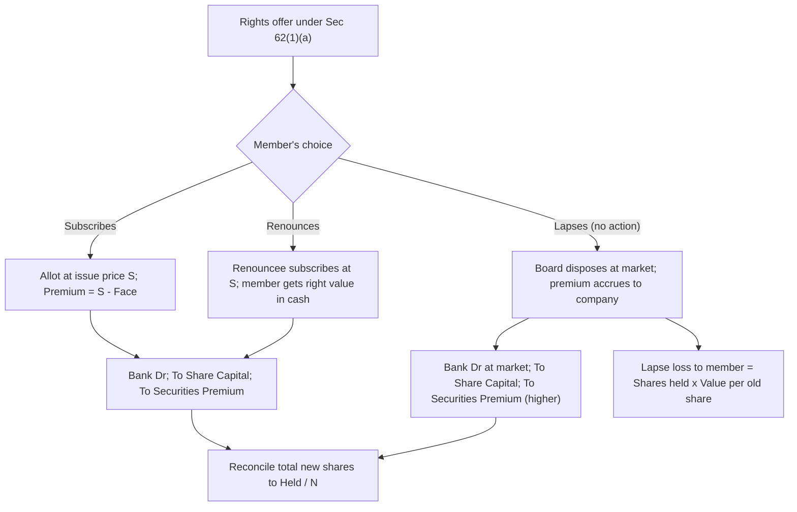

# Q&A — Rights Issue

CA Intermediate — Advanced Accounting. All amounts in Rupees (₹). Provisions per the Companies Act, 2013 (Section 62), the Companies Act 1956 legacy where noted, SEBI (ICDR) Regulations 2018 and ICAI Study Material. No invented provisions.

---

## Section A — Concept Check (with answers)

**A1. What is a rights issue?**
It is a further issue of shares by a company to its **existing equity shareholders** in proportion to their current holding, offered as a *right* (a pre-emption) under **Section 62(1)(a)** of the Companies Act, 2013. Each shareholder may accept, renounce, or let the offer lapse.

**A2. State the core conditions of Section 62(1)(a).**
(i) Offer made to existing equity shareholders **in proportion** to paid-up capital; (ii) by **notice** specifying the number of shares offered and a period to accept — **not less than 15 days and not more than 30 days**; (iii) the offer includes, unless the articles say otherwise, a **right of renunciation** in favour of any other person; (iv) if not accepted within the period it is **deemed declined**, and the Board may **dispose of** the unaccepted shares in a manner **not disadvantageous** to the shareholders and the company.

**A3. Distinguish 62(1)(a), 62(1)(b) and 62(1)(c).**
**(a)** Rights issue to existing equity shareholders (Board resolution). **(b)** ESOP — issue to employees under a scheme (**special resolution**). **(c)** Preferential/private allotment to any persons (**special resolution**, price supported by a **registered valuer**). A rights issue therefore needs no special resolution because it is inherently non-dilutive of proportionate holdings.

**A4. Why does a rights issue not require a special resolution while a preferential issue does?**
Because a rights issue preserves each member's proportionate stake and voting power (pro-rata neutrality). A preferential issue can dilute existing holders and shift control, so the law demands the higher safeguard of a special resolution and an independent valuation.

**A5. What is renounceability and why does it matter?**
Renounceability is the shareholder's freedom to **sell/transfer the right** to a third party instead of subscribing. It ensures the value embedded in the right (the discount to market) is **not forfeited** even if the holder lacks funds — the right can be monetised. If the holder neither subscribes nor renounces, the right **lapses** and that value is lost to the holder.

**A6. Define the Theoretical Ex-Rights Price (TERP).**
TERP is the expected market price of one share **after** the rights shares are issued, blending the pre-issue (cum-rights) value with the cash brought in by the rights subscription. For N old shares needed per 1 new share at subscription price S when the cum-rights price is M:
**TERP = (N × M + 1 × S) / (N + 1).**

**A7. Give the value-of-right formulas.**
Value of right **per new share** = TERP − S.
Value of right **per share already held** = (TERP − S) / N = **(M − S) / (N + 1)**.
(The per-*old*-share figure is what a renouncer receives per existing share; the per-*new*-share figure is the premium a buyer pays for one nil-paid right.)

**A8. Where does the excess of subscription price over face value go, and under which section?**
To the **Securities Premium Account** under **Section 52**. It is a capital reserve usable only for the restricted purposes in Sec 52(2) — issuing bonus shares, writing off preliminary expenses/issue expenses, premium on redemption of preference shares/debentures, and buy-back.

---

## Section B — Graded Computational Problems (full solutions)

### B1 (Easy) — Rights at par, journal entries

Deft Ltd has 4,00,000 equity shares of ₹10 each. It makes a rights issue of **1 new share for every 4 held at par (₹10)**, fully called and paid. Record the issue.

**Solution.** New shares = 4,00,000 ÷ 4 = **1,00,000**. Cash = 1,00,000 × ₹10 = **₹10,00,000**. No premium (issued at par).

| Particulars | Dr (₹) | Cr (₹) |
|---|---|---|
| Bank A/c ..... Dr | 10,00,000 | |
| &nbsp;&nbsp;To Equity Share Capital A/c | | 10,00,000 |

**Check:** Paid-up capital rises 1,00,000 × ₹10 = ₹10,00,000; cash rises by the same. ✔

---

### B2 (Moderate) — TERP, value of right, and entry at a premium

Vega Ltd has 2,00,000 equity shares of ₹10 each, currently quoted **cum-rights at ₹60**. It offers **1 right share for every 2 held at ₹30** (face ₹10 + premium ₹20). Compute TERP, the value of the right, and pass the entry.

**Solution.** N = 2, M = ₹60, S = ₹30.
TERP = (2 × 60 + 30) / (2 + 1) = 150 / 3 = **₹50**.
Value of right per new share = 50 − 30 = **₹20**.
Value of right per share held = (60 − 30)/(2 + 1) = 30/3 = **₹10**.
New shares = 2,00,000 ÷ 2 = 1,00,000. Cash = 1,00,000 × ₹30 = ₹30,00,000 → Capital ₹10,00,000, Premium ₹20,00,000.

| Particulars | Dr (₹) | Cr (₹) |
|---|---|---|
| Bank A/c ..... Dr | 30,00,000 | |
| &nbsp;&nbsp;To Equity Share Capital A/c | | 10,00,000 |
| &nbsp;&nbsp;To Securities Premium A/c | | 20,00,000 |

**Check:** A holder of 2 shares (value 2 × 60 = ₹120) buys 1 right for ₹30 → 3 shares worth 3 × 50 = ₹150; outflow ₹30; net wealth 150 − 30 = ₹120. **Wealth-neutral.** ✔

---

### B3 (Moderate) — Renunciation gain

Ravi holds 1,000 shares of Vega Ltd (data of B2). Instead of subscribing, he **sells his rights** in the market at the fair value. What does he receive, and prove he is no worse off than a subscriber?

**Solution.** Entitlement = 1,000 ÷ 2 = 500 right shares. Value of a nil-paid right per new share = ₹20 (from B2). Sale proceeds = 500 × ₹20 = **₹10,000**. Equivalently, value per old share ₹10 × 1,000 = ₹10,000. ✔

*Neutrality proof:* Cum value of 1,000 shares = 1,000 × 60 = ₹60,000. After issue his 1,000 shares are worth 1,000 × TERP = 1,000 × 50 = ₹50,000, **plus** ₹10,000 cash from selling rights = ₹60,000. He ends exactly where a subscriber does. ✔

---

### B4 (Exam-hard) — Weighted case: subscribed + renounced + lapsed and disposed by Board

Zenith Ltd has **6,00,000 equity shares of ₹10 each**, quoted **cum-rights at ₹27**. It offers **1 right share for every 3 held at ₹15** (face ₹10 + premium ₹5). Outcomes:
- Holders of **4,50,000** shares subscribe in full.
- Holders of **90,000** shares **renounce** their rights to third parties who subscribe at ₹15.
- Holders of **60,000** shares let the offer **lapse**; the Board disposes of these shares in the market at **₹24**.

Compute TERP and value of right, quantify the loss to the lapsing group, and pass journal entries.

**Solution.**
N = 3, M = ₹27, S = ₹15.
TERP = (3 × 27 + 15)/(3 + 1) = (81 + 15)/4 = 96/4 = **₹24**.
Value of right per new share = 24 − 15 = ₹9; per share held = (27 − 15)/4 = **₹3**.

**Share allotment reconciliation** (rights ratio 1:3):

| Group | Shares held | New shares (÷3) | Price/share (₹) | Cash (₹) |
|---|---|---|---|---|
| Subscribers | 4,50,000 | 1,50,000 | 15 | 22,50,000 |
| Renounced (subscribed by renouncees) | 90,000 | 30,000 | 15 | 4,50,000 |
| Lapsed → Board-disposed | 60,000 | 20,000 | 24 | 4,80,000 |
| **Total** | **6,00,000** | **2,00,000** | — | **31,80,000** |

Capital raised = 2,00,000 × ₹10 = ₹20,00,000. Premium = (1,80,000 × ₹5) + (20,000 × ₹14) = 9,00,000 + 2,80,000 = **₹11,80,000**. Total cash 20,00,000 + 11,80,000 = **₹31,80,000**. ✔

**Journal entries.**

| Particulars | Dr (₹) | Cr (₹) |
|---|---|---|
| Bank A/c (1,80,000 × ₹15) ..... Dr | 27,00,000 | |
| &nbsp;&nbsp;To Equity Share Capital A/c (1,80,000 × ₹10) | | 18,00,000 |
| &nbsp;&nbsp;To Securities Premium A/c (1,80,000 × ₹5) | | 9,00,000 |
| *(Rights shares subscribed by members and renouncees at ₹15)* | | |
| Bank A/c (20,000 × ₹24) ..... Dr | 4,80,000 | |
| &nbsp;&nbsp;To Equity Share Capital A/c (20,000 × ₹10) | | 2,00,000 |
| &nbsp;&nbsp;To Securities Premium A/c (20,000 × ₹14) | | 2,80,000 |
| *(Lapsed rights disposed by Board at market ₹24)* | | |

**Loss to lapsing group** = shares held × value per old share = 60,000 × ₹3 = **₹1,80,000**. This value is neither realised by them (they did not sell the right) nor returned (the premium on disposal accrues to the **company**, not to the lapsing members). This is the classic **lapse loss / discount leakage**. ✔

---

### B5 (Exam-hard) — Bonus + Rights combined, and combined ex-price

Nova Ltd has **5,00,000 equity shares of ₹10 each**, quoted **cum-rights at ₹50**. It simultaneously makes a **bonus issue of 1 for 5** (out of General Reserve) and a **rights issue of 1 for 5 at ₹20** (face ₹10 + premium ₹10). Compute the combined ex-price and pass entries.

**Solution.**
Bonus shares = 5,00,000 ÷ 5 = 1,00,000 (free). Rights shares = 5,00,000 ÷ 5 = 1,00,000 at ₹20.
Total value pool = (5,00,000 × 50) + (1,00,000 × 20) = 2,50,00,000 + 20,00,000 = ₹2,70,00,000.
Total shares after = 5,00,000 + 1,00,000 + 1,00,000 = 7,00,000.
**Combined ex-price = 2,70,00,000 ÷ 7,00,000 = ₹38.57 (approx).**

*Neutrality:* a holder of 5 shares (₹250) receives 1 bonus + 1 rights (pays ₹20) → 7 shares × ₹38.57 = ₹270; net of ₹20 cash = ₹250. Wealth unchanged. ✔

**Journal entries.**

| Particulars | Dr (₹) | Cr (₹) |
|---|---|---|
| General Reserve A/c ..... Dr | 10,00,000 | |
| &nbsp;&nbsp;To Bonus to Shareholders A/c | | 10,00,000 |
| Bonus to Shareholders A/c ..... Dr | 10,00,000 | |
| &nbsp;&nbsp;To Equity Share Capital A/c (1,00,000 × ₹10) | | 10,00,000 |
| *(Bonus 1:5 capitalised)* | | |
| Bank A/c (1,00,000 × ₹20) ..... Dr | 20,00,000 | |
| &nbsp;&nbsp;To Equity Share Capital A/c (1,00,000 × ₹10) | | 10,00,000 |
| &nbsp;&nbsp;To Securities Premium A/c (1,00,000 × ₹10) | | 10,00,000 |
| *(Rights 1:5 at ₹20)* | | |

**Check:** Capital rises ₹20,00,000 (bonus ₹10,00,000 + rights ₹10,00,000); General Reserve falls ₹10,00,000; Securities Premium rises ₹10,00,000; Bank rises ₹20,00,000. ✔

---

## Section C — Past-paper-style Full Questions (model answers)

### C1. TERP, value of right, and accounting

*Question.* Sun Ltd has 3,00,000 equity shares of ₹10 each. The shares are quoted cum-rights at ₹40. The company offers **1 right share for every 3 held at ₹25** (₹10 + ₹15 premium), all subscribed. (a) Compute the value of a right and TERP. (b) Show that an existing member is wealth-neutral. (c) Pass the journal entry.

**Model answer.**
(a) N = 3, M = 40, S = 25. TERP = (3 × 40 + 25)/4 = 145/4 = **₹36.25**. Value of right per new share = 36.25 − 25 = **₹11.25**; per old share = (40 − 25)/4 = **₹3.75**.
(b) A holder of 3 shares: cum value 3 × 40 = ₹120. After: buys 1 right at ₹25 → 4 shares × 36.25 = ₹145; net of ₹25 outflow = ₹120. **Neutral.** ✔
(c) New shares = 1,00,000; cash = ₹25,00,000 → Capital ₹10,00,000, Premium ₹15,00,000.

| Particulars | Dr (₹) | Cr (₹) |
|---|---|---|
| Bank A/c ..... Dr | 25,00,000 | |
| &nbsp;&nbsp;To Equity Share Capital A/c | | 10,00,000 |
| &nbsp;&nbsp;To Securities Premium A/c | | 15,00,000 |

### C2. Renunciation, lapse and Board disposal

*Question.* Orbit Ltd (2,40,000 equity shares of ₹10, cum-rights ₹22) offers **1 for 4 at ₹13**. Holders of 1,60,000 shares subscribe; holders of 40,000 shares renounce (renouncees subscribe at ₹13); the balance lapses and the Board sells those shares at ₹18. (a) Value the right. (b) Reconcile the allotment. (c) Journalise. (d) State the loss to the lapsing members.

**Model answer.**
(a) N = 4, M = 22, S = 13. TERP = (4 × 22 + 13)/5 = 101/5 = **₹20.20**. Right per new share = 20.20 − 13 = ₹7.20; per old share = (22 − 13)/5 = **₹1.80**.
(b) Total right shares = 2,40,000 ÷ 4 = 60,000. Subscribers 1,60,000/4 = 40,000; renounced 40,000/4 = 10,000; lapsed = 40,000/4 = 10,000. Total 60,000. ✔

| Particulars | Dr (₹) | Cr (₹) |
|---|---|---|
| Bank A/c (50,000 × ₹13) ..... Dr | 6,50,000 | |
| &nbsp;&nbsp;To Equity Share Capital A/c (50,000 × ₹10) | | 5,00,000 |
| &nbsp;&nbsp;To Securities Premium A/c (50,000 × ₹3) | | 1,50,000 |
| Bank A/c (10,000 × ₹18) ..... Dr | 1,80,000 | |
| &nbsp;&nbsp;To Equity Share Capital A/c (10,000 × ₹10) | | 1,00,000 |
| &nbsp;&nbsp;To Securities Premium A/c (10,000 × ₹8) | | 80,000 |

**Check:** Capital 60,000 × ₹10 = ₹6,00,000; Premium 1,50,000 + 80,000 = ₹2,30,000; Bank 6,50,000 + 1,80,000 = ₹8,30,000 = 6,00,000 + 2,30,000. ✔
(d) Loss to lapsing members = 40,000 held × ₹1.80 = **₹72,000** (value forgone; the disposal premium accrues to the company).

---

**Solution-path map (weighted rights case).**

---

## Section D — MCQs & Case Scenarios

**D1.** A rights issue is governed by:
A) Sec 62(1)(b)  B) **Sec 62(1)(a)**  C) Sec 62(1)(c)  D) Sec 52.
**Answer: B.** Sec 62(1)(a) covers further issue to existing equity shareholders pro-rata.

**D2.** The rights offer must remain open for:
A) 7–15 days  B) **15–30 days**  C) 21–45 days  D) at least 60 days.
**Answer: B.** Not less than 15 nor more than 30 days under Sec 62(1)(a)(i).

**D3.** Cum-rights price ₹48, subscription ₹18, ratio 1 for 2. TERP is:
A) ₹33  B) **₹38**  C) ₹28  D) ₹36.
**Answer: B.** (2 × 48 + 18)/3 = 114/3 = ₹38.

**D4.** Using D3, value of a right per share **already held** is:
A) ₹20  B) ₹15  C) **₹10**  D) ₹5.
**Answer: C.** (48 − 18)/(2 + 1) = 30/3 = ₹10 (per new share it is ₹20).

**D5.** Excess of rights subscription price over face value is credited to:
A) General Reserve  B) Capital Reserve  C) **Securities Premium A/c**  D) Capital Redemption Reserve.
**Answer: C.** Premium on share issue → Securities Premium (Sec 52).

**D6.** A shareholder who neither subscribes nor renounces:
A) is refunded the right value  B) **loses the value of the right**  C) is allotted anyway  D) must pay a penalty.
**Answer: B.** The right lapses; the embedded value is lost to the member.

**D7.** In the cash flow statement (AS 3), cash from a rights issue is shown under:
A) Operating  B) Investing  C) **Financing**  D) not disclosed.
**Answer: C.** Proceeds from issue of share capital are financing activities.

**D8. Case.** Peak Ltd offers 1 right for every 4 held at ₹20 (cum-rights ₹35). A member holding 4,000 shares is short of funds. Which action leaves her wealth unchanged and why?
A) Let it lapse  B) **Renounce (sell) the rights**  C) Sue the Board  D) Demand a bonus.
**Answer: B.** Renouncing monetises the right (value per old share = (35 − 20)/5 = ₹3; on 4,000 shares = ₹12,000), replacing the discount she cannot capture by subscribing; lapsing would forfeit it.

---

### Quick sanity table

| Item | Formula | B4 value |
|---|---|---|
| TERP | (N·M + S)/(N+1) | ₹24 |
| Right / new share | TERP − S | ₹9 |
| Right / old share | (M − S)/(N+1) | ₹3 |
| Premium credited | (S − Face) per subscribed share | ₹5 |
| Lapse loss | Held × right/old share | ₹1,80,000 |
