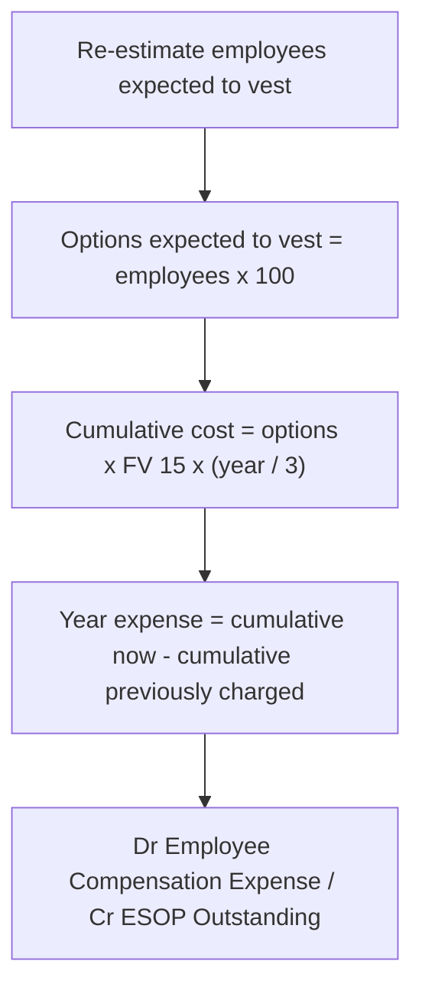

# Q&A — Employee Stock Option Plans (ESOP)

CA Intermediate — Advanced Accounting. All amounts in Rupees (₹). Treatment per the **ICAI Guidance Note on Accounting for Employee Share-based Payments** and the ICAI Study Material. No invented provisions.

---

## Section A — Concept Check (with answers)

**A1. What is an Employee Stock Option (ESOP)?**
It is a right (option), but not an obligation, granted to employees/directors to buy the company's shares at a pre-determined **exercise price** within a specified period, in consideration for services rendered. Economically it is a "signing bonus paid in IOUs on the company's own shares" — the employee is rewarded if the share price rises above the exercise price.

**A2. Define the key vocabulary: grant date, vesting date, vesting period, exercise period, exercise price.**
*Grant date* — date the enterprise and employee agree the terms. *Vesting date* — date the option becomes exercisable (service/performance conditions met). *Vesting period* — period between grant date and vesting date over which conditions are satisfied. *Exercise period* — time window after vesting within which the vested option may be exercised. *Exercise price* — price the employee pays per share on exercise.

**A3. Distinguish fair value from intrinsic value of an option.**
*Intrinsic value* = Market price of share − Exercise price (measured at a given date; floored at nil). *Fair value* = the amount for which the option could be exchanged, estimated using an **option-pricing model** (e.g., Black-Scholes). Fair value always ≥ intrinsic value because it also captures time value and volatility.

**A4. State the measurement and spreading rule for compensation cost.**
Total compensation cost = **fair value (or intrinsic value) per option × number of options expected to vest**. This cost is recognised as an expense on a **straight-line basis over the vesting period**, with the number expected to vest re-estimated each year (cumulative catch-up).

**A5. Which account is credited against the compensation expense, and where is it shown?**
The credit is to **Employee Stock Options Outstanding Account (ESOP Outstanding A/c)**. It is presented under **"Reserves and Surplus"** (Shareholders' Funds) as a separate line in the Balance Sheet under Schedule III.

**A6. How is the ESOP Outstanding balance settled?**
On **exercise**, its balance (attributable to exercised options) is transferred to Equity Share Capital and Securities Premium. On **lapse after vesting**, its balance is transferred to **General Reserve** (a movement within equity — never routed back through the Statement of Profit & Loss).

**A7. If options lapse/are forfeited during the vesting period, what happens to the cost already charged?**
The estimate of options expected to vest is revised downward; the **cumulative** expense is re-worked and the previously recognised excess is reversed (a credit to the current year's expense). No expense finally survives for options that never vest due to failure of a service condition.

**A8. Which method does the ICAI Guidance Note prefer, and what if intrinsic value is used?**
The **fair value method** is preferred. If the **intrinsic value method** is used, the enterprise must additionally **disclose the impact on net profit and EPS** as if the fair value method had been applied (a *proforma* disclosure).

---

## Section B — Graded Computational Problems (full solutions)

### B1 (Easy) — Total cost and annual charge
A company grants 3,000 options, fair value ₹10 each, vesting period 3 years; all expected to vest.
**Solution.** Total compensation = 3,000 × ₹10 = **₹30,000**. Annual expense (straight-line) = 30,000 ÷ 3 = **₹10,000** in each of Years 1, 2 and 3.
**Check:** 10,000 × 3 = 30,000 ✔

---

### B2 (Baseline) — Full lifecycle, all vest and exercised
On 1-4-20X1 a company grants 10,000 options; exercise price ₹40; face value ₹10; fair value per option ₹15; vesting period 3 years. All vest and are exercised.
**Solution.** Total cost = 10,000 × 15 = ₹1,50,000 → annual expense ₹50,000.

Each year (20X1-X2, X2-X3, X3-X4):

| Particulars | Dr (₹) | Cr (₹) |
|---|---|---|
| Employee Compensation Expense A/c ..... Dr | 50,000 | |
| &nbsp;&nbsp;To ESOP Outstanding A/c | | 50,000 |
| Profit & Loss A/c ..... Dr | 50,000 | |
| &nbsp;&nbsp;To Employee Compensation Expense A/c | | 50,000 |

On exercise of all 10,000 options:
- Bank = 10,000 × 40 = ₹4,00,000; ESOP Outstanding = ₹1,50,000; total = ₹5,50,000.
- Equity Share Capital = 10,000 × 10 = ₹1,00,000; Securities Premium = 5,50,000 − 1,00,000 = ₹4,50,000.

| Particulars | Dr (₹) | Cr (₹) |
|---|---|---|
| Bank A/c ..... Dr | 4,00,000 | |
| ESOP Outstanding A/c ..... Dr | 1,50,000 | |
| &nbsp;&nbsp;To Equity Share Capital A/c | | 1,00,000 |
| &nbsp;&nbsp;To Securities Premium A/c | | 4,50,000 |

**Check:** Premium per share = (40 + 15) − 10 = ₹45; × 10,000 = ₹4,50,000 ✔. ESOP Outstanding fully cleared ✔.

---

### B3 (Exam-hard) — Forfeitures with cumulative catch-up
On 1-4-20X1 a company grants **100 options each to 500 employees** at exercise price ₹20; fair value per option ₹15; vesting period 3 years, conditional on continued employment. Estimates:
- Year 1: 20 employees leave; a further 30 expected to leave over Years 2–3.
- Year 2: 22 leave (cumulative 42); a further 15 expected to leave in Year 3.
- Year 3: 10 leave (cumulative 52).

**Solution — the cumulative method.** Each year, compute *cumulative* cost = (options expected to vest) × ₹15 × (elapsed years ÷ 3); the year's expense is cumulative-to-date minus cumulative-recognised-so-far.

| Year | Employees expected to vest | Options | Cumulative cost (₹) | Prior cumulative (₹) | Expense (₹) |
|---|---|---|---|---|---|
| 1 | 500 − 20 − 30 = 450 | 45,000 | 45,000×15×1/3 = 2,25,000 | 0 | **2,25,000** |
| 2 | 500 − 42 − 15 = 443 | 44,300 | 44,300×15×2/3 = 4,43,000 | 2,25,000 | **2,18,000** |
| 3 | 500 − 52 = 448 (actual) | 44,800 | 44,800×15×3/3 = 6,72,000 | 4,43,000 | **2,29,000** |

Entry each year: *Employee Compensation Expense A/c Dr* … *To ESOP Outstanding A/c* (with the year's expense), then transferred to P&L.

**Check:** Total expense = 2,25,000 + 2,18,000 + 2,29,000 = **₹6,72,000** = 44,800 options × ₹15 ✔. Note Year 2's rising estimate is absorbed smoothly — no restatement of prior years.

---

### B4 (Graded vesting) — Tranches vesting at different dates
On 1-4-20X1 a company grants 12,000 options, fair value ₹18 each: 4,000 vest at end of Year 1, 4,000 at end of Year 2, 4,000 at end of Year 3. All expected to vest.
**Solution.** Treat each tranche separately; spread its cost over its own vesting period.

| Tranche | Options | Total cost (₹) | Yr 1 | Yr 2 | Yr 3 |
|---|---|---|---|---|---|
| Vests Yr 1 | 4,000 | 72,000 | 72,000 | — | — |
| Vests Yr 2 | 4,000 | 72,000 | 36,000 | 36,000 | — |
| Vests Yr 3 | 4,000 | 72,000 | 24,000 | 24,000 | 24,000 |
| **Annual expense** | | | **1,32,000** | **60,000** | **24,000** |

**Check:** 1,32,000 + 60,000 + 24,000 = **₹2,16,000** = 12,000 × ₹18 ✔. Front-loading of expense is the hallmark of graded vesting.

---

### B5 (Intrinsic value contrast) — same plan, two methods
On 1-4-20X1: 5,000 options; exercise price ₹50; market price at grant ₹60; fair value per option ₹22; vesting period 2 years.
**Solution.**
- **Intrinsic value** per option = 60 − 50 = ₹10 → total cost = 5,000 × 10 = ₹50,000 → **₹25,000/year**.
- **Fair value** per option = ₹22 → total cost = 5,000 × 22 = ₹1,10,000 → **₹55,000/year**.

If the intrinsic value method is used, net profit is higher by ₹30,000 per year than under fair value; therefore the company must **disclose proforma net profit and EPS** computed under fair value (₹1,10,000 total). Same journal mechanics, only the per-option amount differs.
**Check:** Intrinsic 25,000×2 = 50,000; Fair 55,000×2 = 1,10,000 ✔.

---

### B6 (Exam-hard) — Lapse after vesting + partial exercise
On 1-4-20X1: 8,000 options; exercise price ₹100; face value ₹10; fair value ₹25; vesting period 2 years. All 8,000 vest; in the exercise window 7,000 are exercised and 1,000 lapse.
**Solution.** Annual expense = 8,000 × 25 ÷ 2 = ₹1,00,000 (Years 1 and 2). ESOP Outstanding after vesting = ₹2,00,000.

Exercise of 7,000: Bank = 7,000 × 100 = ₹7,00,000; ESOP portion = 7,000 × 25 = ₹1,75,000; Capital = 7,000 × 10 = ₹70,000; Premium = 8,75,000 − 70,000 = ₹8,05,000.

| Particulars | Dr (₹) | Cr (₹) |
|---|---|---|
| Bank A/c ..... Dr | 7,00,000 | |
| ESOP Outstanding A/c ..... Dr | 1,75,000 | |
| &nbsp;&nbsp;To Equity Share Capital A/c | | 70,000 |
| &nbsp;&nbsp;To Securities Premium A/c | | 8,05,000 |

Lapse of 1,000 (after vesting):

| Particulars | Dr (₹) | Cr (₹) |
|---|---|---|
| ESOP Outstanding A/c ..... Dr | 25,000 | |
| &nbsp;&nbsp;To General Reserve A/c | | 25,000 |

**Check:** ESOP Outstanding cleared: 1,75,000 + 25,000 = 2,00,000 ✔. Note: lapse **after** vesting does **not** reverse the earlier expense (services were received) — the balance simply moves to General Reserve within equity.

---

## Section C — Past-paper-style full questions (model answers)

### C1 — Comprehensive lifecycle with forfeiture
*On 1 April 20X1, Zenith Ltd granted 500 options each to 40 employees at an exercise price of ₹120 when the face value was ₹10 and fair value per option was ₹30. Vesting period 2 years. Year 1: 4 employees left; 6 more expected to leave in Year 2. Year 2: 5 actually left. All vested options exercised. Pass entries and show workings.*

**Model answer.**
*Year 1:* expected to vest = (40 − 4 − 6) = 30 employees × 500 = 15,000 options. Cumulative cost = 15,000 × 30 × 1/2 = ₹2,25,000 → **Year 1 expense ₹2,25,000**.
*Year 2:* actual vested = (40 − 4 − 5) = 31 employees × 500 = 15,500 options. Cumulative cost = 15,500 × 30 × 2/2 = ₹4,65,000. **Year 2 expense = 4,65,000 − 2,25,000 = ₹2,40,000**.

| Particulars | Dr (₹) | Cr (₹) |
|---|---|---|
| *Yr1* Employee Compensation Expense A/c ..... Dr | 2,25,000 | |
| &nbsp;&nbsp;To ESOP Outstanding A/c | | 2,25,000 |
| *Yr2* Employee Compensation Expense A/c ..... Dr | 2,40,000 | |
| &nbsp;&nbsp;To ESOP Outstanding A/c | | 2,40,000 |

Exercise of 15,500 options: Bank = 15,500 × 120 = ₹18,60,000; ESOP = ₹4,65,000; Capital = 15,500 × 10 = ₹1,55,000; Premium = 23,25,000 − 1,55,000 = ₹21,70,000.

| Particulars | Dr (₹) | Cr (₹) |
|---|---|---|
| Bank A/c ..... Dr | 18,60,000 | |
| ESOP Outstanding A/c ..... Dr | 4,65,000 | |
| &nbsp;&nbsp;To Equity Share Capital A/c | | 1,55,000 |
| &nbsp;&nbsp;To Securities Premium A/c | | 21,70,000 |

**Check:** Premium/share = (120 + 30) − 10 = ₹140 × 15,500 = ₹21,70,000 ✔. Total expense 4,65,000 = 15,500 × 30 ✔.

### C2 — Method choice, presentation and disclosure
*State how the Employee Stock Options Outstanding Account is presented, and the disclosures required when the intrinsic value method is used.*

**Model answer.** The ESOP Outstanding Account is a component of shareholders' funds, shown under **Reserves and Surplus** on the face of the Balance Sheet (Schedule III), separately from Securities Premium and General Reserve; the compensation cost for the period appears within employee benefits expense in the Statement of Profit & Loss. Where the **intrinsic value method** is adopted, the enterprise must disclose: (i) that the intrinsic value method is used; (ii) the **proforma net profit** and **basic & diluted EPS** as if fair value had been applied; and (iii) the assumptions/weighted-average exercise prices and fair values of options granted. General disclosures for both methods include a description of each plan (exercise price, vesting requirements, maximum term) and a reconciliation of options outstanding, granted, exercised, lapsed and forfeited during the year.

---

## Section D — MCQs and case scenarios

**D1.** The ESOP Outstanding Account is shown under —
A) Non-current liabilities B) Reserves and Surplus C) Current liabilities D) Contingent liabilities
**Ans: B.** It is part of shareholders' funds within Reserves and Surplus.

**D2.** Intrinsic value of an option = —
A) Fair value − time value B) Market price − exercise price C) Exercise price − face value D) Fair value × probability
**Ans: B.** Intrinsic value is market price minus exercise price (floored at nil).

**D3.** Compensation cost under the fair value method is spread over —
A) Exercise period B) One year C) Vesting period D) Life of the option
**Ans: C.** Cost is recognised over the vesting period on a straight-line basis.

**D4.** On lapse of options **after** vesting, the ESOP Outstanding balance is transferred to —
A) Statement of P&L (income) B) Securities Premium C) General Reserve D) Capital Reserve
**Ans: C.** It moves to General Reserve within equity; it is not credited to P&L.

**D5.** When options are **forfeited during** the vesting period, the enterprise —
A) Does nothing B) Reverses cumulative expense for the shortfall C) Charges extra expense D) Credits Securities Premium
**Ans: B.** The expected-to-vest estimate is revised and prior excess expense reversed.

**D6.** On exercise, the amount credited to Securities Premium equals —
A) Exercise price only B) Fair value only C) (Exercise price + fair value per option) − face value, per share D) Face value
**Ans: C.** Both cash received and the transferred ESOP balance, less face value, become premium.

**D7.** Fair value of an option is generally ≥ intrinsic value because it also captures —
A) Face value B) Dividend arrears C) Time value and volatility D) Exercise price
**Ans: C.** The option-pricing model adds time value and volatility.

**D8 (Case).** A company estimates 480 options will vest (FV ₹20, vesting 2 years). At end of Year 1 it recognises expense of —
A) ₹9,600 B) ₹4,800 C) ₹19,200 D) ₹2,400
**Ans: B.** 480 × 20 × 1/2 = ₹4,800.

**D9 (Case).** Graded vesting causes the expense pattern to be —
A) Uniform each year B) Front-loaded C) Back-loaded D) Recognised only at vesting
**Ans: B.** Earlier-vesting tranches load more cost into the initial years.

**D10 (Case).** Under the intrinsic value method a company must additionally disclose —
A) Nothing extra B) Proforma net profit and EPS under fair value C) Only the exercise price D) Directors' remuneration
**Ans: B.** Proforma fair-value impact on net profit and EPS is mandatory.

---

*Self-verification note: every computational total ties back to (options that vest × per-option value); ESOP Outstanding is fully discharged on exercise/lapse in each problem.*
