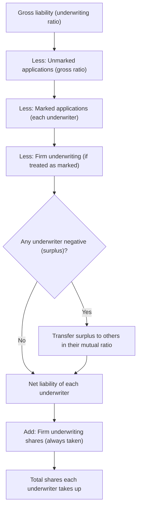

# Q&A — Underwriting of Shares & Debentures

*CA Intermediate — Advanced Accounting. All amounts in Rupees (Rs.). Statutory references: Companies Act, 2013 and Rules made thereunder. No provisions have been invented.*

---

## SECTION A — Concept Check (with answers)

**A1. What is underwriting and who is an underwriter?**
Underwriting is a contract by which a person (the underwriter) undertakes, for a commission, to subscribe to (buy) the shares or debentures of a company that are **not taken up by the public**. It guarantees the company a minimum subscription and shifts the risk of under-subscription onto the underwriter, exactly like an insurer absorbing a risk for a premium.

**A2. Distinguish marked and unmarked applications.**
A **marked application** carries the stamp/seal of a particular underwriter, so credit for it is given directly to that underwriter. An **unmarked application** is received by the company directly (no underwriter's stamp), and is shared among all underwriters in their **gross underwriting ratio**.

**A3. What is "firm underwriting"?**
It is an arrangement where an underwriter agrees to **definitely take up a stated number of shares/debentures** irrespective of the public response, over and above his obligation to take up the unsubscribed balance. These shares are taken up by the underwriter in all cases.

**A4. State the statutory ceiling on underwriting commission.**
Under **Section 40(6) of the Companies Act, 2013 read with Rule 13 of the Companies (Prospectus and Allotment of Securities) Rules, 2014**, commission is payable **only if authorised by the Articles**, and must not exceed:
- **Shares:** 5% of the price at which shares are issued, or the rate authorised by the Articles — **whichever is less**.
- **Debentures:** 2.5% of the price at which debentures are issued, or the rate authorised by the Articles — **whichever is less**.
It must be disclosed in the prospectus and is **not** payable on securities not offered to the public for subscription.

**A5. On what basis is commission computed — shares actually taken up, or shares underwritten?**
On the **gross number of shares/debentures underwritten** (i.e., the full liability accepted), regardless of how many the underwriter is ultimately required to take up. The underwriter is paid for bearing the risk, not merely for the shares he ends up buying.

**A6. Gross liability method vs. net liability method — one line each.**
**Gross liability method:** each underwriter is first charged with his full (gross) share of the issue, then given credit for marked and unmarked applications. **Net liability method:** the total shortfall is directly apportioned in the underwriting ratio. The gross method is the ICAI-preferred, more transparent approach and is used below.

---

## SECTION B — Graded Computational Problems

### B1 (Easy) — Commission ceiling

A company issues 2,00,000 equity shares of Rs. 10 each at par, fully underwritten. Articles authorise commission up to 4%. Compute the maximum commission payable.

**Solution.**
Issue price = 2,00,000 × Rs. 10 = Rs. 20,00,000.
Statutory ceiling for shares = 5% of price = Rs. 1,00,000.
Articles rate = 4% of price = Rs. 80,000.
Whichever is **less** → **Rs. 80,000** is the maximum commission payable.

---

### B2 (Easy–Moderate) — Net liability, no firm underwriting

Issue: 20,000 shares, underwritten **A : B : C = 5 : 3 : 2** (A 10,000; B 6,000; C 4,000).
Marked applications: A 4,000; B 4,000; C 2,000. Unmarked applications: 2,000.
Determine the net liability of each underwriter.

**Solution.**

| Particulars | A | B | C | Total |
|---|---|---|---|---|
| Gross liability | 10,000 | 6,000 | 4,000 | 20,000 |
| Less: Marked applications | (4,000) | (4,000) | (2,000) | (10,000) |
| Balance | 6,000 | 2,000 | 2,000 | 10,000 |
| Less: Unmarked 2,000 in 5:3:2 | (1,000) | (600) | (400) | (2,000) |
| **Net liability (shares)** | **5,000** | **1,400** | **1,600** | **8,000** |

**Check:** Total applications = 10,000 marked + 2,000 unmarked = 12,000. Shortfall = 20,000 − 12,000 = **8,000** = total net liability. Reconciles.

---

### B3 (Exam-hard) — Firm underwriting treated as marked

A company issues **1,00,000** equity shares of Rs. 10 each, underwritten by **P, Q, R in 4 : 3 : 3** (P 40,000; Q 30,000; R 30,000). **Firm underwriting:** P 4,000; Q 3,000; R 3,000.
Marked applications (excluding firm): P 16,000; Q 10,000; R 4,000. Unmarked applications: 30,000.
Firm underwriting is treated as **marked** applications. Compute net liability and total shares to be taken up by each.

**Solution.**

| Particulars | P | Q | R | Total |
|---|---|---|---|---|
| Gross liability | 40,000 | 30,000 | 30,000 | 1,00,000 |
| Less: Unmarked 30,000 in 4:3:3 | (12,000) | (9,000) | (9,000) | (30,000) |
| Balance | 28,000 | 21,000 | 21,000 | 70,000 |
| Less: Marked applications | (16,000) | (10,000) | (4,000) | (30,000) |
| Balance | 12,000 | 11,000 | 17,000 | 40,000 |
| Less: Firm underwriting (as marked) | (4,000) | (3,000) | (3,000) | (10,000) |
| **Net liability** | **8,000** | **8,000** | **14,000** | **30,000** |
| Add: Firm shares (always taken) | 4,000 | 3,000 | 3,000 | 10,000 |
| **Total shares to take up** | **12,000** | **11,000** | **17,000** | **40,000** |

**Check:** Total applications = 30,000 marked + 30,000 unmarked + 10,000 firm = 70,000. Shortfall on public issue = 1,00,000 − 70,000 = 30,000 (net liability). Add firm 10,000 → underwriters take **40,000** shares. Reconciles.

---

### B4 (Exam-hard) — Surplus redistribution + journal entries

A company issues **60,000** equity shares of Rs. 10 each at par. Underwritten **X : Y : Z = 3 : 2 : 1** (X 30,000; Y 20,000; Z 10,000). No firm underwriting.
Marked applications: X 6,000; Y 4,000; Z 14,000. Unmarked applications: 6,000. Articles authorise commission of 5%.

**Step 1 — Net liability (gross method):**

| Particulars | X | Y | Z | Total |
|---|---|---|---|---|
| Gross liability | 30,000 | 20,000 | 10,000 | 60,000 |
| Less: Unmarked 6,000 in 3:2:1 | (3,000) | (2,000) | (1,000) | (6,000) |
| Balance | 27,000 | 18,000 | 9,000 | 54,000 |
| Less: Marked applications | (6,000) | (4,000) | (14,000) | (24,000) |
| Balance | 21,000 | 14,000 | (5,000) | 30,000 |

Z shows a **surplus of 5,000** (his marked applications exceed his liability). Distribute Z's surplus to X and Y in **their** ratio 3 : 2 → X 3,000, Y 2,000; set Z to nil.

| Particulars | X | Y | Z | Total |
|---|---|---|---|---|
| Balance b/d | 21,000 | 14,000 | (5,000) | 30,000 |
| Adjust Z's surplus (3:2) | (3,000) | (2,000) | 5,000 | — |
| **Net liability (shares)** | **18,000** | **12,000** | **Nil** | **30,000** |

**Check:** Total applications = 24,000 marked + 6,000 unmarked = 30,000. Shortfall = 60,000 − 30,000 = **30,000** = net liability. Reconciles.

**Step 2 — Commission (on gross liability, 5% of issue price Rs. 10):**
- X: 30,000 × 10 × 5% = **Rs. 15,000**
- Y: 20,000 × 10 × 5% = **Rs. 10,000**
- Z: 10,000 × 10 × 5% = **Rs. 5,000**
- Total commission = **Rs. 30,000** (payable even to Z, who takes nil shares).

**Step 3 — Amount due from underwriters for shares taken (at Rs. 10):**
- X: 18,000 × 10 = Rs. 1,80,000; Y: 12,000 × 10 = Rs. 1,20,000; Z: Nil.

**Step 4 — Journal Entries:**

```
(1) Underwriting Commission A/c        Dr.  30,000
        To X's A/c                                  15,000
        To Y's A/c                                  10,000
        To Z's A/c                                   5,000
    (Commission due @ 5% on gross liability)

(2) X's A/c                            Dr. 1,80,000
    Y's A/c                            Dr. 1,20,000
        To Equity Share Capital A/c              3,00,000
    (Shares taken up by underwriters: X 18,000, Y 12,000)

(3) Bank A/c                           Dr. 2,75,000
        To X's A/c                              1,65,000
        To Y's A/c                              1,10,000
    (Net cash received: amount due for shares less commission
     — X: 1,80,000 − 15,000; Y: 1,20,000 − 10,000)

(4) Z's A/c                            Dr.   5,000
        To Bank A/c                                  5,000
    (Commission paid to Z, who took up no shares)
```

Underwriting Commission A/c is later written off (e.g., against Securities Premium if available, or as expenditure), per the company's accounting policy.

---

## SECTION C — Past-paper-style Full Questions

### C1. Full computation with firm underwriting and reconciliation

**Question.** ABC Ltd. issued 1,00,000 equity shares underwritten as: **P 40,000, Q 30,000, R 30,000**. Firm underwriting — P 4,000, Q 3,000, R 3,000. Total applications received (excluding firm) were 60,000, of which marked were P 16,000, Q 10,000, R 4,000 and the balance unmarked. Firm underwriting is treated as marked. Show the liability of each underwriter and the total number of shares each must take up.

**Model answer.** Unmarked applications = 60,000 − (16,000 + 10,000 + 4,000) = 30,000. This is identical to **B3 above**; the working table gives net liability **P 8,000, Q 8,000, R 14,000** and total shares to be taken up (including firm) **P 12,000, Q 11,000, R 17,000 = 40,000**. Reconciliation: applications 60,000 + firm 10,000 = 70,000; balance to underwriters = 1,00,000 − 70,000 = 30,000 net + 10,000 firm = 40,000.

### C2. Theory — Marked vs unmarked and treatment of firm underwriting

**Question.** Explain the treatment of marked applications, unmarked applications and firm underwriting under the gross liability method.

**Model answer.** Under the gross liability method each underwriter is first debited with his **gross liability** (his agreed ratio of the whole issue). **Marked applications** are credited to the specific underwriter whose stamp they bear. **Unmarked applications** (received directly by the company) are credited to all underwriters in their **gross underwriting ratio**. **Firm underwriting** shares are those the underwriter takes up unconditionally; when firm underwriting is treated as marked, the firm shares are credited to the respective underwriter (reducing his balance liability) but are then **added back** as shares he must compulsorily take up. If any underwriter's balance becomes negative (surplus), the surplus is transferred to the remaining underwriters in their mutual ratio.

---

## SECTION D — MCQs & Case Scenarios

**D1.** Maximum underwriting commission on shares under Section 40(6) read with Rule 13 is:
(a) 2.5% of issue price  (b) 5% of issue price or rate in Articles, whichever is less  (c) 5% of nominal value always  (d) as decided by Board.
**Answer: (b).** The ceiling is the lower of 5% of issue price and the Articles' rate.

**D2.** Underwriting commission on debentures cannot exceed:
(a) 5%  (b) 2.5% of price or Articles rate, whichever is less  (c) 1%  (d) 10%.
**Answer: (b).** Debenture commission ceiling is 2.5% of the price at which debentures are issued (or Articles rate, whichever is less).

**D3.** Unmarked applications are apportioned among underwriters in:
(a) equal ratio  (b) ratio of marked applications  (c) gross underwriting ratio  (d) ratio of net liability.
**Answer: (c).** Unmarked applications carry no underwriter's stamp, so they are shared in the gross underwriting ratio.

**D4.** Commission is payable to an underwriter who ultimately takes up **no** shares:
(a) No  (b) Yes, because it is paid on gross liability underwritten  (c) Only half  (d) Only if Articles silent.
**Answer: (b).** Commission compensates the risk borne on the gross liability, so it is payable even if the underwriter takes up nil shares.

**D5 (Case).** Issue 50,000 shares; L 30,000, M 20,000 (3:2). Marked: L 24,000, M 6,000; unmarked 8,000. Who bears the balance?
Gross L 30,000 / M 20,000; less unmarked 8,000 in 3:2 → L 4,800, M 3,200 → L 25,200, M 16,800; less marked → L 25,200 − 24,000 = 1,200; M 16,800 − 6,000 = 10,800. **L 1,200; M 10,800; total 12,000** = shortfall (50,000 − 38,000). **Answer: L 1,200 shares, M 10,800 shares.**

**D6.** Firm underwriting shares are:
(a) never taken up  (b) taken up only if issue under-subscribed  (c) taken up in all cases by the underwriter  (d) sold to public.
**Answer: (c).** Firm underwriting is an unconditional commitment to take up the stated shares.

---

## Computation Flow (Gross Liability Method)



---

## Quick-Revision Sheet

- **Commission caps (Sec 40(6) + Rule 13):** Shares ≤ 5% of price or Articles rate (lower); Debentures ≤ 2.5% or Articles rate (lower). Only if Articles authorise; disclosed in prospectus; not on securities not offered to public.
- **Commission base:** gross liability underwritten (payable even if nil shares taken).
- **Marked** → credit to specific underwriter. **Unmarked** → shared in **gross ratio**.
- **Gross method order:** Gross liability − unmarked (gross ratio) − marked − firm (if marked) → adjust any surplus in mutual ratio → net liability → add firm shares → total taken up.
- **Reconcile:** total net liability = issue − total applications; total shares taken = net liability + firm.
- **Journal skeleton:** Commission A/c Dr to Underwriters; Underwriters A/c Dr to Share Capital/Securities Premium (shares taken); Bank A/c Dr to Underwriters (net cash), commission set off.
