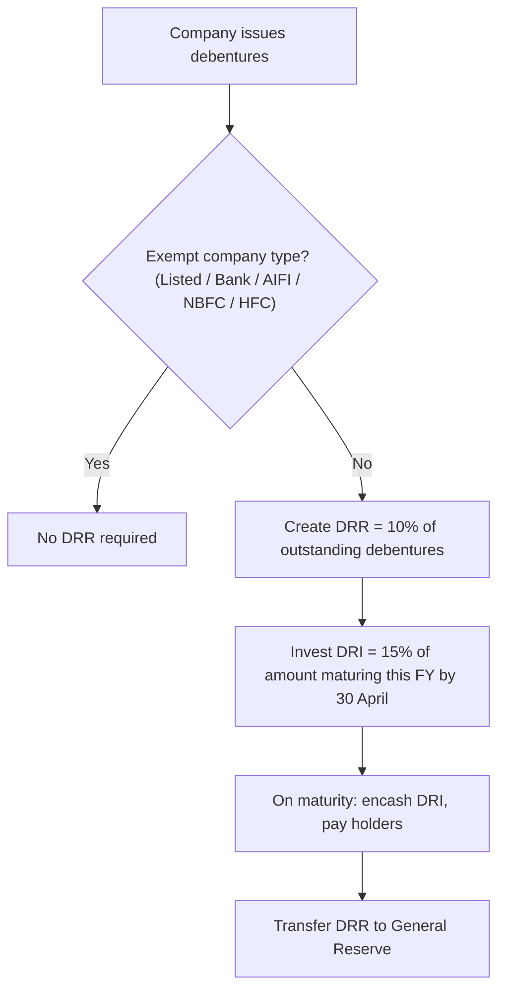

# Q&A — Redemption of Debentures

> Exam-oriented question bank for CA Intermediate, Advanced Accounting. All amounts in Rupees (₹). Statutory positions reflect the Companies Act, 2013 and the Companies (Share Capital and Debentures) Rules, 2014 as amended by the 2019 Amendment Rules (DRR reduced to 10%; DRR Investment 15%).

---

## Section A — Concept Check (with answers)

**A1. What does "redemption of debentures" mean?**
Redemption means repayment/discharge of the liability towards debenture holders on the debentures maturing, either at par, at a premium, or (rarely) at a discount, as per the terms of issue.

**A2. Name the four methods of redemption.**
(1) Payment in lump sum at the end of the stipulated period; (2) Payment in annual instalments (by draw of lots); (3) Purchase of own debentures in the open market (for cancellation or as investment); (4) Conversion into shares or new debentures.

**A3. What is Debenture Redemption Reserve (DRR) and its purpose?**
DRR is a reserve created out of profits available for dividend, appropriated to the Statement of Profit and Loss (Surplus), to protect debenture holders. It ensures a portion of redemption is met out of retained profits and not entirely fresh borrowing, safeguarding shareholders' cushion.

**A4. State the current DRR requirement for an unlisted, non-financial company.**
DRR must equal **10%** of the value of outstanding debentures (reduced from 25% by the 2019 amendment). Listed companies, NBFCs and HFCs (RBI/NHB registered), All-India Financial Institutions and Banking companies are **exempt** from DRR.

**A5. What is DRR Investment (DRI) and the timing rule?**
Every company **required to create DRR** must, **on or before 30th April** each year, invest or deposit a sum **not less than 15%** of the amount of debentures **maturing during the year ending 31st March of the next year** in specified securities/deposits. The investment must not fall below 15% until redemption.

**A6. Can DRR be used before redemption is complete?**
No. DRR (and the amount standing to its credit) cannot be used for any purpose other than redemption. On completion of redemption it is transferred to **General Reserve**.

**A7. Distinguish cum-interest and ex-interest quotations.**
In a **cum-interest** price, the quoted price *includes* accrued interest; cost of debentures = quoted price − accrued interest. In an **ex-interest** price, accrued interest is paid *in addition* to the quoted price; cost of debentures = quoted price.

**A8. Where is "Premium on Redemption of Debentures" shown before redemption?**
As a liability — under Non-current/Current liabilities (Other financial liabilities), because it is provided for at the time of issue as an ascertained future obligation.

**A9. What is profit/loss on cancellation of own debentures?**
When a company buys back its own debentures below face value and cancels them, the excess of face value over cost is a capital profit transferred to **Capital Reserve**; a loss is charged to the Statement of Profit and Loss.

**A10. Is DRR needed when redemption is out of the proceeds of a fresh issue of shares/debentures?**
For companies not exempt, DRR of 10% of outstanding debentures is still required regardless of the source of funds; exemptions depend on the **type of company**, not the source.

---

## Section B — Graded Computational Problems

### B1 (Easy) — Computing DRR and DRR Investment

Moon Ltd. (an unlisted manufacturing company) has 30,000, 10% Debentures of ₹100 each outstanding, redeemable at par on 31 March 2027. Compute the DRR and the minimum DRR Investment.

**Solution**
- Outstanding debentures = 30,000 × ₹100 = ₹30,00,000
- DRR = 10% × ₹30,00,000 = **₹3,00,000**
- Debentures maturing during year ending 31 March 2027 = ₹30,00,000
- DRR Investment = 15% × ₹30,00,000 = **₹4,50,000**, to be made on or before **30 April 2026**.

*Self-check:* DRR (₹3,00,000) is a profit appropriation; DRI (₹4,50,000) is an asset created out of bank. They are independent figures — do not net them.

---

### B2 (Moderate) — Issue and Redemption at a Premium: Journal Entries

Star Ltd. (unlisted, non-financial) issued 20,000, 9% Debentures of ₹100 each at par on 1 April 2024, redeemable at a **10% premium** on 31 March 2026. Surplus in the Statement of Profit and Loss is adequate. Pass journal entries for issue, DRR/DRI and redemption.

**Solution**

*On issue (1 April 2024):*
| Particulars | Dr (₹) | Cr (₹) |
|---|---|---|
| Bank A/c | 20,00,000 | |
| Loss on Issue of Debentures A/c | 2,00,000 | |
| &nbsp;&nbsp;To 9% Debentures A/c | | 20,00,000 |
| &nbsp;&nbsp;To Premium on Redemption of Debentures A/c | | 2,00,000 |

*Creation of DRR (on/before redemption, out of surplus):*
DRR = 10% × ₹20,00,000 = ₹2,00,000
| Statement of P&L (Surplus) A/c | 2,00,000 | |
| &nbsp;&nbsp;To Debenture Redemption Reserve A/c | | 2,00,000 |

*DRR Investment (on/before 30 April 2025):* 15% × ₹20,00,000 = ₹3,00,000
| Debenture Redemption Investment A/c | 3,00,000 | |
| &nbsp;&nbsp;To Bank A/c | | 3,00,000 |

*On redemption (31 March 2026) — encash investment:*
| Bank A/c | 3,00,000 | |
| &nbsp;&nbsp;To Debenture Redemption Investment A/c | | 3,00,000 |

*Amount due to holders (₹20,00,000 + 10% premium ₹2,00,000):*
| 9% Debentures A/c | 20,00,000 | |
| Premium on Redemption of Debentures A/c | 2,00,000 | |
| &nbsp;&nbsp;To Debenture holders A/c | | 22,00,000 |

*Payment:*
| Debenture holders A/c | 22,00,000 | |
| &nbsp;&nbsp;To Bank A/c | | 22,00,000 |

*Transfer DRR to General Reserve after redemption:*
| Debenture Redemption Reserve A/c | 2,00,000 | |
| &nbsp;&nbsp;To General Reserve A/c | | 2,00,000 |

*Self-check:* Premium account (₹2,00,000) created at issue is exactly extinguished at redemption; DRR created (₹2,00,000) equals DRR transferred out — books balance.

---

### B3 (Hard) — Purchase of Own Debentures for Cancellation (ex-interest)

Comet Ltd. has 12% Debentures of ₹100 each. Interest is payable on 30 September and 31 March. On **1 August 2025** the company purchased **1,000 of its own debentures in the open market at ₹98 (ex-interest)** and cancelled them immediately. Show the calculation and journal entries (ignore DRR for this sub-part).

**Solution**

- Face value cancelled = 1,000 × ₹100 = ₹1,00,000
- Purchase cost (ex-interest) = 1,000 × ₹98 = ₹98,000
- Accrued interest (1 April → 31 July = 4 months) = ₹1,00,000 × 12% × 4/12 = ₹4,000
- Total cash paid = ₹98,000 + ₹4,000 = **₹1,02,000**
- Profit on cancellation = Face ₹1,00,000 − Cost ₹98,000 = **₹2,000** (to Capital Reserve)

*Purchase:*
| Own Debentures A/c | 98,000 | |
| Debenture Interest A/c | 4,000 | |
| &nbsp;&nbsp;To Bank A/c | | 1,02,000 |

*Cancellation:*
| 12% Debentures A/c | 1,00,000 | |
| &nbsp;&nbsp;To Own Debentures A/c | | 98,000 |
| &nbsp;&nbsp;To Profit on Cancellation of Debentures A/c | | 2,000 |

*Transfer of capital profit:*
| Profit on Cancellation of Debentures A/c | 2,000 | |
| &nbsp;&nbsp;To Capital Reserve A/c | | 2,000 |

*Self-check:* Interest (₹4,000) is a revenue charge kept out of the cost; only the ₹98,000 cost is compared with ₹1,00,000 face to derive the ₹2,000 capital profit.

---

### B4 (Exam-Hard) — Redemption by Draw of Lots in Instalments

Nova Ltd. (unlisted) issued 40,000, 8% Debentures of ₹100 each at par on 1 April 2023, redeemable at par in four equal annual instalments by draw of lots starting 31 March 2025. Determine the DRR to be maintained and the DRI for the year ending 31 March 2025, and pass redemption entries for the first instalment (assume DRR already created in full and DRI made).

**Solution**

- Total debentures = 40,000 × ₹100 = ₹40,00,000
- Instalment = ₹40,00,000 ÷ 4 = ₹10,00,000 per year
- DRR (created before commencement) = 10% × ₹40,00,000 = **₹4,00,000**
- Debentures maturing in year ending 31 March 2025 = ₹10,00,000
- DRI (by 30 April 2024) = 15% × ₹10,00,000 = **₹1,50,000**

*First instalment redemption (31 March 2025) — encash DRI:*
| Bank A/c | 1,50,000 | |
| &nbsp;&nbsp;To Debenture Redemption Investment A/c | | 1,50,000 |

*Amount due and paid:*
| 8% Debentures A/c | 10,00,000 | |
| &nbsp;&nbsp;To Debenture holders A/c | | 10,00,000 |
| Debenture holders A/c | 10,00,000 | |
| &nbsp;&nbsp;To Bank A/c | | 10,00,000 |

*Proportionate transfer of DRR to General Reserve* (on redemption of first quarter, ₹4,00,000 × 1/4):
| Debenture Redemption Reserve A/c | 1,00,000 | |
| &nbsp;&nbsp;To General Reserve A/c | | 1,00,000 |

*Self-check:* Each year's DRI = 15% of that year's maturing amount (₹1,50,000). DRR built on full outstanding (₹4,00,000) is released proportionately as instalments retire, fully cleared after the fourth instalment.

**Solution path (decision flow):**

---

## Section C — Past-Paper-Style Full Questions

### C1 — Cum-interest purchase as investment then cancellation

Vega Ltd. holds no own debentures on 1 April 2025. Its 10% Debentures of ₹100 each carry interest payable on 31 March and 30 September. On **1 January 2026** the company bought **2,000 own debentures at ₹103 (cum-interest)** in the open market as an investment, and later cancelled them on **31 March 2026**. Show the calculations and journal entries relating to the purchase, interest, and cancellation.

**Model Answer**

*Cost split (cum-interest ₹103):*
- Gross price = 2,000 × ₹103 = ₹2,06,000
- Accrued interest (1 Oct 2025 → 31 Dec 2025 = 3 months) = ₹2,00,000 × 10% × 3/12 = ₹5,000
- Cost of own debentures = ₹2,06,000 − ₹5,000 = **₹2,01,000**

*Purchase (1 January 2026):*
| Own Debentures A/c | 2,01,000 | |
| Debenture Interest A/c | 5,000 | |
| &nbsp;&nbsp;To Bank A/c | | 2,06,000 |

*Cancellation (31 March 2026):*
- Face value = ₹2,00,000; Cost = ₹2,01,000 → **Loss on cancellation = ₹1,000**
| 10% Debentures A/c | 2,00,000 | |
| Loss on Cancellation of Debentures A/c | 1,000 | |
| &nbsp;&nbsp;To Own Debentures A/c | | 2,01,000 |

*Loss written off to Statement of Profit and Loss:*
| Statement of Profit and Loss | 1,000 | |
| &nbsp;&nbsp;To Loss on Cancellation of Debentures A/c | | 1,000 |

*Self-check:* Cum-interest cost exceeds face value, so the transaction yields a revenue loss (₹1,000), correctly charged to P&L rather than adjusted against Capital Reserve.

---

### C2 — Complete redemption with DRR, DRI and premium

Orion Ltd. (unlisted, non-financial) has in its books on 1 April 2025: **12% Debentures ₹50,00,000** (redeemable at par on 31 March 2026) and a credit balance of ₹80,00,000 in Surplus (Statement of P&L). Prepare the journal entries for compliance and redemption.

**Model Answer**

- DRR required = 10% × ₹50,00,000 = ₹5,00,000
- DRI required = 15% × ₹50,00,000 = ₹7,50,000 (by 30 April 2025)

| Date | Particulars | Dr (₹) | Cr (₹) |
|---|---|---|---|
| Apr 2025 | Statement of P&L (Surplus) A/c Dr | 5,00,000 | |
| | &nbsp;&nbsp;To Debenture Redemption Reserve A/c | | 5,00,000 |
| ≤30 Apr 25 | Debenture Redemption Investment A/c Dr | 7,50,000 | |
| | &nbsp;&nbsp;To Bank A/c | | 7,50,000 |
| Mar 2026 | Bank A/c Dr | 7,50,000 | |
| | &nbsp;&nbsp;To Debenture Redemption Investment A/c | | 7,50,000 |
| Mar 2026 | 12% Debentures A/c Dr | 50,00,000 | |
| | &nbsp;&nbsp;To Debenture holders A/c | | 50,00,000 |
| Mar 2026 | Debenture holders A/c Dr | 50,00,000 | |
| | &nbsp;&nbsp;To Bank A/c | | 50,00,000 |
| Mar 2026 | Debenture Redemption Reserve A/c Dr | 5,00,000 | |
| | &nbsp;&nbsp;To General Reserve A/c | | 5,00,000 |

*Self-check:* Redemption is at par so no premium account arises. DRR created (₹5,00,000) equals DRR transferred to General Reserve on completion.

---

## Section D — MCQs and Case Scenarios

**D1.** The current DRR for an unlisted non-financial company is:
(a) 25% of outstanding debentures (b) **10% of outstanding debentures** (c) 15% of maturing debentures (d) 50% of issue.
**Answer: (b)** — The 2019 amendment reduced DRR from 25% to 10% of the value of outstanding debentures.

**D2.** DRR Investment must be made on or before:
(a) 31 March (b) 30 September (c) **30 April** (d) 31 December of each year.
**Answer: (c)** — At least 15% of debentures maturing in the year ending 31 March next must be invested by 30 April.

**D3.** A listed company (non-financial) issuing debentures must create DRR of:
(a) 10% (b) 25% (c) **Nil** (d) 15%.
**Answer: (c)** — Listed companies are exempt from DRR under the amended Rule 18(7).

**D4.** Own debentures of face ₹1,00,000 bought at ₹96 (ex-interest) and cancelled give:
(a) Loss ₹4,000 (b) **Profit ₹4,000 to Capital Reserve** (c) Profit ₹4,000 to P&L (d) No effect.
**Answer: (b)** — Face ₹1,00,000 − cost ₹96,000 = ₹4,000 capital profit → Capital Reserve.

**D5.** Premium on Redemption of Debentures account, before redemption, is:
(a) An expense (b) **A liability** (c) A reserve (d) An asset.
**Answer: (b)** — It is a provided-for future obligation shown under liabilities.

**D6. Case:** Zephyr Ltd. (unlisted) has 10,000, 11% Debentures of ₹100 each maturing 31 March 2027. It creates full DRR and DRI. The DRR and DRI amounts are:
(a) ₹2,50,000 and ₹1,50,000 (b) **₹1,00,000 and ₹1,50,000** (c) ₹1,50,000 and ₹1,00,000 (d) ₹1,00,000 and ₹1,00,000.
**Answer: (b)** — Outstanding ₹10,00,000: DRR = 10% = ₹1,00,000; DRI = 15% of maturing ₹10,00,000 = ₹1,50,000.

**D7. Case:** Titan Ltd. buys own debentures cum-interest and the quoted price exceeds face value. On cancellation the difference (net of interest) is:
(a) Capital Reserve (b) **Loss to Statement of P&L** (c) Debenture Interest (d) DRR.
**Answer: (b)** — Cost above face value on cancellation is a revenue loss charged to P&L.

**D8.** After redemption is complete, the balance in DRR is transferred to:
(a) Capital Reserve (b) Securities Premium (c) **General Reserve** (d) Statement of P&L.
**Answer: (c)** — DRR is freed to General Reserve once redemption is fully effected.

---

## Quick-Revision Anchors
- DRR = 10% of **outstanding** debentures (exempt: listed, banks, AIFIs, NBFCs, HFCs).
- DRI = 15% of debentures **maturing** this FY, invested by **30 April**.
- Ex-interest: interest paid **extra**; Cum-interest: interest **inside** the price.
- Profit on cancellation → **Capital Reserve**; loss → **Statement of P&L**.
- DRR released to **General Reserve** only after full redemption.
