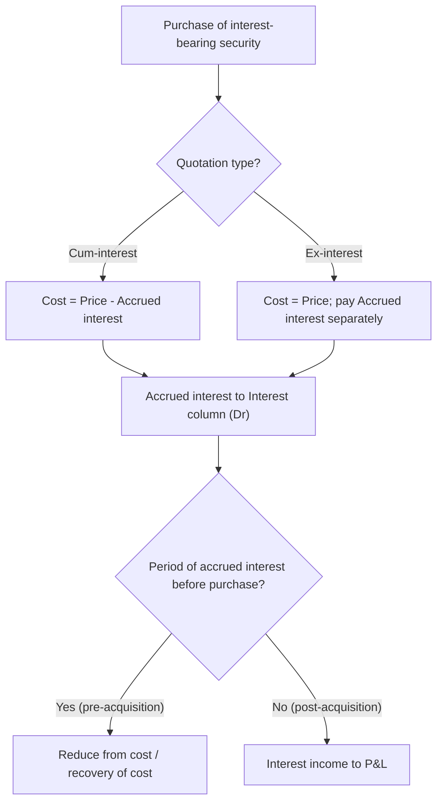

# Q&A — Investment Accounts

Chapter: Investment Accounts | CA Intermediate — Advanced Accounting (ICAI). All amounts in Rupees (Rs). Treatment per **AS 13 — Accounting for Investments** and **Schedule III**.

---

## Section A — Concept Checks (with answers)

**A1. What are the three columns of the Investment Account and what does each carry?**
**Answer:** (i) **Nominal / Face value** — the face value of securities held (number of shares × face value, or face value of debentures/stock). (ii) **Interest / Dividend (Income)** — accrued interest paid on purchase (Dr) and interest/dividend received (Cr); its balance goes to Profit & Loss. (iii) **Cost / Capital / Principal** — the capital cost of the investment; its balance is the carrying amount. The three columns are maintained side-by-side (columnar/analytical form).

**A2. Distinguish "cum-interest" from "ex-interest" quotation.**
**Answer:** In a **cum-interest** quote the price *includes* accrued interest, so **Cost = Quoted price − Accrued interest**. In an **ex-interest** quote the price *excludes* accrued interest; the buyer pays quoted price as capital **plus** accrued interest separately, so **Cost = Quoted price**, and accrued interest goes to the Interest column. In both cases the *cost of investment excludes accrued interest* — accrued interest is never capital.

**A3. How are bonus shares and rights shares treated?**
**Answer:** **Bonus shares** — received free; increase the **nominal column** (number of shares) with **nil cost**; average cost per share falls. **Rights shares subscribed** — cost paid is added to the Cost column and nominal to the nominal column. **Rights renounced/sold** — sale proceeds are credited to **Profit & Loss** (a capital receipt); they do **not** reduce cost of holding.

**A4. State the AS 13 measurement rule for current vs long-term investments at the balance sheet date.**
**Answer:** **Current investments** — carried at **lower of cost and fair value** (usually market/NRV), computed **individually** (or by category). **Long-term investments** — carried at **cost**; a provision is made **only for a decline that is other than temporary (permanent)**. Reversal is permitted when the decline reverses for long-term investments.

**A5. How is pre-acquisition (capital) dividend/interest treated?**
**Answer:** Interest/dividend received that relates to the **period before purchase** is treated as **recovery of cost** (credited to the Cost column / reduces cost of investment), not as income. Only the **post-acquisition** portion is income taken to Profit & Loss.

**A6. Which method values the cost of investments sold, and how is profit/loss on sale computed?**
**Answer:** ICAI uses **weighted average cost** (or FIFO where specified). **Profit/(Loss) on sale = Net sale proceeds (capital column) − Cost of the portion sold**. It is transferred to Profit & Loss (capital profit). Accrued interest on sale goes to the Interest column, not to sale profit.

---

## Section B — Graded Computational Problems (full solutions)

### B1 (Easy) — Cost of investment with brokerage
On 10-06-2023, A Ltd bought 1,000 equity shares of Rs 10 each at Rs 50 per share; brokerage 2%. Compute cost.
**Solution:** Purchase price = 1,000 × 50 = **50,000**. Brokerage = 2% × 50,000 = **1,000**. **Cost of investment = 51,000** (brokerage/stamp duty are capitalised). Nominal value entered = 1,000 × 10 = 10,000.

### B2 (Easy–Moderate) — Cum-interest cost
Bought Rs 10,000 nominal 12% Bonds at **Rs 102 cum-interest**. Interest was last paid 3 months before purchase.
**Solution:** Price paid = 10,000 × 102/100 = **10,200**. Accrued interest = 10,000 × 12% × 3/12 = **300**. **Cost (capital) = 10,200 − 300 = 9,900**; Interest column (Dr) = 300. (If it were **ex-interest** at 102: cost = 10,200 and 300 paid separately.)

### B3 (Exam-hard) — Fixed-income Investment Account with cum/ex-interest and sale
X holds **12% Debentures** (face Rs 100). Interest is payable half-yearly on **30 September** and **31 March**. Prepare the Investment Account for the year ended **31-03-2024**.
- 01-04-2023: Opening balance Rs 40,000 nominal, cost **Rs 39,200**.
- 01-06-2023: Bought Rs 20,000 nominal at **Rs 98 cum-interest**.
- 30-09-2023: Half-yearly interest received.
- 01-11-2023: Sold Rs 30,000 nominal at **Rs 101 ex-interest**.
- 31-03-2024: Half-yearly interest received. Debentures are long-term; carry at cost.

**Working notes:**
- *Purchase (01-06):* Price = 20,000 × 98% = 19,600. Accrued interest (01-04 to 01-06 = 2 m) = 20,000 × 12% × 2/12 = 400. **Cost = 19,600 − 400 = 19,200**; Interest 400.
- *Interest 30-09* (on 60,000, 6 m) = 60,000 × 12% × 6/12 = **3,600**.
- *Sale (01-11), ex-interest:* Capital proceeds = 30,000 × 101% = **30,300**. Accrued interest (01-10 to 01-11 = 1 m) = 30,000 × 12% × 1/12 = **300** (Interest column).
- *Cost of 30,000 sold (weighted average):* Total cost before sale = 39,200 + 19,200 = 58,400 for 60,000 nominal. Cost sold = 58,400 × 30,000/60,000 = **29,200**. **Profit on sale = 30,300 − 29,200 = 1,100**.
- *Interest 31-03* (on remaining 30,000, 6 m) = 30,000 × 12% × 6/12 = **1,800**.
- *Closing:* Nominal 30,000; cost 58,400 − 29,200 = **29,200**. No accrued interest at 31-03 (interest date).

**Investment Account — 12% Debentures (Nominal | Interest | Cost)**

| Date | Particulars | Nominal | Interest | Cost | | Date | Particulars | Nominal | Interest | Cost |
|---|---|--:|--:|--:|---|---|---|--:|--:|--:|
| 01-04 | To Balance b/d | 40,000 | — | 39,200 | | 30-09 | By Bank (interest) | — | 3,600 | — |
| 01-06 | To Bank | 20,000 | 400 | 19,200 | | 01-11 | By Bank (sale) | 30,000 | 300 | 30,300 |
| 01-11 | To P&L (profit) | — | — | 1,100 | | 31-03 | By Bank (interest) | — | 1,800 | — |
| 31-03 | To P&L (interest) | — | 5,300 | — | | 31-03 | By Balance c/d | 30,000 | — | 29,200 |
| | **Total** | **60,000** | **5,700** | **59,500** | | | **Total** | **60,000** | **5,700** | **59,500** |

*Check:* Nominal 60,000 = 60,000; Interest 5,700 = 5,700 (net income to P&L = 5,700 − 400 = 5,300); Cost 59,500 = 59,500. **Reconciles.**

### B4 (Exam-hard) — Equity Investment Account with bonus, rights and diminution
Y holds equity shares of Z Ltd (face Rs 10), a **current investment**. Year ended **31-03-2024**.
- 01-04-2023: 5,000 shares, cost **Rs 60,000**.
- 01-07-2023: Bonus **1 : 5** received.
- 01-09-2023: Rights **1 : 6** at Rs 10 per share; Y **subscribes 600 rights shares** and **sells the balance rights at Rs 3 per right**.
- 01-12-2023: Dividend @ 10% on face value received (post-acquisition).
- 01-02-2024: Sold 2,000 shares at Rs 15 each.
- 31-03-2024: Market price Rs 9 per share.

**Working notes:**
- *Bonus (1:5 on 5,000)* = **1,000 shares**, nil cost. Holding 6,000; cost still 60,000.
- *Rights (1:6 on 6,000)* = 1,000 rights. **Subscribed 600** → paid 600 × 10 = **6,000** (added to cost). **Sold 400 rights** × Rs 3 = **1,200 → credited to P&L** (does not reduce cost).
- After rights: 6,600 shares; cost = 60,000 + 6,000 = **66,000**.
- *Dividend* = 10% × Rs 10 × 6,600 = **6,600** (income to P&L).
- *Sale (01-02):* Proceeds = 2,000 × 15 = **30,000**. Average cost = 66,000/6,600 = Rs 10/share → cost sold = **20,000**. **Profit = 10,000**.
- *Closing:* 4,600 shares; cost = 46,000. Market = 4,600 × 9 = 41,400 < cost → current investment valued at **lower = 41,400**; **diminution 4,600 to P&L**.

**Investment Account — Equity of Z Ltd (Nominal | Dividend | Cost)**

| Date | Particulars | Nominal | Dividend | Cost | | Date | Particulars | Nominal | Dividend | Cost |
|---|---|--:|--:|--:|---|---|---|--:|--:|--:|
| 01-04 | To Balance b/d | 50,000 | — | 60,000 | | 01-12 | By Bank (dividend) | — | 6,600 | — |
| 01-07 | To Bonus | 10,000 | — | — | | 01-02 | By Bank (sale) | 20,000 | — | 30,000 |
| 01-09 | To Bank (rights) | 6,000 | — | 6,000 | | 31-03 | By P&L (diminution) | — | — | 4,600 |
| 01-02 | To P&L (profit) | — | — | 10,000 | | 31-03 | By Balance c/d | 46,000 | — | 41,400 |
| 31-03 | To P&L (dividend) | — | 6,600 | — | | | | | | |
| | **Total** | **66,000** | **6,600** | **76,000** | | | **Total** | **66,000** | **6,600** | **76,000** |

*Check:* Nominal 66,000 = 66,000; Dividend 6,600 = 6,600; Cost 76,000 = 76,000. **Reconciles.** (Rights sold Rs 1,200 is credited to P&L outside this account.)

---

## Section C — Past-paper-style Full Questions (model answers)

### C1. Journal entries for a purchase and sale of debentures
Pass journal entries for: (a) purchase of Rs 20,000 12% Debentures at Rs 98 cum-interest, 2 months' interest accrued; (b) sale of Rs 30,000 at Rs 101 ex-interest, 1 month accrued, cost of portion Rs 29,200 (from B3).

**Model answer:**
*(a) Purchase (01-06-2023):* accrued interest = 400; capital cost = 19,200; total paid = 19,600.
```
Investment in 12% Debentures A/c    Dr   19,200
Interest on Debentures A/c          Dr      400
    To Bank A/c                                 19,600
```
*(b) Sale (01-11-2023):* capital proceeds 30,300; accrued interest 300; total received 30,600.
```
Bank A/c                            Dr   30,600
    To Investment in 12% Debentures A/c        29,200
    To Interest on Debentures A/c                 300
    To Profit & Loss A/c (profit on sale)       1,100
```
*(Interest received on due dates is: Bank A/c Dr, To Interest A/c; the Interest A/c net balance is transferred to Profit & Loss.)*

### C2. Reinstatement of value — long-term investment
A long-term investment costing Rs 5,00,000 was written down by Rs 60,000 in an earlier year for a permanent decline. This year fair value recovers to Rs 4,90,000. State the treatment.
**Model answer:** Under AS 13, for **long-term investments** a provision for decline is made only when the decline is **other than temporary**. Where the reasons for a previous write-down **cease to exist**, the **increase is credited to Profit & Loss** and the carrying amount restored, but **only up to original cost**. Here recovery is Rs 4,90,000 vs current carrying Rs 4,40,000 → **write back Rs 50,000** (restore to 4,90,000, which is below cost 5,00,000). Entry: *Investment A/c Dr 50,000 To Profit & Loss A/c 50,000.* (For a **current** investment the reversal would instead flow automatically through the lower-of-cost-and-fair-value re-measurement.)

---

## Section D — MCQs / Case Scenarios (answer + one-line reason)

**D1.** Investments are quoted at Rs 104 cum-interest with Rs 3 interest accrued. Cost of investment is:
(a) 104 (b) 107 (c) 101 (d) 100
**Answer: (c) 101** — cum-interest cost = 104 − 3 accrued interest.

**D2.** Bonus shares received are recorded by:
(a) increasing cost only (b) increasing nominal value at nil cost (c) crediting P&L (d) ignoring
**Answer: (b)** — bonus adds face value with no cost; average cost per share falls.

**D3.** Sale proceeds of rights renounced (not subscribed) are:
(a) reduced from cost (b) credited to P&L (c) added to nominal (d) ignored
**Answer: (b)** — a capital receipt credited to Profit & Loss.

**D4.** A **current** investment costing Rs 80,000 has fair value Rs 74,000 at year-end. Carrying amount:
(a) 80,000 (b) 77,000 (c) 74,000 (d) 86,000
**Answer: (c) 74,000** — current investments at **lower of cost and fair value**; provide Rs 6,000.

**D5.** Interest received relating to the period **before purchase** is:
(a) income (b) reduced from cost of investment (c) added to cost (d) capital reserve
**Answer: (b)** — pre-acquisition interest is recovery of cost, not income.

**D6.** Brokerage and stamp duty on acquiring investments are:
(a) charged to P&L (b) capitalised as cost of investment (c) ignored (d) shown as prepaid
**Answer: (b)** — directly attributable acquisition costs form part of cost (AS 13).

**D7 (Case).** A long-term investment's market price falls Rs 10,000 due to a short-term market dip expected to reverse. Treatment:
(a) provide Rs 10,000 (b) no provision — temporary decline (c) write off (d) revalue up
**Answer: (b)** — long-term investments are provided for **only** on decline other than temporary.

---

## Solution-Path Diagram — deciding cost on a fixed-income purchase



---

## Quick-Revision Checklist
- Cost **excludes** accrued interest; **includes** brokerage/stamp duty.
- Cum-interest: **Cost = Price − Accrued**; Ex-interest: **Cost = Price** (interest extra).
- Bonus: nominal up, **cost nil**; Rights subscribed: add cost; Rights **sold: P&L**.
- Cost of shares sold = **weighted average**; profit/loss to P&L.
- Three columns must each **cross-total** (Nominal, Interest/Dividend, Cost).
- Year-end: **Current** = lower of cost & fair value (individually); **Long-term** = cost, provide only for **permanent** decline; write-back to cost allowed.
- Pre-acquisition interest/dividend = **recovery of cost**, not income.
