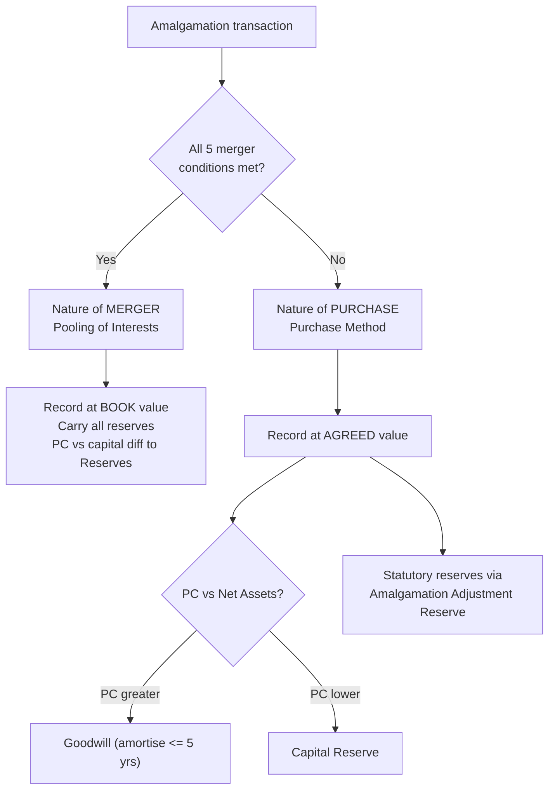

# Q&A — Amalgamation, Absorption & External Reconstruction

Governing standard: **AS 14, "Accounting for Amalgamations"** (ICAI). All figures in **Rupees (₹)**. No provisions are invented; every problem self-reconciles and the transferee's Balance Sheet balances.

---

## SECTION A — Concept Check (with answers)

**A1. Define amalgamation, absorption and external reconstruction. How do they differ?**
- **Amalgamation:** Two or more companies wind up and a *new* company is formed to take over their businesses (A Ltd + B Ltd → AB Ltd).
- **Absorption:** An *existing* company takes over the business of another existing company; no new company is formed (B Ltd absorbed into A Ltd).
- **External Reconstruction:** A *new* company is formed to take over the business of an *existing* loss-making company so accumulated losses can be shed through a fresh capital structure. Accounting mechanics are identical to amalgamation.

**A2. Name and distinguish the two methods of accounting under AS 14.**
- **Pooling of Interests Method** — for an *amalgamation in the nature of merger*. Assets, liabilities and reserves are recorded at *book values*; no goodwill arises; the difference between purchase consideration and share capital adjusts *reserves*.
- **Purchase Method** — for an *amalgamation in the nature of purchase*. Assets and liabilities are recorded at *agreed/fair values*; excess of consideration over net assets is *Goodwill*, and any deficit is *Capital Reserve*.

**A3. State the five conditions for an amalgamation in the nature of merger (all must be satisfied).**
1. All assets and liabilities of the transferor become those of the transferee.
2. Shareholders holding **≥ 90%** of the face value of equity in the transferor (other than shares already held by the transferee) become shareholders of the transferee.
3. Consideration to those equity shareholders is discharged **wholly by equity shares** (cash only for fractional shares).
4. The business of the transferor is **intended to be carried on** by the transferee.
5. **No adjustment** is made to book values except to make accounting policies uniform. Fail any one → nature of **purchase**.

**A4. Define "Purchase Consideration" per AS 14.**
The **aggregate of shares and other securities issued and the payment made in cash or other assets** by the transferee to the **shareholders** of the transferor. It is what is paid to *shareholders only* — payments to debenture-holders and creditors are **excluded**.

**A5. Distinguish Net Payments vs Net Assets method of computing PC.**
- **Net Payments:** PC = total of all payments (shares + cash + other securities) *agreed to be made to shareholders*.
- **Net Assets:** PC = Agreed value of assets *taken over* − Agreed value of liabilities *taken over*. Fictitious assets (P&L Dr., preliminary expenses) are never taken over.

**A6. What is the share-exchange (intrinsic value) ratio?**
Exchange ratio = Net assets available to equity shareholders ÷ number of equity shares = intrinsic value per share; shares are swapped in proportion to relative intrinsic values.

**A7. Where are goodwill/capital reserve recorded, and can they be netted?**
Under the purchase method, Goodwill (Dr.) and Capital Reserve (Cr.) arising on the *same* amalgamation may be shown net; goodwill of one deal cannot be set off against capital reserve of another. Goodwill is amortised ordinarily over **≤ 5 years**.

**A8. How are statutory reserves treated under the purchase method?**
They must be *maintained* by crediting the statutory reserve and debiting **Amalgamation Adjustment Reserve** (shown under Other Equity as a negative). Reversed when the legal requirement lapses.

---

## SECTION B — Graded Computational Problems (full solutions)

### B1 (Easy) — Purchase Consideration, Net Payments method

**Q.** Weak Ltd is absorbed by Strong Ltd. Strong Ltd agrees to: (a) issue 3 equity shares of ₹10 each at ₹12 for every 5 equity shares in Weak Ltd (Weak has 50,000 equity shares); (b) pay ₹4 cash per equity share; (c) issue 10% preference shares of ₹100 each to discharge ₹2,00,000 preference capital of Weak Ltd at a 10% premium. Compute the purchase consideration.

**Solution.**

| Component | Working | ₹ |
|---|---|---|
| Equity shares | 50,000 × 3/5 = 30,000 × ₹12 | 3,60,000 |
| Cash | 50,000 × ₹4 | 2,00,000 |
| Preference shares | 2,00,000 × 1.10 | 2,20,000 |
| **Purchase Consideration** | | **7,80,000** |

---

### B2 (Easy–Medium) — PC by Net Assets method

**Q.** A Ltd takes over B Ltd. Agreed values: Land ₹5,00,000; Plant ₹3,00,000; Stock ₹1,20,000; Debtors ₹80,000. Liabilities taken over: Creditors ₹90,000; 12% Debentures ₹2,00,000. B Ltd's Profit & Loss (Dr.) balance is ₹40,000. Compute PC.

**Solution.** The fictitious asset (P&L Dr. ₹40,000) is *not* taken over. Debentures and creditors reduce net assets.

| Item | ₹ |
|---|---|
| Land | 5,00,000 |
| Plant | 3,00,000 |
| Stock | 1,20,000 |
| Debtors | 80,000 |
| **Total assets** | **10,00,000** |
| *Less* Creditors | (90,000) |
| *Less* 12% Debentures | (2,00,000) |
| **Purchase Consideration** | **7,10,000** |

---

### B3 (Medium) — Pooling of Interests (merger), transferee entries

**Q.** P Ltd amalgamates with Q Ltd to form PQ Ltd in the nature of **merger**. Q Ltd's balances: Equity Share Capital ₹6,00,000; General Reserve ₹1,50,000; P&L (Cr.) ₹50,000; Sundry Assets ₹9,00,000; Creditors ₹1,00,000. PQ Ltd issues equity shares of face value ₹6,50,000 to Q's shareholders. Pass entries in PQ Ltd's books.

**Solution.** Merger → **pooling**: record assets, liabilities and reserves at book value. Book net assets = 9,00,000 − 1,00,000 = ₹8,00,000 (= capital 6,00,000 + reserves 2,00,000). PC (₹6,50,000) exceeds share capital taken (₹6,00,000) by ₹50,000; under pooling this excess is adjusted against **reserves**, not goodwill.

**Journal in PQ Ltd:**
```
(1) Business Purchase A/c            Dr. 6,50,000
        To Liquidator of Q Ltd              6,50,000

(2) Sundry Assets A/c                Dr. 9,00,000
        To Creditors A/c                    1,00,000
        To General Reserve A/c              1,50,000
        To Profit & Loss A/c                  50,000
        To Business Purchase A/c            6,50,000
        To ... (excess to reserve)          (see note)

(3) Liquidator of Q Ltd              Dr. 6,50,000
        To Equity Share Capital             6,50,000
```
*Reserve balancing:* Debits ₹9,00,000; Credits so far = 1,00,000 + 1,50,000 + 50,000 + 6,50,000 = ₹9,50,000. To balance, **General Reserve is reduced by ₹50,000** (the excess of PC over capital). Net General Reserve carried = 1,50,000 − 50,000 = **₹1,00,000**. No goodwill arises — the hallmark of pooling.

---

### B4 (Exam-hard) — Full Absorption: Realisation A/c, ledgers, balancing Balance Sheet

**Q.** The Balance Sheet of **Sun Ltd** (transferor) as at 31.3.2026:

| Liabilities | ₹ | Assets | ₹ |
|---|---|---|---|
| Equity Share Capital (₹10; 50,000 shares) | 5,00,000 | Goodwill | 60,000 |
| 8% Preference Capital (₹100; 2,000 shares) | 2,00,000 | Land & Building | 4,00,000 |
| General Reserve | 1,00,000 | Plant & Machinery | 3,00,000 |
| Profit & Loss A/c | 60,000 | Stock | 1,60,000 |
| 10% Debentures | 1,50,000 | Debtors | 1,40,000 |
| Creditors | 90,000 | Cash & Bank | 20,000 |
| | | Preliminary Expenses | 20,000 |
| **Total** | **11,00,000** | **Total** | **11,00,000** |

**Moon Ltd** absorbs Sun Ltd on these terms (nature of **purchase**):
1. Agreed values: Land & Building ₹4,50,000; Plant & Machinery ₹2,80,000; Stock ₹1,50,000; Debtors subject to 5% provision for doubtful debts; Cash at book. Goodwill and preliminary expenses have no value.
2. 8% preference shareholders are discharged by issuing **10% preference shares of ₹100 each at par**.
3. Equity shareholders receive **4 equity shares of ₹10 each, issued at ₹12.50**, for every 5 shares held.
4. 10% Debentures taken over and discharged by Moon issuing **11% debentures** of equal amount; Creditors taken over at book. Liquidation expenses ₹10,000 paid by Moon Ltd.

**Required:** (a) Purchase Consideration; (b) Realisation A/c and shareholders' accounts in Sun Ltd's books; (c) Journal and opening entry in Moon Ltd's books.

**Solution.**

**Step 1 — Agreed value of assets taken over.**

| Asset | Agreed ₹ |
|---|---|
| Land & Building | 4,50,000 |
| Plant & Machinery | 2,80,000 |
| Stock | 1,50,000 |
| Debtors (1,40,000 − 5% = 7,000) | 1,33,000 |
| Cash & Bank | 20,000 |
| **Total assets taken over** | **10,33,000** |
| *Less* liabilities taken over (Debentures 1,50,000 + Creditors 90,000) | (2,40,000) |
| **Net assets taken over** | **7,93,000** |

**Step 2 — Purchase Consideration (Net Payments; to shareholders only).**

| Component | Working | ₹ |
|---|---|---|
| 10% Preference shares | 2,000 × ₹100 (at par) | 2,00,000 |
| Equity shares | 50,000 × 4/5 = 40,000 × ₹12.50 | 5,00,000 |
| **Purchase Consideration** | | **7,00,000** |

*(Debentures/creditors are settled by Moon separately — not part of PC. Liquidation expenses ₹10,000 are borne by Moon and treated as cost of acquisition.)*

**Step 3 — Goodwill / Capital Reserve (Moon's books).**
Net assets ₹7,93,000 − PC ₹7,00,000 = **Capital Reserve ₹93,000**. Liquidation expenses ₹10,000 borne by Moon reduce it → **Capital Reserve ₹83,000**.

---

**Books of Sun Ltd (Transferor)**

**Realisation Account** *(fictitious Preliminary Expenses ₹20,000 not transferred here — written off directly to equity shareholders)*

| Dr. | ₹ | Cr. | ₹ |
|---|---|---|---|
| To Goodwill | 60,000 | By 10% Debentures | 1,50,000 |
| To Land & Building | 4,00,000 | By Creditors | 90,000 |
| To Plant & Machinery | 3,00,000 | By Moon Ltd (PC) | 7,00,000 |
| To Stock | 1,60,000 | By Equity Shareholders (loss) | 1,40,000 |
| To Debtors | 1,40,000 | | |
| To Cash & Bank | 20,000 | | |
| **Total** | **10,80,000** | **Total** | **10,80,000** |

*Loss on realisation = ₹10,80,000 − (1,50,000 + 90,000 + 7,00,000) = **₹1,40,000**, borne by equity shareholders.*

**8% Preference Shareholders' A/c**

| Dr. | ₹ | Cr. | ₹ |
|---|---|---|---|
| To 10% Pref. Shares in Moon | 2,00,000 | By 8% Preference Share Capital | 2,00,000 |
| **Total** | **2,00,000** | **Total** | **2,00,000** |

**Equity Shareholders' A/c**

| Dr. | ₹ | Cr. | ₹ |
|---|---|---|---|
| To Preliminary Expenses (written off) | 20,000 | By Equity Share Capital | 5,00,000 |
| To Realisation A/c (loss) | 1,40,000 | By General Reserve | 1,00,000 |
| To Equity Shares in Moon Ltd | 5,00,000 | By Profit & Loss A/c | 60,000 |
| **Total** | **6,60,000** | **Total** | **6,60,000** |

*Account closes exactly at ₹6,60,000 — the model answer self-verifies.*

---

**Books of Moon Ltd (Transferee) — Journal**
```
(1) Business Purchase A/c            Dr. 7,00,000
        To Liquidator of Sun Ltd            7,00,000

(2) Land & Building A/c               Dr. 4,50,000
    Plant & Machinery A/c             Dr. 2,80,000
    Stock A/c                         Dr. 1,50,000
    Debtors A/c                       Dr. 1,40,000
    Cash & Bank A/c                   Dr.   20,000
        To Provision for Doubtful Debts        7,000
        To 10% Debentures                   1,50,000
        To Creditors                          90,000
        To Business Purchase A/c            7,00,000
        To Capital Reserve                    93,000

(3) Liquidator of Sun Ltd            Dr. 7,00,000
        To 10% Preference Share Capital     2,00,000
        To Equity Share Capital             4,00,000
        To Securities Premium               1,00,000

(4) Capital Reserve A/c              Dr.   10,000
        To Bank A/c (liquidation exp.)        10,000

(5) 10% Debentures A/c               Dr. 1,50,000
        To 11% Debentures                   1,50,000
```
*Check entry (2):* Debits = 4,50,000+2,80,000+1,50,000+1,40,000+20,000 = **₹10,40,000**. Credits = 7,000+1,50,000+90,000+7,00,000+93,000 = **₹10,40,000**. **Balances.** After entry (4), Capital Reserve = 93,000 − 10,000 = **₹83,000**. Equity Share Capital ₹4,00,000 (40,000 × ₹10) + Securities Premium ₹1,00,000 (40,000 × ₹2.50) = the ₹5,00,000 equity consideration.

---

## SECTION C — Past-Paper-Style Full Questions

### C1 — External Reconstruction

**Q.** Weak Ltd (accumulated loss) is reconstructed externally. New Ltd is formed to take over all assets (book ₹8,00,000; agreed ₹7,40,000) and liabilities Creditors ₹1,20,000 and 12% Debentures ₹2,00,000. Weak Ltd's Equity Capital is ₹6,00,000 (₹10 shares); P&L (Dr.) ₹1,00,000. New Ltd issues 2 equity shares of ₹10 (at par) for every 3 old shares, issues 12% debentures to debenture-holders, and takes over creditors. Compute PC, goodwill/capital reserve, and pass New Ltd's acquisition entry.

**Solution.**
- PC (to equity shareholders only) = 60,000 × 2/3 = 40,000 shares × ₹10 = **₹4,00,000**.
- Net assets taken over = 7,40,000 − 1,20,000 − 2,00,000 = **₹4,20,000**.
- PC ₹4,00,000 < net assets ₹4,20,000 → **Capital Reserve ₹20,000**.

```
Business Purchase A/c        Dr. 4,00,000
    To Liquidator of Weak Ltd     4,00,000

Sundry Assets A/c            Dr. 7,40,000
    To Creditors                  1,20,000
    To 12% Debentures             2,00,000
    To Business Purchase A/c      4,00,000
    To Capital Reserve               20,000

Liquidator of Weak Ltd       Dr. 4,00,000
    To Equity Share Capital       4,00,000
```
*Check:* 1,20,000 + 2,00,000 + 4,00,000 + 20,000 = ₹7,40,000. **Balances.**

### C2 — Method selection and reserve treatment

**Q.** In an amalgamation all merger conditions are met except that 8% of the consideration to equity shareholders is paid in cash (beyond fractional adjustments). State the method and the treatment of the ₹75,000 excess of PC over net assets acquired.

**Answer.** Condition 3 (consideration wholly in equity shares) is violated → **amalgamation in the nature of purchase**, apply **Purchase Method**. The ₹75,000 excess of PC over net assets acquired is **Goodwill** (amortise over ≤ 5 years). The transferor's reserves are **not** carried forward, except statutory reserves preserved via the Amalgamation Adjustment Reserve.

---

## SECTION D — MCQs / Case Scenarios

**D1.** Purchase consideration under AS 14 is the amount payable to:
(a) Creditors (b) Debenture-holders (c) **Shareholders** (d) All outsiders
**Ans: (c)** — AS 14 defines PC as consideration to *shareholders* only.

**D2.** In pooling of interests, the difference between PC and share capital of the transferor is adjusted to:
(a) Goodwill (b) **Reserves** (c) Capital Reserve (d) P&L
**Ans: (b)** — pooling records at book value; no goodwill, difference hits reserves.

**D3.** Minimum % of equity holders (by face value) who must become shareholders of the transferee for a merger:
(a) 51% (b) 75% (c) **90%** (d) 100%
**Ans: (c)** — merger condition 2.

**D4.** Goodwill arising on amalgamation should ordinarily be amortised over a period not exceeding:
(a) 3 years (b) **5 years** (c) 10 years (d) 20 years
**Ans: (b)** — AS 14 default useful life.

**D5. Case:** X Ltd's agreed net assets = ₹9,00,000; PC (purchase method) = ₹8,20,000. The difference is:
(a) Goodwill ₹80,000 (b) **Capital Reserve ₹80,000** (c) Reserve adjustment (d) Loss
**Ans: (b)** — PC < net assets ⇒ Capital Reserve ₹80,000.

**D6. Case:** In a merger, the transferor's statutory Development Rebate Reserve of ₹50,000 must be preserved. The entry in the transferee is:
(a) Dr. Goodwill, Cr. Reserve (b) **Dr. Amalgamation Adjustment Reserve ₹50,000, Cr. Statutory Reserve ₹50,000** (c) Ignore (d) Dr. P&L
**Ans: (b)** — statutory reserves are maintained via the Amalgamation Adjustment Reserve.

**D7.** Liquidation expenses of the transferor paid by the transferee are:
(a) Part of PC (b) **Added to cost of acquisition (Goodwill / reduce Capital Reserve)** (c) Charged to transferor's P&L (d) Ignored
**Ans: (b)** — treated as acquisition cost, not PC.

---

## Solution-Path Diagram



---

## Quick-Revision One-Liners
- **PC = payment to shareholders only** (Net Payments) OR **Agreed assets − Agreed liabilities** (Net Assets).
- **Fictitious assets** (Preliminary expenses, P&L Dr.) are **never** taken over for PC and are written off directly to equity shareholders.
- **Merger → pooling → book value → reserves carried.** **Purchase → agreed value → Goodwill / Capital Reserve.**
- Goodwill and Capital Reserve of the *same* deal may be netted; amortise goodwill ≤ 5 years.
- Transferee-borne **liquidation expenses → cost of acquisition** (add to Goodwill / reduce Capital Reserve), never PC.
- Premium on discharge of preference capital (paid > book) is a **realisation loss**; here paid at par, so nil.
- Always self-check: **Realisation A/c totals tie**, **shareholders' accounts close**, and the transferee's opening entry balances.
