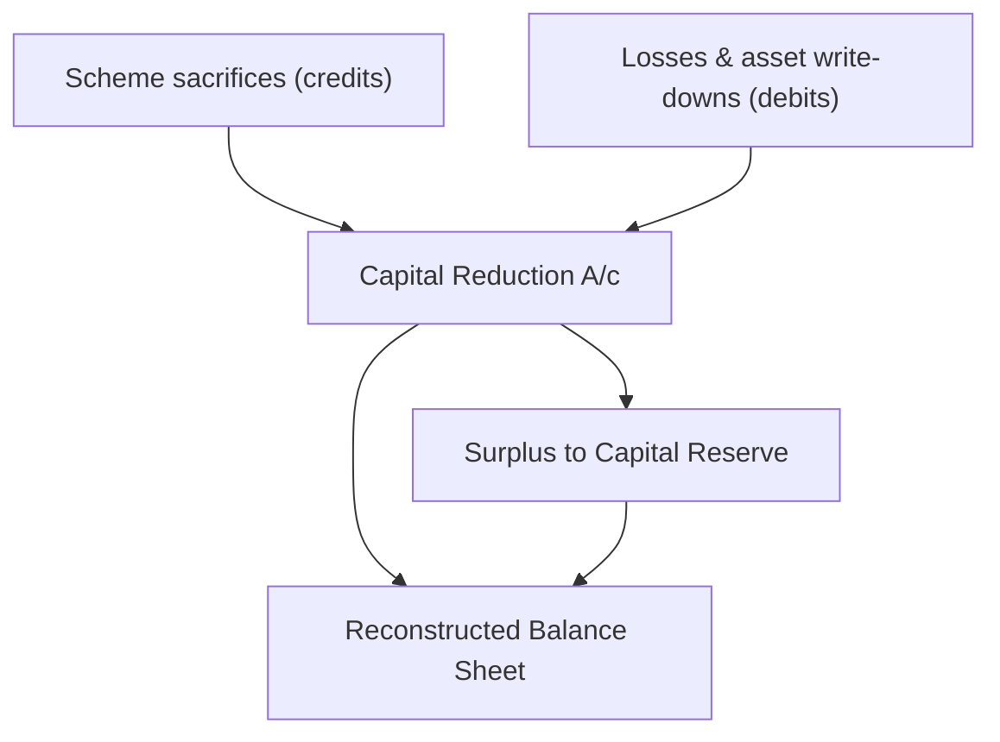

# Q&A — Internal Reconstruction

CA Intermediate • Advanced Accounting • Exam-Oriented Question Bank
All amounts in Rupees (₹). Aligned to ICAI Study Material and AS/Schedule III.

---

## SECTION A — Concept Check (with answers)

**A1. Define Internal Reconstruction and state how it differs from External Reconstruction.**
Internal Reconstruction is the re-arrangement of a company's capital and liabilities to write off accumulated losses and over-valued/fictitious assets **without winding up the existing company or forming a new one**. The same legal entity continues. In External Reconstruction, the existing (loss-making) company is **liquidated** and a **new company** is formed to take over its business. Internal reconstruction is carried out through a **capital reduction scheme** confirmed by the Tribunal (NCLT); external reconstruction is essentially amalgamation in the nature of purchase.

**A2. What is the "Capital Reduction Account" (also called Reconstruction Account) and why is it opened?**
It is a **temporary/nominal account** used to collect all the sacrifices made by shareholders, debenture-holders and creditors (credit side) and to absorb all the losses and asset write-downs (debit side). It is a clearing account; after posting all adjustments, any balance is transferred, so the account **must close to zero**.

**A3. How is the balance on the Capital Reduction Account disposed of?**
A **credit (surplus)** balance is transferred to **Capital Reserve** (it arises from shareholder sacrifice, a capital receipt). The account can **never show a debit (deficit) balance carried forward** — the scheme is designed so that total sacrifices are at least equal to total losses written off.

**A4. Distinguish between "sub-division", "consolidation" and "reduction" of share capital.**
- *Sub-division*: splitting one share of larger denomination into several of smaller denomination (₹100 share → ten ₹10 shares); total capital unchanged.
- *Consolidation*: combining several small shares into one larger share (ten ₹10 → one ₹100); total capital unchanged.
- *Reduction*: cancelling the unpaid/lost portion of capital (₹100 share treated as ₹60 fully paid); total capital **falls** and the fall is credited to Capital Reduction A/c.

**A5. Does reduction of the paid-up value of shares bring cash into the company?**
No. It is a **book adjustment** only. Cash enters only when the scheme provides for a **fresh issue** of shares/debentures or a **call** on partly paid shares.

**A6. How are arrears of cumulative preference dividend dealt with in a scheme?**
Arrears of dividend are a **contingent liability** (not a booked liability). If preference shareholders **forgo** the arrears, no accounting entry is required for the waiver itself — there is nothing on the books to write back. If arrears are **settled** by issuing shares, only the settlement is recorded.

**A7. Which authority approves the scheme and under which law?**
The scheme of reduction of share capital requires **special resolution** of members and **confirmation by the National Company Law Tribunal (NCLT)** under **Sections 66 (reduction of capital) and 230–232 (compromise/arrangement) of the Companies Act, 2013**.

**A8. State the golden rule that makes the numbers reconcile.**
**Total amount available (sacrifices + appreciation) = Total amount utilised (losses + write-downs) + Capital Reserve.** If your Capital Reduction Account does not balance, an adjustment has been missed or wrongly posted.

---

## SECTION B — Graded Computational Problems (full solutions)

### B1 — Easy: Straight reduction of equity shares

**Question.** X Ltd has 10,000 equity shares of ₹100 each, fully paid (₹10,00,000). Its Profit & Loss A/c shows a debit balance of ₹4,00,000. Under an approved scheme each share is reduced to a fully-paid share of ₹60. Pass the entries and show the Capital Reduction Account.

**Solution.**

Reduction per share = ₹100 − ₹60 = ₹40. Total reduction = 10,000 × ₹40 = **₹4,00,000.**

Journal:
1. Equity Share Capital A/c (₹100) Dr 10,00,000 — To Equity Share Capital A/c (₹60) 6,00,000; To Capital Reduction A/c 4,00,000.
2. Capital Reduction A/c Dr 4,00,000 — To Profit & Loss A/c 4,00,000.

**Capital Reduction Account**

| Dr | ₹ | Cr | ₹ |
|---|---:|---|---:|
| To Profit & Loss A/c | 4,00,000 | By Equity Share Capital A/c | 4,00,000 |
| | **4,00,000** | | **4,00,000** |

The account closes exactly; no Capital Reserve arises. Capital is now ₹6,00,000, losses fully wiped.

---

### B2 — Medium: Multiple write-offs, with Capital Reserve

**Question.** ABC Ltd has 15,000 equity shares of ₹100 each fully paid. Its books show: Goodwill ₹1,00,000; Patents ₹50,000; Profit & Loss A/c (Dr) ₹5,00,000. Under the scheme, each equity share is reduced to ₹40 fully paid. Goodwill, Patents and the debit P&L balance are to be written off in full and Plant is to be written down by ₹1,50,000. Show the Capital Reduction Account and journal.

**Solution.**

Reduction of capital = 15,000 × (100 − 40) = 15,000 × 60 = **₹9,00,000** (credit).

Amounts to write off (debit):
- Goodwill 1,00,000 + Patents 50,000 + P&L 5,00,000 + Plant 1,50,000 = **₹8,00,000.**

Surplus to Capital Reserve = 9,00,000 − 8,00,000 = **₹1,00,000.**

**Capital Reduction Account**

| Dr | ₹ | Cr | ₹ |
|---|---:|---|---:|
| To Goodwill | 1,00,000 | By Equity Share Capital A/c | 9,00,000 |
| To Patents | 50,000 | | |
| To Profit & Loss A/c | 5,00,000 | | |
| To Plant & Machinery | 1,50,000 | | |
| To Capital Reserve (bal.) | 1,00,000 | | |
| | **9,00,000** | | **9,00,000** |

Journal (key entries): Equity Share Capital (₹100) Dr 15,00,000 — To Equity Share Capital (₹40) 6,00,000; To Capital Reduction A/c 9,00,000. Then Capital Reduction A/c Dr 9,00,000 — To Goodwill 1,00,000; To Patents 50,000; To P&L 5,00,000; To Plant & Machinery 1,50,000; To Capital Reserve 1,00,000.

---

### B3 — Exam-hard: Full scheme with balancing Balance Sheet

**Question.** The Balance Sheet of Weak Ltd as at 31st March, 20X1 is:

| Equity & Liabilities | ₹ | Assets | ₹ |
|---|---:|---|---:|
| 20,000 Equity shares of ₹100 each | 20,00,000 | Goodwill | 2,00,000 |
| 5,000 8% Preference shares of ₹100 | 5,00,000 | Land & Building | 8,00,000 |
| 6% Debentures | 5,00,000 | Plant & Machinery | 9,00,000 |
| Interest accrued on debentures | 30,000 | Stock | 3,50,000 |
| Sundry creditors | 3,00,000 | Debtors | 4,00,000 |
| Bank overdraft | 1,70,000 | Preliminary expenses | 50,000 |
| | | Profit & Loss A/c (Dr) | 8,00,000 |
| **Total** | **35,00,000** | **Total** | **35,00,000** |

Scheme of reconstruction (confirmed by NCLT):
1. Each equity share is reduced to ₹40 fully paid.
2. Each preference share is reduced to ₹80 fully paid.
3. Debenture-holders agree to forgo the accrued interest of ₹30,000.
4. Sundry creditors agree to forgo 20% of their claim.
5. Goodwill, Preliminary expenses and the debit balance of P&L are to be written off in full.
6. Plant & Machinery is to be written down to ₹8,00,000.
7. Land & Building is to be appreciated to ₹9,00,000.

Prepare the Capital Reduction Account and the reconstructed Balance Sheet.

**Working Notes.**
- WN1 Equity reduction = 20,000 × (100 − 40) = **12,00,000** (Cr).
- WN2 Preference reduction = 5,000 × (100 − 80) = **1,00,000** (Cr).
- WN3 Creditors sacrifice = 20% × 3,00,000 = **60,000** (Cr); revised creditors = 2,40,000.
- WN4 Plant written down = 9,00,000 − 8,00,000 = **1,00,000** (Dr).
- WN5 Land & Building appreciation = 9,00,000 − 8,00,000 = **1,00,000** (Cr).

**Solution path (Mermaid).**

**Capital Reduction Account**

| Dr | ₹ | Cr | ₹ |
|---|---:|---|---:|
| To Goodwill | 2,00,000 | By Equity Share Capital A/c | 12,00,000 |
| To Preliminary expenses | 50,000 | By 8% Preference Share Capital A/c | 1,00,000 |
| To Profit & Loss A/c | 8,00,000 | By Interest accrued on debentures | 30,000 |
| To Plant & Machinery | 1,00,000 | By Sundry Creditors | 60,000 |
| To Capital Reserve (bal.) | 3,40,000 | By Land & Building | 1,00,000 |
| | **14,90,000** | | **14,90,000** |

Surplus transferred to Capital Reserve = 14,90,000 − 11,50,000 = **₹3,40,000.**

**Reconstructed Balance Sheet of Weak Ltd as at 31st March, 20X1**

| Equity & Liabilities | ₹ | Assets | ₹ |
|---|---:|---|---:|
| 20,000 Equity shares of ₹40 each | 8,00,000 | Land & Building | 9,00,000 |
| 5,000 8% Preference shares of ₹80 | 4,00,000 | Plant & Machinery | 8,00,000 |
| Capital Reserve | 3,40,000 | Stock | 3,50,000 |
| 6% Debentures | 5,00,000 | Debtors | 4,00,000 |
| Sundry creditors | 2,40,000 | | |
| Bank overdraft | 1,70,000 | | |
| **Total** | **24,50,000** | **Total** | **24,50,000** |

**Self-check:** Assets removed = Goodwill 2,00,000 + Preliminary 50,000 + P&L 8,00,000 = 10,50,000; Plant −1,00,000 and Land +1,00,000 net to nil. 35,00,000 − 10,50,000 = 24,50,000 on both sides. **Balance Sheet balances.**

---

## SECTION C — Past-Paper-Style Full Questions (model answers)

### C1 — Comprehensive scheme (₹10 shares, debentures, cash retained)

**Question.** The Balance Sheet of Unlucky Ltd as at 31st March, 20X2 stood as under:

| Equity & Liabilities | ₹ | Assets | ₹ |
|---|---:|---|---:|
| 40,000 Equity shares of ₹10 each | 4,00,000 | Goodwill | 40,000 |
| 10,000 9% Preference shares of ₹10 | 1,00,000 | Land & Building | 2,00,000 |
| 10% Debentures | 2,00,000 | Plant & Machinery | 3,00,000 |
| Interest accrued on debentures | 20,000 | Stock | 1,10,000 |
| Trade creditors | 1,30,000 | Trade receivables | 90,000 |
| Bank overdraft | 50,000 | Cash | 10,000 |
| | | Profit & Loss A/c (Dr) | 1,50,000 |
| **Total** | **9,00,000** | **Total** | **9,00,000** |

Scheme of reconstruction:
1. Equity shares reduced to ₹4 each fully paid.
2. Preference shares reduced to ₹8 each fully paid.
3. Debenture-holders forgo accrued interest of ₹20,000.
4. Trade creditors reduce their claim by ₹30,000.
5. Goodwill and debit balance of P&L to be written off in full.
6. Plant & Machinery written down to ₹2,50,000; Stock written down by ₹10,000.
7. Land & Building appreciated to ₹2,60,000.

Prepare the Capital Reduction Account and the Balance Sheet after reconstruction.

**Working Notes.**
- Equity reduction = 40,000 × (10 − 4) = **2,40,000** (Cr).
- Preference reduction = 10,000 × (10 − 8) = **20,000** (Cr).
- Land & Building appreciation = 2,60,000 − 2,00,000 = **60,000** (Cr).
- Plant written down = 3,00,000 − 2,50,000 = **50,000** (Dr); Stock down = **10,000** (Dr).
- Revised creditors = 1,30,000 − 30,000 = **1,00,000**; revised stock = **1,00,000**.

**Capital Reduction Account**

| Dr | ₹ | Cr | ₹ |
|---|---:|---|---:|
| To Goodwill | 40,000 | By Equity Share Capital A/c | 2,40,000 |
| To Profit & Loss A/c | 1,50,000 | By 9% Preference Share Capital A/c | 20,000 |
| To Plant & Machinery | 50,000 | By Interest accrued on debentures | 20,000 |
| To Stock | 10,000 | By Trade Creditors | 30,000 |
| To Capital Reserve (bal.) | 1,20,000 | By Land & Building | 60,000 |
| | **3,70,000** | | **3,70,000** |

Capital Reserve = 3,70,000 − 2,50,000 = **₹1,20,000.**

**Balance Sheet of Unlucky Ltd as at 31st March, 20X2 (after reconstruction)**

| Equity & Liabilities | ₹ | Assets | ₹ |
|---|---:|---|---:|
| 40,000 Equity shares of ₹4 each | 1,60,000 | Land & Building | 2,60,000 |
| 10,000 9% Preference shares of ₹8 | 80,000 | Plant & Machinery | 2,50,000 |
| Capital Reserve | 1,20,000 | Stock | 1,00,000 |
| 10% Debentures | 2,00,000 | Trade receivables | 90,000 |
| Trade creditors | 1,00,000 | Cash | 10,000 |
| Bank overdraft | 50,000 | | |
| **Total** | **7,10,000** | **Total** | **7,10,000** |

**Self-check:** Both sides ₹7,10,000. Goodwill and P&L (₹1,90,000) gone; net revaluation +₹0 (Land +60,000, Plant −50,000, Stock −10,000). **Balance Sheet balances.**

### C2 — Short theory + application (arrears of preference dividend)

**Question.** In C1 above, preference shares carried arrears of dividend for 2 years which the shareholders agreed to forgo. State the accounting treatment and why it does not appear in the Capital Reduction Account.

**Model answer.** Arrears of cumulative preference dividend are a **contingent liability** disclosed by way of note; they are **not recognised as a liability** in the books until declared. When shareholders **forgo** the arrears, there is nothing recorded to be written back, so **no journal entry** is passed and **no credit** appears in the Capital Reduction Account. Only the reduction in the **paid-up value** of the preference shares (₹20,000, WN above) is routed through the account. Had the arrears been **satisfied by issuing equity shares**, only that fresh issue would be recorded.

---

## SECTION D — MCQs / Case Scenarios

**D1.** A credit balance left on the Capital Reduction Account is transferred to:
(a) Profit & Loss A/c (b) General Reserve (c) **Capital Reserve** (d) Securities Premium.
**Answer: (c).** It represents a capital profit arising from shareholder sacrifice.

**D2.** Sub-division of a ₹100 share into ten ₹10 shares changes the total share capital by:
(a) increases it (b) decreases it (c) **no change** (d) doubles it.
**Answer: (c).** Only the denomination changes; total paid-up capital is unchanged.

**D3.** Reduction of the paid-up value of equity shares from ₹100 to ₹60:
(a) brings in cash of ₹40 per share (b) **is a book entry with no cash flow** (c) increases reserves in cash (d) is illegal.
**Answer: (b).** The ₹40 fall is credited to Capital Reduction A/c, no cash moves.

**D4.** Which body confirms a scheme of capital reduction under the Companies Act, 2013?
(a) SEBI (b) RBI (c) **NCLT (Tribunal)** (d) Registrar of Companies alone.
**Answer: (c).** Reduction under Section 66 requires Tribunal confirmation.

**D5. Case.** In a scheme, total sacrifices credited to Capital Reduction A/c are ₹6,00,000 and total losses/write-downs debited are ₹6,50,000. This indicates:
(a) Capital Reserve of ₹50,000 (b) **the scheme is short by ₹50,000 and cannot close** (c) a debit balance carried to next year (d) transfer to P&L.
**Answer: (b).** Debits exceed credits; the scheme must provide additional sacrifice — it cannot leave a deficit.

**D6. Case.** Debenture-holders agree to forgo ₹40,000 of accrued interest already appearing as a liability. The correct entry is:
(a) Dr Capital Reduction, Cr Interest accrued (b) **Dr Interest accrued on debentures, Cr Capital Reduction A/c** (c) Dr P&L, Cr Debentures (d) no entry.
**Answer: (b).** The liability is written back through the Capital Reduction A/c as a sacrifice.

**D7.** Appreciation of Land & Building under an approved scheme is:
(a) debited to Capital Reduction A/c (b) **credited to Capital Reduction A/c** (c) credited to P&L (d) ignored.
**Answer: (b).** The upward revaluation is a resource that helps absorb losses.

**D8. Case.** A company writes off fictitious assets (preliminary expenses, discount on issue) in a reconstruction. These are:
(a) added to Capital Reserve (b) **debited to Capital Reduction A/c** (c) credited to shareholders (d) shown as goodwill.
**Answer: (b).** Fictitious/valueless assets are absorbed on the debit side of the Capital Reduction A/c.

---

*End of Q&A — Internal Reconstruction. Every Capital Reduction Account closes to zero and every Balance Sheet balances (self-verified).*
