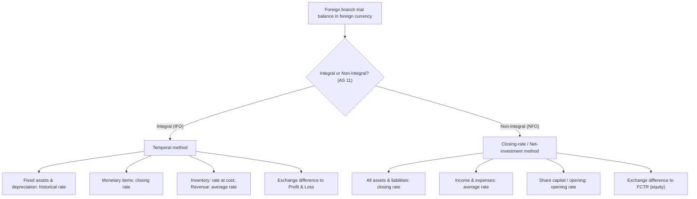

# Q&A — Branch Accounts (including Foreign Branches)

*CA Intermediate — Advanced Accounting. All figures in Rupees (Rs.). Aligned to ICAI study material and AS 11 (The Effects of Changes in Foreign Exchange Rates).*

---

## SECTION A — Concept Check (Short Answer)

**A1. What are the three broad categories of branches for accounting purposes?**
Answer: (i) **Dependent branches** — do not maintain full double-entry books; Head Office (H.O.) keeps their accounts (Debtors System, Stock & Debtors System, Final Accounts System, Wholesale Branch System). (ii) **Independent branches** — maintain complete double-entry books and prepare their own Trial Balance. (iii) **Foreign branches** — independent branches located abroad; their figures must be translated into the reporting currency using AS 11.

**A2. Under the Debtors System, why is the Branch Account not a real ledger account but a memorandum profit-finding device?**
Answer: The Branch Account is prepared in the H.O. books to **ascertain branch profit/loss**. It is debited with opening assets and everything sent to the branch, and credited with closing assets and remittances; the balancing figure is profit or loss. It behaves like a nominal account for profit computation, not a running control ledger.

**A3. When goods are invoiced to a branch at cost plus a loading, what two adjustments are needed to compute true profit?**
Answer: (i) Load on **opening stock** must be removed (added back to profit via Stock Reserve released), and (ii) load on **closing stock** must be created as a **Stock Reserve** (deducted from profit). Only the loading portion is eliminated; branch profit is measured at cost.

**A4. State the AS 11 classification that governs foreign branch translation and name the two branch types.**
Answer: AS 11 classifies foreign operations as **Integral Foreign Operations (IFO)** and **Non-Integral Foreign Operations (NFO)**. IFO uses the **temporal method**; NFO uses the **closing-rate/net-investment method**.

**A5. How is the exchange difference treated for an Integral vs a Non-Integral foreign operation?**
Answer: For an **Integral** operation, exchange differences are recognised in the **Profit & Loss Account**. For a **Non-Integral** operation, exchange differences are accumulated in a **Foreign Currency Translation Reserve (FCTR)** under equity until disposal.

**A6. Under the temporal method, at what rates are (a) fixed assets & depreciation, (b) monetary items, (c) opening/closing stock, and (d) revenue items translated?**
Answer: (a) Fixed assets and their depreciation — **historical rate**; (b) monetary items (cash, debtors, creditors, loans) — **closing rate**; (c) inventory (a non-monetary item carried at cost) — **historical/rate at acquisition**; (d) revenue/expense items — **average rate**.

**A7. Under the net-investment (closing rate) method, how are assets, liabilities, income/expenses and share capital translated?**
Answer: **All assets and liabilities** (monetary and non-monetary) at the **closing rate**; **income and expenses** at **average rate** (or actual); **opening balances/share capital & reserves** at rates when they arose (opening rate). The balancing difference goes to **FCTR**.

**A8. What is the Wholesale Branch System and why is a Stock Reserve created for the profit element?**
Answer: When H.O. sells to branches at **wholesale price** (below retail), the branch's retail margin represents the branch's genuine trading profit, while any unrealised profit in unsold branch stock (difference between wholesale and cost) must be eliminated via a **Stock Reserve**, so H.O. does not book profit on goods still unsold.

**A9. Distinguish "goods in transit" and "cash in transit" and their treatment while reconciling Branch and H.O. current accounts.**
Answer: Both arise from timing differences. **Goods in transit** — dispatched by H.O. but not yet received by branch; **Cash in transit** — remitted by branch but not yet received by H.O. To reconcile, add the in-transit item to whichever side has not recorded it so the two current accounts agree before consolidation.

**A10. In the Final Accounts System of a dependent branch, at what value are goods sent to branch recorded in H.O.'s Branch Trading Account?**
Answer: At **invoice price** (cost + loading), with the loading later removed through a **Stock Reserve adjustment**, so the consolidated result reflects cost.

---

## SECTION B — Graded Computational Problems (Full Solutions)

### B1 (Easy) — Debtors System, goods at cost

Mumbai H.O. supplies goods to its Pune branch at **cost**. From the following, prepare the **Pune Branch Account** for the year ended 31.3.2026 and find branch profit.

| Particulars | Rs. |
|---|---|
| Opening stock at branch | 30,000 |
| Opening branch debtors | 24,000 |
| Goods sent to branch | 2,10,000 |
| Cash sales at branch | 1,50,000 |
| Credit sales at branch | 1,20,000 |
| Cash received from debtors | 1,14,000 |
| Branch expenses paid by H.O. | 42,000 |
| Closing stock at branch | 45,000 |
| Closing branch debtors | 30,000 |

**Solution — Pune Branch Account (in H.O. books)**

| Dr. | Rs. | Cr. | Rs. |
|---|---|---|---|
| To Opening stock | 30,000 | By Cash sales | 1,50,000 |
| To Opening debtors | 24,000 | By Cash from debtors | 1,14,000 |
| To Goods sent to branch | 2,10,000 | By Closing stock | 45,000 |
| To Bank (expenses) | 42,000 | By Closing debtors | 30,000 |
| To Net Profit (bal. fig.) | 33,000 | | |
| **Total** | **3,39,000** | **Total** | **3,39,000** |

**Working — cross-check of debtors (memorandum):** Opening 24,000 + Credit sales 1,20,000 − Cash received 1,14,000 = **30,000** = closing debtors. Consistent.
**Branch Profit = Rs. 33,000.**

---

### B2 (Easy–Moderate) — Stock & Debtors System, goods at invoice price (cost + 25%)

Delhi H.O. invoices goods to Agra branch at **cost plus 25%**. Prepare Branch Stock A/c, Branch Adjustment A/c and Branch P&L A/c.

| Particulars | Rs. (at invoice price unless stated) |
|---|---|
| Opening stock (invoice) | 60,000 |
| Goods sent (invoice) | 3,00,000 |
| Cash sales | 1,80,000 |
| Credit sales | 1,50,000 |
| Closing stock (invoice) | 75,000 |
| Branch expenses (paid by H.O.) | 24,000 |

Loading = 25/125 = **1/5 of invoice price**.

**Branch Stock Account**

| Dr. | Rs. | Cr. | Rs. |
|---|---|---|---|
| To Opening stock | 60,000 | By Cash sales | 1,80,000 |
| To Goods sent | 3,00,000 | By Credit sales | 1,50,000 |
| | | By Closing stock | 75,000 |
| To Surplus (bal. fig.) | 45,000 | | |
| **Total** | **4,05,000** | **Total** | **4,05,000** |

The Rs. 45,000 surplus is a **stock-taking surplus** transferred to Branch Adjustment A/c (extra selling margin over invoice price).

**Branch Adjustment Account** (removes loading, records gross profit)

| Dr. | Rs. | Cr. | Rs. |
|---|---|---|---|
| To Stock Reserve (closing load 1/5 × 75,000) | 15,000 | By Stock Reserve (opening load 1/5 × 60,000) | 12,000 |
| To Gross Profit c/d (bal. fig.) | 84,000 | By Loading on goods sent (1/5 × 3,00,000) | 60,000 |
| | | By Surplus from Branch Stock | 45,000 |
| **Total** | **99,000** | **Total** | **1,17,000** |

Wait — Dr must equal Cr. Recompute Gross Profit as balancing figure: Cr total = 12,000 + 60,000 + 45,000 = 1,17,000; Dr fixed = 15,000; Gross Profit c/d = 1,17,000 − 15,000 = **1,02,000**.

**Corrected Branch Adjustment Account**

| Dr. | Rs. | Cr. | Rs. |
|---|---|---|---|
| To Stock Reserve (closing) | 15,000 | By Stock Reserve (opening) | 12,000 |
| To Gross Profit c/d | 1,02,000 | By Loading on goods sent | 60,000 |
| | | By Branch Stock surplus | 45,000 |
| **Total** | **1,17,000** | **Total** | **1,17,000** |

**Branch Profit & Loss Account**

| Dr. | Rs. | Cr. | Rs. |
|---|---|---|---|
| To Branch expenses | 24,000 | By Gross Profit b/d | 1,02,000 |
| To Net Profit (bal. fig.) | 78,000 | | |
| **Total** | **1,02,000** | **Total** | **1,02,000** |

**Branch Net Profit = Rs. 78,000.** Closing Stock Reserve carried in Balance Sheet = Rs. 15,000.

---

### B3 (Moderate) — Independent Branch, incorporation of Trial Balance & reconciliation

Kolkata branch keeps its own books. On 31.3.2026, the **Branch Current A/c in H.O. books shows Rs. 2,10,000 (Dr)** while the **H.O. Current A/c in branch books shows Rs. 1,86,000 (Cr)**. Reconcile, given:
(i) Goods Rs. 15,000 sent by H.O. not yet received by branch;
(ii) Cash Rs. 9,000 remitted by branch not yet received by H.O.

**Reconciliation Statement**

| Particulars | H.O. books (Branch Current A/c) Rs. | Branch books (H.O. Current A/c) Rs. |
|---|---|---|
| Balance as given | 2,10,000 (Dr) | 1,86,000 (Cr) |
| Add: Goods in transit (branch to record as received) | — | +15,000 |
| Add: Cash in transit (H.O. to record as received) | −9,000 | — |
| **Adjusted balance** | **2,01,000** | **2,01,000** |

Both current accounts now agree at **Rs. 2,01,000** — mirror-image balances. On consolidation these two contra balances cancel; goods-in-transit Rs. 15,000 and cash-in-transit Rs. 9,000 appear as assets in the combined Balance Sheet.

---

### B4 (Exam-Hard) — Dependent Branch Final Accounts (invoice price) with full Balance Sheet

Chennai H.O. invoices goods to Salem branch at **cost + 20%**. Prepare the **Branch Trading & P&L Account** and the **Branch portion of the Balance Sheet** as on 31.3.2026.

| Particulars | Rs. |
|---|---|
| Stock at branch (1.4.2025) at invoice price | 1,08,000 |
| Branch debtors (1.4.2025) | 72,000 |
| Petty cash at branch (1.4.2025) | 3,000 |
| Goods sent to branch at invoice price | 6,00,000 |
| Goods returned by branch to H.O. (invoice price) | 30,000 |
| Cash sales | 3,60,000 |
| Credit sales | 3,90,000 |
| Cash received from debtors | 3,66,000 |
| Discount allowed to debtors | 6,000 |
| Bad debts written off | 4,000 |
| Salaries & wages (remitted by H.O.) | 60,000 |
| Rent & rates (remitted by H.O.) | 24,000 |
| Stock at branch (31.3.2026) at invoice price | 1,20,000 |
| Petty cash at branch (31.3.2026) | 2,000 |

Loading = 20/120 = **1/6 of invoice price**.

**Step 1 — Memorandum Branch Debtors Account (to derive closing debtors)**

| Dr. | Rs. | Cr. | Rs. |
|---|---|---|---|
| To Balance b/d | 72,000 | By Cash received | 3,66,000 |
| To Credit sales | 3,90,000 | By Discount allowed | 6,000 |
| | | By Bad debts | 4,000 |
| | | By Balance c/d (bal. fig.) | 86,000 |
| **Total** | **4,62,000** | **Total** | **4,62,000** |

Closing debtors = **Rs. 86,000**.

**Step 2 — Branch Trading Account (at invoice price)** for the year ended 31.3.2026

| Dr. | Rs. | Cr. | Rs. |
|---|---|---|---|
| To Opening stock | 1,08,000 | By Cash sales | 3,60,000 |
| To Goods sent to branch | 6,00,000 | By Credit sales | 3,90,000 |
| Less: Goods returned (30,000) | 5,70,000 | By Closing stock | 1,20,000 |
| To Gross Profit c/d (bal. fig.) | 1,92,000 | | |
| **Total** | **8,70,000** | **Total** | **8,70,000** |

**Step 3 — Branch Profit & Loss Account**

First remove the loading so profit is at cost.

*Loading adjustments (via Stock Reserve):*
- Load on opening stock = 1/6 × 1,08,000 = Rs. 18,000 (credited — released)
- Load on closing stock = 1/6 × 1,20,000 = Rs. 20,000 (debited — created)
- Load on net goods sent = 1/6 × 5,70,000 = Rs. 95,000 (credited — this is H.O.'s unrealised loading loaded into GP)

| Dr. | Rs. | Cr. | Rs. |
|---|---|---|---|
| To Discount allowed | 6,000 | By Gross Profit b/d | 1,92,000 |
| To Bad debts | 4,000 | By Stock Reserve (opening load released) | 18,000 |
| To Salaries & wages | 60,000 | By Loading on net goods sent | 95,000 |
| To Rent & rates | 24,000 | | |
| To Stock Reserve (closing load) | 20,000 | | |
| To Net Profit to H.O. P&L (bal. fig.) | 1,91,000 | | |
| **Total** | **3,05,000** | **Total** | **3,05,000** |

**Branch true Net Profit = Rs. 1,91,000.**

**Step 4 — Balance Sheet extract (Branch assets) as on 31.3.2026**

| Assets | Rs. |
|---|---|
| Closing stock (invoice 1,20,000 − Stock Reserve 20,000) at cost | 1,00,000 |
| Branch debtors | 86,000 |
| Petty cash at branch | 2,000 |
| **Total branch assets (at cost)** | **1,88,000** |

*Check of internal consistency:* Petty cash movement — opening 3,000 + cash sales 3,60,000 + cash from debtors 3,66,000 − remittances/expenses. Expenses (salaries 60,000 + rent 24,000) are remitted by H.O., so branch cash is remitted to H.O. Closing petty cash Rs. 2,000 is given and used directly. Stock at cost Rs. 1,00,000 ties to the Rs. 20,000 reserve created. Figures reconcile.

---

### B5 (Exam-Hard) — Non-Integral Foreign Branch translation (closing rate method) with FCTR

New York branch of a Mumbai company is a **Non-Integral Foreign Operation**. Its Trial Balance on 31.3.2026 is in US $. Translate using: opening rate Rs. 82, average rate Rs. 84, closing rate Rs. 86; fixed assets acquired when rate was Rs. 80. Prepare the translated Balance Sheet and compute FCTR.

**Trial Balance (US $)**

| Debit | $ | Credit | $ |
|---|---|---|---|
| Fixed assets | 40,000 | Head Office A/c | 50,000 |
| Stock (31.3.26) | 12,000 | Sundry creditors | 8,000 |
| Sundry debtors | 15,000 | Profit & Loss (net profit) | 14,000 |
| Cash & bank | 5,000 | | |
| **Total** | **72,000** | **Total** | **72,000** |

**Translation (Closing Rate / Net-Investment Method — NFO)**

| Item | $ | Rate (Rs.) | Rs. |
|---|---|---|---|
| Fixed assets | 40,000 | 86 (closing) | 34,40,000 |
| Stock | 12,000 | 86 (closing) | 10,32,000 |
| Sundry debtors | 15,000 | 86 (closing) | 12,90,000 |
| Cash & bank | 5,000 | 86 (closing) | 4,30,000 |
| **Total assets** | **72,000** | | **61,92,000** |
| Head Office A/c | 50,000 | 82 (opening/actual) | 41,00,000 |
| Sundry creditors | 8,000 | 86 (closing) | 6,88,000 |
| Profit & Loss | 14,000 | 84 (average) | 11,76,000 |
| Sub-total (credits before FCTR) | | | 59,64,000 |
| **FCTR (balancing figure)** | | | **2,28,000 (Cr)** |
| **Total** | **72,000** | | **61,92,000** |

**Translated Balance Sheet (Rs.)**

| Liabilities | Rs. | Assets | Rs. |
|---|---|---|---|
| Head Office A/c | 41,00,000 | Fixed assets | 34,40,000 |
| Profit & Loss | 11,76,000 | Stock | 10,32,000 |
| Foreign Currency Translation Reserve | 2,28,000 | Sundry debtors | 12,90,000 |
| Sundry creditors | 6,88,000 | Cash & bank | 4,30,000 |
| **Total** | **61,92,000** | **Total** | **61,92,000** |

**Balance Sheet balances at Rs. 61,92,000.** Under the NFO method, the Rs. 2,28,000 exchange difference is **credited to FCTR** (equity), not routed through P&L.

---

### B6 (Exam-Hard) — Integral Foreign Branch (temporal method) with exchange difference in P&L

The same $ Trial Balance in B5, but now the branch is an **Integral Foreign Operation**. Additional data: opening stock $10,000 (rate Rs. 81); depreciation on fixed assets $4,000 (already inside net profit; historical rate Rs. 80); closing stock $12,000 valued at rate Rs. 85 (rate at purchase). Translate and locate the exchange difference in the P&L.

**Translation (Temporal Method — IFO)**

| Item | $ | Basis | Rate (Rs.) | Rs. |
|---|---|---|---|---|
| Fixed assets | 40,000 | Non-monetary, historical | 80 | 32,00,000 |
| Stock (closing) | 12,000 | Non-monetary, at cost rate | 85 | 10,20,000 |
| Sundry debtors | 15,000 | Monetary | 86 (closing) | 12,90,000 |
| Cash & bank | 5,000 | Monetary | 86 (closing) | 4,30,000 |
| **Total assets** | | | | **59,40,000** |
| Head Office A/c | 50,000 | At H.O. book value | (given) | 41,00,000 |
| Sundry creditors | 8,000 | Monetary | 86 (closing) | 6,88,000 |
| Profit & Loss (see below) | 14,000 | Derived | — | 11,52,000 |
| **Total credits** | | | | **59,40,000** |

Under the temporal method the **exchange difference goes to the P&L**, so P&L is the **balancing figure** on the credit side: 59,40,000 − 41,00,000 − 6,88,000 = **Rs. 11,52,000**.

**Balance Sheet (Integral branch, Rs.)**

| Liabilities | Rs. | Assets | Rs. |
|---|---|---|---|
| Head Office A/c | 41,00,000 | Fixed assets | 32,00,000 |
| Profit & Loss (incl. exchange diff.) | 11,52,000 | Stock | 10,20,000 |
| Sundry creditors | 6,88,000 | Sundry debtors | 12,90,000 |
| | | Cash & bank | 4,30,000 |
| **Total** | **59,40,000** | **Total** | **59,40,000** |

**Balances at Rs. 59,40,000.** Because there is **no FCTR** in the temporal method, the entire translation gain/loss is absorbed inside the reported P&L figure of Rs. 11,52,000.

---

## SECTION C — Past-Paper-Style Full Questions

### C1 — Dependent branch, Stock & Debtors System with abnormal loss (ICAI-style)

Jaipur H.O. invoices goods to Udaipur branch at **cost + 33⅓%**. During 2025-26: Opening stock (invoice) Rs. 90,000; Goods sent (invoice) Rs. 5,40,000; Goods pilfered in transit (invoice) Rs. 12,000 (no insurance); Cash sales Rs. 4,20,000; Credit sales Rs. 1,80,000; Closing stock (invoice) Rs. 96,000; Branch expenses Rs. 40,000. Prepare Branch Stock, Branch Adjustment and Branch P&L Accounts.

Loading = 33⅓/133⅓ = **1/4 of invoice price**.

**Branch Stock Account**

| Dr. | Rs. | Cr. | Rs. |
|---|---|---|---|
| To Opening stock | 90,000 | By Cash sales | 4,20,000 |
| To Goods sent | 5,40,000 | By Credit sales | 1,80,000 |
| | | By Goods pilfered (invoice) | 12,000 |
| | | By Closing stock | 96,000 |
| To Surplus (bal. fig.) | 78,000 | | |
| **Total** | **7,08,000** | **Total** | **7,08,000** |

**Branch Adjustment Account** (loading = 1/4)

| Dr. | Rs. | Cr. | Rs. |
|---|---|---|---|
| To Stock Reserve (closing 1/4 × 96,000) | 24,000 | By Stock Reserve (opening 1/4 × 90,000) | 22,500 |
| To Loading on pilfered goods (1/4 × 12,000) | 3,000 | By Loading on goods sent (1/4 × 5,40,000) | 1,35,000 |
| To Gross Profit c/d (bal. fig.) | 2,08,500 | By Surplus from Branch Stock | 78,000 |
| **Total** | **2,35,500** | **Total** | **2,35,500** |

**Branch Profit & Loss Account**

| Dr. | Rs. | Cr. | Rs. |
|---|---|---|---|
| To Branch expenses | 40,000 | By Gross Profit b/d | 2,08,500 |
| To Cost of pilfered goods (12,000 − 3,000 load) | 9,000 | | |
| To Net Profit (bal. fig.) | 1,59,500 | | |
| **Total** | **2,08,500** | **Total** | **2,08,500** |

**Branch Net Profit = Rs. 1,59,500.** The abnormal loss is charged **at cost (Rs. 9,000)** to P&L; its loading (Rs. 3,000) is separately reversed in the Adjustment A/c so no unrealised profit is booked on pilfered goods.

---

### C2 — Independent branch incorporation entries (ICAI-style)

State the journal entries in **H.O. books** to incorporate the branch Trading and P&L result and to close the Branch Current A/c, given: Branch net profit Rs. 1,20,000; branch closing stock Rs. 2,00,000 (carried in branch B/S); depreciation on branch fixed assets (assets in H.O. books) Rs. 15,000.

**Model answer — H.O. journal entries:**

1. For branch net profit:
`Branch Current A/c ................ Dr. 1,20,000`
`   To Profit & Loss A/c ....................... 1,20,000`
(Branch profit incorporated in H.O. accounts.)

2. For depreciation on branch fixed assets kept in H.O. books:
`Profit & Loss A/c (or Branch Current A/c) .. Dr. 15,000`
`   To Branch Fixed Assets A/c ............... 15,000`
(Depreciation charged; if the asset is in H.O. books the charge is made in H.O. and reduces branch profit via Branch Current A/c.)

**Note:** Branch closing stock stays in the **branch balance sheet**; on consolidation the reciprocal Branch Current and H.O. Current accounts are **cancelled** and only external assets/liabilities remain. No separate incorporation entry is needed for an item already sitting in the branch's own books unless the asset register is centralised at H.O.

---

## SECTION D — MCQs & Case Scenarios

**D1.** Goods invoiced to branch at cost + 25%. Closing branch stock at invoice = Rs. 1,00,000. Stock Reserve required is:
A) Rs. 25,000  B) Rs. 20,000  C) Rs. 16,667  D) Rs. 12,500
**Answer: B) Rs. 20,000.** Load = 25/125 = 1/5; 1/5 × 1,00,000 = Rs. 20,000.

**D2.** For a **Non-Integral** foreign operation, all assets and liabilities are translated at the:
A) historical rate  B) average rate  C) closing rate  D) opening rate
**Answer: C) Closing rate.** The net-investment method uses the closing rate for the whole balance sheet.

**D3.** Under the **temporal method**, the exchange difference is:
A) taken to FCTR  B) taken to P&L  C) capitalised in fixed assets  D) ignored
**Answer: B) P&L.** Integral operations recognise the difference immediately in profit or loss.

**D4.** In the Debtors System, the Branch Account is credited with:
A) goods sent to branch  B) opening debtors  C) closing stock and closing debtors  D) branch expenses
**Answer: C) Closing stock and closing debtors.** Closing assets and remittances are credited to derive profit.

**D5.** FCTR appears in the balance sheet under:
A) non-current assets  B) reserves & surplus (equity)  C) current liabilities  D) P&L expense
**Answer: B) Reserves & surplus.** FCTR is an equity item until the foreign operation is disposed of.

**D6 (Case).** A branch that merely displays and sells goods supplied by H.O., remits all cash daily, and depends wholly on H.O. for financing and pricing is best classified as:
A) Independent branch  B) Non-Integral foreign operation  C) Dependent (Integral) branch  D) Joint venture
**Answer: C) Dependent (Integral) branch.** Total dependence on H.O. for stock, cash and pricing is the hallmark of an integral/dependent branch.

**D7.** Load on **opening stock** in Branch Adjustment A/c is:
A) debited (created)  B) credited (released)  C) ignored  D) added to closing reserve
**Answer: B) Credited (released).** Last year's reserve is written back this year, increasing current gross profit.

---

## Mermaid — Foreign Branch translation decision path

---

## Exam pointers (quick recap)

- Load fraction: cost + x% → load = x/(100+x) of **invoice** price. (25%→1/5, 20%→1/6, 33⅓%→1/4, 50%→1/3.)
- Always create closing Stock Reserve (Dr Branch P&L / Cr Stock Reserve) and release opening Stock Reserve.
- Abnormal loss: charge **cost** to P&L, reverse the **loading** in Branch Adjustment A/c.
- Reconcile Branch Current and H.O. Current for goods/cash in transit **before** consolidating; the reciprocals then cancel.
- Foreign branch: decide IFO vs NFO first — it dictates rates and where the exchange difference lands (P&L vs FCTR).
