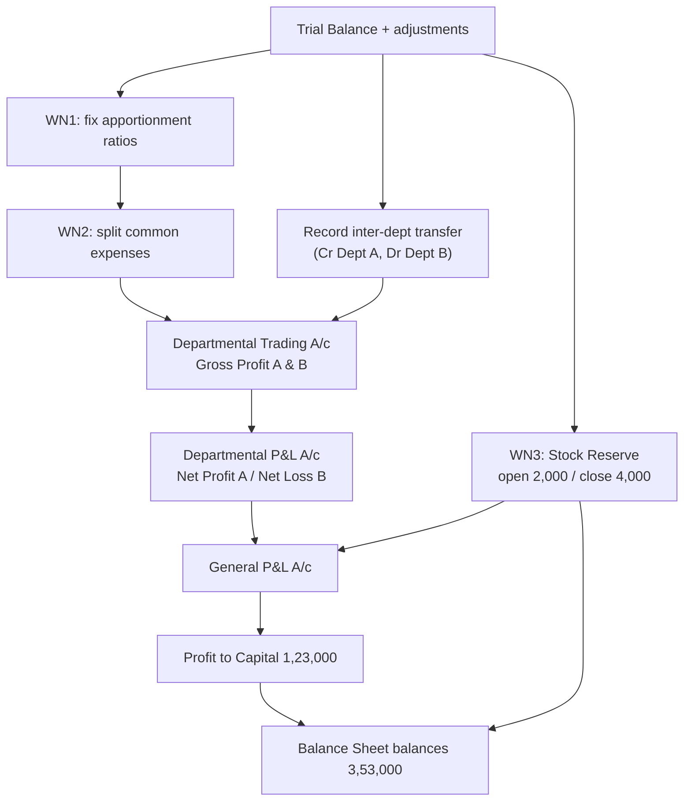

# Q&A — Departmental Accounts

> CA Intermediate — Advanced Accounting. Currency: Indian Rupees (Rs). All treatments per ICAI study material. No invented provisions; every problem self-reconciles and every Balance Sheet balances.

---

## SECTION A — Concept Check (short theory)

**A1. Why prepare Departmental Accounts at all when a combined P&L already shows total profit?**
A combined account hides which department earns and which drains. Departmental accounts show department-wise gross profit and net profit, so management can judge each department's performance, fix inter-departmental transfer prices, decide expansion or closure, reward staff on department results, and control department-wise costs. It is *internal* segment reporting inside one set of books.

**A2. Distinguish Departmental Accounts from Branch Accounts.**
Departments are all under **one roof, one set of books**, with results split by columnar analysis. Branches are **geographically separate**, may keep their own books, and require reconciliation/consolidation. Departmental accounting apportions common expenses among departments; branch accounting tracks goods sent to branch, remittances and branch stock.

**A3. State the two categories of expenses in departmental accounting and their treatment.**
(i) **Directly allocable expenses** — traceable to a department (e.g., department wages, direct purchases) — charged wholly to that department. (ii) **Common / indirect expenses** — cannot be traced (rent, general salaries, advertisement) — **apportioned** among departments on an equitable basis.

**A4. Give the standard basis of apportionment for: rent, lighting, selling expenses, carriage inward, depreciation of plant, works manager's salary.**
- Rent, rates, repairs of building, lighting → **floor area / space occupied**.
- Selling expenses, advertisement, salesmen salary, discount allowed, bad debts → **sales ratio** (turnover).
- Carriage inward, discount received → **purchases ratio**.
- Depreciation, insurance and repairs of plant → **value of assets** in each department.
- Works manager's / supervisor's salary → **time devoted** to each department.

**A5. What are inter-departmental transfers and at what price are they made?**
Goods/services supplied by one department to another. They may be transferred at **(a) cost price**, or **(b) transfer price = cost + a loading (mark-up)** so the supplying department earns a notional profit. Transfers are recorded on the credit of the supplying department and debit of the receiving department in the Departmental Trading Account.

**A6. Why is a Stock Reserve (unrealised profit reserve) needed?**
When goods are transferred at a price above cost and remain **unsold in closing stock** of the receiving department, that stock carries **unrealised (internal) profit**. For the firm as a whole no profit is earned until goods are sold outside. So a **Stock Reserve** is created to eliminate the unrealised profit from closing stock, reducing profit and stock value.

**A7. Formula for unrealised profit when transfer price = cost + mark-up %.**
Unrealised profit = Value of transferred goods in closing stock × (Mark-up % ÷ (100 + Mark-up %)).
Example: cost + 25% ⇒ loading fraction = 25/125 = 1/5 of transfer value.

**A8. Where is the Stock Reserve shown?**
In the **General Profit & Loss Account** (create closing reserve → debit; write back opening reserve → credit) and in the **Balance Sheet** as a **deduction from closing stock** on the assets side.

**A9. What is a "General Profit & Loss Account" in departmental accounting?**
After each department's net profit/loss is found, purely firm-level items (opening/closing stock reserve on inter-departmental profit, and any expenses/incomes not apportionable) are dealt with in a General P&L Account. Its balance is the net profit transferred to the Capital / Balance Sheet.

**A10. If a department shows a net loss, should it automatically be closed?**
No. One must check whether the department covers its **avoidable (direct) costs** and contributes toward common fixed costs. A department may show a loss only after loading a share of unavoidable common expenses; closing it may raise those common costs on the remaining departments. Decision needs marginal/contribution analysis, not the departmental net loss alone.

---

## SECTION B — Graded Computational Problems

### B1 (Easy) — Choosing the basis of apportionment

Common expenses for the year: Rent Rs 24,000; Advertisement Rs 15,000; Carriage inward Rs 6,000. Floor area A:B = 3:1; Sales A:B = 3:2; Purchases A:B = 2:1. Apportion each.

**Solution.**
| Expense | Basis | Ratio | Dept A | Dept B |
|---|---|---|---:|---:|
| Rent | Floor area | 3:1 | 18,000 | 6,000 |
| Advertisement | Sales | 3:2 | 9,000 | 6,000 |
| Carriage inward | Purchases | 2:1 | 4,000 | 2,000 |

Rent 24,000×3/4 = 18,000; ×1/4 = 6,000. Advertisement 15,000×3/5 = 9,000; ×2/5 = 6,000. Carriage 6,000×2/3 = 4,000; ×1/3 = 2,000. **Total apportioned Rs 45,000 = 31,000 (A) + 14,000 (B).** ✓

---

### B2 (Easy) — Columnar Departmental Trading Account

| Particulars | Dept A | Dept B |
|---|---:|---:|
| Opening stock | 10,000 | 8,000 |
| Purchases | 60,000 | 40,000 |
| Direct wages | 6,000 | 4,000 |
| Sales | 90,000 | 60,000 |
| Closing stock | 12,000 | 9,000 |

**Solution — Departmental Trading Account**
| Dr | Dept A | Dept B | Cr | Dept A | Dept B |
|---|---:|---:|---|---:|---:|
| To Opening stock | 10,000 | 8,000 | By Sales | 90,000 | 60,000 |
| To Purchases | 60,000 | 40,000 | By Closing stock | 12,000 | 9,000 |
| To Wages | 6,000 | 4,000 | | | |
| To Gross profit c/d | **26,000** | **17,000** | | | |
| | 1,02,000 | 69,000 | | 1,02,000 | 69,000 |

GP(A) = (90,000+12,000) − (10,000+60,000+6,000) = 26,000. GP(B) = (60,000+9,000) − (8,000+40,000+4,000) = 17,000. **Total GP Rs 43,000.** ✓

---

### B3 (Moderate) — Stock Reserve on inter-departmental transfer

Dept P transfers goods to Dept Q at **cost + 25%**. Q's closing stock includes Rs 15,000 (at transfer price) of goods received from P. Compute the Stock Reserve and show its Balance Sheet effect.

**Solution.**
Loading fraction = 25/(100+25) = 25/125 = **1/5**.
Unrealised profit = 15,000 × 1/5 = **Rs 3,000** = Stock Reserve required.
- General P&L Account: *To Stock Reserve A/c Rs 3,000* (reduces profit).
- Balance Sheet (Assets): Closing stock shown as (Total stock − Rs 3,000).

If transfer had been **at cost**, unrealised profit = **Nil**, so **no** stock reserve. This is the examiner's favourite contrast.

---

### B4 (Moderate–Hard) — Departmental Trading & P&L with apportionment

M/s Twin Traders has two departments X and Y (no inter-departmental transfer).

Data: Opening stock X 22,000, Y 18,000; Purchases X 1,00,000, Y 80,000; Direct wages X 12,000, Y 8,000; Sales X 1,80,000, Y 1,20,000; Closing stock X 30,000, Y 24,000. Common: Salaries Rs 30,000 (employees 3:2), Rent Rs 20,000 (area 3:1), Selling expenses Rs 15,000 (sales), Carriage inward Rs 4,500 (purchases 5:4).

**Solution — Apportionment (Working Note)**
| Item | Basis | Ratio | X | Y |
|---|---|---|---:|---:|
| Salaries | Employees | 3:2 | 18,000 | 12,000 |
| Rent | Area | 3:1 | 15,000 | 5,000 |
| Selling exp | Sales | 3:2 | 9,000 | 6,000 |
| Carriage inward | Purchases | 5:4 | 2,500 | 2,000 |

**Departmental Trading & Profit and Loss Account**
| Particulars | X | Y | Particulars | X | Y |
|---|---:|---:|---|---:|---:|
| To Opening stock | 22,000 | 18,000 | By Sales | 1,80,000 | 1,20,000 |
| To Purchases | 1,00,000 | 80,000 | By Closing stock | 30,000 | 24,000 |
| To Wages | 12,000 | 8,000 | | | |
| To Carriage inward | 2,500 | 2,000 | | | |
| To Gross profit c/d | **73,500** | **36,000** | | | |
| | 2,10,000 | 1,44,000 | | 2,10,000 | 1,44,000 |
| To Salaries | 18,000 | 12,000 | By Gross profit b/d | 73,500 | 36,000 |
| To Rent | 15,000 | 5,000 | | | |
| To Selling expenses | 9,000 | 6,000 | | | |
| To Net profit | **31,500** | **13,000** | | | |
| | 73,500 | 36,000 | | 73,500 | 36,000 |

**Total net profit = 31,500 + 13,000 = Rs 44,500.** ✓ (Both columns balance.)

---

### B5 (Hard) — General P&L with opening and closing stock reserve

Combined departmental net profit for the year = Rs 1,25,000. Opening stock of the receiving department carried an unrealised profit reserve of **Rs 2,000** (brought forward). Closing stock of the receiving department carries unrealised profit of **Rs 4,000** (transfer at cost + 20%; goods in closing stock Rs 24,000 ⇒ 24,000 × 20/120 = 4,000). Prepare the General P&L Account and state the profit to Capital.

**Solution — General Profit & Loss Account**
| Dr | Rs | Cr | Rs |
|---|---:|---|---:|
| To Stock Reserve (closing) | 4,000 | By Net profit b/d (departments) | 1,25,000 |
| To Net profit transferred to Capital | **1,23,000** | By Stock Reserve (opening, written back) | 2,000 |
| | 1,27,000 | | 1,27,000 |

**Profit to Capital = Rs 1,23,000.** Net stock-reserve charge = 4,000 − 2,000 = Rs 2,000. ✓

---

## SECTION C — Past-paper-style full questions

### C1 (Exam-hard, full accounts) — Departments with inter-departmental transfer, Stock Reserve and Balance Sheet

The following Trial Balance of **M/s Departmental Stores** was extracted as on **31 March 2026**:

| Dr | Rs | Cr | Rs |
|---|---:|---|---:|
| Stock (1.4.2025): Dept A | 30,000 | Sales: Dept A | 3,00,000 |
| Stock (1.4.2025): Dept B | 20,000 | Sales: Dept B | 2,00,000 |
| Purchases: Dept A | 1,50,000 | Capital | 2,00,000 |
| Purchases: Dept B | 1,00,000 | Sundry creditors | 50,000 |
| Wages: Dept A | 24,000 | Discount received | 2,000 |
| Wages: Dept B | 16,000 | Stock Reserve (opening) | 2,000 |
| Carriage inwards | 5,000 | | |
| Salaries | 36,000 | | |
| Rent, rates & taxes | 30,000 | | |
| Advertisement | 15,000 | | |
| Insurance | 6,000 | | |
| General expenses | 12,000 | | |
| Discount allowed | 3,000 | | |
| Land & Building | 1,17,000 | | |
| Furniture & fittings | 60,000 | | |
| Sundry debtors | 70,000 | | |
| Cash at bank | 40,000 | | |
| Drawings | 20,000 | | |
| **Total** | **7,54,000** | **Total** | **7,54,000** |

**Additional information**
1. Closing stock (31.3.2026): Dept A Rs 40,000; Dept B Rs 30,000.
2. Dept A invoices goods to Dept B at **cost plus 20%**. During the year Dept A transferred goods of **transfer price Rs 60,000** to Dept B (not included in the sales/purchases figures above).
3. Dept B's closing stock of Rs 30,000 **includes Rs 24,000** of goods received from Dept A (at transfer price). Its opening stock included Rs 12,000 of such goods (hence the opening Stock Reserve of Rs 2,000 = 12,000 × 20/120).
4. Apportionment bases: Carriage inward & Discount received → purchases (3:2); Rent → floor area (2:1); Salaries, Advertisement, Insurance, General expenses, Discount allowed → sales (3:2).

**Required:** Departmental Trading & P&L Account, General P&L Account and Balance Sheet as at 31.3.2026.

---

**Working Note 1 — Ratios.** Sales A:B = 3,00,000:2,00,000 = **3:2**. Purchases A:B = 1,50,000:1,00,000 = **3:2**. Floor area = **2:1**.

**Working Note 2 — Apportionment**
| Item | Basis | A | B |
|---|---|---:|---:|
| Carriage inward 5,000 | Purchases 3:2 | 3,000 | 2,000 |
| Salaries 36,000 | Sales 3:2 | 21,600 | 14,400 |
| Rent 30,000 | Area 2:1 | 20,000 | 10,000 |
| Advertisement 15,000 | Sales 3:2 | 9,000 | 6,000 |
| Insurance 6,000 | Sales 3:2 | 3,600 | 2,400 |
| General exp 12,000 | Sales 3:2 | 7,200 | 4,800 |
| Discount allowed 3,000 | Sales 3:2 | 1,800 | 1,200 |
| Discount received 2,000 | Purchases 3:2 | 1,200 | 800 |

**Working Note 3 — Stock Reserve.** Loading = 20/120 = 1/6. Closing reserve = 24,000 × 1/6 = **Rs 4,000**. Opening reserve (given) = **Rs 2,000**.

---

**Departmental Trading & Profit and Loss Account for the year ended 31 March 2026**

| Particulars | Dept A | Dept B | Particulars | Dept A | Dept B |
|---|---:|---:|---|---:|---:|
| To Opening stock | 30,000 | 20,000 | By Sales | 3,00,000 | 2,00,000 |
| To Purchases | 1,50,000 | 1,00,000 | By Transfer to Dept B | 60,000 | — |
| To Transfer from Dept A | — | 60,000 | By Closing stock | 40,000 | 30,000 |
| To Wages | 24,000 | 16,000 | | | |
| To Carriage inward | 3,000 | 2,000 | | | |
| To Gross profit c/d | **1,93,000** | **32,000** | | | |
| | 4,00,000 | 2,30,000 | | 4,00,000 | 2,30,000 |
| To Salaries | 21,600 | 14,400 | By Gross profit b/d | 1,93,000 | 32,000 |
| To Rent, rates & taxes | 20,000 | 10,000 | By Discount received | 1,200 | 800 |
| To Advertisement | 9,000 | 6,000 | | | |
| To Insurance | 3,600 | 2,400 | | | |
| To General expenses | 7,200 | 4,800 | | | |
| To Discount allowed | 1,800 | 1,200 | By Net loss c/d | — | **6,000** |
| To Net profit c/d | **1,31,000** | — | | | |
| | 1,94,200 | 38,800 | | 1,94,200 | 38,800 |

Dept A net profit **Rs 1,31,000**; Dept B net loss **Rs 6,000**. Combined = **Rs 1,25,000**.

**General Profit and Loss Account**
| Dr | Rs | Cr | Rs |
|---|---:|---|---:|
| To Stock Reserve (closing) | 4,000 | By Net profit — Dept A | 1,31,000 |
| To Net profit transferred to Capital | **1,23,000** | By Stock Reserve (opening) written back | 2,000 |
| | | Less: Net loss — Dept B | (6,000) |
| | 1,27,000 | | 1,27,000 |

*(Departmental figures on the credit side: 1,31,000 − 6,000 = 1,25,000; plus opening reserve 2,000 = 1,27,000.)*

**Balance Sheet as at 31 March 2026**
| Liabilities | Rs | Assets | Rs |
|---|---:|---|---:|
| Capital 2,00,000 | | Land & Building | 1,17,000 |
| Add: Net profit 1,23,000 | | Furniture & fittings | 60,000 |
| Less: Drawings (20,000) | **3,03,000** | Closing stock 70,000 | |
| Sundry creditors | 50,000 | Less: Stock Reserve (4,000) | 66,000 |
| | | Sundry debtors | 70,000 |
| | | Cash at bank | 40,000 |
| **Total** | **3,53,000** | **Total** | **3,53,000** |

**Balance Sheet balances at Rs 3,53,000.** ✓ Every figure ties back to the Trial Balance and working notes.

**Solution-path diagram**

---

### C2 (Theory + short computation) — Transfer pricing effect on departmental profit

*"Explain how the choice of transfer price affects individual departmental profit but not the firm's total profit. Illustrate."*

**Model answer.** Transfer price only **redistributes** profit between departments; the firm's total profit changes only through the **unrealised profit locked in unsold inter-departmental stock**, which is neutralised by the Stock Reserve.

*Illustration.* Dept A's cost of goods = Rs 50,000; transferred to B at (i) cost, (ii) cost + 20% = Rs 60,000. B sells all outside for Rs 90,000; B's other costs Rs 5,000. Assume nothing is left in closing stock.

| | At cost | At cost + 20% |
|---|---:|---:|
| Dept A profit on transfer | 0 | 10,000 |
| Dept B profit (90,000 − transfer − 5,000) | 35,000 | 25,000 |
| **Firm total** | **35,000** | **35,000** |

Total is Rs 35,000 either way. Only when goods **remain in B's closing stock** does the loading create unrealised profit, removed via Stock Reserve — so firm profit is again unaffected. Hence transfer pricing is a **performance-measurement device**, not a profit-creating one.

---

## SECTION D — MCQs / Case scenarios

**D1.** Carriage inward is best apportioned on the basis of — (a) Floor area (b) Sales (c) **Purchases** (d) Number of employees.
**Ans (c).** Carriage inward is a cost of bringing in goods purchased.

**D2.** Goods transferred at cost + 25%; Rs 20,000 (transfer price) lies in closing stock. Stock Reserve = (a) Rs 5,000 (b) **Rs 4,000** (c) Rs 2,000 (d) Nil.
**Ans (b).** 20,000 × 25/125 = 4,000.

**D3.** If inter-departmental transfers are made **at cost**, the Stock Reserve required is — (a) 10% (b) 25% (c) **Nil** (d) equal to gross profit.
**Ans (c).** No loading ⇒ no unrealised profit.

**D4.** Stock Reserve appears in the Balance Sheet as — (a) a liability (b) **a deduction from closing stock** (c) part of capital (d) a contingent liability.
**Ans (b).** It nets down stock to true cost to the firm.

**D5.** Rent of building is apportioned on — (a) Sales (b) Purchases (c) **Floor area occupied** (d) Wages.
**Ans (c).** Space is the causal driver of rent.

**D6.** A department shows a net loss after absorbing apportioned unavoidable common costs. The correct managerial view is — (a) close it immediately (b) **retain if it earns a positive contribution toward common costs** (c) double its advertisement (d) merge with another firm.
**Ans (b).** Contribution, not absorbed net loss, drives the keep/close decision.

**D7. Case.** Dept M transfers to Dept N at cost + 33⅓%. Opening stock of N had Rs 8,000 and closing stock Rs 20,000 of M's goods (transfer price). Net charge to General P&L for stock reserve = ?
(a) Rs 5,000 (b) **Rs 3,000** (c) Rs 2,000 (d) Rs 7,000.
**Ans (b).** Loading = 33⅓/133⅓ = 1/4. Closing 20,000×1/4 = 5,000; opening 8,000×1/4 = 2,000; net charge = 5,000 − 2,000 = **3,000**.

**D8. Case.** Sales A:B = 4:1, and salaries Rs 25,000 are apportioned on sales. Dept B's share = (a) Rs 20,000 (b) Rs 12,500 (c) **Rs 5,000** (d) Rs 6,250.
**Ans (c).** 25,000 × 1/5 = 5,000.

---

*End of Q&A — Departmental Accounts. Every computational answer self-verifies; Section C1's Balance Sheet ties to Rs 3,53,000.*
