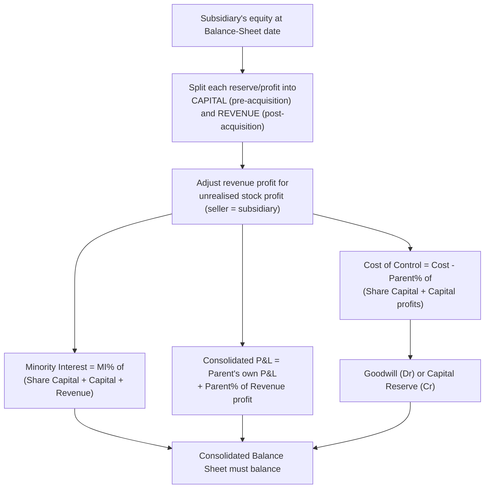

# Q&A — Consolidated Financial Statements (Holding Companies)

*CA Intermediate — Advanced Accounting | Standard: AS 21 | Currency: Rupees (Rs) | ICAI syllabus*

> Companion question bank to the concept chapter. Every question is immediately followed by a complete model answer. All balance sheets are self-verified and balance to the rupee.

---

## SECTION A — Concept-Check (short answer)

**A1. What is the objective of AS 21?**
To prescribe how a parent presents *Consolidated Financial Statements* (CFS) so that the group of a parent and its subsidiaries is shown as that of a *single economic entity*. AS 21 deals only with the *mechanics* of consolidation; it does not say *when* CFS are mandatory (that is governed by the Companies Act / listing rules).

**A2. Define "control" under AS 21.**
Control exists when the parent holds, directly or through subsidiaries, **more than one-half of the voting power** of an enterprise, **OR** controls the **composition of the Board of Directors** so as to obtain economic benefits. Either test is sufficient.

**A3. What is Minority Interest (MI)?**
That part of the net results of operations and of the net assets of a subsidiary attributable to interests **not owned** by the parent, directly or indirectly. Under AS 21 it is the minority's **proportionate share of the subsidiary's equity** (partial-goodwill approach — MI is *not* stated at fair value).

**A4. Distinguish capital (pre-acquisition) profits from revenue (post-acquisition) profits.**
Profits/reserves of the subsidiary existing **up to the date of acquisition** are *capital profits* — they are treated as part of net assets acquired and are used to compute Cost of Control and MI. Profits earned **after** the date of acquisition are *revenue profits* — the parent's share is added to the *Consolidated Profit & Loss*.

**A5. How is Goodwill / Capital Reserve on consolidation computed?**
`Cost of investment − Parent's share of net assets (share capital + capital profits) on the date of acquisition`. A positive figure is **Goodwill**; a negative figure is **Capital Reserve**. It is computed **once, at the date of acquisition**, and is not re-measured later.

**A6. How is a pre-acquisition dividend received by the parent treated?**
It is a **capital receipt** — credited to the **Investment account** (reduces cost), *not* to Profit & Loss. A dividend out of *post-acquisition* profits is revenue income and is credited to P&L.

**A7. Name four items eliminated on consolidation.**
(i) Cost of investment against the parent's share of subsidiary equity; (ii) mutual owings (inter-company debtors/creditors, loans, bills); (iii) unrealised profit on inter-company stock still held within the group; (iv) inter-company dividends and revenue transactions.

**A8. Who bears unrealised profit on stock — and how much?**
The whole unrealised profit is removed from **stock (inventory)** in the CFS. The corresponding charge is against the **selling company's** profit. If the **subsidiary is the seller**, the reduction falls on the subsidiary's revenue profit and is therefore **shared between the parent and MI**. If the **parent is the seller**, the full reduction falls on the parent alone.

**A9. What reporting-date and policy conditions does AS 21 impose?**
Financials used should be drawn to the **same reporting date** (a gap of not more than **6 months** is permitted with adjustments), and **uniform accounting policies** must be used; material differences require adjustment/disclosure.

**A10. Where are "Minority Interest" and "Goodwill on consolidation" shown in a Schedule III consolidated Balance Sheet?**
*Minority Interest* is disclosed as a **separate line item on the Equity & Liabilities side**, shown after Shareholders' Funds and before Non-current Liabilities. *Goodwill on consolidation* appears under **Non-current Assets (Fixed Assets — Intangible / Goodwill on consolidation)**.

---

## SECTION B — Graded Computational Problems (full workings)

### Problem B1 — Easy: acquisition on the Balance-Sheet date (all reserves are capital)

H Ltd acquired **75%** of S Ltd (7,500 of 10,000 equity shares of Rs 10 each) on **31 March 2026 (the balance-sheet date)** for **Rs 1,00,000**. Balance Sheets on that date:

| Rs | H Ltd | S Ltd | | H Ltd | S Ltd |
|---|---:|---:|---|---:|---:|
| **Equity & Liabilities** | | | **Assets** | | |
| Share Capital (Rs 10) | 3,00,000 | 1,00,000 | Investment in S | 1,00,000 | — |
| General Reserve | 80,000 | 30,000 | Sundry Assets | 3,80,000 | 1,75,000 |
| Profit & Loss | 60,000 | 20,000 | | | |
| Creditors | 40,000 | 25,000 | | | |
| **Total** | **4,80,000** | **1,75,000** | **Total** | **4,80,000** | **1,75,000** |

**Solution.** Because acquisition is *on* the balance-sheet date, **every reserve of S is pre-acquisition (capital)**.

*WN 1 — Net assets of S = capital profits base*
Share Capital 1,00,000 + General Reserve 30,000 + P&L 20,000 = **Rs 1,50,000**.

*WN 2 — Cost of Control*
| Rs | |
|---|---:|
| Cost of investment | 1,00,000 |
| Less: H's share of net assets 75% × 1,50,000 | (1,12,500) |
| **Capital Reserve** | **12,500** |

*WN 3 — Minority Interest* = 25% × 1,50,000 = **Rs 37,500**.

**Consolidated Balance Sheet of H Ltd and its subsidiary as at 31 March 2026**

| Equity & Liabilities | Rs | Assets | Rs |
|---|---:|---|---:|
| Share Capital | 3,00,000 | Sundry Assets (3,80,000 + 1,75,000) | 5,55,000 |
| Capital Reserve | 12,500 | | |
| General Reserve (H only) | 80,000 | | |
| Profit & Loss (H only) | 60,000 | | |
| Minority Interest | 37,500 | | |
| Creditors (40,000 + 25,000) | 65,000 | | |
| **Total** | **5,55,000** | **Total** | **5,55,000** |

**Balances at Rs 5,55,000.** ✓ (S's reserves vanish into Cost of Control + MI because they are all pre-acquisition.)

---

### Problem B2 — Medium: mid-year acquisition, pre/post split, Goodwill

H Ltd acquired **80%** of S Ltd (8,000 of 10,000 shares of Rs 10) on **1 October 2025** for **Rs 1,50,000**. Both close on 31 March 2026. S's **General Reserve Rs 20,000** existed on 1 April 2025 and is unchanged. S's P&L stood at **Rs 10,000** on 1 April 2025; profit for 2025-26 was **Rs 40,000, earned evenly**.

| Rs | H Ltd | S Ltd | | H Ltd | S Ltd |
|---|---:|---:|---|---:|---:|
| Share Capital (Rs 10) | 4,00,000 | 1,00,000 | Investment in S | 1,50,000 | — |
| General Reserve | 1,00,000 | 20,000 | Sundry Assets | 5,00,000 | 2,00,000 |
| Profit & Loss | 90,000 | 50,000 | | | |
| Creditors | 60,000 | 30,000 | | | |
| **Total** | **6,50,000** | **2,00,000** | **Total** | **6,50,000** | **2,00,000** |

**Solution.**

*WN 1 — Time-split of S's current-year profit (earned evenly, acquired at half-year)*
Pre-acquisition (Apr–Sep) = ½ × 40,000 = **20,000**; Post-acquisition (Oct–Mar) = **20,000**.

*WN 2 — Analysis of S's profits/reserves*
| | Capital (pre-acq) | Revenue (post-acq) |
|---|---:|---:|
| General Reserve | 20,000 | — |
| P&L opening 10,000 + pre-acq profit 20,000 | 30,000 | — |
| Post-acquisition profit | — | 20,000 |
| **Total** | **50,000** | **20,000** |

Check: closing P&L 50,000 = opening 10,000 + profit 40,000. ✓

*WN 3 — Cost of Control*
| Rs | |
|---|---:|
| Cost of investment | 1,50,000 |
| Less: H's share of (Share Capital + capital profits) 80% × (1,00,000 + 50,000) | (1,20,000) |
| **Goodwill** | **30,000** |

*WN 4 — Minority Interest* = 20% × (Share Capital 1,00,000 + capital 50,000 + revenue 20,000) = 20% × 1,70,000 = **Rs 34,000**.

*WN 5 — Consolidated P&L* = H's own 90,000 + H's share of revenue profit (80% × 20,000 = 16,000) = **Rs 1,06,000**.

**Consolidated Balance Sheet as at 31 March 2026**

| Equity & Liabilities | Rs | Assets | Rs |
|---|---:|---|---:|
| Share Capital | 4,00,000 | Goodwill on consolidation | 30,000 |
| General Reserve (H only) | 1,00,000 | Sundry Assets (5,00,000 + 2,00,000) | 7,00,000 |
| Profit & Loss | 1,06,000 | | |
| Minority Interest | 34,000 | | |
| Creditors (60,000 + 30,000) | 90,000 | | |
| **Total** | **7,30,000** | **Total** | **7,30,000** |

**Balances at Rs 7,30,000.** ✓

---

### Problem B3 — Exam-hard: revaluation, unrealised stock profit, mutual owings

H Ltd acquired **90%** of S Ltd (9,000 of 10,000 shares of Rs 10) on **1 April 2025** for **Rs 1,80,000**. On that date S's **Land** was worth Rs 30,000 more than book value (revaluation *not* recorded in S's books). During the year **S sold goods to H**; H's closing stock still includes goods invoiced by S at **Rs 24,000** at **cost plus 20%**. H's creditors include **Rs 15,000** owed to S (in S's debtors). Balance Sheets on 31 March 2026:

| Rs | H Ltd | S Ltd |
|---|---:|---:|
| **Equity & Liabilities** | | |
| Share Capital (Rs 10) | 5,00,000 | 1,00,000 |
| General Reserve (as on 1.4.2025) | 1,50,000 | 40,000 |
| Profit & Loss (opening 1.4.2025 = Rs 20,000) | 1,20,000 | 80,000 |
| Creditors | 90,000 | 50,000 |
| **Total** | **8,60,000** | **2,70,000** |
| **Assets** | | |
| Land & Buildings / Land | 2,50,000 | 70,000 |
| Other Fixed Assets | 1,60,000 | 60,000 |
| Inventory | 1,30,000 | 40,000 |
| Debtors | 80,000 | 55,000 |
| Cash | 60,000 | 45,000 |
| Investment in S | 1,80,000 | — |
| **Total** | **8,60,000** | **2,70,000** |

**Solution.** Acquisition is at the *start* of the year, so S's opening reserves and the revaluation are **capital**; the year's profit is **revenue**.

*WN 1 — Unrealised profit on stock (S is the seller)*
Profit loading = 20/120 × 24,000 = **Rs 4,000**. This stock reserve is removed from consolidated inventory and charged to S's **revenue** profit.

*WN 2 — Analysis of S's profits/reserves*
| | Capital (pre-acq) | Revenue (post-acq) |
|---|---:|---:|
| General Reserve | 40,000 | — |
| P&L opening (1.4.2025) | 20,000 | — |
| Land revaluation surplus | 30,000 | — |
| Profit for 2025-26 (80,000 − 20,000) | — | 60,000 |
| Less: unrealised stock profit | — | (4,000) |
| **Total** | **90,000** | **56,000** |

*WN 3 — Cost of Control*
| Rs | |
|---|---:|
| Cost of investment | 1,80,000 |
| Less: H's share of net assets at acquisition 90% × (Share Cap 1,00,000 + capital profits 90,000) | (1,71,000) |
| **Goodwill** | **9,000** |

*WN 4 — Minority Interest (10%)*
| Rs | |
|---|---:|
| Share Capital 10% × 1,00,000 | 10,000 |
| Capital profits 10% × 90,000 | 9,000 |
| Revenue profits 10% × 56,000 | 5,600 |
| **Minority Interest** | **24,600** |

*WN 5 — Consolidated P&L* = H's own 1,20,000 + H's share of revenue profit (90% × 56,000 = 50,400) = **Rs 1,70,400**.

*WN 6 — Adjusted balances*
Inventory = 1,30,000 + 40,000 − 4,000 (stock reserve) = **1,66,000**.
Debtors = 80,000 + 55,000 − 15,000 (mutual) = **1,20,000**.
Creditors = 90,000 + 50,000 − 15,000 (mutual) = **1,25,000**.
Land & Buildings = 2,50,000 + 70,000 + 30,000 (revaluation) = **3,50,000**.
Other Fixed Assets = 1,60,000 + 60,000 = **2,20,000**.

**Consolidated Balance Sheet as at 31 March 2026**

| Equity & Liabilities | Rs | Assets | Rs |
|---|---:|---|---:|
| Share Capital | 5,00,000 | Goodwill on consolidation | 9,000 |
| General Reserve (H only) | 1,50,000 | Land & Buildings (incl. revaluation) | 3,50,000 |
| Profit & Loss | 1,70,400 | Other Fixed Assets | 2,20,000 |
| Minority Interest | 24,600 | Inventory (net of stock reserve) | 1,66,000 |
| Creditors | 1,25,000 | Debtors | 1,20,000 |
| | | Cash (60,000 + 45,000) | 1,05,000 |
| **Total** | **9,70,000** | **Total** | **9,70,000** |

**Balances at Rs 9,70,000.** ✓ (Cross-check consolidated P&L: 1,20,000 + 50,400 = 1,70,400. ✓)

Solution path:

---

## SECTION C — Past-paper-style Full Question (with model answer)

**C1 (15 marks style) — Pre-acquisition dividend trap.**
H Ltd acquired **80%** of S Ltd (16,000 of 20,000 shares of Rs 10) on **1 April 2025** for **Rs 2,40,000**. During 2025-26 S Ltd paid a dividend of **10%** for the year 2024-25 **out of pre-acquisition profits**, and H Ltd credited its share to Profit & Loss. On 1 April 2025 S's General Reserve was Rs 60,000 and its P&L balance was Rs 50,000; profit for 2025-26 was Rs 70,000. Balance Sheets on 31 March 2026:

| Rs | H Ltd | S Ltd | | H Ltd | S Ltd |
|---|---:|---:|---|---:|---:|
| Share Capital (Rs 10) | 6,00,000 | 2,00,000 | Investment in S | 2,40,000 | — |
| General Reserve | 2,00,000 | 60,000 | Sundry Assets | 8,00,000 | 4,00,000 |
| Profit & Loss | 1,50,000 | 1,00,000 | | | |
| Creditors | 90,000 | 40,000 | | | |
| **Total** | **10,40,000** | **4,00,000** | **Total** | **10,40,000** | **4,00,000** |

**Model answer.**

*Step 1 — Dividend recomputation.* Dividend = 10% × 2,00,000 = **Rs 20,000**, paid out of S's opening (pre-acquisition) P&L. H's share = 80% × 20,000 = **Rs 16,000**; MI's share = **Rs 4,000**.

*Step 2 — Correct H's error.* A pre-acquisition dividend is a **capital receipt**. Remove Rs 16,000 from H's P&L and set it against the cost of the investment.
- H's Profit & Loss: 1,50,000 − 16,000 = **1,34,000**
- Investment in S: 2,40,000 − 16,000 = **2,24,000**

*Step 3 — Analysis of S's profits (note the dividend reduces capital profits).*
| | Capital (pre-acq) | Revenue (post-acq) |
|---|---:|---:|
| General Reserve | 60,000 | — |
| P&L opening (1.4.2025) | 50,000 | — |
| Less: dividend paid out of pre-acq profit | (20,000) | — |
| Profit for 2025-26 | — | 70,000 |
| **Total** | **90,000** | **70,000** |

Check: S's closing P&L 1,00,000 = opening 50,000 − dividend 20,000 + profit 70,000. ✓

*Step 4 — Cost of Control.*
| Rs | |
|---|---:|
| Adjusted cost of investment | 2,24,000 |
| Less: H's share 80% × (Share Capital 2,00,000 + remaining capital profits 90,000) | (2,32,000) |
| **Capital Reserve** | **8,000** |

*Step 5 — Minority Interest (20%)* = 20% × (2,00,000 + 90,000 + 70,000) = 20% × 3,60,000 = **Rs 72,000**.

*Step 6 — Consolidated P&L* = H's corrected own 1,34,000 + H's share of revenue profit (80% × 70,000 = 56,000) = **Rs 1,90,000**.

**Consolidated Balance Sheet as at 31 March 2026**

| Equity & Liabilities | Rs | Assets | Rs |
|---|---:|---|---:|
| Share Capital | 6,00,000 | Sundry Assets (8,00,000 + 4,00,000) | 12,00,000 |
| Capital Reserve | 8,000 | | |
| General Reserve (H only) | 2,00,000 | | |
| Profit & Loss | 1,90,000 | | |
| Minority Interest | 72,000 | | |
| Creditors (90,000 + 40,000) | 1,30,000 | | |
| **Total** | **12,00,000** | **Total** | **12,00,000** |

**Balances at Rs 12,00,000.** ✓

*Examiner's note:* the trap is treating the Rs 16,000 dividend as income. Because it is out of pre-acquisition profit it must reduce the cost of investment; the capital-profits column is then reduced by the whole Rs 20,000 paid, so no amount is double-counted.

---

## SECTION D — MCQs & Case Scenarios

**D1.** A holds 60% of B and B holds 55% of C. C is:
(a) an associate of A (b) not consolidated (c) a subsidiary of A (d) a joint venture
**Answer: (c).** Control is indirect through B; A controls B which controls C, so C is A's subsidiary.

**D2.** Cost of investment Rs 5,00,000; parent's share of net assets at acquisition Rs 5,60,000. The difference is:
(a) Goodwill Rs 60,000 (b) Capital Reserve Rs 60,000 (c) MI Rs 60,000 (d) revenue profit
**Answer: (b).** Cost < share of net assets → Capital Reserve Rs 60,000.

**D3.** Under AS 21, Minority Interest is measured at:
(a) fair value (b) MI's proportionate share of the subsidiary's net assets (c) cost (d) nil
**Answer: (b).** AS 21 uses the partial-goodwill / proportionate-net-assets approach.

**D4.** Parent sells goods to subsidiary; Rs 5,000 profit is unrealised in year-end stock. In the CFS:
(a) no adjustment (b) reduce stock and parent's profit by Rs 5,000 (c) reduce stock and MI (d) add to goodwill
**Answer: (b).** Parent is the seller, so the whole Rs 5,000 is charged to the parent; MI is unaffected.

**D5.** A dividend received by the parent out of the subsidiary's **post-acquisition** profits is:
(a) credited to Investment (b) credited to Consolidated P&L (c) added to MI (d) capital reserve
**Answer: (b).** Post-acquisition dividend is revenue income → Consolidated P&L.

**D6. Case:** P Ltd acquired 70% of Q Ltd on 1.10.2025; Q's year 2025-26 profit Rs 80,000 accrued evenly, General Reserve Rs 50,000 (unchanged from 1.4.2025). Q's post-acquisition **revenue** profit is:
(a) Rs 80,000 (b) Rs 40,000 (c) Rs 90,000 (d) Rs 28,000
**Answer: (b).** Only the Oct–Mar half of the year's profit (½ × 80,000 = Rs 40,000) is post-acquisition; the General Reserve is entirely pre-acquisition (capital).

**D7. Case:** In D6, P's share of Q's post-acquisition profit added to Consolidated P&L is:
(a) Rs 40,000 (b) Rs 56,000 (c) Rs 28,000 (d) Rs 12,000
**Answer: (c).** 70% × Rs 40,000 = Rs 28,000.

---

*End of question bank. All three Section B statements and the Section C statement have been independently cross-verified to balance; workings use only ICAI/AS 21 principles with no invented provisions.*
