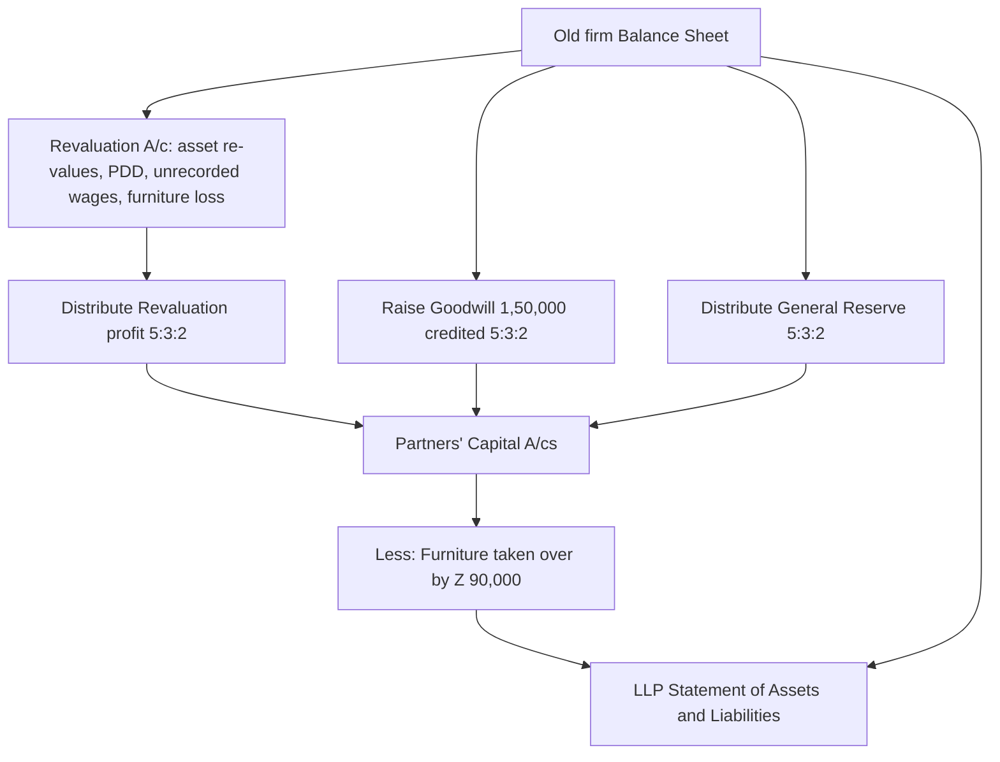

# Q&A — Accounting for LLPs

> CA Intermediate · Advanced Accounting · Exam-oriented question bank.
> Statute referenced: Limited Liability Partnership Act, 2008 (India). All amounts in Rupees (Rs). No invented provisions — where the LLP First Schedule is silent, the agreement rate is used and stated.

---

## SECTION A — Concept Check (with answers)

**A1. What is the legal nature of an LLP and why does it sit between a firm and a company?**
An LLP is a body corporate with perpetual succession and a legal identity separate from its partners (Sec. 3, LLP Act 2008). Like a company it has limited liability and continuity; like a firm it is managed by partners under a mutually agreed contract. Hence the "hybrid-car" character — a partnership chassis with a corporate shell.

**A2. In the absence of an LLP agreement, which document governs mutual rights and duties?**
The **First Schedule** to the LLP Act applies as the default rulebook.

**A3. List four default rules of the First Schedule relevant to accounting.**
(i) Partners share **equally** in capital, profits and losses; (ii) **no interest on capital contribution**; (iii) **no remuneration/salary** to a partner for managing the business; (iv) every partner may take part in management, ordinary matters decided by majority (one vote each).

**A4. Does the First Schedule provide a default rate of interest on a partner's loan to the LLP?**
No. The First Schedule is **silent** on interest on advances/loans by a partner. (Do not import the 6% p.a. rule of the Indian Partnership Act, 1932.) Interest is payable only if the LLP agreement so provides.

**A5. What is "contribution" and can it be non-monetary?**
Contribution is the partner's obligated stake. It may be **tangible, intangible, movable or immovable** — money, property, promissory notes, contracts for services performed. Non-cash contributions are recorded at their monetary value as valued and disclosed in the accounts.

**A6. How is an LLP taxed (broad principle only)?**
An LLP is taxed **as a partnership firm** — a flat rate (30% plus surcharge and cess), no dividend distribution tax. Interest and remuneration to partners are deductible within Sec. 40(b) limits; the partner's **share of LLP profit is exempt** in the partner's hands (Sec. 10(2A)). Alternate Minimum Tax (AMT) can apply. There is **no** concept of dividend for an LLP.

**A7. Name the annual statutory statement and the form through which accounts are filed.**
The **Statement of Account and Solvency**, filed in **Form 8**; the annual return is **Form 11**. Audit is required if turnover exceeds Rs 40 lakh or contribution exceeds Rs 25 lakh.

**A8. Name the three schedules governing conversion into an LLP.**
Second Schedule — **firm** to LLP; Third Schedule — **private company** to LLP; Fourth Schedule — **unlisted public company** to LLP.

**A9. Give two differences between LLP accounts and company accounts.**
(i) LLP has no share capital / no separate reserves like securities premium — partners hold **contribution and current accounts**; (ii) LLP financial statements need not follow Schedule III of the Companies Act — they are presented as a **Statement of Assets & Liabilities and Statement of Income & Expenditure** (Form 8 format), and there is no requirement to prepare a cash flow statement.

---

## SECTION B — Graded Computational Problems (full solutions)

### B1 (Easy) — Contribution + Appropriation

*A and B form an LLP. Contribution: A Rs 5,00,000, B Rs 3,00,000. Agreement: interest on contribution @ 8% p.a.; salary to B Rs 60,000 p.a.; balance shared 3:2. Profit before appropriations for the year Rs 2,80,000. Show the Profit & Loss Appropriation and each partner's share.*

**Step 1 — Interest on contribution:** A = 5,00,000 × 8% = **40,000**; B = 3,00,000 × 8% = **24,000**. Total 64,000.
**Step 2 — Salary:** B = **60,000**.
**Step 3 — Divisible profit:** 2,80,000 − (64,000 + 60,000) = **1,56,000**, shared 3:2 → A 93,600, B 62,400.

**Profit & Loss Appropriation A/c**

| Particulars | Rs | Particulars | Rs |
|---|---:|---|---:|
| Interest on contribution — A | 40,000 | Net profit b/d | 2,80,000 |
| Interest on contribution — B | 24,000 | | |
| Salary — B | 60,000 | | |
| Share of profit — A 93,600 / B 62,400 | 1,56,000 | | |
| **Total** | **2,80,000** | **Total** | **2,80,000** |

**Partners' earnings:** A = 40,000 + 93,600 = **1,33,600**; B = 24,000 + 60,000 + 62,400 = **1,46,400**. (Cross-check: 1,33,600 + 1,46,400 = 2,80,000 ✓.)

---

### B2 (Medium) — Firm to LLP with Revaluation & Goodwill

*P and Q share 3:2. They convert the firm into PQ LLP. Balance Sheet on the date of conversion:*

| Liabilities | Rs | Assets | Rs |
|---|---:|---|---:|
| Capital — P | 4,00,000 | Land | 3,00,000 |
| Capital — Q | 2,60,000 | Plant | 2,00,000 |
| Creditors | 1,40,000 | Stock | 1,50,000 |
| Bank loan | 1,00,000 | Debtors | 1,20,000 |
| | | Cash | 1,30,000 |
| **Total** | **9,00,000** | **Total** | **9,00,000** |

*Adjustments: Land to Rs 4,20,000; Plant to Rs 1,80,000; Stock to Rs 1,40,000; provision for doubtful debts Rs 6,000; goodwill raised at Rs 1,00,000.*

**Revaluation A/c**

| Particulars | Rs | Particulars | Rs |
|---|---:|---|---:|
| Plant (dec.) | 20,000 | Land (inc.) | 1,20,000 |
| Stock (dec.) | 10,000 | | |
| Provision for doubtful debts | 6,000 | | |
| Profit → P 50,400 / Q 33,600 | 84,000 | | |
| **Total** | **1,20,000** | **Total** | **1,20,000** |

Goodwill Rs 1,00,000 credited 3:2 → P 60,000, Q 40,000.

**Capitals (now Contribution):** P = 4,00,000 + 50,400 + 60,000 = **5,10,400**; Q = 2,60,000 + 33,600 + 40,000 = **3,33,600**. Total 8,44,000.

**PQ LLP — Statement of Assets & Liabilities**

| Liabilities | Rs | Assets | Rs |
|---|---:|---|---:|
| Contribution — P | 5,10,400 | Goodwill | 1,00,000 |
| Contribution — Q | 3,33,600 | Land | 4,20,000 |
| Creditors | 1,40,000 | Plant | 1,80,000 |
| Bank loan | 1,00,000 | Stock | 1,40,000 |
| | | Debtors 1,20,000 − PDD 6,000 | 1,14,000 |
| | | Cash | 1,30,000 |
| **Total** | **10,84,000** | **Total** | **10,84,000** |

Balances ✓.

---

### B3 (Exam-hard) — Comprehensive Conversion

*X, Y and Z share 5:3:2 and convert their firm into XYZ LLP. Balance Sheet as at 31.03.2026:*

| Liabilities | Rs | Assets | Rs |
|---|---:|---|---:|
| Capital — X | 6,00,000 | Land & Building | 5,00,000 |
| Capital — Y | 4,00,000 | Machinery | 3,50,000 |
| Capital — Z | 2,00,000 | Furniture | 1,00,000 |
| X's Loan | 1,50,000 | Stock | 2,40,000 |
| General Reserve | 1,00,000 | Debtors | 2,60,000 |
| Sundry Creditors | 2,50,000 | Cash at Bank | 2,50,000 |
| **Total** | **17,00,000** | **Total** | **17,00,000** |

*Terms of conversion:*
1. *Land & Building revalued to Rs 6,50,000; Machinery to Rs 3,20,000; Stock to Rs 2,25,000.*
2. *Provision for doubtful debts @ 5% on debtors.*
3. *An unrecorded liability — outstanding wages Rs 15,000 — to be brought into books.*
4. *Z takes over the furniture at an agreed Rs 90,000; it is withdrawn from the LLP.*
5. *Goodwill valued at Rs 1,50,000 is raised in the books.*
6. *General Reserve is distributed to partners in the old ratio.*
7. *X's loan continues in the LLP as a loan (not as contribution).*

*Prepare the Revaluation A/c, Partners' Capital A/cs and the LLP Statement of Assets & Liabilities.*

**Solution path:**

**Working Note 1 — Provision for doubtful debts:** 2,60,000 × 5% = **13,000**.
**Working Note 2 — Furniture:** book Rs 1,00,000, taken over at Rs 90,000 → revaluation loss Rs 10,000; furniture removed from assets; Z's capital debited Rs 90,000.

**Revaluation A/c**

| Particulars | Rs | Particulars | Rs |
|---|---:|---|---:|
| Machinery (dec.) | 30,000 | Land & Building (inc.) | 1,50,000 |
| Stock (dec.) | 15,000 | | |
| Provision for doubtful debts | 13,000 | | |
| Outstanding wages (unrecorded) | 15,000 | | |
| Furniture — loss on take-over | 10,000 | | |
| Profit → X 33,500 / Y 20,100 / Z 13,400 | 67,000 | | |
| **Total** | **1,50,000** | **Total** | **1,50,000** |

Revaluation profit 67,000 split 5:3:2 = X 33,500, Y 20,100, Z 13,400.
Goodwill 1,50,000 split 5:3:2 = X 75,000, Y 45,000, Z 30,000.
General Reserve 1,00,000 split 5:3:2 = X 50,000, Y 30,000, Z 20,000.

**Partners' Capital Accounts**

| Particulars | X | Y | Z | Particulars | X | Y | Z |
|---|---:|---:|---:|---|---:|---:|---:|
| Furniture (taken over) | — | — | 90,000 | Balance b/d | 6,00,000 | 4,00,000 | 2,00,000 |
| Balance c/d (Contribution) | 7,58,500 | 4,95,100 | 1,73,400 | Revaluation profit | 33,500 | 20,100 | 13,400 |
| | | | | Goodwill | 75,000 | 45,000 | 30,000 |
| | | | | General Reserve | 50,000 | 30,000 | 20,000 |
| **Total** | **7,58,500** | **4,95,100** | **2,63,400** | **Total** | **7,58,500** | **4,95,100** | **2,63,400** |

Total contribution = 7,58,500 + 4,95,100 + 1,73,400 = **14,27,000**.

**XYZ LLP — Statement of Assets & Liabilities as at 01.04.2026**

| Liabilities | Rs | Assets | Rs |
|---|---:|---|---:|
| Contribution — X | 7,58,500 | Goodwill | 1,50,000 |
| Contribution — Y | 4,95,100 | Land & Building | 6,50,000 |
| Contribution — Z | 1,73,400 | Machinery | 3,20,000 |
| X's Loan | 1,50,000 | Stock | 2,25,000 |
| Sundry Creditors | 2,50,000 | Debtors 2,60,000 − PDD 13,000 | 2,47,000 |
| Outstanding Wages | 15,000 | Cash at Bank | 2,50,000 |
| **Total** | **18,42,000** | **Total** | **18,42,000** |

Balances ✓ (Furniture removed; X's loan shown as liability, not contribution; unrecorded wages now on the books).

---

## SECTION C — Past-Paper-Style Full Question

*Sunrise LLP was formed on 1 April 2025 by partners L, M and N, who paid contributions of Rs 8,00,000, Rs 6,00,000 and Rs 4,00,000 respectively into the LLP bank account. The LLP agreement provides: interest on contribution @ 9% p.a.; salary to M Rs 1,50,000 p.a.; and profits after appropriations shared L 40%, M 35%, N 25%. Net profit for the year before appropriations was Rs 6,50,000. Drawings during the year: L Rs 1,00,000, M Rs 80,000, N Rs 60,000. Other year-end balances: Fixed assets (net) Rs 9,00,000, Stock Rs 3,20,000, Debtors Rs 2,80,000, Creditors Rs 2,10,000. Prepare the partners' current accounts and the Statement of Assets & Liabilities as at 31 March 2026 (treat cash & bank as the balancing figure).*

**Step 1 — Appropriations.**
Interest on contribution: L 8,00,000 × 9% = 72,000; M 6,00,000 × 9% = 54,000; N 4,00,000 × 9% = 36,000 (total 1,62,000).
Salary to M = 1,50,000.
Divisible profit = 6,50,000 − 1,62,000 − 1,50,000 = **3,38,000**, split 40:35:25 → L 1,35,200; M 1,18,300; N 84,500.

**Step 2 — Partners' Current Accounts**

| Particulars | L | M | N | Particulars | L | M | N |
|---|---:|---:|---:|---|---:|---:|---:|
| Drawings | 1,00,000 | 80,000 | 60,000 | Interest on contribution | 72,000 | 54,000 | 36,000 |
| Balance c/d | 1,07,200 | 2,42,300 | 60,500 | Salary | — | 1,50,000 | — |
| | | | | Share of profit | 1,35,200 | 1,18,300 | 84,500 |
| **Total** | **2,07,200** | **3,22,300** | **1,20,500** | **Total** | **2,07,200** | **3,22,300** | **1,20,500** |

Current account balances: L 1,07,200 + M 2,42,300 + N 60,500 = **4,10,000**.

**Step 3 — Balancing cash & bank.**
Total liabilities = Contribution 18,00,000 + Current 4,10,000 + Creditors 2,10,000 = 24,20,000.
Known assets = 9,00,000 + 3,20,000 + 2,80,000 = 15,00,000. Cash & Bank = 24,20,000 − 15,00,000 = **9,20,000**.

**Sunrise LLP — Statement of Assets & Liabilities as at 31.03.2026**

| Liabilities | Rs | Assets | Rs |
|---|---:|---|---:|
| Contribution — L | 8,00,000 | Fixed assets (net) | 9,00,000 |
| Contribution — M | 6,00,000 | Stock | 3,20,000 |
| Contribution — N | 4,00,000 | Debtors | 2,80,000 |
| Current A/c — L | 1,07,200 | Cash & Bank (bal. fig.) | 9,20,000 |
| Current A/c — M | 2,42,300 | | |
| Current A/c — N | 60,500 | | |
| Sundry Creditors | 2,10,000 | | |
| **Total** | **24,20,000** | **Total** | **24,20,000** |

Balances ✓. Note the fixed-capital method: contribution stays at Rs 18,00,000 while all appropriations and drawings route through current accounts — mirroring the Form 8 split between "Contribution" and accumulated profits.

---

## SECTION D — MCQs / Case Scenarios

**D1.** In the absence of an LLP agreement, interest on a partner's contribution is —
(a) 6% p.a. (b) 8% p.a. (c) 12% p.a. (d) **Nil** ✓
*The First Schedule allows no interest on contribution.*

**D2.** Conversion of a private company into an LLP is governed by the —
(a) Second Schedule (b) **Third Schedule** ✓ (c) Fourth Schedule (d) Fifth Schedule
*Second = firm, Third = private company, Fourth = unlisted public company.*

**D3.** The annual "Statement of Account and Solvency" of an LLP is filed in —
(a) Form 11 (b) **Form 8** ✓ (c) Form 3 (d) Form 4
*Form 8 carries the Statement of Assets & Liabilities and Income & Expenditure; Form 11 is the annual return.*

**D4.** An LLP must get its accounts audited if turnover exceeds —
(a) Rs 25 lakh (b) **Rs 40 lakh** ✓ (c) Rs 1 crore (d) Rs 2 crore
*Audit trigger: turnover > Rs 40 lakh OR contribution > Rs 25 lakh.*

**D5.** A partner's share of profit received from an LLP is, in the partner's hands —
(a) taxable at slab rates (b) **exempt under Sec. 10(2A)** ✓ (c) taxed at 30% (d) subject to DDT
*Profit share is exempt to avoid double taxation; only remuneration/interest are taxable.*

**D6. Case:** *Furniture of book value Rs 1,00,000 is taken over by a partner at Rs 90,000 on conversion.* The Rs 10,000 difference is —
(a) credited to the partner's capital (b) **a revaluation loss shared by all partners** ✓ (c) written to goodwill (d) ignored
*The shortfall is a loss on revaluation; the partner's capital is debited with the full Rs 90,000 take-over value.*

---

## Quick-Revision Sheet

- **Nature:** body corporate, perpetual succession, separate legal person, limited liability (Sec. 3).
- **Default rulebook = First Schedule:** equal profit/loss, **no** interest on contribution, **no** salary, one vote each; **silent on interest on partner loans** (never assume 6%).
- **Contribution** may be cash or in-kind (tangible/intangible), recorded at monetary value; split contribution (capital) vs current account (appropriations, drawings).
- **Tax:** flat firm rate, no DDT, partner's profit share exempt (10(2A)), remuneration/interest deductible u/s 40(b), AMT possible.
- **Filings:** Form 8 (Account & Solvency), Form 11 (annual return); audit if turnover > Rs 40 lakh or contribution > Rs 25 lakh.
- **Conversion schedules:** 2nd firm · 3rd private company · 4th unlisted public company.
- **Conversion mechanics = admission/revaluation logic:** open Revaluation A/c for re-values, PDD and unrecorded liabilities; raise goodwill; distribute reserves in old ratio; debit capital for assets retained by a partner; keep partner loans as loans, not contribution; verify the LLP Statement of Assets & Liabilities **balances**.
- **Traps:** (i) importing the 1932 Act's 6% loan interest into an LLP; (ii) treating a partner's loan as contribution; (iii) forgetting to book an unrecorded liability before computing revaluation profit; (iv) crediting a partner with the take-over value while the book-value shortfall is a shared revaluation loss; (v) applying Schedule III (company) formats to LLP statements.
