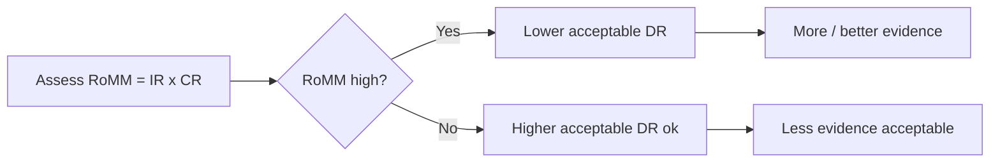
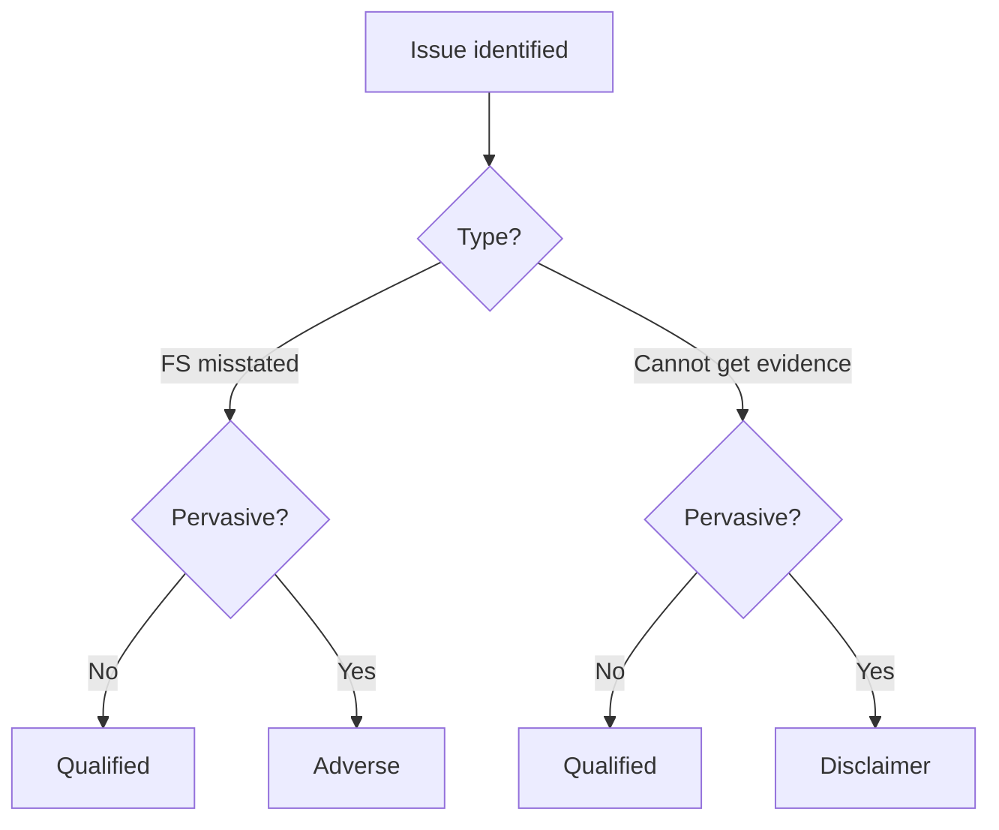

# Auditing & Ethics — Quick-Revision Cheat-Sheet

*CA Intermediate | last-mile scan | terse & dense. Section numbers = Companies Act 2013 unless noted.*

---

## 1. Audit Fundamentals (the "why")

- **Audit = independent examination** of financial info of any entity to express an **opinion** (not a guarantee of accuracy; reasonable, not absolute, assurance).
- **Objective (SA 200):** obtain **reasonable assurance** whether FS as a whole are free from **material misstatement** (fraud/error) → enable opinion on **true & fair** view.
- **Inherent limitations:** nature of financial reporting (judgement/estimates), nature of audit procedures (sampling, evidence persuasive not conclusive), timeliness/cost-benefit, fraud (esp. collusion & mgmt override), related parties, going concern, future events.
- **True & Fair ≠ Exact.** Auditor is a **watchdog, not a bloodhound** (but must probe when suspicion arises).
- **Reasonable assurance = high, not absolute.** Absolute is impossible due to inherent limits.

---

## 2. SAs Grouped by Purpose (memorise the *bands*)

| Band | Range | Theme | Must-know SAs |
|---|---|---|---|
| Intro | 100–199 | — | (reserved) |
| **General Principles & Responsibilities** | 200–299 | The auditor's duties | **200** overall objectives; **210** agreeing terms (engagement letter); **220** quality control at engagement level; **230** documentation; **240** fraud; **250** laws & regs; **260** comm. with TCWG; **265** comm. deficiencies in ICFR |
| **Risk Assessment & Response** | 300–499 | Plan & respond | **300** planning; **315** identify/assess RoMM via understanding entity; **320** materiality; **330** responses to assessed risks; **402** service org; **450** evaluating misstatements |
| **Audit Evidence** | 500–599 | Get the proof | **500** evidence; **501** specific items (inventory/litigation/segments); **505** external confirmations; **510** opening balances (initial engagements); **520** analytical procedures; **530** sampling; **540** estimates & fair value; **550** related parties; **560** subsequent events; **570** going concern; **580** written representations |
| **Using Work of Others** | 600–699 | Rely on others | **600** using component auditors (group); **610** internal auditors; **620** auditor's expert |
| **Conclusions & Reporting** | 700–799 | The output | **700** forming opinion & reporting; **701** KAM; **705** modifications; **706** EoM & Other Matter paras; **710** comparatives; **720** other information |
| **Specialised Areas** | 800–899 | Special reports | **800** special purpose frameworks; **805** single FS/element; **810** summary FS |

**SRE 2400/2410** review; **SAE 3400+** assurance; **SRS 4400** agreed-upon procedures, **4410** compilation. (SA=audit, SRE=review, SAE=assurance, SRS=related services.)

---

## 3. Audit Risk Model

**Audit Risk (AR) = Inherent Risk (IR) × Control Risk (CR) × Detection Risk (DR)**

- **RoMM = IR × CR** (exists in the entity, auditor *assesses* it, cannot change it).
- **DR** = risk auditor's procedures miss a misstatement — auditor **controls** DR via nature/timing/extent of procedures.
- **Inverse relation:** higher assessed RoMM → auditor sets **lower acceptable DR** → **more** evidence (larger samples, at year-end, more experienced staff).

- **Materiality (SA 320):** magnitude that could influence users' economic decisions. **Performance materiality < overall materiality** (buffer for aggregation/undetected). Inverse link: lower materiality → more work.
- **Sampling risk vs non-sampling risk.** Tolerable misstatement = application of performance materiality to a procedure.

---

## 4. Fraud vs Error (SA 240)

| | Error | Fraud |
|---|---|---|
| Intent | Unintentional | **Intentional** |
| Types | Math/clerical, wrong policy | (a) **Fraudulent financial reporting** (mgmt), (b) **Misappropriation of assets** (employees) |
| Fraud triangle | — | **Incentive/Pressure + Opportunity + Rationalisation** |

- **Primary responsibility for prevention/detection = TCWG + Management.** Auditor = reasonable assurance only; maintain **professional skepticism** throughout.
- Mgmt override of controls = risk present in **every** audit → test journal entries, estimates for bias, unusual transactions.
- If fraud found: communicate to appropriate level of mgmt / TCWG; consider reporting u/s **143(12)** (see §6).

---

## 5. Opinion Decision (SA 700 / 705 / 706)

Two questions drive the modification: **(A) Is the matter material?** **(B) Is it also pervasive?**

| Nature of matter | Material but NOT pervasive | Material AND pervasive |
|---|---|---|
| **FS are misstated** (disagreement) | **Qualified** ("except for") | **Adverse** |
| **Unable to obtain sufficient evidence** (scope limitation) | **Qualified** ("except for") | **Disclaimer** |

- **Pervasive** = not confined to specific elements; OR if confined, represents substantial proportion; OR (for disclosures) fundamental to users' understanding.
- **Unmodified/Unqualified = clean.**

- **EoM para (706):** draws attention to a matter **appropriately presented/disclosed** in FS, fundamental to understanding — does **NOT** modify opinion.
- **Other Matter para (706):** relevant to users' understanding of audit/report but **NOT disclosed** in FS.
- **KAM (SA 701):** most significant matters in the audit; mandatory for **listed** entities; reported in a separate section — **not a substitute** for a modified opinion or EoM.
- **Going concern (SA 570):** material uncertainty adequately disclosed → unmodified + separate "Material Uncertainty Related to Going Concern" section; inadequate disclosure → qualified/adverse.

---

## 6. Companies Act 2013 — Audit Sections 139–148 (high-yield)

| Sec | Topic | Key numbers / points |
|---|---|---|
| **139** | Appointment of auditor | Appt within **30 days** of incorporation by Board (else by members in 90 days EGM); term **5 yrs**, ratification requirement **omitted** (2017 amend). **Rotation (139(2))** — listed + prescribed cos: individual **1 term (5 yrs)**, firm **2 terms (10 yrs)**, cooling-off **5 yrs**. |
| **140** | Removal / resignation | Removal before term = **special resolution + Central Govt** prior approval; auditor files **ADT-3** on resignation within **30 days**; **140(5)** Tribunal can order change for fraud. |
| **141** | Eligibility & disqualifications | Only **CA/firm** (majority partners CA). Disqualified: holds security/interest, indebted > **₹5 lakh**, guarantee > ₹1 lakh, business relationship, relative as director/KMP, > **20 company** audit ceiling, convicted of fraud (10 yrs). |
| **142** | Remuneration | Fixed in general meeting (or manner therein). |
| **143** | Powers & duties | Access to books at all times; **143(1)** enquiries; **143(2)** report to members; **143(3)** report contents; **143(3)(i)** report on **IFC** adequacy; **143(9)** comply with SAs; **143(11)** CARO; **143(12)** report fraud ≥ **₹1 crore** to **Central Govt** (Form **ADT-4**, via Board within timelines), < ₹1 cr to Board/Audit Committee; **143(15)** penalty for non-reporting. |
| **144** | Prohibited (non-audit) services | Auditor **cannot** render: accounting/book-keeping, internal audit, design of financial IS, actuarial, investment advisory/banking, mgmt services, outsourced financial services. (Independence.) |
| **145** | Signing of reports | Auditor signs audit report / other documents. |
| **146** | Attend general meeting | Notice to auditor; right & duty to attend AGM (unless exempted). |
| **147** | Punishment for contravention | Company & auditor penalties; auditor fine **₹25k–₹5 lakh** (or 4x fee); if wilful/fraud higher + refund remuneration + damages; joint & several for firm. |
| **148** | Cost audit | Central Govt may direct **cost records/cost audit**; cost auditor = **Cost Accountant**; cannot be the statutory (financial) auditor. |

- **Casual vacancy:** by Board within **30 days**; if due to **resignation**, also approved by members within **3 months**.
- **First auditor** (govt co: by **C&AG** within 60 days).

---

## 7. Professional Ethics — Threats & Safeguards (ICAI Code / CA Act 1949)

**Five threats to independence** (memorise **"SS-AFI"**):

| Threat | Trigger example |
|---|---|
| **Self-interest** | Financial interest in client; fee dependence; loan/guarantee |
| **Self-review** | Auditing own prior non-audit work (e.g., prepared the accounts) |
| **Advocacy** | Promoting client's position (e.g., representing in litigation) |
| **Familiarity** | Long association / close relative in client / ex-employee |
| **Intimidation** | Threat of dismissal, litigation, dominant client pressure |

- **Fundamental principles (5):** **Integrity, Objectivity, Professional Competence & Due Care, Confidentiality, Professional Behaviour.**
- Safeguards: created by profession/legislation/regulation; and within the client/firm (rotation, review, policies).

**CA Act 1949 — Schedules of Professional Misconduct:**

| Schedule | Applies to | Nature | Disciplinary route |
|---|---|---|---|
| **First Schedule** | Members (+ students) | Less serious; e.g., **fee sharing** with non-members, soliciting/advertising, allowing name for unaudited FS, undisclosed fee %-based | **Board of Discipline** (BoD) |
| **Second Schedule** | Members | Serious; e.g., disclosing confidential info, gross negligence, false report, failure to report material misstatement | **Disciplinary Committee** (DC) |

- Each schedule: **Part I** = professional misconduct, **Part II** = other misconduct.
- **BoD** penalty: reprimand / remove up to **3 months** / fine up to **₹1 lakh**. **DC** penalty: remove name up to permanently / fine up to **₹5 lakh**.
- **"In practice" opinion (Clause) triggers:** advertising, solicitation, contingent fees (generally barred), fee-sharing/commission with non-CAs = misconduct.

---

## 8. Vouching vs Verification vs Internal Control

| | Vouching | Verification |
|---|---|---|
| Concern | **Transactions** (P&L items) | **Assets & liabilities** (B/S items) |
| Checks | Occurrence, authorisation, recording | Existence, ownership, valuation, presentation |
| Evidence | Vouchers/invoices | Physical + title + confirmations |

- **Internal Control components (COSO / SA 315):** Control Environment, Risk Assessment, Control Activities, Information & Communication, Monitoring.
- **Test of Controls** (are controls operating?) vs **Substantive Procedures** (detect misstatement: *tests of details* + *substantive analytical*).
- **Internal Check** = division of work so no one person handles a transaction end-to-end (built-in cross-check).

---

## 9. Audit Evidence — SAAE ("Sufficient & Appropriate")

- **Sufficiency** = quantity (↑ with higher RoMM, ↓ with higher quality). **Appropriateness** = **relevance + reliability**.
- **Reliability hierarchy:** external > internal; auditor-obtained (direct) > entity-provided; documentary > oral; originals > copies; effective controls ↑ reliability.
- **Procedures (7):** Inspection, Observation, External Confirmation, Recalculation, Reperformance, Analytical Procedures, Inquiry (*inquiry alone insufficient*).
- **Assertions:** Classes of transactions (OCCA-C: Occurrence, Completeness, Accuracy, Cutoff, Classification); Balances (Existence, Rights & Obligations, Completeness, Valuation); Presentation & disclosure.
- **Written representations (SA 580)** = audit evidence but **not** a substitute for other evidence.

---

## 10. Company Audit — Report & CARO

- **Auditor's report contents (143(3)):** whether info/explanations obtained; proper books kept; accounts agree with books; FS comply with AS; observations, adverse remarks; director disqualification (164(2)); **IFC** reporting (143(3)(i)); CARO matters.
- **CARO 2020** applies to most companies **except:** banking, insurance, **Sec 8**, OPC, small company, and certain private companies (paid-up + reserves ≤ ₹1 cr, borrowings ≤ ₹1 cr, turnover ≤ ₹10 cr — all conditions).
- **Branch audit (143(8))**, **Joint audit (SA 299)** — joint auditors jointly & severally responsible for common areas; separately for allocated work.

---

## 11. Special / Government & Other Audits

- **Government audit:** by **C&AG**; supplementary audit u/s 143(6); propriety audit (wisdom/faithfulness of spend), performance/efficiency audit.
- **Bank audit:** LFAR, NPA norms, RBI prudential norms.
- **Cooperative societies, LLP, NGO, charitable trust** — governing statute drives scope.

---

## 12. Digital / Automated Environment (SA 315 context)

- **Risks in IT:** unauthorised access, data loss, over-reliance on systems, program changes, lack of segregation.
- **CAATs** (Computer-Assisted Audit Techniques) — test data, GAS; **data analytics** for 100% population testing.
- **Application controls** (input/process/output) + **General IT controls** (access, change mgmt, ops).

---

## ⚠️ Rates / Limits Caveat (esp. Taxation cross-refs)

Monetary thresholds above (₹1 cr fraud reporting, ₹5 lakh indebtedness, penalty ranges, CARO limits) are **Companies Act / ICAI figures — stable but confirm against the CURRENT ICAI Study Material & latest RTP/MTP.** For any **Taxation** rates, slabs, or limits: these are **Assessment-Year specific** — **do NOT rely on memory; verify exact figures in the current ICAI material for the applicable AY** before writing.

---

### One-line recall triggers
- **AR = IR × CR × DR**; RoMM↑ → DR↓ → evidence↑.
- **Qualified/Adverse/Disclaimer** = Material×Pervasive matrix.
- **139–148** = the audit spine of Companies Act.
- **SS-AFI** = five independence threats.
- **First Schedule → BoD (₹1L)**, **Second Schedule → DC (₹5L)**.
- **144** = prohibited services; **143(12)** = fraud reporting; **139(2)** = rotation.
