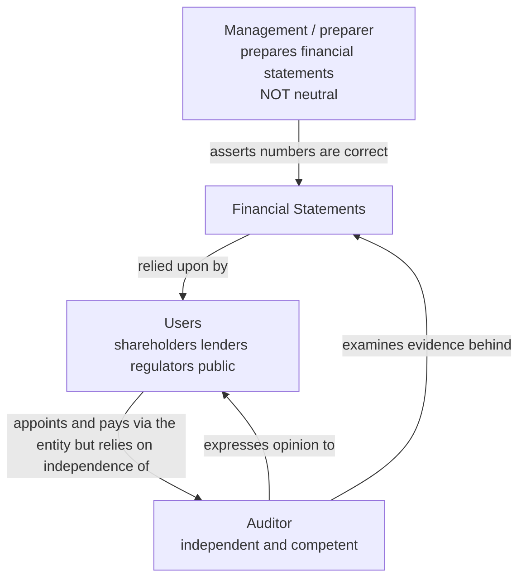
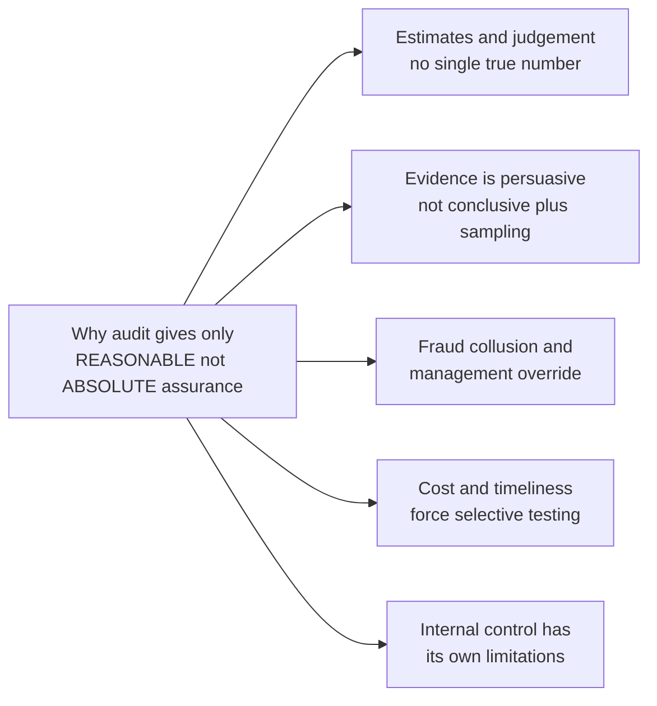
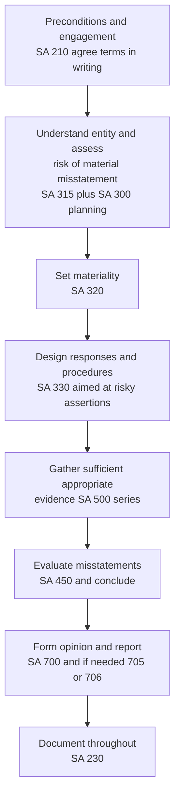

# Chapter 01 — Nature, Objective & Scope of Audit

---

## 1. The Problem — Why Does Anyone Need an Audit at All?

Start with a company, not with a textbook.

A company is owned by shareholders. But shareholders do not run it. They hire directors and managers to run it *for* them. This split — **owners who supply the capital** versus **managers who control the capital** — is the seed of every audit problem you will ever study.

The owners hand over money. In return the managers periodically hand back a set of financial statements: "Here is what we did with your money — this much profit, these assets, these liabilities." The owner reads it and must decide: *Do I believe this?*

There is a genuine reason **not** to believe it blindly. Consider the incentives:

- The managers' bonuses, job security, and reputation depend on the numbers *they themselves* prepare. A manager who reports high profits looks successful. So there is a temptation to **overstate income and assets, understate liabilities**.
- The managers know a thousand things about the business the owner does not. The owner sees only the summary. This gap in knowledge is real and permanent.
- Even an honest manager makes mistakes. The accounting is complex, estimates are involved, and errors creep in.

Economists give these two frictions precise names, and you must know them because the whole subject is built on them:

| Concept | Plain meaning | Why it creates audit demand |
|---|---|---|
| **Agency problem** | The agent (manager) may act in his own interest, not the principal's (owner's) | Owner cannot trust the agent's self-report of performance |
| **Information asymmetry** | The manager knows more than the owner | Owner cannot independently verify what he is told |
| **Stewardship** | The manager holds and manages assets *belonging to someone else* and must account for them | Society demands the steward *prove* faithful custody, not merely assert it |

So the problem is a **trust gap**. The people who need the truth (owners, lenders, tax authorities, employees, the public) are exactly the people who *cannot* generate it themselves, and the people who *can* generate it (management) are exactly the people who are **not neutral** about what the truth says.

You cannot solve this by asking the manager to try harder to be honest. Honesty you cannot observe is worthless — the whole point is that the owner **can't see inside**. You need something structural.

That structural solution is **audit**: insert an *independent, competent, third person* whose only job is to examine the financial statements and give the owner an **informed, unbiased opinion** on whether they can be believed. The auditor is not loyal to management and not dependent on the reported numbers looking good. That independence is the entire value proposition.

> **First-principles statement of the problem:** *Those who must rely on financial statements are not the ones who prepare them, and those who prepare them are not neutral. Audit exists to make the statements credible to the people who could not otherwise verify them.*

Keep this in your head for the rest of the book. Every Standard on Auditing (SA), every procedure, every disclosure requirement is ultimately an answer to *some specific way the trust gap could produce a wrong number the owner relies on.*

---

## 2. The Core Idea — What Audit Actually Is

Auditing is defined (per ICAI, drawing on SA 200 and the framework) roughly as:

> **An audit is the independent examination of financial information of any entity — whether profit-oriented or not, and irrespective of its size or legal form — when such an examination is conducted with a view to expressing an opinion thereon.**

Unpack that definition against the problem:

- **Independent** — solves the agency problem. The examiner is not management.
- **Examination of financial information** — it is *evidence-based verification*, not a rubber stamp and not re-doing the accounts.
- **Any entity, any size, any form** — the trust gap exists for a charity, a partnership, a bank, or a listed giant. The concept is universal; only the *legal requirement* to audit varies.
- **Expressing an opinion** — the output is an **opinion**, deliberately. Not a certificate. Not a guarantee. This word is doing enormous work, and Section 4 will explain exactly why it must be "opinion" and nothing stronger.

The core mental model is a triangle of three parties, and you should carry it as a diagram:

*Figure 1 — The audit triangle. The auditor sits between preparer and user, converting an untrustworthy self-report into credible information.*

The auditor's opinion adds **credibility**. That is the product being sold. Financial statements *with* a clean audit opinion are believable enough to lend against, invest in, and tax. The same statements *without* one are just management's word.

---

## 3. Why It Is Built This Way — The Logic of "Reasonable Assurance"

Here is the crux question a sharp learner asks: *If the point is trust, why doesn't the auditor simply guarantee the accounts are 100% correct? Wouldn't that be more useful?*

The answer is that a guarantee is **impossible**, and pretending otherwise would be a lie. Understanding *why* it is impossible is the key to understanding the entire nature and scope of audit. This is where SA 200, *Overall Objectives of the Independent Auditor and the Conduct of an Audit in Accordance with Standards on Auditing*, becomes central.

### The concept of assurance

An **assurance engagement** is one where the practitioner expresses a conclusion designed to enhance the confidence of intended users about an outcome (here, the financial statements) against criteria (here, the applicable financial reporting framework — Accounting Standards / Ind AS + Companies Act).

Assurance comes in two grades:

| Type | Level | Wording of conclusion | Example |
|---|---|---|---|
| **Reasonable assurance** | High, but **not absolute** | **Positive** — "in our opinion the statements give a true and fair view" | Statutory audit |
| **Limited assurance** | Moderate, lower | **Negative** — "nothing has come to our attention that causes us to believe…" | Review engagement (e.g. review of interim financials, SRE 2400 / 2410) |

A statutory **audit provides reasonable assurance** — the *highest* level a practitioner can offer — but crucially **not absolute assurance**. SA 200 is explicit: absolute assurance is **not attainable** because of the **inherent limitations of an audit**.

### Why not absolute? The inherent limitations (and their causes)

This is examinable almost every attempt, and it must be understood, not memorized. Absolute assurance is unreachable because of limitations *built into the nature of auditing itself*:

1. **Nature of financial reporting — judgement and estimates.** Financial statements are not pure fact. They contain estimates (provision for doubtful debts, useful life of assets, warranty provisions, fair values). Estimates are inherently uncertain — a *range* of amounts could all be "reasonable". No auditor can prove a single estimate is the one true number, because there *is* no single true number.

2. **Nature of audit evidence — persuasive, not conclusive.** The auditor works mostly with evidence that *persuades* rather than *proves*. He samples; he does not (cannot) test 100% of transactions in a large entity — that would cost more than the company earns and take longer than a year. He relies on inference. Persuasive evidence can be wrong.

3. **Fraud, especially collusion and management override.** Audit procedures are designed to detect *material misstatement*. But a **well-concealed fraud** — forged documents, deliberate misrepresentation by management, **collusion** among several people, or **management override of controls** — is specifically designed to defeat the very procedures an auditor would normally rely on. Detecting a sophisticated fraud is harder than detecting an error, because there is an intelligent adversary hiding it.

4. **Timeliness and cost — the balance principle.** The audit must be finished in a reasonable time and at a reasonable cost, or it is useless (nobody wants a "true and fair" opinion on last decade's accounts). This forces **sampling** and **judgement about materiality**. The relevance of information declines with time; the cost of certainty is prohibitive. So audit is deliberately a *cost-benefit balance*, and that balance means less-than-total checking.

5. **Other areas of inherent limitation** — related party relationships, or the possibility of non-compliance with laws, can be very hard to detect because they too may be deliberately concealed.

*Figure 2 — The five roots of inherent limitation. Because these are inherent, no amount of extra work can ever reach 100 percent — hence "reasonable", not "absolute".*

### The payoff of the logic

Because certainty is impossible, an honest profession promises the **highest achievable** confidence and *names it honestly* as "reasonable assurance". That is why the output is an **opinion** on whether the statements show a **true and fair view**, expressed with **professional judgement** and **professional skepticism** — not a certificate of arithmetical correctness and not an insurance policy against fraud.

This single design decision — *promise reasonable assurance, express an opinion, admit inherent limits* — is the DNA of the entire subject. Everything technical that follows is the machinery for delivering exactly this much and no more.

---

## 4. Full Technical Content — Objectives, Assertions, Standards, and Scope

### 4.1 The objective of audit per SA 200

SA 200 states the auditor's **overall objectives**:

1. To obtain **reasonable assurance** about whether the financial statements as a whole are **free from material misstatement**, whether due to **fraud or error**, thereby enabling the auditor to express an **opinion** on whether the financial statements are prepared, in all material respects, in accordance with an applicable **financial reporting framework**; and
2. To **report** on the financial statements, and communicate as required by the SAs, in accordance with the auditor's findings.

Where reasonable assurance cannot be obtained and a qualified opinion is insufficient, SA 200 requires the auditor to **disclaim an opinion or withdraw** where withdrawal is legally possible.

Notice the deliberate words:

- **"Free from material misstatement"** — not free from *all* misstatement. **Materiality** (SA 320) is the filter: a misstatement matters only if it could influence the economic decisions of users. Audit chases *material* truth, not trivial perfection. This directly follows from the cost/benefit logic in Section 3.
- **"Whether due to fraud or error"** — the auditor must consider *both*. Fraud is intentional; error is unintentional. SA 240 governs the auditor's responsibilities relating to fraud.
- **"True and fair view"** — the goal is not that every rupee is "correct" but that the statements, *taken as a whole*, present a picture that is not misleading and complies with the framework.

### 4.2 True and fair — what it means and why it is the standard

"True and fair" is the touchstone of Indian statutory audit (Companies Act 2013, **Section 143(2)** requires the auditor to report whether, in his opinion, the accounts give a **true and fair view**).

- **True** — information is factually accurate and conforms to reality and to the reporting framework; no material misstatement.
- **Fair** — information is presented and disclosed without bias, in a manner that is clear and not misleading; substance over form is respected.

Why "true and fair" rather than "correct and complete"? Because — as established above — accounts contain estimates and judgements, so *absolute* correctness is a myth. "True and fair" is the honest, achievable standard: *fairly presented within an accepted framework*, not *arithmetically perfect*.

### 4.3 Management assertions — the hidden claims audit tests

Every figure in the financial statements is, in effect, a set of **implicit claims (assertions)** made by management. The auditor's job is to test each claim. Assertions (per SA 315) are the bridge between "the trust problem" and "specific procedures" — you attack *the assertion that is most at risk.*

**Assertions about classes of transactions and events (P&L items):**

| Assertion | Management is claiming… | Risk it counters |
|---|---|---|
| **Occurrence** | Recorded transactions really happened and pertain to the entity | Fictitious/overstated sales |
| **Completeness** | All transactions that should be recorded *are* recorded | Hidden/understated expenses or liabilities |
| **Accuracy** | Amounts recorded correctly | Wrong figures, calculation errors |
| **Cut-off** | Transactions recorded in the *correct period* | Window-dressing profit across year-end |
| **Classification** | Recorded in the proper accounts | Misclassification to flatter results |

**Assertions about account balances (Balance Sheet items):**

| Assertion | Management is claiming… | Risk it counters |
|---|---|---|
| **Existence** | Assets/liabilities actually exist | Fictitious/overstated assets |
| **Rights & obligations** | Entity owns the assets / owes the liabilities | Assets shown that don't belong to entity |
| **Completeness** | All assets/liabilities are recorded | Off-balance-sheet liabilities hidden |
| **Valuation & allocation** | Included at appropriate amounts | Overvalued stock, under-provided doubtful debts |

**Assertions about presentation and disclosure** — occurrence & rights/obligations, completeness, classification & understandability, accuracy & valuation of disclosures.

The genius of assertions: instead of vaguely "checking the accounts", the auditor asks, for each item, *which specific claim is most likely to be false, and what evidence would expose it?* Debtors → biggest risk is **existence/valuation** (do they exist? are they recoverable?), so you confirm balances and test recoverability. Creditors → biggest risk is **completeness** (are liabilities hidden?), so you search for unrecorded liabilities.

### 4.4 The Standards on Auditing (SA) — organised by the risk each addresses

The SAs are issued by ICAI and are **mandatory** for audits. Do not memorize them as a list; group them by the part of the trust problem they solve.

| Group / Series | Key SAs | The risk / need it addresses |
|---|---|---|
| **200–299 General Principles & Responsibilities** | SA 200 (overall objectives), SA 210 (agreeing terms), SA 220 (quality control), SA 230 (documentation), SA 240 (fraud), SA 250 (laws & regulations), SA 260/265 (communication with those charged with governance / control deficiencies) | Establishes *what an audit is*, the auditor's duties, independence, skepticism, and how responsibility is fixed |
| **300–499 Risk Assessment & Response** | SA 300 (planning), SA 315 (identifying & assessing risk via understanding the entity), SA 320 (materiality), SA 330 (responses to assessed risk), SA 402 (service organisations), SA 450 (evaluating misstatements) | The engine room: *find where misstatement is likely, then aim procedures there* |
| **500–599 Audit Evidence** | SA 500 (evidence), SA 501 (specific items — inventory, litigation), SA 505 (external confirmations), SA 510 (opening balances), SA 520 (analytical procedures), SA 530 (sampling), SA 540 (estimates), SA 550 (related parties), SA 560 (subsequent events), SA 570 (going concern), SA 580 (written representations) | *How the auditor gets sufficient appropriate evidence* to reduce risk to acceptably low |
| **600–699 Using Work of Others** | SA 600 (using another auditor), SA 610 (internal auditors), SA 620 (auditor's expert) | Audit cannot do everything alone; addresses the risk of relying on others |
| **700–799 Audit Conclusions & Reporting** | SA 700 (forming opinion & reporting), SA 701 (key audit matters), SA 705 (modifications), SA 706 (emphasis of matter / other matter), SA 710 (comparatives), SA 720 (other information) | Converts evidence into the *communicated opinion* the user relies on |
| **800–899 Specialised Areas** | SA 800, 805, 810 | Special-purpose frameworks, single statements, summary financials |

> If unsure of an exact SA number in the exam, state the principle and note "confirm the SA number in ICAI material" — but the numbers above are the standard ICAI set and worth knowing.

### 4.5 Scope of audit

The **scope** of an audit — how far the auditor's work reaches — is determined by:

1. The **applicable financial reporting framework** (Accounting Standards / Ind AS),
2. The relevant **Standards on Auditing**,
3. The **terms of engagement** and any **statutory/legal requirements** (e.g. Companies Act, and for companies also the reporting under CARO and internal financial controls u/s 143(3)(i)).

Key scope principles:

- The audit should be **organised to cover all aspects** of the entity relevant to the financial statements.
- The auditor should assess the **reliability and sufficiency** of information (accounting records + other sources) and whether it is **properly disclosed**.
- The auditor uses **judgement** to decide what information to test and how much.
- **The scope is NOT restricted by management** — if management imposes a limitation on scope that the auditor cannot overcome, it leads to a **modified opinion** (qualification or disclaimer) under SA 705. The auditor decides the extent of work needed, not the client.
- An audit is **not** a guarantee of the entity's future viability, nor of management's efficiency or effectiveness — it is an opinion on the *financial statements*.

### 4.6 Types of audit

Auditing is one concept applied in many contexts. Classify along two axes.

**By legal requirement:**

- **Statutory audit** — required by law (e.g. audit of companies under the Companies Act 2013; banks under Banking Regulation Act; tax audit u/s 44AB of the Income-tax Act). Neither scope nor removal of auditor can be curtailed by agreement — the statute governs.
- **Non-statutory / voluntary audit** — undertaken by choice (e.g. a proprietorship or a small partnership gets audited to satisfy a lender). Scope is set by the engagement contract.

**By approach / subject-matter:**

| Type | What it examines | Risk it serves |
|---|---|---|
| **Financial audit** | Truth & fairness of financial statements | Core trust gap between owners and managers |
| **Cost audit** | Cost records and cost statements (Companies (Cost Records & Audit) Rules) | Whether resources are used efficiently; regulated pricing |
| **Management / operational audit** | Efficiency and effectiveness of operations | Value-for-money, not just accuracy |
| **Internal audit** | Ongoing appraisal of controls & risk *by/for management* (see 4.7) | Continuous control and governance |
| **Government audit (C&AG)** | Public funds, propriety, regularity | Stewardship of taxpayer money |
| **Tax audit** | Compliance with income-tax provisions | Correct assessment of taxable income |
| **Special / forensic audit** | Specific purpose, often fraud investigation | Deep-dive where fraud is suspected |

**By coverage/timing:** *continuous audit* (checking throughout the year — suits large volumes but risks altered figures after checking), *periodic/final audit* (after year-end in one continuous session), *interim audit* (up to a mid-point, often for interim results), and *balance-sheet audit* (works back from the balance sheet to underlying records).

### 4.7 Statutory (external) audit vs internal audit — a critical distinction

Examiners love to test whether you can separate these. Both examine, but they serve different masters.

| Dimension | **Statutory (External) Audit** | **Internal Audit** |
|---|---|---|
| Objective | Express opinion on true & fair view to **owners/third parties** | Improve operations, controls, risk mgmt for **management** |
| Appointed by | Shareholders (members) | Management / Board / Audit Committee |
| Reports to | Members (shareholders) | Management / Audit Committee |
| Governing law | Companies Act 2013 (Sec 139–147), SAs | Sec 138 (where applicable), internal policies, SIA |
| Independence | Independent of management — legally protected | Part of the entity; less independent |
| Scope | Determined by statute + SAs — **cannot be restricted by mgmt** | Determined by **management** |
| Mandatory? | Yes, for every company | Only for prescribed classes (Sec 138 + Rules) |

The external auditor *may use* the internal auditor's work under **SA 610**, but only after evaluating the internal auditor's **competence, objectivity, and systematic approach** — and the external auditor **retains sole responsibility** for the opinion. The reason is the agency logic again: internal audit reports to the very management whose statements are being audited, so it cannot supply the *independence* the owner needs.

### 4.8 Ethical principles — the foundation that makes the opinion worth anything

An audit opinion is only valuable if the auditor is *trustworthy*. The entire value collapses if the auditor is biased, incompetent, or corrupt. Hence the **ICAI Code of Ethics** (built on the IESBA framework) imposes **fundamental principles**, reinforced by SA 200's requirement of **relevant ethical requirements, including those on independence**:

| Principle | What it demands | The risk it kills |
|---|---|---|
| **Integrity** | Be straightforward and honest | Auditor lying or misleading destroys credibility |
| **Objectivity** | No bias, conflict of interest, or undue influence | Biased opinion = worthless opinion |
| **Professional competence & due care** | Maintain skill; act diligently per current standards | Incompetent auditor misses misstatements |
| **Confidentiality** | Don't disclose client information without authority | Clients won't give full access if secrets leak |
| **Professional behaviour** | Comply with laws; avoid discrediting the profession | Protects trust in the profession as a whole |

Sitting above these is **independence** — the crown jewel. It has two aspects:

- **Independence of mind** — the actual state of mind that permits an unbiased conclusion.
- **Independence in appearance** — avoiding circumstances a reasonable third party would think compromise independence.

Independence is not a bonus feature; it is *the whole reason the audit solves the agency problem*. An auditor financially or personally entangled with management is just another insider. That is why the Companies Act disqualifies certain persons from appointment (Sec 141), restricts non-audit services (Sec 144), mandates auditor **rotation** for prescribed companies (Sec 139), and protects the auditor's tenure and removal (removal needs special resolution + Central Government approval). Every one of these rules is a wall protecting independence.

### 4.9 Professional skepticism and professional judgement

SA 200 requires the auditor to plan and perform the audit with:

- **Professional skepticism** — a questioning mind, alert to conditions that may indicate misstatement due to fraud or error, and a **critical assessment** of evidence. The auditor does *not* assume management is dishonest, but does *not* assume unquestioned honesty either. He treats records and representations as things to be *tested*, not *believed*. This is the auditor's built-in defence against the agency problem at the level of daily work.
- **Professional judgement** — the application of relevant training, knowledge and experience in making informed decisions (about materiality, risk, procedures, and evidence). Because audit is full of estimates and sampling, mechanical rules cannot decide everything; trained judgement must.

---

## 5. Applied Scenarios — Reasoning to the Correct Audit Response

**Scenario 1 — "You certified our accounts, so how did the fraud happen?"**
A company's storekeeper and a supplier colluded for two years to record fictitious purchases; the statutory auditor did not detect it. Shareholders argue the auditor "guaranteed" the accounts.
*Reasoning:* The auditor gives **reasonable, not absolute, assurance** (SA 200). **Collusive fraud** with forged documents is a recognised **inherent limitation** — audit procedures assume documents are genuine unless indications suggest otherwise. Provided the auditor exercised **professional skepticism**, complied with **SA 240** (assessed fraud risk, responded, evaluated red flags), and obtained **sufficient appropriate evidence**, he is not automatically liable merely because a well-concealed fraud existed. He is an **opinion-giver, not a guarantor**. *Correct response:* the auditor's defence rests on demonstrating, through **documentation (SA 230)**, that he did what a competent, skeptical auditor would do.

**Scenario 2 — Management refuses to let the auditor circularise debtors.**
The auditor wants to send external confirmations to debtors (SA 505). Management says, "Just rely on our ledgers; don't disturb our customers."
*Reasoning:* This is a **scope limitation imposed by management**. The auditor decides the extent of procedures, **not** the client — scope **cannot be restricted by management**. Debtors' key assertions are **existence and valuation**; ledgers alone are management-generated (weak evidence). If the auditor cannot obtain alternative sufficient appropriate evidence, this is a limitation on scope leading to a **modified opinion — qualification or disclaimer** under **SA 705**, and possible **withdrawal** if pervasive. *Correct response:* insist on the procedure or perform robust alternatives; if blocked and unable to obtain evidence, modify the opinion.

**Scenario 3 — A profitable-looking company may not survive the year.**
During audit, the auditor notes the company has defaulted on loans and lost its major customer, though the accounts are prepared on a going-concern basis.
*Reasoning:* Audit is on the *financial statements*, and **SA 570 (Going Concern)** makes the going-concern assumption an audit matter. But note the boundary of scope: the audit is **not a guarantee of future viability**. The auditor evaluates whether the going-concern *basis* is appropriate and whether **material uncertainty** exists requiring disclosure. If disclosure is adequate, an **Emphasis of Matter** paragraph (SA 706) is used; if inadequate, the opinion is **modified**. *Correct response:* assess management's plans, obtain evidence, and report on disclosure — without claiming to predict the future.

**Scenario 4 — Small trader wants an audit though not legally required.**
A sole proprietor with turnover below the tax-audit threshold asks a CA to audit his accounts to support a bank loan application.
*Reasoning:* The trust gap (here between **borrower and lender**) exists regardless of legal compulsion — this is the universality of audit. This is a **voluntary / non-statutory audit**; its **scope is fixed by the engagement letter (SA 210)**, and the auditor still applies the SAs and ethical principles. *Correct response:* accept only after agreeing terms in writing, and perform to the same professional standard — independence and competence are non-negotiable even when the audit is voluntary.

---

## 6. Procedure & Documentation Summary

Even in this conceptual chapter, anchor the *process* the concept produces. A financial statement audit flows as:

*Figure 3 — The audit process as a risk-to-opinion pipeline. Every step narrows the risk of an undetected material misstatement.*

**Documentation (SA 230) — the "if it isn't written, it wasn't done" principle.** The auditor must prepare audit documentation sufficient for an *experienced auditor with no previous connection* to understand: the nature, timing and extent of procedures; the results and evidence obtained; and significant matters and conclusions with the professional judgements made. Reason: documentation is the *proof* that reasonable assurance was actually obtained — it protects the auditor (evidence of diligence in disputes like Scenario 1), enforces quality (SA 220), and enables review. Working papers are the auditor's property and are retained (ordinarily a minimum period per SQC 1, generally not less than seven years).

---

## 7. Connections — How This Chapter Wires into the Rest of the Subject

- **→ Audit strategy & risk (SA 300/315/320/330):** "reasonable assurance" and "materiality" introduced here become the operating dials there. The *risk model* (Audit Risk = Inherent Risk × Control Risk × Detection Risk) is the mathematical expression of "how much work to reduce risk to acceptably low."
- **→ Evidence (SA 500 series):** "persuasive not conclusive" and "assertions" here decide *what evidence* and *how much* later.
- **→ Fraud (SA 240):** the fraud inherent-limitation here expands into the auditor's active responsibilities there.
- **→ Company audit (Companies Act 2013):** "true and fair" and "independence" here become concrete Sections — appointment (139), eligibility/disqualification (141), non-audit services (144), powers & duties/reporting (143), remuneration (142).
- **→ Audit report (SA 700/705/706):** the "opinion, not certificate" idea here becomes the actual wording, and scope limitations here become qualifications there.
- **→ Ethics chapter:** the fundamental principles previewed here are the full syllabus of professional ethics.
- **→ Auditing and other disciplines:** auditing draws on **accounting** (you cannot audit what you don't understand), **law** (Companies Act, contracts, tax), **economics & finance** (analytical procedures, going concern), **statistics/mathematics** (sampling — SA 530), **behavioural science** (skepticism, understanding fraud incentives), and increasingly **data analytics/IT** (auditing computerised systems). Auditing is a *user* of all these; accounting *ends* where auditing *begins* — the accountant records and summarizes, the auditor then verifies.

---

## 8. Traps & Examiner Tricks

1. **"Audit certifies / guarantees the accounts."** ✗ Audit *expresses an opinion* and gives *reasonable* assurance. The words *certify, guarantee, absolute, correct in every respect* are traps. The auditor is a **watchdog, not a bloodhound** — and even that old phrase is nuanced now by SA 240's active fraud duties, so state it carefully.
2. **Confusing "reasonable" with "limited" assurance.** Audit = **reasonable (high, positive** wording). Review = **limited (moderate, negative** wording). Mixing these loses marks instantly.
3. **Thinking absolute assurance is merely "expensive but possible."** ✗ It is **inherently unattainable** — because of estimates, persuasive evidence, and concealed fraud — *not* just costly.
4. **"Management can limit the scope of a statutory audit."** ✗ Scope is set by law + SAs; management-imposed limitations trigger **modified opinions**, not a smaller audit.
5. **True and fair = arithmetically accurate.** ✗ It means *fairly presented within the framework*, tolerant of immaterial errors and legitimate estimate ranges.
6. **Internal audit vs statutory audit confusion.** Watch *who appoints, who they report to, and whether scope is management-controlled.* Internal audit ≠ substitute for statutory audit.
7. **"Audit guarantees the company will not fail / is well managed."** ✗ Audit opines on financial statements; **going concern** (SA 570) is about the *basis and disclosure*, not a viability guarantee. Efficiency is the domain of *management/operational* audit.
8. **Forgetting "whether due to fraud OR error."** Objectives always cover *both*; writing only "error" is incomplete.
9. **Independence treated as optional/ethics-only.** It is *structural* — the reason audit works at all, and legally enforced.
10. **Listing SAs from memory with wrong numbers.** Safer to state the *principle* and flag "confirm the exact SA number in ICAI material" than to assert a wrong number confidently.

---

## 9. First-Principles Recap

Reconstruct the whole chapter from one sentence and you will never forget it:

> **Owners can't verify managers (agency + information asymmetry), so society inserts an independent expert to examine the financial statements and give the highest-but-not-perfect confidence (reasonable assurance) that they are true and fair — an opinion, not a guarantee, because estimates, persuasive evidence, and concealable fraud make certainty impossible.**

From that sentence, everything unspools:

- *Why an audit?* → the trust/agency gap.
- *Why independent?* → an insider can't close a gap caused by insiders.
- *Why "opinion"?* → certainty is unattainable (inherent limitations).
- *Why "reasonable" not "absolute"?* → estimates + sampling + concealed fraud + cost/timeliness.
- *Why "true and fair" not "correct"?* → accounts contain judgement, not just fact.
- *Why assertions and materiality?* → to aim finite effort at the claims most likely to be materially false.
- *Why SAs and ethics?* → to make the opinion consistent, competent, and credible.
- *Why can't management limit scope?* → that would let the audited control the audit, defeating the purpose.

Learn the reason and the requirement remembers itself.

---

## 10. Quick-Revision Sheet

**Core definition:** Independent examination of financial information of any entity, of any size or form, to express an **opinion**.

**Why audit exists:** Agency problem · Information asymmetry · Stewardship → **trust gap** → need independent assurance.

**Objective (SA 200):** Obtain **reasonable assurance** that financial statements as a whole are **free from material misstatement** (fraud *or* error) and **report** — expressing an opinion on **true & fair view** per the applicable reporting framework.

**Assurance grades:**

| | Level | Wording |
|---|---|---|
| Audit | Reasonable (high) | Positive |
| Review | Limited (moderate) | Negative |

**Inherent limitations (why NOT absolute):** (1) estimates/judgement · (2) persuasive-not-conclusive evidence + sampling · (3) fraud/collusion/management override · (4) cost & timeliness · (5) limitations of internal control.

**True & fair:** True = accurate & framework-compliant; Fair = unbiased, not misleading. *Not* arithmetical perfection.

**Assertions:** Transactions — Occurrence, Completeness, Accuracy, Cut-off, Classification. Balances — Existence, Rights & obligations, Completeness, Valuation. Plus Presentation & Disclosure.

**Scope determined by:** reporting framework + SAs + statute/engagement. **Not restrictable by management**; limitation → modified opinion (SA 705).

**Key SAs to name:** 200 (objectives), 210 (terms), 220 (quality), 230 (documentation), 240 (fraud), 300 (planning), 315 (risk), 320 (materiality), 330 (responses), 500 (evidence), 505 (confirmations), 530 (sampling), 570 (going concern), 580 (written reps), 700/705/706 (report), 610 (internal audit), 620 (expert).

**Types of audit:** Statutory vs voluntary; Financial, Cost, Management/Operational, Internal, Government (C&AG), Tax, Forensic; Continuous / Periodic / Interim / Balance-sheet.

**Statutory vs Internal audit:** appointed by members vs management; reports to members vs management; scope by statute vs by management; independent vs part-of-entity.

**Ethical fundamentals (ICAI Code):** Integrity · Objectivity · Professional competence & due care · Confidentiality · Professional behaviour — crowned by **Independence** (of mind + in appearance).

**Two mandatory mindsets (SA 200):** Professional **skepticism** (questioning mind) · Professional **judgement**.

**Companies Act anchors:** Sec 139 (appointment/rotation) · 141 (eligibility/disqualification) · 143 (powers, duties, reporting — including true & fair, u/s 143(2)) · 144 (prohibited services) · 138 (internal audit). *Confirm exact section text in ICAI material.*

**One-line soul of the chapter:** *Audit converts management's un-trustable self-report into credible information by inserting an independent expert who gives reasonable — never absolute — assurance that the statements are true and fair.*
