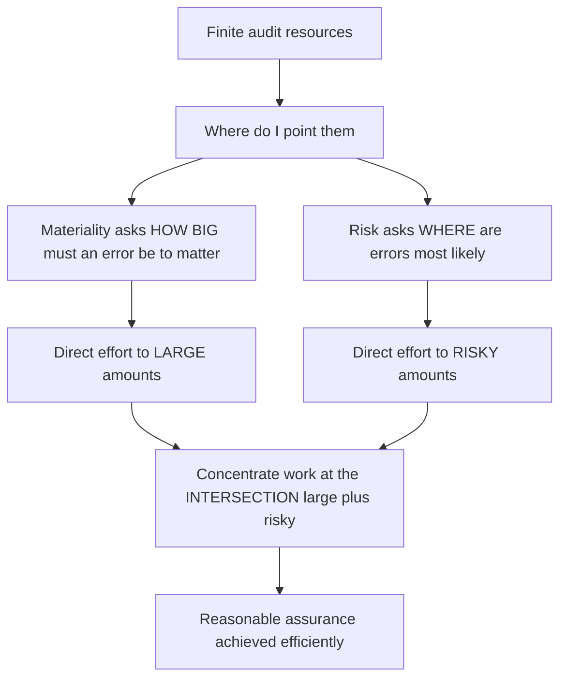
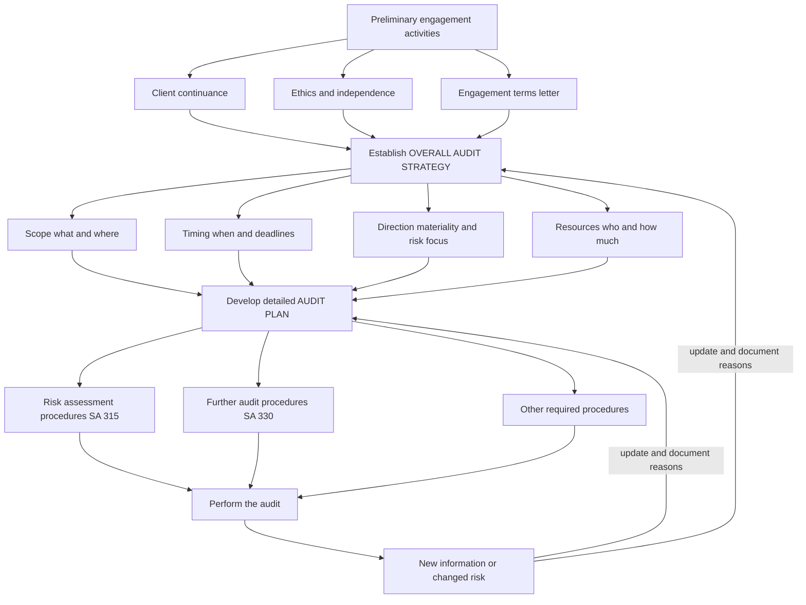
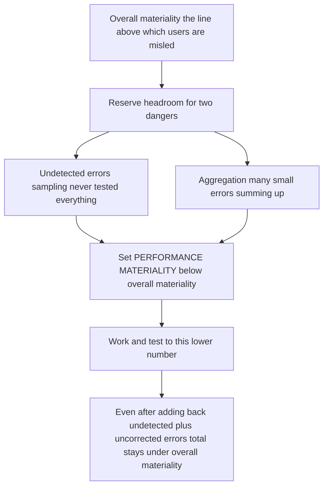

# Chapter 02 — Audit Strategy, Planning & Materiality

## 1. The Problem — You Cannot Check Everything, And Not Everything Deserves Checking

Imagine you are handed the books of a company with ₹800 crore of turnover, three lakh sales invoices, a lakh purchase entries, seven factories, two subsidiaries, inventory in nine warehouses, and a ledger with four thousand accounts. You have a team of six people and about eight weeks. Now answer honestly: **can you verify every transaction?**

You cannot. Not in eight weeks, not in eight years. And here is the deeper trap — even if you *could* check everything, it would be **wasteful and pointless**, because most of those transactions are tiny, routine, low-risk, and even if a few were wrong, it would not change the decision of a single investor or banker reading the accounts.

So the auditor faces two problems at once:

1. **The scarcity problem** — finite time, finite people, finite fees, versus an ocean of transactions. If you spread your effort evenly like butter on toast, you will look at everything shallowly and catch nothing.
2. **The relevance problem** — some errors matter and some do not. A ₹2,000 misclassification in a company with ₹50 crore profit changes nobody's mind. A ₹5 crore overstatement of revenue might turn a loss into a profit and mislead every shareholder.

Recall the trust/agency problem from Chapter 1: owners cannot verify managers, so they hire an independent expert to give **reasonable assurance** that the financial statements are free from **material** misstatement. Note the two load-bearing words — *reasonable*, not absolute; and *material*, not perfect. The entire architecture of planning and materiality flows from unpacking those two words.

**The risk this chapter addresses:** an auditor who does not plan will either (a) run out of time and give an opinion on statements he barely examined, or (b) burn his hours on trivial areas and completely miss the one account where management had both the *motive* and the *opportunity* to lie. Both outcomes mean a **wrong opinion attached to a clean-looking signature** — the exact failure the audit exists to prevent.

Planning and materiality are therefore not administrative housekeeping. They are the auditor's answer to the question: *given that I can't check everything, how do I make sure that what I do check is enough to catch the misstatements that would actually mislead a user?*

---

## 2. The Core Idea — Aim Effort Where Money Is Both Large and Likely to Be Wrong

The core idea has two blades that cut together:

> **Materiality tells you how big a misstatement must be before it matters. Risk tells you where misstatements are most likely to hide. Planning is the act of pointing your scarce audit effort at the intersection — large amounts that are also risky.**

Everything else is detail. If an amount is trivially small, you do little, because even if it's wrong nobody is misled. If an amount is large but sits in a rock-solid, low-risk area (say, share capital that hasn't changed in years), you do a bit. If an amount is large **and** risky (revenue recognition, provisions, related-party dealings, inventory valuation), you throw the bulk of your effort there.

This is why an auditor's file for a company is never a uniform grid. It is deliberately **lopsided** — thick where money and risk concentrate, thin where they don't. That lopsidedness is not laziness; it is the *whole point*. A file that is evenly thick everywhere is the mark of an auditor who never planned.

Two standards operationalise this idea:

- **SA 300 — Planning an Audit of Financial Statements**: gives you the *machinery* — build an overall audit strategy, then a detailed audit plan.
- **SA 320 — Materiality in Planning and Performing an Audit**: gives you the *threshold* — how big is big enough to matter, and how to set a safety-margin below it.

They are joined at the hip: you cannot plan effort without knowing what "matters," and knowing what matters is useless unless you translate it into a plan of action.

*Figure 2.1 — The two blades of the core idea: materiality sets the size threshold, risk sets the location, planning aims effort at their intersection.*

---

## 3. Why It's Built This Way — The Logic Behind Each Requirement

Before the technical content, let's earn each rule from first principles, so nothing has to be memorised.

**Why plan at all, formally and in writing?** Because human effort left unplanned drifts toward the easy and the familiar, not the important. A junior will happily vouch a hundred petty-cash slips because it's comfortable, while the ₹10 crore revenue-cut-off question goes untouched. A documented plan forces the engagement to confront risk *before* fieldwork begins, when there is still time to allocate senior staff and specialist attention to the hard areas. Planning is a **commitment device** against the natural gravity toward trivia.

**Why split strategy from plan?** Because scope-and-direction decisions (which offices, which subsidiaries, what timing, which specialists, how big the team) are a *different kind* of thinking from procedure-level decisions (do I confirm receivables or examine subsequent receipts). Mixing them produces mush. Strategy is the *aerial map*; the plan is the *street-by-street route*. You must draw the map before the route, because the route depends on where you've decided to go.

**Why a materiality threshold instead of chasing every rupee?** Because the user of accounts is a *decision-maker*, not an accountant seeking perfection. Materiality is defined by reference to whether a misstatement, individually or in aggregate, could reasonably be expected to **influence the economic decisions** of users taken on the basis of the financial statements. If it wouldn't change a decision, chasing it wastes the audit's scarce resources and delays the report that users actually need. The threshold is the auditor's formal recognition that *the goal is a reliable decision, not a flawless ledger.*

**Why performance materiality — a number *below* materiality?** This is the most beautiful piece of logic in the chapter, so slow down. Suppose materiality for the financial statements as a whole is ₹1 crore. If you set your working threshold at exactly ₹1 crore, you'd ignore every individual error under ₹1 crore. But **errors aggregate**. Fifty different accounts each understated by ₹5 lakh — every one "below materiality" — sum to ₹2.5 crore, which is *materially* wrong. Also, your sampling only *tests a portion*; undetected errors lurk in the untested remainder. So you deliberately work to a **lower** number (performance materiality) to leave a cushion, so that the sum of (a) uncorrected small errors you did catch and (b) undetected errors you never saw still stays under overall materiality. Performance materiality is a **buffer against aggregation and against the imperfection of sampling.** It is risk management expressed as a number.

**Why benchmarks and percentages?** Because "how big is big" is meaningless in the abstract — ₹1 crore is catastrophic for a small trader and a rounding error for a conglomerate. Materiality must be *relative* to the entity, so we anchor it to a benchmark that reflects what users care about (profit, revenue, or net assets, depending on the business) and apply a judgement-based percentage.

**Why document all of this?** Because judgement that isn't written down cannot be reviewed, cannot be defended if the audit is questioned years later, and cannot guide the team. Documentation converts one person's private reasoning into the engagement's shared, reviewable, defensible plan.

---

## 4. Full Technical Content — The Standards, By Purpose

### 4.1 SA 300 — Planning an Audit of Financial Statements

**Purpose (the "why" of the whole standard):** to ensure the audit is conducted in an *effective manner* — meaning attention is devoted to important areas, potential problems are identified and resolved on a timely basis, and the engagement is properly organised, staffed, directed and supervised.

SA 300 spells out the benefits of planning, and each benefit maps to a risk it defeats:

| Benefit of planning (SA 300) | The risk it defeats |
|---|---|
| Helps devote appropriate attention to important areas | Effort scattered on trivia; big risks missed |
| Helps identify and resolve problems on a timely basis | Nasty surprises discovered too late to address before the report deadline |
| Helps organise and manage the engagement efficiently | Duplicated work, idle staff, blown budgets and fees |
| Assists in selecting team members with appropriate capabilities and competence, and assigning work to them | A junior sent to audit a complex derivatives portfolio he cannot understand |
| Facilitates direction and supervision of the team and review of their work | Team members work in the dark; errors in their work go uncaught |
| Assists in coordinating work done by component auditors and experts | The valuation expert's work arrives too late or doesn't fit the audit's needs |

**Preliminary engagement activities (do these *before* planning):** SA 300 requires the auditor, at the *beginning* of the current audit, to:
- perform procedures regarding the **continuance** of the client relationship and the specific engagement (is this client still one we want, with acceptable integrity?);
- evaluate compliance with **ethical requirements**, including **independence** (SA 220 / the Code); and
- establish an **understanding of the terms of the engagement** (SA 210 — the engagement letter).

*Why first?* Because there's no sense planning an audit you shouldn't accept, or that you're not independent to perform. These gate-keeping checks come before you invest in strategy.

**The two-layer output of SA 300:**

**(a) The Overall Audit Strategy** — sets the **scope, timing and direction** of the audit and guides the development of the detailed plan. In establishing it, the auditor:
- identifies the **characteristics of the engagement that define its scope** (financial reporting framework applicable, industry-specific reporting, locations/components, reliance on internal audit);
- ascertains the **reporting objectives to plan the timing** of the audit and the nature of communications required (deadlines for interim and final reporting, key dates for meetings with those charged with governance);
- considers the **factors that, in the auditor's professional judgement, are significant** in directing the team's efforts (determination of materiality, preliminary identification of high-risk areas, results of previous audits, evidence of management's commitment to sound internal control);
- considers the results of **preliminary engagement activities**; and
- ascertains the **nature, timing and extent of resources** necessary to perform the engagement (how many people, how experienced, when deployed, budget).

Think of the strategy as answering four questions: **What are we auditing? When must it be done? Where are the risky areas that should shape our effort? Who and how much do we need?**

**(b) The Audit Plan** — more detailed than the strategy; it converts strategy into specific procedures. It must include a description of:
- the **nature, timing and extent of planned risk assessment procedures** (as per SA 315);
- the **nature, timing and extent of planned further audit procedures** at the assertion level (as per SA 330) — i.e., tests of controls and substantive procedures; and
- **other planned procedures** required to comply with the SAs.

*Relationship between the two:* The strategy sets the broad approach; the plan details the procedures that, if performed, achieve that approach. They are **not linear and once-off** — the standard stresses that planning is **continuous and iterative**. As the audit progresses and you learn things (a control you expected to rely on fails; a new risk emerges), you **update and change** the strategy and plan. Planning is a dial you keep turning, not a switch you flip once.

**Direction, supervision and review:** SA 300 requires the auditor to plan the **nature, timing and extent of direction and supervision** of team members and the **review** of their work. The extent scales with risk and staff competence — a risky area worked by a junior needs close supervision; a low-risk area worked by an experienced manager needs less. (This dovetails with SA 220, Quality Control.)

**Documentation (SA 300 para on documentation):** the auditor shall document:
- the **overall audit strategy**;
- the **audit plan**; and
- any **significant changes** made during the engagement to the strategy or plan, and the **reasons** for such changes.

*Why document changes and reasons?* Because a change of plan mid-audit is exactly where things go wrong and exactly what a later reviewer or regulator will scrutinise. Recording *why* you changed course shows the change was a reasoned response to new information, not drift.

**Additional considerations for initial (first-year) audits:** SA 300 flags that an *initial* audit needs *more* planning, because the auditor has no prior cumulative knowledge of the entity. Extra activities include arrangements with the **predecessor auditor** (e.g., review of prior working papers) and procedures on **opening balances** (SA 510).

*Figure 2.2 — SA 300 flow: gate-keeping first, then strategy, then plan, with a continuous feedback loop back into both.*

### 4.2 SA 320 — Materiality in Planning and Performing an Audit

**Purpose:** to apply the concept of materiality appropriately in *planning and performing* the audit. (A companion standard, **SA 450 — Evaluation of Misstatements Identified During the Audit**, deals with materiality when *evaluating* the effect of misstatements found and uncorrected. SA 320 is about setting the yardstick; SA 450 is about measuring against it at the end.)

**The concept (rooted in the financial reporting framework):** Misstatements, including omissions, are considered **material** if they, individually or in the aggregate, could reasonably be expected to **influence the economic decisions of users** taken on the basis of the financial statements. Three features of this definition carry all the weight:

1. **It's about users' decisions**, not the auditor's convenience — materiality is judged from the standpoint of a reasonable user relying on the accounts.
2. **Individually or in aggregate** — small errors that sum to a large one are material together even if each is immaterial alone. (This is the seed of performance materiality.)
3. Judgements about materiality are made in light of surrounding circumstances and are affected by the **size and/or nature** of a misstatement — quantitative *and* qualitative.

**Assumptions about users (why we can generalise):** SA 320 lets the auditor assume users:
- have a **reasonable knowledge** of business and accounting and a **willingness to study** the information with reasonable diligence;
- understand that statements are prepared and audited to **levels of materiality** (i.e., not to perfection);
- recognise the **uncertainties** inherent in measuring amounts based on estimates and judgement; and
- make **reasonable economic decisions** on the basis of the statements.

*Why this matters:* it frees the auditor from designing the audit for a hypothetical user who needs every rupee correct. The audit serves the *reasonable, diligent* user — and that is who the threshold is calibrated for.

**The three materiality figures SA 320 requires you to determine:**

**(i) Materiality for the financial statements as a whole ("overall materiality").** Set when establishing the overall strategy. Usually computed as a **percentage applied to a chosen benchmark.**

Choosing the benchmark — the standard lists factors:
- the **elements** of the financial statements (assets, liabilities, equity, revenue, expenses);
- whether there are items on which **users tend to focus** for the particular entity;
- the **nature of the entity**, where it is in its life cycle, and the industry/economic environment;
- the entity's **ownership structure and financing** (e.g., debt-financed entities → users focus on assets and claims rather than earnings); and
- the **relative volatility** of the benchmark.

Common benchmarks and their logic (percentages are indicative ranges used in practice / ICAI illustrations — **confirm current ICAI-quoted figures**, as SA 320 itself does not fix numbers):

| Benchmark | Typical range | When it's the right choice — the logic |
|---|---|---|
| Profit before tax | ~5% | Profit-oriented entity; users (investors) focus on earnings |
| Total revenue / turnover | ~0.5% – 1% | Profit is small, volatile, or near break-even, making PBT an unstable base; or a growth/loss-making company where revenue is what users watch |
| Total assets | ~1% – 2% | Asset-intensive or balance-sheet-driven entity |
| Net assets / equity | ~1% – 5% | Investment entities, funds where net asset value is the headline number |
| Gross profit / total expenses | varies | Not-for-profit or entities where expenditure is the focus |

*Why not always use PBT?* Because if profit is near zero, 5% of it is almost nothing, and you'd set an absurdly tiny materiality that makes the audit un-performable. When the natural benchmark is unstable, switch to a steadier one (often revenue). The benchmark must reflect *what users of this particular entity actually care about* and must be *stable enough to be a reliable yardstick.*

**(ii) Materiality level(s) for particular classes of transactions, account balances or disclosures — where applicable.** Sometimes a misstatement *below* overall materiality would *still* influence users if it hits a **specific sensitive area**. Examples: **related-party transactions**; **directors' remuneration** (a legally sensitive disclosure); a figure that determines compliance with a **loan covenant** or a **regulatory ratio**; the amount at which a company just crosses from loss to profit. For such items you set a *lower, specific* materiality. *Why:* the sensitivity here is **qualitative** — the *nature* of the item, not just its size, makes even a small error decision-relevant.

**(iii) Performance materiality.** Defined as an amount (or amounts) set at *less than* materiality for the financial statements as a whole (and less than any specific materiality for particular areas) to **reduce to an appropriately low level the probability that the aggregate of uncorrected and undetected misstatements exceeds materiality** for the statements as a whole.

Break that definition into its two jobs:
- **Aggregation cushion:** many individually-immaterial misstatements can add up past overall materiality; working to a lower number means you catch and consider more of them.
- **Undetected-error cushion:** you sample; the untested population may contain errors you never saw. The gap between performance materiality and overall materiality is the room left for those.

In practice, performance materiality is often set at **50%–75% of overall materiality** (some firms use down to ~50% for higher-risk engagements, up to ~75% for lower-risk). *The higher the risk / the more misstatements you expect, the LOWER you push performance materiality* — a bigger cushion for a riskier audit. **Confirm the specific percentages in current ICAI material**; SA 320 fixes the *principle*, not the number.

*Figure 2.3 — Why performance materiality sits below overall materiality: it reserves headroom for undetected and aggregated errors.*

**Materiality and audit risk are inversely related — a crucial linkage.** The *lower* you set materiality, the *more* misstatements become "material," so the *more* evidence you must gather to be confident none exceed it — hence *more* work, driving detection risk down. Materiality is therefore not just a reporting threshold; it is a **dial that directly sets how much audit work you do.** Set it too high and you might miss decision-relevant errors; set it too low and you drown in un-performable work. (This connects to the audit risk model — Chapter 3.)

**Revision as the audit progresses (SA 320 requirement):** The auditor shall **revise** materiality (and, if applicable, specific and performance materiality) if he becomes aware of information during the audit that would have caused a *different* initial determination — e.g., actual results diverge sharply from the estimates used to set materiality (you used *projected* profit of ₹20 crore; actuals come in at ₹8 crore). *Why:* materiality set on stale numbers is a yardstick made of rubber. And if revised *downward*, the auditor must reconsider whether performance materiality is still appropriate and whether the **nature, timing and extent of further procedures** remain adequate — often meaning *more* work.

**Documentation (SA 320 requirement):** the auditor shall document the amounts and the *factors considered* in their determination:
- materiality for the financial statements as a whole;
- materiality level(s) for particular classes/balances/disclosures, if applicable;
- performance materiality; and
- any **revision** of the above as the audit progressed.

*Why record the factors, not just the numbers?* Because the number is a conclusion; the *factors* are the reasoning. A reviewer must be able to see *why* PBT was chosen over revenue and *why* 5% and not 3% — otherwise the figure is an unaccountable guess.

### 4.3 How Materiality Directs Effort — Tying It Back to Assertions

Materiality doesn't float above the audit; it lands on **specific assertions** in **specific accounts**. Recall the assertions (SA 315) that management implicitly makes about the numbers:

| Category | Assertion | Plain meaning |
|---|---|---|
| Transactions/events | Occurrence | It really happened and pertains to the entity |
| | Completeness | Nothing that should be recorded is left out |
| | Accuracy | Amounts recorded correctly |
| | Cut-off | Recorded in the correct period |
| | Classification | Recorded in the right accounts |
| Account balances | Existence | The asset/liability really exists |
| | Rights and obligations | The entity owns it / owes it |
| | Completeness | All balances recorded |
| | Valuation and allocation | Recorded at an appropriate value |
| Presentation/disclosure | Occurrence, completeness, classification, accuracy, valuation | Disclosed events happened, all needed disclosures made, clearly and correctly |

Planning uses materiality **plus** the risk to each assertion to decide *where and how much* to test. For **revenue**, the risky assertions are usually **occurrence** (fictitious sales inflating revenue) and **cut-off** (sales of next year pulled into this year). For **inventory**, it's **existence** and **valuation** (does it exist, and is it worth what's stated after obsolescence?). For **liabilities and provisions**, it's **completeness** (the temptation is to *hide* liabilities, so you hunt for the *unrecorded* ones). Naming the assertion at risk is what turns "audit revenue" into a targeted procedure — you design the test to attack the specific lie management would be tempted to tell.

---

## 5. Applied Scenarios — Reasoning to the Audit Response

**Scenario 1 — The break-even benchmark trap.**
*Facts:* GreenGro Ltd, an agri-inputs company, had PBT of ₹18 crore last year but this year, after a bad monsoon, expects PBT of only ₹40 lakh on turnover of ₹520 crore. The junior proposes materiality of 5% of PBT = ₹2 lakh.

*Reasoning:* ₹2 lakh materiality on a ₹520 crore business is absurd — nearly every account would be "material," the audit becomes un-performable, and the tiny threshold reflects a one-off profit dip, not what users care about. PBT here is **volatile and near break-even**, disqualifying it as a stable benchmark. Switch to a steadier base users would focus on for a company in a rough patch — **revenue**. At, say, 0.75% of ₹520 crore, overall materiality ≈ ₹3.9 crore, a sensible yardstick. Document *why* the benchmark was changed. *Lesson:* the benchmark must be stable and user-relevant; a collapsing PBT triggers a switch, usually to revenue.

**Scenario 2 — The qualitatively material small number.**
*Facts:* For MetroBuild Ltd, overall materiality is ₹1.2 crore. The auditor finds directors' remuneration is overstated by ₹9 lakh, and separately a related-party loan of ₹15 lakh to a director's firm is undisclosed. Both are far below ₹1.2 crore. The manager says "immaterial, ignore."

*Reasoning:* Wrong. **Nature can make a small amount material.** Directors' remuneration and related-party transactions are legally and governance-sensitive disclosures (also tied to Companies Act requirements); a misstatement here can influence users' judgement about stewardship and conflicts regardless of size. These call for a **specific (lower) materiality** under SA 320, and the misstatements should be evaluated as **qualitatively material**. The auditor should seek correction/disclosure and, if refused, consider the impact on the opinion. *Lesson:* materiality is size **and/or** nature — sensitive disclosures pierce the quantitative threshold.

**Scenario 3 — Mid-audit surprise forces revision.**
*Facts:* At planning, PixelSoft Ltd was budgeted to earn ₹30 crore PBT; materiality was set at 5% = ₹1.5 crore, performance materiality at 75% = ₹1.125 crore (low-risk assessment). During fieldwork, a major customer goes insolvent; actual PBT will be ₹9 crore, and the auditor now suspects aggressive revenue recognition.

*Reasoning:* Two things changed — the **benchmark magnitude** (actual profit far below projection) and the **risk** (fraud risk in revenue is now higher). SA 320 requires **revising overall materiality downward** to reflect real PBT (5% of ₹9 crore = ₹45 lakh). Because materiality dropped and risk rose, **performance materiality must be pushed lower** (toward 50% given higher risk), and the auditor must reconsider whether the planned **nature, timing and extent** of procedures on revenue are still sufficient — almost certainly expanding substantive testing and adding cut-off and occurrence procedures. Every change and its reason goes into the documentation. *Lesson:* materiality is a live figure; divergence of actuals from estimates and emerging risk both force revision, and revision cascades into more work.

**Scenario 4 — The evenly-thick file.**
*Facts:* A reviewer opens the audit file of a manufacturing client and finds roughly equal working-paper volume on share capital (unchanged for six years), petty cash, revenue, and inventory valuation.

*Reasoning:* This is a **planning failure**, not thoroughness. Share capital and petty cash are low-risk, low-impact; revenue (occurrence/cut-off) and inventory valuation (obsolescence) are high-risk, high-value. A properly planned audit under SA 300, driven by materiality and risk, would be **lopsided** toward revenue and inventory. Equal effort everywhere means senior attention was *not* directed to where misstatement is both likely and large. *Lesson:* the shape of the file should mirror the map of risk × materiality; uniform effort is a red flag.

---

## 6. Procedure / Documentation Summary

**The planning workflow, start to finish:**

1. **Preliminary engagement activities** — client continuance; ethics and independence evaluation; confirm/agree engagement terms (engagement letter, SA 210).
2. **Obtain/update understanding of the entity and its environment** (SA 315) sufficient to identify risk areas — feeds both strategy and materiality.
3. **Set overall materiality** — choose benchmark, justify the percentage, compute; document benchmark rationale.
4. **Set specific materiality** for sensitive classes/balances/disclosures where a smaller misstatement would influence users; document.
5. **Set performance materiality** below overall (and below specific) materiality, calibrated to expected risk; document the percentage logic.
6. **Establish the overall audit strategy** — scope, timing, direction, resources.
7. **Develop the detailed audit plan** — planned risk-assessment procedures (SA 315) and planned further procedures at assertion level (SA 330), plus other required procedures.
8. **Plan direction, supervision and review** proportionate to risk and staff competence.
9. **Execute, monitoring continuously**; when new information or changed risk appears, **update strategy/plan and revise materiality**, documenting the change and the reason.
10. **At/near completion**, use SA 450 to evaluate whether uncorrected misstatements, individually or in aggregate, exceed materiality.

**What must be in the file:**

| Document | Source SA | Must record |
|---|---|---|
| Overall audit strategy | SA 300 | Scope, timing, direction, resources |
| Audit plan | SA 300 | Nature/timing/extent of risk-assessment and further procedures |
| Significant changes to strategy/plan | SA 300 | The change **and the reasons** for it |
| Materiality determinations | SA 320 | Overall materiality; specific materiality (if any); performance materiality; **and the factors considered** |
| Revision of materiality | SA 320 | Revised amounts and reasons; reconsideration of further procedures |

---

## 7. Connections

- **Chapter 1 (Nature & objective of audit):** planning and materiality are the operational answer to *reasonable* assurance and *material* misstatement — the qualifiers baked into the audit's objective.
- **SA 315 (Identifying and assessing risks):** supplies the *risk map* that planning aims at; you cannot direct effort without first understanding the entity and its risks. Planning and risk assessment are inseparable.
- **SA 330 (Auditor's responses to assessed risks):** the audit plan's "further procedures" are literally SA 330 responses; higher assessed risk → more persuasive, more extensive procedures.
- **Audit risk model (AR = IR × CR × DR):** materiality and detection risk are inversely linked; setting materiality is one lever, evidence quantity is the other. Explored fully in Chapter 3.
- **SA 450 (Evaluating misstatements):** the back-end partner of SA 320 — you set the yardstick in planning and measure found misstatements against it at completion.
- **SA 220 / SQC 1 (Quality control):** direction, supervision and review planned under SA 300 are quality-control mechanisms; competent staffing is both a planning and a quality decision.
- **SA 210 (Engagement terms) and client acceptance:** the preliminary activities that gate the whole planning process.
- **Companies Act 2013:** materiality interacts with statutory disclosures — e.g., director's remuneration (Sec 197), related-party transactions (Sec 188), and CARO reporting — where *nature* makes small amounts material; also the auditor's Sec 143 duties presuppose a properly planned audit.

---

## 8. Traps & Examiner Tricks

1. **"Materiality is a fixed rule / a single percentage."** *False.* SA 320 fixes no numbers; it's a matter of **professional judgement** using benchmarks. Any answer quoting "materiality = 5% always" loses marks. Say the number is *judgement-based* and *entity-specific.*
2. **Forgetting the qualitative dimension.** Examiners love a *small* amount in a *sensitive* area (director's pay, related parties, an amount that flips loss to profit, a covenant breach). The trap answer says "immaterial — ignore." The right answer invokes **nature-based materiality** and specific materiality.
3. **Confusing overall vs performance vs specific materiality.** Overall = the top-line threshold for the statements; **performance = a lower working figure** to buffer aggregation and undetected error; **specific = a lower figure for particular sensitive areas.** Mixing these up is a classic slip. Performance materiality is always **below** overall.
4. **Getting the risk–materiality direction backwards.** Higher risk → **lower** performance materiality (bigger cushion), and lower materiality → **more** audit work. Some students write the inverse. Reason it: more risk means more room needed for undetected error, so tighten the working threshold.
5. **Treating planning as a one-time event.** SA 300 stresses planning is **continuous and iterative**; the plan is revisited and revised. "Plan once at the start and never touch it" is wrong.
6. **Strategy vs plan mix-up.** Strategy = scope/timing/direction/resources (the map). Plan = detailed procedures (the route). If a question asks for contents of the *strategy*, do not list audit procedures; if it asks for the *plan*, do not list resource/timing decisions.
7. **Forgetting to revise materiality when actuals diverge.** If the exam gives you a *projected* profit at planning and *actual* profit later that's very different, the examiner is testing whether you know SA 320 **requires revision** — and that downward revision triggers reconsideration of procedures.
8. **Omitting documentation.** Every planning and materiality decision — including **the reasons/factors** and any **changes** — must be documented. Answers that stop at "the auditor decides X" without "and documents it" leave marks on the table.
9. **Thinking planning means all work is done before fieldwork.** No — planning is *not* a discrete phase that finishes before evidence-gathering; it continues throughout, and *some* substantive procedures may even begin during planning.
10. **"Planning is only for large/complex audits."** Scale of planning varies with the entity's size and complexity, but *every* audit is planned. A small audit needs less, not zero.

---

## 9. First-Principles Recap

Strip everything away and here is the skeleton:

- You **cannot** check everything (scarcity), and you **shouldn't** (relevance). So you must aim.
- To aim, you need to know **what size of error matters** (materiality — set by users' decisions, anchored to a stable, entity-relevant benchmark) and **where errors hide** (risk — from understanding the entity and its assertions).
- Point effort at the **intersection of large and risky.** That is planning.
- Because errors **aggregate** and because you only **sample**, work to a threshold **below** the one that matters — that safety margin is **performance materiality.**
- Because *nature* can make a *small* error decision-relevant, carve out **specific materiality** for sensitive areas.
- Because facts change, treat both the plan and the materiality figures as **living**, revising and documenting as you learn.
- **SA 300** is the machinery (strategy then plan, continuously updated, documented). **SA 320** is the threshold (overall, specific, performance, revised, documented).

Every rule in this chapter is a defence against one failure: **signing a clean opinion on statements that were, in a way that would have changed a user's decision, wrong.**

---

## 10. Quick-Revision Sheet

**Key Standards**

| SA | Title | One-line purpose |
|---|---|---|
| SA 300 | Planning an Audit of Financial Statements | Build overall strategy + detailed plan so effort hits important areas; document both and any changes |
| SA 320 | Materiality in Planning and Performing an Audit | Set overall, specific and performance materiality by judgement; revise as needed; document amounts and factors |
| SA 450 | Evaluation of Misstatements Identified During the Audit | (Back-end) measure found misstatements against materiality |
| SA 315 | Identifying and Assessing the Risks of Material Misstatement | Supplies the risk map planning aims at |
| SA 330 | The Auditor's Responses to Assessed Risks | The "further procedures" the plan schedules |

**SA 300 — Overall Strategy sets four things**

| Element | Question answered |
|---|---|
| Scope | What/where are we auditing (framework, components, locations) |
| Timing | When — deadlines, interim vs final, reporting to TCWG |
| Direction | Materiality + preliminary risk areas that focus effort |
| Resources | Who (team size, skill), how much (budget), when deployed |

**SA 300 — Audit Plan details three things:** planned risk-assessment procedures (SA 315); planned further procedures at assertion level (SA 330 — tests of controls + substantive); other required procedures. *Plan direction/supervision/review too.*

**Preliminary engagement activities (before planning):** client continuance; ethics + independence; engagement terms (SA 210).

**SA 320 — Three materiality figures**

| Figure | What | Why |
|---|---|---|
| Overall materiality | % × benchmark for FS as a whole | Threshold above which users are misled |
| Specific materiality | Lower figure for sensitive classes/balances/disclosures | *Nature* makes small errors decision-relevant |
| Performance materiality | Below overall (often ~50–75%) | Cushion for aggregation + undetected (sampling) error |

**Benchmarks:** PBT ~5% (profit-focused); Revenue ~0.5–1% (volatile/near-break-even/loss-making); Total assets ~1–2% (asset-heavy); Net assets ~1–5% (funds). *Confirm exact ICAI-quoted percentages; SA 320 fixes no numbers.*

**Key relationships:**
- Materiality ↓ ⇒ audit work ↑ (inverse).
- Risk ↑ ⇒ performance materiality ↓ (bigger cushion).
- Materiality = **size AND/OR nature** (quantitative + qualitative).

**Revise materiality when** actuals diverge from planning estimates or new info emerges; downward revision ⇒ reconsider nature/timing/extent of procedures.

**Documentation checklist:** overall strategy; audit plan; significant changes + reasons; overall/specific/performance materiality + **factors**; materiality revisions.

**The one sentence:** *Because you can't check everything and not everything matters, plan your scarce effort onto amounts that are both large (materiality) and likely wrong (risk), work to a buffer below what matters (performance materiality), and keep both the plan and the threshold alive and documented.*
