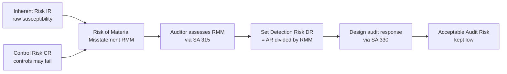
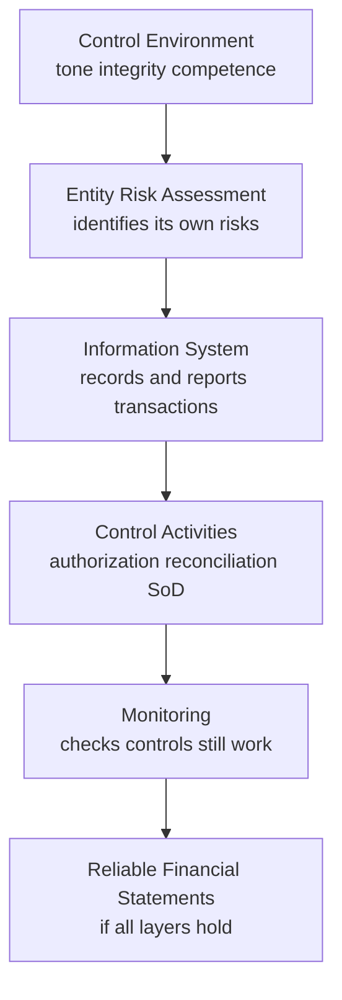
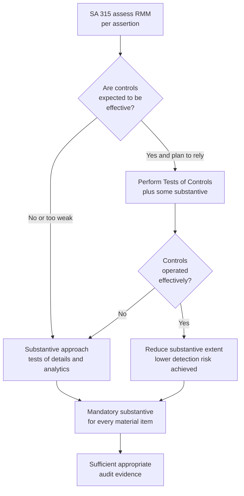
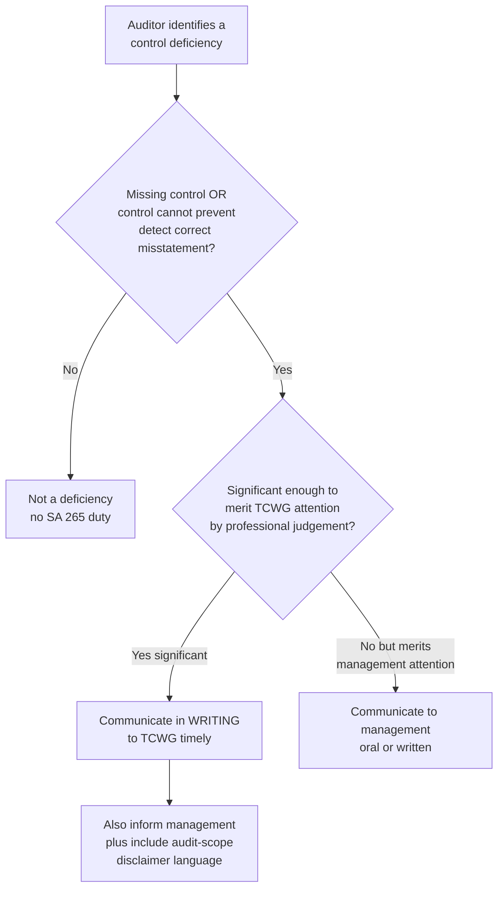

# Chapter 03 — Risk Assessment & Internal Control

## 1. The Problem — You Cannot Check Everything, and Some Things Are Designed to Fool You

Chapter 1 established *why* audit exists: owners cannot verify managers, so an independent expert gives assurance. But now confront the operational nightmare that assurance actually creates.

A mid-size manufacturing company has 40,000 sales invoices, 12,000 purchase entries, 3,000 journal vouchers, a fixed-asset register with 900 line items, inventory in four warehouses, and a bank reconciliation touching 15,000 transactions a year. The financial statements it produces are a *summary* of all this — and the auditor must give an opinion on whether that summary is free from **material misstatement**.

Here is the trap that a naive person walks straight into: **"I'll just check everything."** You cannot. 100% examination of every transaction would take years, cost more than the company earns, and *still* not guarantee correctness — because some misstatements are not in the transactions at all but in the *estimates*, the *disclosures*, and the *deliberate concealment* by management. Audit is, by economic necessity, a **sampling and judgement exercise**. And the moment you accept that you will examine only *some* of the evidence, you have accepted **risk** — the risk that the bit you didn't look at was exactly where the error hid.

So the real problem of Chapter 3 is this:

> **How does an auditor deploy limited time and resources to catch material misstatement, when misstatement is unevenly spread, sometimes deliberately hidden, and impossible to fully examine?**

The answer cannot be "work harder everywhere." Effort spread evenly is effort wasted. The answer must be **targeting** — pour audit effort *where the danger of misstatement is greatest* and go light where danger is low. To target, you must first *measure the danger*. That measurement is called **risk assessment**, and the machinery a company uses to keep its own numbers honest — the thing that raises or lowers the danger — is called **internal control**. This entire chapter is the science of pointing the audit torch at the right corner of a dark room.

---

## 2. The Core Idea — Audit Risk Is a Product You Manage Down to an Acceptable Level

The single most important idea in modern auditing is that the auditor does **not** try to achieve certainty. Certainty is impossible and uneconomic. Instead the auditor accepts a small, defined chance of being wrong — called **audit risk** — and then *engineers* the audit so that this chance stays low.

**Audit risk (AR)** = the risk that the auditor expresses an *inappropriate opinion* (typically: says the statements are fine when they are materially misstated).

The genius of the framework is that audit risk is broken into components that behave like a **multiplication chain**:

> **AR = IR × CR × DR**
>
> Audit Risk = Inherent Risk × Control Risk × Detection Risk

- **Inherent Risk (IR):** the susceptibility of a balance or transaction to material misstatement *before* considering any controls — the raw danger. Cash is more temptable than land; estimates are riskier than routine invoices; a complex derivative is riskier than a salary payment.
- **Control Risk (CR):** the risk that the company's own internal controls *fail* to prevent or detect a misstatement. Weak controls → high CR. Strong controls → low CR.
- **Detection Risk (DR):** the risk that the auditor's *own procedures* fail to catch a misstatement that exists. This is the **only** component the auditor controls directly.

The first two — IR and CR — belong to the *entity*. Together they are the **Risk of Material Misstatement (RMM = IR × CR)**. The auditor cannot change them; they exist independently of the audit. The auditor can only *assess* them. Detection risk is the auditor's lever: by doing more/better work, DR falls; by doing less, DR rises.

**The core mental move:** you decide the acceptable AR (kept low, e.g. conceptually ~5%). You *assess* RMM (IR × CR) by understanding the entity. Then you *set* DR = AR ÷ RMM, and design procedures to hit it. High RMM forces low DR forces *more* audit work. Low RMM permits higher DR permits *less* work. That is targeting, expressed as arithmetic.

*Figure 1 — The audit risk model as a torch-pointing device: assess the entity's risk, then set your own effort to compensate.*

---

## 3. Why It's Built This Way — The Logic Behind Every Piece

Before any Standard, understand *why the profession chose this exact structure*. Every design choice answers a specific failure it was trying to prevent.

**Why split risk into IR, CR, DR at all?** Because lumping them hides the lever. If you only knew "total risk is high," you wouldn't know *what to do about it*. Splitting reveals that some risk is the *entity's* (IR, CR — you can only react) and some is *yours* (DR — you can control). The split converts a vague worry into an action plan: "RMM is high here, so I must drive my DR down here."

**Why is DR inversely related to RMM?** This is the whole point of assessment. If a company has weak controls over revenue (high CR) and revenue is easily manipulated (high IR), then RMM is high — misstatement is *likely to exist and unlikely to be caught by the company*. The auditor cannot rely on the company's safety net, so the auditor's *own* net must be tighter: lower DR, meaning more extensive, more reliable, more year-end-focused procedures. Conversely, strong controls let the auditor lean on them and do less substantive testing. **DR is the compensating variable.** The inverse relationship is not a formula to memorize — it is the logic of a safety system: if one net has holes, the other must be finer.

**Why understand *controls* rather than just test balances directly?** Because controls are a *force multiplier of evidence*. If you prove a control operated effectively all year (e.g., every dispatch is matched to an approved order before invoicing), you gain assurance over *thousands* of transactions at once, cheaply. Testing balances directly (substantive testing) gives assurance transaction-by-transaction — thorough but expensive. Understanding controls lets the auditor *choose the cheaper route where it's safe*.

**Why is understanding the entity mandatory (not optional)?** Because you cannot assess IR without knowing the business. Is inventory perishable? Is the industry in decline (going-concern pressure)? Are there related parties? Is management compensated on profit (incentive to overstate)? Risk lives in *context*. SA 315 makes "understanding the entity" compulsory precisely because a risk you don't understand is a risk you will misprice — you'll over-audit the safe areas and under-audit the dangerous ones, which is exactly the failure the whole model exists to prevent.

**Why does a control *deficiency* trigger a separate communication duty (SA 265)?** Because the auditor, in doing the audit, becomes the person in the best position to *see* control weaknesses — and those who govern the company (owners, audit committee) have a right to know their safety system has holes, even though fixing controls is *not* the auditor's job. This is the trust/agency problem again: the auditor is the owners' eyes.

---

## 4. Full Technical Content — The Standards, By the Risk Each One Counters

### 4.1 SA 315 — Identifying and Assessing the Risks of Material Misstatement Through Understanding the Entity and Its Environment

**The risk it counters:** the risk that the auditor *misprices danger* — either misses a high-risk area entirely or wastes effort on low-risk areas — because they never understood the business. You cannot aim a torch in a room you've never entered.

**The core requirement:** the auditor **shall** perform **risk assessment procedures** to obtain an understanding of the entity, its environment, and its internal control, sufficient to identify and assess RMM at two levels:

1. **Financial statement level** — pervasive risks affecting many assertions (e.g., weak overall control environment, going-concern doubt, management with an incentive to misstate). These often demand an *overall response* (e.g., more experienced staff, heightened professional skepticism).
2. **Assertion level** — risks tied to specific classes of transactions, account balances, and disclosures (e.g., "revenue may be overstated through cut-off errors"). These demand *specific* procedures.

**Risk assessment procedures (the three tools):**

| Procedure | What it is | Risk it addresses |
|---|---|---|
| **Inquiry** | Asking management, internal audit, employees, those charged with governance | Surfaces management's own view of risk and where processes are weak; but inquiry alone is weak evidence (people can mislead) |
| **Analytical procedures** | Studying plausible relationships in data (ratios, trends, expectations) | Flags *unusual* items — a margin that jumped, a ratio out of line — pointing the torch at anomalies |
| **Observation and inspection** | Watching processes operate; inspecting documents, records, premises | Corroborates inquiry with what actually happens, not what's claimed |

> **Trap-proofing note:** Risk assessment procedures **by themselves do not provide sufficient appropriate audit evidence** on which to base the opinion. They *scope* the audit; they don't *conclude* it. The evidence for the opinion comes later, from SA 330 responses.

**Understanding the entity — what must be understood:**
- **Industry, regulatory, and external factors** (including the applicable financial reporting framework)
- **Nature of the entity** — operations, ownership, governance, investments, structure, financing (this is where *related parties* and complex structures surface)
- **Entity's selection and application of accounting policies**
- **Objectives, strategies, and related business risks** that may cause RMM
- **Measurement and review of financial performance** (internal/external pressure to hit targets = incentive to misstate)
- **Internal control** relevant to the audit (see 4.2)

**Significant risks (a critical SA 315 concept):** some identified risks are, in the auditor's judgement, **significant risks** requiring *special audit consideration*. In deciding, the auditor considers (among others) whether the risk involves **fraud**, is related to recent **economic/accounting developments**, involves **complexity**, involves **significant related-party transactions**, involves a high degree of **estimation/subjectivity**, or involves **significant non-routine transactions**. For significant risks, the auditor **shall** obtain an understanding of the *controls* relevant to that risk, and substantive procedures **shall** be specifically responsive to it (see SA 330). *Revenue recognition* is presumed to carry a fraud risk (from SA 240) unless rebutted.

*Confirm in ICAI material: the 2021 revision of SA 315 (effective for periods beginning on/after 1 April 2023 in India) restructured the control components and introduced "inherent risk factors" and a spectrum-of-inherent-risk concept; the ICAI study material may present either the older five-component framing or the revised one — know both framings.*

### 4.2 Components of Internal Control — What You Are Actually Assessing

**The risk it counters:** control risk (CR). To assess whether controls will catch misstatement, you must know *what a control system is made of*. The traditional framework (COSO, adopted in SA 315) has **five components**:

| # | Component | What it is | Why it matters to the auditor |
|---|---|---|---|
| 1 | **Control Environment** | The tone at the top — integrity, ethical values, competence, governance oversight, management philosophy, assignment of authority | The *foundation*. If the environment is rotten (management overrides controls, no ethics), every other control is unreliable. A weak control environment is a **financial-statement-level** risk |
| 2 | **Entity's Risk Assessment Process** | How the entity *itself* identifies and responds to business risks relevant to reporting | If the entity assesses its own risks well, misstatements are less likely; if it doesn't, the auditor must |
| 3 | **Information System & Communication** | The processes and records that initiate, record, process, and report transactions (including the accounting system) and how roles/responsibilities are communicated | This is the *plumbing* that produces the numbers. The auditor must understand how a transaction flows from origin to the financial statements |
| 4 | **Control Activities** | The specific policies/procedures that enforce management directives — **authorizations, reconciliations, segregation of duties, physical controls, IT application controls, performance reviews** | These are the individual "catches" the auditor may test and rely on |
| 5 | **Monitoring of Controls** | The process of assessing control effectiveness over time (including internal audit) | Controls decay; monitoring is the entity's self-repair mechanism |

Mnemonic-free way to hold this: think of it as a **house**. The *control environment* is the foundation (values). *Risk assessment* is the owner deciding where the locks go. The *information system* is the wiring and pipes that carry activity. *Control activities* are the individual locks, gates, and checks. *Monitoring* is the maintenance crew checking the locks still work. A lock (control activity) on a house with no foundation (bad environment) is worthless — which is *why* the auditor weighs the environment first.

**Limitations of internal control (why CR can never be zero):** Every control system has inherent limits, and the auditor must never assume controls make substantive testing unnecessary:
- **Management override** — those who run the controls can bypass them (the classic fraud route)
- **Collusion** — two people defeating a segregation-of-duties control
- **Human error** — fatigue, misunderstanding, carelessness
- **Cost-benefit** — management won't spend more on a control than the risk is worth
- **Non-routine transactions** — controls are built for routine, and miss the unusual
- **Manual controls** subject to judgement lapses; **IT controls** vulnerable to program changes and unauthorized access

This is precisely why **detection risk can never be reduced to zero** and why *some* substantive procedures are **always** required regardless of how strong controls appear.

*Figure 2 — Internal control as a layered house; the auditor tests upward from foundation to individual locks.*

### 4.3 SA 330 — The Auditor's Responses to Assessed Risks

**The risk it counters:** the risk that the auditor *assesses* danger correctly (via SA 315) but then *does nothing appropriate about it* — a diagnosis with no treatment. SA 330 is the **treatment**: it converts risk assessments into procedures.

SA 330 mandates responses at **two levels**, mirroring SA 315:

**(A) Overall responses — to financial-statement-level risks.** Examples:
- Emphasize **professional skepticism** to the engagement team
- Assign **more experienced staff** or those with specialized skills; use experts
- Provide **more supervision**
- Incorporate **unpredictability** in the selection of procedures (so management can't anticipate and conceal)
- Make **general changes** to the nature, timing, or extent of procedures (e.g., shift work to year-end)

A weak control environment pushes the auditor toward *more substantive procedures*, *more work at period-end rather than interim*, and *broader-scope* evidence.

**(B) Further audit procedures — to assertion-level risks.** These are designed responsive to the assessed RMM for each relevant assertion, and come in **two types**:

1. **Tests of Controls (ToC)** — test whether a control *operated effectively* throughout the reliance period.
2. **Substantive Procedures (SP)** — test the *monetary correctness* of the underlying amounts/disclosures directly.

The auditor chooses the **nature, timing, and extent** (the "NTE") of procedures in response to risk:
- **Nature** = *what kind* of procedure and its purpose/reliability (e.g., external confirmation is more reliable than inquiry; inspection of a document more reliable than observation). Higher risk → more reliable nature.
- **Timing** = *when* performed (interim vs period-end). Higher risk → push toward **period-end** (less chance for post-interim misstatement to go undetected).
- **Extent** = *how much* (sample size, number of items). Higher risk → **larger extent**.

**The golden rule — irrespective of assessed risk, SA 330 requires that the auditor perform substantive procedures for each *material* class of transactions, account balance, and disclosure.** You can *never* rely on controls alone for material items. And for **significant risks**, if the auditor's approach is substantive-only, those procedures **shall include tests of details** (not analytics alone).

*Figure 3 — SA 315 to SA 330: from diagnosis to treatment, choosing the audit route.*

### 4.4 Tests of Controls vs Substantive Procedures — When Each, and Why

This is the operational heart of the chapter. Two routes to assurance; the auditor picks based on **risk and economics**.

**Tests of Controls (ToC)** — evidence about whether a control *worked*.

- **Purpose:** to support a *lower* assessment of control risk (i.e., to justify relying on controls and thereby doing less substantive work).
- **When required (mandatory):** (a) when the auditor's assessment of RMM *includes an expectation that controls operate effectively* — i.e., the auditor **intends to rely** on them; **or** (b) when substantive procedures **alone cannot** provide sufficient appropriate evidence at the assertion level. Situation (b) is common in **highly automated, paperless environments** (e.g., high-volume e-commerce) where there is *no substantive audit trail* — you *must* test the automated controls because there are no documents to substantively vouch.
- **What they test:** *operating effectiveness* — did the control operate as designed, consistently, throughout the period, and by whom? (Distinct from *implementation*, which SA 315 checks — "does the control exist and is it in use?")
- **Methods:** inquiry (weakest, never alone) *combined with* inspection, observation, **re-performance**, and inspection of evidence of control operation.
- **Timing & the reliance question:** if tested at an **interim** date, the auditor must obtain evidence about the **remaining period**. Under the "rotational" concept, controls tested and found effective in prior audits may be tested less frequently, but a control **must be tested at least once in every third audit**, and controls mitigating a **significant risk must be tested in the *current* period** (no reliance on prior-year testing for significant-risk controls).
- **Deviations:** if tests reveal deviations, the auditor must investigate and consider whether reliance is still justified — deviations may force a switch to a substantive approach.

**Substantive Procedures (SP)** — evidence about the *monetary accuracy* of the numbers themselves. Two sub-types:

1. **Tests of Details (ToD):** examining supporting evidence for individual items — vouching, tracing, external confirmation, physical verification, recalculation. Direct, reliable, expensive.
2. **Substantive Analytical Procedures (SAP):** evaluating financial information by studying plausible relationships (e.g., estimating interest expense from average loan balance × rate; expecting a stable gross margin). Efficient, best where relationships are *predictable* and volumes are *large* (e.g., payroll, rent).

**The decision — controls route vs substantive route:**

| Situation | Preferred approach | Why |
|---|---|---|
| Strong, tested controls; high transaction volume; routine | **ToC + reduced SP** (reliance approach) | Testing controls once covers thousands of transactions cheaply; efficient |
| Weak/absent controls; poor control environment | **Substantive approach (heavy ToD)** | Cannot rely on a broken safety net; must verify amounts directly |
| Highly automated, no paper trail | **ToC mandatory** (SP alone insufficient) | No documents to substantively test; assurance only obtainable via automated-control testing |
| Significant risk | **ToC of relevant controls (current year) + substantive incl. tests of details** | Special consideration demanded; analytics alone not enough |
| Material item, any risk | **Some SP always** | SA 330 mandate — controls can never fully replace substantive work on material items |

**Why not always test controls (it's cheaper)?** Because ToC is only worthwhile if (i) controls are actually well-designed and implemented, and (ii) the efficiency gain in reduced substantive work exceeds the cost of the control testing. For a *small* population or *weak* controls, it's cheaper to just substantively test the items. Reliance is an *economic bet*: spend on ToC only when it buys a bigger reduction in SP.

### 4.5 SA 265 — Communicating Deficiencies in Internal Control to Those Charged With Governance and Management

**The risk it counters:** the risk that the auditor *sees* a hole in the company's control system during the audit but *fails to tell the people who could fix it* — leaving owners exposed to future misstatement and fraud they don't know about. It also counters the confusion between "the auditor found a weakness" and "the auditor is responsible for fixing controls" (they are **not**).

**Key definitions:**
- A **deficiency in internal control** exists when (a) a control is *designed, implemented, or operated* such that it is *unable to prevent, or detect and correct*, misstatements on a timely basis; **or** (b) a *necessary* control is *missing*.
- A **significant deficiency** is a deficiency (or combination) that, in the auditor's *professional judgement*, is of *sufficient importance to merit the attention of those charged with governance* (TCWG).

**Requirements:**
1. The auditor **shall determine** whether identified deficiencies, individually or in combination, constitute *significant* deficiencies.
2. The auditor **shall communicate in writing** *significant* deficiencies to **TCWG** on a timely basis.
3. The auditor **shall also communicate** (in writing or orally) to **management** at an appropriate level: (a) significant deficiencies communicated/to be communicated to TCWG, and (b) *other* deficiencies not communicated to TCWG that, in the auditor's judgement, are of sufficient importance to merit management's attention.

**Contents of the written communication of significant deficiencies:**
- A **description** of the deficiencies and an **explanation of their potential effects**; and
- Sufficient **information to enable TCWG and management to understand the context**, specifically that: the purpose of the audit was to express an opinion on the financial statements; the audit **considered internal control relevant to the audit** in order to design appropriate procedures, **not** to express an opinion on the effectiveness of internal control; and the matters reported are limited to deficiencies the auditor identified and considered significant.

**Why the disclaimer language matters:** without it, TCWG might assume the auditor has *comprehensively* evaluated and blessed the control system. The auditor looked at controls *only to plan the audit*. The communication must not create false assurance — the trust problem again: honest scoping of what was and wasn't done.

**Judging severity** — factors that make a deficiency *significant* include: susceptibility to loss/fraud; subjectivity of related amounts; volume of activity exposed; interaction with other deficiencies; the *importance* of the control to the reporting process; and whether it has already resulted in a misstatement. A deficiency can be significant *even if no misstatement has yet occurred* — the potential is enough.

*Figure 4 — SA 265 decision tree: from a spotted weakness to the right communication.*

---

## 5. Applied Scenarios — Reasoning From Risk to Response

### Scenario A — The Fast-Growing Software Company With No Paper Trail

*Facts:* CloudBill Ltd sells SaaS subscriptions entirely online. Customers self-provision, payments flow through an automated gateway, revenue is recognized by software on a rateable basis. There are **no sales invoices in the traditional sense** and no manual approvals — the system does everything. Revenue is Rs. 400 crore and is the largest, most sensitive figure.

*Reasoning:* Revenue carries a **presumed fraud/significant risk** (SA 240/315), and the **inherent risk is high** (rateable recognition involves timing judgement; high volume; automated). Critically, there is **no substantive audit trail** — you cannot vouch 2 million micro-transactions to paper. Under **SA 330**, when substantive procedures *alone* cannot provide sufficient appropriate evidence, **tests of controls become mandatory**. The auditor must test the **automated application controls** (correct rating logic, interface completeness between billing and GL, access controls preventing unauthorized revenue changes) and the **IT general controls** that keep those application controls reliable (change management, access, operations).

*Correct response:* ToC over automated revenue controls **plus** substantive analytical procedures (e.g., building an independent expectation of revenue from subscriber counts × plan prices × active days) **plus** tests of details on a sample around **cut-off**. Because revenue is a significant risk, substantive procedures **must include tests of details**, and the relevant controls must be tested **in the current period**.

### Scenario B — The Family-Run Trader Where the Owner Signs Everything

*Facts:* Bharat Traders is run by its promoter, who personally approves every payment, signs every cheque, and also keeps the books with one clerk. Segregation of duties is effectively **absent**; the promoter can **override** any control.

*Reasoning:* The **control environment** is dominated by one person; **control risk is high** because *management override* is unconstrained and *segregation of duties* is missing (one person initiates, records, and authorizes). Testing controls would be pointless — there is little to rely on, and relying on controls a single person can override is unjustifiable. RMM is high, driven by both IR (small entity, informal) and CR (weak controls).

*Correct response:* Adopt a **predominantly substantive approach** (SA 330 overall response to a weak environment). Increase the **extent** of tests of details, push **timing** to period-end, increase **professional skepticism**, and specifically design procedures for **management override of controls** (per SA 240: test journal entries, review estimates for bias, scrutinize significant unusual transactions). Under **SA 265**, the absence of segregation of duties is very likely a **significant deficiency** — communicate it **in writing to TCWG** (here, effectively the promoter, but the written record and disclaimer language still stand).

### Scenario C — Strong Controls at Interim, But a New ERP Went Live in December

*Facts:* Sterling Manufacturing had well-designed controls tested effectively at the **September interim** visit; the auditor planned a **reliance (ToC) approach** to reduce year-end substantive work. In **December**, the company migrated to a new ERP system. Year-end is March.

*Reasoning:* Reliance on interim ToC requires evidence about the **remaining period** (Oct–Mar). A **system migration is a significant change** to the information system component of internal control — the controls tested in September may **no longer be the controls operating** in Jan–Mar. The auditor cannot blindly extend September's conclusion across a control break. This also raises **data-integrity risk** (did balances migrate completely and accurately?).

*Correct response:* Update the understanding of the **new** control environment; perform **tests of controls on the post-migration system** for the remaining period (or, if that's impractical, extend **substantive procedures** to cover Dec–Mar). Perform **specific substantive procedures over the data migration** (completeness and accuracy of opening balances in the new system — reconcile pre- and post-migration totals). The migration itself may be a **significant risk** (complex, non-routine) requiring special consideration and current-period testing.

### Scenario D (bonus) — Analytical Anomaly During Risk Assessment

*Facts:* During SA 315 analytical procedures, gross margin jumped from 22% to 31% with no change in product mix or prices, while inventory days doubled.

*Reasoning:* This is a **risk-assessment red flag**, not a conclusion. A margin spike with ballooning inventory is a classic signature of **inventory overstatement** (or purchases/cost understatement) — which would inflate profit. This elevates **inherent risk** for inventory valuation and existence assertions.

*Correct response:* Raise assessed RMM for inventory; design **responsive substantive procedures** (attend the physical count, test valuation and net realizable value, examine slow-moving/obsolete provisions, test purchase cut-off). The analytics **scoped** the risk; the response **resolves** it.

---

## 6. Procedure & Documentation Summary — What Must Be On File

Audit is a discipline of *evidence*, and evidence that isn't documented didn't happen (SA 230). For this chapter, the working papers must show the *chain from risk to response*:

**Risk assessment documentation (SA 315 requires the auditor to document):**
1. The **discussion among the engagement team** (including how/when it occurred and significant decisions) about the susceptibility of the statements to material misstatement, including from fraud.
2. **Key elements of the understanding** obtained regarding the entity, its environment, and each internal control component; the **sources** of that information; and the **risk assessment procedures** performed.
3. The **identified and assessed RMM** at the financial-statement level and the assertion level.
4. The **risks identified** and related **controls** about which the auditor obtained an understanding, and any **significant risks** and significant-risk-related controls.

**Response documentation (SA 330 requires the auditor to document):**
5. The **overall responses** to FS-level risks, and the **nature, timing, and extent** of further audit procedures.
6. The **linkage** of those procedures with the assessed risks at the assertion level (the audit-quality inspector must be able to trace *this procedure* back to *that risk*).
7. The **results** of the procedures, and — where relying on controls tested in **prior** audits — the **conclusions** about that continued reliance.

**Deficiency documentation (SA 265):**
8. **Written communication** of significant deficiencies to TCWG; record of communication to management of other deficiencies of sufficient importance.

**Procedure checklist for the chapter's workflow:**
- Perform inquiry + analytical procedures + observation/inspection (risk assessment procedures).
- Understand each of the five control components; evaluate **design** and **implementation** of relevant controls (walkthroughs).
- Assess RMM at both levels; flag **significant risks**.
- Decide route per assertion: reliance (ToC) vs substantive; ensure **some substantive for every material item**.
- If relying: test **operating effectiveness**; consider interim vs period-end and remaining-period coverage.
- Perform substantive procedures (tests of details and/or substantive analytics).
- Evaluate results; revisit risk assessment if evidence contradicts it (assessment is **iterative**, not one-and-done).
- Identify deficiencies; grade severity; communicate per SA 265.

---

## 7. Connections — How This Chapter Wires Into the Rest of Auditing

- **← SA 200 (Chapter 1/2):** "Reasonable assurance" and "material misstatement" are *defined* there; the audit risk model is the *mechanism* by which reasonable (not absolute) assurance is delivered. AR = IR × CR × DR is SA 200's philosophy made operational.
- **↔ SA 320 (Materiality):** materiality sets the *threshold* of what "matters"; risk assessment identifies *where* misstatement above that threshold is likely. Materiality and risk together set sample sizes (higher risk or lower materiality → larger samples). They are the two dials of audit **extent**.
- **↔ SA 240 (Fraud):** significant risks frequently *are* fraud risks; revenue recognition carries a presumed fraud risk; "management override of controls" is a mandatory fraud response that lives inside the SA 330 response set. Chapter 3 supplies the *risk machinery* that Chapter on fraud exploits.
- **→ SA 500 (Audit Evidence) & SA 530 (Sampling):** SA 330's "nature, timing, extent" is *executed* through SA 500's reliability hierarchy and SA 530's sampling methods. Extent = sample size = risk-driven.
- **→ SA 520 (Analytical Procedures):** appears twice — as a *risk assessment* tool (SA 315) and as a *substantive* tool (SA 330). Same technique, different job.
- **→ SA 402 (Service Organizations):** when controls are outsourced (e.g., cloud payroll), understanding "internal control" extends into the service provider — a direct SA 315/330 extension.
- **↔ Companies Act 2013:** **Section 143(3)(i)** requires the auditor to report on whether the company has **adequate internal financial controls (IFC) with reference to financial statements** and their **operating effectiveness** (for applicable companies) — this is a *statutory* mandate to do exactly the control evaluation SA 315/330 describe. **Section 134(5)(e)** puts the *responsibility for IFC* on the directors. **Section 177** requires an **audit committee** (TCWG) for prescribed companies — the very body SA 265 communicates deficiencies to. **CARO 2020** requires specific comments on internal controls, and **Section 138** mandates **internal audit** for prescribed companies (feeding the "monitoring" component). *Confirm exact applicability thresholds for IFC operating-effectiveness reporting and internal audit in current ICAI/Act material.*

---

## 8. Traps & Examiner Tricks

1. **"Risk assessment procedures give the audit evidence for the opinion."** *False.* They **scope**; they never, by themselves, provide sufficient appropriate evidence for the opinion. The opinion rests on SA 330 further procedures.
2. **Confusing "implementation" with "operating effectiveness."** SA 315 checks a control is *designed and implemented* (exists and is used) via walkthroughs. SA 330 **tests of controls** check it *operated effectively throughout the period*. An exam scenario that says "we saw the control exists" has **not** established reliance.
3. **"If controls are strong, we can skip substantive procedures on revenue."** *False.* SA 330 requires **substantive procedures for every material item** regardless of control strength. Controls **reduce** but never **eliminate** substantive work.
4. **Assuming DR moves the same direction as RMM.** DR is **inverse**: high RMM → low DR (more work). Students routinely flip this.
5. **"The auditor's control weakness communication means the auditor opines on internal control."** *False* — SA 265 requires explicit disclaimer language that controls were considered *only to design audit procedures*, **not** to opine on control effectiveness (except where a *separate* IFC report under Sec 143(3)(i) is required — don't conflate the two).
6. **Reliance on prior-year control testing for a significant risk.** *Not allowed.* Controls addressing a **significant risk must be tested in the current period**. And any control relied upon must be tested at least **once every third year**.
7. **For significant risks, substantive analytics alone suffice.** *False* — substantive procedures for a significant risk **must include tests of details**.
8. **Treating a deficiency as significant only if a misstatement already happened.** *Wrong* — a deficiency can be **significant on potential alone**; actual misstatement is just one factor.
9. **"Small company, so internal control isn't relevant."** The *components* still exist (often informally); a weak control environment in a small entity **raises** CR and pushes toward a substantive approach — it doesn't excuse assessment.
10. **Testing controls when you never intended to rely on them.** ToC is only required if you **plan to rely** *or* substantive evidence alone is impossible. Testing controls you won't rely on is wasted effort — an efficiency trap examiners probe.
11. **Interim testing without covering the remaining period.** Evidence from an interim ToC/SP must be *rolled forward* with evidence for the gap to period-end; forgetting this is a classic error.
12. **Inquiry alone as a test of controls.** Inquiry is *never* sufficient by itself for operating effectiveness — it must be combined with inspection, observation, or re-performance.

---

## 9. First-Principles Recap

Strip away every Standard number and this is what remains, rebuildable from scratch:

- You **cannot examine everything**, and some misstatement is **deliberately hidden**. So audit must **target** effort at danger. (The Problem.)
- To target, **measure the danger**: split it into what the *entity* brings (**inherent** susceptibility × the chance its **controls fail** = risk of material misstatement) and what *you* bring (**detection** risk — the chance your own work misses it). **AR = IR × CR × DR.**
- IR and CR you can only **assess**, not change → so you **understand the entity and its controls** (SA 315) to price them.
- DR is your **lever**. Set it *inversely* to RMM: where danger is high, drive your detection risk **down** with more, better, later-timed work. Where danger is low, do less. That inverse relationship *is* targeting.
- Controls come in **five layers** (environment → entity risk assessment → information system → control activities → monitoring), and they have **inherent limits** (override, collusion, error) — which is why **some substantive testing is always required** and DR is **never zero**.
- Convert assessment into action (SA 330): **overall responses** to pervasive risk, and **further procedures** — either **test the controls** (cheap leverage where controls are strong or no paper trail exists) or **test the amounts directly** (where controls are weak) — choosing **nature, timing, extent** by risk.
- When you spot **holes in the entity's controls**, tell the **owners/governance** (SA 265), while being honest that you looked at controls only to plan the audit.

Everything else — every requirement, every procedure — is a detailed answer to a specific way misstatement could slip past you.

---

## 10. Quick-Revision Sheet

### Key Standards at a glance

| SA | Title (short) | The risk it counters | Core requirement to remember |
|---|---|---|---|
| **SA 200** | Overall objectives / reasonable assurance | Expecting impossible certainty | AR = IR × CR × DR; reasonable, not absolute, assurance |
| **SA 315** | Identifying & assessing RMM via understanding entity & controls | Mispricing danger; blind torch | Perform risk assessment procedures; understand entity + 5 control components; assess RMM at FS & assertion level; flag **significant risks** |
| **SA 330** | Responses to assessed risks | Diagnosis with no treatment | Overall responses + further procedures (ToC and/or SP); choose **nature/timing/extent** by risk; **substantive for every material item**; significant risk → tests of details |
| **SA 265** | Communicating control deficiencies | Seeing holes but not telling owners | Grade deficiencies; **write to TCWG** for significant ones; disclaim control-opinion scope |
| **SA 520** | Analytical procedures | Missing anomalies / inefficient testing | Used both to assess risk (315) and substantively (330) |
| **SA 240** | Fraud | Deliberate concealment / override | Revenue = presumed fraud risk; test journal entries & management override |
| **Sec 143(3)(i)** | Companies Act — IFC reporting | Directors' controls unverified | Report on adequacy & operating effectiveness of IFC (where applicable) |

### The risk model — one line
**AR = IR × CR × DR**; RMM = IR × CR (entity's, only assessed); **DR = AR ÷ RMM** (auditor's lever, **inverse** to RMM).

### Five components of internal control
1. Control **Environment** (tone/integrity) 2. Entity's **Risk Assessment** process 3. **Information System** & communication 4. **Control Activities** (authorization, reconciliation, segregation of duties, physical, IT) 5. **Monitoring** of controls.

### ToC vs SP — when
- **Tests of Controls** when: you **plan to rely** on controls, **or** substantive evidence alone is impossible (no paper trail). Tests **operating effectiveness**; inquiry never alone; significant-risk controls tested **current year**; retest at least every **3rd** year.
- **Substantive Procedures** always for **material** items; **tests of details + substantive analytics**; **significant risk → must include tests of details**.

### Nature / Timing / Extent — higher risk means
- **Nature** → more **reliable** procedures (external confirmation, re-performance)
- **Timing** → shift toward **period-end**
- **Extent** → **larger** samples

### Inherent limitations of control (why CR ≠ 0, DR ≠ 0)
Management **override**, **collusion**, human **error**, **cost-benefit** limits, failure on **non-routine** transactions.

### SA 265 — deficiency ladder
Deficiency (control can't prevent/detect/correct, or is missing) → if **significant** (professional judgement, potential is enough) → **written** communication to **TCWG** + inform management + scope disclaimer.

### Overall responses to a weak control environment
More skepticism · more experienced staff · more supervision · **unpredictability** · shift to period-end · heavier substantive.

*Confirm the following in current ICAI material: the revised SA 315 (2021) component framing and "inherent risk spectrum"; exact IFC operating-effectiveness and internal-audit (Sec 138) applicability thresholds; and any CARO 2020 internal-control clause wording.*
