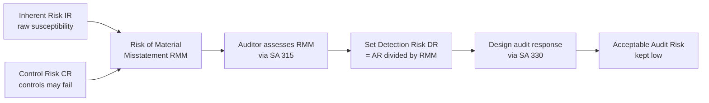
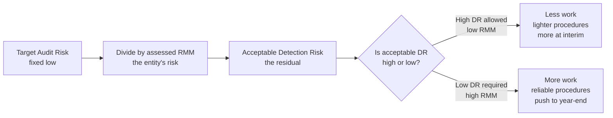
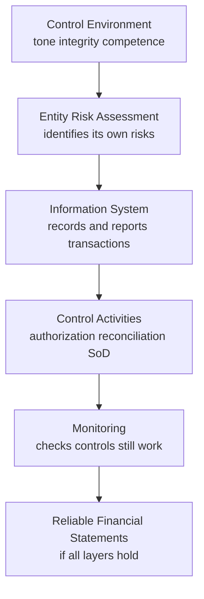
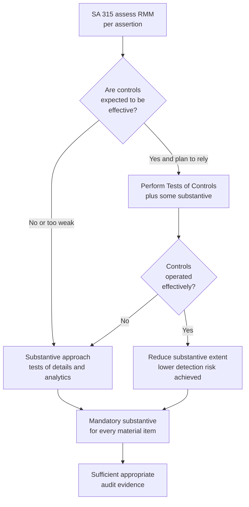
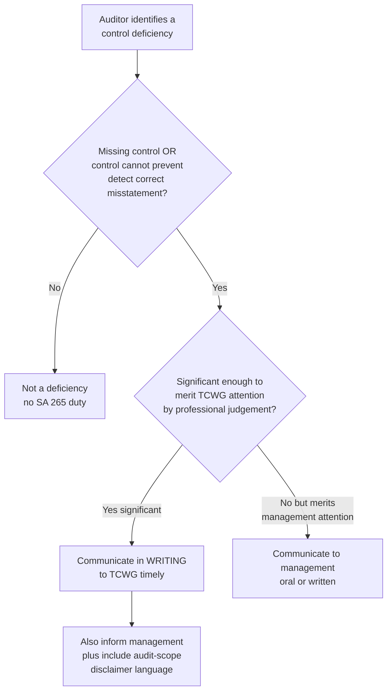

<!-- v2-deep -->

# Chapter 03 — Risk Assessment & Internal Control

## 1. The Problem — You Cannot Check Everything, and Some Things Are Designed to Fool You

Chapter 1 established *why* audit exists: owners cannot verify managers, so an independent expert gives assurance. But now confront the operational nightmare that assurance actually creates.

A mid-size manufacturing company has 40,000 sales invoices, 12,000 purchase entries, 3,000 journal vouchers, a fixed-asset register with 900 line items, inventory in four warehouses, and a bank reconciliation touching 15,000 transactions a year. The financial statements it produces are a *summary* of all this — and the auditor must give an opinion on whether that summary is free from **material misstatement**.

Here is the trap that a naive person walks straight into: **"I'll just check everything."** You cannot. 100% examination of every transaction would take years, cost more than the company earns, and *still* not guarantee correctness — because some misstatements are not in the transactions at all but in the *estimates*, the *disclosures*, and the *deliberate concealment* by management. Audit is, by economic necessity, a **sampling and judgement exercise**. And the moment you accept that you will examine only *some* of the evidence, you have accepted **risk** — the risk that the bit you didn't look at was exactly where the error hid.

So the real problem of Chapter 3 is this:

> **How does an auditor deploy limited time and resources to catch material misstatement, when misstatement is unevenly spread, sometimes deliberately hidden, and impossible to fully examine?**

The answer cannot be "work harder everywhere." Effort spread evenly is effort wasted. The answer must be **targeting** — pour audit effort *where the danger of misstatement is greatest* and go light where danger is low. To target, you must first *measure the danger*. That measurement is called **risk assessment**, and the machinery a company uses to keep its own numbers honest — the thing that raises or lowers the danger — is called **internal control**. This entire chapter is the science of pointing the audit torch at the right corner of a dark room.

**Two orthogonal reasons "check everything" fails.** It helps to separate them, because the exam tests each differently. The *quantitative* reason is volume — even at one minute per voucher, 40,000 invoices is 666 hours on one line item alone, and the fee wouldn't cover it. But the *qualitative* reason is deeper and is what separates a good auditor from a data-entry clerk: **not all misstatement lives in transactions**. A perfectly recorded set of transactions can still yield materially false statements if the *provision for doubtful debts* is deliberately under-stated, if a *contingent liability* is not disclosed, if *revenue is recognised a week early*, or if inventory is valued above net realisable value. You could vouch every invoice to perfection and still miss all of these, because the misstatement lives in *judgement, estimate, classification, disclosure, and concealment* — not in the arithmetic. This is exactly why audit is built around *assertions* (existence, completeness, valuation, rights & obligations, cut-off, classification, presentation & disclosure) rather than around "did the numbers add up." Targeting means targeting the *assertion most at risk* for each balance, not just the balance.

**Why "unevenly spread" is the operative phrase.** If misstatement were spread uniformly, sampling would be trivial and every area would deserve equal effort. It is not. Cash and revenue attract fraud; related-party loans hide diversion; estimates concentrate subjectivity; a newly acquired subsidiary concentrates integration risk. The unevenness is *precisely* what makes assessment valuable — it is the gradient that tells the torch where to point. An examiner's favourite way to test this is to give you a balance that *looks* large but is low-risk (e.g., a single verified fixed-deposit receipt of Rs. 50 crore) sitting beside a balance that *looks* small but is high-risk (e.g., Rs. 2 crore of related-party advances). The unwary student audits by size; the trained auditor audits by risk.

---

## 2. The Core Idea — Audit Risk Is a Product You Manage Down to an Acceptable Level

The single most important idea in modern auditing is that the auditor does **not** try to achieve certainty. Certainty is impossible and uneconomic. Instead the auditor accepts a small, defined chance of being wrong — called **audit risk** — and then *engineers* the audit so that this chance stays low.

**Audit risk (AR)** = the risk that the auditor expresses an *inappropriate opinion* (typically: says the statements are fine when they are materially misstated).

The genius of the framework is that audit risk is broken into components that behave like a **multiplication chain**:

> **AR = IR × CR × DR**
>
> Audit Risk = Inherent Risk × Control Risk × Detection Risk

- **Inherent Risk (IR):** the susceptibility of a balance or transaction to material misstatement *before* considering any controls — the raw danger. Cash is more temptable than land; estimates are riskier than routine invoices; a complex derivative is riskier than a salary payment.
- **Control Risk (CR):** the risk that the company's own internal controls *fail* to prevent or detect a misstatement. Weak controls → high CR. Strong controls → low CR.
- **Detection Risk (DR):** the risk that the auditor's *own procedures* fail to catch a misstatement that exists. This is the **only** component the auditor controls directly.

The first two — IR and CR — belong to the *entity*. Together they are the **Risk of Material Misstatement (RMM = IR × CR)**. The auditor cannot change them; they exist independently of the audit. The auditor can only *assess* them. Detection risk is the auditor's lever: by doing more/better work, DR falls; by doing less, DR rises.

**The core mental move:** you decide the acceptable AR (kept low, e.g. conceptually ~5%). You *assess* RMM (IR × CR) by understanding the entity. Then you *set* DR = AR ÷ RMM, and design procedures to hit it. High RMM forces low DR forces *more* audit work. Low RMM permits higher DR permits *less* work. That is targeting, expressed as arithmetic.

**Read the algebra as economics, not as a calculator.** ICAI is explicit (and examiners echo it) that the audit risk model is a **conceptual, not a mathematical, tool**. The auditor does *not* literally plug in 5% ÷ 40% = 12.5% and count out a sample from a table. IR and CR cannot be measured to two decimals; they are judged on a spectrum (low / medium / high). The value of the equation is the *relationship* it encodes: AR is fixed low, RMM is given by the entity, so **DR is the residual you engineer**. Treat the numbers below as illustrations of the *direction and proportionality*, never as claims that risk is precisely quantifiable. An answer that says "the model lets the auditor compute the exact sample size" is wrong; an answer that says "the model dictates that higher assessed RMM must be met by lower planned detection risk" is right.

**Worked micro-example (proportionality, illustrative only).** Suppose the firm's target AR is a conceptual 5%. Two clients:

| | Client P (strong controls) | Client Q (weak controls) |
|---|---|---|
| Inherent risk IR | 0.60 | 0.90 |
| Control risk CR | 0.30 | 0.80 |
| RMM = IR × CR | 0.18 | 0.72 |
| DR = AR ÷ RMM = 0.05 ÷ RMM | 0.278 | 0.069 |

*Reconciliation / self-check:* For P, AR = 0.60 × 0.30 × 0.278 = 0.050 ✓. For Q, AR = 0.90 × 0.80 × 0.069 = 0.050 ✓ (rounding). The lesson the numbers *dramatise*: to hold the same 5% audit risk, Client Q's acceptable detection risk (0.069) is roughly **one-quarter** of Client P's (0.278). Lower acceptable DR means the auditor must catch far more — larger samples, more reliable procedures, work pushed to year-end. Same target outcome, four-times-heavier audit for Q. That is the entire chapter in one row.

**Why DR can be lowered but never to zero.** No matter how much work is done, sampling risk (the sample may not represent the population) and non-sampling risk (wrong procedure, misinterpreted evidence, human error) remain. So DR always has a floor above zero, which is *why* AR can never be driven to zero either — reasonable assurance, never absolute. If a scenario implies the auditor "eliminated all detection risk by testing more," that is conceptually false.

*Figure 1 — The audit risk model as a torch-pointing device: assess the entity's risk, then set your own effort to compensate.*

*Figure 1B — Detection risk is the residual you engineer; RMM is given by the entity and only assessed.*

---

## 3. Why It's Built This Way — The Logic Behind Every Piece

Before any Standard, understand *why the profession chose this exact structure*. Every design choice answers a specific failure it was trying to prevent.

**Why split risk into IR, CR, DR at all?** Because lumping them hides the lever. If you only knew "total risk is high," you wouldn't know *what to do about it*. Splitting reveals that some risk is the *entity's* (IR, CR — you can only react) and some is *yours* (DR — you can control). The split converts a vague worry into an action plan: "RMM is high here, so I must drive my DR down here."

**Why is DR inversely related to RMM?** This is the whole point of assessment. If a company has weak controls over revenue (high CR) and revenue is easily manipulated (high IR), then RMM is high — misstatement is *likely to exist and unlikely to be caught by the company*. The auditor cannot rely on the company's safety net, so the auditor's *own* net must be tighter: lower DR, meaning more extensive, more reliable, more year-end-focused procedures. Conversely, strong controls let the auditor lean on them and do less substantive testing. **DR is the compensating variable.** The inverse relationship is not a formula to memorize — it is the logic of a safety system: if one net has holes, the other must be finer.

**Why understand *controls* rather than just test balances directly?** Because controls are a *force multiplier of evidence*. If you prove a control operated effectively all year (e.g., every dispatch is matched to an approved order before invoicing), you gain assurance over *thousands* of transactions at once, cheaply. Testing balances directly (substantive testing) gives assurance transaction-by-transaction — thorough but expensive. Understanding controls lets the auditor *choose the cheaper route where it's safe*.

**Why understand the entity is mandatory (not optional)?** Because you cannot assess IR without knowing the business. Is inventory perishable? Is the industry in decline (going-concern pressure)? Are there related parties? Is management compensated on profit (incentive to overstate)? Risk lives in *context*. SA 315 makes "understanding the entity" compulsory precisely because a risk you don't understand is a risk you will misprice — you'll over-audit the safe areas and under-audit the dangerous ones, which is exactly the failure the whole model exists to prevent.

**Why does a control *deficiency* trigger a separate communication duty (SA 265)?** Because the auditor, in doing the audit, becomes the person in the best position to *see* control weaknesses — and those who govern the company (owners, audit committee) have a right to know their safety system has holes, even though fixing controls is *not* the auditor's job. This is the trust/agency problem again: the auditor is the owners' eyes.

**Why is risk assessment *iterative*, not a one-time gate?** Because the audit is a learning process. You assess risk on day one with incomplete knowledge; then evidence arrives that either confirms or *contradicts* your assessment. SA 315 explicitly requires the auditor to **revise** the risk assessment when evidence obtained from further procedures is inconsistent with it. If you assessed CR as low for receivables, planned a reliance approach, then found the reconciliation control failing three months running, you cannot cling to "low CR" — you must re-assess upward and expand substantive work. The model breathes; a static assessment that ignores contradicting evidence is a documented audit failure.

**Why does the model resist over-reliance on controls specifically?** Because controls are operated by the very people who might want to misstate. A management determined to cook the books can *override* the finest control system. That is why the profession hard-wired two backstops: (a) SA 330's rule that **some substantive work is mandatory for every material item** regardless of control strength, and (b) SA 240's mandatory procedures against **management override** (journal-entry testing, review of estimates for bias, scrutiny of significant unusual transactions). The architecture assumes controls can be defeated *from the top* and refuses to let control reliance become a blind spot.

**Why "financial-statement level" versus "assertion level" as two distinct tiers?** Because risks differ in *reach*. Some risks poison many accounts at once — a dishonest CEO, a going-concern doubt, an incompetent finance function — and no single procedure on a single balance can address them; they need *overall* responses (skepticism, senior staff, unpredictability). Other risks are pinpoint — "trade receivables may be overstated because cut-off is weak" — and need a *specific* procedure. Collapsing the two tiers would let a pervasive risk hide behind account-level testing that never confronts the systemic problem. The two-tier structure forces the auditor to respond at the right altitude.

---

## 4. Full Technical Content — The Standards, By the Risk Each One Counters

### 4.1 SA 315 — Identifying and Assessing the Risks of Material Misstatement Through Understanding the Entity and Its Environment

**The risk it counters:** the risk that the auditor *misprices danger* — either misses a high-risk area entirely or wastes effort on low-risk areas — because they never understood the business. You cannot aim a torch in a room you've never entered.

**The core requirement:** the auditor **shall** perform **risk assessment procedures** to obtain an understanding of the entity, its environment, and its internal control, sufficient to identify and assess RMM at two levels:

1. **Financial statement level** — pervasive risks affecting many assertions (e.g., weak overall control environment, going-concern doubt, management with an incentive to misstate). These often demand an *overall response* (e.g., more experienced staff, heightened professional skepticism).
2. **Assertion level** — risks tied to specific classes of transactions, account balances, and disclosures (e.g., "revenue may be overstated through cut-off errors"). These demand *specific* procedures.

**Risk assessment procedures (the three tools):**

| Procedure | What it is | Risk it addresses |
|---|---|---|
| **Inquiry** | Asking management, internal audit, employees, those charged with governance | Surfaces management's own view of risk and where processes are weak; but inquiry alone is weak evidence (people can mislead) |
| **Analytical procedures** | Studying plausible relationships in data (ratios, trends, expectations) | Flags *unusual* items — a margin that jumped, a ratio out of line — pointing the torch at anomalies |
| **Observation and inspection** | Watching processes operate; inspecting documents, records, premises | Corroborates inquiry with what actually happens, not what's claimed |

> **Trap-proofing note:** Risk assessment procedures **by themselves do not provide sufficient appropriate audit evidence** on which to base the opinion. They *scope* the audit; they don't *conclude* it. The evidence for the opinion comes later, from SA 330 responses.

**Beyond the three tools — other information sources SA 315 expects.** The three procedures are the *minimum*, not a ceiling. The auditor also draws on: information from **client acceptance/continuance** decisions; **prior-period audit** experience (with a check that changes since then haven't invalidated it); the results of the **engagement partner's evaluation** of whether errors from prior periods indicate a systemic issue; and **external information** (industry data, regulatory filings, credit reports). Where the auditor uses information obtained in prior periods, SA 315 requires determining whether changes have occurred that affect its relevance in the *current* audit — you cannot simply photocopy last year's understanding.

**The mandatory engagement-team discussion.** SA 315 requires the engagement partner and key team members to **discuss** the susceptibility of the financial statements to material misstatement — including from **fraud** (this overlaps SA 240) — and how/where the statements might be manipulated. This is not a formality: it is where a senior's knowledge of an aggressive CFO meets a junior's observation about a strange journal, and the two combine into a targeted plan. The discussion must be *documented* (see §6).

**Understanding the entity — what must be understood:**
- **Industry, regulatory, and external factors** (including the applicable financial reporting framework)
- **Nature of the entity** — operations, ownership, governance, investments, structure, financing (this is where *related parties* and complex structures surface)
- **Entity's selection and application of accounting policies**
- **Objectives, strategies, and related business risks** that may cause RMM
- **Measurement and review of financial performance** (internal/external pressure to hit targets = incentive to misstate)
- **Internal control** relevant to the audit (see 4.2)

**Design and implementation (D&I) versus operating effectiveness — the distinction SA 315 owns.** For controls *relevant to the audit*, SA 315 requires the auditor to evaluate their **design** (is the control capable, on paper, of preventing/detecting the relevant misstatement?) and confirm their **implementation** (does the control actually *exist and is it in use* — not just documented in a manual?). This is done mainly through **walkthroughs** — tracing one transaction from origin to the financial statements. Crucially, **D&I is not a test of operating effectiveness.** Confirming a control exists and is used tells you nothing about whether it worked *consistently all year* — that is SA 330's job (see 4.3, 4.4). Inquiry *alone* is never enough even for implementation; it must be combined with observation, inspection, or a walkthrough. Examiners love a scenario where the auditor "confirmed the control was in place at the walkthrough" and then wrongly claims reliance — D&I ≠ reliance.

**Inherent risk factors (the 2021-revised SA 315 lens).** The revised SA 315 asks the auditor to assess inherent risk using named **inherent risk factors** — characteristics of events/conditions that make an assertion more susceptible to misstatement: **complexity, subjectivity, change, uncertainty**, and **susceptibility to management bias or fraud**. It also introduces a **spectrum of inherent risk**: rather than a binary high/low, inherent risk sits somewhere on a range determined by the *likelihood* and *magnitude* of possible misstatement. The higher an assertion sits on that spectrum, the closer it moves toward being a **significant risk**. *Confirm current ICAI framing — see the note below.*

**Significant risks (a critical SA 315 concept):** some identified risks are, in the auditor's judgement, **significant risks** requiring *special audit consideration*. Under the revised framing, a significant risk is one *close to the upper end of the spectrum of inherent risk*. In deciding, the auditor considers (among others) whether the risk involves **fraud**, is related to recent **economic/accounting developments**, involves **complexity**, involves **significant related-party transactions**, involves a high degree of **estimation/subjectivity**, or involves **significant non-routine transactions**. For significant risks, the auditor **shall** obtain an understanding of the *controls* relevant to that risk, and substantive procedures **shall** be specifically responsive to it (see SA 330). *Revenue recognition* is presumed to carry a fraud risk (from SA 240) unless rebutted — and if rebutted, the auditor must **document the reasons** for that conclusion.

**A subtle exam point — significant risk is about inherent risk, not residual risk.** A risk can be *significant* even if the entity has excellent controls over it. Significance is judged on the risk *before* controls (its inherent susceptibility); strong controls do not "downgrade" a significant risk out of that category — they only affect the *response*. So management saying "but we have great controls over derivatives" does not stop derivative valuation from being a significant risk; it just means the auditor may test those controls in addition to mandatory tests of details.

*Confirm in ICAI material: the 2021 revision of SA 315 (effective for periods beginning on/after 1 April 2023 in India) restructured the control components and introduced "inherent risk factors" and a spectrum-of-inherent-risk concept; the ICAI study material may present either the older five-component framing or the revised one — know both framings.*

### 4.2 Components of Internal Control — What You Are Actually Assessing

**The risk it counters:** control risk (CR). To assess whether controls will catch misstatement, you must know *what a control system is made of*. The traditional framework (COSO, adopted in SA 315) has **five components**:

| # | Component | What it is | Why it matters to the auditor |
|---|---|---|---|
| 1 | **Control Environment** | The tone at the top — integrity, ethical values, competence, governance oversight, management philosophy, assignment of authority | The *foundation*. If the environment is rotten (management overrides controls, no ethics), every other control is unreliable. A weak control environment is a **financial-statement-level** risk |
| 2 | **Entity's Risk Assessment Process** | How the entity *itself* identifies and responds to business risks relevant to reporting | If the entity assesses its own risks well, misstatements are less likely; if it doesn't, the auditor must |
| 3 | **Information System & Communication** | The processes and records that initiate, record, process, and report transactions (including the accounting system) and how roles/responsibilities are communicated | This is the *plumbing* that produces the numbers. The auditor must understand how a transaction flows from origin to the financial statements |
| 4 | **Control Activities** | The specific policies/procedures that enforce management directives — **authorizations, reconciliations, segregation of duties, physical controls, IT application controls, performance reviews** | These are the individual "catches" the auditor may test and rely on |
| 5 | **Monitoring of Controls** | The process of assessing control effectiveness over time (including internal audit) | Controls decay; monitoring is the entity's self-repair mechanism |

Mnemonic-free way to hold this: think of it as a **house**. The *control environment* is the foundation (values). *Risk assessment* is the owner deciding where the locks go. The *information system* is the wiring and pipes that carry activity. *Control activities* are the individual locks, gates, and checks. *Monitoring* is the maintenance crew checking the locks still work. A lock (control activity) on a house with no foundation (bad environment) is worthless — which is *why* the auditor weighs the environment first.

**Two control activities the exam over-tests: segregation of duties (SoD) and authorization.** SoD splits three incompatible functions — **custody** of an asset, **recording** the transaction, and **authorization** — so that no single person can both misappropriate an asset and conceal it in the books. When one person holds two or more, the SoD control fails and CR rises sharply; this is the structural weakness in every small-entity and owner-dominated scenario. **Authorization** answers "should this transaction happen at all?" (general authorization = standing policy, e.g., a price list; specific authorization = case-by-case sign-off, e.g., a one-off capital write-off). Examiners test whether you can *name which control is missing* in a fact pattern — "the storekeeper both receives goods and updates the stock ledger" is a **SoD (custody vs recording)** failure, not an authorization failure.

**IT and internal control — application controls versus IT general controls (ITGCs).** The revised SA 315 emphasises the **IT environment** because most controls now run through software. Distinguish two layers, because the exam does:
- **Application controls** are automated controls *inside* a specific process — an input validation that rejects a negative quantity, a three-way match (PO–GRN–invoice) that blocks payment on a mismatch, an automated rateable-revenue calculation.
- **IT general controls (ITGCs)** are the controls over the *IT environment itself* that keep application controls reliable: **access security** (who can log in and change data), **change management** (who can alter the program), and **IT operations** (backups, job scheduling). ITGCs are *indirect* — they don't touch a transaction directly, but if change management is weak, an application control can be silently altered and every reliance on it collapses. Reliance on an automated application control is only justified if the supporting ITGCs are effective. This is the modern-audit reason ITGCs get tested even though they never "prove" a single number.

**Controls "relevant to the audit."** Not every control the entity operates matters to the financial-statement audit. A control ensuring compliance with a marketing policy, or one improving operational efficiency, is generally *not* relevant unless it bears on the reliability of financial reporting. The auditor scopes in the controls that address risks of *material misstatement in the financial statements* and scopes out the rest. Wasting testing on financially-irrelevant controls is an efficiency trap.

**Limitations of internal control (why CR can never be zero):** Every control system has inherent limits, and the auditor must never assume controls make substantive testing unnecessary:
- **Management override** — those who run the controls can bypass them (the classic fraud route)
- **Collusion** — two people defeating a segregation-of-duties control
- **Human error** — fatigue, misunderstanding, carelessness
- **Cost-benefit** — management won't spend more on a control than the risk is worth
- **Non-routine transactions** — controls are built for routine, and miss the unusual
- **Manual controls** subject to judgement lapses; **IT controls** vulnerable to program changes and unauthorized access

This is precisely why **detection risk can never be reduced to zero** and why *some* substantive procedures are **always** required regardless of how strong controls appear.

**Why "management override" is the deadliest limitation.** Note that override is qualitatively worse than the others. Collusion and human error are *accidents of operation* that better design can reduce. Override is *structural*: the person with authority to run the control also has authority to switch it off, and can do so *selectively*, for exactly the transaction they want to hide. No amount of control design closes this, because the override sits above the controls. That is why the profession does not treat override as a control weakness to be fixed but as a permanent condition to be *audited around* — via SA 240's mandatory override procedures — and why a strong control environment (integrity at the top) is the only real mitigant.

*Figure 2 — Internal control as a layered house; the auditor tests upward from foundation to individual locks.*

### 4.3 SA 330 — The Auditor's Responses to Assessed Risks

**The risk it counters:** the risk that the auditor *assesses* danger correctly (via SA 315) but then *does nothing appropriate about it* — a diagnosis with no treatment. SA 330 is the **treatment**: it converts risk assessments into procedures.

SA 330 mandates responses at **two levels**, mirroring SA 315:

**(A) Overall responses — to financial-statement-level risks.** Examples:
- Emphasize **professional skepticism** to the engagement team
- Assign **more experienced staff** or those with specialized skills; use experts
- Provide **more supervision**
- Incorporate **unpredictability** in the selection of procedures (so management can't anticipate and conceal)
- Make **general changes** to the nature, timing, or extent of procedures (e.g., shift work to year-end)

A weak control environment pushes the auditor toward *more substantive procedures*, *more work at period-end rather than interim*, and *broader-scope* evidence.

**Why "unpredictability" is a genuine control, not decoration.** If management can predict exactly which locations, months, and account areas the auditor will test, a fraudster simply keeps the manipulation out of the predictable zone. Building in unpredictability — visiting a warehouse never tested before, sampling a normally-ignored account, changing the timing — attacks precisely the concealment that a smart fraud relies on. Examiners reward candidates who list unpredictability as an *overall response* and can explain it defeats anticipation.

**(B) Further audit procedures — to assertion-level risks.** These are designed responsive to the assessed RMM for each relevant assertion, and come in **two types**:

1. **Tests of Controls (ToC)** — test whether a control *operated effectively* throughout the reliance period.
2. **Substantive Procedures (SP)** — test the *monetary correctness* of the underlying amounts/disclosures directly.

The auditor chooses the **nature, timing, and extent** (the "NTE") of procedures in response to risk:
- **Nature** = *what kind* of procedure and its purpose/reliability (e.g., external confirmation is more reliable than inquiry; inspection of a document more reliable than observation). Higher risk → more reliable nature.
- **Timing** = *when* performed (interim vs period-end). Higher risk → push toward **period-end** (less chance for post-interim misstatement to go undetected).
- **Extent** = *how much* (sample size, number of items). Higher risk → **larger extent**.

**Nature is the most powerful of the three — and the most under-used by students.** Doubling the sample (extent) on a *weak* procedure is often worse value than switching to a *reliable* procedure on a smaller sample. Confirming receivables directly with 40 customers (external confirmation — high-reliability nature) beats vouching 200 sales invoices to internal delivery notes (internal evidence — lower reliability) for the *existence* assertion. When a scenario says risk is high, the strongest answer changes the *nature* first (more reliable/independent evidence, often external), then timing, then extent — not just "increase the sample size."

**The golden rule — irrespective of assessed risk, SA 330 requires that the auditor perform substantive procedures for each *material* class of transactions, account balance, and disclosure.** You can *never* rely on controls alone for material items. And for **significant risks**, if the auditor's approach is substantive-only, those procedures **shall include tests of details** (not analytics alone).

**Two more SA 330 requirements the exam quietly tests.** (i) **Financial statement close / agreeing the statements to records:** SA 330 requires substantive procedures that include *agreeing or reconciling the financial statements to the underlying accounting records* and *examining material journal entries and other adjustments* made in preparing the statements — because the last-mile assembly of the accounts is itself a manipulation point. (ii) **Evaluating the sufficiency and appropriateness** of evidence at the end: the auditor must conclude whether enough persuasive evidence was obtained, and if not, must perform further procedures — the response phase loops back on itself until the residual detection risk is acceptable.

*Figure 3 — SA 315 to SA 330: from diagnosis to treatment, choosing the audit route.*

### 4.4 Tests of Controls vs Substantive Procedures — When Each, and Why

This is the operational heart of the chapter. Two routes to assurance; the auditor picks based on **risk and economics**.

**Tests of Controls (ToC)** — evidence about whether a control *worked*.

- **Purpose:** to support a *lower* assessment of control risk (i.e., to justify relying on controls and thereby doing less substantive work).
- **When required (mandatory):** (a) when the auditor's assessment of RMM *includes an expectation that controls operate effectively* — i.e., the auditor **intends to rely** on them; **or** (b) when substantive procedures **alone cannot** provide sufficient appropriate evidence at the assertion level. Situation (b) is common in **highly automated, paperless environments** (e.g., high-volume e-commerce) where there is *no substantive audit trail* — you *must* test the automated controls because there are no documents to substantively vouch.
- **What they test:** *operating effectiveness* — did the control operate as designed, consistently, throughout the period, and by whom? (Distinct from *implementation*, which SA 315 checks — "does the control exist and is it in use?")
- **Methods:** inquiry (weakest, never alone) *combined with* inspection, observation, **re-performance**, and inspection of evidence of control operation.
- **Timing & the reliance question:** if tested at an **interim** date, the auditor must obtain evidence about the **remaining period**. Under the "rotational" concept, controls tested and found effective in prior audits may be tested less frequently, but a control **must be tested at least once in every third audit**, and controls mitigating a **significant risk must be tested in the *current* period** (no reliance on prior-year testing for significant-risk controls).
- **Deviations:** if tests reveal deviations, the auditor must investigate and consider whether reliance is still justified — deviations may force a switch to a substantive approach.

**The four ToC methods, ranked by strength — and the "nature of the control" rule.** The reliability order is roughly: **re-performance** (the auditor independently re-does the control, strongest) > **inspection** of documentary evidence that the control operated (e.g., initialled reconciliations) > **observation** (weakness: only shows the control at the instant observed, and people behave when watched) > **inquiry** (weakest, never alone). A key SA 330 nuance: the *nature of the control* dictates the *nature of the test*. A control that leaves **no documentary trail** (e.g., a supervisor's undocumented review) **cannot be inspected** — it can only be tested by **observation or re-performance/inquiry-plus**, and observation only evidences the moment observed, which is why undocumented controls are hard to rely on for a full period.

**Rotational reliance — the precise mechanics.** If a control was tested and found effective in a prior audit and the auditor plans to rely again *without* testing it every year, SA 330 requires: (i) establishing the control **has not changed** since last tested (via inquiry *plus* observation/inspection of the change) — if it *has* changed, it **must be tested in the current period**; (ii) testing each such control **at least once in every third audit** (i.e., never more than two audits pass without a test); and (iii) never rotating for **significant-risk** controls, which are tested **every** period. Also, the *more the auditor plans to rely* on a control, the *shorter* the acceptable gap — high reliance can force annual testing regardless of rotation.

**Substantive Procedures (SP)** — evidence about the *monetary accuracy* of the numbers themselves. Two sub-types:

1. **Tests of Details (ToD):** examining supporting evidence for individual items — vouching, tracing, external confirmation, physical verification, recalculation. Direct, reliable, expensive.
2. **Substantive Analytical Procedures (SAP):** evaluating financial information by studying plausible relationships (e.g., estimating interest expense from average loan balance × rate; expecting a stable gross margin). Efficient, best where relationships are *predictable* and volumes are *large* (e.g., payroll, rent).

**Direction of testing — the reason vouching and tracing are not interchangeable.** Tests of details run in one of two directions, and the direction is chosen by the *assertion at risk*:
- **Vouching** = from the *recorded entry back to the source document* (ledger → invoice). It tests **occurrence/existence** — "is this recorded item real?" It catches **overstatement**.
- **Tracing** = from the *source document forward to the records* (delivery note → ledger). It tests **completeness** — "did every real transaction get recorded?" It catches **understatement**.

A frequent exam trap: the assertion at risk is *completeness of liabilities* (understatement — the classic worry for payables and provisions), and the candidate proposes *vouching recorded payables* — which can never find the invoice that was *left out*. The correct procedure is a **search for unrecorded liabilities** (trace post-year-end payments and goods-received-not-invoiced back to see if they belonged before year-end). Direction of testing is a favourite one-mark discriminator.

**When substantive analytics are *allowed* to carry the load.** SAP is only appropriate where (i) the relationship is **plausible and predictable** (rent = area × rate; interest = balance × rate), (ii) data is **reliable** (ideally from effective controls or independent sources), and (iii) the auditor's **expectation is precise enough** to identify a material misstatement. For a **significant risk**, SAP *alone* is prohibited — tests of details are mandatory — because significant risks are, by nature, where relationships are least predictable (fraud, estimation, non-routine). Proposing "we'll rely on a reasonableness review of revenue" for a revenue significant risk is wrong on two counts.

**The decision — controls route vs substantive route:**

| Situation | Preferred approach | Why |
|---|---|---|
| Strong, tested controls; high transaction volume; routine | **ToC + reduced SP** (reliance approach) | Testing controls once covers thousands of transactions cheaply; efficient |
| Weak/absent controls; poor control environment | **Substantive approach (heavy ToD)** | Cannot rely on a broken safety net; must verify amounts directly |
| Highly automated, no paper trail | **ToC mandatory** (SP alone insufficient) | No documents to substantively test; assurance only obtainable via automated-control testing |
| Significant risk | **ToC of relevant controls (current year) + substantive incl. tests of details** | Special consideration demanded; analytics alone not enough |
| Material item, any risk | **Some SP always** | SA 330 mandate — controls can never fully replace substantive work on material items |

**Why not always test controls (it's cheaper)?** Because ToC is only worthwhile if (i) controls are actually well-designed and implemented, and (ii) the efficiency gain in reduced substantive work exceeds the cost of the control testing. For a *small* population or *weak* controls, it's cheaper to just substantively test the items. Reliance is an *economic bet*: spend on ToC only when it buys a bigger reduction in SP.

**Worked example — the reliance decision as a cost comparison.** A payroll population has 24,000 monthly payslips a year across 2,000 employees. Two routes to assurance over the *accuracy* assertion:
- **Pure substantive (ToD):** recompute a sample of, say, 60 payslips against contracts, attendance, and tax tables. Reliable but the sample gives assurance over only those 60; extending materially raises hours.
- **Reliance:** test the *automated payroll calculation control* and the *ITGCs* around it. If the auditor re-performs the calculation for a handful of employees, confirms the system applies the correct rates, and confirms change-management ITGCs prevented unauthorised program changes all year, effective operation is evidenced over *all 24,000* runs — then a *reduced* substantive sample (e.g., 20 payslips plus an analytical review of total payroll cost = headcount × average pay) suffices.

*Self-check on the logic:* the reliance route is cheaper *only because* payroll is high-volume, routine, and automated — exactly the conditions that make one control test leverage thousands of transactions. Flip any condition (low volume, or a manual, override-prone payroll) and the arithmetic reverses: the control test costs more than it saves, and the pure-substantive route wins. The decision is not "controls are good, so rely" — it is "does reliance *buy* more reduction in substantive work than it *costs* to test the control." That is the examinable insight.

**Edge case — what if ToC reveals deviations?** Suppose the auditor tested 25 instances of the three-way-match control and found 3 deviations (payments released without a matching GRN). Reliance planned at "control operates effectively" is no longer supportable at the planned level. The auditor must: (i) **investigate** each deviation (isolated slip vs systemic breakdown, and whether it caused an actual misstatement); (ii) consider whether **other controls** compensate; and (iii) if reliance is undermined, **increase substantive procedures** for the affected assertion to bring detection risk back down. A deviation is not automatically a misstatement, but it *always* forces a re-evaluation of planned reliance — you cannot "average it out" and proceed as planned.

### 4.5 SA 265 — Communicating Deficiencies in Internal Control to Those Charged With Governance and Management

**The risk it counters:** the risk that the auditor *sees* a hole in the company's control system during the audit but *fails to tell the people who could fix it* — leaving owners exposed to future misstatement and fraud they don't know about. It also counters the confusion between "the auditor found a weakness" and "the auditor is responsible for fixing controls" (they are **not**).

**Key definitions:**
- A **deficiency in internal control** exists when (a) a control is *designed, implemented, or operated* such that it is *unable to prevent, or detect and correct*, misstatements on a timely basis; **or** (b) a *necessary* control is *missing*.
- A **significant deficiency** is a deficiency (or combination) that, in the auditor's *professional judgement*, is of *sufficient importance to merit the attention of those charged with governance* (TCWG).

**Requirements:**
1. The auditor **shall determine** whether identified deficiencies, individually or in combination, constitute *significant* deficiencies.
2. The auditor **shall communicate in writing** *significant* deficiencies to **TCWG** on a timely basis.
3. The auditor **shall also communicate** (in writing or orally) to **management** at an appropriate level: (a) significant deficiencies communicated/to be communicated to TCWG, and (b) *other* deficiencies not communicated to TCWG that, in the auditor's judgement, are of sufficient importance to merit management's attention.

**Contents of the written communication of significant deficiencies:**
- A **description** of the deficiencies and an **explanation of their potential effects**; and
- Sufficient **information to enable TCWG and management to understand the context**, specifically that: the purpose of the audit was to express an opinion on the financial statements; the audit **considered internal control relevant to the audit** in order to design appropriate procedures, **not** to express an opinion on the effectiveness of internal control; and the matters reported are limited to deficiencies the auditor identified and considered significant.

**Why the disclaimer language matters:** without it, TCWG might assume the auditor has *comprehensively* evaluated and blessed the control system. The auditor looked at controls *only to plan the audit*. The communication must not create false assurance — the trust problem again: honest scoping of what was and wasn't done.

**Timing and the "significant *deficiency*" versus "significant *risk*" trap.** Two clarifications the exam exploits. First, on **timing**: significant deficiencies must be communicated to TCWG *in writing* on a **timely basis** — the standard does not permit sitting on a serious weakness until the audit report; if a deficiency exposes the entity to ongoing loss, earlier communication may be warranted. Second, do **not** confuse a **significant deficiency** (an SA 265 control-weakness concept — a hole important enough to tell governance about) with a **significant risk** (an SA 315 risk-assessment concept — an inherent risk near the top of the spectrum). They use the same adjective and are entirely different animals; an answer that treats them as synonyms loses marks.

**Deficiency versus misstatement — keep them apart.** A **deficiency** is a fault in the *control* (a hole in the net). A **misstatement** is an error in the *numbers* (a fish that got through). One can exist without the other: a control can be deficient all year yet, by luck, no misstatement occurred; conversely a misstatement can arise where controls were sound (e.g., a novel non-routine transaction outside the control's design). SA 265 is about *deficiencies*; SA 450 handles the *accumulation and evaluation of misstatements*. This is why a deficiency is judged on **potential**, not on whether a misstatement has yet materialised.

**Judging severity** — factors that make a deficiency *significant* include: susceptibility to loss/fraud; subjectivity of related amounts; volume of activity exposed; interaction with other deficiencies; the *importance* of the control to the reporting process; and whether it has already resulted in a misstatement. A deficiency can be significant *even if no misstatement has yet occurred* — the potential is enough. Indicators expressly listed in SA 265 also include: **evidence of ineffective aspects of the control environment** (e.g., fraud by senior management, however small); **absence of a risk-assessment process** where one would be expected; and **restatement of previously issued financial statements** reflecting a misstatement the entity's controls didn't catch.

*Figure 4 — SA 265 decision tree: from a spotted weakness to the right communication.*

---

## 5. Applied Scenarios — Reasoning From Risk to Response

### Scenario A — The Fast-Growing Software Company With No Paper Trail

*Facts:* CloudBill Ltd sells SaaS subscriptions entirely online. Customers self-provision, payments flow through an automated gateway, revenue is recognized by software on a rateable basis. There are **no sales invoices in the traditional sense** and no manual approvals — the system does everything. Revenue is Rs. 400 crore and is the largest, most sensitive figure.

*Reasoning:* Revenue carries a **presumed fraud/significant risk** (SA 240/315), and the **inherent risk is high** (rateable recognition involves timing judgement; high volume; automated). Critically, there is **no substantive audit trail** — you cannot vouch 2 million micro-transactions to paper. Under **SA 330**, when substantive procedures *alone* cannot provide sufficient appropriate evidence, **tests of controls become mandatory**. The auditor must test the **automated application controls** (correct rating logic, interface completeness between billing and GL, access controls preventing unauthorized revenue changes) and the **IT general controls** that keep those application controls reliable (change management, access, operations).

*Correct response:* ToC over automated revenue controls **plus** substantive analytical procedures (e.g., building an independent expectation of revenue from subscriber counts × plan prices × active days) **plus** tests of details on a sample around **cut-off**. Because revenue is a significant risk, substantive procedures **must include tests of details**, and the relevant controls must be tested **in the current period**.

### Scenario B — The Family-Run Trader Where the Owner Signs Everything

*Facts:* Bharat Traders is run by its promoter, who personally approves every payment, signs every cheque, and also keeps the books with one clerk. Segregation of duties is effectively **absent**; the promoter can **override** any control.

*Reasoning:* The **control environment** is dominated by one person; **control risk is high** because *management override* is unconstrained and *segregation of duties* is missing (one person initiates, records, and authorizes). Testing controls would be pointless — there is little to rely on, and relying on controls a single person can override is unjustifiable. RMM is high, driven by both IR (small entity, informal) and CR (weak controls).

*Correct response:* Adopt a **predominantly substantive approach** (SA 330 overall response to a weak environment). Increase the **extent** of tests of details, push **timing** to period-end, increase **professional skepticism**, and specifically design procedures for **management override of controls** (per SA 240: test journal entries, review estimates for bias, scrutinize significant unusual transactions). Under **SA 265**, the absence of segregation of duties is very likely a **significant deficiency** — communicate it **in writing to TCWG** (here, effectively the promoter, but the written record and disclaimer language still stand).

### Scenario C — Strong Controls at Interim, But a New ERP Went Live in December

*Facts:* Sterling Manufacturing had well-designed controls tested effectively at the **September interim** visit; the auditor planned a **reliance (ToC) approach** to reduce year-end substantive work. In **December**, the company migrated to a new ERP system. Year-end is March.

*Reasoning:* Reliance on interim ToC requires evidence about the **remaining period** (Oct–Mar). A **system migration is a significant change** to the information system component of internal control — the controls tested in September may **no longer be the controls operating** in Jan–Mar. The auditor cannot blindly extend September's conclusion across a control break. This also raises **data-integrity risk** (did balances migrate completely and accurately?).

*Correct response:* Update the understanding of the **new** control environment; perform **tests of controls on the post-migration system** for the remaining period (or, if that's impractical, extend **substantive procedures** to cover Dec–Mar). Perform **specific substantive procedures over the data migration** (completeness and accuracy of opening balances in the new system — reconcile pre- and post-migration totals). The migration itself may be a **significant risk** (complex, non-routine) requiring special consideration and current-period testing.

### Scenario D — Analytical Anomaly During Risk Assessment

*Facts:* During SA 315 analytical procedures, gross margin jumped from 22% to 31% with no change in product mix or prices, while inventory days doubled.

*Reasoning:* This is a **risk-assessment red flag**, not a conclusion. A margin spike with ballooning inventory is a classic signature of **inventory overstatement** (or purchases/cost understatement) — which would inflate profit. This elevates **inherent risk** for inventory valuation and existence assertions.

*Correct response:* Raise assessed RMM for inventory; design **responsive substantive procedures** (attend the physical count, test valuation and net realizable value, examine slow-moving/obsolete provisions, test purchase cut-off). The analytics **scoped** the risk; the response **resolves** it.

### Scenario E — The Detection-Risk Recalibration (numerical)

*Facts:* An auditor planning the receivables audit for Vega Ltd initially assessed, on a conceptual scale, IR = 0.5 and CR = 0.4, for a target AR of 5%. Planned detection risk was therefore DR = 0.05 ÷ (0.5 × 0.4) = 0.05 ÷ 0.20 = **0.25** — a comfortable level permitting a moderate substantive sample and some interim work. Midway, tests of controls over the credit-approval and reconciliation controls reveal repeated deviations; the auditor now judges CR = 0.8.

*Reasoning:* RMM rises from 0.20 to (0.5 × 0.8) = **0.40**. To hold AR at 5%, the *new* acceptable detection risk is DR = 0.05 ÷ 0.40 = **0.125** — **half** the original. The auditor cannot keep the original plan; a lower acceptable DR means more/better/later work.

*Self-check:* Old plan: 0.5 × 0.4 × 0.25 = 0.05 ✓. New requirement: 0.5 × 0.8 × 0.125 = 0.05 ✓. The audit risk target is unchanged; the *only* thing that moved is the auditor's lever (DR), because the entity's control risk moved against the auditor.

*Correct response:* Since reliance failed, drop the reliance approach for the affected assertions and switch to a **substantive** emphasis: change **nature** toward **external confirmation** of receivables (independent, high-reliability), push **timing** to **year-end** rather than interim, and **increase extent** (larger sample). Consider whether the control deviations also constitute a **significant deficiency** under SA 265 requiring written communication to TCWG. Note the two standards firing together: SA 330 (revise the response) and SA 265 (report the weakness).

*What if the examiner tweaks it — "the deviations were caused by one temporary staff member now replaced"?* A single, explained, isolated cause that has been remediated *may* let the auditor conclude the control still operated effectively for most of the period, softening the CR revision — **but** the auditor must first *test that the deviation was truly isolated* (not the visible tip of a systemic failure) and obtain evidence the remediation actually took hold. The default posture on discovering deviations is skepticism, not relief.

### Scenario F — Outsourced Payroll and the Service Organization (SA 402 link)

*Facts:* Nimbus Ltd outsources its entire payroll to a third-party processor. The processor computes salaries, deducts taxes, and files statutory returns; Nimbus's own records only show the monthly total charged. Payroll is material.

*Reasoning:* A chunk of Nimbus's **internal control now lives at the service organization**. Under **SA 315**, "understand internal control relevant to the audit" *extends into the service provider* — the auditor cannot assess CR for payroll while ignoring where payroll is actually processed. Under **SA 402**, the auditor must obtain an understanding of how Nimbus uses the service and the controls at both ends. Substantive procedures at Nimbus alone may be insufficient because the *processing* controls sit outside.

*Correct response:* Obtain and evaluate a **service auditor's report** on the processor's controls (commonly a Type 2 report evidencing *operating effectiveness over a period*), or, if unavailable, arrange to **test controls at the service organization** or apply substantive procedures where feasible (e.g., recompute a sample, reconcile the total charged to bank payments and to headcount × average pay). This scenario is the bridge from Chapter 3 into SA 402 — the point being that "internal control relevant to the audit" does not stop at the client's own walls.

---

## 6. Procedure & Documentation Summary — What Must Be On File

Audit is a discipline of *evidence*, and evidence that isn't documented didn't happen (SA 230). For this chapter, the working papers must show the *chain from risk to response*:

**Risk assessment documentation (SA 315 requires the auditor to document):**
1. The **discussion among the engagement team** (including how/when it occurred and significant decisions) about the susceptibility of the statements to material misstatement, including from fraud.
2. **Key elements of the understanding** obtained regarding the entity, its environment, and each internal control component; the **sources** of that information; and the **risk assessment procedures** performed.
3. The **identified and assessed RMM** at the financial-statement level and the assertion level.
4. The **risks identified** and related **controls** about which the auditor obtained an understanding, and any **significant risks** and significant-risk-related controls.

**Response documentation (SA 330 requires the auditor to document):**
5. The **overall responses** to FS-level risks, and the **nature, timing, and extent** of further audit procedures.
6. The **linkage** of those procedures with the assessed risks at the assertion level (the audit-quality inspector must be able to trace *this procedure* back to *that risk*).
7. The **results** of the procedures, and — where relying on controls tested in **prior** audits — the **conclusions** about that continued reliance.

**Deficiency documentation (SA 265):**
8. **Written communication** of significant deficiencies to TCWG; record of communication to management of other deficiencies of sufficient importance.

**Why the "linkage" requirement (item 6) is the one inspectors hunt for.** A file can contain a beautiful risk assessment *and* a pile of procedures, yet fail quality review if nothing *connects* them. The whole logic of the chapter — target effort at danger — is only demonstrable if each procedure is traceable to the specific assessed risk it answers. A working paper that lists "risk: revenue cut-off overstatement" but whose procedures never include a cut-off test has an *unaddressed risk*; a file full of cut-off tests with no documented cut-off risk has *unexplained work*. Linkage is the audit's proof that it was risk-driven rather than checklist-driven. Examiners test this as "why must the auditor document the linkage between risks and procedures?"

**Procedure checklist for the chapter's workflow:**
- Perform inquiry + analytical procedures + observation/inspection (risk assessment procedures).
- Hold and document the **engagement-team discussion** on susceptibility to misstatement (including fraud).
- Understand each of the five control components; evaluate **design** and **implementation** of relevant controls (walkthroughs).
- Assess RMM at both levels; flag **significant risks**; place inherent risks on the **spectrum** using inherent risk factors (complexity, subjectivity, change, uncertainty, bias/fraud).
- Decide route per assertion: reliance (ToC) vs substantive; ensure **some substantive for every material item**.
- If relying: test **operating effectiveness**; consider interim vs period-end and remaining-period coverage; apply rotational rules (retest at least every third year; significant-risk controls every year).
- Perform substantive procedures (tests of details and/or substantive analytics); include **agreeing the statements to records** and **examining material journal entries**.
- Evaluate results; **revisit risk assessment** if evidence contradicts it (assessment is **iterative**, not one-and-done).
- Identify deficiencies; grade severity; communicate per SA 265.

---

## 7. Connections — How This Chapter Wires Into the Rest of Auditing

- **← SA 200 (Chapter 1/2):** "Reasonable assurance" and "material misstatement" are *defined* there; the audit risk model is the *mechanism* by which reasonable (not absolute) assurance is delivered. AR = IR × CR × DR is SA 200's philosophy made operational.
- **↔ SA 320 (Materiality):** materiality sets the *threshold* of what "matters"; risk assessment identifies *where* misstatement above that threshold is likely. Materiality and risk together set sample sizes (higher risk or lower materiality → larger samples). They are the two dials of audit **extent**.
- **↔ SA 240 (Fraud):** significant risks frequently *are* fraud risks; revenue recognition carries a presumed fraud risk; "management override of controls" is a mandatory fraud response that lives inside the SA 330 response set. Chapter 3 supplies the *risk machinery* that Chapter on fraud exploits.
- **→ SA 500 (Audit Evidence) & SA 530 (Sampling):** SA 330's "nature, timing, extent" is *executed* through SA 500's reliability hierarchy and SA 530's sampling methods. Extent = sample size = risk-driven.
- **→ SA 520 (Analytical Procedures):** appears twice — as a *risk assessment* tool (SA 315) and as a *substantive* tool (SA 330). Same technique, different job.
- **→ SA 402 (Service Organizations):** when controls are outsourced (e.g., cloud payroll), understanding "internal control" extends into the service provider — a direct SA 315/330 extension (see Scenario F).
- **→ SA 450 (Evaluation of Misstatements):** SA 265 handles control *deficiencies*; SA 450 handles the *misstatements* those deficiencies (or other causes) let through — accumulate, communicate, and evaluate them against materiality. Keep the two apart: hole in the net vs fish that got through.
- **→ SA 260 (Communication with TCWG):** SA 265 is the specific channel for control deficiencies; SA 260 is the broader governance-communication framework it sits within.
- **↔ Companies Act 2013:** **Section 143(3)(i)** requires the auditor to report on whether the company has **adequate internal financial controls (IFC) with reference to financial statements** and their **operating effectiveness** (for applicable companies) — this is a *statutory* mandate to do exactly the control evaluation SA 315/330 describe. **Section 134(5)(e)** puts the *responsibility for IFC* on the directors. **Section 177** requires an **audit committee** (TCWG) for prescribed companies — the very body SA 265 communicates deficiencies to. **CARO 2020** requires specific comments on internal controls, and **Section 138** mandates **internal audit** for prescribed companies (feeding the "monitoring" component). *Confirm exact applicability thresholds for IFC operating-effectiveness reporting and internal audit in current ICAI/Act material.*

**One caution on the IFC-versus-SA-265 boundary (frequently conflated).** Under **Sec 143(3)(i)** the auditor may give a *positive opinion on the operating effectiveness of IFC* — a separate, higher-level engagement. Under **SA 265** the auditor gives *no opinion on control effectiveness at all* — merely a communication of deficiencies found while planning the FS audit, with an explicit disclaimer. Do not let a scenario blur them: the same audit can carry both a full IFC opinion (statutory, where applicable) and an SA 265 deficiency communication, and they say opposite things about scope. If asked "does communicating a deficiency mean the auditor opined on controls?" the answer is **no** — unless a separate 143(3)(i) IFC report is also required.

---

## 8. Traps & Examiner Tricks

1. **"Risk assessment procedures give the audit evidence for the opinion."** *False.* They **scope**; they never, by themselves, provide sufficient appropriate evidence for the opinion. The opinion rests on SA 330 further procedures.
2. **Confusing "implementation" with "operating effectiveness."** SA 315 checks a control is *designed and implemented* (exists and is used) via walkthroughs. SA 330 **tests of controls** check it *operated effectively throughout the period*. An exam scenario that says "we saw the control exists" has **not** established reliance.
3. **"If controls are strong, we can skip substantive procedures on revenue."** *False.* SA 330 requires **substantive procedures for every material item** regardless of control strength. Controls **reduce** but never **eliminate** substantive work.
4. **Assuming DR moves the same direction as RMM.** DR is **inverse**: high RMM → low DR (more work). Students routinely flip this.
5. **"The auditor's control weakness communication means the auditor opines on internal control."** *False* — SA 265 requires explicit disclaimer language that controls were considered *only to design audit procedures*, **not** to opine on control effectiveness (except where a *separate* IFC report under Sec 143(3)(i) is required — don't conflate the two).
6. **Reliance on prior-year control testing for a significant risk.** *Not allowed.* Controls addressing a **significant risk must be tested in the current period**. And any control relied upon must be tested at least **once every third year**.
7. **For significant risks, substantive analytics alone suffice.** *False* — substantive procedures for a significant risk **must include tests of details**.
8. **Treating a deficiency as significant only if a misstatement already happened.** *Wrong* — a deficiency can be **significant on potential alone**; actual misstatement is just one factor.
9. **"Small company, so internal control isn't relevant."** The *components* still exist (often informally); a weak control environment in a small entity **raises** CR and pushes toward a substantive approach — it doesn't excuse assessment.
10. **Testing controls when you never intended to rely on them.** ToC is only required if you **plan to rely** *or* substantive evidence alone is impossible. Testing controls you won't rely on is wasted effort — an efficiency trap examiners probe.
11. **Interim testing without covering the remaining period.** Evidence from an interim ToC/SP must be *rolled forward* with evidence for the gap to period-end; forgetting this is a classic error.
12. **Inquiry alone as a test of controls.** Inquiry is *never* sufficient by itself for operating effectiveness — it must be combined with inspection, observation, or re-performance.
13. **Treating the audit risk model as a precise calculator.** It is a **conceptual** aid, not a formula that spits out an exact sample size — IR and CR are judged on a spectrum, not measured to decimals. Answers claiming the model computes the sample "mathematically" are wrong.
14. **Confusing "significant risk" (SA 315) with "significant deficiency" (SA 265).** Same adjective, different concepts: one is a top-of-spectrum *inherent risk*, the other is a control *weakness* worth reporting to governance. Do not treat them as synonyms.
15. **Wrong direction of testing for the assertion.** Vouching (records → source) tests *occurrence/overstatement*; tracing (source → records) tests *completeness/understatement*. Proposing vouching to catch *understated liabilities* is a classic mistake — you need a *search for unrecorded liabilities*.
16. **Ignoring management override because "controls looked strong."** Override sits *above* the controls; strong control design does not neutralise it. SA 240's override procedures (journal-entry testing, estimate-bias review, unusual-transaction scrutiny) are **mandatory regardless** of control strength.
17. **Assuming a control deviation is automatically a misstatement (or automatically ignorable).** A deviation is neither — it forces *investigation* into whether it is isolated or systemic and whether it caused a misstatement, and it always forces re-evaluation of planned reliance.
18. **Relying on automated application controls while ignoring ITGCs.** An application control is only as trustworthy as the change-management and access ITGCs behind it; reliance on the former without evidence over the latter is unsupported.
19. **Deficiency = misstatement confusion.** A deficiency is a fault in the *control*; a misstatement is an error in the *number*. Either can exist without the other; SA 265 addresses deficiencies, SA 450 addresses misstatements.
20. **Answering "increase the sample" to every high-risk scenario.** Extent is only one of three levers; often the stronger response changes the **nature** (more reliable/independent evidence, e.g., external confirmation) or the **timing** (shift to year-end) first.

---

## 9. First-Principles Recap

Strip away every Standard number and this is what remains, rebuildable from scratch:

- You **cannot examine everything**, and some misstatement is **deliberately hidden** — and much of it lives not in transactions but in *estimates, disclosures, and concealment*. So audit must **target** effort at danger, assertion by assertion. (The Problem.)
- To target, **measure the danger**: split it into what the *entity* brings (**inherent** susceptibility × the chance its **controls fail** = risk of material misstatement) and what *you* bring (**detection** risk — the chance your own work misses it). **AR = IR × CR × DR** — a *conceptual* relationship, not a calculator.
- IR and CR you can only **assess**, not change → so you **understand the entity and its controls** (SA 315) to price them — evaluating control **design and implementation**, not yet effectiveness.
- DR is your **lever**. Set it *inversely* to RMM: where danger is high, drive your detection risk **down** with more, better, later-timed work. Where danger is low, do less. That inverse relationship *is* targeting.
- Controls come in **five layers** (environment → entity risk assessment → information system → control activities → monitoring), run increasingly through **IT** (application controls resting on ITGCs), and have **inherent limits** (override above all, collusion, error) — which is why **some substantive testing is always required**, DR is **never zero**, and **management override** is audited regardless of control strength.
- Convert assessment into action (SA 330): **overall responses** to pervasive risk (skepticism, senior staff, unpredictability, period-end shift), and **further procedures** — either **test the controls** (cheap leverage where controls are strong, high-volume, or no paper trail exists) or **test the amounts directly** (where controls are weak) — choosing **nature, timing, extent** by risk, with *nature* the most powerful lever, and *some tests of details mandatory for every significant risk*.
- Because the audit *learns*, the assessment is **iterative** — evidence that contradicts your risk assessment forces you to **revise** it and re-plan.
- When you spot **holes in the entity's controls**, tell the **owners/governance** (SA 265) in writing for significant ones, while being honest (via the disclaimer) that you looked at controls only to plan the audit — never opining on control effectiveness (unless a separate IFC report is required).

Everything else — every requirement, every procedure — is a detailed answer to a specific way misstatement could slip past you.

---

## 10. Quick-Revision Sheet

### Key Standards at a glance

| SA | Title (short) | The risk it counters | Core requirement to remember |
|---|---|---|---|
| **SA 200** | Overall objectives / reasonable assurance | Expecting impossible certainty | AR = IR × CR × DR (conceptual); reasonable, not absolute, assurance |
| **SA 315** | Identifying & assessing RMM via understanding entity & controls | Mispricing danger; blind torch | Perform risk assessment procedures; engagement-team discussion; understand entity + 5 control components; evaluate control **design & implementation**; place IR on the **spectrum**; assess RMM at FS & assertion level; flag **significant risks** |
| **SA 330** | Responses to assessed risks | Diagnosis with no treatment | Overall responses + further procedures (ToC and/or SP); choose **nature/timing/extent** by risk; **substantive for every material item**; significant risk → tests of details; agree statements to records + examine journal entries |
| **SA 265** | Communicating control deficiencies | Seeing holes but not telling owners | Grade deficiencies; **write to TCWG** for significant ones, timely; disclaim control-opinion scope |
| **SA 402** | Service organizations | Outsourced controls out of sight | Understanding of internal control extends to the service provider; use service-auditor report or test controls there |
| **SA 450** | Evaluation of misstatements | Errors that slip through | Accumulate & evaluate *misstatements* (distinct from *deficiencies*) |
| **SA 520** | Analytical procedures | Missing anomalies / inefficient testing | Used both to assess risk (315) and substantively (330) |
| **SA 240** | Fraud | Deliberate concealment / override | Revenue = presumed fraud risk; test journal entries & management override — mandatory regardless of control strength |
| **Sec 143(3)(i)** | Companies Act — IFC reporting | Directors' controls unverified | *Positive opinion* on adequacy & operating effectiveness of IFC (where applicable) — opposite scope to SA 265 |

### The risk model — one line
**AR = IR × CR × DR** (conceptual, not a calculator); RMM = IR × CR (entity's, only assessed); **DR = AR ÷ RMM** (auditor's lever, **inverse** to RMM).

### Five components of internal control
1. Control **Environment** (tone/integrity) 2. Entity's **Risk Assessment** process 3. **Information System** & communication 4. **Control Activities** (authorization, reconciliation, segregation of duties, physical, IT — application controls on ITGCs) 5. **Monitoring** of controls.

### Design & implementation vs operating effectiveness
- **D&I (SA 315):** control *exists and is used* — checked by **walkthrough**; inquiry never alone. Not reliance.
- **Operating effectiveness (SA 330 ToC):** control *worked consistently all period* — the basis for reliance.

### ToC vs SP — when
- **Tests of Controls** when: you **plan to rely** on controls, **or** substantive evidence alone is impossible (no paper trail). Tests **operating effectiveness**; methods ranked re-performance > inspection > observation > inquiry (never alone); significant-risk controls tested **current year**; retest at least every **3rd** year; changed control → test **this** year.
- **Substantive Procedures** always for **material** items; **tests of details + substantive analytics**; **significant risk → must include tests of details**; include agreeing statements to records + examining material journal entries.

### Direction of testing
- **Vouching** (records → source) → *occurrence/existence* → catches **overstatement**.
- **Tracing** (source → records) → *completeness* → catches **understatement**; unrecorded liabilities need a **search**, not vouching.

### Nature / Timing / Extent — higher risk means
- **Nature** → more **reliable** procedures (external confirmation, re-performance) — the strongest lever
- **Timing** → shift toward **period-end**
- **Extent** → **larger** samples

### Inherent limitations of control (why CR ≠ 0, DR ≠ 0)
Management **override** (the deadliest — sits above controls), **collusion**, human **error**, **cost-benefit** limits, failure on **non-routine** transactions, IT program-change/access exposure.

### Inherent risk factors & spectrum (revised SA 315)
Complexity · Subjectivity · Change · Uncertainty · Bias/Fraud susceptibility → place each assertion on the **spectrum**; top of spectrum ⇒ **significant risk** (special consideration).

### SA 265 — deficiency ladder
Deficiency (control can't prevent/detect/correct, or is missing) → if **significant** (professional judgement, potential is enough) → **written** communication to **TCWG**, timely → inform management + scope disclaimer. Deficiency (fault in control) ≠ misstatement (error in number).

### Overall responses to a weak control environment
More skepticism · more experienced staff · more supervision · **unpredictability** · shift to period-end · heavier substantive · mandatory management-override procedures.

*Confirm the following in current ICAI material: the revised SA 315 (2021) component framing, "inherent risk factors," and "inherent risk spectrum"; exact IFC operating-effectiveness and internal-audit (Sec 138) applicability thresholds; CARO 2020 internal-control clause wording; and the current form (Type 1 vs Type 2) of service-auditor reports under SA 402.*
