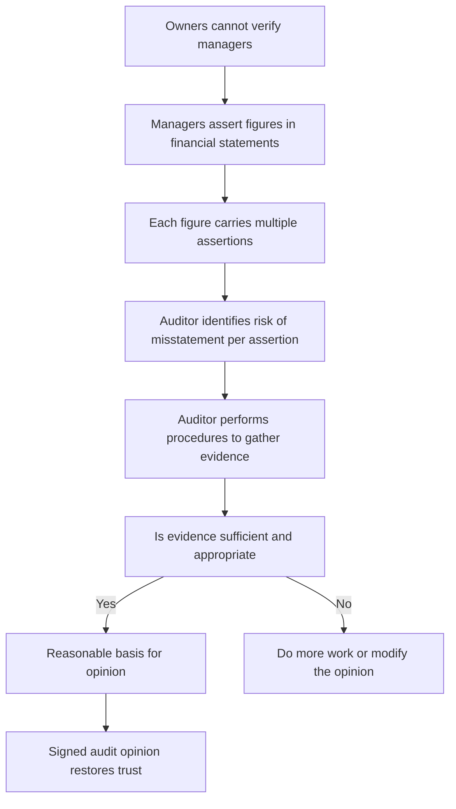
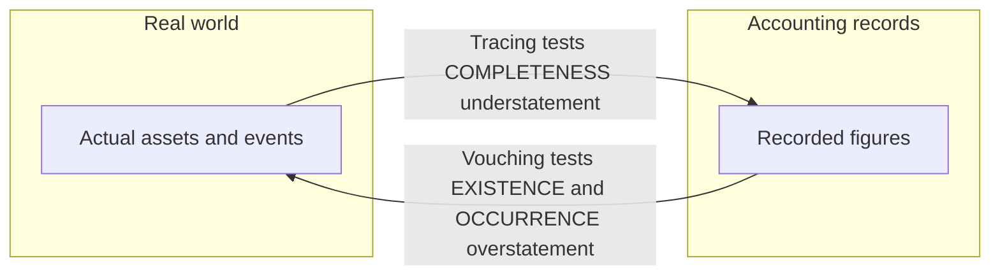
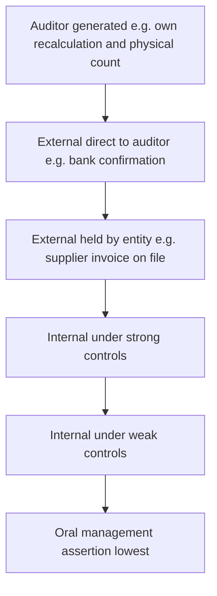
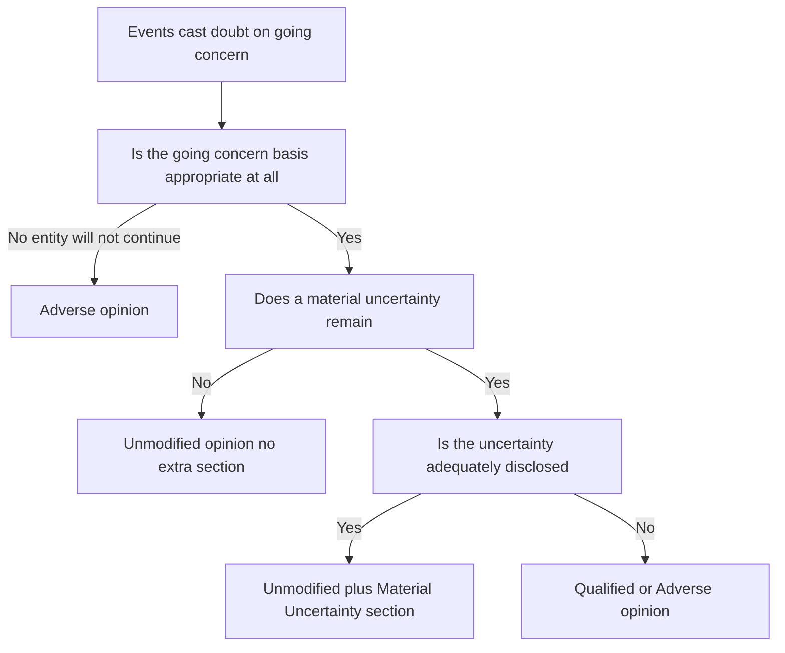

# Chapter 04 — Audit Evidence

## 1. The Problem — An Opinion Is Only as Good as What It Stands On

Go back to the founding wound of this whole subject. The owners of a company cannot see inside it. They handed their money to managers, and now managers hand them back a set of financial statements that say, in effect, "trust us, this is what happened." The auditor exists to break that stalemate — to give the owners an *independent* reason to believe the numbers.

But here is the uncomfortable question the examiner is really testing: **on what basis does the auditor believe the numbers?** The auditor did not run the business. He did not pack the inventory, sign the sales invoices, or watch every rupee move. He arrives after the fact, is given a set of books prepared *by the very people whose honesty is in question*, and is asked to bless them. If the auditor simply reads what management wrote and repeats it, he has added nothing — he is just a second signature on management's assertions.

So the auditor faces a **verification gap**. The trust problem is not solved by the auditor's good character; it is solved only if the auditor gathers *something outside management's own say-so* that either corroborates or contradicts the figures. That "something" is **audit evidence**.

Now sharpen the risk. Financial statements can be wrong in two flavours:

- **Error** — an honest mistake (a mis-cast total, a wrong depreciation rate).
- **Fraud** — a deliberate deception (fictitious sales to inflate profit, hidden liabilities to hide insolvency).

Both produce **misstatement**. The auditor's job is to reduce the risk that *material* misstatement survives undetected to an acceptably low level. He can only do that by holding, at the end, a body of evidence strong enough that a reasonable, informed person would reach the same conclusion. If the evidence is thin, the opinion is a bluff — and when the company later collapses, the auditor is the one in the witness box being asked, "What did you actually check?"

That single question — *what did you actually check, and was it enough?* — is the entire content of this chapter.

## 2. The Core Idea — Sufficient Appropriate Evidence, Organised by Assertion

The whole discipline of audit evidence rests on one sentence from **SA 500 — Audit Evidence**:

> The auditor shall design and perform audit procedures to obtain **sufficient appropriate audit evidence** to be able to draw reasonable conclusions on which to base the audit opinion.

Two words carry the load, and they are deliberately different things:

- **Sufficient** = the *quantity* of evidence. How much?
- **Appropriate** = the *quality* of evidence, which itself splits into **relevance** (does it test the right thing?) and **reliability** (can it be trusted?).

These two are not independent — they trade off. The *more reliable* the evidence, the *less* of it you need. The *riskier* the area, the *more* evidence you need. A single confirmation direct from a bank tells you more than a stack of internally photocopied statements.

The second core idea — and the one that separates a professional from a clerk — is that the auditor does not think "let me check the numbers." He thinks in **assertions**. Every figure in the financial statements is management *asserting several distinct claims at once*. "Inventory ₹50 lakh" is really management asserting: *it exists, we own it, we counted it all, it's worth what we say, and we've disclosed it properly.* Each of those is a separate claim that can fail independently, and each needs its own evidence. Assertions are the auditor's coordinate system: they turn a vague "verify inventory" into a precise checklist of *what could be wrong and how I'd catch it.*

*Figure 1 — The chain from trust gap to signed opinion; evidence is the load-bearing middle.*

## 3. Why It's Built This Way — The Logic Behind Each Requirement

Why insist on *both* sufficiency and appropriateness? Because each guards against a different failure. If you demanded only quantity, an auditor could bury the file in thousands of internally-generated vouchers and claim diligence while proving nothing — volume of weak evidence is still weak. If you demanded only quality, an auditor might rely on one immaculate confirmation for a whole population and miss that it was unrepresentative. You need enough of the right kind.

Why *reliability*? Because evidence is only useful in proportion to how hard it would be to fake or distort. Management controls its own records; it does *not* control what an independent bank, customer, or lawyer will say. So evidence that originates *outside* the entity, or that the auditor *generates himself*, is inherently harder for a dishonest management to corrupt. That single insight generates the entire reliability hierarchy in Section 4.

Why think in **assertions** rather than just "checking numbers"? Because misstatements are *directional and specific*. Management that wants to inflate profit will *overstate* assets and revenue and *understate* liabilities and expenses. So the risk on assets is chiefly **existence and valuation** (is it really there and really worth this?), while the risk on liabilities is chiefly **completeness** (have you hidden some?). If the auditor tests every account for every assertion with equal energy, he wastes effort where risk is low and under-tests where it is high. Assertions let him aim.

Why does SA 500 let the auditor use evidence produced by a **management's expert** (say, a valuer of property) but require him to *evaluate* that expert's competence, objectivity, and methods? Because the auditor cannot personally be a metallurgist, an actuary, and a real-estate valuer. Society accepts specialisation. But an expert *hired and paid by management* is not automatically independent, so the auditor cannot swallow the expert's report whole — he must satisfy himself the expert is competent and unbiased and that the work is appropriate. The requirement mirrors the founding logic: never trust an assertion just because someone with an interest made it.

## 4. Full Technical Content — The Standards, By the Risk Each One Solves

### 4.1 SA 500 — Audit Evidence (the master standard)

**The risk it counters:** an opinion built on evidence that is too little or too weak to support it.

**Key requirements and their reasons:**

| Requirement of SA 500 | What it means | Why it exists |
|---|---|---|
| Obtain **sufficient appropriate** evidence | Enough evidence of the right quality | Directly closes the verification gap; a thin file cannot support an opinion |
| Consider **relevance and reliability** | Does the evidence test the right assertion, and can it be trusted | Irrelevant evidence tests nothing; unreliable evidence proves nothing |
| When using **information produced by the entity**, evaluate whether it is sufficiently reliable — test its **accuracy and completeness** | E.g. an ageing report used to test receivables must itself be checked | Management-produced data can be manipulated to hide the very problem you're testing |
| When using a **management's expert**, evaluate competence, capability, objectivity; understand the work; assess appropriateness | Don't rubber-stamp the valuer/actuary | The expert is paid by management and may be biased or wrong |
| If evidence is **inconsistent** or reliability is doubtful, determine what modifications or additions are needed | Chase contradictions; don't ignore them | A red flag ignored is how frauds slip through |

**The audit procedures SA 500 recognises** (the toolkit — every procedure is just one of these):

| Procedure | What the auditor does | Primary assertions it addresses |
|---|---|---|
| **Inspection** | Examine records, documents, or physical assets | Existence (physical), rights/obligations, valuation (documents) |
| **Observation** | Watch a process being performed (e.g. inventory count) | Existence; whether controls actually operate |
| **External confirmation** | Obtain a direct written response from a third party (see SA 505) | Existence, rights/obligations, completeness of certain items |
| **Recalculation** | Check the arithmetic of documents/records | Accuracy / valuation |
| **Reperformance** | Independently execute a control or procedure | Whether a control operates (accuracy, completeness) |
| **Analytical procedures** | Evaluate relationships among data; investigate deviations | Completeness, occurrence, reasonableness overall |
| **Inquiry** | Seek information from knowledgeable persons | Supports all, but **weak alone** — must be corroborated |

A crucial exam point: **inquiry on its own is never sufficient.** Asking management "is everything fine?" and being told "yes" is not evidence — it is the very assertion under test, repeated. Inquiry must always be corroborated by other procedures.

### 4.2 Assertions — the auditor's coordinate system

Assertions are grouped by what they attach to. The syllabus recognises assertions about **classes of transactions** (the P&L, during the period), about **account balances** (the balance sheet, at period end), and about **presentation and disclosure**.

| Assertion | The claim management is making | The misstatement risk it guards | Typical evidence/procedure |
|---|---|---|---|
| **Existence** (balances) / **Occurrence** (transactions) | The asset/liability really exists; the recorded transaction really happened | *Overstatement* — fictitious assets, fake sales | Physical inspection, external confirmation, vouch to source |
| **Completeness** | *Everything* that should be recorded is recorded — nothing omitted | *Understatement* — hidden liabilities, unrecorded sales | Trace from source documents *into* the books; cut-off tests; analytical review |
| **Valuation / Accuracy & Allocation** | Amounts are recorded at the correct value, correctly measured and allocated | Wrong figures, missing provisions, no impairment | Recalculation, valuation review, ageing, expert reports |
| **Rights & Obligations** | The entity owns the assets and owes the liabilities | Assets pledged/leased shown as owned; others' goods shown as ours | Title deeds, loan/charge registers, confirmations |
| **Presentation & Disclosure** (incl. Classification, Occurrence and rights, Completeness, Accuracy and valuation, Understandability) | Items are correctly classified, described, and disclosed per the framework | Misclassification; missing/misleading disclosure | Read statements against checklist; verify note support |

**Why direction matters (memorise the logic, not the list):** to *test overstatement* you start from the recorded figure and go *out* to reality — "you say this receivable exists; prove it" (vouching, confirmation). To *test understatement/completeness* you start from *reality* and come *into* the books — "here is a supplier invoice / a subsequent payment; is the liability recorded?" (tracing). This directionality is the single most tested idea in the whole topic.

*Figure 2 — Vouching versus tracing: the direction of the test decides which assertion you prove.*

### 4.3 Sources and the reliability hierarchy

SA 500 gives generalisations on reliability. Learn them as *principles*, each with a reason:

1. **External is more reliable than internal.** Evidence from an independent outside source (bank, customer, lawyer) is harder for management to fabricate than evidence management itself created. *Reason: management does not control third parties.*
2. **Effective internal controls make internal evidence more reliable.** If the entity's controls work, its own records are more trustworthy. *Reason: controls reduce the chance of error/manipulation.*
3. **Evidence the auditor obtains directly is more reliable than evidence obtained indirectly or by inference.** Watching the count beats being told the count happened. *Reason: fewer hands to distort it.*
4. **Documentary evidence beats oral.** A written confirmation beats a verbal assurance. *Reason: writing is verifiable and harder to deny later.*
5. **Original documents beat photocopies/faxes/scans.** *Reason: copies can be altered undetectably.*

A vital qualifier: reliability is a **generalisation, subject to exceptions.** An external confirmation can be unreliable if the third party is a related party or colludes; an original document can be a forgery. The auditor stays sceptical.

*Figure 3 — Reliability increases as evidence moves away from management's exclusive control.*

### 4.4 SA 505 — External Confirmations

**The risk it counters:** management fabricating or overstating balances that only a third party can independently verify — chiefly receivables (existence) and bank balances/loans.

**Core mechanics:**
- The auditor **controls the whole process** — selects who to confirm, designs the request, sends it, and receives the reply *directly* (not via management). *Reason: if management touches the request or the reply, the independence that makes confirmation powerful is destroyed.*
- **Positive confirmation** asks the party to reply whether they agree *or not* — used when risk is higher. **Negative confirmation** asks the party to reply *only if they disagree* — weaker (silence is ambiguous), used only when risk is low, controls are strong, and large populations of small homogeneous balances exist.
- **If management refuses to allow a confirmation:** the auditor inquires into the reasons, evaluates whether the refusal is reasonable, and performs **alternative procedures**. If the refusal is unreasonable, it is a **scope limitation** — potential qualification/disclaimer, and a signal of possible fraud.
- **Non-responses:** perform alternative procedures (e.g. inspect subsequent cash receipts, shipping documents, sales invoices).
- **Exceptions** (party disagrees) must be investigated — they may be timing differences or genuine misstatements.
- **Doubts over reliability of a response** (e.g. it arrived via management, or looks altered): investigate; a response received electronically or orally may need verification of its source.

### 4.5 SA 510 — Initial Audit Engagements: Opening Balances

**The risk it counters:** in a *first-year* audit, the closing balances of last year (which are this year's opening balances) were **never audited by this auditor**. If they are wrong, this year's figures and the profit are wrong too — yet they sit outside the current period's testing.

**Requirements:**
- Read the **most recent prior-year financial statements** and the **predecessor auditor's report** for information relevant to opening balances.
- Obtain **sufficient appropriate evidence** that opening balances contain no misstatement materially affecting the current statements, by: (a) determining whether prior-period closing balances were correctly brought forward; (b) determining whether **accounting policies are consistently applied**; and (c) obtaining evidence — either from the prior auditor's work, or by performing current-period procedures that *incidentally* give evidence on openings (e.g. collection of opening receivables proves their existence/valuation), or by specific procedures.
- If opening balances contain a material misstatement not properly dealt with, or policies are inconsistent, **modify the opinion** (qualified or adverse).
- If unable to obtain sufficient evidence on openings, that is a **scope limitation** → qualified opinion or **disclaimer on results of operations**.

### 4.6 SA 550 — Related Parties

**The risk it counters:** transactions with parties connected to management (directors, their relatives, group companies) can be used to **siphon value, hide losses, or manufacture profit** on non-arm's-length terms — and because the parties are friendly, ordinary evidence (confirmations, contracts) may itself be tainted. Fraud famously hides in related-party dealings.

**Requirements:**
- **Understand** the entity's related-party relationships and transactions; remain **alert** for undisclosed ones while inspecting records (e.g. bank confirmations revealing unknown guarantees, unusual transactions).
- Where the framework requires **arm's-length** disclosure, obtain evidence about **management's assertion** that terms were equivalent to arm's length — do not accept the label at face value.
- **Identified but previously undisclosed related parties/transactions** must be communicated to the team and treated as a **significant risk** — a red flag for fraud.
- Obtain **written representations** from management that they have disclosed all related parties and transactions.
- Evaluate the **business rationale** of significant related-party transactions outside the normal course — is it genuine, or a device to misstate/steal?

### 4.7 SA 570 — Going Concern

**The risk it counters:** financial statements are prepared assuming the entity will **continue in operation** (assets at cost, not fire-sale value; liabilities as normal). If that assumption is false and the company is about to fail, the *entire basis* of the statements is misleading — users lend and invest into a corpse.

**Requirements:**
- Management makes a **going-concern assessment**; the auditor **evaluates** it and remains alert throughout for **events or conditions** casting doubt (e.g. net-worth erosion, recurring losses, defaults on loans, inability to pay creditors, loss of a key market or licence, adverse legal judgments).
- Where doubt exists, obtain **sufficient appropriate evidence** on whether a **material uncertainty** exists — evaluate management's plans (financing, asset sales, restructuring), test the **cash-flow forecast** and its assumptions, seek **written representations** on plans and their feasibility.
- **Reporting decision tree:**
  - Use of the going-concern basis is *appropriate* but a **material uncertainty exists** and is **adequately disclosed** → unmodified opinion **with a separate "Material Uncertainty Related to Going Concern" section**.
  - Material uncertainty exists but **not adequately disclosed** → **qualified or adverse** opinion.
  - Going-concern basis is used but is **inappropriate** (entity will not continue) → **adverse** opinion.
  - Management **unwilling to make or extend** its assessment → possible scope limitation → **qualified/disclaimer**.

*Figure 4 — Going-concern reporting logic driven by the risk to users.*

### 4.8 SA 580 — Written Representations

**The risk it counters:** some matters (management's intentions, completeness of disclosures, knowledge of fraud) live *only inside management's head* — no external evidence exists. The auditor needs management to *put its assertions in writing* and thereby take formal responsibility.

**Key points — and the sharpest trap in the chapter:**
- Obtain a written representation that management has **fulfilled its responsibility** for the financial statements and for providing **all relevant information and access**, and that **all transactions are recorded**.
- Obtain specific representations required by other SAs (e.g. SA 240 fraud, SA 550 related parties, SA 570 plans).
- **Date** near, but not after, the auditor's report; addressed to the auditor.
- **Written representations are audit evidence — but they are NOT sufficient appropriate evidence on their own about the matters they concern.** A representation that receivables are collectible does not replace testing collectibility. *Reason: it is still a management assertion — the exact thing whose reliability is in question.* Representations *complement* other evidence; they never substitute for it.
- If management **refuses** to provide a required representation, or the auditor **doubts management's integrity** such that representations are unreliable, this casts doubt on *all* representations and evidence — potentially a **disclaimer of opinion**.

### 4.9 Management's expert vs auditor's expert (SA 500 / SA 620 link)

- A **management's expert** (valuer, actuary, engineer engaged *by management*) produces information used *as evidence*; under SA 500 the auditor must evaluate the expert's **competence, capability and objectivity**, understand the expert's work, and assess whether it is **appropriate** for use as audit evidence.
- An **auditor's expert** (engaged *by the auditor*, governed by **SA 620**) helps the auditor *obtain* evidence in a specialised field. Confirm the exact scope in ICAI material, but the guiding logic is identical: expertise the auditor lacks may be borrowed, but responsibility for the opinion is **never** delegated.

## 5. Applied Scenarios — Reasoning to the Right Response

**Scenario A — The confirmation that came back through the finance manager.**
An auditor sends positive confirmations to 40 debtors. Thirty replies arrive; but the auditor notices *all* replies were collected by the client's finance manager and handed over in a bundle, several on fresh identical letterheads.
*Reasoning:* SA 505's power comes from the auditor **controlling the process** and receiving replies **directly**. Here management sat in the pipeline, so the confirmations are compromised — reliability is doubtful (Section 4.4, 4.3). *Response:* treat these as unreliable; re-send under the auditor's own control, verify the third parties' addresses independently, and perform **alternative procedures** (subsequent receipts, dispatch documents). The bundled fresh letterheads are a **fraud red flag** — heighten scepticism across the file.

**Scenario B — First-year audit, healthy-looking books.**
A newly appointed auditor for FY 2025-26 finds current-year work clean. But opening inventory of ₹80 lakh and opening receivables were audited by a predecessor whose working papers management "cannot locate."
*Reasoning:* SA 510 — opening balances were never audited by *this* auditor, and if wrong they distort current profit. Absence of predecessor evidence means the auditor must get evidence *himself*. *Response:* perform current-period procedures that shed light on openings — e.g. examine sale/consumption of opening inventory and collection of opening receivables (proving existence/valuation), verify consistent accounting policies. If he *cannot* obtain sufficient evidence on openings, that is a **scope limitation → qualified opinion or disclaimer on results of operations**, even though the current-year testing looked fine.

**Scenario C — Profitable sales to a company owned by the MD's brother.**
Year-end sales spike; 30% of Q4 revenue is to Zeta Ltd, owned by the managing director's brother, at unusually high prices, with payment terms of 270 days.
*Reasoning:* SA 550 — a related party, a transaction *outside normal terms*, used potentially to **inflate revenue and profit**. The friendly counterparty means a confirmation from Zeta may itself be unreliable. *Response:* treat as a **significant risk**; evaluate the **business rationale**; test whether goods actually moved (occurrence/existence) and whether they might be returned next year (window-dressing); scrutinise the arm's-length assertion rather than accept the disclosure label; obtain **written representation** (SA 580) that all related parties/transactions are disclosed — while remembering that representation is **not sufficient on its own**. Assess disclosure adequacy for presentation.

**Scenario D — The forecast that saves the company on paper.**
A manufacturer has negative net worth and defaulted on a term loan. Management's cash-flow forecast shows recovery based on a "new large export order" and a promoter capital infusion, neither yet documented.
*Reasoning:* SA 570 — clear events casting **going-concern doubt**. Management's plans rest on *unsupported* assumptions. *Response:* test the forecast's assumptions; seek **evidence** for the export order (contract) and the infusion (commitment); obtain **written representation** on feasibility of plans. Then apply the decision tree: if a **material uncertainty** remains and is **adequately disclosed**, unmodified opinion **plus a Material Uncertainty section**; if inadequately disclosed, **qualified/adverse**; if the basis itself is untenable, **adverse**.

## 6. Procedure & Documentation Summary

For each material area the auditor should be able to show a clean chain: **assertion at risk → procedure chosen → evidence obtained → conclusion.**

| Step | What is done | What is documented |
|---|---|---|
| Identify assertions at risk | Map each material balance/class to its high-risk assertions | Risk-assessment working papers (links to SA 315) |
| Select procedures | Choose from inspection, observation, confirmation, recalculation, reperformance, analytics, inquiry | Audit programme with rationale |
| Confirmations (SA 505) | Auditor-controlled requests; track responses, exceptions, non-responses, refusals | Confirmation control log; alternative-procedure notes |
| Opening balances (SA 510) | Prior statements/report read; consistency and B/F checked; evidence obtained | Notes on predecessor work and current-period corroboration |
| Related parties (SA 550) | Understand relationships; test significant/abnormal transactions; rationale | List of related parties; significant-risk memos |
| Going concern (SA 570) | Evaluate events, plans, forecast; conclude on material uncertainty | Going-concern assessment file; forecast testing |
| Written reps (SA 580) | Obtain dated, signed representation letter | The representation letter on file |
| Evaluate sufficiency | Step back — is evidence sufficient *and* appropriate; chase inconsistencies | Conclusion memo per area and overall |

**Documentation reason (link to SA 230):** if it is not documented, it is treated as not done. The file *is* the auditor's defence when the "what did you check?" question comes.

## 7. Connections

- **SA 315 / SA 330** (risk assessment and responses): assertions and risks identified there *drive* which evidence you gather here — this chapter is the "response" half.
- **SA 240** (fraud): related parties (550), confirmation refusals (505), and doubts over management integrity (580) are all fraud signals; evidence is how fraud risk is answered.
- **SA 320** (materiality): "sufficient" is measured against materiality — you gather more where a misstatement would matter.
- **SA 230** (documentation): evidence unrecorded is evidence unheld.
- **SA 700/705/706** (the report): sufficiency failures and scope limitations from 505/510/570/580 convert directly into **modified opinions** and the going-concern section.
- **SA 620** (auditor's expert): the mirror image of the management's-expert rule in SA 500.

## 8. Traps & Examiner Tricks

- **"Inquiry alone is enough."** Never. Inquiry must be corroborated. Classic wrong answer.
- **Written representations as a substitute.** SA 580 reps are evidence but **never sufficient on their own** about the matters they cover. If a question says the auditor "relied on the management letter" for collectibility/existence, that is the error.
- **Negative vs positive confirmations.** Negatives are *weak* (silence ≠ agreement) and allowed only under low risk + strong controls + many small homogeneous balances. Don't recommend negatives for risky receivables.
- **Confirmation received via management.** Destroys reliability — the auditor must control the process and receive replies directly.
- **Sufficient ≠ appropriate.** A huge file of weak internal vouchers is not sufficient appropriate evidence. Quantity cannot cure poor quality.
- **First-year audit smugness.** Clean current-year work does **not** cover opening balances (SA 510). Missing opening evidence = scope limitation.
- **Going-concern reporting mix-up.** Adequately-disclosed material uncertainty → **unmodified opinion with a Material Uncertainty section**, *not* a qualification. Qualification/adverse only when disclosure is inadequate or the basis is wrong.
- **Reliability rules are generalisations.** An external confirmation from a colluding related party, or an "original" that is forged, can still be unreliable. Scepticism overrides the hierarchy.
- **Direction of testing.** Overstatement (existence) → vouch outward. Understatement (completeness) → trace inward. Reversing these is a favourite trap.
- **Management's expert ≠ auditor's expert.** Different engager, different standard (SA 500 vs SA 620), same non-delegation of responsibility.
- **Refusal to confirm / refusal to represent.** Both are red flags: evaluate reasonableness, do alternative work, and consider scope limitation — potentially disclaimer if integrity is in doubt.

## 9. First-Principles Recap

Start again from the wound and rebuild the whole chapter in one breath. Owners cannot verify managers, so an independent auditor must give assurance — but the auditor arrives after the fact and is handed records made by the very people under scrutiny. His only escape from that trap is **evidence**: something beyond management's say-so. That evidence must be **sufficient** (enough) and **appropriate** (relevant + reliable), because too little or too weak cannot support an opinion (SA 500). Reliability rises the further evidence sits from management's control — external and auditor-generated beats internal and oral — so the auditor prizes third-party confirmations and things he checks himself. He organises the whole search by **assertions**, because each figure makes several separable claims and misstatement is directional: assets and revenue tend to be overstated (test existence by vouching), liabilities understated (test completeness by tracing). Where only a third party knows the truth, he confirms directly and controls the process (SA 505). Where the year is his first, he cannot ignore unaudited opening balances (SA 510). Where transactions run through friendly related parties, he treats them as a significant fraud risk and probes rationale (SA 550). Where the entity may not survive, he tests the very assumption the statements rest on and reports the uncertainty precisely (SA 570). Where truth lives only in management's mind, he takes it in writing — but never lets that writing replace real evidence (SA 580). And where he lacks the expertise, he borrows a specialist but never delegates the opinion. Every rule is the same rule: *trust nothing merely because an interested party asserts it; get evidence proportionate to the risk.*

## 10. Quick-Revision Sheet

**Master rule (SA 500):** Sufficient (quantity) + Appropriate (relevance + reliability) audit evidence → reasonable basis for opinion.

**Procedures (memory: "I ORREAI"):** Inspection, Observation, Recalculation, Reperformance, External confirmation, Analytical procedures, Inquiry. *Inquiry alone never sufficient.*

**Assertions & direction:**
- Existence/Occurrence → overstatement → **vouch outward** (books → reality).
- Completeness → understatement → **trace inward** (reality → books).
- Valuation, Rights & Obligations, Presentation & Disclosure round out the set.

**Reliability hierarchy (high → low):** Auditor-generated → External direct to auditor → External on entity's file → Internal (strong controls) → Internal (weak controls) → Oral. *All are generalisations, subject to exceptions.*

| SA | Title | Risk it counters | Signature rule |
|---|---|---|---|
| **500** | Audit Evidence | Opinion on thin/weak evidence | Sufficient + appropriate; inquiry alone insufficient; evaluate entity data & management's expert |
| **505** | External Confirmations | Fabricated balances only 3rd party can verify | Auditor controls process, receives replies directly; positive vs negative; refusal = scope limit; do alternatives |
| **510** | Opening Balances (initial engagements) | First-year unaudited openings distort current figures | Check B/F + policy consistency; get evidence; else qualify/disclaim on results |
| **550** | Related Parties | Value siphoning / manufactured profit via connected parties | Treat undisclosed RP as significant risk; test rationale & arm's-length; written rep |
| **570** | Going Concern | Statements assume survival that may be false | Evaluate events/plans/forecast; disclosed material uncertainty → unmodified + MU section; else qualify/adverse |
| **580** | Written Representations | Matters known only to management | Get it in writing; **never sufficient alone**; refusal/doubt → possible disclaimer |
| **620** | Auditor's Expert | Auditor lacks specialised expertise | Borrow expertise, never delegate the opinion (confirm scope in ICAI material) |

**Reporting quick-links:** confirmation refusal, missing opening evidence, undisclosed going-concern uncertainty, refused representation → all can force **modified opinions** (SA 705) or the **Material Uncertainty** section (SA 570). 

*If any SA number or the exact split of presentation/disclosure assertions differs in the latest ICAI module, confirm against current ICAI material — the underlying logic in this chapter holds regardless.*
