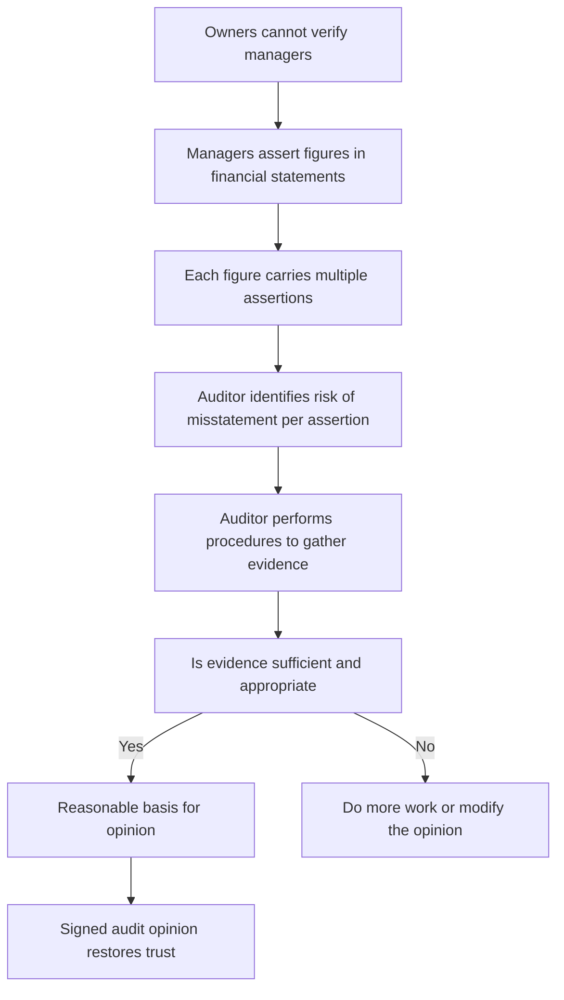
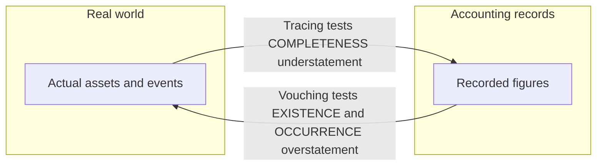
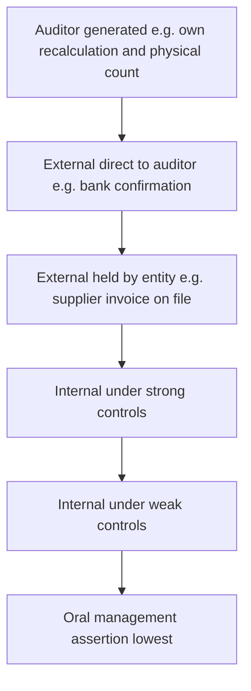
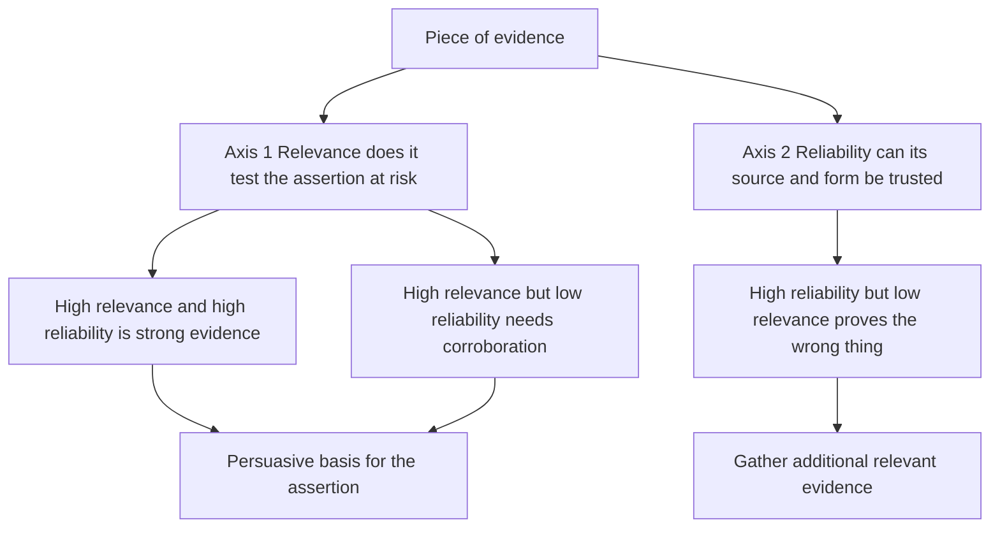
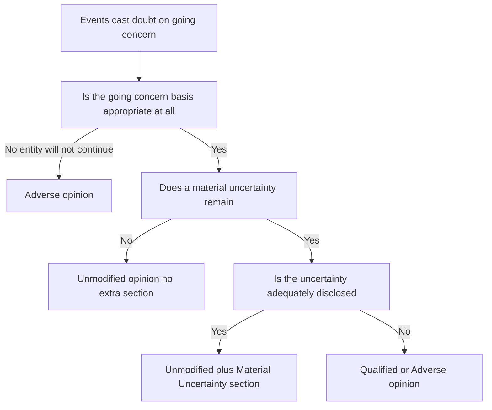

<!-- v2-deep -->

# Chapter 04 — Audit Evidence

## 1. The Problem — An Opinion Is Only as Good as What It Stands On

Go back to the founding wound of this whole subject. The owners of a company cannot see inside it. They handed their money to managers, and now managers hand them back a set of financial statements that say, in effect, "trust us, this is what happened." The auditor exists to break that stalemate — to give the owners an *independent* reason to believe the numbers.

But here is the uncomfortable question the examiner is really testing: **on what basis does the auditor believe the numbers?** The auditor did not run the business. He did not pack the inventory, sign the sales invoices, or watch every rupee move. He arrives after the fact, is given a set of books prepared *by the very people whose honesty is in question*, and is asked to bless them. If the auditor simply reads what management wrote and repeats it, he has added nothing — he is just a second signature on management's assertions.

So the auditor faces a **verification gap**. The trust problem is not solved by the auditor's good character; it is solved only if the auditor gathers *something outside management's own say-so* that either corroborates or contradicts the figures. That "something" is **audit evidence**.

Now sharpen the risk. Financial statements can be wrong in two flavours:

- **Error** — an honest mistake (a mis-cast total, a wrong depreciation rate).
- **Fraud** — a deliberate deception (fictitious sales to inflate profit, hidden liabilities to hide insolvency).

Both produce **misstatement**. The auditor's job is to reduce the risk that *material* misstatement survives undetected to an acceptably low level. He can only do that by holding, at the end, a body of evidence strong enough that a reasonable, informed person would reach the same conclusion. If the evidence is thin, the opinion is a bluff — and when the company later collapses, the auditor is the one in the witness box being asked, "What did you actually check?"

That single question — *what did you actually check, and was it enough?* — is the entire content of this chapter.

**Reasonable, not absolute, assurance — and why evidence is "persuasive rather than conclusive."** Notice the standard does not ask the auditor to *prove* the statements are correct beyond all doubt. It asks for a *reasonable basis*. This is deliberate and heavily examined. An audit cannot give absolute assurance for four structural reasons, each of which you should be able to state: (a) **selective testing** — the auditor samples, he does not re-do every transaction, so some items are never seen; (b) **inherent limitations of internal control** — controls can be overridden by management or defeated by collusion; (c) **the nature of evidence is persuasive, not conclusive** — most audit evidence points *towards* a conclusion rather than nailing it down (a confirmation supports existence but a clever fraud can still forge it); and (d) **judgement** — the auditor must judge what is material, what is risky, and when he has "enough," and judgement is fallible. The examiner loves the phrase *"audit evidence is persuasive rather than conclusive"* — it is the honest admission that the auditor stacks up probabilities until a reasonable person would be convinced, not until certainty is reached. Recognising this reframes every rule in the chapter: the auditor is not chasing proof, he is *reducing doubt to an acceptably low level at reasonable cost.*

**Why "material" and not "every error"?** The auditor tolerates immaterial error because chasing it costs more than it is worth to users, and because an opinion is about whether the statements are *free from material misstatement* — misstatement large enough that a reasonable user's decision would change. Materiality (SA 320) therefore sets the *height of the bar* evidence must clear: the closer a possible misstatement is to material, the more and better evidence the auditor must hold. This links directly to "sufficient" in Section 2 — sufficiency is measured against risk *and* materiality, never in the abstract.

## 2. The Core Idea — Sufficient Appropriate Evidence, Organised by Assertion

The whole discipline of audit evidence rests on one sentence from **SA 500 — Audit Evidence**:

> The auditor shall design and perform audit procedures to obtain **sufficient appropriate audit evidence** to be able to draw reasonable conclusions on which to base the audit opinion.

Two words carry the load, and they are deliberately different things:

- **Sufficient** = the *quantity* of evidence. How much?
- **Appropriate** = the *quality* of evidence, which itself splits into **relevance** (does it test the right thing?) and **reliability** (can it be trusted?).

These two are not independent — they trade off. The *more reliable* the evidence, the *less* of it you need. The *riskier* the area, the *more* evidence you need. A single confirmation direct from a bank tells you more than a stack of internally photocopied statements.

**Sharpening "relevance" — direction and purpose.** Relevance has two dimensions the exam separates. First, evidence must relate to the *specific assertion* under test: subsequent cash receipts are highly relevant to *existence and valuation* of a receivable but say almost nothing about its *completeness* (money coming in does not reveal receivables you never recorded). Second, relevance depends on the *direction of the test* — the same document proves different things depending on whether you vouch from it or trace to it (Section 4.2). A procedure can generate impeccably reliable evidence that is *irrelevant* to the assertion you needed, and a tired auditor who confuses the two has gathered nothing. Ask always: *reliable evidence of what, exactly?*

**Sharpening "sufficient" — it is a function, not a number.** Sufficiency is driven by two things: (a) the **assessed risk of material misstatement** — higher risk demands more evidence; and (b) the **quality (appropriateness) of the evidence** — higher quality reduces the quantity needed. So there is no fixed sample size in the standard; "how much is enough" is a judgement that rises with risk and falls with quality. A common exam framing: *more* evidence of *lower* quality does not compensate for the *absence* of higher-quality evidence where the latter is obtainable and the risk is significant.

The second core idea — and the one that separates a professional from a clerk — is that the auditor does not think "let me check the numbers." He thinks in **assertions**. Every figure in the financial statements is management *asserting several distinct claims at once*. "Inventory ₹50 lakh" is really management asserting: *it exists, we own it, we counted it all, it's worth what we say, and we've disclosed it properly.* Each of those is a separate claim that can fail independently, and each needs its own evidence. Assertions are the auditor's coordinate system: they turn a vague "verify inventory" into a precise checklist of *what could be wrong and how I'd catch it.*

*Figure 1 — The chain from trust gap to signed opinion; evidence is the load-bearing middle.*

## 3. Why It's Built This Way — The Logic Behind Each Requirement

Why insist on *both* sufficiency and appropriateness? Because each guards against a different failure. If you demanded only quantity, an auditor could bury the file in thousands of internally-generated vouchers and claim diligence while proving nothing — volume of weak evidence is still weak. If you demanded only quality, an auditor might rely on one immaculate confirmation for a whole population and miss that it was unrepresentative. You need enough of the right kind.

Why *reliability*? Because evidence is only useful in proportion to how hard it would be to fake or distort. Management controls its own records; it does *not* control what an independent bank, customer, or lawyer will say. So evidence that originates *outside* the entity, or that the auditor *generates himself*, is inherently harder for a dishonest management to corrupt. That single insight generates the entire reliability hierarchy in Section 4.

Why think in **assertions** rather than just "checking numbers"? Because misstatements are *directional and specific*. Management that wants to inflate profit will *overstate* assets and revenue and *understate* liabilities and expenses. So the risk on assets is chiefly **existence and valuation** (is it really there and really worth this?), while the risk on liabilities is chiefly **completeness** (have you hidden some?). If the auditor tests every account for every assertion with equal energy, he wastes effort where risk is low and under-tests where it is high. Assertions let him aim.

Why does SA 500 let the auditor use evidence produced by a **management's expert** (say, a valuer of property) but require him to *evaluate* that expert's competence, objectivity, and methods? Because the auditor cannot personally be a metallurgist, an actuary, and a real-estate valuer. Society accepts specialisation. But an expert *hired and paid by management* is not automatically independent, so the auditor cannot swallow the expert's report whole — he must satisfy himself the expert is competent and unbiased and that the work is appropriate. The requirement mirrors the founding logic: never trust an assertion just because someone with an interest made it.

**Why let corroborating evidence from different sources "reinforce," and why treat consistency as itself informative?** SA 500 tells the auditor that evidence is more persuasive when items from *different sources* or of *different nature* are consistent with one another — and, conversely, that *inconsistency* between sources is a signal that demands investigation, not a nuisance to be smoothed over. The logic is probabilistic: two independent lines of evidence pointing the same way are far less likely to be simultaneously wrong than one line, so consistency multiplies confidence. But the deeper reason the standard *names* inconsistency is that fraud and error announce themselves precisely as contradictions — a debtor's confirmation that disagrees with the ledger, an analytical ratio that will not reconcile, a bank letter revealing a guarantee management never mentioned. The auditor who *chases* contradictions catches misstatement; the auditor who explains them away with management's word has walked past the very thing the audit exists to find.

**Why is the cost–benefit of obtaining evidence a legitimate consideration — but never an excuse?** SA 500 acknowledges the auditor may consider the *relationship between the cost of obtaining evidence and its usefulness*. This is realistic — audits happen in finite time. But the standard immediately fences it: **difficulty, time, or cost is not in itself a valid basis for omitting a procedure for which there is no alternative, or for being satisfied with less-than-persuasive evidence.** The examiner tests exactly this trap: a candidate who writes "the auditor skipped confirmations because they were expensive/time-consuming" has stated a *violation*, not a judgement. Cost may steer *which* of several adequate procedures you choose; it can never justify an inadequate one.

## 4. Full Technical Content — The Standards, By the Risk Each One Solves

### 4.1 SA 500 — Audit Evidence (the master standard)

**The risk it counters:** an opinion built on evidence that is too little or too weak to support it.

**Key requirements and their reasons:**

| Requirement of SA 500 | What it means | Why it exists |
|---|---|---|
| Obtain **sufficient appropriate** evidence | Enough evidence of the right quality | Directly closes the verification gap; a thin file cannot support an opinion |
| Consider **relevance and reliability** | Does the evidence test the right assertion, and can it be trusted | Irrelevant evidence tests nothing; unreliable evidence proves nothing |
| When using **information produced by the entity**, evaluate whether it is sufficiently reliable — test its **accuracy and completeness** | E.g. an ageing report used to test receivables must itself be checked | Management-produced data can be manipulated to hide the very problem you're testing |
| When using a **management's expert**, evaluate competence, capability, objectivity; understand the work; assess appropriateness | Don't rubber-stamp the valuer/actuary | The expert is paid by management and may be biased or wrong |
| If evidence is **inconsistent** or reliability is doubtful, determine what modifications or additions are needed | Chase contradictions; don't ignore them | A red flag ignored is how frauds slip through |
| **Selecting items for testing** — the auditor may select all items (100%), specific items, or use audit sampling | Choose the testing approach that fits the population and risk | Efficiency: 100% only where few large or risky items; sampling projects a conclusion over a population |

**The audit procedures SA 500 recognises** (the toolkit — every procedure is just one of these):

| Procedure | What the auditor does | Primary assertions it addresses |
|---|---|---|
| **Inspection** | Examine records, documents, or physical assets | Existence (physical), rights/obligations, valuation (documents) |
| **Observation** | Watch a process being performed (e.g. inventory count) | Existence; whether controls actually operate |
| **External confirmation** | Obtain a direct written response from a third party (see SA 505) | Existence, rights/obligations, completeness of certain items |
| **Recalculation** | Check the arithmetic of documents/records | Accuracy / valuation |
| **Reperformance** | Independently execute a control or procedure | Whether a control operates (accuracy, completeness) |
| **Analytical procedures** | Evaluate relationships among data; investigate deviations | Completeness, occurrence, reasonableness overall |
| **Inquiry** | Seek information from knowledgeable persons | Supports all, but **weak alone** — must be corroborated |

A crucial exam point: **inquiry on its own is never sufficient.** Asking management "is everything fine?" and being told "yes" is not evidence — it is the very assertion under test, repeated. Inquiry must always be corroborated by other procedures.

**Two distinctions the examiner exploits inside this toolkit:**

- **Inspection of an *asset* vs inspection of a *document*.** Inspecting a physical asset gives reliable evidence of its **existence** — but *not* automatically of the entity's **rights** (it may be held on lease/consignment), nor of its **valuation** (a machine that exists may be obsolete). Inspecting a *document* gives evidence about terms and amounts but its reliability depends on the document's nature and source. Never let "I saw it" collapse existence, ownership, and value into one tick.
- **Observation vs reperformance of a control.** Observation only tells you the control operated *at the moment you watched* — the storekeeper may behave differently on the days the auditor is not there. Reperformance is stronger because the auditor *himself* re-executes the control over selected items and sees the outcome directly. This is why observation of an inventory count is coupled with the auditor's *own* test counts.

**Automated tools and the reliability of system-generated data.** Where the entity's records are produced by an IT system, the auditor may use computer-assisted techniques, but the reliability of the output depends on the reliability of the *controls* over the system that produced it (a link to SA 315). A report is only as trustworthy as the general and application controls behind it — do not treat a system printout as independent just because "the computer" made it; the computer did what management's programmers and inputs told it to.

### 4.2 Assertions — the auditor's coordinate system

Assertions are grouped by what they attach to. The syllabus recognises assertions about **classes of transactions** (the P&L, during the period), about **account balances** (the balance sheet, at period end), and about **presentation and disclosure**.

| Assertion | The claim management is making | The misstatement risk it guards | Typical evidence/procedure |
|---|---|---|---|
| **Existence** (balances) / **Occurrence** (transactions) | The asset/liability really exists; the recorded transaction really happened | *Overstatement* — fictitious assets, fake sales | Physical inspection, external confirmation, vouch to source |
| **Completeness** | *Everything* that should be recorded is recorded — nothing omitted | *Understatement* — hidden liabilities, unrecorded sales | Trace from source documents *into* the books; cut-off tests; analytical review |
| **Valuation / Accuracy & Allocation** | Amounts are recorded at the correct value, correctly measured and allocated | Wrong figures, missing provisions, no impairment | Recalculation, valuation review, ageing, expert reports |
| **Rights & Obligations** | The entity owns the assets and owes the liabilities | Assets pledged/leased shown as owned; others' goods shown as ours | Title deeds, loan/charge registers, confirmations |
| **Cut-off** (transactions) | Transactions are recorded in the *correct accounting period* | Sales/purchases pushed across year-end to shift profit | Test last/first documents each side of year-end vs recording date |
| **Classification** (transactions) | Transactions are recorded in the *proper accounts* | Capital expense booked as revenue, or vice versa | Trace to correct ledger; review of unusual postings |
| **Presentation & Disclosure** (incl. Classification, Occurrence and rights, Completeness, Accuracy and valuation, Understandability) | Items are correctly classified, described, and disclosed per the framework | Misclassification; missing/misleading disclosure | Read statements against checklist; verify note support |

**Why direction matters (memorise the logic, not the list):** to *test overstatement* you start from the recorded figure and go *out* to reality — "you say this receivable exists; prove it" (vouching, confirmation). To *test understatement/completeness* you start from *reality* and come *into* the books — "here is a supplier invoice / a subsequent payment; is the liability recorded?" (tracing). This directionality is the single most tested idea in the whole topic.

**Cut-off is the assertion that lives *between* existence and completeness.** A sale dated 30 March but dispatched 3 April overstates *this year's* revenue (an occurrence/cut-off failure at the year-end boundary); a purchase received 29 March but invoiced 5 April, if unrecorded, understates liabilities (a completeness/cut-off failure). Cut-off testing looks at the *documents on either side of the closing date* — the last few Goods Dispatch Notes and Goods Received Notes of the year and the first few of the next — and checks that each landed in the period in which the underlying event occurred. Cut-off is a favourite because it simultaneously touches *two* directional tests at the one boundary where profit is easiest to manipulate.

*Figure 2 — Vouching versus tracing: the direction of the test decides which assertion you prove.*

**A worked micro-example of directionality (so it never slips):** Suppose you want to know whether *all* purchases are recorded (completeness). If you start from the *purchase ledger* and vouch each entry to a supplier invoice, you will confirm that what is *recorded* is genuine — but you will *never* discover a purchase that was simply *left out*, because a missing entry is not in the ledger to be selected. To catch omission you must start *outside* the ledger — from the *Goods Received Notes* or the *suppliers' statements* — and trace *into* the ledger. Same documents, opposite starting point, opposite assertion proved. If an exam scenario says "the auditor selected items from the sales register and traced them to dispatch notes to test completeness of sales," that is the **error** — that direction tests occurrence, not completeness.

### 4.3 Sources and the reliability hierarchy

SA 500 gives generalisations on reliability. Learn them as *principles*, each with a reason:

1. **External is more reliable than internal.** Evidence from an independent outside source (bank, customer, lawyer) is harder for management to fabricate than evidence management itself created. *Reason: management does not control third parties.*
2. **Effective internal controls make internal evidence more reliable.** If the entity's controls work, its own records are more trustworthy. *Reason: controls reduce the chance of error/manipulation.*
3. **Evidence the auditor obtains directly is more reliable than evidence obtained indirectly or by inference.** Watching the count beats being told the count happened. *Reason: fewer hands to distort it.*
4. **Documentary evidence beats oral.** A written confirmation beats a verbal assurance. *Reason: writing is verifiable and harder to deny later.*
5. **Original documents beat photocopies/faxes/scans.** *Reason: copies can be altered undetectably.*

A vital qualifier: reliability is a **generalisation, subject to exceptions.** An external confirmation can be unreliable if the third party is a related party or colludes; an original document can be a forgery. The auditor stays sceptical.

**The two dimensions the hierarchy actually collapses.** Every rule above is really one of two ideas: **source** (how far from management's control the evidence originates) and **form** (documentary/direct vs oral/inferred). When two rules pull in opposite directions, the examiner is testing whether you can weigh them. *Which is more reliable — an original internal document, or an oral statement from an independent outsider?* The internal document usually wins, because form (documentary, original) and the ability to re-examine it outweigh a fleeting, unrecorded outsider's remark; but a *written* confirmation from that outsider would beat the internal document. Reliability is a *combination* of source and form, not a single ladder — and questions that pit one dimension against the other separate the top scripts.

*Figure 3 — Reliability increases as evidence moves away from management's exclusive control.*

**Relevance and reliability are independent axes — plot every piece of evidence on both.** A bank confirmation is highly *reliable* but *irrelevant* to whether inventory is obsolete. A rough internal stock-ageing sheet is highly *relevant* to obsolescence but of modest *reliability*. Strong evidence needs *both* — which is why the auditor often *combines* a reliable-but-narrow source with a relevant-but-weaker one until the pair, taken together, is persuasive. Thinking on two axes is what turns a checklist-follower into an auditor.

*Figure 5 — Every piece of evidence must be judged on two independent axes; only the top-right corner is strong.*

### 4.4 SA 505 — External Confirmations

**The risk it counters:** management fabricating or overstating balances that only a third party can independently verify — chiefly receivables (existence) and bank balances/loans.

**Core mechanics:**
- The auditor **controls the whole process** — selects who to confirm, designs the request, sends it, and receives the reply *directly* (not via management). *Reason: if management touches the request or the reply, the independence that makes confirmation powerful is destroyed.*
- **Positive confirmation** asks the party to reply whether they agree *or not* — used when risk is higher. **Negative confirmation** asks the party to reply *only if they disagree* — weaker (silence is ambiguous), used only when risk is low, controls are strong, and large populations of small homogeneous balances exist.
- **If management refuses to allow a confirmation:** the auditor inquires into the reasons, evaluates whether the refusal is reasonable, and performs **alternative procedures**. If the refusal is unreasonable, it is a **scope limitation** — potential qualification/disclaimer, and a signal of possible fraud.
- **Non-responses:** perform alternative procedures (e.g. inspect subsequent cash receipts, shipping documents, sales invoices).
- **Exceptions** (party disagrees) must be investigated — they may be timing differences or genuine misstatements.
- **Doubts over reliability of a response** (e.g. it arrived via management, or looks altered): investigate; a response received electronically or orally may need verification of its source.

**The four conditions for negative confirmations — all must hold together.** The examiner frequently gives a scenario missing one condition and asks whether negatives are appropriate. All four are required: (a) the auditor assesses the **risk of material misstatement as low** and has obtained evidence on the operating effectiveness of **relevant controls**; (b) the population comprises a **large number of small, homogeneous balances**; (c) a **very low exception rate** is expected; and (d) the auditor is **not aware of circumstances** that would cause recipients to disregard the request. Fail any one — say, the receivables are risky or few and large — and negatives are *not* permissible. The deep reason: with a negative, *silence is treated as agreement*, so it only works where non-response genuinely signals "no problem," which is exactly the low-risk, high-volume, well-controlled setting the four conditions describe.

**"A positive confirmation with the balance blanked out" — the exam's favourite refinement.** A positive request can either state the balance and ask the party to agree, or leave the amount **blank** and ask the party to fill it in. The blank form is *more reliable* (the respondent must actually retrieve the figure rather than lazily tick "agree"), but yields *lower response rates* (more effort). Knowing this trade-off — reliability up, response down — is a mark-scoring nuance.

**Why confirmations prove existence brilliantly but completeness poorly.** A confirmation sent to a *recorded* debtor tests whether that recorded balance is real (existence/overstatement). It does *nothing* to reveal a debtor you *failed to record* — you cannot send a request to a customer who is not on your list. For *completeness* of liabilities, this flips into a genuine strength: confirming with *suppliers* (or requesting *supplier statements*) can reveal amounts the entity owes but did not record, because the supplier's records are independent of the entity's omissions. This asymmetry — confirm debtors for existence, confirm/reconcile suppliers for completeness — is precise exam gold.

**Timing.** Confirmations are usually sought *at or near* the year-end date. If obtained at an *interim* date, the auditor performs procedures to cover the *intervening period* (roll-forward), and this is acceptable only when control risk over the period is low enough to rely on the roll-forward.

### 4.5 SA 510 — Initial Audit Engagements: Opening Balances

**The risk it counters:** in a *first-year* audit, the closing balances of last year (which are this year's opening balances) were **never audited by this auditor**. If they are wrong, this year's figures and the profit are wrong too — yet they sit outside the current period's testing.

**Requirements:**
- Read the **most recent prior-year financial statements** and the **predecessor auditor's report** for information relevant to opening balances.
- Obtain **sufficient appropriate evidence** that opening balances contain no misstatement materially affecting the current statements, by: (a) determining whether prior-period closing balances were correctly brought forward; (b) determining whether **accounting policies are consistently applied**; and (c) obtaining evidence — either from the prior auditor's work, or by performing current-period procedures that *incidentally* give evidence on openings (e.g. collection of opening receivables proves their existence/valuation), or by specific procedures.
- If opening balances contain a material misstatement not properly dealt with, or policies are inconsistent, **modify the opinion** (qualified or adverse).
- If unable to obtain sufficient evidence on openings, that is a **scope limitation** → qualified opinion or **disclaimer on results of operations**.

**Why "which balance is easy vs hard" matters.** *Current* assets and liabilities (opening receivables, payables, inventory) tend to *turn over* within the new year, so ordinary current-period work throws off incidental evidence about them — opening receivables get collected (proving they existed and were collectible), opening inventory gets sold or consumed. *Non-current* items (opening fixed assets, long-term loans, retained earnings) do *not* turn over, so incidental evidence is scarce and the auditor may need to inspect prior-period *records and documents* directly, or rely on the predecessor's work. Recognising that non-current openings are the *harder* ones is the sophistication the examiner rewards.

**The predecessor-auditor nuance.** The current auditor may obtain evidence about openings by reviewing the *predecessor's working papers* — but this depends on the predecessor's professional competence and independence, and does *not* reduce the current auditor's own responsibility. If the prior report was **modified**, the auditor evaluates the effect of the matter giving rise to that modification on the *current* period's figures. A prior qualification does not automatically carry forward, but its underlying cause must be assessed for continuing effect.

### 4.6 SA 550 — Related Parties

**The risk it counters:** transactions with parties connected to management (directors, their relatives, group companies) can be used to **siphon value, hide losses, or manufacture profit** on non-arm's-length terms — and because the parties are friendly, ordinary evidence (confirmations, contracts) may itself be tainted. Fraud famously hides in related-party dealings.

**Requirements:**
- **Understand** the entity's related-party relationships and transactions; remain **alert** for undisclosed ones while inspecting records (e.g. bank confirmations revealing unknown guarantees, unusual transactions).
- Where the framework requires **arm's-length** disclosure, obtain evidence about **management's assertion** that terms were equivalent to arm's length — do not accept the label at face value.
- **Identified but previously undisclosed related parties/transactions** must be communicated to the team and treated as a **significant risk** — a red flag for fraud.
- Obtain **written representations** from management that they have disclosed all related parties and transactions.
- Evaluate the **business rationale** of significant related-party transactions outside the normal course — is it genuine, or a device to misstate/steal?

**Why related parties defeat the ordinary reliability hierarchy.** The whole reliability ladder rests on *independence* — an external confirmation is trusted because the outsider has no reason to lie for management. A related party has *every* reason to lie for management. So a confirmation from a group company or the MD's relative sits *outside* the protection the hierarchy assumes; it is external in *form* but not in *substance*. This is precisely why SA 550 forces the auditor to probe **business rationale** and **arm's-length substance** rather than rest on documentation — the documents themselves may be co-authored by both sides of a sham. It is the clearest illustration in the syllabus that *substance over form* governs evidence, not the label on the source.

**Where to hunt for the *undisclosed* ones.** Because the danger is the relationship management *hides*, the auditor mines sources management does not curate for this purpose: bank confirmations (unexpected guarantees, co-signatories), the register of contracts/charges, minutes of board meetings, statutory filings of directors' interests, large or unusual year-end journal entries, and transactions with parties on *unusual terms* (interest-free loans, sales at odd prices, round-sum settlements). An undisclosed related party discovered here is a **significant risk** and a fraud indicator by definition.

### 4.7 SA 570 — Going Concern

**The risk it counters:** financial statements are prepared assuming the entity will **continue in operation** (assets at cost, not fire-sale value; liabilities as normal). If that assumption is false and the company is about to fail, the *entire basis* of the statements is misleading — users lend and invest into a corpse.

**Requirements:**
- Management makes a **going-concern assessment**; the auditor **evaluates** it and remains alert throughout for **events or conditions** casting doubt (e.g. net-worth erosion, recurring losses, defaults on loans, inability to pay creditors, loss of a key market or licence, adverse legal judgments).
- Where doubt exists, obtain **sufficient appropriate evidence** on whether a **material uncertainty** exists — evaluate management's plans (financing, asset sales, restructuring), test the **cash-flow forecast** and its assumptions, seek **written representations** on plans and their feasibility.
- **Reporting decision tree:**
  - Use of the going-concern basis is *appropriate* but a **material uncertainty exists** and is **adequately disclosed** → unmodified opinion **with a separate "Material Uncertainty Related to Going Concern" section**.
  - Material uncertainty exists but **not adequately disclosed** → **qualified or adverse** opinion.
  - Going-concern basis is used but is **inappropriate** (entity will not continue) → **adverse** opinion.
  - Management **unwilling to make or extend** its assessment → possible scope limitation → **qualified/disclaimer**.

**Classifying the warning signs — the examiner expects the three buckets.** SA 570 groups events/conditions into: (a) **financial** — net liabilities/negative net worth, recurring operating losses, adverse key ratios, defaults on loan covenants or repayments, inability to pay creditors on due dates, withdrawal of supplier credit, arrears of dividends; (b) **operating** — loss of key management with no replacement, loss of a major market/licence/supplier/customer, labour difficulties, shortage of critical supplies; (c) **other** — non-compliance with capital or statutory requirements, pending legal/regulatory proceedings that may lead to unmet claims, changes in law/policy adverse to the entity. Being able to *sort* a scenario's facts into these buckets, and then note that *the significance of any of these may be mitigated by other factors* (e.g. a default offset by a firm refinancing commitment), is exactly the balanced reasoning the standard demands.

**Why the disclosed material uncertainty is *unmodified*, not qualified — the logic students always trip on.** If a material uncertainty exists but the statements *disclose it adequately*, the statements are *not wrong* — they honestly tell the user "we may not survive; here is why." The auditor's opinion is about whether the statements give a true and fair view, and a truthful disclosure of doubt *is* true and fair. So the opinion is **unmodified**; the auditor merely *draws attention* to the disclosure via a dedicated **Material Uncertainty Related to Going Concern** section. The opinion becomes **qualified/adverse only when the disclosure is inadequate** — i.e. the statements themselves are now *misleading*. The trigger for modification is always *a defect in the statements*, never the mere existence of uncertainty.

*Figure 4 — Going-concern reporting logic driven by the risk to users.*

### 4.8 SA 580 — Written Representations

**The risk it counters:** some matters (management's intentions, completeness of disclosures, knowledge of fraud) live *only inside management's head* — no external evidence exists. The auditor needs management to *put its assertions in writing* and thereby take formal responsibility.

**Key points — and the sharpest trap in the chapter:**
- Obtain a written representation that management has **fulfilled its responsibility** for the financial statements and for providing **all relevant information and access**, and that **all transactions are recorded**.
- Obtain specific representations required by other SAs (e.g. SA 240 fraud, SA 550 related parties, SA 570 plans).
- **Date** near, but not after, the auditor's report; addressed to the auditor.
- **Written representations are audit evidence — but they are NOT sufficient appropriate evidence on their own about the matters they concern.** A representation that receivables are collectible does not replace testing collectibility. *Reason: it is still a management assertion — the exact thing whose reliability is in question.* Representations *complement* other evidence; they never substitute for it.
- If management **refuses** to provide a required representation, or the auditor **doubts management's integrity** such that representations are unreliable, this casts doubt on *all* representations and evidence — potentially a **disclaimer of opinion**.

**Why the *date* and *addressee* are exam facts, not clerical trivia.** The letter is dated *as near as practicable to, but not after,* the date of the auditor's report, and covers *all* financial statements and periods referred to in that report. The reason is that the auditor's report speaks *as at its date*, so the representations must cover events up to that point — a letter dated *after* the report would purport to give evidence the auditor did not have when he signed, and one dated *well before* leaves a gap in which subsequent events could arise unaddressed. The letter is addressed *to the auditor* and signed by those with appropriate responsibility for the financial statements (typically the CEO/CFO or equivalent) — because the representation only carries weight if made by people who actually bear that responsibility and knowledge.

**The "self-swallowing" reliability problem.** SA 580 contains a subtle loop the examiner probes: if the auditor concludes there is *sufficient doubt about management's integrity or competence* that written representations are unreliable, then the representations on *other* matters are also thrown into doubt — because they come from the same untrustworthy source. And if management refuses to provide the *basic* representations about its own responsibility (for the statements, for information/access), the auditor **cannot even rely on other representations**, and this ordinarily forces a **disclaimer of opinion**. The representation letter cannot pull itself up by its own bootstraps: its value depends entirely on the integrity of the hand that signs it.

### 4.9 Management's expert vs auditor's expert (SA 500 / SA 620 link)

- A **management's expert** (valuer, actuary, engineer engaged *by management*) produces information used *as evidence*; under SA 500 the auditor must evaluate the expert's **competence, capability and objectivity**, understand the expert's work, and assess whether it is **appropriate** for use as audit evidence.
- An **auditor's expert** (engaged *by the auditor*, governed by **SA 620**) helps the auditor *obtain* evidence in a specialised field. Confirm the exact scope in ICAI material, but the guiding logic is identical: expertise the auditor lacks may be borrowed, but responsibility for the opinion is **never** delegated.

**The distinction laid out — who engages, who is tested, whose responsibility.** The two experts differ on *engager*, *governing standard*, and *what the auditor evaluates*, but converge on *non-delegation*:

| Dimension | Management's expert | Auditor's expert |
|---|---|---|
| Engaged and paid by | Management | The auditor |
| Governing standard | SA 500 (using their work as evidence) | SA 620 |
| Independence concern | High — paid by the party being audited; objectivity must be scrutinised | Lower — but auditor still assesses objectivity and competence |
| What the auditor does | Evaluate competence, capability, objectivity; understand the work; assess appropriateness of it as evidence | Determine need; evaluate competence, capabilities, objectivity; agree scope; evaluate adequacy of work |
| Effect on the opinion | Auditor remains solely responsible for the opinion | Auditor remains solely responsible for the opinion; **no reference** to the expert in an unmodified report |

The last row is the punchline for both: **the audit opinion is the auditor's alone.** An unmodified report does *not* mention the auditor's expert, because doing so might be misread as diluting or splitting the auditor's responsibility.

## 5. Applied Scenarios — Reasoning to the Right Response

**Scenario A — The confirmation that came back through the finance manager.**
An auditor sends positive confirmations to 40 debtors. Thirty replies arrive; but the auditor notices *all* replies were collected by the client's finance manager and handed over in a bundle, several on fresh identical letterheads.
*Reasoning:* SA 505's power comes from the auditor **controlling the process** and receiving replies **directly**. Here management sat in the pipeline, so the confirmations are compromised — reliability is doubtful (Section 4.4, 4.3). *Response:* treat these as unreliable; re-send under the auditor's own control, verify the third parties' addresses independently, and perform **alternative procedures** (subsequent receipts, dispatch documents). The bundled fresh letterheads are a **fraud red flag** — heighten scepticism across the file.

**Scenario B — First-year audit, healthy-looking books.**
A newly appointed auditor for FY 2025-26 finds current-year work clean. But opening inventory of ₹80 lakh and opening receivables were audited by a predecessor whose working papers management "cannot locate."
*Reasoning:* SA 510 — opening balances were never audited by *this* auditor, and if wrong they distort current profit. Absence of predecessor evidence means the auditor must get evidence *himself*. *Response:* perform current-period procedures that shed light on openings — e.g. examine sale/consumption of opening inventory and collection of opening receivables (proving existence/valuation), verify consistent accounting policies. If he *cannot* obtain sufficient evidence on openings, that is a **scope limitation → qualified opinion or disclaimer on results of operations**, even though the current-year testing looked fine.

**Scenario C — Profitable sales to a company owned by the MD's brother.**
Year-end sales spike; 30% of Q4 revenue is to Zeta Ltd, owned by the managing director's brother, at unusually high prices, with payment terms of 270 days.
*Reasoning:* SA 550 — a related party, a transaction *outside normal terms*, used potentially to **inflate revenue and profit**. The friendly counterparty means a confirmation from Zeta may itself be unreliable. *Response:* treat as a **significant risk**; evaluate the **business rationale**; test whether goods actually moved (occurrence/existence) and whether they might be returned next year (window-dressing); scrutinise the arm's-length assertion rather than accept the disclosure label; obtain **written representation** (SA 580) that all related parties/transactions are disclosed — while remembering that representation is **not sufficient on its own**. Assess disclosure adequacy for presentation.

**Scenario D — The forecast that saves the company on paper.**
A manufacturer has negative net worth and defaulted on a term loan. Management's cash-flow forecast shows recovery based on a "new large export order" and a promoter capital infusion, neither yet documented.
*Reasoning:* SA 570 — clear events casting **going-concern doubt**. Management's plans rest on *unsupported* assumptions. *Response:* test the forecast's assumptions; seek **evidence** for the export order (contract) and the infusion (commitment); obtain **written representation** on feasibility of plans. Then apply the decision tree: if a **material uncertainty** remains and is **adequately disclosed**, unmodified opinion **plus a Material Uncertainty section**; if inadequately disclosed, **qualified/adverse**; if the basis itself is untenable, **adverse**.

**Scenario E — The obsolescence hidden behind a valid confirmation (worked, numerical).**
Bragadeesh Ltd reports receivables of ₹120 lakh and inventory of ₹90 lakh. The auditor obtains clean positive confirmations for ₹100 lakh of the receivables (the rest are covered by subsequent receipts). Confident, a junior proposes signing off both balances.
*Reasoning:* The confirmations are reliable evidence of **existence** of receivables — but they say *nothing* about **valuation** (whether the debtors will actually pay) and *nothing at all* about **inventory**. Existence ≠ valuation, and evidence for one account is not evidence for another (relevance, Section 2). Digging in: ₹22 lakh of the confirmed receivables are aged beyond 180 days from a customer now in default — a **valuation/collectibility** problem the confirmation cannot cure. Separately, ₹15 lakh of inventory is a discontinued product line unsold for 14 months — an **NRV/valuation** problem needing recalculation of cost vs net realisable value.
*Self-check on the numbers:* if NRV of the discontinued stock is only ₹4 lakh, inventory is overstated by ₹15 − ₹4 = **₹11 lakh**; if the ₹22 lakh defaulted debt needs a 100% provision, receivables are overstated by **₹22 lakh**. Combined overstatement of profit ≈ **₹33 lakh** — the confirmations, however clean, missed all of it. *Response:* the auditor performs *valuation* procedures (ageing analysis, subsequent-receipt review for the specific debtor, NRV testing for the stock) — a different assertion demands a different procedure. *Lesson the examiner is testing:* never let reliable evidence of *existence* be smuggled in as evidence of *valuation*, and never let evidence about one balance leak across to another.

**Scenario F — Weak evidence stacked high vs strong evidence used sparingly (worked, comparative).**
Two audit seniors verify the same ₹50 lakh trade-payables balance. Senior 1 vouches **300** internally-generated payment vouchers, all matching the ledger, and concludes payables are fairly stated. Senior 2 obtains **12** supplier statements directly and reconciles them, uncovering **₹6 lakh** of goods received before year-end but not recorded.
*Reasoning:* Senior 1 tested only *recorded* items in the *overstatement* direction — a huge *quantity* of *internally-sourced* evidence that structurally *cannot* detect the real risk for a liability, which is **completeness/understatement** (Sections 3, 4.2). Senior 2 used *fewer* but *external* items in the *understatement* direction (tracing from the supplier's independent record *into* the books) and found exactly what the risk predicted. *Self-check:* 300 > 12 in quantity, yet Senior 1's evidence is neither *appropriate* (wrong source, wrong direction) nor therefore *sufficient* for the assertion that mattered; Senior 2's 12 external reconciliations are worth more than Senior 1's 300 vouchers. *Lesson:* **sufficiency is measured only after appropriateness** — quantity of the wrong kind of evidence, in the wrong direction, is not a substitute for a little of the right kind. This is the single cleanest illustration of "sufficient ≠ appropriate" and "direction of testing" fused into one fact pattern.

**Scenario G — The examiner's tweak: what if management *offers* to obtain the confirmations for you?**
Same facts as Scenario A, but *before* sending anything, the client's CFO says: "Our staff know the customers — let us print, post, and collect the confirmation replies to save time; you're welcome to review them after."
*Reasoning:* This is the *pre-emptive* version of the compromise, and it is a **refusal to allow the auditor to control the process** dressed as a courtesy. Accepting it would surrender the very independence that gives confirmation its reliability (SA 505). *Response:* politely decline; the auditor *must* prepare, dispatch, and receive replies himself. If management *insists* and will not permit auditor-controlled confirmation, treat it as **management refusal** → inquire into reasons, assess reasonableness, perform **alternative procedures**, and if the refusal is unreasonable, escalate to a **scope limitation** (possible qualification/disclaimer) — and note it as a **fraud risk indicator** under SA 240. *Lesson:* the trap is not only a tainted reply that *arrives* through management; it is any arrangement that puts management *in the pipeline at all*, however helpfully framed.

## 6. Procedure & Documentation Summary

For each material area the auditor should be able to show a clean chain: **assertion at risk → procedure chosen → evidence obtained → conclusion.**

| Step | What is done | What is documented |
|---|---|---|
| Identify assertions at risk | Map each material balance/class to its high-risk assertions | Risk-assessment working papers (links to SA 315) |
| Select procedures | Choose from inspection, observation, confirmation, recalculation, reperformance, analytics, inquiry | Audit programme with rationale |
| Confirmations (SA 505) | Auditor-controlled requests; track responses, exceptions, non-responses, refusals | Confirmation control log; alternative-procedure notes |
| Opening balances (SA 510) | Prior statements/report read; consistency and B/F checked; evidence obtained | Notes on predecessor work and current-period corroboration |
| Related parties (SA 550) | Understand relationships; test significant/abnormal transactions; rationale | List of related parties; significant-risk memos |
| Going concern (SA 570) | Evaluate events, plans, forecast; conclude on material uncertainty | Going-concern assessment file; forecast testing |
| Written reps (SA 580) | Obtain dated, signed representation letter | The representation letter on file |
| Evaluate sufficiency | Step back — is evidence sufficient *and* appropriate; chase inconsistencies | Conclusion memo per area and overall |

**Documentation reason (link to SA 230):** if it is not documented, it is treated as not done. The file *is* the auditor's defence when the "what did you check?" question comes.

**Selecting *items* for testing — the third layer the programme must record.** Beyond *which procedure*, the auditor must record *which items* the procedure was applied to and *why*, choosing among three approaches recognised in SA 500: (a) **select all items (100% examination)** — appropriate where the population is small but each item is large, or a single significant risk warrants it, or automated processing makes it cost-effective; (b) **select specific items** — the large, unusual, risky, or key items chosen by judgement (note: this is *not* sampling and its results **cannot be projected** over the untested remainder); and (c) **audit sampling** — apply the procedure to less than 100% such that every unit has a chance of selection, enabling a conclusion about the *whole* population. Confusing "specific items" with "sampling" — and in particular *projecting* a conclusion from a judgementally-picked handful of big items onto the whole population — is a documented exam error.

## 7. Connections

- **SA 315 / SA 330** (risk assessment and responses): assertions and risks identified there *drive* which evidence you gather here — this chapter is the "response" half.
- **SA 240** (fraud): related parties (550), confirmation refusals (505), and doubts over management integrity (580) are all fraud signals; evidence is how fraud risk is answered.
- **SA 320** (materiality): "sufficient" is measured against materiality — you gather more where a misstatement would matter.
- **SA 230** (documentation): evidence unrecorded is evidence unheld.
- **SA 501** (specific considerations — inventory, litigation, segments): a companion to SA 500 that mandates *attending the physical inventory count*, seeking *legal confirmations* for litigation, and evidence for segment disclosures — the concrete application of SA 500's toolkit to the trickiest balances.
- **SA 530** (audit sampling): the mechanics behind "select a sample" in SA 500 — how to design the sample and *project* the results and misstatements over the population.
- **SA 560 / SA 580** (subsequent events and representations): events after year-end are themselves evidence about conditions at the balance-sheet date (e.g. a debtor who pays in April evidences valuation at 31 March).
- **SA 700/705/706** (the report): sufficiency failures and scope limitations from 505/510/570/580 convert directly into **modified opinions** and the going-concern section.
- **SA 620** (auditor's expert): the mirror image of the management's-expert rule in SA 500.

## 8. Traps & Examiner Tricks

- **"Inquiry alone is enough."** Never. Inquiry must be corroborated. Classic wrong answer.
- **Written representations as a substitute.** SA 580 reps are evidence but **never sufficient on their own** about the matters they cover. If a question says the auditor "relied on the management letter" for collectibility/existence, that is the error.
- **Negative vs positive confirmations.** Negatives are *weak* (silence ≠ agreement) and allowed only under low risk + strong controls + many small homogeneous balances + very low expected exception rate. Don't recommend negatives for risky receivables. Missing *any one* of the four conditions kills the negative form.
- **Confirmation received via management** — or *offered to be sent by* management. Both destroy reliability; the auditor must control the *entire* process and receive replies directly.
- **Sufficient ≠ appropriate.** A huge file of weak internal vouchers is not sufficient appropriate evidence. Quantity cannot cure poor quality — sufficiency is judged *only after* appropriateness.
- **Existence ≠ valuation; and evidence for one account ≠ evidence for another.** A clean receivables confirmation proves existence, not collectibility, and says nothing about inventory (Scenario E).
- **First-year audit smugness.** Clean current-year work does **not** cover opening balances (SA 510). Missing opening evidence = scope limitation. Remember *non-current* openings are the hard ones — current openings self-evidence as they turn over.
- **Going-concern reporting mix-up.** Adequately-disclosed material uncertainty → **unmodified opinion with a Material Uncertainty section**, *not* a qualification. Qualification/adverse only when disclosure is inadequate or the basis is wrong. The trigger for modification is a *defect in the statements*, never the mere existence of doubt.
- **Reliability rules are generalisations.** An external confirmation from a colluding related party, or an "original" that is forged, can still be unreliable. Scepticism overrides the hierarchy — related parties are *external in form but not in substance*.
- **Direction of testing.** Overstatement (existence) → vouch outward. Understatement (completeness) → trace inward. Reversing these — e.g. "traced from the sales register to dispatch notes to test *completeness*" — is a favourite trap (that direction tests occurrence).
- **Cut-off is its own assertion.** Sales/purchases shifted across the year-end line manipulate profit; test the documents on *both* sides of the closing date.
- **Cost/time as an excuse.** "Skipped confirmations because they were costly/time-consuming" is a *violation*, not a judgement — difficulty alone never justifies omitting a procedure with no alternative.
- **100% vs specific items vs sampling.** A judgemental pick of large items is *not* a sample and its result *cannot be projected* over the rest of the population.
- **Management's expert ≠ auditor's expert.** Different engager, different standard (SA 500 vs SA 620), same non-delegation of responsibility — and an unmodified report never *mentions* the auditor's expert.
- **Refusal to confirm / refusal to represent.** Both are red flags: evaluate reasonableness, do alternative work, and consider scope limitation — potentially disclaimer if integrity is in doubt. Refusal of the *basic* responsibility representations ordinarily forces a **disclaimer**.
- **Written-representation dating.** As near as practicable to, *but not after*, the date of the auditor's report — a letter dated after the report is wrong.

## 9. First-Principles Recap

Start again from the wound and rebuild the whole chapter in one breath. Owners cannot verify managers, so an independent auditor must give assurance — but the auditor arrives after the fact and is handed records made by the very people under scrutiny. His only escape from that trap is **evidence**: something beyond management's say-so. That evidence must be **sufficient** (enough) and **appropriate** (relevant + reliable), because too little or too weak cannot support an opinion (SA 500) — and because evidence is *persuasive, not conclusive*, he stacks probabilities until a reasonable person would be convinced, not until certainty is reached. Reliability rises the further evidence sits from management's control — external and auditor-generated beats internal and oral — so the auditor prizes third-party confirmations and things he checks himself, while remembering that source and form are *two* axes that can pull apart, and relevance is a *third*. He organises the whole search by **assertions**, because each figure makes several separable claims and misstatement is directional: assets and revenue tend to be overstated (test existence by vouching *outward*), liabilities understated (test completeness by tracing *inward*), and profit is most easily shifted at the *cut-off* boundary. Where only a third party knows the truth, he confirms directly and controls the process (SA 505) — knowing confirmations prove existence brilliantly but completeness poorly. Where the year is his first, he cannot ignore unaudited opening balances (SA 510), and the non-current ones are the hardest. Where transactions run through friendly related parties, he treats them as a significant fraud risk and probes rationale over documentation, because a related party is external in form but not in substance (SA 550). Where the entity may not survive, he tests the very assumption the statements rest on and reports the uncertainty precisely — unmodified with a Material Uncertainty section when it is honestly disclosed (SA 570). Where truth lives only in management's mind, he takes it in writing — but never lets that writing replace real evidence, and never trusts it if the hand that signs it lacks integrity (SA 580). And where he lacks the expertise, he borrows a specialist but never delegates the opinion. Every rule is the same rule: *trust nothing merely because an interested party asserts it; get evidence proportionate to the risk, and chase every contradiction to its source.*

## 10. Quick-Revision Sheet

**Master rule (SA 500):** Sufficient (quantity) + Appropriate (relevance + reliability) audit evidence → reasonable basis for opinion. Evidence is **persuasive, not conclusive**; sufficiency is judged *after* appropriateness, against *risk × materiality*.

**Procedures (memory: "I ORREAI"):** Inspection, Observation, Recalculation, Reperformance, External confirmation, Analytical procedures, Inquiry. *Inquiry alone never sufficient.* (Inspection of an asset ≠ proof of rights/value; observation ≠ reperformance.)

**Assertions & direction:**
- Existence/Occurrence → overstatement → **vouch outward** (books → reality).
- Completeness → understatement → **trace inward** (reality → books).
- **Cut-off** → profit shifted at the year-end line → test documents both sides of the date.
- Valuation, Rights & Obligations, Classification, Presentation & Disclosure round out the set.

**Reliability hierarchy (high → low):** Auditor-generated → External direct to auditor → External on entity's file → Internal (strong controls) → Internal (weak controls) → Oral. *All are generalisations, subject to exceptions.* Reliability = **source × form**; **relevance** is a separate axis again.

**Selecting items:** 100% examination / specific items (judgemental — *cannot project*) / audit sampling (*can project*, SA 530).

| SA | Title | Risk it counters | Signature rule |
|---|---|---|---|
| **500** | Audit Evidence | Opinion on thin/weak evidence | Sufficient + appropriate; inquiry alone insufficient; evaluate entity data & management's expert; cost never an excuse |
| **501** | Specific Considerations | Hard balances (inventory, litigation, segments) | Attend inventory count; legal confirmation for litigation |
| **505** | External Confirmations | Fabricated balances only 3rd party can verify | Auditor controls process, receives replies directly; positive vs negative (4 conditions); refusal = scope limit; do alternatives |
| **510** | Opening Balances (initial engagements) | First-year unaudited openings distort current figures | Check B/F + policy consistency; get evidence (non-current = hard); else qualify/disclaim on results |
| **530** | Audit Sampling | Testing less than 100% credibly | Every unit a chance of selection; project sample + misstatements over population |
| **550** | Related Parties | Value siphoning / manufactured profit via connected parties | Treat undisclosed RP as significant risk; test rationale & arm's-length (substance over form); written rep |
| **570** | Going Concern | Statements assume survival that may be false | Evaluate events/plans/forecast; disclosed material uncertainty → unmodified + MU section; else qualify/adverse |
| **580** | Written Representations | Matters known only to management | Get it in writing; dated not-after the report; **never sufficient alone**; refusal/doubt → possible disclaimer |
| **620** | Auditor's Expert | Auditor lacks specialised expertise | Borrow expertise, never delegate the opinion; unmodified report doesn't mention the expert (confirm scope in ICAI material) |

**Reporting quick-links:** confirmation refusal, missing opening evidence, undisclosed going-concern uncertainty, refused representation → all can force **modified opinions** (SA 705) or the **Material Uncertainty** section (SA 570). 

*If any SA number or the exact split of presentation/disclosure assertions differs in the latest ICAI module, confirm against current ICAI material — the underlying logic in this chapter holds regardless.*
