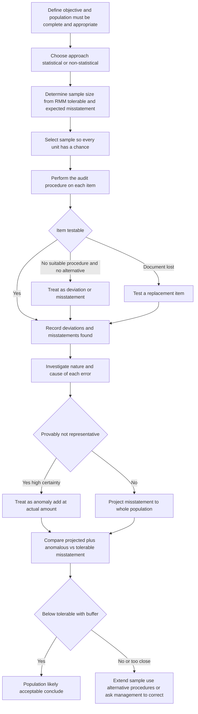
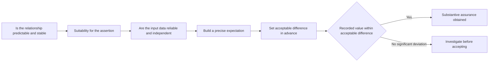

# Chapter 05 — Audit Sampling & Analytical Procedures

## 1. The Problem — Two Trust Gaps the Auditor Cannot Close by Brute Force

Return, for a moment, to why audit exists at all. The owners of a company hand their money to managers and then cannot watch what the managers do with it. The financial statements are the managers' *own* account of their stewardship — and a self-report from the party being judged is exactly the report you should distrust most. The auditor is the independent expert who stands between the two and says: *I have tested this account and I give you reasonable assurance it is not materially misstated.*

But "I have tested this" runs straight into a wall of arithmetic.

**Trust gap #1 — the volume gap.** A mid-size company posts 400,000 sales invoices, 90,000 purchase entries, 12,000 journal vouchers and a fixed-asset register of 6,000 lines in a single year. To *vouch every one* — trace it to a supporting document, check the amount, check the account, check the period — would take a team decades and cost more than the company is worth. The owners will not pay for that, and even if they did, the audit would be delivered years too late to be of any use. So the auditor **physically cannot examine 100% of most populations**. Yet the opinion must cover the *whole* account balance, not the fraction actually looked at. How does an auditor form a conclusion about 400,000 invoices after examining 60 of them without that being a reckless guess?

**Trust gap #2 — the plausibility gap.** Even the items you *do* look at, you look at one at a time, in isolation. Vouching invoice #227 tells you invoice #227 is genuine. It tells you nothing about whether *total* revenue makes sense given that the factory ran at 70% capacity, power consumption fell 15%, and the sales team shrank. A cleverly constructed set of fictitious invoices can each pass individual vouching and still, in aggregate, produce a revenue figure that is economically impossible. Detailed testing is myopic: it stares at documents and misses the shape of the whole. How does an auditor catch a misstatement that is invisible in any single transaction but glares out of the *relationships between* numbers?

These two gaps are answered by the two techniques of this chapter. **Audit sampling (SA 530)** answers the volume gap: how to examine a subset and rigorously project the conclusion to the whole. **Analytical procedures (SA 520)** answer the plausibility gap: how to test whether the numbers, taken together, tell a coherent story. They are complementary — one drills down, the other steps back — and a competent audit uses both.

---

## 2. The Core Idea

**Sampling — the core idea.** If a population is reasonably homogeneous, then a *properly selected* subset behaves like the whole. Examine a representative sample, measure the rate or amount of error in it, and *project* that error to the population. The projection is only honest if every item had a chance of selection (so the sample is not rigged) and the sample is large enough that the projection is not swamped by luck. The residual uncertainty — that the sample, by chance, was not representative — is a real and *unavoidable* cost of not testing everything. Auditing does not pretend this cost is zero; it *measures and controls* it, and calls it **sampling risk**.

**Analytical procedures — the core idea.** Meaningful financial and non-financial data move together in predictable ways. Revenue and cost of goods sold rise together; interest expense tracks the loan balance and the rate; payroll tracks headcount; production tracks power and raw-material consumption. These relationships are *expected to persist* unless something has changed. So the auditor builds an **independent expectation** of what a figure should be, compares it to what is recorded, and treats any **unexpected difference** as a red flag that must be chased down. A relationship that *should* hold but doesn't is either a real business event — or a misstatement wearing a disguise.

Both techniques rest on the same deeper move: **the auditor does not accept the client's numbers passively; the auditor generates an independent basis for comparison** — a projected error rate, or an expected value — and holds the recorded figure against it.

---

## 3. Why It's Built This Way — The Logic Behind the Requirements

Why not just test whatever the auditor feels like and stop when tired? Because that reintroduces exactly the arbitrariness the audit was supposed to remove. If the auditor could pick items at whim, a lazy or captured auditor could quietly avoid the risky items, and no one could tell. The Standards therefore *constrain* how sampling and analytics are done, and each constraint traces to a specific failure it prevents:

- **"Every sampling unit must have a chance of selection" (SA 530).** *Why:* if some items can never be picked, the conclusion cannot honestly cover them. A sample that excludes, say, all year-end entries cannot support an opinion on year-end cut-off. Representativeness is what licenses projection.
- **Sample size must respond to risk, tolerable error and expected error.** *Why:* the sample is the auditor's evidence budget; it must be *bigger* where the stakes (risk of material misstatement) are higher and the room for error (tolerable misstatement) is smaller. A fixed "test 25 items" rule would over-test safe accounts and dangerously under-test risky ones.
- **Projected errors must be evaluated against tolerable misstatement, not just counted.** *Why:* one error found in a sample is not one error in the population — it implies many. Failing to *extrapolate* is the classic way auditors fool themselves into signing off on a materially wrong balance.
- **Analytical expectations must be independent and precise (SA 520).** *Why:* if the auditor merely notes "revenue went up, seems fine," with no independent estimate of *how much* it should have gone up, the procedure detects nothing. The rigour lives in the precision of the expectation — a vague expectation cannot be violated, and so can never raise an alarm.
- **Every significant deviation must be investigated (SA 520 and SA 530).** *Why:* the entire value of both techniques is destroyed if the auditor spots an anomaly and then accepts management's first soothing explanation without corroboration. The anomaly is the *signal*; waving it away is how frauds survive audits.

The through-line: the Standards convert judgement into *disciplined* judgement. The auditor still decides, but must decide within a structure that leaves an evidence trail and blocks the easy ways of cheating oneself or the reader.

---

## 4. Full Technical Content — SAs by Purpose, with the "Why" Wrapped In

### 4.1 SA 500 — Audit Evidence (the parent that makes sampling legitimate)

Before sampling, understand *why testing a subset is even allowed*. **SA 500 (Audit Evidence)** permits the auditor to select items for testing by several means; sampling is one of them. It also introduces the idea that evidence must be **sufficient (quantity)** and **appropriate (quality = relevant + reliable)**. Sampling is a tool for achieving *sufficiency* efficiently. **SA 330** (auditor's responses to assessed risks) is the reason we test at all — it requires further audit procedures whose *nature, timing and extent* respond to risk; "extent" is precisely what sample size governs. So SA 530's sample-size logic is SA 330's "extent" made operational.

SA 500 identifies three ways to select items for testing:
1. **Selecting all items (100% examination)** — appropriate for small populations of large-value items, or when data is electronically processed and inexpensive to test in full (e.g., a computer-assisted re-performance).
2. **Selecting specific items** — the auditor's *judgemental* selection of high-value items, all items over a threshold, unusual or suspicious items, or items to obtain information. **Important trap:** this is targeted testing, **not audit sampling**, because non-selected items had *no* chance of selection — so the result **cannot be projected** to the whole population.
3. **Audit sampling** — the subject of SA 530: applying procedures to less than 100% of a population *such that all sampling units have a chance of selection*, enabling a conclusion about the *entire* population.

### 4.2 SA 530 — Audit Sampling

**Purpose (the risk it answers):** to provide a reasonable basis for a conclusion about a whole population when testing everything is uneconomic, while *controlling* the risk that the sample misleads.

**Key definitions (know these precisely — the exam tests the wording):**

| Term | Meaning | Why it matters |
|---|---|---|
| **Audit sampling** | Applying procedures to less than 100% of items within a population of audit relevance such that **all sampling units have a chance of selection**, to draw a conclusion about the **entire population** | The "chance of selection" is what makes projection valid |
| **Population** | The entire set of data from which a sample is drawn and about which the auditor wishes to conclude | Must be **complete** and **appropriate** to the objective, or the conclusion is worthless |
| **Sampling unit** | The individual items constituting the population (an invoice, a debtor balance, a line, a rupee) | Choice of unit shapes the method (e.g., monetary-unit sampling) |
| **Sampling risk** | The risk that the auditor's conclusion **based on the sample differs** from the conclusion had the whole population been tested | The *unavoidable* cost of sampling; reduced by larger samples |
| **Non-sampling risk** | The risk of a wrong conclusion for **any reason unrelated to sample size** — e.g., using an unsuitable procedure, or missing an error in an item actually tested | *Not* fixed by bigger samples; fixed by planning, supervision, training |
| **Tolerable misstatement** | A monetary amount set by the auditor to obtain appropriate assurance that the **actual** misstatement does not exceed it | The benchmark against which projected misstatement is judged; ≤ performance materiality |
| **Tolerable rate of deviation** | A rate of deviation from a prescribed control the auditor is willing to accept | The benchmark for **tests of controls** |
| **Anomaly** | A misstatement or deviation **demonstrably not representative** of the population | Rare; must be *proven*, not assumed — see 4.2.6 |
| **Statistical sampling** | Sampling using (a) **random selection** and (b) **probability theory** to measure sampling risk | Lets you *quantify* sampling risk |
| **Non-statistical sampling** | Any approach lacking either feature | Sampling risk judged, not computed — but the *rigour* is still required |

#### 4.2.1 Sampling risk and its two faces

Sampling risk cuts both ways, and the two directions have very different consequences:

For **tests of controls**:
- **Risk of over-reliance** (risk the control is *more* effective than it really is) — *Why it's dangerous:* the auditor relies on a control that is actually failing, reduces substantive testing accordingly, and a real misstatement sails through. This affects **audit effectiveness** — it can lead to a **wrong opinion**.
- **Risk of under-reliance** (control judged *less* effective than it is) — leads to more work than necessary. Affects **audit efficiency** only.

For **tests of details (substantive)**:
- **Risk of incorrect acceptance** (concluding a materially misstated balance is *not* misstated) — the dangerous one; affects **effectiveness**, risks a wrong opinion.
- **Risk of incorrect rejection** (concluding a fairly stated balance *is* misstated) — leads to extra work; affects **efficiency**.

**The examiner's favourite point:** the auditor is far more worried about over-reliance and incorrect acceptance, because those threaten the *validity of the opinion*; the efficiency risks merely waste money. But the Standard requires that sampling risk be controlled in **both** directions.

#### 4.2.2 Statistical vs. non-statistical sampling — and why the choice is not the point

| Feature | Statistical | Non-statistical |
|---|---|---|
| Selection | Must be **random/probabilistic** | Any (may be haphazard, judgemental) |
| Sampling risk | **Measured** mathematically | **Assessed judgementally** |
| Sample-size basis | Formula/tables from statistics | Auditor's professional judgement |
| Objectivity of projection | Quantified, defensible with numbers | Reasoned, not numerically precise |
| Cost/skill | Higher; needs statistical competence and often software | Lower; simpler to apply |

**The crucial equaliser (frequently misunderstood):** SA 530 applies to **both** approaches. Both require a *representative* sample, both require *projection* of errors, both require *evaluation* against tolerable misstatement. The **only** thing statistical sampling adds is the ability to *quantify and control* sampling risk mathematically. A non-statistical approach is **not** a licence to be sloppy — it must be equally disciplined, only with judgement standing in for the formula. **Trap:** students think non-statistical = "just pick some and eyeball it." Wrong. The rigour is identical; the measurement of risk differs.

#### 4.2.3 What drives sample size (learn the *direction* of each relationship, not a formula)

**Tests of controls:**

| Factor | Effect on sample size | Why |
|---|---|---|
| ↑ auditor's intended reliance on the control | ↑ | More reliance demands stronger evidence |
| ↑ tolerable rate of deviation | ↓ | More room for error means fewer items needed |
| ↑ expected rate of deviation | ↑ | Must test more to distinguish an acceptable control from a failing one |
| ↑ desired confidence level | ↑ | Higher assurance needs more evidence |
| Number of items in population | **Negligible effect** (for large populations) | Counter-intuitive but true — see note below |

**Tests of details (substantive):**

| Factor | Effect on sample size | Why |
|---|---|---|
| ↑ risk of material misstatement (RMM) | ↑ | Riskier accounts need more evidence |
| ↑ use of *other* substantive procedures for the same assertion | ↓ | Evidence from analytics/other tests reduces reliance on the sample |
| ↑ desired assurance that tolerable misstatement is not exceeded | ↑ | More assurance = larger sample |
| ↑ tolerable misstatement | ↓ | More tolerance = smaller sample |
| ↑ expected misstatement | ↑ | Expecting more error demands more testing to pin it down |
| Stratification of the population | ↓ (per stratum efficiency) | Grouping like items reduces variability, needs fewer items |
| Number of items in population | **Negligible effect** (large populations) | Same counter-intuitive point |

**The counter-intuitive point examiners love:** for large populations, the **absolute size** of the population has almost **no effect** on the required sample size. Assurance comes from the *sample size*, not the *ratio* of sample to population. Testing 60 items gives roughly the same assurance whether the population is 10,000 or 1,000,000. Students who "scale up the sample because the population is huge" have misunderstood the statistics.

#### 4.2.4 Methods of selecting the sample

| Method | How it works | When suitable / why |
|---|---|---|
| **Random selection** | Random number generator/tables map numbers to items | Pure statistical sampling; every item equal chance |
| **Systematic selection** | Fixed sampling interval = population ÷ sample size; pick a random start, then every *n*th item | Efficient and easy. **Danger:** if the population has a *pattern* coinciding with the interval, the sample is biased — check first |
| **Monetary Unit Sampling (MUS) / value-weighted** | The sampling unit is the individual **rupee**; probability of selecting an *item* is proportional to its **value** | Automatically emphasises large-value items — ideal for testing **overstatement** of assets/income where big items carry the risk |
| **Haphazard selection** | Auditor selects without conscious bias, but not by a structured random method | Acceptable for **non-statistical** sampling only; **not** valid for statistical sampling because it isn't truly random. Auditor must avoid conscious/unconscious bias (e.g., always skipping hard-to-find or corner items) |
| **Block selection** | Selecting a contiguous *block* of items (e.g., all of March) | Generally **inappropriate** as a primary method — a block is not representative because items near each other tend to share characteristics; a fraud confined to another month is entirely missed |

**Stratification** (a companion technique): divide the population into sub-populations (strata) of similar value or risk, then sample each. *Why:* it reduces variability within each stratum, so a smaller total sample achieves the same assurance, and it lets the auditor concentrate effort on the high-value stratum where misstatement hurts most.

#### 4.2.5 Performing procedures, and the special problem of items you *can't* examine

The auditor performs the planned audit procedure on **each item selected**. Two practical wrinkles the Standard addresses directly:

- **If the procedure cannot be applied to a selected item** (e.g., the voucher is lost): the auditor must perform the procedure on a **replacement item**. *Why not just skip it?* Because dropping an item silently shrinks the population's coverage and — worse — a *missing document could itself be the misstatement*. You cannot let an item escape scrutiny merely because it's inconvenient.
- **If a suitable procedure cannot be applied to the selected item and no alternative exists:** the auditor treats that item as a **deviation** (for controls) or a **misstatement** (for details). *Why:* an untestable item is, for evidentiary purposes, a failure — assurance not obtained is assurance denied.

#### 4.2.6 Evaluating results — the heart of the Standard

This is where audits are won or lost. Four disciplined steps:

1. **Investigate the nature and cause** of every deviation/misstatement found, and consider its effect on the audit. *Why:* an error's *cause* matters more than its existence — is it a one-off keying slip, or the visible tip of a systematic control breakdown or fraud? A pattern (e.g., all errors on one clerk's entries, or all near year-end) signals something the raw count hides.

2. **The "anomaly" is nearly forbidden.** The auditor may treat a misstatement/deviation as an **anomaly** (and exclude it from projection) **only when able to demonstrate, with a high degree of certainty, that it is not representative** of the population — e.g., an error caused by a computer glitch on a single known date, now fixed. *Why the high bar:* labelling an error "anomalous" is the great escape hatch — it lets the auditor ignore what the sample is screaming. So the Standard demands *proof of non-representativeness*, including examining additional items to confirm the error didn't recur elsewhere. **Anomalies are rare; assume an error is representative unless proven otherwise.**

3. **Project misstatements (tests of details).** The auditor must **extrapolate** the misstatement found in the sample to the whole population. *Why:* the sample stands for the population; ₹X of error in the sample implies a much larger figure across the population. (An identified *anomaly*, having been proven unrepresentative, is added separately at its actual amount but **not** projected.) For **tests of controls**, no explicit projection is needed — the *sample deviation rate is itself the projected rate* for the population.

4. **Compare and conclude.** Set **projected misstatement (+ any anomalous misstatement)** against **tolerable misstatement**. Two outcomes:
   - Projected + anomalous is **comfortably below** tolerable → the population is *probably* acceptable, but consider whether it's *close* — the smaller the buffer, the higher the risk that *actual* (unknown) misstatement exceeds tolerable.
   - Projected approaches or **exceeds** tolerable → the sample does **not** support the population as fairly stated. The auditor must **re-assess** the sampling approach, **extend** procedures (larger sample), perform **alternative** procedures, and/or ask management to **investigate and correct**. *Why:* the audit cannot conclude on evidence that points the wrong way; more assurance must be obtained before an opinion is possible.

*Figure 5.1 — The SA 530 sampling process from defining the population to projecting errors and comparing against tolerable misstatement.*

### 4.3 SA 520 — Analytical Procedures

**Definition:** analytical procedures means **evaluations of financial information through analysis of plausible relationships among both financial and non-financial data**, including the necessary **investigation of identified fluctuations or relationships that are inconsistent with other information or that differ from expected values by a significant amount**.

**Purpose (the risk it answers):** the *plausibility gap* of Section 1. Detailed testing checks items in isolation and misses misstatements visible only in aggregate relationships. Analytics test whether the numbers, as a whole, hang together.

#### 4.3.1 Why analytical procedures work — the engine

The technique rests on one assumption: **plausible relationships among data can reasonably be expected to exist and continue, in the absence of known conditions to the contrary.** Gross margin percentage is stable across years unless pricing, product mix or cost changed. Interest expense = average loan × rate. Payroll ≈ headcount × average wage. Because these relationships are *predictable*, a **deviation from the expectation is informative**: it is either a genuine business change (which the auditor corroborates) or a *misstatement* (which the auditor must correct). The whole power of the method is that a well-built expectation turns an invisible misstatement into a visible fluctuation.

#### 4.3.2 The three points in the audit where analytics appear

| When | SA reference | Mandatory | Purpose / why |
|---|---|---|---|
| **Risk assessment** (planning) | **SA 315** (via 520 spirit) | **Yes — required** | Understand the entity and identify areas of higher risk of material misstatement; direct the audit where the numbers already look odd |
| **Substantive procedures** | **SA 520 (para 5)** | Optional (auditor's choice of response) | Obtain *substantive* evidence about assertions — a **substantive analytical procedure** |
| **Overall review near the end** | **SA 520 (para 6)** | **Yes — required** | Form an overall conclusion on whether the financial statements are consistent with the auditor's understanding — a final "does the whole picture make sense" check before signing |

**Exam-critical:** analytical procedures are **mandatory at two stages — risk assessment and final overall review — and optional as a substantive procedure.** Students frequently get this backwards.

#### 4.3.3 Substantive analytical procedures — the four conditions (SA 520.5)

The Standard does not let the auditor "do a ratio and relax." When *relying* on analytics as substantive evidence, the auditor must:

1. **Determine suitability** of the particular substantive analytical procedure for the given **assertions**, considering the assessed RMM and any tests of details for the same assertion. *Why:* analytics suit assertions with **predictable relationships over time** (e.g., completeness of interest expense, reasonableness of payroll). They are **poor** for accounts that are volatile, subject to management discretion, or made up of unrelated items (e.g., litigation provisions) — those need tests of details.
2. **Evaluate the reliability of the data** from which the expectation is built — considering **source, comparability, nature and relevance, and controls over its preparation**. *Why:* an expectation is only as trustworthy as its inputs. **Deadly trap:** if you build your expectation from data produced by the *same* system that produced the figure you're auditing, and that system is unreliable, the procedure is worthless — the error is baked into both sides. Independent or separately-controlled data is what gives the expectation teeth. Non-financial data (units produced, headcount, floor area, kilowatt-hours) is especially valuable precisely because it comes from *outside* the financial ledger.
3. **Develop an expectation** of recorded amounts and assess whether it is **precise enough** to identify a misstatement that, individually or aggregated, could be material. *Why:* precision is everything. "Revenue should be about the same" cannot detect a 4% overstatement. A precise expectation ("revenue should be ₹512 crore ± ₹8 crore, built from units shipped × contracted price") *can*. The finer the expectation, the smaller the misstatement it catches.
4. **Set the acceptable difference** — the amount of any difference from the expected value that can be accepted **without further investigation** — in advance, having regard to materiality and desired assurance. *Why:* deciding the threshold *before* seeing the number stops the auditor from rationalising whatever difference turns up as "close enough." Higher assurance and lower materiality ⇒ smaller acceptable difference.

*Figure 5.2 — The four SA 520.5 gates a substantive analytical procedure must pass, ending in the investigation of any significant deviation.*

#### 4.3.4 Techniques used in analytical procedures (the toolkit)

- **Trend analysis** — comparing a figure with prior periods (e.g., this year's repairs vs. last three years').
- **Ratio analysis** — gross-margin %, current ratio, receivables turnover / debtor days, inventory turnover, debt-equity, interest coverage. *Why powerful:* a ratio normalises for scale and exposes relationships (e.g., a rising debtor-days ratio hints at fictitious sales or uncollectible receivables).
- **Reasonableness tests / predictive testing** — building an *independent estimate* from a relationship: interest expense ≈ average borrowings × average rate; depreciation ≈ asset base × rate; hostel revenue ≈ rooms × occupancy × tariff. *Why the strongest form:* it produces a specific expected number, giving maximum precision.
- **Comparison with budgets/forecasts**, with **industry data**, and **relationships among elements** of financial information (e.g., payroll to headcount) and between financial and **non-financial** information (e.g., sales to units shipped).

#### 4.3.5 Investigating results (SA 520.7) — the step that gives analytics their bite

When analytical procedures identify fluctuations or relationships **inconsistent with other information or differing significantly from expected values**, the auditor must investigate by:

1. **Inquiring of management** and obtaining explanations, **and**
2. **Corroborating** those explanations with **other audit evidence**, **and**
3. Performing **other audit procedures** if the explanation cannot be corroborated or is inadequate.

**The non-negotiable point:** management's explanation is a *starting hypothesis, not evidence*. "Margins rose because we changed suppliers" must be checked against the actual new supplier contracts, GRNs and prices. *Why:* the whole purpose of raising the flag is defeated if the auditor lowers it on management's say-so — that is precisely the trust gap that created the need for an auditor. **An unexplained or uncorroborated significant fluctuation is a signal of possible material misstatement (including fraud) and cannot simply be accepted.**

#### 4.3.6 Assertions — how both techniques attach to what's being proved

Every substantive procedure exists to test an **assertion** (SA 315) — management's implicit claims embedded in the financial statements. Both sampling and analytics must be *pointed at* the right assertion, or they prove nothing relevant.

| Assertion (class of transactions / balances) | Meaning | Better tested by |
|---|---|---|
| **Occurrence / Existence** | Recorded items really happened / really exist | **Sampling → vouching** (recorded → document); MUS good for overstatement |
| **Completeness** | Everything that should be recorded *is* | **Analytics** (e.g., interest expense reasonableness) and **tracing** (document → records); sampling for understatement |
| **Accuracy / Valuation** | Amounts are correct and appropriately valued | Sampling (re-computation) **and** analytics (reasonableness tests) |
| **Cut-off** | Transactions in the correct period | Targeted/specific selection around year-end (a *directional*, not random, concern) |
| **Classification** | Recorded in the proper accounts | Sampling of entries; analytics of account relationships |
| **Rights & Obligations** | Entity owns assets / owes liabilities | Tests of details (title deeds, confirmations) |
| **Presentation & Disclosure** | Properly described and disclosed | Review procedures; analytics for overall consistency |

**Directional testing insight (why the method must match the assertion):** to test **overstatement** of an asset or income (the usual fraud direction for revenue/assets), sample **from the recorded balance** and vouch outward — value-weighted MUS is ideal because it targets big items. To test **understatement/completeness** (the usual concern for liabilities/expenses), you must start **outside** the ledger — trace source documents *in*, or use analytics — because items wrongly omitted are *not in the recorded population* and can never be caught by sampling the ledger. **Trap:** vouching a sample of recorded purchases can never detect *unrecorded* purchases; only tracing from source documents or an analytical reasonableness test can.

---

## 5. Applied Scenarios — Reasoning to the Correct Audit Response

### Scenario A — The "one small error, ignore it" temptation

*Facts:* Auditor CA Meena tests a sample of 100 sales invoices (population 50,000, tolerable misstatement ₹20 lakh) and finds **two** overstatement errors totalling ₹1,600 (₹1,000 + ₹600). She reasons: "₹1,600 is trivial against ₹20 lakh tolerable — the account is fine." Is she right?

*Reasoning:* No — she has committed the classic failure to **project**. The two errors are not ₹1,600 in the population; they represent a *rate* of error. Crude projection: ₹1,600 found in a sample covering (say) ₹2 lakh of value, projected across a ₹1 crore population, could imply **₹80,000+** of misstatement — and more importantly she must first **investigate the cause** (SA 530). If the two errors share a cause (both are the same product mispriced), that points to a *systematic* error affecting *all* such invoices, and projected misstatement could dwarf the raw ₹1,600. Only if she could *demonstrate with high certainty* an error is a non-recurring anomaly may she exclude it — and two similar errors are the opposite of anomalous.

*Correct response:* investigate cause → project the misstatement → compare projected (+ any anomalous) against ₹20 lakh tolerable → if close or exceeding, extend the sample or ask management to investigate and correct. **The number found in the sample is never the number in the population.**

### Scenario B — The reassuring margin that shouldn't reassure

*Facts:* A manufacturer's revenue rose 22% year-on-year, and gross margin *improved* from 28% to 34%. Management explains the margin jump as "better cost control." Power consumption, however, fell 9% and the workforce shrank 12%. Should the auditor accept the explanation?

*Reasoning:* This is SA 520 territory. Build an **independent expectation**: a 22% revenue rise from *genuine* higher volume should be accompanied by *higher* power and material consumption and roughly stable-or-slightly-improving margins — not a simultaneous **fall** in the physical inputs of production. Rising revenue with *falling* power and headcount is economically incoherent for a manufacturer and is a classic footprint of **fictitious/inflated sales** (revenue booked with no corresponding production). The margin *improvement* is a red flag, not comfort — fictitious sales carry no real cost, so they mechanically inflate margin.

*Correct response:* the fluctuation is **inconsistent with non-financial data** and differs significantly from expectation. Under SA 520.7: inquire of management, then **corroborate** — but "better cost control" does *not* explain rising revenue with falling inputs, so it fails corroboration. The auditor must perform **further procedures**: examine underlying sales contracts, dispatch/GRN records, confirm receivables directly, test cut-off, and treat this as a **fraud risk** (link to SA 240). The non-financial data is the auditor's most powerful weapon here precisely because management does not control it as easily as the ledger.

### Scenario C — Systematic selection walks into a trap

*Facts:* CA Rohit tests the completeness/accuracy of a control that the cashier stamps every receipt. Population is 3,650 daily cash sheets for the year; he wants a sample of 50, so interval = 73. He picks a random start and every 73rd sheet. Later it emerges the anomaly: **every** sample item is a *weekday*, and the fraud he was meant to catch — unstamped **Sunday** cash sheets where a relief cashier skips the control — is entirely absent from his sample. What went wrong?

*Reasoning:* **Systematic selection** is efficient but fails when the population contains a **periodic pattern that coincides with the sampling interval**. With a 7-day week and an interval of 73 (= 10 weeks + 3 days... in this constructed case aligning to weekdays), the sample systematically excluded a category. The result is a **non-representative** sample — violating the bedrock requirement that the sample represent the population — so any conclusion drawn cannot honestly cover Sundays.

*Correct response:* before using systematic selection, the auditor must **verify the population has no structure aligned with the interval**; where such a pattern exists, use **random selection** instead, or **stratify** (e.g., weekday vs. weekend) and sample each. This also illustrates **non-sampling risk** cousin: choosing an unsuitable *method* is a design failure, not something a bigger sample of the same flawed method would cure.

### Scenario D — Wrong direction of testing

*Facts:* To gain assurance that **liabilities are not understated** (completeness of trade payables), a junior auditor selects a sample of 40 recorded payables from the ledger and vouches each to a supplier invoice — all match. He concludes payables are complete. Correct?

*Reasoning:* No — this is a **directional error**. Sampling *from the recorded ledger* can only ever confirm that what is recorded is genuine (occurrence/existence). It is **structurally incapable** of detecting a **missing** liability, because an unrecorded payable is *not in the population being sampled*. Completeness of liabilities must be tested by starting **outside** the ledger — a **search for unrecorded liabilities** (examining post-year-end payments, unmatched GRNs, supplier statements) and **analytical reasonableness** (e.g., expected purchases vs. recorded). 

*Correct response:* redirect the procedure. Match the *technique to the assertion*: overstatement/existence → sample the ledger and vouch out; understatement/completeness → trace source documents in and use analytics.

---

## 6. Procedure & Documentation Summary

**Sampling — procedure checklist (SA 530):**
1. Define the **objective** and the **assertion** being tested.
2. Define the **population**; confirm it is **complete and appropriate** to the objective.
3. Choose **statistical or non-statistical**; both require representativeness and projection.
4. Determine **sample size** from RMM, tolerable misstatement/deviation, expected misstatement, and assurance from other procedures.
5. **Select** items so every unit has a chance (random / systematic / MUS / haphazard for non-statistical); consider **stratification**.
6. **Perform** the procedure on each item; use **replacements** for missing documents; treat truly untestable items as **deviations/misstatements**.
7. **Investigate** nature and cause of each error; assess for **patterns**.
8. Treat as **anomaly** only if **provably non-representative** (rare; examine more items to confirm).
9. **Project** misstatement to the population (tests of details); for controls, the **sample deviation rate is the projected rate**.
10. **Compare** projected (+ anomalous) against **tolerable**; if too close/exceeding → **extend, use alternatives, or seek correction**; **re-evaluate** whether the population is acceptable.

**Analytical procedures — procedure checklist (SA 520):**
1. Confirm the **stage**: risk assessment (**mandatory**), substantive (**optional**), overall review (**mandatory**).
2. For substantive use, pass the **four gates**: suitability for assertion → data reliability & independence → precise expectation → acceptable difference set in advance.
3. **Compute** the expectation using trend/ratio/reasonableness techniques and, wherever possible, **non-financial** and **independent** data.
4. Compare recorded vs. expected; where the difference is **significant**: **inquire → corroborate → perform further procedures** if not corroborated.
5. Conclude on the assertion / overall consistency of the statements.

**What must be documented (SA 230 links):** the population and sampling unit; how the sample size and method were determined; items selected; procedures performed and errors found; cause analysis and anomaly justification; projection and the comparison against tolerable misstatement; for analytics — the expectation, the data source and reliability assessment, the acceptable difference, the differences found, and the investigation and corroboration of significant fluctuations. *Why:* under SA 230, if it isn't documented, it wasn't done — and both techniques rest on judgements a reviewer must be able to retrace.

---

## 7. Connections

- **SA 500 / SA 501** (Audit Evidence): sampling is one of three ways to select items for testing; analytics is a *type* of substantive procedure. Both must yield **sufficient and appropriate** evidence.
- **SA 330** (Responses to assessed risks): "extent" of procedures = sample size; sampling and analytics are the operational tools of the auditor's *response*.
- **SA 315** (Risk assessment): analytical procedures are a **required** risk-assessment procedure; assessed RMM *drives* sample size.
- **SA 320** (Materiality): **tolerable misstatement** (≤ performance materiality) is the benchmark against which projected error is judged; **acceptable difference** in analytics derives from materiality.
- **SA 240** (Fraud): unexplained analytical fluctuations and error *patterns* in samples are fraud signals; directional testing (overstatement of revenue/assets) is fraud-aware.
- **SA 230** (Documentation): both techniques generate specific documentation obligations.
- **SA 520 ↔ SA 530 relationship:** they are *substitutes and complements* — strong substantive analytics **reduce** required sample size for the same assertion (a factor in 4.2.3), and each covers the other's blind spot (isolation vs. aggregate; existence vs. completeness).

---

## 8. Traps & Examiner Tricks

- **"Non-statistical = casual."** False. SA 530 applies fully to both; the only difference is whether sampling risk is *measured* or *judged*. Representativeness and projection are mandatory in both.
- **Failure to project.** Treating errors found in the sample as the total error in the population. Errors must be **extrapolated**.
- **Over-using "anomaly."** The anomaly exemption is *rare* and requires **proof of non-representativeness with high certainty**, including testing more items. Do not use it to wave away inconvenient errors.
- **Population size drives sample size.** For large populations it does **not** — assurance comes from sample size, not the sample-to-population ratio.
- **Sampling risk vs. non-sampling risk.** Sampling risk shrinks with bigger samples; **non-sampling risk does not** — it is countered by planning, supervision, competence and suitable procedures.
- **Effectiveness vs. efficiency risks.** Over-reliance and incorrect acceptance threaten the **opinion** (effectiveness); under-reliance and incorrect rejection only waste effort (efficiency). Know which is which.
- **When are analytics mandatory?** At **risk assessment** and **final overall review** — **not** as a substantive procedure (that's optional). Frequently reversed by students.
- **Building the expectation from unreliable/dependent data.** If the expectation's inputs come from the same weak system as the audited figure, the procedure proves nothing. Prefer **independent** and **non-financial** data.
- **Accepting management's explanation uncorroborated.** SA 520.7 requires **corroboration**; an oral explanation is a hypothesis, not evidence.
- **Precision of expectation.** A vague expectation can never be violated and detects nothing. The finer the expectation, the smaller the misstatement caught.
- **Directional testing.** Vouching the recorded ledger cannot detect **omissions** (understatement/completeness). Match the technique to the assertion's *direction*.
- **Block and haphazard selection.** Block selection is generally inappropriate (not representative); haphazard is fine for **non-statistical** only and must avoid bias — never for statistical sampling.
- **Systematic selection + periodic pattern = biased sample.** Always check for structure that aligns with the interval.
- **Specific-item selection is not sampling.** Judgementally picking all items over ₹X is **targeted testing**; its results **cannot be projected** because unselected items had no chance of selection.

---

## 9. First-Principles Recap

Audit exists because owners cannot verify managers, so an independent expert gives assurance on the managers' self-report. That assurance runs into two hard limits, and this chapter is the disciplined answer to each.

The **volume limit** — you cannot test everything — is met by **sampling (SA 530)**: examine a *representative* subset in which every item had a chance of selection, find and *investigate* errors, **project** them to the whole, and compare the projection against **tolerable misstatement**. The residual uncertainty (that the sample was, by luck, unrepresentative) is **sampling risk**, which the auditor *measures* (statistically) or *judges* (non-statistically) but never ignores. Errors that resist projection because you can't test them, or that hide in patterns, or that point the wrong direction, are all traps this discipline is built to close.

The **isolation limit** — item-by-item testing misses misstatements visible only in aggregate — is met by **analytical procedures (SA 520)**: because meaningful data move together predictably, the auditor builds an **independent, precise expectation** and treats any **significant, uncorroborated deviation** as a signal of possible misstatement, mandatory at planning and final review and optional as substantive evidence. Its power is exactly proportional to the *precision* of the expectation and the *independence* of its data — which is why non-financial data is gold.

Both techniques enforce the same non-negotiable move: the auditor manufactures an **independent yardstick** — a projected error, an expected value — and refuses to accept the client's number, or the client's explanation, without holding it against that yardstick. That refusal *is* the audit.

---

## 10. Quick-Revision Sheet

**Key Standards**

| SA | Title | Core requirement / why |
|---|---|---|
| **SA 500** | Audit Evidence | Three ways to select items: all / specific / **sampling**; evidence must be sufficient + appropriate |
| **SA 530** | Audit Sampling | Test <100% with every unit having a chance; project errors; compare to tolerable misstatement; control sampling risk |
| **SA 520** | Analytical Procedures | Evaluate plausible relationships; **mandatory** at risk assessment + overall review, optional substantive; investigate + corroborate significant deviations |
| **SA 315** | Risk assessment | Analytics **required**; RMM drives sample size |
| **SA 330** | Responses to risk | "Extent" = sample size |
| **SA 320** | Materiality | Tolerable misstatement ≤ performance materiality |
| **SA 240** | Fraud | Fluctuations and error patterns are fraud signals |
| **SA 230** | Documentation | Record population, method, size, errors, projection, expectation, investigation |

**Sampling — must-knows**
- Sampling risk = risk sample conclusion ≠ whole-population conclusion; **shrinks with sample size**. Non-sampling risk = wrong conclusion for other reasons; **not** fixed by size.
- Dangerous directions: **over-reliance** (controls) and **incorrect acceptance** (details) → affect the **opinion**. Their opposites affect only **efficiency**.
- Statistical = random selection **+** probability theory (measures risk). Non-statistical = judgement; **same rigour**, risk not quantified.
- Sample size ↑ with: RMM, expected error, desired assurance/confidence, intended reliance. Sample size ↓ with: tolerable misstatement/deviation, other substantive evidence, stratification. **Population size: negligible for large populations.**
- Selection methods: random, systematic (beware periodic patterns), MUS/value-weighted (targets overstatement), haphazard (non-statistical only), block (avoid).
- Evaluate: investigate cause → **anomaly only if provably unrepresentative** → **project** → compare to tolerable → extend/alternatives/correct if too close.
- **Specific-item selection ≠ sampling** (no projection). **Directional testing:** overstatement → sample ledger & vouch out; completeness → trace in / analytics.

**Analytical procedures — must-knows**
- Works because relationships among financial and **non-financial** data are **predictable and persist**.
- **Mandatory** at (1) risk assessment and (2) final overall review; **optional** as substantive.
- Four gates for substantive use: **suitability** for the assertion → **reliable, independent data** → **precise expectation** → **acceptable difference set in advance**.
- Techniques: trend, ratio, reasonableness/predictive tests, budget/industry/inter-element comparisons.
- Investigate significant deviations: **inquire → corroborate with evidence → further procedures**. Never accept an uncorroborated explanation.
- Best assertions: **completeness** and reasonableness of accounts with stable relationships; poor for volatile/discretionary accounts (use tests of details).

**One-line memory hooks**
- *Sampling drills down; analytics steps back.*
- *The number in the sample is never the number in the population — project it.*
- *A vague expectation can never be violated — precision is the whole point.*
- *Management's explanation is a hypothesis, not evidence — corroborate it.*
- *You cannot sample the ledger to find what was left out of the ledger.*
