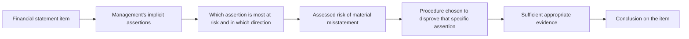
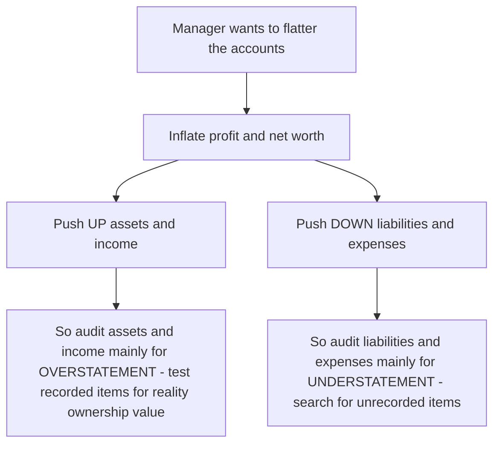
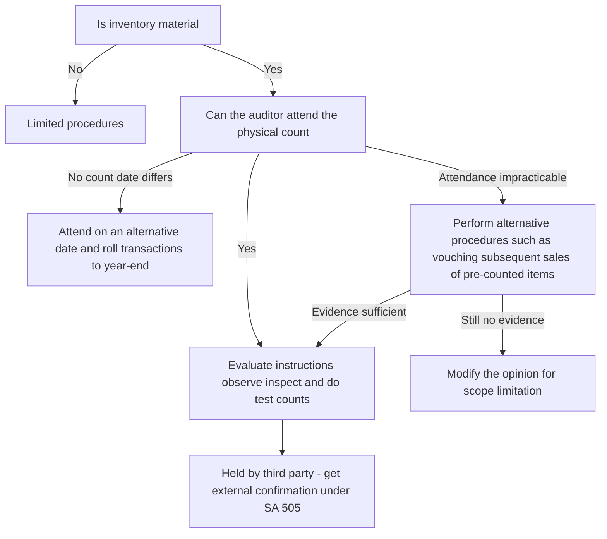
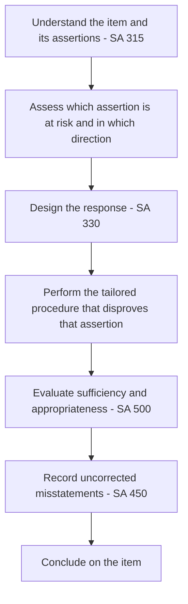

# Chapter 06 — Audit of Items of Financial Statements

## 1. The Problem — Why "audit the balance sheet line by line" is a trap unless you understand what is actually at risk

Return to the founding tension of this whole subject. The owners of a company (shareholders) hand their money to managers (directors) and then go away. The managers prepare a set of financial statements that say, in effect: *"Here is what we own, here is what we owe, and here is how much we earned for you."* The owners cannot walk into the warehouse and count the boxes, phone every customer to confirm the debt, or re-add every invoice. They are structurally blind. The auditor is the paid, independent expert who does the looking on their behalf and reports whether the statements can be trusted.

So far, so familiar. But here is the specific problem this chapter attacks: **the financial statements are not one claim — they are hundreds of separate claims, and each claim can be false in a *different* way.**

Consider two numbers on the same balance sheet:

- **Revenue ₹500 crore.** How does a dishonest manager distort *this*? Almost always by making it **bigger than reality** — recording sales that did not happen, or pulling next year's sales into this year — because bonuses, share prices and loan covenants all reward high revenue. The risk direction is **overstatement**.
- **Trade payables ₹80 crore.** How does a dishonest manager distort *this*? By making it **smaller than reality** — hiding invoices in a drawer, not recording goods received near year-end — because a smaller liability makes the company look healthier and profit look bigger. The risk direction is **understatement**.

If the auditor used the *same* procedure on both — say, "vouch a sample of recorded entries to supporting documents" — they would catch the revenue fraud (each recorded sale is tested for reality) but **completely miss the payables fraud** (you cannot vouch an invoice that was deliberately never entered). The recorded payables would all be genuine; the problem is the *missing* ones.

That single example is the entire reason this chapter exists. **You cannot audit every line item the same way, because every line item is exposed to a different lie.** The direction of the likely misstatement, the party motivated to commit it, and the evidence that can disprove it all change from one item to the next. A procedure that is powerful against one risk is blind to another.

The risk this chapter counters, then, is the risk of the **wrong-tool auditor** — the auditor who performs lots of activity but aims it in the wrong direction and gives a clean opinion over a materially misstated figure.

---

## 2. The Core Idea — Assertions are the bridge from "risk" to "procedure"

The tool that saves us is the concept of the **assertion**, drawn from **SA 315 (Identifying and Assessing the Risks of Material Misstatement)**. Every figure and disclosure in the financial statements is management making a bundle of implicit *representations*. When management writes "Inventory ₹40 crore," they are silently asserting:

- **Existence** — this inventory really is physically there.
- **Rights and obligations** — we actually own it (it is not held on consignment for someone else).
- **Completeness** — all inventory we own is included; nothing has been left out.
- **Valuation / Accuracy** — it is measured correctly (at lower of cost and net realisable value).
- **Presentation / Classification** — it is shown and disclosed properly (e.g., raw material vs finished goods, pledged stock flagged).

For transactions and events (like revenue and expenses) the assertion set is phrased slightly differently: **Occurrence, Completeness, Accuracy, Cut-off, Classification** (and Presentation).

**The core idea of the whole chapter is a three-step chain, applied to every single line item:**

> **For this item, which assertion is most likely to be false, in which direction, because of whose motive? → That is the risk. → Choose the procedure that specifically can disprove *that* assertion.**

This is the disciplined form of our guiding law "no requirement before its reason." The "reason" for any verification procedure is *the assertion at risk*. Vouching proves Occurrence. Tracing proves Completeness. Physical inspection proves Existence. External confirmation proves Existence and Rights. Recomputation proves Accuracy and Valuation. Once you internalise which procedure attacks which assertion, you never again have to memorise a list of "audit steps for receivables" — you *derive* them.

*Figure 1 — The assertion is the hinge between the risk and the procedure; you never jump straight from item to procedure.*

---

## 3. Why it's built this way — The logic behind "tailored, direction-aware" procedures

Three structural facts about financial statements force the tailored approach.

**(a) Double-entry means every misstatement has a *motive-driven direction*.** Because assets and income sit on one side and liabilities and expenses on the other, inflating profit can be achieved by *overstating* the income/asset side **or** by *understating* the expense/liability side. Fraudsters pick whichever is easier to hide. So the auditor must ask, for each item, "if someone wanted to flatter the accounts, would they push this number up or down?" and aim the testing against that direction. This is why **assets and income are audited primarily for overstatement** (test what is recorded — is it real, is it owned, is it worth this much?) while **liabilities and expenses are audited primarily for understatement** (search for what is *missing* — unrecorded obligations).

**(b) The best evidence for one assertion is worthless for another.** Existence is a physical fact — so you inspect the physical thing (count the stock, see the machine). Completeness is the absence of something — so inspection is useless; you must *search* using an independent starting point (the goods-received records, the post-year-end payments, the bank statements). Valuation is a measurement judgement — so you recompute and challenge estimates. The evidence has to match the *nature* of the assertion. **SA 500 (Audit Evidence)** governs this: evidence must be *sufficient* (enough) and *appropriate* (relevant to the assertion + reliable in source), and reliability rises when evidence is external, independent, and obtained directly by the auditor.

**(c) Some assertions are so high-risk that the profession wrote dedicated Standards.** Where a particular assertion for a particular item is both material and historically abused, ICAI did not leave it to general principles — it issued a specific SA. Inventory existence and litigation → **SA 501**. Opening balances in a first audit → **SA 510**. Accounting estimates and provisions → **SA 540**. External confirmation of receivables/bank/payables → **SA 505**. Related party transactions → **SA 550**. Each of these is simply "a general risk that recurred so often it earned its own rulebook." We teach each one at the item where its risk bites.

*Figure 2 — The direction of testing flips depending on which side of the balance sheet you are on, because the motive flips.*

---

## 4. Full Technical Content — Every item, its assertion at risk, and the procedure that answers it

Below, each item is treated the same disciplined way: **the risk → the assertion → the procedure → the "why".** SA references are given; where a number should be double-checked against current ICAI material it is flagged.

### 4.0 The governing Standards you carry into every item

| SA | What it gives you for item audit | The risk it addresses |
|----|----------------------------------|-----------------------|
| **SA 315** | Assertions; risk assessment; understanding entity & controls | You'd test blindly without knowing where misstatement is likely |
| **SA 330** | The auditor's *responses* to assessed risk — tests of controls and substantive procedures | Effort must be concentrated where risk is high |
| **SA 500** | Audit evidence — sufficient & appropriate; reliability hierarchy | Weak or irrelevant evidence gives false comfort |
| **SA 501** | Specific evidence — inventory count attendance, litigation, segment info | Inventory existence & contingent liabilities are chronically misstated |
| **SA 505** | External confirmations | Internal records can be manipulated; outsiders are independent |
| **SA 510** | Opening balances (initial engagements) | Closing balances are only right if openings were right |
| **SA 520** | Analytical procedures | Numbers that "don't move together" flag misstatement cheaply |
| **SA 530** | Audit sampling | You cannot test 100%; sample must represent the population |
| **SA 540** | Auditing accounting estimates (provisions, fair values, ECL, depreciation) | Estimates are the softest area for manipulation |
| **SA 550** | Related parties | Transactions with insiders may be non-genuine or unfairly priced |
| **SA 560** | Subsequent events | Conditions after year-end can change reported balances |
| **SA 570** | Going concern | Values assume the entity survives |

Keep this table in your head; every sub-section below is just these Standards *pointed at one figure*.

---

### 4.1 Revenue (Sales of goods / rendering of services)

**The risk.** Revenue is the single most manipulated line in accounts. The motive is always to make it **bigger** (bonuses, valuations, covenants, listing pressure). Under **SA 240 (Auditor's Responsibilities Relating to Fraud)** there is a **rebuttable presumption that revenue recognition carries a risk of fraud** — the auditor must presume it unless they can justify otherwise. Recognition under **Ind AS 115 / AS 9** turns on transfer of control/risks-and-rewards, so the two favourite tricks are:

- **Fictitious sales** — invoices to fake or colluding customers → attacks **Occurrence**.
- **Cut-off manipulation** — recording next period's sales in this period (or vice versa) → attacks **Cut-off**.

**Assertion at risk:** primarily **Occurrence** and **Cut-off**; also **Accuracy** and **Completeness** (the last mainly in cash businesses where sales are *suppressed* to evade tax — note the direction reverses when the motive is tax evasion, not profit inflation).

**Procedures and their why:**

- **Vouch recorded sales to supporting documents** — trace sample invoices to the customer order, dispatch/delivery challan, gate outward register and the customer's acknowledgement. *Why:* proves the sale actually **occurred** and goods really left. A fictitious sale cannot produce an independent dispatch record.
- **Cut-off testing** — for the last few days before and first few days after year-end, match the date of dispatch (transfer of control) to the date the sale was booked. *Why:* directly tests **Cut-off**; catches sales pulled forward or pushed back.
- **Analytical procedures (SA 520)** — compare gross margin %, month-wise sales trend, sales returns *after* year-end. *Why:* a spike in late-year sales reversed by heavy post-year-end returns is the fingerprint of channel-stuffing.
- **Test credit notes / returns after year-end** — large returns just after closing suggest the original sale was not genuine.
- **Confirm unusual or year-end large customers** where doubt exists.
- **Review revenue recognition policy** against Ind AS 115's five-step model (identify contract → performance obligations → transaction price → allocate → recognise on satisfaction).

**Practical verification points:** ensure sales are recorded net of GST correctly; check that goods sent on **approval or consignment** are *not* recognised as sales (that is a Rights/Occurrence error); verify discounts and incentives are properly netted.

---

### 4.2 Purchases and Expenses

**The risk.** Mirror image of revenue. To inflate profit, expenses are **understated** (omitted or deferred); to evade tax or siphon funds, expenses are **overstated** with fictitious or personal spending. Purchases feed both cost of sales and inventory, so an error here hits two statements.

**Assertion at risk:** for profit-inflation, **Completeness** (unrecorded expenses) and **Cut-off** (pushing expenses to next year); for fraud/siphoning, **Occurrence** (fictitious purchases, personal costs booked as business).

**Procedures and their why:**

- **Search for unrecorded liabilities / expenses** — examine payments made *after* year-end and un-entered supplier invoices to see if they relate to the year under audit. *Why:* the only way to test **Completeness** is to start from a source *outside* the ledger; you cannot vouch an expense that was never recorded.
- **Vouch recorded purchases/expenses** to purchase order, goods-received note (GRN), supplier invoice and payment. *Why:* tests **Occurrence** — that the expense is genuine, business-related and correctly priced.
- **Purchase cut-off** — match GRN dates to the period the purchase/creditor is booked. *Why:* goods received before year-end must appear in *both* purchases and closing inventory; omitting the invoice but counting the stock inflates profit.
- **Analytical review** of expense ratios and each expense head vs prior year and budget. *Why:* a sudden drop in an expense line can reveal deliberate omission; a spike can reveal fictitious or misclassified spend.
- **Scrutinise capital vs revenue classification** — a revenue expense capitalised inflates profit and assets. *Why:* tests **Classification**.

**Practical verification points:** check TDS is deducted where required (an omission signals unrecorded/unauthorised payments); verify related-party purchases (SA 550) are at arm's length; confirm prepaid and outstanding expenses are correctly split across periods.

---

### 4.3 Property, Plant and Equipment (PPE)

**The risk.** PPE is large and long-lived, so distortions are in *valuation and existence over time*: (i) an asset sold/scrapped but still on the books (**Existence** overstated), (ii) revenue expenses capitalised to boost profit (**Occurrence/Classification**), (iii) wrong depreciation or ignored impairment (**Valuation**), (iv) assets purchased but title unclear or the asset charged as security not disclosed (**Rights & Presentation**).

**Assertion at risk:** **Existence, Valuation, Rights and obligations, Completeness of additions/disposals.**

**Procedures and their why:**

- **Verify additions** to invoices, board approval, installation/commissioning evidence, and capitalisation of only directly attributable costs (per Ind AS 16 / AS 10). *Why:* tests **Occurrence** of additions and correct **Valuation** of cost — blocks revenue-to-capital manipulation.
- **Inspect physically** a sample of high-value assets / reconcile to the **fixed asset register**. *Why:* tests **Existence**; the register-to-floor and floor-to-register walk catches ghost assets and unrecorded disposals.
- **Recompute depreciation** — method, rate/useful life, consistency, and that it starts when the asset is ready for use. *Why:* tests **Valuation** (SA 540 — depreciation is an estimate).
- **Test disposals** — authorisation, sale proceeds, correct gain/loss, removal from register. *Why:* tests **Completeness** of disposals and prevents a sold asset lingering as an overstated asset.
- **Examine title deeds / RC books / ownership documents**; for immovable property, note the Companies Act (Schedule III) disclosure requiring whether **title deeds are held in the company's name**. *Why:* tests **Rights**.
- **Consider impairment (Ind AS 36 / AS 28)** — any indicators of decline. *Why:* tests **Valuation** for overstatement.
- **Check charges/mortgages** registered against assets and their disclosure. *Why:* **Presentation**.

**Practical verification points:** capital work-in-progress ageing (long-pending CWIP may signal stalled/impaired projects); leased assets classified correctly (Ind AS 116); revaluations supported by a competent valuer's report.

---

### 4.4 Inventory — Existence via SA 501, plus Valuation

**The risk.** Inventory is the classic fraud vehicle because it sits at the intersection of the balance sheet *and* the profit calculation: **closing inventory ↑ ⇒ cost of sales ↓ ⇒ profit ↑.** So the pressure is to **overstate** it — either by claiming stock that isn't there (**Existence**), by ignoring obsolete/damaged stock and carrying it above realisable value (**Valuation**), or by counting third-party goods as your own (**Rights**).

**Assertion at risk:** **Existence** (headline), **Valuation**, **Rights**, **Completeness**, **Cut-off**.

**SA 501 — the dedicated Standard.** Because inventory existence is so material and abused, SA 501 requires the auditor, when inventory is material, to obtain sufficient appropriate evidence about its existence and condition by:

1. **Attending the physical inventory count** (unless impracticable) — to (a) evaluate management's counting *instructions and procedures*, (b) **observe** the count, (c) **inspect** the inventory, and (d) perform **test counts** (from floor to sheets = existence; from sheets to floor = completeness).
2. If the **count date differs** from the balance sheet date, perform procedures on the *intervening transactions* to roll the quantity forward/back.
3. If the auditor **cannot attend** (e.g., appointed after the count), perform or observe counts on an **alternative date** and reconcile.
4. If attendance is **impracticable**, perform **alternative procedures** (e.g., inspect documentation of subsequent sales of specific items counted before year-end); if even that is impossible, **modify the opinion** for a scope limitation.
5. For inventory held by **third parties** (in a warehouse/consignee), obtain **external confirmation (SA 505)** and/or inspect. *Why confirmation:* the goods are not on your premises, so an independent custodian's word is the relevant evidence for **Existence and Rights**.

*Figure 3 — SA 501 decision path for obtaining evidence over inventory existence.*

**Valuation procedures and their why:**

- **Recompute cost** using the entity's method (FIFO / weighted average — LIFO is not permitted) and compare cost to **net realisable value (NRV)**; inventory is carried at the **lower** (Ind AS 2 / AS 2). *Why:* tests **Valuation** for overstatement.
- **Test for obsolete, slow-moving, damaged stock** — ageing analysis, physical condition noted during the count. *Why:* prevents dead stock being carried at full cost.
- **Cut-off** — confirm goods received before year-end are *in* inventory and their creditor booked, and goods dispatched (sold) are *out*. *Why:* misaligned cut-off is the easiest way to shift profit.

**Practical verification points:** reconcile count sheets to the stock ledger and financial statements; verify inventory pledged as security is disclosed; check inclusion of goods in transit and exclusion of goods held on consignment for others.

---

### 4.5 Trade Receivables — External confirmation (SA 505)

**The risk.** Receivables are overstated to inflate assets, or their recoverability is overstated by under-providing for bad debts. So two things can be wrong: the debt may **not exist / not be owed** (**Existence, Rights**), or it may exist but be **uncollectible and over-valued** (**Valuation**).

**Assertion at risk:** **Existence, Rights, Valuation (recoverability), Cut-off.**

**Procedures and their why:**

- **External confirmation (SA 505)** — the flagship procedure. Write to a sample of customers asking them to confirm the balance owed *directly to the auditor*. *Why:* the customer is **independent** of the client; their confirmation is far more reliable (SA 500 hierarchy) than the client's own ledger, and it directly proves **Existence and Rights**. Use **positive confirmations** (reply whether they agree or not) for material/risky balances; **negative confirmations** (reply only if they disagree) only for many small, low-risk balances with good controls. **The auditor must control the process** — send and receive replies directly, keeping the client's hands off. If management **refuses to allow** a confirmation, evaluate the validity of the reason, perform **alternative procedures**, and if the refusal is unreasonable treat it as a **scope limitation** and consider communicating with those charged with governance.
- **Alternative procedures when no reply** — inspect **subsequent receipts** (cash received after year-end against the specific invoice), or examine sales invoice + dispatch + customer order. *Why:* subsequent collection is powerful evidence the debt was **real and recoverable**.
- **Test the provision for doubtful debts / expected credit loss (SA 540)** — **age the receivables**, review balances long overdue, disputed accounts, and post-year-end recoveries. *Why:* tests **Valuation** for overstatement.
- **Cut-off** — tie the last sales to the receivable balance.

**Practical verification points:** watch for credit balances in receivables (should be reclassified to payables/advances, not netted); scrutinise related-party receivables (SA 550) which may be non-genuine or evergreen; review the reasonableness of the ECL model assumptions.

---

### 4.6 Investments

**The risk.** Overstatement of value (carrying an investment above its fair/recoverable amount), and existence/ownership (does the security exist and is it in the company's name and unencumbered?).

**Assertion at risk:** **Existence, Rights, Valuation, Presentation (classification current vs non-current).**

**Procedures and their why:**

- **Physical inspection of securities** in hand, or **confirmation from the depository / custodian (SA 505)** for demat holdings, and inspection of the DP statement. *Why:* independent custodian evidence proves **Existence and Rights**; you cannot rely on the client's own list alone.
- **Verify valuation** per the applicable framework — fair value through P&L / OCI or cost, per Ind AS 109 / AS 13 — using quoted prices, or for unquoted, the valuation basis and any impairment. *Why:* tests **Valuation**; unquoted investments are estimate-heavy (SA 540).
- **Check classification** — held for trading vs long-term; current vs non-current. *Why:* **Presentation**.
- **Verify income** (dividend/interest) is completely and correctly accrued, and that purchases/sales are authorised.
- **Confirm charges/liens** — investments pledged must be disclosed. *Why:* **Rights/Presentation**.

---

### 4.7 Cash and Bank Balances

**The risk.** Cash is the most *liquid* and therefore most *misappropriable* asset — but its financial-statement balance is usually small, so the audit concern splits: **existence of the reported balance** (especially bank) and **fraud/defalcation** in the flows. Classic tricks are **teeming and lading** (lapping) and **window dressing** (temporary year-end inflation of the bank balance).

**Assertion at risk:** **Existence, Completeness, Rights, Cut-off.**

**Procedures and their why:**

- **Bank balance confirmation (SA 505)** — obtain the balance, and details of overdrafts, loans, liens, guarantees and unused facilities *directly from the bank*. *Why:* independent, and covers not just the balance but hidden liabilities and charges.
- **Bank reconciliation review** — examine the year-end BRR; investigate **stale/long-outstanding cheques** issued (may indicate a liability that should be reinstated) and **cheques deposited but not cleared** for a suspiciously long time (window dressing). *Why:* tests **Existence and Cut-off**; reconciling items are where manipulation hides.
- **Cash count** at year-end (or surprise), reconciled to the cash book. *Why:* tests **Existence** of physical cash and deters defalcation.
- **Cut-off of receipts and payments** around year-end. *Why:* to catch cheques recorded as paid (reducing creditors) but not actually issued, or receipts held back.

**Practical verification points:** verify large round-sum transfers just before year-end reversed just after (window dressing); confirm fixed deposits and their liens; ensure balances with banks having negative balances are shown as borrowings, not netted.

---

### 4.8 Borrowings (Loans and other financial liabilities)

**The risk.** Unlike assets, the primary risk on liabilities is **understatement / omission** — but borrowings are also a *disclosure* minefield (security, terms, defaults, related-party loans) and a **going-concern** signal.

**Assertion at risk:** **Completeness (headline), Accuracy, Rights & obligations, Presentation/Classification, Cut-off (accrued interest).**

**Procedures and their why:**

- **Confirm balances directly with lenders / banks (SA 505)** and reconcile to the loan account. *Why:* independent proof of the amount owed; also surfaces **undisclosed** facilities → **Completeness**.
- **Examine loan agreements** — principal, interest rate, security/charge, repayment schedule, covenants. *Why:* tests **Accuracy** and enables correct **Presentation**.
- **Verify creation and registration of charges** with the Registrar of Companies (Companies Act requires charges to be registered) and their disclosure. *Why:* **Presentation/Rights**.
- **Recompute interest** and confirm accrued interest is provided at year-end. *Why:* tests **Cut-off/Accuracy**; unrecorded interest understates both liability and expense.
- **Classify current vs non-current** correctly, especially where a **covenant breach** makes a long-term loan repayable on demand (reclassify to current). *Why:* **Presentation** — and a trigger for **going-concern (SA 570)** evaluation.
- **Check defaults** in repayment of principal/interest for the Schedule III / CARO disclosure.

---

### 4.9 Trade Payables

**The risk.** The signature liability risk: **understatement through omission** — invoices deliberately or accidentally left unrecorded to lower liabilities and raise profit. Because vouching only tests *recorded* items, it is blind here; the audit must *search for the missing*.

**Assertion at risk:** **Completeness (headline), Existence, Cut-off, Accuracy, Presentation.**

**Procedures and their why:**

- **Search for unrecorded liabilities** — review payments made *after* year-end, unmatched GRNs, supplier statements, and un-entered invoices; ask whether each relates to the audit period. *Why:* the *only* technique that finds an *omitted* creditor — it starts outside the ledger, so it can catch what the ledger doesn't show. This is the direct answer to the Completeness risk.
- **Reconcile supplier statements** to the payables ledger and investigate differences. *Why:* the supplier's statement is external evidence (SA 500) exposing balances the client under-recorded.
- **Confirm balances (SA 505)** — but note the twist: because the risk is *understatement*, don't just confirm large recorded balances; **confirm accounts with *small or nil* recorded balances but high purchase activity** (a major supplier suddenly showing near-zero owed is the red flag). *Why:* tailoring the sample to the *direction* of the risk.
- **Purchase cut-off** — goods received before year-end must have the payable booked. *Why:* **Cut-off/Completeness**.
- **Disclose Micro & Small Enterprise (MSME) dues** per the MSMED Act / Schedule III. *Why:* **Presentation** requirement with penalties.

---

### 4.10 Provisions and Contingent Liabilities — SA 540 and SA 501

**The risk.** Provisions are **estimates**, so they are the softest area for manipulation in either direction: **under-provide** to inflate profit (understate the liability), or **over-provide / create "cookie-jar" reserves** in good years to release in bad years (profit smoothing). Contingent liabilities (litigation, guarantees) are typically **understated / not disclosed** because they are unwelcome.

**Assertion at risk:** **Completeness, Valuation/Accuracy, Presentation.**

**Procedures and their why (SA 540 for estimates):**

- **Understand how management makes the estimate** — the method, assumptions and data — and evaluate whether they are reasonable and consistent (Ind AS 37 / AS 29: recognise a provision when there is a *present obligation from a past event, probable outflow, reliable estimate*). *Why:* tests **Valuation** at its source.
- **Test the data and recompute**; develop an independent estimate or range to challenge management. *Why:* independent challenge counters management bias.
- **Review subsequent events (SA 560)** — outcomes after year-end (e.g., a court ruling, an actual bad-debt) that confirm or revise the estimate. *Why:* the best evidence of a year-end estimate is often what actually happened just after.
- **For litigation and claims (SA 501)** — inquire of management, **review board minutes and legal expense accounts**, and seek **direct communication with the entity's legal counsel/lawyers** where risk exists. *Why:* the lawyer is the independent expert on the likely outcome; management alone is not reliable on obligations it would rather hide.
- **Evaluate presentation** — provide (probable) vs disclose (possible) vs ignore (remote). *Why:* correct **Presentation** is the whole point of contingent-liability accounting.

---

### 4.11 Equity / Share Capital and Reserves

**The risk.** Lower fraud risk but high on **compliance, authorisation and disclosure**: was capital properly issued and authorised, are movements (bonus, buy-back, dividends) lawful under the Companies Act, are reserves correctly classified and restricted amounts (e.g., securities premium, CSR) used only for permitted purposes?

**Assertion at risk:** **Occurrence/Rights (validity of the transaction), Accuracy, Presentation, Completeness of disclosure.**

**Procedures and their why:**

- **Verify share capital movements** to **board and shareholder resolutions**, the Memorandum/Articles, ROC filings (allotment returns), and reconcile to the **register of members**. *Why:* tests that issues/allotments actually **occurred** and were **authorised**.
- **Check statutory compliance** for buy-back (Sec 68), bonus issue, further issue (Sec 62 rights/preferential), reduction of capital — each has Companies Act conditions. *Why:* an unlawful movement is a reportable non-compliance.
- **Verify utilisation of securities premium** only for purposes permitted by the Act. *Why:* **Presentation/legal restriction**.
- **Verify dividends** — declared per Sec 123 out of profits, transferred to the correct bank account within the statutory time, unpaid dividend moved to the Investor Education and Protection Fund where due. *Why:* compliance + **Completeness** of the unpaid-dividend liability.
- **Reconcile reserves movements** — reserves are the accumulation of profits, so tie the movement to the profit for the year, OCI items, and appropriations. *Why:* **Accuracy/Completeness**.

---

## 5. Applied Scenarios — reasoning from situation to the correct audit response

### Scenario A — The suspicious late-year sales spike
*During the audit of Zenith Ltd, revenue in March is 40% higher than any other month, gross margin is unusually high, and in the first three weeks of April there is an abnormally large volume of sales returns from the same customers.*

**Reason it out.** The assertion under threat is **Occurrence/Cut-off** — the pattern (late-year spike + immediate post-year-end returns) is textbook **channel-stuffing** to inflate revenue, and SA 240's presumed fraud risk in revenue is squarely engaged. **Response:** perform detailed **cut-off testing** on March dispatches (match transfer of control dates to booking dates); **vouch** the spike-month sales to dispatch and independent customer acknowledgement; **examine the April credit notes** and link them to March invoices; obtain **external confirmations (SA 505)** from the customers who both bought heavily in March and returned in April. If the sales lacked genuine transfer of control, they must be reversed; if management refuses, consider a **modified opinion** and report the fraud risk to those charged with governance under SA 240/SA 260.

### Scenario B — Auditor appointed after the stock count
*Meridian Ltd's inventory is 60% of total assets. The auditor was appointed in May, after the 31 March physical count, which they therefore did not attend.*

**Reason it out.** The at-risk assertion is **Existence** of a highly material inventory, and **SA 501** requires count attendance where inventory is material. Since attendance on the count date is impossible, the auditor moves down the SA 501 ladder: (i) **attend a count on an alternative date** and **roll back** the movements between that date and 31 March to reconstruct the year-end quantity; and/or (ii) perform **alternative procedures** — e.g., inspect records of **subsequent sales** of specific items that were in the 31 March stock, review the count instructions and internal control over the original count, and reconcile count sheets to the ledger. If sufficient appropriate evidence *can* be obtained this way, the opinion is unmodified; if inventory existence **cannot** be verified by any means, this is a **scope limitation** → **qualified or disclaimer of opinion** depending on materiality and pervasiveness.

### Scenario C — The oddly small creditor
*In auditing Apex Ltd's trade payables, the auditor notices that Supplier X — from whom Apex bought ₹30 crore of raw material during the year — shows a closing balance of only ₹15,000, while smaller suppliers show larger balances.*

**Reason it out.** The direction-aware auditor knows payables are audited for **understatement/Completeness**. A near-nil balance on a high-activity supplier screams *unrecorded invoices*. **Response:** send a **positive external confirmation (SA 505) to Supplier X** (precisely the low-recorded/high-activity account the risk direction demands), **reconcile Supplier X's statement** to the ledger, and perform a **search for unrecorded liabilities** — examine April payments to Supplier X and unmatched GRNs to see if March-received goods were left unbooked. If invoices relating to the audit year were omitted, payables and purchases are both understated and profit overstated; the entries must be corrected.

### Scenario D — The under-provided lawsuit
*Nova Ltd faces a ₹20 crore product-liability suit. Management has made no provision and disclosed nothing, saying they "expect to win."*

**Reason it out.** Contingent liabilities are estimate-driven and typically **understated** (assertions: **Completeness of disclosure, Valuation**). Under **SA 540 + SA 501**, management's own optimism is not sufficient evidence. **Response:** review **board minutes and legal-expense ledgers** for the dispute, and obtain **direct written communication from Nova's external legal counsel** on the probable outcome and range of loss. Apply Ind AS 37: if outflow is **probable** and estimable → a **provision** must be recognised; if only **possible** → **disclose** as a contingent liability; only if **remote** may it be ignored. Also review **subsequent events (SA 560)** up to the audit report date. If management refuses to provide/disclose appropriately, it is a misstatement → **modify the opinion**.

---

## 6. Procedure / Documentation Summary

For every item, the working papers must evidence the assertion-to-procedure logic (SA 230 Documentation):

- **Lead schedule** per item, agreeing to the trial balance and prior year, with analytical comparison.
- **Risk & assertion note** — which assertion is at risk, direction, and the planned response (links SA 315 → SA 330).
- **Evidence of the tailored procedure** — confirmation control logs and replies (SA 505); inventory count attendance memo, test-count sheets and roll-forward (SA 501); recomputation of depreciation/interest/valuations; cut-off test sheets; search-for-unrecorded-liabilities schedule; estimate-challenge and independent range (SA 540); legal-counsel replies.
- **Sampling basis** (SA 530) — population, method, sample size, results, and treatment of exceptions.
- **Conclusion memo** per item — assertion by assertion — and any uncorrected misstatements carried to the SA 450 evaluation.

*Figure 4 — The generic item-audit workflow that repeats for every line, only the tailored procedure box changes.*

---

## 7. Connections

- **To the risk model (SA 315/330):** item audit is just risk assessment and response applied figure by figure. The assertion is the shared vocabulary.
- **To fraud (SA 240):** the direction-of-risk thinking *is* fraud awareness — revenue overstated, payables understated, cash misappropriated.
- **To evidence & confirmations (SA 500/505):** the reliability hierarchy explains *why* external confirmation beats the client's ledger for existence.
- **To estimates (SA 540) and subsequent events (SA 560):** valuation of receivables, inventory NRV, provisions, and impairments all rest on estimates confirmed or revised by later events.
- **To going concern (SA 570):** borrowings, defaults and negative net worth surfaced during item audit feed the going-concern judgement — and all valuations assume survival.
- **To the Companies Act 2013:** Schedule III drives *classification and disclosure* (current/non-current, title deeds, MSME dues, defaults); **CARO 2020** requires specific reporting on many of these very items (fixed assets & title deeds, inventory, loans, statutory dues, defaults). Item audit is where CARO evidence is gathered.
- **To the audit report (SA 700/705):** unresolved item misstatements or scope limitations become qualifications, and material uncertain items become **Key Audit Matters (SA 701)**.

---

## 8. Traps & Examiner Tricks

- **Using the wrong-direction test.** Vouching payables (a Completeness risk) earns no marks — examiners want **search for unrecorded liabilities**. Conversely, "confirm the largest receivables" is right; "confirm the largest payables" is *incomplete* — for payables, chase the *small/nil balances with high activity*.
- **Confusing vouching and tracing.** *Vouching* (record → document) proves **Occurrence/Existence**; *tracing* (document → record) proves **Completeness**. State which and why.
- **Forgetting the SA 240 revenue presumption.** Any revenue question expects you to invoke the **rebuttable presumption of fraud in revenue recognition**.
- **SA 501 escape hatch.** If the auditor can't attend the count, the answer is *not* "qualify immediately" — first go to **alternative date** and **alternative procedures**; qualify only if evidence still can't be obtained.
- **External confirmation control.** Marks are lost if you let the *client* send/receive confirmations. The **auditor must control** the process; a management **refusal** is not the end — evaluate the reason, do alternative procedures, and consider it a scope limitation if unreasonable.
- **Netting.** Debit balances in payables and credit balances in receivables must be **reclassified**, not netted; bank overdrafts are borrowings, not negative cash.
- **Cut-off is bidirectional.** Examiners test *both* sales cut-off (overstatement) and purchase/expense cut-off (understatement) — and remember goods received before year-end must hit *both* inventory and creditors.
- **Positive vs negative confirmation.** Negative confirmations are weak — permitted only for many small, low-risk, well-controlled balances; never for material or risky ones.
- **Physical inspection ≠ ownership.** Seeing an asset proves **Existence**, not **Rights**; you still need title deeds. And counting inventory proves existence, not that it's *yours* (consignment trap) or *worth cost* (NRV trap).
- **Window dressing vs teeming and lading.** Know both: window dressing is temporary balance-sheet flattering at year-end; teeming/lading is ongoing concealment of cash defalcation by lapping receipts.

---

## 9. First-Principles Recap

Start from the trust gap: owners can't verify managers, so the auditor verifies *for* them. But the accounts are not one claim — they are a mosaic of **assertions**, and each can fail differently. Because double-entry lets you flatter profit by either inflating the asset/income side or deflating the liability/expense side, **motive gives every misstatement a direction**: assets and income are pushed **up** (audit for **overstatement** — test what's recorded for reality, ownership and value), liabilities and expenses are pushed **down** (audit for **understatement** — *search for what's missing*). The right procedure is simply the one whose evidence *matches the nature of the assertion at risk*: inspect for existence, confirm for existence-and-rights from an independent outsider, trace for completeness, recompute for valuation, challenge estimates for judgemental items. Where a particular assertion is chronically abused, the profession hard-coded a Standard — SA 501 for inventory existence and litigation, SA 505 for confirmations, SA 540 for estimates and provisions, SA 510 for opening balances. Learn the *direction and the assertion*, and every "procedure list" writes itself. That is auditing items of the financial statements from first principles: **not a checklist, but a targeted hunt for the specific lie each number is tempted to tell.**

---

## 10. Quick-Revision Sheet

**Key Standards**

| SA | One-line trigger |
|----|------------------|
| SA 315 | Assertions + risk assessment |
| SA 330 | Responses: controls tests + substantive |
| SA 500 | Sufficient appropriate evidence; external > internal |
| SA 501 | Inventory count attendance; litigation; segments |
| SA 505 | External confirmations; auditor controls the process |
| SA 510 | Opening balances (first audit) |
| SA 520 | Analytical procedures |
| SA 530 | Sampling |
| SA 540 | Estimates / provisions / valuations |
| SA 550 | Related parties |
| SA 560 | Subsequent events |
| SA 570 | Going concern |
| SA 240 | Fraud; revenue-recognition presumption |

**Item → Assertion at risk → Direction → Signature procedure**

| Item | Key assertion(s) | Risk direction | Signature procedure |
|------|------------------|----------------|---------------------|
| Revenue | Occurrence, Cut-off | Overstate | Vouch to dispatch; cut-off; analytics; SA 240 presumption |
| Purchases/Expenses | Completeness, Occurrence, Cut-off | Both | Search for unrecorded liabilities; vouch; cut-off |
| PPE | Existence, Valuation, Rights | Overstate | Register-to-floor inspection; recompute depreciation; title deeds |
| Inventory | Existence, Valuation, Rights | Overstate | SA 501 count attendance + test counts; lower of cost/NRV; obsolescence |
| Receivables | Existence, Rights, Valuation | Overstate | SA 505 positive confirmation; subsequent receipts; age + ECL |
| Investments | Existence, Valuation, Rights | Overstate | Inspect/custodian confirmation; fair value; classification |
| Cash & Bank | Existence, Completeness, Cut-off | Both | Bank confirmation (SA 505); BRR review; cash count |
| Borrowings | Completeness, Presentation, Cut-off | Understate | Lender confirmation; agreements; charge registration; accrue interest |
| Trade payables | Completeness, Cut-off | Understate | Search for unrecorded liabilities; supplier-statement reconciliation; confirm SMALL/nil balances |
| Provisions/Contingencies | Completeness, Valuation, Presentation | Understate | SA 540 challenge estimate; legal-counsel letters; SA 560 events |
| Equity | Occurrence, Presentation, Compliance | — | Resolutions + ROC; Companies Act compliance; reconcile reserves |

**Memory hooks**

- **Assets & income → audit for OVERSTATEMENT.** **Liabilities & expenses → audit for UNDERSTATEMENT.**
- **Vouch = Occurrence; Trace = Completeness; Inspect = Existence; Confirm = Existence + Rights; Recompute = Valuation.**
- **Inventory ladder (SA 501):** attend count → alternative date + roll-forward → alternative procedures → qualify.
- **Confirmations (SA 505):** auditor controls; positive for risky, negative only for small/low-risk; refusal → evaluate + alternatives + maybe scope limitation.
- **Payables trap:** confirm the *small* high-activity balance, not the big one.

*(Where an exact SA clause or Companies Act section number is decisive in your answer, confirm it against current ICAI study material and the latest Schedule III / CARO 2020 wording, as these are periodically updated.)*
