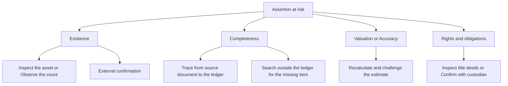
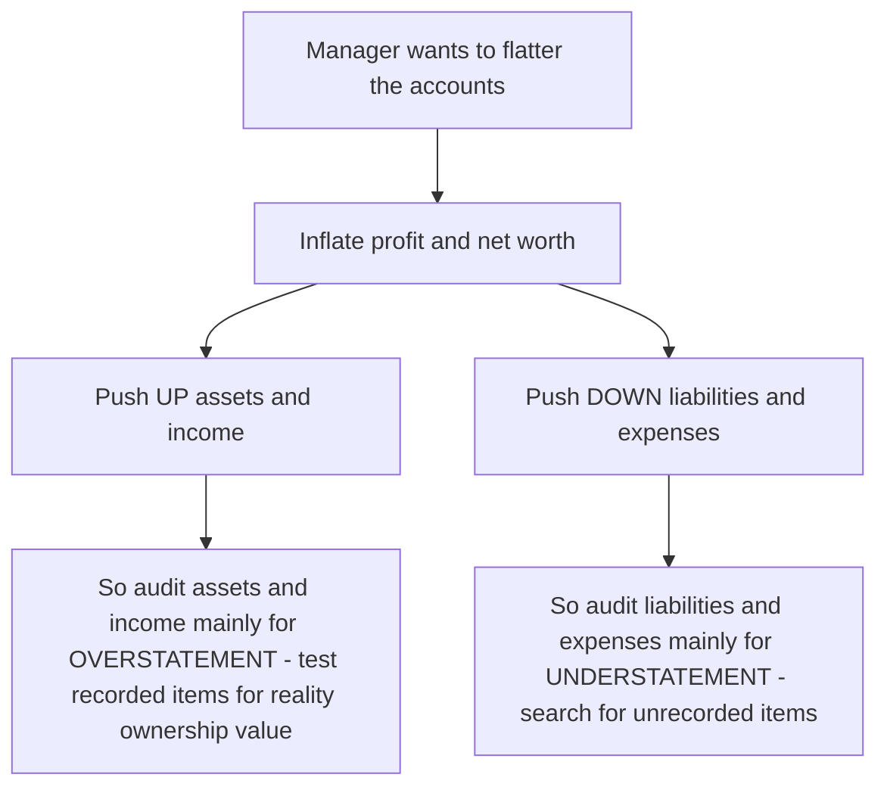
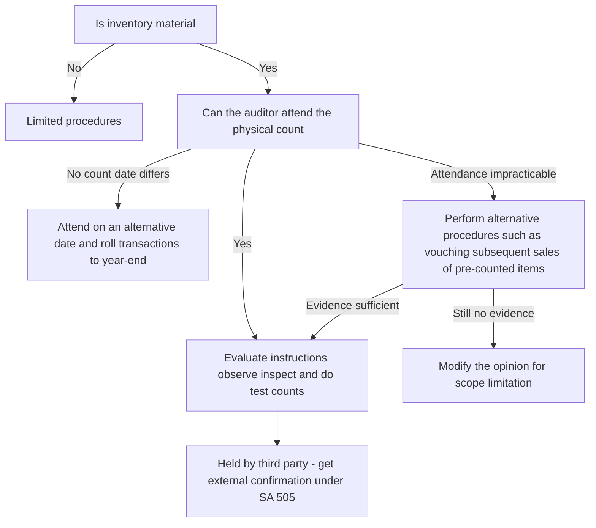
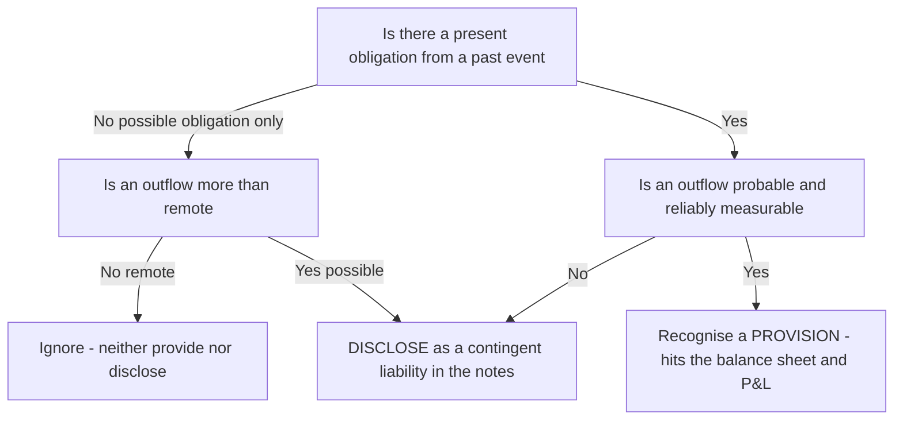
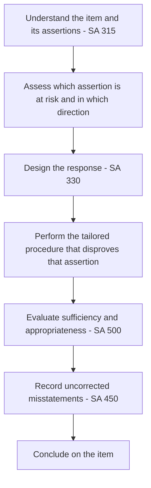

<!-- v2-deep -->

# Chapter 06 — Audit of Items of Financial Statements

## 1. The Problem — Why "audit the balance sheet line by line" is a trap unless you understand what is actually at risk

Return to the founding tension of this whole subject. The owners of a company (shareholders) hand their money to managers (directors) and then go away. The managers prepare a set of financial statements that say, in effect: *"Here is what we own, here is what we owe, and here is how much we earned for you."* The owners cannot walk into the warehouse and count the boxes, phone every customer to confirm the debt, or re-add every invoice. They are structurally blind. The auditor is the paid, independent expert who does the looking on their behalf and reports whether the statements can be trusted.

So far, so familiar. But here is the specific problem this chapter attacks: **the financial statements are not one claim — they are hundreds of separate claims, and each claim can be false in a *different* way.**

Consider two numbers on the same balance sheet:

- **Revenue ₹500 crore.** How does a dishonest manager distort *this*? Almost always by making it **bigger than reality** — recording sales that did not happen, or pulling next year's sales into this year — because bonuses, share prices and loan covenants all reward high revenue. The risk direction is **overstatement**.
- **Trade payables ₹80 crore.** How does a dishonest manager distort *this*? By making it **smaller than reality** — hiding invoices in a drawer, not recording goods received near year-end — because a smaller liability makes the company look healthier and profit look bigger. The risk direction is **understatement**.

If the auditor used the *same* procedure on both — say, "vouch a sample of recorded entries to supporting documents" — they would catch the revenue fraud (each recorded sale is tested for reality) but **completely miss the payables fraud** (you cannot vouch an invoice that was deliberately never entered). The recorded payables would all be genuine; the problem is the *missing* ones.

That single example is the entire reason this chapter exists. **You cannot audit every line item the same way, because every line item is exposed to a different lie.** The direction of the likely misstatement, the party motivated to commit it, and the evidence that can disprove it all change from one item to the next. A procedure that is powerful against one risk is blind to another.

The risk this chapter counters, then, is the risk of the **wrong-tool auditor** — the auditor who performs lots of activity but aims it in the wrong direction and gives a clean opinion over a materially misstated figure.

**A finer distinction the exam loves: "audit *for* overstatement" is not the same as "audit *only* recorded items."** When we say assets are audited for overstatement we mean the *primary* thrust; a secondary completeness angle always survives (an unrecorded receivable understates assets and is still a misstatement — just a rarer, less-incentivised one). The examiner rewards the candidate who names the *dominant* direction **and** acknowledges that the reverse direction, while lower risk, is not zero. The professional word for this is that risk is a matter of *degree and direction*, not a binary switch.

**Why "materiality" quietly decides how hard you look.** Two numbers exposed to the same lie do not deserve the same effort if one is ₹500 crore and the other ₹50,000. Under **SA 320 (Materiality)**, the auditor sets a threshold below which a misstatement could not influence a user's decision. Item audit inherits this: inventory at 60% of assets earns count attendance and roll-forwards; stationery stock does not. So the real planning question is a *product* — **"how likely is this item to be misstated (risk) × how much would it matter (materiality)?"** — and effort flows to the high-product items. A candidate who counts petty cash for three hours and never confirms a receivable has misread the product.

---

## 2. The Core Idea — Assertions are the bridge from "risk" to "procedure"

The tool that saves us is the concept of the **assertion**, drawn from **SA 315 (Identifying and Assessing the Risks of Material Misstatement)**. Every figure and disclosure in the financial statements is management making a bundle of implicit *representations*. When management writes "Inventory ₹40 crore," they are silently asserting:

- **Existence** — this inventory really is physically there.
- **Rights and obligations** — we actually own it (it is not held on consignment for someone else).
- **Completeness** — all inventory we own is included; nothing has been left out.
- **Valuation / Accuracy** — it is measured correctly (at lower of cost and net realisable value).
- **Presentation / Classification** — it is shown and disclosed properly (e.g., raw material vs finished goods, pledged stock flagged).

For transactions and events (like revenue and expenses) the assertion set is phrased slightly differently: **Occurrence, Completeness, Accuracy, Cut-off, Classification** (and Presentation).

**Learn the three families of assertions, because the exam expects you to name which family a figure belongs to before you list procedures:**

| Family | Applies to | Assertions | Mnemonic |
|--------|-----------|-----------|----------|
| **Classes of transactions & events** (P&L items over the period) | Revenue, purchases, expenses, payroll | Occurrence, Completeness, Accuracy, Cut-off, Classification, Presentation | *"OCCA-CP"* |
| **Account balances** (B/S items at the period-end) | PPE, inventory, receivables, payables, cash | Existence, Rights & obligations, Completeness, Valuation & allocation, Classification, Presentation | *"E-CROV-CP"* |
| **Presentation & disclosure** (the note-level story) | All notes, related-party disclosures, contingencies | Occurrence & rights, Completeness, Classification & understandability, Accuracy & valuation | — |

Why does this matter? Because a candidate who blurs "Occurrence" (a transaction word) with "Existence" (a balance word) signals they don't know which lens to hold up to a figure. **Existence answers "is this asset here at the reporting date?"; Occurrence answers "did this transaction actually happen during the period?"** A fictitious sale fails *Occurrence*; a ghost machine fails *Existence*. They rhyme, but the evidence differs — you inspect for Existence, you vouch to a dispatch record for Occurrence.

**The core idea of the whole chapter is a three-step chain, applied to every single line item:**

> **For this item, which assertion is most likely to be false, in which direction, because of whose motive? → That is the risk. → Choose the procedure that specifically can disprove *that* assertion.**

This is the disciplined form of our guiding law "no requirement before its reason." The "reason" for any verification procedure is *the assertion at risk*. Vouching proves Occurrence. Tracing proves Completeness. Physical inspection proves Existence. External confirmation proves Existence and Rights. Recomputation proves Accuracy and Valuation. Once you internalise which procedure attacks which assertion, you never again have to memorise a list of "audit steps for receivables" — you *derive* them.

**The seven procedure verbs and the assertion each attacks (SA 500 para A14–A25).** Memorise this; every "list the procedures" question is you selecting from these seven and *justifying* the pick by the assertion:

| Procedure verb | Direction of testing | Assertion it best proves | Why |
|----------------|---------------------|--------------------------|-----|
| **Inspection** (of records/assets) | — | Existence; supports Valuation | You see the thing or the document |
| **Observation** | — | Existence + effectiveness of a process | You watch it happen (e.g., the count) |
| **External confirmation** | — | Existence + Rights | Independent third party |
| **Recalculation** | — | Accuracy, Valuation | You redo the arithmetic |
| **Reperformance** | — | Whether a control worked | You re-run the client's control |
| **Analytical procedures** | — | Completeness, Accuracy (screening) | Relationships that should hold |
| **Inquiry** | — | Weak alone — *always corroborate* | People can lie |

The single most examined nuance here: **inquiry is never sufficient on its own.** SA 500 says inquiry alone does not provide sufficient appropriate evidence *or* evidence about the operating effectiveness of controls. So an answer that stops at "ask management" is worth few marks; you must pair inquiry with inspection, confirmation, or recomputation.

*Figure 1 — The assertion is the hinge between the risk and the procedure; you never jump straight from item to procedure.*

*Figure 1B — The seven procedure verbs mapped to the assertion each is strongest against; pick the verb by the assertion at risk, not by habit.*

---

## 3. Why it's built this way — The logic behind "tailored, direction-aware" procedures

Three structural facts about financial statements force the tailored approach.

**(a) Double-entry means every misstatement has a *motive-driven direction*.** Because assets and income sit on one side and liabilities and expenses on the other, inflating profit can be achieved by *overstating* the income/asset side **or** by *understating* the expense/liability side. Fraudsters pick whichever is easier to hide. So the auditor must ask, for each item, "if someone wanted to flatter the accounts, would they push this number up or down?" and aim the testing against that direction. This is why **assets and income are audited primarily for overstatement** (test what is recorded — is it real, is it owned, is it worth this much?) while **liabilities and expenses are audited primarily for understatement** (search for what is *missing* — unrecorded obligations).

**(b) The best evidence for one assertion is worthless for another.** Existence is a physical fact — so you inspect the physical thing (count the stock, see the machine). Completeness is the absence of something — so inspection is useless; you must *search* using an independent starting point (the goods-received records, the post-year-end payments, the bank statements). Valuation is a measurement judgement — so you recompute and challenge estimates. The evidence has to match the *nature* of the assertion. **SA 500 (Audit Evidence)** governs this: evidence must be *sufficient* (enough) and *appropriate* (relevant to the assertion + reliable in source), and reliability rises when evidence is external, independent, and obtained directly by the auditor.

**The SA 500 reliability hierarchy — memorise the ladder, because "which evidence is better" is a stock question:**

1. **Auditor's own direct knowledge** (e.g., the auditor personally counts the cash) — strongest.
2. **External evidence obtained directly** by the auditor (bank confirmation received in the auditor's office).
3. **External evidence held by the entity** (a supplier's invoice, a title deed in the client's file) — external in origin, but it passed through the client's hands.
4. **Internal evidence with effective controls** around it.
5. **Internal evidence with weak controls** (a photocopy, an oral statement) — weakest.

Two exam-critical riders: (i) **Original documents beat photocopies**; a photocopy can be doctored. (ii) **A document created by an independent outsider is more reliable *only if it reaches the auditor without passing through interested hands* — this is exactly why SA 505 insists the auditor, not the client, controls the confirmation mail.**

**Completeness is genuinely harder to audit than Existence — understand *why* to avoid the classic trap.** To test Existence you start from the *recorded* population and check each item is real; the population is finite and visible. To test Completeness you must prove that *nothing is missing* — but the missing items, by definition, are not in the records to sample from. You therefore cannot sample the ledger; you must find an *independent, complete population* that exists outside the ledger (the goods-received register, the bank statement, the post-year-end cash payments) and check every item in *it* was recorded. This asymmetry is the deep reason liabilities are harder to audit than assets, and why "search for unrecorded liabilities" is a distinct, named technique rather than "just confirm the balances."

**(c) Some assertions are so high-risk that the profession wrote dedicated Standards.** Where a particular assertion for a particular item is both material and historically abused, ICAI did not leave it to general principles — it issued a specific SA. Inventory existence and litigation → **SA 501**. Opening balances in a first audit → **SA 510**. Accounting estimates and provisions → **SA 540**. External confirmation of receivables/bank/payables → **SA 505**. Related party transactions → **SA 550**. Each of these is simply "a general risk that recurred so often it earned its own rulebook." We teach each one at the item where its risk bites.

**A deeper "why" — substantive procedures can never be skipped entirely (SA 330 para 18).** Even if controls test beautifully, SA 330 requires the auditor to perform substantive procedures for **each material class of transactions, account balance and disclosure**, because controls only *reduce* — never eliminate — the risk of management override, and management is precisely the party with the motive to misstate. This is why item audit exists at all even in a company with immaculate internal controls: controls can be *overridden by the very people who designed them*, and the balance-sheet items are where that override lands.

*Figure 2 — The direction of testing flips depending on which side of the balance sheet you are on, because the motive flips.*

---

## 4. Full Technical Content — Every item, its assertion at risk, and the procedure that answers it

Below, each item is treated the same disciplined way: **the risk → the assertion → the procedure → the "why".** SA references are given; where a number should be double-checked against current ICAI material it is flagged.

### 4.0 The governing Standards you carry into every item

| SA | What it gives you for item audit | The risk it addresses |
|----|----------------------------------|-----------------------|
| **SA 315** | Assertions; risk assessment; understanding entity & controls | You'd test blindly without knowing where misstatement is likely |
| **SA 320** | Materiality — how big a misstatement matters | Effort must scale to what would sway a user |
| **SA 330** | The auditor's *responses* to assessed risk — tests of controls and substantive procedures | Effort must be concentrated where risk is high |
| **SA 450** | Evaluation of misstatements identified during the audit | Individually small errors can aggregate to material |
| **SA 500** | Audit evidence — sufficient & appropriate; reliability hierarchy | Weak or irrelevant evidence gives false comfort |
| **SA 501** | Specific evidence — inventory count attendance, litigation, segment info | Inventory existence & contingent liabilities are chronically misstated |
| **SA 505** | External confirmations | Internal records can be manipulated; outsiders are independent |
| **SA 510** | Opening balances (initial engagements) | Closing balances are only right if openings were right |
| **SA 520** | Analytical procedures | Numbers that "don't move together" flag misstatement cheaply |
| **SA 530** | Audit sampling | You cannot test 100%; sample must represent the population |
| **SA 540** | Auditing accounting estimates (provisions, fair values, ECL, depreciation) | Estimates are the softest area for manipulation |
| **SA 550** | Related parties | Transactions with insiders may be non-genuine or unfairly priced |
| **SA 560** | Subsequent events | Conditions after year-end can change reported balances |
| **SA 570** | Going concern | Values assume the entity survives |
| **SA 580** | Written representations | Management's formal confirmations — corroborative, not a substitute for evidence |

Keep this table in your head; every sub-section below is just these Standards *pointed at one figure*.

**One caution on SA 580 that examiners test:** a written representation from management is *evidence of last resort* and **never a substitute for other audit evidence the auditor could reasonably expect to obtain.** If the auditor could confirm a receivable independently, "management said it's good" is not enough. Written reps corroborate; they do not originate.

---

### 4.1 Revenue (Sales of goods / rendering of services)

**The risk.** Revenue is the single most manipulated line in accounts. The motive is always to make it **bigger** (bonuses, valuations, covenants, listing pressure). Under **SA 240 (Auditor's Responsibilities Relating to Fraud)** there is a **rebuttable presumption that revenue recognition carries a risk of fraud** — the auditor must presume it unless they can justify otherwise. Recognition under **Ind AS 115 / AS 9** turns on transfer of control/risks-and-rewards, so the two favourite tricks are:

- **Fictitious sales** — invoices to fake or colluding customers → attacks **Occurrence**.
- **Cut-off manipulation** — recording next period's sales in this period (or vice versa) → attacks **Cut-off**.

**Assertion at risk:** primarily **Occurrence** and **Cut-off**; also **Accuracy** and **Completeness** (the last mainly in cash businesses where sales are *suppressed* to evade tax — note the direction reverses when the motive is tax evasion, not profit inflation).

**Procedures and their why:**

- **Vouch recorded sales to supporting documents** — trace sample invoices to the customer order, dispatch/delivery challan, gate outward register and the customer's acknowledgement. *Why:* proves the sale actually **occurred** and goods really left. A fictitious sale cannot produce an independent dispatch record.
- **Cut-off testing** — for the last few days before and first few days after year-end, match the date of dispatch (transfer of control) to the date the sale was booked. *Why:* directly tests **Cut-off**; catches sales pulled forward or pushed back.
- **Analytical procedures (SA 520)** — compare gross margin %, month-wise sales trend, sales returns *after* year-end. *Why:* a spike in late-year sales reversed by heavy post-year-end returns is the fingerprint of channel-stuffing.
- **Test credit notes / returns after year-end** — large returns just after closing suggest the original sale was not genuine.
- **Confirm unusual or year-end large customers** where doubt exists.
- **Review revenue recognition policy** against Ind AS 115's five-step model (identify contract → performance obligations → transaction price → allocate → recognise on satisfaction).

**The five-step model, as an audit checklist (Ind AS 115).** Examiners increasingly test whether you can *audit each step*, not just recite it:

1. **Identify the contract** — is there an enforceable agreement with commercial substance? *Audit:* inspect the contract; watch for side letters that grant secret return rights (these destroy revenue recognition).
2. **Identify performance obligations** — distinct goods/services. *Audit:* a bundled sale (goods + 2-year service) must be *unbundled*; booking the whole price upfront overstates current revenue.
3. **Determine transaction price** — including variable consideration (discounts, rebates, penalties). *Audit:* has variable consideration been estimated and *constrained*? Ignoring expected rebates overstates revenue.
4. **Allocate price to obligations** — on standalone selling prices. *Audit:* recompute the allocation.
5. **Recognise when (or as) the obligation is satisfied** — at a point in time (control transfers) or over time. *Audit:* the classic error is recognising point-in-time revenue before control passes (goods still in the seller's warehouse under "bill-and-hold").

**Edge case — bill-and-hold sales.** Customer is invoiced but goods stay with the seller. Revenue is recognisable *only if* strict conditions are met (the reason for the arrangement is substantive, goods are identified separately as the customer's, ready for physical transfer, and the seller cannot use or redirect them). *If the examiner tweaks it* so the goods are still commingled with the seller's own stock and could be shipped to anyone, revenue must **not** be recognised — this is a favourite trap.

**Edge case — principal vs agent.** If the entity is only an **agent** (e.g., a marketplace earning commission), it recognises the *net commission*, not the gross sale value. Grossing up agent revenue inflates the top line without touching profit — tests **Accuracy/Presentation**. Watch for it in e-commerce and travel-aggregator questions.

**Direction reversal you must flag — cash businesses.** In a jeweller, restaurant or petrol pump paid largely in cash, the motive flips to *suppressing* sales to evade tax. Here the assertion at risk is **Completeness** (understatement), and the procedure flips too — you now do analytical review of margins, reconcile stock movement to recorded sales, and scrutinise cash denials. The candidate who mechanically writes "revenue is audited for overstatement" without reading the *business context* loses the marks.

**Practical verification points:** ensure sales are recorded net of GST correctly; check that goods sent on **approval or consignment** are *not* recognised as sales (that is a Rights/Occurrence error); verify discounts and incentives are properly netted.

**Worked Example 4.1 — Cut-off manipulation, quantified.**
*Vega Ltd's draft revenue is ₹1,200 lakh and profit before tax ₹180 lakh. Testing the last five dispatches of the year against dispatch challans, the auditor finds:*

| Invoice | Booked on | Dispatch challan date | Amount (₹ lakh) | Cost of goods (₹ lakh) |
|---------|-----------|-----------------------|-----------------|------------------------|
| 9987 | 31-Mar | 02-Apr | 40 | 30 |
| 9988 | 31-Mar | 03-Apr | 25 | 19 |

*Control (per Ind AS 115) passes on dispatch. Both were dispatched in April but booked in March.*

**Reason it out.** Two sales worth ₹65 lakh were recorded a period early — a **Cut-off/Occurrence** overstatement. The revenue must be reversed to next year. But *reversing revenue alone is wrong* — the matching cost and the inventory must also move:

- Reverse revenue: ₹65 lakh out of this year's sales → corrected revenue **₹1,135 lakh**.
- The goods, dispatched in April, were **not the company's sales this year**, so cost of goods sold ₹49 lakh (30+19) must be reversed *out of COGS* and the ₹49 lakh of stock **added back to closing inventory**.
- Net profit effect = − revenue ₹65 + reinstated cost ₹49 = **− ₹16 lakh** on profit.
- Corrected PBT = 180 − 16 = **₹164 lakh**.

**Self-check:** The ₹16 lakh is exactly the *gross margin* on the two mis-booked sales (65 − 49). That is the whole trick of premature revenue: it pulls forward the *margin*. The overstatement (₹16 lakh) is ~8.9% of draft PBT — clearly material — so if management refuses to correct, the opinion is modified. Reconciles. ✓

---

### 4.2 Purchases and Expenses

**The risk.** Mirror image of revenue. To inflate profit, expenses are **understated** (omitted or deferred); to evade tax or siphon funds, expenses are **overstated** with fictitious or personal spending. Purchases feed both cost of sales and inventory, so an error here hits two statements.

**Assertion at risk:** for profit-inflation, **Completeness** (unrecorded expenses) and **Cut-off** (pushing expenses to next year); for fraud/siphoning, **Occurrence** (fictitious purchases, personal costs booked as business).

**Procedures and their why:**

- **Search for unrecorded liabilities / expenses** — examine payments made *after* year-end and un-entered supplier invoices to see if they relate to the year under audit. *Why:* the only way to test **Completeness** is to start from a source *outside* the ledger; you cannot vouch an expense that was never recorded.
- **Vouch recorded purchases/expenses** to purchase order, goods-received note (GRN), supplier invoice and payment. *Why:* tests **Occurrence** — that the expense is genuine, business-related and correctly priced.
- **Purchase cut-off** — match GRN dates to the period the purchase/creditor is booked. *Why:* goods received before year-end must appear in *both* purchases and closing inventory; omitting the invoice but counting the stock inflates profit.
- **Analytical review** of expense ratios and each expense head vs prior year and budget. *Why:* a sudden drop in an expense line can reveal deliberate omission; a spike can reveal fictitious or misclassified spend.
- **Scrutinise capital vs revenue classification** — a revenue expense capitalised inflates profit and assets. *Why:* tests **Classification**.

**The three-way match — the backbone control you are testing.** A genuine purchase leaves three independent documents that must agree: the **purchase order** (we ordered it), the **goods-received note** (we got it), and the **supplier invoice** (we were billed for it). A fictitious purchase almost always lacks one leg — usually the GRN, because no goods actually arrived. So when you vouch, you are really testing that all three legs exist and agree in quantity and price. *If the examiner tweaks it* so the invoice and PO exist but there is no GRN, suspect a **fictitious purchase** or a personal expense dressed as business.

**Edge case — capital vs revenue is bidirectional.** Candidates only remember "revenue expense wrongly capitalised inflates profit." The reverse also happens: a **capital item expensed** (to reduce taxable profit) *understates* both profit and the asset. Read the motive — tax-driven entities under-capitalise; profit-driven entities over-capitalise. Repairs vs improvement is the classic fault line: a routine repair is revenue; an expenditure that *increases future economic benefits beyond original assessed standard* (e.g., a new engine that extends useful life) is capital.

**Worked Example 4.2 — Search for unrecorded liabilities catches a hidden expense.**
*Orion Ltd, year-end 31 March. Draft profit ₹250 lakh. Reviewing the April cash book, the auditor sees these post-year-end payments to suppliers:*

| Paid in April | Supplier | Amount (₹ lakh) | GRN date | Already provided at 31-Mar? |
|---------------|----------|-----------------|----------|-----------------------------|
| 08-Apr | Freight Co | 12 | 28-Mar | No |
| 15-Apr | Repairs Ltd | 8 | 20-Apr | No |
| 20-Apr | Power Board | 6 | Mar bill | No (electricity for March) |

**Reason it out.** Test each against the *period of the underlying event*, not the payment date:

- **Freight ₹12 lakh** — service (goods received) on 28-Mar → relates to the audit year → **must be provided**. Unrecorded liability.
- **Repairs ₹8 lakh** — GRN 20-Apr → the repair happened *after* year-end → correctly *not* a 31-Mar liability. **Leave it out.**
- **Electricity ₹6 lakh** — consumption in March → relates to the audit year → **must be provided**.

Adjustment: understated liabilities = 12 + 6 = **₹18 lakh** (the ₹8 lakh April repair is *not* an error). Corrected profit = 250 − 18 = **₹232 lakh**.

**Self-check:** The trap was the ₹8 lakh April repair — a candidate who provides for *every* April payment over-adjusts and understates profit. The discipline is: the liability belongs to the year in which the *goods/services were received*, not when paid. The ₹18 lakh omission is 7.2% of draft profit — material. Reconciles. ✓

**Practical verification points:** check TDS is deducted where required (an omission signals unrecorded/unauthorised payments); verify related-party purchases (SA 550) are at arm's length; confirm prepaid and outstanding expenses are correctly split across periods.

---

### 4.3 Property, Plant and Equipment (PPE)

**The risk.** PPE is large and long-lived, so distortions are in *valuation and existence over time*: (i) an asset sold/scrapped but still on the books (**Existence** overstated), (ii) revenue expenses capitalised to boost profit (**Occurrence/Classification**), (iii) wrong depreciation or ignored impairment (**Valuation**), (iv) assets purchased but title unclear or the asset charged as security not disclosed (**Rights & Presentation**).

**Assertion at risk:** **Existence, Valuation, Rights and obligations, Completeness of additions/disposals.**

**Procedures and their why:**

- **Verify additions** to invoices, board approval, installation/commissioning evidence, and capitalisation of only directly attributable costs (per Ind AS 16 / AS 10). *Why:* tests **Occurrence** of additions and correct **Valuation** of cost — blocks revenue-to-capital manipulation.
- **Inspect physically** a sample of high-value assets / reconcile to the **fixed asset register**. *Why:* tests **Existence**; the register-to-floor and floor-to-register walk catches ghost assets and unrecorded disposals.
- **Recompute depreciation** — method, rate/useful life, consistency, and that it starts when the asset is ready for use. *Why:* tests **Valuation** (SA 540 — depreciation is an estimate).
- **Test disposals** — authorisation, sale proceeds, correct gain/loss, removal from register. *Why:* tests **Completeness** of disposals and prevents a sold asset lingering as an overstated asset.
- **Examine title deeds / RC books / ownership documents**; for immovable property, note the Companies Act (Schedule III) disclosure requiring whether **title deeds are held in the company's name**. *Why:* tests **Rights**.
- **Consider impairment (Ind AS 36 / AS 28)** — any indicators of decline. *Why:* tests **Valuation** for overstatement.
- **Check charges/mortgages** registered against assets and their disclosure. *Why:* **Presentation**.

**Two directions of the register walk — do not conflate them.** *Register-to-floor* (pick an asset from the fixed-asset register, go find it on the shop floor) tests **Existence** — it catches ghost assets still on the books. *Floor-to-register* (pick an asset you physically see, trace it into the register) tests **Completeness** — it catches assets in use but never capitalised (sometimes deliberately, to keep them off-book, or because a purchase was expensed). The exam rewards naming *both* directions and what each catches.

**Directly attributable cost — what goes into the ₹ figure (Ind AS 16).** Capitalise: purchase price (net of trade discount/rebate, incl. non-refundable duties), site preparation, delivery and handling, installation and assembly, professional fees, and the estimated cost of **dismantling/restoration** (a provision). **Exclude**: general administration and overheads, initial operating losses, training costs, and — critically — costs after the asset is *ready for use*. The classic tweak: management capitalises staff training or pre-operative losses to fatten the asset and defer expense; that overstates PPE and profit.

**Component accounting and depreciation start date.** Under Ind AS 16, significant components with different useful lives (e.g., aircraft engine vs airframe) are depreciated **separately**. Depreciation begins when the asset is **available for use** (in the location and condition intended by management) — *not* when it is first actually used. A plant sitting idle but ready still depreciates; deferring depreciation to "when we switch it on" overstates both PPE and profit.

**Worked Example 4.3 — Impairment of a machine (Ind AS 36).**
*Titan Ltd carries a CNC machine at cost ₹100 lakh, accumulated depreciation ₹40 lakh, so carrying amount ₹60 lakh. A newer model has made it semi-obsolete (impairment indicator). The auditor gathers: fair value less costs of disposal = ₹42 lakh; value in use (PV of future cash flows the machine will generate) = ₹48 lakh.*

**Reason it out.** An asset is carried at no more than its **recoverable amount = higher of (fair value less costs of disposal, value in use)**.

- Recoverable amount = higher of (42, 48) = **₹48 lakh**.
- Carrying amount ₹60 lakh > recoverable ₹48 lakh → **impairment loss = 60 − 48 = ₹12 lakh**.
- The machine is written down to ₹48 lakh; ₹12 lakh hits the P&L.

**Self-check — the two traps.** (1) Candidates wrongly use the *lower* of FVLCD and VIU — that would give ₹42 lakh and an overstated ₹18 lakh loss. It is the **higher**, because a rational owner would pursue whichever route (sell or use) yields more. (2) If VIU had been, say, ₹65 lakh (above carrying amount), there would be **no impairment** — you never write an asset *up* under the cost model merely because VIU exceeds carrying amount. Here recoverable ₹48 < carrying ₹60, so impair. Reconciles. ✓

*If the examiner tweaks it:* the machine is part of a larger production line that only generates cash *together* — then you cannot compute VIU for the machine alone; you test the whole **cash-generating unit (CGU)** for impairment and allocate any loss across the CGU's assets. Watch for the word "cannot generate cash independently."

**Practical verification points:** capital work-in-progress ageing (long-pending CWIP may signal stalled/impaired projects); leased assets classified correctly (Ind AS 116); revaluations supported by a competent valuer's report; where the **revaluation model** is used, the *whole class* must be revalued (not cherry-picked assets) and a downward revaluation below cost hits P&L unless it reverses a prior surplus.

---

### 4.4 Inventory — Existence via SA 501, plus Valuation

**The risk.** Inventory is the classic fraud vehicle because it sits at the intersection of the balance sheet *and* the profit calculation: **closing inventory ↑ ⇒ cost of sales ↓ ⇒ profit ↑.** So the pressure is to **overstate** it — either by claiming stock that isn't there (**Existence**), by ignoring obsolete/damaged stock and carrying it above realisable value (**Valuation**), or by counting third-party goods as your own (**Rights**).

**Understand the profit arithmetic that makes inventory so tempting.** Cost of goods sold = Opening stock + Purchases − **Closing stock**. Closing stock is *subtracted*, so every rupee added to it removes a rupee from COGS and adds a rupee to profit — with no cash moving and no third party to contradict you. That mechanical leverage, plus the fact that inventory is physically dispersed and hard to verify, is *why* it earned its own Standard.

**Assertion at risk:** **Existence** (headline), **Valuation**, **Rights**, **Completeness**, **Cut-off**.

**SA 501 — the dedicated Standard.** Because inventory existence is so material and abused, SA 501 requires the auditor, when inventory is material, to obtain sufficient appropriate evidence about its existence and condition by:

1. **Attending the physical inventory count** (unless impracticable) — to (a) evaluate management's counting *instructions and procedures*, (b) **observe** the count, (c) **inspect** the inventory, and (d) perform **test counts** (from floor to sheets = existence; from sheets to floor = completeness).
2. If the **count date differs** from the balance sheet date, perform procedures on the *intervening transactions* to roll the quantity forward/back.
3. If the auditor **cannot attend** (e.g., appointed after the count), perform or observe counts on an **alternative date** and reconcile.
4. If attendance is **impracticable**, perform **alternative procedures** (e.g., inspect documentation of subsequent sales of specific items counted before year-end); if even that is impossible, **modify the opinion** for a scope limitation.
5. For inventory held by **third parties** (in a warehouse/consignee), obtain **external confirmation (SA 505)** and/or inspect. *Why confirmation:* the goods are not on your premises, so an independent custodian's word is the relevant evidence for **Existence and Rights**.

**The two directions of test counts — the single most confused point in this chapter.**

- **Floor → sheets** (pick a physical item, find it on the count sheet): tests **Existence** — everything on the floor is recorded, but more importantly it lets you verify the recorded quantity matches reality. Really this direction, starting from *what exists*, protects against overstatement of what's on the sheets.
- **Sheets → floor** (pick a line on the count sheet, go find it physically): tests **Existence of recorded items** — that the sheet isn't padded with phantom stock.
- The **Completeness** direction is floor-to-sheet in the sense of ensuring items *physically present and owned* are all captured. The clean way to state it in an exam: *"selecting from the count records and inspecting the items tests existence of recorded inventory; selecting physical items and tracing to the records tests completeness of the records."* State the *purpose*, and you cannot be marked wrong.

**Perpetual/continuous inventory system — the alternative to a year-end count.** If the entity maintains well-controlled perpetual records with regular cycle counts throughout the year, the auditor may attend one of the periodic counts rather than a single year-end count, and rely on the reconciliations. *If the examiner tweaks it* so cycle-count differences are large and unexplained, the perpetual system is unreliable and a full year-end count becomes necessary.

*Figure 3 — SA 501 decision path for obtaining evidence over inventory existence.*

**Valuation procedures and their why:**

- **Recompute cost** using the entity's method (FIFO / weighted average — LIFO is not permitted) and compare cost to **net realisable value (NRV)**; inventory is carried at the **lower** (Ind AS 2 / AS 2). *Why:* tests **Valuation** for overstatement.
- **Test for obsolete, slow-moving, damaged stock** — ageing analysis, physical condition noted during the count. *Why:* prevents dead stock being carried at full cost.
- **Cut-off** — confirm goods received before year-end are *in* inventory and their creditor booked, and goods dispatched (sold) are *out*. *Why:* misaligned cut-off is the easiest way to shift profit.

**What "cost" includes and excludes (Ind AS 2 / AS 2).** Cost = purchase cost (net of trade discounts/rebates) + conversion costs (direct labour + systematic allocation of **fixed and variable production overheads** at *normal* capacity) + other costs to bring inventory to present location and condition. **Exclude:** abnormal waste, storage costs (unless necessary before a further production stage), administrative overheads unrelated to production, and selling costs. The classic tweak: management allocates fixed overhead at *actual* (low) capacity in a downturn, loading more overhead per unit onto stock to inflate closing inventory — Ind AS 2 requires allocation at **normal capacity**, so unabsorbed overhead is expensed, not capitalised into stock.

**Worked Example 4.4 — Lower of cost and NRV, item by item (the aggregation trap).**
*Helios Ltd values four inventory lines at year-end:*

| Item | Cost (₹ lakh) | Estimated selling price | Costs to complete + sell | NRV | Lower of cost/NRV |
|------|---------------|-------------------------|--------------------------|-----|-------------------|
| A | 50 | 70 | 8 | 62 | 50 |
| B | 40 | 45 | 9 | 36 | 36 |
| C | 30 | 55 | 5 | 50 | 30 |
| D | 20 | 18 | 4 | 14 | 14 |
| **Total** | **140** | | | **162** | **130** |

**Reason it out.** NRV = selling price − costs to complete and sell. Compare cost vs NRV **item by item** (Ind AS 2 requires the lower of cost and NRV to be applied to *each item*, not the total):

- A: cost 50 < NRV 62 → carry at **50**.
- B: NRV 36 < cost 40 → write down to **36** (loss ₹4).
- C: cost 30 < NRV 50 → carry at **30**.
- D: NRV 14 < cost 20 → write down to **14** (loss ₹6).
- Correct inventory value = 50 + 36 + 30 + 14 = **₹130 lakh**. Write-down = 140 − 130 = **₹10 lakh**.

**Self-check — the trap.** If you (wrongly) compared *total* cost ₹140 vs *total* NRV ₹162 and concluded "NRV exceeds cost, no write-down," you would carry inventory at ₹140 and *overstate profit by ₹10 lakh*. The healthy items (A, C) are **not** allowed to subsidise the loss-making items (B, D). Item-by-item is the rule; only for a group of *similar/related* items may they be grouped. The ₹10 lakh write-down reconciles exactly with the two loss items (4 + 6). ✓

**Practical verification points:** reconcile count sheets to the stock ledger and financial statements; verify inventory pledged as security is disclosed; check inclusion of goods in transit and exclusion of goods held on consignment for others; ensure **goods in transit purchased FOB shipping point** are included (title has passed) while goods sold and dispatched on FOB terms are excluded.

---

### 4.5 Trade Receivables — External confirmation (SA 505)

**The risk.** Receivables are overstated to inflate assets, or their recoverability is overstated by under-providing for bad debts. So two things can be wrong: the debt may **not exist / not be owed** (**Existence, Rights**), or it may exist but be **uncollectible and over-valued** (**Valuation**).

**Assertion at risk:** **Existence, Rights, Valuation (recoverability), Cut-off.**

**Procedures and their why:**

- **External confirmation (SA 505)** — the flagship procedure. Write to a sample of customers asking them to confirm the balance owed *directly to the auditor*. *Why:* the customer is **independent** of the client; their confirmation is far more reliable (SA 500 hierarchy) than the client's own ledger, and it directly proves **Existence and Rights**. Use **positive confirmations** (reply whether they agree or not) for material/risky balances; **negative confirmations** (reply only if they disagree) only for many small, low-risk balances with good controls. **The auditor must control the process** — send and receive replies directly, keeping the client's hands off. If management **refuses to allow** a confirmation, evaluate the validity of the reason, perform **alternative procedures**, and if the refusal is unreasonable treat it as a **scope limitation** and consider communicating with those charged with governance.
- **Alternative procedures when no reply** — inspect **subsequent receipts** (cash received after year-end against the specific invoice), or examine sales invoice + dispatch + customer order. *Why:* subsequent collection is powerful evidence the debt was **real and recoverable**.
- **Test the provision for doubtful debts / expected credit loss (SA 540)** — **age the receivables**, review balances long overdue, disputed accounts, and post-year-end recoveries. *Why:* tests **Valuation** for overstatement.
- **Cut-off** — tie the last sales to the receivable balance.

**Positive vs negative confirmation — the decision, deepened.** A **positive** confirmation asks the debtor to reply *in every case* (whether they agree or dispute) — reliable, because silence is not treated as agreement. A **negative** confirmation asks the debtor to reply *only if they disagree* — cheaper, but weak, because you cannot tell whether a non-reply means "I agree" or "I never received the letter." SA 505 permits negative confirmations **only if all four conditions hold**: (i) risk of material misstatement is **low**; (ii) a **large number of small, homogeneous** balances; (iii) a **very low exception rate** is expected; and (iv) no reason to expect recipients will **disregard** the request. Miss any one and you must use positive. *If the examiner asks "can we use negative confirmations for the top 10 debtors?"* — no, those are material, so positive is required.

**The "blank" positive confirmation — a finer variant.** A blank confirmation asks the debtor to *fill in the amount* they owe (rather than confirming a stated figure). It gives stronger evidence (the debtor cannot lazily tick "agree") but yields lower response rates. Examiners test whether you know the trade-off.

**Non-response is not failure — you have a ladder.** For every positive confirmation that comes back unanswered, do **alternative procedures**: (i) inspect **subsequent receipts** matched to the specific invoice (strongest — cash in the bank proves the debt was real and good); (ii) examine the **shipping documents + sales invoice + customer order** (proves the sale occurred); (iii) inspect **subsequent correspondence**. Only if alternatives *also* fail do you treat the balance as potentially misstated.

**Worked Example 4.5 — Expected credit loss / provision adequacy.**
*Nimbus Ltd's receivables ageing at 31 March, with management's provision:*

| Ageing bucket | Gross (₹ lakh) | Historical loss rate | Required provision |
|---------------|----------------|----------------------|--------------------|
| 0–90 days | 400 | 1% | 4 |
| 91–180 days | 150 | 5% | 7.5 |
| 181–365 days | 80 | 20% | 16 |
| Over 365 days | 40 | 60% | 24 |
| **Total** | **670** | | **51.5** |

*Management has provided only ₹20 lakh. Additionally, one debtor in the 0–90 bucket, Comet Traders (₹30 lakh), has become insolvent after year-end (an adjusting subsequent event, SA 560) with expected recovery of ₹5 lakh.*

**Reason it out.** Two layers. First, the **model-based ECL** on the ageing = ₹51.5 lakh. Second, the **specific** impairment: Comet Traders sits in the 0–90 bucket (only ₹0.3 lakh general provision), but its insolvency is a *specific* known loss — expected loss ₹30 − ₹5 = ₹25 lakh. To avoid double counting, remove Comet's ₹30 lakh from the 0–90 general bucket and provide for it specifically:

- Revised 0–90 gross = 400 − 30 = 370 → provision 1% = ₹3.7 lakh.
- Specific provision for Comet = ₹25 lakh.
- Total required = 3.7 + 7.5 + 16 + 24 + 25 = **₹76.2 lakh**.
- Management provided ₹20 lakh → **shortfall = ₹56.2 lakh** understatement of the provision (overstatement of profit and assets).

**Self-check.** The insolvency crystallised *after* year-end but relates to a *condition existing at* year-end (the debtor's deteriorating finances) → it is an **adjusting event** under SA 560, so the balance sheet must reflect it. A candidate who treats it as non-adjusting (mere disclosure) understates the provision by ₹25 lakh. Also note the double-count guard: Comet's amount was pulled out of the general bucket before adding the specific provision, otherwise we'd provide twice. Reconciles. ✓

**Practical verification points:** watch for credit balances in receivables (should be reclassified to payables/advances, not netted); scrutinise related-party receivables (SA 550) which may be non-genuine or evergreen; review the reasonableness of the ECL model assumptions; be alert to **teeming and lading** — where a later customer's receipt is used to cover an earlier misappropriation, so individual balances confirm but the *ageing* looks odd.

---

### 4.6 Investments

**The risk.** Overstatement of value (carrying an investment above its fair/recoverable amount), and existence/ownership (does the security exist and is it in the company's name and unencumbered?).

**Assertion at risk:** **Existence, Rights, Valuation, Presentation (classification current vs non-current).**

**Procedures and their why:**

- **Physical inspection of securities** in hand, or **confirmation from the depository / custodian (SA 505)** for demat holdings, and inspection of the DP statement. *Why:* independent custodian evidence proves **Existence and Rights**; you cannot rely on the client's own list alone.
- **Verify valuation** per the applicable framework — fair value through P&L / OCI or cost, per Ind AS 109 / AS 13 — using quoted prices, or for unquoted, the valuation basis and any impairment. *Why:* tests **Valuation**; unquoted investments are estimate-heavy (SA 540).
- **Check classification** — held for trading vs long-term; current vs non-current. *Why:* **Presentation**.
- **Verify income** (dividend/interest) is completely and correctly accrued, and that purchases/sales are authorised.
- **Confirm charges/liens** — investments pledged must be disclosed. *Why:* **Rights/Presentation**.

**Fair-value hierarchy — where the manipulation hides (Ind AS 113).** Level 1 = quoted prices in active markets (hardest to fudge — you just look up the price). Level 2 = observable inputs other than quoted prices. **Level 3 = unobservable inputs** (management's own model) — this is where valuation risk concentrates and where SA 540 bites hardest. For a Level 3 unquoted investment, the auditor challenges the model, the discount rate, and the cash-flow assumptions, and may use an **auditor's expert (SA 620)**. The examiner tweak: an unquoted subsidiary carried at cost despite clear evidence of erosion in net worth → impairment ignored → overstatement.

**Classic AS 13 (non-Ind-AS entities) rule worth carrying:** *long-term* investments are carried at cost and written down only for a decline that is **other than temporary**; *current* investments are carried at **lower of cost and fair value**. Misclassifying a temporarily-fallen current investment as long-term to avoid the write-down is a **Presentation + Valuation** manipulation.

---

### 4.7 Cash and Bank Balances

**The risk.** Cash is the most *liquid* and therefore most *misappropriable* asset — but its financial-statement balance is usually small, so the audit concern splits: **existence of the reported balance** (especially bank) and **fraud/defalcation** in the flows. Classic tricks are **teeming and lading** (lapping) and **window dressing** (temporary year-end inflation of the bank balance).

**Assertion at risk:** **Existence, Completeness, Rights, Cut-off.**

**Procedures and their why:**

- **Bank balance confirmation (SA 505)** — obtain the balance, and details of overdrafts, loans, liens, guarantees and unused facilities *directly from the bank*. *Why:* independent, and covers not just the balance but hidden liabilities and charges.
- **Bank reconciliation review** — examine the year-end BRR; investigate **stale/long-outstanding cheques** issued (may indicate a liability that should be reinstated) and **cheques deposited but not cleared** for a suspiciously long time (window dressing). *Why:* tests **Existence and Cut-off**; reconciling items are where manipulation hides.
- **Cash count** at year-end (or surprise), reconciled to the cash book. *Why:* tests **Existence** of physical cash and deters defalcation.
- **Cut-off of receipts and payments** around year-end. *Why:* to catch cheques recorded as paid (reducing creditors) but not actually issued, or receipts held back.

**Teeming and lading vs window dressing — know the mechanism, not just the label.** *Teeming and lading* (lapping) is an **ongoing cash defalcation**: an employee steals customer A's payment, then covers the hole later using customer B's payment, then C's covers B's, and so on — the shortfall is rolled forward indefinitely. It attacks the *completeness of recorded receipts* and is detected by confirming balances, matching pay-in slips to ledger dates, and looking for a lag between receipt and posting. *Window dressing* is a **year-end-only cosmetic** exercise: e.g., record cheques as *issued* to creditors on 31 March but hold them physically until April (understating both cash and payables to improve the current ratio), or deposit a related party's cheque on 31 March that bounces in April. It attacks **Cut-off/Presentation**. One is theft; the other is *lying about the picture* on one day.

**The cut-off manipulation on payments — worked mechanically.** Suppose the current ratio is 1.4 (CA ₹140, CL ₹100). Management writes cheques for ₹40 to creditors on 31 March but does not release them. If recorded, cash falls to ₹100 and creditors to ₹60: current ratio = 100/60 = **1.67**. A cosmetic jump with no economic substance. The auditor catches it by examining whether cheques recorded as paid were *actually dispatched* before year-end — an undelivered cheque is not a payment; the liability still exists.

**Practical verification points:** verify large round-sum transfers just before year-end reversed just after (window dressing); confirm fixed deposits and their liens; ensure balances with banks having negative balances are shown as borrowings, not netted; for **cash on hand**, prefer a *surprise* count and obtain a written acknowledgement from the cashier that the cash was returned intact.

---

### 4.8 Borrowings (Loans and other financial liabilities)

**The risk.** Unlike assets, the primary risk on liabilities is **understatement / omission** — but borrowings are also a *disclosure* minefield (security, terms, defaults, related-party loans) and a **going-concern** signal.

**Assertion at risk:** **Completeness (headline), Accuracy, Rights & obligations, Presentation/Classification, Cut-off (accrued interest).**

**Procedures and their why:**

- **Confirm balances directly with lenders / banks (SA 505)** and reconcile to the loan account. *Why:* independent proof of the amount owed; also surfaces **undisclosed** facilities → **Completeness**.
- **Examine loan agreements** — principal, interest rate, security/charge, repayment schedule, covenants. *Why:* tests **Accuracy** and enables correct **Presentation**.
- **Verify creation and registration of charges** with the Registrar of Companies (Companies Act requires charges to be registered) and their disclosure. *Why:* **Presentation/Rights**.
- **Recompute interest** and confirm accrued interest is provided at year-end. *Why:* tests **Cut-off/Accuracy**; unrecorded interest understates both liability and expense.
- **Classify current vs non-current** correctly, especially where a **covenant breach** makes a long-term loan repayable on demand (reclassify to current). *Why:* **Presentation** — and a trigger for **going-concern (SA 570)** evaluation.
- **Check defaults** in repayment of principal/interest for the Schedule III / CARO disclosure.

**The covenant-breach reclassification — a favourite examiner tweak.** If a long-term loan's covenant is breached at the reporting date such that the lender *can demand* immediate repayment, the loan is **current** even though its original tenure is years — *unless* the lender grants a waiver **on or before the reporting date** for at least twelve months. A waiver obtained *after* year-end does **not** save the classification (the right to demand existed at year-end). This cascades: a large reclassification from non-current to current can flip working capital negative and trigger a **going-concern** doubt. *If the examiner tweaks it* to "waiver received on 5 April" — still current at 31 March.

**Worked Example 4.8 — Accrued interest cut-off.**
*Pulsar Ltd took a ₹600 lakh term loan on 1 October at 12% p.a., interest payable half-yearly on 1 April and 1 October. At 31 March, management has recorded no interest because "the first payment is due on 1 April."*

**Reason it out.** Interest **accrues with time**, not with payment. From 1 October to 31 March is 6 months. Accrued interest = 600 × 12% × 6/12 = **₹36 lakh**. This must be provided at year-end as a liability (interest accrued but not due) and charged to P&L.

**Self-check.** Omitting it understates **liabilities by ₹36 lakh** and **overstates profit by ₹36 lakh** — a two-sided error. The "payment due 1 April" argument confuses *due date* with *accrual*; the accrual assertion (**Cut-off/Completeness**) is what's at risk. Also note the ₹36 lakh appears as *interest accrued but not due* (a current liability), distinct from *interest accrued and due*. Reconciles. ✓

---

### 4.9 Trade Payables

**The risk.** The signature liability risk: **understatement through omission** — invoices deliberately or accidentally left unrecorded to lower liabilities and raise profit. Because vouching only tests *recorded* items, it is blind here; the audit must *search for the missing*.

**Assertion at risk:** **Completeness (headline), Existence, Cut-off, Accuracy, Presentation.**

**Procedures and their why:**

- **Search for unrecorded liabilities** — review payments made *after* year-end, unmatched GRNs, supplier statements, and un-entered invoices; ask whether each relates to the audit period. *Why:* the *only* technique that finds an *omitted* creditor — it starts outside the ledger, so it can catch what the ledger doesn't show. This is the direct answer to the Completeness risk.
- **Reconcile supplier statements** to the payables ledger and investigate differences. *Why:* the supplier's statement is external evidence (SA 500) exposing balances the client under-recorded.
- **Confirm balances (SA 505)** — but note the twist: because the risk is *understatement*, don't just confirm large recorded balances; **confirm accounts with *small or nil* recorded balances but high purchase activity** (a major supplier suddenly showing near-zero owed is the red flag). *Why:* tailoring the sample to the *direction* of the risk.
- **Purchase cut-off** — goods received before year-end must have the payable booked. *Why:* **Cut-off/Completeness**.
- **Disclose Micro & Small Enterprise (MSME) dues** per the MSMED Act / Schedule III. *Why:* **Presentation** requirement with penalties.

**Why we confirm payables *differently* from receivables — the deep point.** For receivables (overstatement risk) we confirm the *large* balances, because that's where an overstatement would be biggest. For payables (understatement risk) confirming large recorded balances is nearly pointless — a *recorded* large creditor is unlikely to be the problem; the problem is the creditor who *should* be large but is recorded as small or zero. So the sampling logic **inverts with the risk direction**: for payables, weight the sample toward **high-activity suppliers with low or nil recorded balances**, plus a selection of *prior-year* creditors now showing zero. This single idea — *the sample must be chosen for the direction of the lie* — is the chapter's signature exam discriminator.

**MSME disclosure — the specifics.** Under the MSMED Act read with Schedule III, a company must disclose the principal and **interest** due to micro and small enterprises, interest paid, interest accrued and remaining unpaid. Because interest on delayed MSME payments accrues *by law* (and is disallowed for tax if unpaid), omitting it is both a disclosure failure and an **unrecorded liability** — a favourite CARO/Schedule III tweak.

---

### 4.10 Provisions and Contingent Liabilities — SA 540 and SA 501

**The risk.** Provisions are **estimates**, so they are the softest area for manipulation in either direction: **under-provide** to inflate profit (understate the liability), or **over-provide / create "cookie-jar" reserves** in good years to release in bad years (profit smoothing). Contingent liabilities (litigation, guarantees) are typically **understated / not disclosed** because they are unwelcome.

**Assertion at risk:** **Completeness, Valuation/Accuracy, Presentation.**

**The Ind AS 37 / AS 29 decision spine — memorise it, because every provision question is a walk down this tree.** A **provision** is recognised only when *all three* hold: (i) a **present obligation** (legal or constructive) from a **past event**; (ii) an **outflow of resources is probable** (more likely than not, i.e., > 50%); and (iii) the amount can be **reliably estimated**. If the outflow is only **possible** (not probable) or cannot be reliably measured, it is a **contingent liability — disclose, do not provide**. If the possibility is **remote**, do **nothing** (neither provide nor disclose).

*Figure 5 — The provide / disclose / ignore decision for an obligation, which every contingent-liability question walks down.*

**Procedures and their why (SA 540 for estimates):**

- **Understand how management makes the estimate** — the method, assumptions and data — and evaluate whether they are reasonable and consistent (Ind AS 37 / AS 29: recognise a provision when there is a *present obligation from a past event, probable outflow, reliable estimate*). *Why:* tests **Valuation** at its source.
- **Test the data and recompute**; develop an independent estimate or range to challenge management. *Why:* independent challenge counters management bias.
- **Review subsequent events (SA 560)** — outcomes after year-end (e.g., a court ruling, an actual bad-debt) that confirm or revise the estimate. *Why:* the best evidence of a year-end estimate is often what actually happened just after.
- **For litigation and claims (SA 501)** — inquire of management, **review board minutes and legal expense accounts**, and seek **direct communication with the entity's legal counsel/lawyers** where risk exists. *Why:* the lawyer is the independent expert on the likely outcome; management alone is not reliable on obligations it would rather hide.
- **Evaluate presentation** — provide (probable) vs disclose (possible) vs ignore (remote). *Why:* correct **Presentation** is the whole point of contingent-liability accounting.

**SA 540 — "management bias" is the thing you are hunting.** Estimates have a range of acceptable outcomes; the risk is not a single "wrong number" but a *pattern* of management always landing at the end of the range that flatters profit. The auditor looks for **indicators of bias**: estimates clustered at the favourable extreme, a prior-year estimate that turned out conveniently wrong in the company's favour, changes in method with no change in circumstances. Developing an **independent point estimate or range** and comparing it to management's is the core response.

**Onerous contracts and warranties — two provision types examiners like.** A **warranty provision** is estimated from historical claim rates × sales (a measurable, probable obligation → provide). An **onerous contract** (unavoidable costs of meeting the obligations exceed the expected benefits) requires a provision for the *lower* of the cost to fulfil and the penalty to exit. *If the examiner tweaks it:* a mere expectation of *future operating losses* is **not** provided for (there is no present obligation from a past event) — a classic trap where students wrongly provide for anticipated losses.

**Worked Example 4.10 — Warranty provision and the "expected value" method.**
*Cepheus Ltd sold 10,000 units this year, each with a one-year warranty. Past experience: 80% of units have no defect, 15% have minor defects costing ₹200 each to fix, 5% have major defects costing ₹1,000 each. Management provided a flat ₹50,000.*

**Reason it out.** For a large population, Ind AS 37 uses the **expected value** (probability-weighted) method:

- Per-unit expected cost = (0.80 × ₹0) + (0.15 × ₹200) + (0.05 × ₹1,000) = 0 + 30 + 50 = **₹80 per unit**.
- Total provision = 10,000 × ₹80 = **₹8,00,000**.
- Management's ₹50,000 **understates the provision by ₹7,50,000**, overstating profit by the same.

**Self-check.** A candidate who uses the *most likely* outcome (80% → no defect → ₹0 provision) is wrong: the most-likely method is for a *single* obligation, whereas a *large population* of warranties uses expected value. The ₹80/unit blends all three outcomes by probability. Reconciles. ✓ *If the examiner tweaks it* to a **single** large lawsuit (not a population), you would instead use the *single most likely outcome*, not a probability-weighted blend.

---

### 4.11 Equity / Share Capital and Reserves

**The risk.** Lower fraud risk but high on **compliance, authorisation and disclosure**: was capital properly issued and authorised, are movements (bonus, buy-back, dividends) lawful under the Companies Act, are reserves correctly classified and restricted amounts (e.g., securities premium, CSR) used only for permitted purposes?

**Assertion at risk:** **Occurrence/Rights (validity of the transaction), Accuracy, Presentation, Completeness of disclosure.**

**Procedures and their why:**

- **Verify share capital movements** to **board and shareholder resolutions**, the Memorandum/Articles, ROC filings (allotment returns), and reconcile to the **register of members**. *Why:* tests that issues/allotments actually **occurred** and were **authorised**.
- **Check statutory compliance** for buy-back (Sec 68), bonus issue, further issue (Sec 62 rights/preferential), reduction of capital — each has Companies Act conditions. *Why:* an unlawful movement is a reportable non-compliance.
- **Verify utilisation of securities premium** only for purposes permitted by the Act. *Why:* **Presentation/legal restriction**.
- **Verify dividends** — declared per Sec 123 out of profits, transferred to the correct bank account within the statutory time, unpaid dividend moved to the Investor Education and Protection Fund where due. *Why:* compliance + **Completeness** of the unpaid-dividend liability.
- **Reconcile reserves movements** — reserves are the accumulation of profits, so tie the movement to the profit for the year, OCI items, and appropriations. *Why:* **Accuracy/Completeness**.

**Securities premium — the permitted-use list (Sec 52).** The securities premium account may be applied only for: issuing **fully paid bonus shares**, writing off **preliminary expenses**, writing off **share/debenture issue expenses, commission or discount**, providing for the **premium on redemption** of redeemable preference shares or debentures, and **buy-back** under Sec 68. Using premium for anything else (e.g., paying a cash dividend) is unlawful. Examiners tuck a disallowed use into a reserves-movement question.

**Dividend mechanics worth carrying (Sec 123).** Dividend is declared out of current profits (after providing depreciation) or accumulated profits, or both; the amount of declared dividend must be **deposited in a separate bank account within 5 days**; unpaid/unclaimed dividend goes to a **special "Unpaid Dividend Account" within 30 days** of non-payment, and amounts unclaimed for **7 years** transfer to the **IEPF** (along with the underlying shares). The auditor checks each timeline — a failure is both a compliance breach and an **unrecorded liability** to depositors.

---

## 5. Applied Scenarios — reasoning from situation to the correct audit response

### Scenario A — The suspicious late-year sales spike
*During the audit of Zenith Ltd, revenue in March is 40% higher than any other month, gross margin is unusually high, and in the first three weeks of April there is an abnormally large volume of sales returns from the same customers.*

**Reason it out.** The assertion under threat is **Occurrence/Cut-off** — the pattern (late-year spike + immediate post-year-end returns) is textbook **channel-stuffing** to inflate revenue, and SA 240's presumed fraud risk in revenue is squarely engaged. **Response:** perform detailed **cut-off testing** on March dispatches (match transfer of control dates to booking dates); **vouch** the spike-month sales to dispatch and independent customer acknowledgement; **examine the April credit notes** and link them to March invoices; obtain **external confirmations (SA 505)** from the customers who both bought heavily in March and returned in April. If the sales lacked genuine transfer of control, they must be reversed; if management refuses, consider a **modified opinion** and report the fraud risk to those charged with governance under SA 240/SA 260.

### Scenario B — Auditor appointed after the stock count
*Meridian Ltd's inventory is 60% of total assets. The auditor was appointed in May, after the 31 March physical count, which they therefore did not attend.*

**Reason it out.** The at-risk assertion is **Existence** of a highly material inventory, and **SA 501** requires count attendance where inventory is material. Since attendance on the count date is impossible, the auditor moves down the SA 501 ladder: (i) **attend a count on an alternative date** and **roll back** the movements between that date and 31 March to reconstruct the year-end quantity; and/or (ii) perform **alternative procedures** — e.g., inspect records of **subsequent sales** of specific items that were in the 31 March stock, review the count instructions and internal control over the original count, and reconcile count sheets to the ledger. If sufficient appropriate evidence *can* be obtained this way, the opinion is unmodified; if inventory existence **cannot** be verified by any means, this is a **scope limitation** → **qualified or disclaimer of opinion** depending on materiality and pervasiveness.

### Scenario C — The oddly small creditor
*In auditing Apex Ltd's trade payables, the auditor notices that Supplier X — from whom Apex bought ₹30 crore of raw material during the year — shows a closing balance of only ₹15,000, while smaller suppliers show larger balances.*

**Reason it out.** The direction-aware auditor knows payables are audited for **understatement/Completeness**. A near-nil balance on a high-activity supplier screams *unrecorded invoices*. **Response:** send a **positive external confirmation (SA 505) to Supplier X** (precisely the low-recorded/high-activity account the risk direction demands), **reconcile Supplier X's statement** to the ledger, and perform a **search for unrecorded liabilities** — examine April payments to Supplier X and unmatched GRNs to see if March-received goods were left unbooked. If invoices relating to the audit year were omitted, payables and purchases are both understated and profit overstated; the entries must be corrected.

### Scenario D — The under-provided lawsuit
*Nova Ltd faces a ₹20 crore product-liability suit. Management has made no provision and disclosed nothing, saying they "expect to win."*

**Reason it out.** Contingent liabilities are estimate-driven and typically **understated** (assertions: **Completeness of disclosure, Valuation**). Under **SA 540 + SA 501**, management's own optimism is not sufficient evidence. **Response:** review **board minutes and legal-expense ledgers** for the dispute, and obtain **direct written communication from Nova's external legal counsel** on the probable outcome and range of loss. Apply Ind AS 37: if outflow is **probable** and estimable → a **provision** must be recognised; if only **possible** → **disclose** as a contingent liability; only if **remote** may it be ignored. Also review **subsequent events (SA 560)** up to the audit report date. If management refuses to provide/disclose appropriately, it is a misstatement → **modify the opinion**.

### Scenario E — The revaluation that only went one way
*Sirius Ltd owns land (cost ₹200 lakh) and a building (cost ₹150 lakh, in the same class). Management adopts the revaluation model and revalues the land up to ₹320 lakh (surplus ₹120 lakh to OCI) but leaves the building at cost, saying "the building's fair value is uncertain."*

**Reason it out.** The at-risk assertions are **Valuation** and **Presentation**. Under Ind AS 16, if the revaluation model is adopted, **the entire class of PPE must be revalued** — you cannot cherry-pick the asset that has appreciated and leave the depreciated one at cost, because that produces a mixture of dated costs and current values in the same class (selective revaluation is prohibited to prevent exactly this cosmetic uplift). **Response:** require the building to be revalued too (obtaining a competent independent valuer's report, SA 620), verify the surplus is routed through OCI to a **revaluation reserve** (not P&L), and check that future depreciation is charged on the *revalued* amount. If management refuses to revalue the whole class, the revaluation is non-compliant → misstatement → consider modifying the opinion.

### Scenario F — Window dressing the current ratio
*Comet Ltd has a loan covenant requiring a current ratio of at least 1.5. At 31 March the draft current ratio is 1.45. On 30 March, management (a) recorded cheques of ₹50 lakh as issued to creditors but did not dispatch them until 10 April, and (b) obtained a ₹40 lakh short-term deposit from a director, banked on 31 March and repaid 4 April.*

**Reason it out.** Both moves are **window dressing** — cosmetic Cut-off/Presentation manipulation to clear the covenant on one day. **(a)** An undispatched cheque is **not** a payment; the creditor still exists at year-end, so reversing it restores both cash and payables. **(b)** A deposit taken on 31 March and repaid days later has no commercial substance and, being from a **related party (SA 550)**, needs scrutiny and disclosure; it should not be allowed to inflate the year-end cash. **Response:** examine whether recorded cheque payments were actually dispatched before year-end; trace the director's deposit and its immediate repayment; recompute the current ratio *after* reversing both. If the true ratio is below 1.5, the covenant is breached → the loan may be **repayable on demand → reclassify to current → potential going-concern (SA 570) issue**. If management resists correcting the accounts, modify the opinion.

---

## 6. Procedure / Documentation Summary

For every item, the working papers must evidence the assertion-to-procedure logic (SA 230 Documentation):

- **Lead schedule** per item, agreeing to the trial balance and prior year, with analytical comparison.
- **Risk & assertion note** — which assertion is at risk, direction, and the planned response (links SA 315 → SA 330).
- **Evidence of the tailored procedure** — confirmation control logs and replies (SA 505); inventory count attendance memo, test-count sheets and roll-forward (SA 501); recomputation of depreciation/interest/valuations; cut-off test sheets; search-for-unrecorded-liabilities schedule; estimate-challenge and independent range (SA 540); legal-counsel replies.
- **Sampling basis** (SA 530) — population, method, sample size, results, and treatment of exceptions.
- **Conclusion memo** per item — assertion by assertion — and any uncorrected misstatements carried to the SA 450 evaluation.

**How individually-immaterial errors become material — the SA 450 aggregation you must show.** Item audit throws up many small misstatements; SA 450 requires the auditor to **accumulate** all misstatements above a trivial threshold and evaluate them *in aggregate* against materiality — both individually and combined. A worked illustration: if cut-off overstated profit ₹16 lakh (Ex 4.1), unrecorded expenses ₹18 lakh (Ex 4.2), inventory over-valuation ₹10 lakh (Ex 4.4) and an under-provision ₹56 lakh (Ex 4.5), the *aggregate* overstatement of profit is **₹100 lakh** even though the auditor must also consider each on its own. The auditor communicates all accumulated misstatements to management, requests correction, and — for those uncorrected — assesses whether the aggregate is material to the opinion. A candidate who fixes each error in isolation but never *sums* them misses the SA 450 point.

*Figure 4 — The generic item-audit workflow that repeats for every line, only the tailored procedure box changes.*

---

## 7. Connections

- **To the risk model (SA 315/330):** item audit is just risk assessment and response applied figure by figure. The assertion is the shared vocabulary.
- **To fraud (SA 240):** the direction-of-risk thinking *is* fraud awareness — revenue overstated, payables understated, cash misappropriated.
- **To evidence & confirmations (SA 500/505):** the reliability hierarchy explains *why* external confirmation beats the client's ledger for existence.
- **To estimates (SA 540) and subsequent events (SA 560):** valuation of receivables, inventory NRV, provisions, and impairments all rest on estimates confirmed or revised by later events.
- **To materiality and misstatements (SA 320/450):** effort scales to materiality, and small item-level errors are aggregated before judging the opinion.
- **To going concern (SA 570):** borrowings, defaults and negative net worth surfaced during item audit feed the going-concern judgement — and all valuations assume survival.
- **To the Companies Act 2013:** Schedule III drives *classification and disclosure* (current/non-current, title deeds, MSME dues, defaults); **CARO 2020** requires specific reporting on many of these very items (fixed assets & title deeds, inventory, loans, statutory dues, defaults). Item audit is where CARO evidence is gathered.
- **To the audit report (SA 700/705):** unresolved item misstatements or scope limitations become qualifications, and material uncertain items become **Key Audit Matters (SA 701)**.

---

## 8. Traps & Examiner Tricks

- **Using the wrong-direction test.** Vouching payables (a Completeness risk) earns no marks — examiners want **search for unrecorded liabilities**. Conversely, "confirm the largest receivables" is right; "confirm the largest payables" is *incomplete* — for payables, chase the *small/nil balances with high activity*.
- **Confusing vouching and tracing.** *Vouching* (record → document) proves **Occurrence/Existence**; *tracing* (document → record) proves **Completeness**. State which and why.
- **Existence vs Occurrence.** *Existence* is a balance-sheet-date fact about an asset/liability; *Occurrence* is about whether a transaction happened in the period. A fictitious sale fails Occurrence; a ghost machine fails Existence. Use the right word for the right figure.
- **Inquiry alone is never enough (SA 500).** "Ask management / obtain a written representation" cannot stand as the sole procedure; always pair with inspection, confirmation or recomputation. Written reps (SA 580) corroborate, never originate.
- **Forgetting the SA 240 revenue presumption.** Any revenue question expects you to invoke the **rebuttable presumption of fraud in revenue recognition** — and, in a *cash* business, to flip the direction to **understatement** (tax evasion).
- **SA 501 escape hatch.** If the auditor can't attend the count, the answer is *not* "qualify immediately" — first go to **alternative date** and **alternative procedures**; qualify only if evidence still can't be obtained.
- **External confirmation control.** Marks are lost if you let the *client* send/receive confirmations. The **auditor must control** the process; a management **refusal** is not the end — evaluate the reason, do alternative procedures, and consider it a scope limitation if unreasonable.
- **Negative confirmations need all four conditions.** Low risk + many small homogeneous balances + very low expected exceptions + no reason recipients will ignore. Miss one → use positive.
- **Item-by-item lower of cost/NRV.** Never compare *total* cost with *total* NRV; healthy items cannot subsidise loss-makers. Apply item by item (or by similar group only).
- **Impairment uses the *higher* of FVLCD and VIU.** Recoverable amount is the higher of the two; a rational owner takes the better of "sell" or "use." Using the lower over-impairs.
- **Netting.** Debit balances in payables and credit balances in receivables must be **reclassified**, not netted; bank overdrafts are borrowings, not negative cash.
- **Cut-off is bidirectional.** Examiners test *both* sales cut-off (overstatement) and purchase/expense cut-off (understatement) — and remember goods received before year-end must hit *both* inventory and creditors.
- **Accrual ≠ payment due date.** Interest and expenses accrue with time; "the payment isn't due until April" does not excuse omitting the year-end accrual.
- **Adjusting vs non-adjusting subsequent events (SA 560).** An event that reveals a *condition existing at* year-end (a debtor's post-year-end insolvency, a court ruling on a pre-existing suit) is **adjusting** — change the numbers, not just the notes.
- **Physical inspection ≠ ownership.** Seeing an asset proves **Existence**, not **Rights**; you still need title deeds. And counting inventory proves existence, not that it's *yours* (consignment trap) or *worth cost* (NRV trap).
- **Selective revaluation is prohibited.** Revalue the *whole class* of PPE, not just the asset that went up.
- **Window dressing vs teeming and lading.** Window dressing is temporary balance-sheet flattering at year-end (undispatched cheques, related-party bridging deposits, covenant cosmetics); teeming/lading is ongoing concealment of cash defalcation by lapping receipts.
- **Anticipated future operating losses are not provided for.** No past event, no present obligation → no provision (Ind AS 37). But an *onerous contract* is provided for.
- **Covenant waiver timing.** A waiver obtained *after* the reporting date does not prevent current classification of a loan breached *at* the reporting date.

---

## 9. First-Principles Recap

Start from the trust gap: owners can't verify managers, so the auditor verifies *for* them. But the accounts are not one claim — they are a mosaic of **assertions**, and each can fail differently. Because double-entry lets you flatter profit by either inflating the asset/income side or deflating the liability/expense side, **motive gives every misstatement a direction**: assets and income are pushed **up** (audit for **overstatement** — test what's recorded for reality, ownership and value), liabilities and expenses are pushed **down** (audit for **understatement** — *search for what's missing*). The right procedure is simply the one whose evidence *matches the nature of the assertion at risk*: inspect for existence, confirm for existence-and-rights from an independent outsider, trace for completeness, recompute for valuation, challenge estimates for judgemental items. Because completeness is the *absence* of something, it can only be tested from a population *outside* the ledger — which is why liabilities are structurally harder to audit than assets, and why "search for unrecorded liabilities" is a named technique. The sample itself must be chosen for the *direction of the lie*: large balances for overstatement risks, small/nil high-activity balances for understatement risks. Where a particular assertion is chronically abused, the profession hard-coded a Standard — SA 501 for inventory existence and litigation, SA 505 for confirmations, SA 540 for estimates and provisions, SA 510 for opening balances. And because no single error tells the whole story, SA 450 makes the auditor *aggregate* them before judging the opinion. Learn the *direction and the assertion*, and every "procedure list" writes itself. That is auditing items of the financial statements from first principles: **not a checklist, but a targeted hunt for the specific lie each number is tempted to tell.**

---

## 10. Quick-Revision Sheet

**Key Standards**

| SA | One-line trigger |
|----|------------------|
| SA 315 | Assertions + risk assessment |
| SA 320 | Materiality — how big a misstatement matters |
| SA 330 | Responses: controls tests + substantive |
| SA 450 | Aggregate and evaluate misstatements |
| SA 500 | Sufficient appropriate evidence; external > internal; inquiry never alone |
| SA 501 | Inventory count attendance; litigation; segments |
| SA 505 | External confirmations; auditor controls the process |
| SA 510 | Opening balances (first audit) |
| SA 520 | Analytical procedures |
| SA 530 | Sampling |
| SA 540 | Estimates / provisions / valuations |
| SA 550 | Related parties |
| SA 560 | Subsequent events (adjusting vs non-adjusting) |
| SA 570 | Going concern |
| SA 580 | Written representations (corroborative only) |
| SA 240 | Fraud; revenue-recognition presumption |

**Item → Assertion at risk → Direction → Signature procedure**

| Item | Key assertion(s) | Risk direction | Signature procedure |
|------|------------------|----------------|---------------------|
| Revenue | Occurrence, Cut-off | Overstate (cash biz: understate) | Vouch to dispatch; cut-off; analytics; SA 240 presumption |
| Purchases/Expenses | Completeness, Occurrence, Cut-off | Both | Search for unrecorded liabilities; three-way match; cut-off |
| PPE | Existence, Valuation, Rights | Overstate | Register-to-floor inspection; recompute depreciation; impairment; title deeds |
| Inventory | Existence, Valuation, Rights | Overstate | SA 501 count attendance + test counts; lower of cost/NRV item-wise; obsolescence |
| Receivables | Existence, Rights, Valuation | Overstate | SA 505 positive confirmation; subsequent receipts; age + ECL |
| Investments | Existence, Valuation, Rights | Overstate | Inspect/custodian confirmation; fair-value hierarchy; classification |
| Cash & Bank | Existence, Completeness, Cut-off | Both | Bank confirmation (SA 505); BRR review; cash count |
| Borrowings | Completeness, Presentation, Cut-off | Understate | Lender confirmation; agreements; charge registration; accrue interest; covenant reclassification |
| Trade payables | Completeness, Cut-off | Understate | Search for unrecorded liabilities; supplier-statement reconciliation; confirm SMALL/nil balances |
| Provisions/Contingencies | Completeness, Valuation, Presentation | Understate | SA 540 challenge estimate; provide/disclose/ignore tree; legal-counsel letters; SA 560 events |
| Equity | Occurrence, Presentation, Compliance | — | Resolutions + ROC; Companies Act (Sec 52/62/68/123); reconcile reserves |

**Memory hooks**

- **Assets & income → audit for OVERSTATEMENT.** **Liabilities & expenses → audit for UNDERSTATEMENT.**
- **Vouch = Occurrence; Trace = Completeness; Inspect = Existence; Confirm = Existence + Rights; Recompute = Valuation.**
- **Evidence ladder:** auditor's own knowledge > external direct > external via client > internal (strong controls) > internal (weak). Originals beat copies. Inquiry never stands alone.
- **Inventory ladder (SA 501):** attend count → alternative date + roll-forward → alternative procedures → qualify.
- **Confirmations (SA 505):** auditor controls; positive for risky, negative only for small/low-risk (all four conditions); refusal → evaluate + alternatives + maybe scope limitation.
- **Payables trap:** confirm the *small* high-activity balance, not the big one.
- **Provision tree:** present obligation + probable + reliably estimable → provide; only possible → disclose; remote → ignore.
- **Impairment:** carry at ≤ recoverable amount = **higher** of FVLCD and VIU.
- **Lower of cost/NRV:** item by item; healthy items cannot subsidise loss-makers.
- **SA 450:** aggregate all misstatements before judging the opinion.

*(Where an exact SA clause or Companies Act section number is decisive in your answer, confirm it against current ICAI study material and the latest Schedule III / CARO 2020 wording, as these are periodically updated. Ind AS thresholds, rates and section numbers should be verified against the current ICAI material / applicable AY.)*
