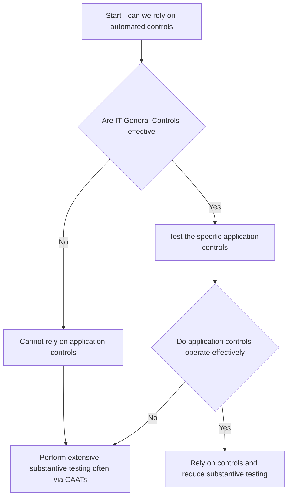
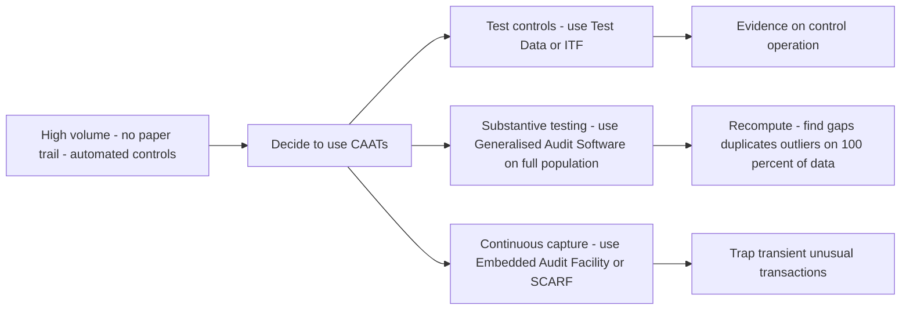
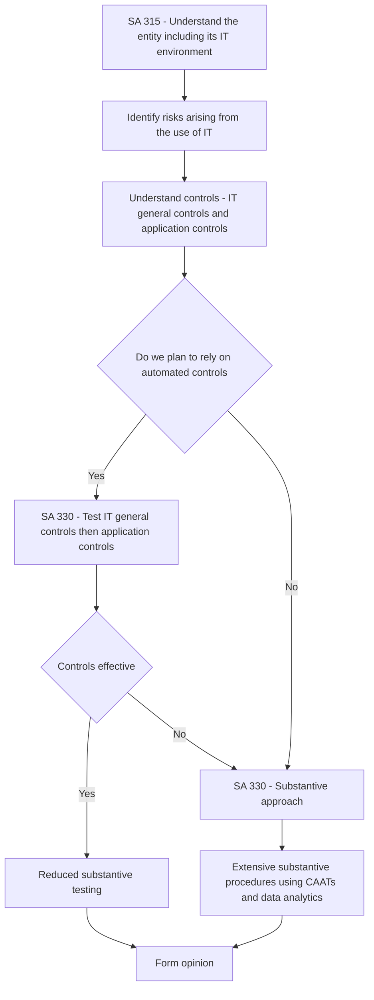
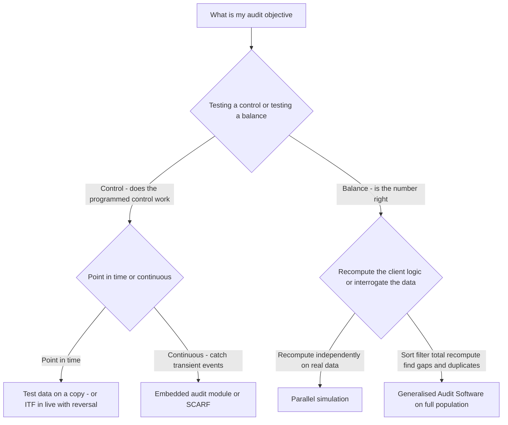

<!-- v2-deep -->

# Chapter 07 — Audit in an Automated Environment

## 1. The Problem

Return to the founding problem of this whole subject. A company's managers keep the books; the owners (and lenders, tax authorities, the public) must **trust** those books without being able to check every entry themselves. Audit exists to close that trust gap. The auditor gathers evidence, tests it against reality, and forms an independent opinion.

Now change one thing about the world: **the books are no longer written by hand in a ledger.** They live inside a computer system — an ERP like SAP or Oracle, a Tally installation, a bespoke banking core, a cloud accounting platform. A sales invoice is not a signed paper document in a file; it is a row in a database table, generated automatically when a warehouse scanner logs a dispatch. Interest on a savings account is not calculated by a clerk; a program runs overnight and posts thousands of entries in seconds. A three-way match between purchase order, goods receipt and invoice is not done by a human comparing three papers; a rule inside the software either releases the payment or blocks it.

The **trust problem has not changed** — owners still cannot verify the books themselves. But the **shape of the risk has changed completely**, and if the auditor keeps auditing the way one audits a paper world, the audit will silently fail. Here is why:

- **The visible audit trail dissolves.** In a manual system, every step leaves a paper mark — a signed voucher, an initial in the margin, a stamped register. You can *follow* a transaction with your eyes. In an automated system, a transaction may be born, approved, and posted with **no human touch and no printout**. The "trail" is now electronic, may be fleeting, and may be invisible unless you deliberately go and extract it.

- **Controls move inside the machine.** In a manual world, the control "a senior authorises payments above ₹1 lakh" is a person signing. In an automated world, that control is a line of program logic. It works *perfectly and identically every single time* — which is wonderful when the logic is right and **catastrophic and uniform when the logic is wrong.** A human clerk makes random errors; a program makes the *same* error on *every* transaction until someone notices.

- **A single failure becomes pervasive.** Because the whole entity often runs on one system, a weakness in *how the computer environment itself is managed* — who can change programs, who can access data, whether backups work — is not a risk to one account. It is a risk to **everything the system touches at once.** This is why IT risk is called *pervasive*.

- **Speed and volume defeat manual testing.** You cannot vouch a sample of 25 invoices and feel comfortable when the system processes 4 crore invoices, each capable of being wrong in the same programmed way. The sample tells you about the 25; the *program* tells you about the 4 crore.

So the risk this chapter addresses is precise: **In a computerised environment, misstatements can arise silently, uniformly, and at massive scale, from causes (program logic, access rights, data integrity) that are invisible to a paper-style audit.** Everything that follows — SA 315's requirement to understand IT, the split between general and application controls, CAATs, data analytics, the choice to audit *through* rather than *around* the computer — is a designed response to that single risk.

> **First-principles anchor.** The computer did not create new *types* of lies (fraud and error are ancient). It changed *where* they hide, *how consistently* they repeat, and *how fast* they multiply. The audit must follow the risk into the machine.

**A sharper way to see it — the "risk relocation" idea.** Think of misstatement risk as a fixed quantity of water that must go *somewhere*. In a manual system it pools in *human* places: a clerk's arithmetic slip, a forged signature, a lost voucher, a mis-posted ledger folio. Automation does not drain the water; it **re-routes it into three new reservoirs**:

1. **Logic** — the program itself may embody a wrong rule (wrong tax rate, wrong rounding, wrong cut-off).
2. **Access** — the wrong person may reach data or programs (no segregation, privileged users, shared passwords).
3. **Data integrity** — records may be altered, lost, incompletely captured, or corrupted in transit between systems.

Every technique in this chapter targets one of these three reservoirs. If you can name which reservoir a procedure drains, you understand *why* the profession requires it. Keep this triad — **logic, access, data** — as a mental index for the whole chapter.

> **Contrast to lock it in.** Manual world: errors are **random, self-limiting, individually small, and leave paper.** Automated world: errors are **systematic, self-replicating, potentially vast, and may leave no paper.** The single word that captures the difference is *systematic* — the machine's greatest virtue (consistency) is also the audit's greatest danger (a consistent mistake).

---

## 2. The Core Idea

The core idea of this chapter can be compressed into one sentence:

> **When accounting moves into a computer, the auditor must move the audit into the computer too — understanding, testing, and using the technology rather than pretending it is a black box.**

This unfolds into three linked commitments:

1. **Understand the IT environment as part of understanding the entity (SA 315).** You cannot assess risk in a system you do not understand. The auditor must grasp *how* the numbers are produced by the technology, not just *what* the numbers are.

2. **Distinguish two layers of control, because they fail differently.**
   - **Application controls** live inside a specific business process (e.g., the purchase system won't accept a negative quantity). They protect *individual* assertions in *individual* processes.
   - **IT General Controls (ITGCs)** are the environment-wide plumbing — access management, change management, operations, backup. They don't touch any single transaction directly; instead they determine **whether you can rely on the application controls at all.** If anyone can change a program overnight, no application control is trustworthy.

3. **Choose an audit approach that matches the system: through the computer, not merely around it.** Auditing *around* the computer treats the machine as a black box — check inputs, check outputs, ignore the processing. Auditing *through* the computer opens the box: test the logic and controls inside. In modern, high-volume, automated systems, around-the-computer is often *not enough*, and the auditor uses **CAATs and data analytics** to test the processing and the whole population directly.

Hold these three ideas. The rest of the chapter is their justification and mechanics.

**Where the "point of reliance" sits — the decision the whole audit turns on.** Underneath these three commitments is a single strategic choice the auditor must make for each significant class of transactions: *am I going to rely on the entity's automated controls (a controls-reliance strategy), or am I going to test the numbers directly and not depend on the machine's controls (a substantive strategy)?* This choice is not cosmetic — it determines the *nature, timing and extent* of everything you do next. A controls-reliance strategy is attractive precisely because of the machine's consistency (test a control once, cover the whole year), **but it is only available if the ITGCs hold.** A substantive strategy is always available but, in a high-volume automated world, is itself usually executed *with* the computer (CAATs on the full population). So even "not relying on controls" does not let you escape the machine — it just changes which tool you point at it.

**A vocabulary caution the exam exploits.** Students blur three verbs — *understand*, *evaluate*, and *test* — but SA 315/330 keep them distinct and sequential:

- **Understand** (SA 315) — obtain knowledge of the IT environment and the controls. This is *mandatory for every audit*, even one that plans no reliance on controls, because you cannot assess risk without it.
- **Evaluate the design and determine implementation** (SA 315) — is the control *capable* of preventing/detecting a misstatement, and does it actually *exist* and *is in use*? (A walkthrough answers this.)
- **Test operating effectiveness** (SA 330) — does the control *actually work throughout the period*? This is only required if you intend to *rely* on the control.

Understanding is never optional; testing operating effectiveness is a *choice* driven by your reliance strategy. Confusing "I did a walkthrough" (design + implementation) with "I tested the control" (operating effectiveness) is a classic exam and real-world error.

---

## 3. Why It's Built This Way

Why does the profession structure automated-environment auditing exactly like this — two control layers, a preference for auditing *through*, a toolkit of CAATs? Because each design choice answers a specific weakness of the computerised world.

**Why two layers (general vs application)?** Because reliability is *conditional*. An application control is only as trustworthy as the environment that hosts it. Imagine a beautifully designed application control that rejects duplicate vendor invoices. Now imagine that the IT environment is so loose that a programmer can log into production at night and switch that control off, run a fraudulent batch, and switch it back on. The application control *looks* perfect in a walkthrough and is *worthless* in reality. So auditors were forced to recognise a foundational layer — ITGCs — whose entire job is to make application controls *dependable*. **You test ITGCs first; only if they hold can you place reliance on application controls.** This dependency is the single most important structural idea in the chapter.

**Why prefer auditing *through* the computer?** Because in an automated environment the *processing* is where value is added and where risk concentrates. If a program silently drops the second decimal on every interest calculation, inputs look fine and each individual output looks *plausible* — the error is only visible if you interrogate the logic or re-perform on the whole population. Auditing around the computer would miss it. As systems became more integrated and paper outputs vanished, "around" stopped being a real option for large parts of the audit.

**Why CAATs and data analytics?** Because the auditor's traditional weapon — sampling — is a *concession to human limits*, not a virtue. We sampled because a human could not examine a million vouchers. A computer *can*. CAATs let the auditor examine **100% of the population**, re-perform calculations exactly, and spot patterns (round-sum entries, weekend postings, duplicate payments, gaps in invoice numbering) that no sample would reveal. The technology that created the risk also supplies the tool to audit it.

**Why anchor all this in SA 315 and SA 330?** Because the profession refuses to bolt "IT auditing" on as a separate exotic activity. It is *the same risk-based audit*: **understand the entity and its environment (including IT) → identify and assess risks of material misstatement → design responses.** SA 315 forces you to understand IT and its controls; SA 330 forces your procedures to *respond* to what you found. Automated-environment auditing is not a new religion; it is the standard risk model, honestly applied to a computerised entity.

**Why does "consistency" cut both ways — and why does the profession lean on it anyway?** This deserves first-principles unpacking because it is the intellectual engine of controls-reliance. A manual control (a clerk checking prices) is *inconsistent by nature*: the clerk is sharp on Monday, tired on Friday, absent in June. To rely on such a control you must re-test it repeatedly across the period, because past performance barely predicts future performance. An automated control is the opposite: it is **deterministic** — given the same input it produces the same output every time, forever, until the code changes. That determinism means a *single* successful test is, in principle, evidence about *every* execution in the period. The profession seized on this because it makes controls-reliance dramatically efficient. **But** the inference "tested once, therefore worked all year" secretly depends on a premise: *the code did not change*. That premise is exactly what **change-management ITGC** guarantees. So the two-layer structure is not bureaucratic tidiness — it is the *logical price* of being allowed to extrapolate a one-day test across a twelve-month period. Remove change management and the extrapolation collapses.

**Why not just do substantive testing everywhere and skip controls?** Because in a genuinely automated, high-volume entity, *pure* substantive testing is often either impossible or wildly inefficient. If purchases are 4 crore transactions with no paper, "vouch a sample" tells you almost nothing about the population, and re-performing everything substantively still forces you to trust the *data extract* you analyse — which itself depends on ITGCs. There is no ITGC-free island. The realistic choice is not "controls vs no computer" but "which mix of controls-reliance and computer-assisted substantive work gives sufficient appropriate evidence at least cost." That is a professional-judgement optimisation, and SA 330 exists to discipline it.

---

## 4. Full Technical Content

This is the exam-bearing core. Every requirement below is paired with the risk it answers.

### 4.1 How a computerised environment changes the audit (the drivers)

| Change | What it means | Why it matters (the risk) |
|---|---|---|
| **Loss of visible/paper audit trail** | Transactions may leave no printed evidence; the trail is electronic and possibly transient | Auditor cannot "follow the paper"; must extract electronic evidence deliberately, sometimes in real time before it is overwritten |
| **Uniform (systematic) processing** | The program treats every like transaction identically | A single logic error is repeated on the *entire* population — errors become systematic, not random |
| **Automated (programmed) controls** | Controls are program logic, not human acts | They are consistent but only as good as the code; a wrong control fails invisibly and pervasively |
| **Potential for unauthorised access & data manipulation** | Data is concentrated and remotely reachable | Concealment of fraud, unauthorised changes, loss of segregation of duties |
| **Reduced human involvement / segregation** | One system may combine incompatible functions | Traditional manual segregation of duties may be lost; must be enforced by system access rights instead |
| **High speed & volume** | Millions of transactions processed instantly | Manual sample testing is inadequate; population-level techniques become necessary |
| **Dependence and pervasiveness of IT** | Whole entity relies on the system | An environment-level weakness threatens *all* financial assertions simultaneously |

> **Exam framing:** If asked "how does a computerised environment affect the audit / audit approach," structure your answer around these drivers, each tied to its risk. Do not just list features of computers.

**Two finer distinctions the examiner tests here:**

- **"Systematic" vs "random" error — get the audit consequence right.** A *random* manual error partially self-corrects across a population (some overstatements, some understatements) and is caught by sampling with reasonable confidence. A *systematic* programmed error moves *every* item in the *same* direction, so it does **not** wash out — a tiny per-transaction error becomes a large, one-directional aggregate misstatement. This is *why* population-level testing (CAATs) is not a luxury in automated environments: sampling is designed for random error, and the dominant error mode here is systematic.

- **"Consistency" is a double-edged property, not a benefit.** Many students write "computers are consistent" as if it were purely good. In audit terms consistency is *neutral*: it makes a *correct* control reliably correct (the benefit of consistency, §4.3) and a *wrong* control reliably wrong (the systematic-error risk). The exam rewards the student who names *both* edges.

> **Trap-in-advance:** When a question lists a feature of a computer system, always translate it into an *audit impact tied to a risk*. "The system processes 4 crore invoices" is not an answer; "high volume defeats manual sampling, forcing population-level CAATs" is.

### 4.2 Relevant Standards on Auditing (SAs)

Automated-environment auditing is not governed by one "IT SA." It is woven through the risk-assessment standards. Know these citations:

- **SA 315 — *Identifying and Assessing the Risks of Material Misstatement through Understanding the Entity and Its Environment.*** This is the anchor. It **explicitly requires** the auditor to obtain an understanding of the **information system**, including the related business processes and **how the entity uses IT**, and to understand the **controls, including IT general controls and application controls**, relevant to the audit. *Why:* you cannot assess a risk in technology you do not understand. SA 315 also introduces the idea that IT gives rise to specific **risks arising from the use of IT** (e.g., unauthorised access, unauthorised changes, reliance on inaccurate systems).

- **SA 330 — *The Auditor's Responses to Assessed Risks.*** Once SA 315 tells you *where* the risk is, SA 330 requires your procedures to *respond*. If you intend to **rely on automated controls**, SA 330 requires you to test those controls and, crucially, to test the **IT general controls** that support their **continued effective operation** throughout the period. *Why:* an automated control tested as working on one day is presumed to work all year *only if* change/access controls prevented it from being altered — hence you must test ITGCs.

- **SA 240 — *The Auditor's Responsibilities Relating to Fraud.*** In an automated environment, fraud can be perpetrated through unauthorised access and data manipulation, and **journal entry testing** (an SA 240 requirement) is often best done using CAATs across the full population.

- **SA 500 — *Audit Evidence.*** Electronic evidence must still be sufficient and appropriate; its **reliability depends on the controls over its preparation and maintenance** — again pointing back to ITGCs.

- **SA 402 — *Audit Considerations Relating to an Entity Using a Service Organisation.*** When the accounting/IT is outsourced (cloud ERP, third-party payroll, a data-centre operator), the relevant controls physically sit at *another entity*. The auditor must understand those controls, often relying on a **service auditor's report (SOC 1 / Type 2)**, and remains responsible for the opinion. *Why:* the risk did not leave the financial statements just because the processing left the building.

- **SA 620 — *Using the Work of an Auditor's Expert.*** IT systems audit often needs specialist skill the engagement team lacks; the auditor may engage an IT expert but must evaluate that expert's competence, objectivity and work.

- **SA 230 — *Audit Documentation.*** CAAT design, the data source and its integrity checks, parameters, and results must all be documented so the work is re-performable.

> **Confirm exact wording in ICAI material.** Paraphrase the requirements as above for concept clarity, but reproduce SA numbers and titles precisely in the exam; ICAI marks citation accuracy. *(Standard titles above reflect ICAI's SA series — verify against current ICAI study material / applicable AY, as titles are occasionally re-worded.)*

> **Exam pattern:** A favourite question gives a fact pattern (outsourced payroll to a cloud vendor, an IT specialist brought in, journals tested across the population) and asks *which SA governs*. Map the fact to the SA: outsourced processing → **SA 402**; IT specialist → **SA 620**; journal-entry / override testing → **SA 240**; reliability of electronic evidence → **SA 500**; the two spine standards are always **SA 315 (understand) and SA 330 (respond).**

### 4.3 The two control layers

#### (a) IT General Controls (ITGCs) — the foundation

**Definition & purpose:** ITGCs are policies and procedures that apply to the IT environment as a whole and **support the continued proper operation of application controls.** They do not process transactions themselves. Their job is to make everything *else* trustworthy. **If ITGCs are weak, you cannot rely on any automated application control** — you must fall back on substantive testing.

The standard ITGC domains, each with its guardian *why*:

| ITGC domain | What it controls | The WHY (risk it counters) |
|---|---|---|
| **Access Security / Logical access** | Who can log in, to what, with what rights; passwords, roles, privileged access | Prevents unauthorised viewing/changing of data and programs; **enforces segregation of duties** that used to be manual. Without it, one person could initiate *and* approve *and* conceal |
| **Change Management (Program change controls)** | How programs are modified — request, test, approve, migrate to production; separation of dev/test/prod | Ensures **only authorised, tested changes** reach the live system. Without it, a wrong or malicious change silently corrupts *every* future transaction |
| **Program Development / SDLC** | How new systems are built and implemented | Ensures new applications are correctly designed, tested and authorised before going live |
| **IT Operations** | Job scheduling, batch processing, incident management, monitoring | Ensures processes run **completely and on time**; failed/duplicated jobs are detected. Without it, batches may be missed or run twice |
| **Backup, Recovery & Business Continuity** | Data backups, disaster recovery, restoration testing | Ensures data is **not permanently lost** and can be recovered — protects completeness and existence of records |

**The keystone principle:** ITGCs and application controls have a **dependency relationship.** Application controls are *effective* only when the underlying ITGCs are *effective*. Therefore the audit sequence is: **test ITGCs → if they operate effectively, place reliance on automated application controls → reduce substantive testing accordingly.** If ITGCs fail, automated controls cannot be relied upon and the auditor increases substantive procedures (often using CAATs).

**Finer distinctions the exam tests within ITGCs:**

- **Access security has two halves — authentication and authorisation.** *Authentication* asks "are you who you claim to be?" (passwords, MFA, biometrics). *Authorisation* asks "given who you are, what may you do?" (roles, privileges). A system can authenticate perfectly and still be dangerous if authorisation is loose (everyone is an admin). Segregation of duties is an *authorisation* concept, enforced through role design.

- **The special danger of privileged / "superuser" access.** Administrator, DBA, and "firefighter" accounts can bypass application controls, edit data directly in tables, and alter logs. The audit concern is not merely *who has* such access but whether its *use* is logged, reviewed, and independently monitored — because a privileged user can, in principle, both commit and conceal.

- **Segregation of duties (SoD) migrates from bodies to roles.** In a manual shop, SoD is enforced by giving different *people* incompatible tasks. In an ERP, the same protection must be built into *role definitions* so that no single role can, say, create a vendor **and** approve a payment **and** post to the GL. Auditors test SoD by analysing the access-rights matrix for *toxic combinations* — often itself a CAATs exercise.

- **Change management's crown jewel: separation of environments.** Development, test, and production must be *separate*, and developers should not have standing access to production. *Why:* if a developer can push untested code straight to production, the entire "authorised, tested changes only" guarantee is fiction. "Emergency change" / "firefighter" procedures are a recognised exception but must be after-the-fact reviewed and documented.

- **Why backup/recovery is a financial-statement matter, not just IT hygiene.** It protects the *existence and completeness* of the accounting records themselves. A ransomware event or disk failure that destroys unrecoverable records is a direct threat to the auditor's ability to obtain evidence — a scope and going-concern issue, not merely an operational inconvenience.

> **The dependency, stated as a testable rule:** *No ITGC assurance ⇒ no reliance on automated application controls ⇒ substantive strategy (usually CAATs).* You can be asked to run this implication in either direction: "ITGCs failed, what now?" → substantive; "we relied on an automated control all year, what must we have tested?" → ITGCs, especially change management.

*Figure 7.1 — The dependency gate: application-control reliance is unlocked only after IT general controls pass.*

#### (b) Application Controls — the transaction-level guards

**Definition & purpose:** Application controls are controls embedded within a specific business-process application that operate at the level of **individual transactions.** They may be **automated** (performed by the program), **manual**, or **IT-dependent manual** (a person acts, but relies on a system-generated report — so the control is only as good as the report's integrity). Their purpose is to ensure the **completeness, accuracy, validity and authorisation** of transactions as they are captured, processed and reported.

Classic application-control types, mapped to assertions and *why*:

| Control type | Example | Assertion protected | Why |
|---|---|---|---|
| **Input controls / validation checks** | Field must be numeric; date must be valid; mandatory fields; **check digit**; range check; format check | Accuracy, Validity | Stops bad data entering — "garbage in, garbage out" prevention |
| **Existence / validity checks** | Vendor code must exist in master file before invoice is accepted | Validity, Occurrence | Prevents transactions against non-existent or unauthorised masters |
| **Reasonableness / limit checks** | Reject salary entry above a threshold; flag negative inventory | Accuracy | Catches out-of-range values a human might miss |
| **Sequence / completeness checks** | System flags missing invoice numbers; **control totals / hash totals**; run-to-run totals | Completeness | Ensures no transaction is lost or duplicated in processing |
| **Duplicate checks** | Same invoice number + vendor rejected | Occurrence (no double-count) | Prevents duplicate payments/postings |
| **Authorisation / matching controls** | Three-way match PO + GRN + invoice before payment; workflow approval limits | Authorisation, Occurrence | Ensures only approved, genuine transactions proceed |
| **Configuration controls** | System-configured tax rates, credit limits, posting rules | Accuracy, Authorisation | The "settings" that drive automated processing — wrong config = systematic error |
| **Output controls** | Reconciliation of output to input; restricted distribution of reports | Completeness, Confidentiality | Ensures results are complete and reach only authorised users |

**Where controls sit in the transaction lifecycle — input, processing, output.** A cleaner way to organise the same list is by *when* the control acts:

| Stage | Question it answers | Typical controls |
|---|---|---|
| **Input** | Did only correct, complete, authorised data *enter*? | Validation/format/range/check-digit, mandatory fields, existence checks against masters, batch control totals at entry |
| **Processing** | Was the data *transformed* correctly and completely once inside? | Run-to-run totals, reasonableness checks during calculation, sequence checks, matching/3-way match, correct configuration driving the maths |
| **Output** | Is the *result* complete, accurate, and delivered only to authorised users? | Output-to-input reconciliation, distribution controls, exception reports reviewed |

*Why this framing matters:* "auditing around the computer" tests only **input and output** and *infers* processing; "auditing through the computer" targets the **processing** stage directly. Naming the stage a control belongs to often *is* the exam question.

**The three flavours of application control — and why the middle one is a trap:**

- **Automated control** — the program does it (e.g., system rejects an out-of-range value). Reliance is efficient (benefit of consistency) *but* depends on ITGCs.
- **Manual control** — a person does it with no system dependency (e.g., a manager physically counts cash). ITGCs are largely irrelevant to it.
- **IT-dependent manual control** — a person acts, *but on the basis of information the system produced* (e.g., a manager reviews a system-generated "exceptions over ₹1 lakh" report and follows up). **The catch:** this control is only as reliable as the *report's completeness and accuracy*. If the report itself silently omits items (a query bug, a wrong filter), the diligent manager reviews a lie. So testing an IT-dependent manual control **also** requires assurance over the report's generation — which loops back to ITGCs and to the concept of **information produced by the entity (IPE)**. Examiners love to plant a "diligent human review" and ask whether that is enough; the answer hinges on the integrity of the underlying report.

> **Key insight for the exam:** An **automated application control** has a superpower and a curse. Superpower: test it *once*, and (provided ITGCs — especially change management — held all year) you may conclude it worked *all year*. This is the **"benefit of consistency."** Curse: if it is misconfigured, it is wrong on *every* transaction. This is why change-management ITGC is the linchpin: it is what justifies extrapolating a single control test across the whole period.

> **Master-data controls — an underrated exam angle.** Many "application controls" actually depend on the integrity of *master data* (vendor master, customer master, price master, tax-rate table). A validity check that "the vendor must exist in the master" is worthless if anyone can add a fake vendor to the master. So controls over *who can change master data* (an access + change concern) sit at the boundary of application and general controls and are a frequent real-world weakness.

### 4.4 Auditing *around* vs *through* the computer

| | **Around the computer** | **Through the computer** |
|---|---|---|
| **Treats the system as** | A black box | A box to be opened |
| **What is tested** | Inputs and outputs only; if outputs reconcile to inputs, processing is *assumed* correct | The processing, logic and programmed controls themselves |
| **Evidence about processing** | Indirect / inferred | Direct |
| **When acceptable** | Simple systems; strong visible audit trail; low volume; standard packaged software with reliable outputs | High volume, complex/integrated systems, no paper trail, significant automated controls |
| **Main risk** | A processing error that does not disturb the input-output reconciliation goes **undetected** | Requires IT skill and tools, but gives real assurance |
| **Tools** | Manual vouching of documents | **CAATs**, test data, integrated test facility, data analytics |

**Auditing around** is legitimate only when the system is simple enough and the audit trail visible enough that correct outputs genuinely imply correct processing. As automation, integration and volume rise, this assumption breaks, and the auditor must audit **through** the computer.

A third, modern label you may meet: **auditing *with* the computer** — using the computer as a *tool* (CAATs, analytics) regardless of approach. In practice, auditing through the computer in a modern audit is done *with* the computer.

**The precise failure mode of "around" — why input-output reconciliation is not enough.** "Around" rests on the syllogism: *inputs are correct → outputs reconcile to inputs → therefore processing is correct.* The hidden flaw is that reconciliation only detects errors that **break** the input-output relationship. A processing error that is *internally consistent* — the program applies a wrong-but-uniform rule — produces outputs that reconcile perfectly to inputs and *still be wrong*. Example: a program that computes interest at 5.9% when the sanctioned rate is 6.0%. Every output ties neatly to its input; the totals foot; nothing looks broken — yet interest is understated on *every* account. Only opening the box (recompute the logic, or run test data) exposes it. This is the single sentence that justifies auditing *through*: **reconciliation tests the arithmetic of the process, not the correctness of its rules.**

> **Nuance the exam rewards:** "Around vs through" is *not* an either/or verdict for a whole audit. A modern audit is a *mix* — around for a simple standalone fixed-asset register, through for the high-volume revenue engine. The skill is deciding *per class of transactions*, driven by volume, complexity, automation, and audit-trail visibility. Writing "we should audit through the computer" as a blanket rule is less impressive than saying *which* processes need it and *why*.

### 4.5 CAATs — Computer-Assisted Audit Techniques

**What they are & why:** CAATs are the use of computer tools and data to perform audit procedures directly on the entity's electronic data and systems. **Why they exist:** manual procedures cannot cope with electronic-only trails, high volume, and the need to test *processing*. CAATs let the auditor test the **whole population**, re-perform computations exactly, and interrogate the system's own logic.

**When CAATs become appropriate / necessary (the drivers):** absence of input documents / no visible audit trail; high transaction volume; need to test 100% of a population; need to re-perform complex calculations; testing automated application controls; and improving audit **effectiveness and efficiency.**

**Principal CAAT tools:**

| CAAT | What it does | Why / typical use |
|---|---|---|
| **Test data** | Auditor feeds *dummy* transactions (both valid and deliberately invalid) through the client's live/copy program to see if programmed controls react correctly | Tests whether **application controls actually work** — e.g., does the system really reject a negative quantity? Caution: must not corrupt live data |
| **Integrated Test Facility (ITF)** | A dummy entity/module is embedded in the *live* system; auditor's test transactions run alongside real ones and are later reversed | Tests processing under **real operating conditions** without a separate copy |
| **Parallel simulation** | Auditor writes/uses an *independent* program to re-process the client's *real* data and compares results to the client's output | Directly verifies **processing accuracy** on real data |
| **Embedded audit facility / SCARF (System Control and Review File)** | Audit routines built into the system continuously capture unusual transactions to an audit log | **Continuous auditing**; captures transient transactions that leave no trail |
| **Generalised Audit Software (GAS)** | Packaged tools (e.g., IDEA, ACL) that read client data files and let the auditor sort, filter, total, stratify, sample, recompute, find gaps/duplicates | The workhorse for **substantive testing on full populations** |
| **Utility software / custom scripts / SQL queries** | Ad-hoc extraction and analysis | Flexible interrogation of databases |

**The single most-tested distinction: test data vs parallel simulation.** They point in *opposite directions* and swapping them is a guaranteed mark loss:

| | **Test data** | **Parallel simulation** |
|---|---|---|
| **Data used** | *Dummy* (auditor-invented) transactions | *Real* client transactions |
| **Program used** | The *client's* program | The *auditor's* independent program |
| **Question answered** | "Does the client's program handle (esp. exceptions) correctly?" | "Did the client's program produce the right numbers on real data?" |
| **Primary objective** | Test **programmed controls / logic** | Test **processing accuracy / recompute output** |
| **Risk to manage** | Dummy data must not pollute live records | Must faithfully replicate the client's intended logic |

Memory hook: **Test data = fake data through real program; Parallel simulation = real data through fake (auditor's) program.**

**ITF vs plain test data — the refinement.** Plain test data is usually run against a *copy* of the program (safe, but not "live" conditions). **ITF** embeds a fictitious entity *inside the live system* so the auditor's test transactions are processed by the *actual production program under real operating conditions*, then reversed/removed so they never hit the financial statements. ITF gives the most realistic evidence but carries the highest contamination risk — hence the mandatory reversal and careful flagging of the dummy entity.

**SCARF / embedded audit modules — why "continuous."** These are audit routines *baked into* the client's live system that watch every transaction as it flows and copy anything meeting the auditor's criteria (e.g., every write-off over ₹5 lakh, every after-hours master-data change) into a separate audit file. Their unique value is capturing **transient** events that leave no lasting trail and would be gone by the time a year-end auditor arrives — the closest thing to a "flight recorder" for the accounting system.

**Considerations before using CAATs (exam-favourite list):**
- **IT knowledge, expertise and experience** of the audit team (may need an **auditor's expert** under SA 620).
- **Availability of CAATs and suitable computer facilities**; compatibility with the client's system and file formats.
- **Impracticability of manual tests** (does the situation actually *need* CAATs?).
- **Effectiveness and efficiency** — will CAATs improve the audit or just add cost?
- **Time available** and timing of data availability (some data is transient — capture it before it's overwritten).
- **Integrity of data and the environment** — running test data on *live* systems risks corrupting real records; use copies or reversing entries.
- **Cost-benefit** and client cooperation / access rights.

> **The completeness-of-the-extract problem — the trap under every CAAT.** Any CAAT run on *extracted* client data is only as trustworthy as the *extract*. If you pull "all sales invoices" but the query silently misses a division, a currency, or an archived period, your 100% test is 100% of the *wrong* population. Before analysing, the auditor must prove the data is **complete and accurate** — reconcile record counts and control totals of the extract back to the source system / trial balance, and understand how the extract was produced. This is why *even a substantive-CAAT strategy cannot fully escape ITGCs*: the integrity of the data you analyse depends on them.

*Figure 7.2 — Matching the CAAT tool to the audit objective.*

### 4.6 Data Analytics in Audit

**Definition & why:** Audit data analytics (ADA) is the science and art of discovering and analysing **patterns, deviations and anomalies, and extracting useful information**, in the data underlying the financial statements — usually through analysis of the **entire population** rather than samples. It is the evolution of CAATs into richer, visualisation-driven, whole-population analysis. **Why now:** entities generate vast structured data; analysing all of it is more powerful than sampling a sliver of it.

**Typical audit uses (and the risk each targets):**
- **100% testing of a population** instead of sampling — reduces sampling risk to zero for that test.
- **Journal entry testing (SA 240)** — flag entries posted on weekends/holidays, by unusual users, to unusual accounts, in round sums, just below approval limits, or with unusual descriptions. *Why:* these are classic fraud fingerprints.
- **Three-way match analysis** across PO/GRN/invoice populations — completeness and occurrence of purchases.
- **Duplicate payment detection**; **gap detection** in invoice/cheque sequences.
- **Revenue analysis** — cut-off testing, trend and ratio analysis by product/region/customer.
- **Ageing and recomputation** of receivables/inventory.
- **Benford's Law** analysis to spot fabricated numbers.

**Benford's Law — enough to use it correctly in the exam.** In many naturally occurring, unconstrained financial datasets, the *leading digit* is not uniformly distributed: **1 appears as the first digit about 30% of the time**, and the frequency falls away to **~4.6% for 9**. Fabricated numbers (a fraudster inventing amounts, or padding just under an approval limit) tend to *violate* this distribution. So a large deviation from the expected Benford curve **flags a population for investigation** — it does *not* prove fraud. Its limits matter: Benford's Law does **not** apply to constrained data (e.g., amounts capped at ₹10,000, sequential invoice numbers, assigned IDs, or fields with a natural floor/ceiling), so applying it to the wrong dataset produces meaningless "deviations." Naming *when it does not apply* is what separates a strong answer from a rote one.

**A precision point students miss:** "100% testing reduces **sampling** risk to zero" — but it does **not** reduce audit risk to zero. Two other risks remain: (i) **the data may be incomplete or unreliable** (the extract problem again), and (ii) **the auditor may mis-judge the exceptions** (non-sampling risk — wrong criteria, wrong follow-up, wrong conclusion). Whole-population testing conquers *one* specific risk, not all of them.

**Cautions:** ADA output is a *lead*, not a *conclusion* — anomalies must be investigated and corroborated. Data must be **complete and reliable** (garbage in, garbage out — so ITGCs matter again). ADA supplements professional judgement; it does not replace it.

### 4.7 How it all ties to the risk model (SA 315 → SA 330)

The whole chapter is the standard risk-based audit applied to IT:

*Figure 7.3 — Automated-environment auditing is the SA 315 / SA 330 risk model, honestly applied to a computerised entity.*

### 4.8 Choosing the tool from the objective — a decision map

A recurring exam demand is: *given a situation, name the right technique.* Reason from the **audit objective** to the tool, not the reverse. The chain is: *what am I trying to prove? → about controls or about balances? → at a point or continuously? → on real or dummy data?*

*Figure 7.4 — Reason from objective to technique: controls versus balances, point-in-time versus continuous, real data versus dummy.*

> **Fill-in table to self-check (cover the right column):** *Prove the system rejects invalid input* → **test data**; *recompute interest on all accounts* → **parallel simulation / GAS**; *catch every after-hours master change all year* → **SCARF / embedded module**; *find duplicate vendor payments in 40 lakh rows* → **GAS**; *test a programmed control under real live conditions without a separate copy* → **ITF**.

### 4.9 A worked numerical: the systematic-error multiplier

To *feel* why systematic error is the villain, quantify it. Suppose a bank runs interest on **50,00,000** savings accounts. The sanctioned rate is **6.00% p.a.** but a mis-configured rate table applies **5.95%** — a mere **0.05%** understatement per account. Assume an average balance of **₹40,000** and interest for a full year.

- Correct annual interest per account = ₹40,000 × 6.00% = **₹2,400.00**
- Posted interest per account = ₹40,000 × 5.95% = **₹2,380.00**
- Error per account = ₹2,400.00 − ₹2,380.00 = **₹20.00** (tiny — no clerk or sample would flinch)
- Aggregate error = ₹20 × 50,00,000 accounts = **₹10,00,00,000 = ₹10 crore.**

*Self-check by an independent route:* aggregate error = total balances × rate error = (50,00,000 × ₹40,000) × 0.05% = ₹2,00,000 crore of balances × 0.0005 = **₹10 crore.** ✓ (both routes agree).

**The lesson, made numerical:** a ₹20 error is *immaterial per item* and *invisible to any sample* — yet because it is **systematic and one-directional**, it aggregates to a **₹10 crore** misstatement that is almost certainly material. This is precisely why sampling (built for random, self-cancelling error) fails here and why the auditor must **recompute the whole population** (parallel simulation / GAS) rather than test 25 accounts. A sample of 25 would show each posting "reconciles to its input" and pass — the error lives in the *rule*, not the arithmetic.

---

## 5. Applied Scenarios

**Scenario 1 — The perfect control that isn't.**
*During the audit of Zenith Ltd, the team performs a walkthrough of the purchase system and confirms that the ERP automatically blocks any invoice not matching an approved PO and GRN. Delighted, the junior wants to conclude that the completeness and occurrence of purchases are fully controlled and reduce substantive testing to a minimum. Is this justified?*

**Answer.** Not yet. The automated three-way match is an **application control**, and reliance on it is *conditional* on the supporting **IT general controls**. Before relying, the team must test the ITGCs — particularly **change management** (could the matching logic have been altered during the year?) and **access security** (could a user with excessive rights override the block or edit the PO/GRN master?). Under SA 330, reliance on an automated control tested at a point in time requires evidence that ITGCs kept it operating effectively **throughout the period**. If ITGCs are effective, the team may test the application control (e.g., via **test data** — feed an unmatched invoice and confirm rejection) and then reduce substantive testing. If ITGCs are weak, the control cannot be relied upon regardless of how well it *appears* to work, and the team must perform **substantive procedures, likely using CAATs** on the full purchases population.

**Scenario 2 — Vanished trail, huge volume.**
*Nova Bank posts savings-account interest to 80 lakh accounts through an overnight batch program. There are no vouchers; each posting exists only as a database entry. The auditor must obtain assurance over the accuracy and completeness of interest expense. What approach and tools?*

**Answer.** This is a textbook case where **auditing around the computer is inadequate** — there is no visible audit trail and the risk lies in the **processing** (the interest calculation logic). The auditor should audit **through the computer** using **CAATs**:
- **Parallel simulation / recomputation via Generalised Audit Software:** independently recompute interest for the *entire* 80 lakh population using the applicable rates and day-count, then compare to the bank's postings — directly testing accuracy on 100% of accounts.
- **Test data / ITF:** run dummy accounts with known balances and rates to confirm the program applies the correct logic (e.g., correct rate slabs, correct rounding).
- **Completeness checks:** reconcile control totals; confirm no accounts were skipped or double-posted using **run-to-run totals** and gap/duplicate analysis.
- Because processing is automated and consistent, the auditor must also test **ITGCs** (change and access controls over the interest program) to conclude the tested logic operated unchanged all year. Data must be captured **before overnight overwrites** — a timing consideration for CAATs.

**Scenario 3 — Fraud hiding in the journals.**
*In auditing Orion Ltd, the engagement partner is concerned about management override of controls. The general ledger contains 12 lakh journal entries. How can data analytics discharge the SA 240 requirement to test journal entries, and what are its limits?*

**Answer.** Manual selection from 12 lakh entries is hopeless; **audit data analytics** can test the **whole population** and target fraud fingerprints. The auditor extracts all journals and flags: entries posted on **weekends/holidays or outside business hours**; entries by **unusual or unauthorised users**; **round-sum** amounts; amounts **just below approval thresholds**; postings to **unusual/sensitive accounts** (e.g., revenue to suspense, entries reversing at period-start); rare or blank **narrations**; and **Benford's Law** deviations. **Limits:** each flag is a *lead*, not proof — the auditor must investigate and corroborate each exception with underlying evidence and management inquiry, exercising **professional scepticism**. The reliability of the analysis depends on the **completeness of the extracted data**, which itself depends on **ITGCs** over the GL. Analytics supplements, and does not replace, the auditor's judgement.

**Scenario 4 — The diligent manager and the silent report (IT-dependent manual control).**
*At Delta Ltd, credit-limit breaches are controlled thus: the system generates a daily "Orders exceeding customer credit limit" exception report, and the credit manager reviews it and holds those orders. The manager's review is meticulous and fully documented. The junior wants to rely on this control for the valuation/occurrence of receivables. What is the hidden risk, and what must be tested?*

**Answer.** This is an **IT-dependent manual control**: a human acts, but *entirely on the basis of a system-generated report*. The manager's diligence is real, but it is diligence applied to *whatever the report shows*. The **hidden risk** is that the **report itself may be incomplete or inaccurate** — a wrong filter, a bug, or a mis-set credit-limit field could cause a breaching order to be *silently omitted* from the report. The manager would then "correctly" review a list that already excludes the very transactions of concern, and the control fails invisibly despite perfect human performance. Therefore, to rely on this control the auditor must **also test the completeness and accuracy of the report** (the "information produced by the entity"): confirm the query logic against the credit-limit rule, reconcile the report to the full order population (e.g., via GAS, independently recompute which orders exceed limits and compare to the report), and confirm the **ITGCs** (change management over the report logic, access over the credit-limit master data). *Exam point:* the reliability of an IT-dependent manual control is capped by the reliability of the report it depends on — never conclude on the human step alone.

**Scenario 5 — Weak ITGCs discovered late (the strategy pivot).**
*Midway through the audit of Vega Ltd, the IT-audit specialist reports that during the year several developers had standing access to production and at least three program changes went live without documented testing or approval. The team had planned a controls-reliance strategy over the automated revenue-recognition control. What is the consequence and the required response?*

**Answer.** The finding is a **change-management (and access-security) ITGC failure**, and change management is the linchpin that justified extrapolating the one-time control test across the period. With ITGCs broken, the auditor **cannot conclude the automated revenue control operated consistently all year** — the code could have been altered without trace — so **reliance on that automated application control must be withdrawn**, regardless of how well it tested at a point in time. The response under SA 330 is to **pivot to a substantive strategy**: because revenue is high-volume, this means **CAATs/ADA over the full revenue population** (recompute revenue per contract terms, cut-off testing, 100% duplicate/gap analysis, matching to dispatch/POD). Note the *pervasiveness*: this ITGC weakness does not only hurt revenue — it undermines reliance on *every* automated control in the system, so the team must reassess the whole controls-reliance plan, not just the revenue line. The weakness may also need reporting to those charged with governance and, if it points to a material weakness, has implications for any internal-financial-controls reporting.

**Scenario 6 — Test data that must never touch the ledger.**
*The team at Sigma Ltd wants to confirm the payroll application really rejects (a) negative hours, (b) an employee code not in the master, and (c) overtime beyond the configured cap. The system is live and heavily used. Design the procedure and its safeguards; what could go wrong?*

**Answer.** This calls for **test data** — dummy transactions, deliberately including *invalid* cases, fed through the client's program to see whether the **programmed input/validation and limit controls** react correctly (reject (a) and (b); flag/cap (c)). The core hazard is **contaminating live records**: dummy payroll entries must not create real payments or distort payroll totals. Safeguards: run against a **copy/test instance of the program with production configuration**, *or* use an **Integrated Test Facility** (a dummy employee in the live system whose entries are **reversed/removed** afterwards and excluded from financial totals); flag all test items distinctly; run outside a real pay cycle or ensure no bank file is generated; and **reconcile after** to confirm no residual test data remains. *What could go wrong:* (i) testing against a *copy whose configuration differs* from production — then the test proves nothing about the live control; (ii) forgetting to reverse ITF entries — real misstatement introduced *by the auditor*; (iii) testing only *valid* inputs — you must include *invalid* ones, since the control's whole job is to *reject*. *Exam gold:* the mark is for pairing the technique (test data/ITF) with the *don't-corrupt-live-data* safeguard and the point that you must feed **both valid and invalid** cases.

---

## 6. Procedure / Documentation Summary

A practical, exam-ready sequence for auditing in an automated environment:

1. **Understand the IT environment (SA 315).** Document the applications relevant to financial reporting, the flow of significant classes of transactions from initiation to the general ledger, the degree of automation, interfaces between systems, and reliance on **service organisations** (bringing in **SA 402** if IT is outsourced).
2. **Identify risks arising from the use of IT** — unauthorised access, unauthorised program changes, reliance on inaccurate systems, loss of data, loss of segregation of duties.
3. **Identify relevant controls:** map the **automated application controls** on which financial assertions depend, and the **IT general controls** that support them.
4. **Test IT general controls first** — access security, change management, program development, IT operations, backup/recovery. Document design and operating effectiveness.
5. **If ITGCs are effective, test the application controls** (walkthroughs, **test data**, inspection of configuration, re-performance). Consider the **"benefit of consistency"** to extend point-in-time results across the period.
6. **Determine the audit approach** — around vs through; decide where **CAATs / data analytics** are needed.
7. **Design and run CAATs / ADA** — recomputation, 100% population testing, gap/duplicate detection, journal-entry analysis. Document data source, extraction method, completeness/reliability checks on the data, tools used, parameters, and results.
8. **Investigate exceptions** and corroborate — analytics leads must be followed to underlying evidence.
9. **Conclude on reliance and residual substantive work** — where controls fail, ramp up substantive procedures.
10. **Document everything (SA 230):** understanding of the IT environment, risk assessment, controls tested and results, CAAT methodology and outputs, exceptions and their resolution, and conclusions. If an **auditor's expert** (SA 620) was used for IT, document the evaluation of their work.

**Documentation must specifically evidence:** the completeness and reliability of any client data used by CAATs; that test data did not corrupt live records; and the linkage from ITGC conclusions to the decision to rely on automated application controls.

**Data-integrity substep (make it explicit in answers).** Before *any* CAAT/ADA conclusion, document the **completeness and accuracy of the extract**: how the data was obtained, record counts and control totals reconciled to the source system / trial balance, the period and scope covered, and any records excluded. Auditors have wrongly cleared populations because they analysed an *incomplete* extract with total confidence — the "100%" was 100% of the wrong data. In the exam, one line — "reconciled the extracted population's count and value totals to the general ledger before analysis" — signals maturity.

**Governance and reporting linkage.** ITGC/application-control weaknesses identified are not only an audit-strategy input; **significant deficiencies must be communicated to those charged with governance** (SA 265), and, where applicable, feed into reporting on **internal financial controls (IFC)**. A weakness that forces a strategy pivot is often also a reportable deficiency.

---

## 7. Connections

- **SA 315 & SA 330 (Chapters on risk assessment & responses):** this chapter is those standards applied to IT. ITGC/application-control testing *is* the "test of controls" limb of SA 330.
- **SA 240 (Fraud):** journal-entry testing and detection of override are powerfully served by CAATs/analytics; automated environments create new fraud avenues (access, data manipulation).
- **SA 500 (Audit Evidence):** electronic evidence reliability hinges on the controls (ITGCs) over its creation and storage.
- **SA 402 (Service Organisations):** when IT/accounting is outsourced (cloud, third-party processors), the auditor considers the service organisation's controls, often via a **SOC / Type 2 report.**
- **SA 620 (Using the Work of an Auditor's Expert):** IT audit specialists are frequently engaged; the auditor evaluates their competence and work.
- **SA 230 (Documentation):** CAAT methodology, data-integrity checks and results must be documented.
- **SA 265 (Communicating Deficiencies in Internal Control):** ITGC/application-control weaknesses that are significant deficiencies must be reported to those charged with governance.
- **Internal financial controls (IFC) reporting & CARO:** ITGCs and automated controls are central to management's and the auditor's assessment of internal financial controls over financial reporting; weaknesses may drive an adverse IFC conclusion.
- **SA 530 (Audit Sampling):** CAATs/ADA change the sampling calculus — 100% testing removes *sampling* risk for that test, but sampling remains relevant where full-population testing is impractical.
- **Internal control & risk components (COSO / internal control chapters):** ITGCs and application controls are the IT expression of the entity's internal control system.
- **Standards on the accounting/AS side:** the *outputs* being tested (interest, revenue, inventory valuation) still answer to the applicable financial reporting framework — the computer changes *how* you test, not *what* correct means.

---

## 8. Traps & Examiner Tricks

- **Trap: "The automated control worked in our walkthrough, so we can rely on it."** *Wrong without ITGCs.* Reliance on application controls is **conditional on effective IT general controls** (especially change management). State the dependency explicitly.
- **Trap: confusing the two control layers.** ITGCs are **environment-wide** and support *other* controls; application controls operate at the **transaction level** within a process. A common MCQ gives an example (e.g., "passwords restrict access to the payroll module") and asks which type — that's an **ITGC (access security)**. "Payroll rejects a negative number of hours" is an **application (input) control.**
- **Trap: "Auditing around the computer is always acceptable / never acceptable."** Neither. It is acceptable **only** for simple systems with a strong visible audit trail; it is inadequate for complex, high-volume, paper-less systems.
- **Trap: treating test data casually.** Running **test data on a live system can corrupt real records.** Examiners reward mentioning the safeguard (use a copy, or reverse the entries, as in ITF).
- **Trap: "CAATs give conclusions."** Analytics/CAAT exceptions are **leads to investigate**, not audit conclusions. Data reliability (hence ITGCs) governs their value — *garbage in, garbage out.*
- **Trap: forgetting the "benefit of consistency" logic.** In manual systems you must re-test controls repeatedly because humans err randomly; for **automated** controls, one test can cover the period **only because** change-management ITGCs prevented alteration. Examiners love this reasoning.
- **Trap: listing computer *features* instead of *audit impacts*.** When asked how a computerised environment affects the audit, answer in terms of **loss of trail, systematic errors, automated controls, pervasive IT risk, volume** — each tied to a risk.
- **Trap: naming the wrong SA.** The anchor is **SA 315** (understand IT & controls) and **SA 330** (respond/test). Do not attribute the requirement to a fictional "SA on IT."
- **Trap: pervasiveness.** Remember IT risk is **pervasive** — a general-control weakness affects *many* assertions at once, not one account. This drives the *significance* of ITGC failures.
- **Trap: swapping test data and parallel simulation.** *Test data = dummy data through the client's program (tests controls/logic); parallel simulation = real data through the auditor's program (tests processing accuracy).* Getting the direction backwards is an instant mark loss.
- **Trap: "100% testing eliminates audit risk."** It eliminates only **sampling** risk *for that test*. **Data-completeness risk** and **non-sampling (judgement) risk** remain — a full-population test on an incomplete extract is still wrong.
- **Trap: trusting an IT-dependent manual control on the human step alone.** A diligent reviewer of a *system-generated report* is only as reliable as the **report's completeness and accuracy** (the IPE). You must test the report/query too.
- **Trap: applying Benford's Law to constrained data.** Benford's Law needs naturally distributed, unconstrained amounts. It is meaningless on capped, sequential, or assigned-number fields — quoting a "deviation" there shows you don't understand the tool.
- **Trap: forgetting master-data integrity.** A validity check "vendor must exist in master" is worthless if fake vendors can be added to the master. Controls over *who can change master data* are often the real weak point.
- **Trap: assuming outsourcing (cloud/SaaS) removes the auditor's responsibility.** When processing sits at a service organisation, the risk stays in the financials; **SA 402** requires understanding those controls (often via a SOC/Type 2 report). "It's on the vendor's cloud" is never an audit answer.

---

## 9. First-Principles Recap

Rebuild the whole chapter from the trust problem, without memorising:

1. Audit exists because owners must trust books they cannot verify. **Trust gap → independent evidence → opinion.**
2. Put the books inside a computer and the *gap stays* but the *risk relocates* into three reservoirs — **logic, access, data.** Errors and fraud now hide in **program logic, access rights and data**, repeat **systematically**, and multiply at **huge volume**, often with **no paper trail.**
3. To assess a risk you must understand its home, so **SA 315 forces you to understand the IT environment and its controls.**
4. Controls now live in two layers because reliability is conditional: **application controls** guard individual transactions, but they are only trustworthy if the **IT general controls** (access, change, operations, backup) keep the environment honest. **Test ITGCs first; they unlock reliance on application controls.**
5. The reason a *single* test of an automated control can cover the *whole year* is that the machine is **deterministic** — and that inference is valid **only because change-management ITGC guaranteed the code didn't change.** Remove change management and the extrapolation collapses.
6. Because the risk sits in **processing**, you often cannot audit *around* the black box — reconciliation checks the arithmetic, not the correctness of the *rules* — so you must audit **through** it.
7. The very technology that created the risk gives you the tool to meet it: **CAATs and data analytics** let you re-perform logic and test **100%** of the population — abolishing the sampling compromise that only ever existed because humans couldn't count that high. But whole-population testing conquers *sampling* risk only; the **extract must be proven complete and reliable** first.
8. Finally, **SA 330** makes your procedures respond to what you found. None of this is a new religion — it is the **same risk-based audit**, honestly followed into the machine.

If you can narrate those eight steps, you can derive every requirement in the chapter.

---

## 10. Quick-Revision Sheet

**Why the computer changes the audit (drivers):** loss of visible audit trail · systematic/uniform errors · automated (programmed) controls · unauthorised access & data manipulation · reduced segregation · high volume/speed · **pervasive** IT dependence. *Risk relocates into three reservoirs: **logic · access · data.***

**Anchor standards:** **SA 315** — understand IT environment + controls (ITGCs & application controls) + identify *risks arising from use of IT*. **SA 330** — test ITGCs then application controls if relying; else substantive (CAATs). Also **SA 240** (JE testing), **SA 500** (evidence reliability), **SA 402** (outsourced IT / SOC report), **SA 620** (IT expert), **SA 265** (report deficiencies), **SA 230** (documentation), **SA 530** (sampling interplay).

**Two control layers:**
- **IT General Controls (ITGCs)** — environment-wide; *support other controls*. Domains: **Access security (authentication + authorisation + SoD + privileged access) · Change management (dev/test/prod separation) · Program development/SDLC · IT operations · Backup & recovery.** *Weak ITGCs = cannot rely on ANY automated control.*
- **Application controls** — transaction-level within a process, by stage **Input · Processing · Output**. Types: **input/validation (check digit, range, format, mandatory) · existence/validity · reasonableness/limit · sequence/completeness (control & hash totals, run-to-run) · duplicate · authorisation/matching (3-way match) · configuration · output.** Flavours: **automated / manual / IT-dependent manual** (last one only as good as its report/IPE).

**Keystone:** Test **ITGCs → application controls → reduce substantive testing.** Automated control's **"benefit of consistency"**: test once, cover period — *only because change-management ITGC held (determinism + unchanged code).*

**Around vs through:** *Around* = black box, inputs & outputs only, ok for simple/low-volume/visible-trail systems — but reconciliation tests arithmetic, *not the correctness of the rules*. *Through* = open the box, test processing & programmed controls; needed for complex/high-volume/paper-less/automated systems. *With* = using the computer as a tool. Decide **per class of transactions**, not for the whole audit.

**CAATs:** **Test data** (dummy txns test programmed controls — feed valid *and* invalid; don't corrupt live data) · **Integrated Test Facility (ITF)** (dummy entity in live system, reversed) · **Parallel simulation** (auditor's program re-processes *real* data) · **Embedded audit facility / SCARF** (continuous capture of transient events) · **Generalised Audit Software / GAS** (IDEA, ACL — sort, filter, recompute, gaps, duplicates, sample on full population) · **SQL/utility scripts.**
*Direction hook:* **Test data = fake data / real program; Parallel simulation = real data / auditor's program.**
*Use-considerations:* IT skill (SA 620) · availability/compatibility of tools · impracticability of manual tests · effectiveness & efficiency · timing (transient data) · **data integrity / don't corrupt live systems** · cost-benefit · **prove extract completeness first.**

**Data analytics uses:** 100% population testing · **journal-entry testing** (weekend/odd-user/round-sum/just-below-limit/unusual account) · 3-way match · duplicate & gap detection · ageing & recomputation · **Benford's Law** (leading-digit 1 ≈ 30%; *only* for unconstrained natural amounts — not capped/sequential/assigned fields). *Output = leads to investigate, not conclusions; 100% kills sampling risk only — data-completeness and judgement risk remain; relies on complete/reliable data (→ ITGCs).*

**One-line exam mantra:** *Move the audit into the computer — understand it (SA 315), test the foundation (ITGCs) before the transaction guards (application controls), audit through not around, and use CAATs/analytics to test the whole population — because in an automated world errors are silent, systematic and vast.*
