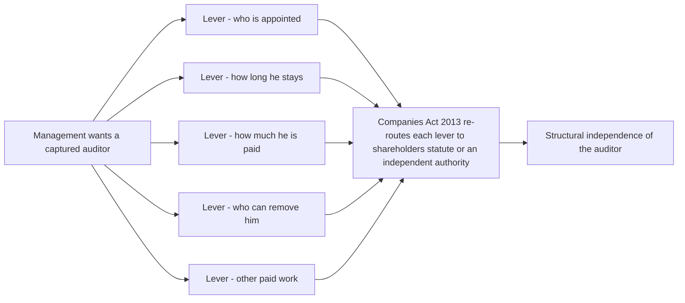
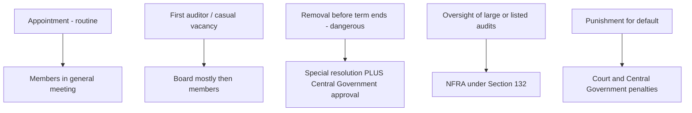
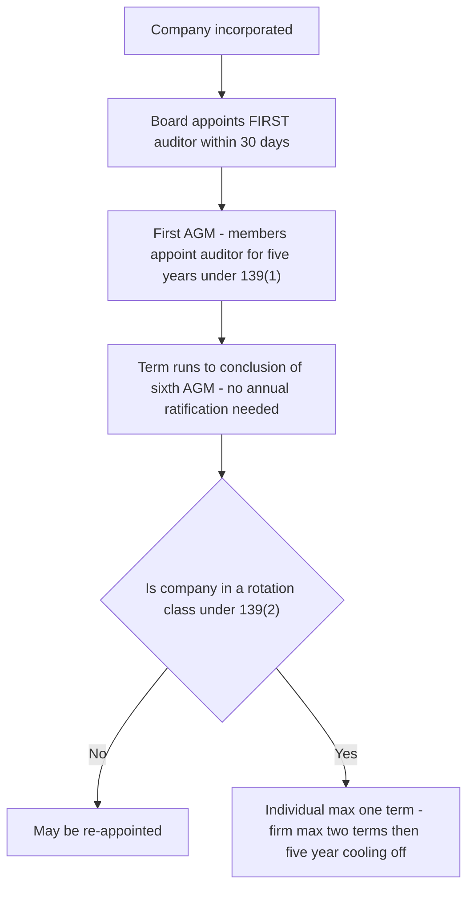
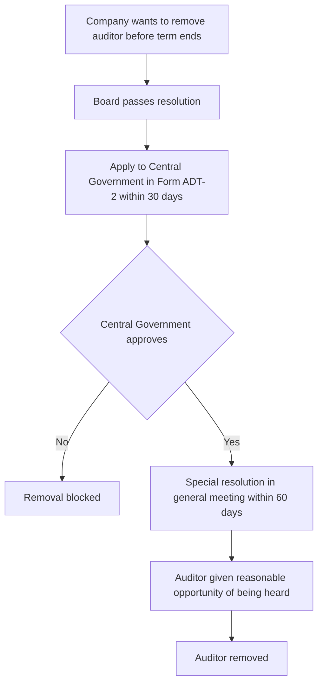

# Chapter 08 — Company Audit (Companies Act Provisions)

## 1. The Problem — Why an auditor who is *chosen and paid by the very people he audits* is a contradiction the law had to defuse

Every earlier chapter treated the audit as a technical exercise: gather evidence, assess risk, form an opinion. This chapter asks a colder, more structural question — **who decides whether an audit happens at all, who the auditor is, how long he stays, how much he is paid, and who can throw him out?** Because the answer to *those* questions determines whether the technical work is worth anything.

Return to the founding tension. Shareholders (owners) hand money to directors (managers) and go away. The auditor exists to tell the owners whether the managers' self-report is honest. But now watch the trap spring: in real corporate life it is the **managers** who run the day-to-day company, who interact with the auditor, who prepare the papers he inspects, and who — if left alone — would happily choose a friendly auditor, pay him well for silence, and sack him the moment he frowned at the accounts.

That is the whole problem in one sentence: **the person being watched must not be allowed to control the watchman.** An auditor who owes his appointment, his fee, and his survival to the management he is supposed to police is not independent — he is a hostage with a signature. The financial statements would carry a clean opinion that means nothing, and the owners, banks, employees, tax authorities and the investing public who rely on it would all be deceived by a document that *looks* assured.

So company audit cannot be left to private contract between a company and "some accountant." A private contract would be written by whoever holds the pen — the directors — and it would neuter the auditor. The **Companies Act, 2013 (Sections 139 to 148)** exists to wrench each of these control levers — appointment, tenure, eligibility, pay, removal, powers, permitted work — **out of the hands of the management and place them with the shareholders, an independent process, and the statute itself.** This chapter is the reading of those sections not as a list to memorise, but as a coordinated defence system, where **each section disarms one specific way management could capture the auditor.**

The risk this chapter counters is **auditor capture** — and every provision below is a bolt on a door the management would otherwise walk through.

---

## 2. The Core Idea — Independence is not a personal virtue; it is a *structure* the law engineers

Students think of independence as an attitude — "a good auditor is brave and objective." That is naive. Brave people still need to eat, and an auditor who can be starved or fired at management's whim will, on average, bend. The Companies Act does not rely on the auditor's character. It **engineers independence into the surrounding structure** so that even an ordinary auditor is protected enough to say "no."

There are two dimensions of independence the law is protecting, and it is worth naming them because the exam does:

- **Independence of mind** — the state that lets the auditor form an opinion without being affected by influences that compromise judgement.
- **Independence in appearance** — the avoidance of facts and circumstances so significant that a reasonable third party would *conclude* the auditor's objectivity was impaired.

The Act protects both by taking each lever of control that management could pull and re-routing it. The core idea is a single repeated move:

> **Identify a lever by which management could reward, punish, compromise or silence the auditor → take that lever away from management → give it to the shareholders, to a fixed statutory rule, or to an independent body (NFRA / Tribunal / Central Government).**

| Lever management would love to hold | How they'd abuse it | The section that removes it | Where the lever is re-routed |
|---|---|---|---|
| **Who is appointed** | Pick a compliant friend | **Sec 139** | Members in general meeting (Board only for first/casual) |
| **How long he stays** | Keep a captured man forever | **Sec 139(2) rotation** | Mandatory rotation by statute |
| **Who is *eligible*** | Appoint someone financially entangled with them | **Sec 141** | Statutory disqualification list |
| **How much he's paid** | Bribe with fees / starve with cuts | **Sec 142** | Fixed by members; disclosed |
| **Who can remove him** | Sack him when he objects | **Sec 140** | Special resolution + Central Government approval |
| **What he can see/ask** | Withhold records | **Sec 143** | Statutory right of access + duty to report |
| **What other lucrative work he does for them** | Buy silence via consulting fees | **Sec 144** | Prohibited-services list |
| **Whether anyone hears him** | Bury the report | **Sec 145–146** | Signing + reading at AGM |
| **Whether he faces consequences** | No cost to a lazy/complicit auditor | **Sec 147** | Punishment / penalties |

Read the whole chapter as this table expanded. Every technical rule you are about to meet is one row of it, explained.

*Figure 1 — Each control lever is pulled out of management's hands and re-routed; that re-routing IS the independence.*

---

## 3. Why it's built this way — Three design principles behind Sections 139–148

**(a) Public interest, not private contract.** A company's accounts are relied on by people who never signed any contract with it — minority shareholders, prospective investors, lenders, creditors, employees, tax authorities, the whole market. Because the *beneficiaries of the audit are the public*, the terms of the audit cannot be a private bargain the directors negotiate. This is why the audit is **compulsory for every company** regardless of size or profit (unlike a partnership, where audit is optional), and why the rules are **statutory and non-waivable**. You cannot contract out of Section 139.

**(b) Put the decision with the people whose money is at risk — the members.** The default appointer and remunerator is the **general meeting (the shareholders)**, not the Board. The Board acts only in narrow, time-critical gaps (the very first auditor, a mid-term casual vacancy) and even then is often overridden by the members shortly after. The logic is simple: the auditor works *for* the owners *against* the risk posed by managers, so the owners must be the ones who hire, pay and (with extra safeguards) fire him.

**(c) Where even shareholders could be dominated, add an independent gatekeeper.** In a closely held company the "members' meeting" may itself be controlled by the very directors who are the audit's subject. So for the most dangerous act — **removing an auditor before his term ends** — the Act refuses to trust even the shareholders alone; it demands a **special resolution AND the prior approval of the Central Government**. Similarly, oversight of the largest companies' auditors sits with **NFRA (Sec 132)**, and punishment sits with courts and the government. The further an act could harm the public, the more independent the body that must bless it.

*Figure 2 — Authority escalates with the danger of the act; routine hiring rests with owners, dangerous removal needs a state gatekeeper.*

---

## 4. Full Technical Content — Every section, its rule, and the capture it prevents

Each provision below is given as **the rule → the "why" (the abuse it blocks)**. All references are to the **Companies Act, 2013** unless stated; where a numeric detail should be re-checked against current ICAI material, it is flagged.

### 4.0 The map of the sections

| Section | Subject | The capture it blocks |
|---|---|---|
| **139** | Appointment (including first auditor, casual vacancy, rotation) | Management choosing/keeping a friendly auditor |
| **140** | Removal, resignation, special notice, NFRA action | Sacking the auditor who objects; silent exits |
| **141** | Eligibility, qualifications & disqualifications | Appointing someone financially entangled with the company |
| **142** | Remuneration | Bribery via fees / starvation via cuts |
| **143** | Powers and duties; the audit report; fraud reporting | Withholding records; a toothless report |
| **144** | Prohibited (non-audit) services | Buying silence through consulting income |
| **145** | Signing of reports | Anonymous/unaccountable opinions |
| **146** | Attendance at general meeting | Burying the report from members |
| **147** | Punishment for contravention | No consequence for a complicit/negligent auditor |
| **148** | Cost audit | Cost records manipulated in regulated industries |

### 4.1 Who must be an auditor — the qualification gate (Sec 141(1)–(2))

Only a **Chartered Accountant** (in practice) can be appointed auditor. A **firm** (including an **LLP**) may be appointed in the firm's name if the **majority of its partners practising in India are qualified CAs**; only the CA partners may act and sign. *Why:* the audit is a technical judgement about the fair presentation of accounts — the law restricts it to a person who has passed the professional gate and is subject to ICAI discipline, so that competence and an enforceable code of conduct sit behind every opinion.

### 4.2 Appointment of the first auditor (Sec 139(6) and 139(7))

The first auditor bridges the gap between incorporation and the first AGM, when no members' meeting has yet happened.

- **Non-Government company (139(6)):** the **Board** appoints the first auditor **within 30 days of registration**. If the Board fails, the **members** do so at an **extraordinary general meeting within 90 days**. The first auditor holds office **till the conclusion of the first AGM**.
- **Government company (139(7)):** the **Comptroller and Auditor-General of India (C&AG)** appoints within **60 days of registration**; failing which the **Board** within the next 30 days; failing which the **members** within 60 days at an EGM. Also holds office till the first AGM.

*Why the Board is allowed here:* there is simply no members' meeting yet to make the choice, and a company cannot run even for a day without an auditor of record. So the law lends the power to the Board **temporarily**, but deliberately makes the first auditor's term expire **at the very first AGM**, where the *members* take over — so management's temporary pick cannot harden into a permanent captive.

### 4.3 Appointment of subsequent auditors (Sec 139(1)) — the real appointment

At the **first AGM**, the **members** appoint an auditor to hold office **from the conclusion of that meeting until the conclusion of the sixth AGM** (i.e., for **five years**), subject to the rules below. The company must obtain the auditor's **written consent** and a **certificate that the appointment is within the limits and criteria of Sec 141** before appointing, and file **Form ADT-1** with the Registrar within **15 days**.

Two points the exam loves:

- **Annual ratification was originally required but the proviso mandating it was omitted by the Companies (Amendment) Act, 2017.** So a five-year appointment now runs its course **without annual ratification by members** (confirm the exact current wording in ICAI material). The auditor is thus not put up for a management-influenced re-vote every year — a genuine independence gain.
- The five-year appointment is **not** the same as rotation; it sets a *term*, while rotation (below) caps *how many such terms* a person may serve.

*Why members and not Board:* this is the true appointment, and it is placed with the owners — the auditor's principals — so the watchman is chosen by those he protects.

### 4.4 Rotation of auditors (Sec 139(2)–(4)) — the anti-familiarity engine

For **prescribed classes of companies** — broadly **listed companies and certain large public/private companies** (thresholds by paid-up capital / borrowings — *confirm current limits in ICAI material*) — mandatory rotation applies:

- An **individual** auditor may not serve **more than one term of five consecutive years**.
- An **audit firm** may not serve **more than two terms of five consecutive years** (i.e., 10 years).
- After the term ends, a **cooling-off period of five years** applies before that individual/firm can be re-appointed in the same company.
- Firms with **common partners** to the outgoing firm are also barred during cooling-off (to stop rotation on paper only).

*Why:* the deadliest threat to independence over time is the **familiarity/self-interest threat** — a long, cosy relationship where the auditor identifies with management, gets comfortable, and stops challenging. Rotation forces a **fresh, sceptical pair of eyes** at fixed intervals, and denies management the "our man for life" arrangement. It is prevention built into the calendar, not left to the auditor's willpower.

*Figure 3 — Appointment and rotation as a timeline of who holds the pen.*

### 4.5 Casual vacancy (Sec 139(8))

A **casual vacancy** (arising from **death, resignation, disqualification**, etc. mid-term) is filled:

- **Non-Government company:** by the **Board within 30 days**; but if the vacancy is due to **resignation**, the Board's appointment must also be **approved by the members at a general meeting within 3 months** of the Board's recommendation. The appointee holds office **till the next AGM**.
- **Government company:** by the **C&AG within 30 days**; failing which the **Board within the next 30 days**.

*Why the special treatment of resignation:* a **resignation** is exactly the event that may signal something is wrong — an auditor walking away from a dispute. So the law does not let the Board quietly slot in a replacement; it drags the choice into the **members' meeting** for approval, ensuring owners are alerted and involved precisely when the exit is suspicious.

### 4.6 Eligibility and disqualifications (Sec 141(3)) — the financial-entanglement filter

A person is **not eligible** for appointment as auditor if he is entangled with the company in ways that would compromise objectivity. The disqualifications include (key ones — verify the full current list in ICAI material):

- **(a)** a **body corporate** (except an LLP registered under the LLP Act);
- **(b)** an **officer or employee** of the company;
- **(c)** a **partner or employee** of an officer/employee of the company;
- **(d)** a person (or his relative/partner) who **holds any security or interest** in the company/its subsidiary/holding/associate — a **relative may hold securities up to face value ₹1,00,000** (*confirm threshold*); or is **indebted** to it beyond **₹5,00,000**; or has given a **guarantee** for another's debt to it beyond **₹1,00,000**;
- **(e)** a person or firm with a **business relationship** with the company (beyond arm's-length professional services);
- **(f)** a person whose **relative is a director or key managerial personnel** of the company;
- **(g)** a person in **full-time employment elsewhere**, or an auditor holding appointments in **more than 20 companies** (the ceiling — with specified exclusions);
- **(h)** a person **convicted of fraud** in the preceding **ten years**;
- **(i)** a person who **directly or indirectly renders prohibited services under Sec 144**.

**Sec 141(4):** if a disqualification is **incurred after appointment**, the auditor **vacates office**, and this is treated as a **casual vacancy**.

*Why:* independence in appearance and in mind both collapse if the auditor has money, employment, family or business skin in the game. If the auditor owns shares, he benefits from a flattering opinion; if he owes the company money, he can be squeezed; if his relative runs it, loyalty splits. The list is a **pre-emptive quarantine** — it removes the conflict *before* it can bias a single judgement, rather than trusting the auditor to resist temptation afterwards.

### 4.7 Remuneration (Sec 142)

The auditor's remuneration is **fixed by the members in general meeting**, or in such manner as the meeting may determine; the **Board may fix the first auditor's remuneration**. Remuneration **includes** the audit fee plus expenses incurred in connection with the audit and any facility extended, but **excludes** any sum paid for **other services** rendered at the company's request.

*Why:* fees are a two-edged lever. **Excessive** or contingent fees can *bribe* an auditor into silence; **arbitrary cuts** can *punish* a diligent one. Placing the fee decision with the **members** (the auditor's principals) and requiring **disclosure** keeps management from privately dangling money as reward or threat. The careful separation of audit fees from "other services" fees also foreshadows Sec 144 — the law wants the world to see how much non-audit money is flowing, because that money is where silence gets bought.

### 4.8 Removal, resignation and special notice (Sec 140) — the hardest door to open

This is the section that most directly defeats the "sack the auditor who objects" attack.

- **140(1) — Removal before expiry of term:** requires a **special resolution** of the company **AND the prior approval of the Central Government** (application in **Form ADT-2** within 30 days of the Board resolution; special resolution within 60 days of Central Government approval). The auditor must be given a **reasonable opportunity of being heard**.
- **140(2)–(3) — Resignation:** a resigning auditor must file a **statement (Form ADT-3)** with the company and the Registrar (and the C&AG for Government companies) **within 30 days**, giving the **reasons and other facts** relevant to the resignation. Failure attracts a **penalty**.
- **140(4) — Special notice for not re-appointing the retiring auditor:** where a resolution at an AGM proposes to appoint **someone other than the retiring auditor** (or to expressly not re-appoint him), **special notice** is required; the retiring auditor is entitled to **make written representations and have them circulated** to members / read at the meeting.
- **140(5) — Tribunal-ordered removal:** the **NCLT**, on its own or on application (including by the Central Government), may order a **change of auditor** if satisfied the auditor has acted **fraudulently or colluded** in fraud; such an auditor is **debarred for five years** and faces Sec 447 liability.

*Why each safeguard exists:*
- **The double lock on removal (special resolution + Central Government)** exists because premature removal is the classic retaliation against an honest auditor. Even a shareholder vote is not trusted alone, because in a promoter-dominated company the vote *is* management. The **Central Government** is inserted as an independent check that asks: is this a genuine reason, or is an inconvenient auditor being purged?
- **The resignation statement (ADT-3)** exists because a silent exit is a wasted warning. If an auditor is leaving because of a dispute over the accounts, the owners and the Registrar deserve to know **why**. Forcing him to record the reasons converts a quiet disappearance into a public signal.
- **Special notice + right of representation** exists so that management cannot simply *not re-appoint* an auditor and slide in a friendlier one without the members hearing the outgoing auditor's side.
- **The Tribunal power** exists for the opposite failure — an auditor who is *too* cosy — arming an independent body to eject and bar a complicit auditor.

*Figure 4 — Removing an auditor before term-end is deliberately made hard; every arrow is a safeguard against retaliation.*

### 4.9 Powers and duties (Sec 143) — giving the watchman eyes and a voice

An auditor with no right to see the records, or whose report no one need heed, would be ornamental. Section 143 arms him.

**Powers / rights (143(1)):**
- A **right of access at all times** to the **books, accounts and vouchers** of the company, **wherever kept**, and to **branch** records.
- A right to **require information and explanations** from officers, on matters including (illustratively) whether loans/advances are properly secured and terms not prejudicial; whether transactions are merely book entries; whether personal expenses have been charged to revenue, etc.

**Duties — the report (143(2)–(3)):** the auditor must report to the members on the accounts examined and on every financial statement laid before the company, stating whether they give a **true and fair view**. Sec **143(3)** lists the matters the report must **expressly state**, including (key ones):
- whether he **obtained all information and explanations** necessary;
- whether **proper books of account** have been kept and proper returns received from branches;
- whether the accounts **agree with the books and returns**;
- whether the financial statements **comply with accounting standards**;
- **observations/qualifications** having an adverse effect on functioning;
- whether any **director is disqualified** under Sec 164(2);
- **adequacy and operating effectiveness of internal financial controls** (for applicable companies);
- other matters prescribed under **Rule 11** (e.g., pending litigation impact, foreseeable losses on long-term contracts, dividends, and specified disclosures).

**Duty to report fraud (143(12)):** if, in the course of the audit, the auditor has **reason to believe an offence of fraud** involving the company by its officers/employees is being/has been committed, he must **report it** — to the **Central Government** if the amount is **₹1 crore or above** (via the Board/Audit Committee then Form ADT-4 within prescribed timelines), and to the **Board/Audit Committee** for amounts **below ₹1 crore** (with disclosure in the Board's report). Statutorily mandated fraud reporting made in good faith is **protected** and is **not a breach of confidentiality**.

**143(9)–(10):** the auditor must **comply with the auditing standards (SAs)**, which the Central Government prescribes (recommended by NFRA/ICAI).

**C&AG and Government companies (143(5)–(7)):** for Government companies the C&AG may **direct** the manner of audit, receive the report, and conduct a **supplementary audit** and **test audit**; comments of the C&AG are placed before the members.

*Why:* rights of access exist because you cannot audit what you are not allowed to see — without a statutory right, management could simply withhold the damning ledger. The prescribed report contents exist so the opinion is not a vague blessing but answers **specific public-interest questions** (are the books proper? do they comply with standards? are controls effective?). And **fraud reporting** flips the auditor from a passive reporter to an active whistle-blower, because the people best placed to spot management fraud early are the auditors — the law refuses to let them look away and hide behind "confidentiality."

### 4.10 Prohibited (non-audit) services (Sec 144) — cutting off the silence-bribe

The auditor (whether individual, firm, or through any associated entity) must **not** render, to the company / its holding / subsidiary, certain **non-audit services**, including:
- **accounting and book-keeping**;
- **internal audit**;
- **design and implementation of financial information systems**;
- **actuarial services**;
- **investment advisory / investment banking**;
- **rendering of outsourced financial services**;
- **management services**; and
- **any other service prescribed**.

*Why:* the most modern route to auditor capture is not a crude bribe — it is a **lucrative consulting relationship**. If the audit firm earns huge non-audit fees from the same client, it develops a powerful incentive to keep the client happy and not jeopardise the relationship with an awkward audit opinion — the **self-interest threat**. Worse, some prohibited services create a **self-review threat**: if the auditor *built* the accounting system or *did* the book-keeping, he would be **auditing his own work** and could never be objective about it. Section 144 severs these entanglements at the root, keeping the audit relationship clean and single-purpose.

### 4.11 Signing of audit reports (Sec 145)

The auditor (or the CA partner authorised to act) must **sign the audit report**, and any **qualifications, observations or comments** on financial matters that have an adverse effect on the functioning of the company must be **read out at the AGM** and be **open to inspection** by members. *Why:* a signature attaches **personal accountability** to the opinion — the auditor cannot hide behind the firm's name or issue an anonymous blessing. Requiring qualifications to be aired means an **adverse note cannot be quietly buried** in an appendix no one reads; the owners hear the bad news.

### 4.12 Attendance at general meeting (Sec 146)

**All notices and communications** relating to any general meeting must be **sent to the auditor**, and the auditor (unless exempted by the company) must **attend** the meeting either personally or through an authorised representative (who must be qualified to be an auditor), and has the **right to be heard** on any part of the business that concerns him. *Why:* the auditor's principals are the members, and the AGM is where they gather. If the auditor could be kept away, management could present the accounts and answer questions with no independent voice in the room. Section 146 guarantees the members can **look the auditor in the eye and ask him directly** — closing the gap through which a captured management would otherwise control the narrative.

### 4.13 Punishment for contravention (Sec 147)

- **Company and officers in default** who contravene Sec 139–146 face **fines** (company) and **fine and/or imprisonment** (officers) — *confirm current amounts in ICAI material*.
- **Auditor** who contravenes Sec 139, 143, 144 or 145 faces a **fine** (a minimum, scaling up to a cap or four times the audit fee, whichever lower); if the contravention was **wilful and intended to deceive**, **imprisonment up to one year and a higher fine**, and the auditor must **refund the audit fee** and **pay for damages** to the company/others for loss arising from an incorrect/misleading statement.
- In a **firm**, where the **partners acted fraudulently or colluded**, the **liability (civil and criminal) is joint and several** for those partners.

*Why:* every safeguard above is toothless without a cost for breaching it. Punishment converts the duties from moral exhortations into **enforceable obligations** — it prices in a real consequence for the negligent or complicit auditor and for a management that games the appointment machinery, so that the cheapest path is genuinely to comply.

### 4.14 Cost audit (Sec 148)

For **specified classes of companies** engaged in the **production of goods or provision of services** (as notified — regulated/strategic industries such as certain manufacturing, utilities, pharma, etc.), the Central Government may direct that **cost records** be maintained and that a **cost audit** be conducted by a **Cost Accountant** (member of ICMAI) appointed by the **Board** (remuneration ratified by members). The cost auditor's report goes to the Board and, in prescribed cases, to the Central Government; the **cost auditor is subject to the same duties and disqualification logic** as a financial auditor, and the **financial (statutory) auditor cannot be the cost auditor**.

*Why:* in **regulated and price-sensitive industries**, the **cost** at which goods/services are produced is a matter of public interest — it underpins **tariff setting, anti-profiteering, subsidy claims and taxation**. Companies have an incentive to misstate costs (inflate them to justify higher prices/subsidies, or manipulate them for tax). A separate, independent cost audit puts an expert eye on the **cost records** specifically, addressing a risk the financial audit is not designed to police. Keeping the cost auditor **separate from the statutory auditor** preserves independence and avoids self-review across the two mandates.

### 4.15 Branch audit (Sec 143(8))

Where a company has a **branch office**, its accounts may be audited by the **company's (principal) auditor** or by **another person qualified to be appointed as auditor** — the **branch auditor** — appointed under Sec 139. The **branch auditor prepares a report** on the branch accounts and **sends it to the principal (company) auditor**, who **deals with it in his report in the manner he considers necessary**. For a **foreign branch**, the audit may be done by the company's auditor or by a person duly qualified under the **laws of that foreign country**. The **principal auditor is not liable** for the work of the branch auditor merely by using it, **provided** he deals with the branch report appropriately (mirroring the SA 600 logic on using another auditor's work).

*Why:* a large company may have branches across the country or the world that the principal auditor cannot physically reach for every count and check. Allowing a **local branch auditor** ensures the branch's records are examined by someone with access, while requiring the report to flow **up to the principal auditor** — who must consciously **consider and integrate** it — keeps a **single point of accountability** for the company-wide opinion. It balances practicality (local coverage) against unity of responsibility (one auditor answers to the members).

---

## 5. Applied Scenarios (exam-style)

**Scenario A — The friendly re-appointment that never happened properly.**
*Xylo Ltd, a listed company, has had M/s Rao & Co. as auditors for the last 11 continuous years. The Board proposes them for another year. Comment.*
**Analysis:** Xylo is a listed company, so **rotation under Sec 139(2)** applies. An **audit firm may serve a maximum of two terms of five consecutive years (10 years)**. Eleven years already breaches the cap; re-appointment is **invalid**, and a **five-year cooling-off** must follow before Rao & Co. (or a firm with common partners) can return. The *reason* the examiner is testing: rotation exists to break the **familiarity threat** that an 11-year relationship epitomises. The Board's comfort with the incumbent is exactly the danger, not a justification.

**Scenario B — The auditor who asked too many questions.**
*During the audit of Kavia Pvt Ltd, the auditor CA P raises concerns about related-party loans. The Board, irritated, passes a resolution at a Board meeting removing him and appoints CA Q the same day. Is the removal valid?*
**Analysis:** No. Removal **before expiry of term** is governed by **Sec 140(1)** and requires (i) **prior approval of the Central Government** (Form ADT-2 within 30 days of the Board resolution), (ii) a **special resolution** of members, and (iii) a **reasonable opportunity for the auditor to be heard**. A same-day Board removal satisfies **none** of these. The *reason*: the double lock exists **precisely** to stop retaliatory sacking of an auditor who raises uncomfortable findings — the fact pattern is the textbook abuse the section blocks. CA Q's appointment is void.

**Scenario C — The lucrative side deal.**
*M/s Bright & Co. are statutory auditors of Neon Ltd. Neon also engages them to design and implement its new financial reporting software for a fee three times the audit fee. Permissible?*
**Analysis:** No. **Sec 144** prohibits the auditor from rendering **"design and implementation of any financial information system"** to the audit client. Two threats bite: a **self-interest threat** (the large non-audit fee incentivises keeping Neon happy) and a **self-review threat** (Bright & Co. would later be auditing accounts produced by a system they built). Rendering a prohibited service also **disqualifies** them under **Sec 141(3)(i)**. They must decline the software engagement to remain eligible as auditors.

**Scenario D — The quiet resignation.**
*The auditor of Mango Pvt Ltd resigns mid-year after a dispute over revenue cut-off and simply stops responding. What are the obligations?*
**Analysis:** Under **Sec 140(2)–(3)** the resigning auditor **must file Form ADT-3** stating the **reasons and relevant facts** with the company and the Registrar **within 30 days**; failure attracts a **penalty**. The resulting **casual vacancy (Sec 139(8))** must be filled by the Board **and, because it arises from resignation, approved by members in general meeting within 3 months**. The *reason*: a resignation over a cut-off dispute is a **red flag**; the law forces the reasons into the open and pulls the replacement decision to the members, so a suspicious exit cannot be swept aside.

**Scenario E — First-year gap.**
*Zephyr Ltd was incorporated on 1 April; by 15 May no auditor had been appointed. Who acts, and by when?*
**Analysis:** Under **Sec 139(6)**, the **Board must appoint the first auditor within 30 days of registration** (i.e., by 30 April). Having missed that, the power passes to the **members**, who must appoint at an **EGM within 90 days**. The first auditor then holds office **until the conclusion of the first AGM**. *Reason:* the temporary Board power is a stopgap so the company is never without an auditor, but it expires at the first AGM where the owners take control.

---

## 6. Procedure / Documentation Summary

**Before accepting an appointment, the auditor must:**
1. Confirm he is **qualified and not disqualified** under **Sec 141** (no security/interest, indebtedness within limits, no business relationship, relative not a director/KMP, ceiling of 20 company audits not breached, no prohibited service under Sec 144).
2. Obtain the company's compliance with **Sec 139** — check whether it is a **rotation-class** company and whether tenure/cooling-off permits appointment.
3. Give **written consent** and a **certificate** that the appointment satisfies Sec 141 limits.
4. Ensure the company files **Form ADT-1** with the Registrar within **15 days**.

**Key forms and timelines (memorise the pairing of form to event):**

| Event | Form | Who files / when |
|---|---|---|
| Appointment of auditor | **ADT-1** | Company, within 15 days |
| Application for removal before term | **ADT-2** | Company to Central Government, within 30 days of Board resolution |
| Resignation statement | **ADT-3** | Auditor to company & Registrar, within 30 days |
| Fraud report to Central Government (≥₹1 crore) | **ADT-4** | Auditor, within prescribed time |

**What the auditor documents (SA 230 link):** the eligibility check and disqualification declaration; the engagement letter and consent/certificate; the appointment resolution and ADT-1; assessment of rotation applicability and tenure; remuneration approved; any communication on removal/resignation and the reasons; the reasoning behind the report contents under Sec 143(3) and Rule 11; and, where relevant, fraud-reporting steps under 143(12). *Why:* these are statutory obligations whose **breach is punishable (Sec 147)** — the file must prove each was met.

---

## 7. Connections

- **Sec 132 (NFRA):** the independent oversight body for auditors of large/listed companies — monitoring compliance, investigating misconduct, and recommending accounting/auditing standards. It sits *above* the individual-company safeguards as the systemic watchdog.
- **SA 200 / Code of Ethics:** the *concept* of independence (of mind and appearance) and the five threats — self-interest, self-review, advocacy, familiarity, intimidation — are the **conceptual layer**; Sections 139–148 are the **statutory hard-wiring** of that concept. Sec 144 = self-interest/self-review; Sec 139(2) rotation = familiarity; Sec 140 double-lock = intimidation.
- **SA 210 (Terms of Engagement):** the engagement letter operationalises the appointment made under Sec 139.
- **SA 240 (Fraud):** dovetails with the **Sec 143(12)** duty to report fraud.
- **SA 600 (Using the Work of Another Auditor):** governs how the principal auditor deals with the **branch auditor's** report under **Sec 143(8)**.
- **SA 700/705/706 (Reporting):** the *format and opinion types* of the report whose *contents and signing* are mandated by **Sec 143 and 145**.
- **Sec 164(2) (Director disqualification):** the auditor must report on it under Sec 143(3).
- **CARO (Companies (Auditor's Report) Order):** a Central-Government order **expanding the matters** on which the auditor must report, layered on top of Sec 143(3).

---

## 8. Traps & Examiner Tricks

- **First auditor's term.** The first auditor holds office **till the conclusion of the first AGM** — *not* for five years, and *not* till the next Board meeting. Students routinely give him a five-year term.
- **Board's 30 days ≠ members' 90 days.** For the first auditor (non-Govt), the **Board** has **30 days**; only on Board failure do the **members** get **90 days** (at an EGM). Do not merge the two.
- **Rotation counts: individual = 1 term (5 yrs), firm = 2 terms (10 yrs).** Reversing these, or applying rotation to *every* company (it applies only to the **prescribed classes**), is a classic error.
- **Annual ratification is GONE.** The proviso requiring members to ratify the appointment at every AGM was **omitted by the 2017 Amendment**. Saying "must be ratified annually" is now wrong (confirm in ICAI material).
- **Casual vacancy by resignation needs members' approval.** A casual vacancy is normally filled by the Board within 30 days — **but if caused by resignation**, members must **approve within 3 months**. The resignation carve-out is the tested point.
- **Removal needs BOTH special resolution AND Central Government approval.** Many write only one. Both are mandatory, plus a hearing. Distinguish this from **not re-appointing** a retiring auditor (Sec 140(4)), which needs **special notice** and a **right of representation**, not Central Government approval.
- **Sec 141 thresholds.** Relative may hold securities up to **face value ₹1,00,000**; indebtedness limit **₹5,00,000**; guarantee limit **₹1,00,000**; audit ceiling **20 companies** (with exclusions). Precise figures are examinable — *confirm current values*.
- **Disqualification after appointment = vacation of office (141(4))**, treated as a **casual vacancy** — not merely "he should resign."
- **Prohibited services are absolute for the audit client (and its holding/subsidiary).** "But the fee was small / it was a different department" is no defence — Sec 144 is a bright-line list.
- **Fraud reporting threshold.** **≥ ₹1 crore → Central Government** (Form ADT-4); **< ₹1 crore → Board/Audit Committee** with disclosure in Board's report. Getting the threshold or the recipient wrong is common.
- **Cost auditor ≠ statutory auditor.** The **statutory (financial) auditor cannot also be the cost auditor** (Sec 148); the cost auditor is a **Cost Accountant (ICMAI)** appointed by the **Board**.
- **Branch auditor reports to the principal auditor, who "deals with it as necessary" — he is not automatically liable** for the branch auditor's work if he handles the report properly.
- **Only members appoint the *subsequent* auditor.** Board appointment is confined to the **first auditor** and **casual vacancies** (with the resignation caveat). Any exam fact where the Board "appoints the auditor at the AGM" is a trap.

---

## 9. First-Principles Recap

Company audit is the shareholders' answer to a problem they cannot solve themselves: the managers who run the company also write the report on the company, and the managers would, if allowed, choose, pay, protect and (when it suited them) silence the very auditor meant to check them. The audit is worthless unless the auditor is independent — and independence is not something the law can order into the auditor's heart, so it **engineers it into the structure around him.**

Every section of the company-audit regime is one lever of control taken out of management's hands. **Who is appointed** goes to the **members** (Sec 139), with the Board allowed only a temporary stopgap for the first auditor and casual vacancies. **How long he stays** is capped by **rotation** (Sec 139(2)) to break the familiarity that corrodes scepticism over time. **Who may serve** is filtered by a **disqualification list** (Sec 141) that quarantines financial, employment and family entanglements before they can bias a judgement. **How much he's paid** is set by the **members** and disclosed (Sec 142), so fees cannot be a private bribe or punishment. **Whether he can be removed** is guarded by a **double lock — special resolution plus Central Government approval** (Sec 140) — because premature removal is the classic retaliation against honesty, and even a promoter-dominated shareholder vote is not trusted alone. **What he can see and must say** is fixed by statute (Sec 143), giving him a right of access and a report that must answer specific public-interest questions, plus a duty to blow the whistle on fraud. **What else he may sell the client** is fenced by the **prohibited-services list** (Sec 144), cutting off the modern silence-bribe of lucrative consulting and the self-review of auditing his own handiwork. **Whether anyone hears him** is secured by **signing and reading at the AGM** (Sec 145–146). And **whether any of it has teeth** is answered by **punishment** (Sec 147). Around the edges, **cost audit** (Sec 148) polices costs in regulated industries the financial audit was never built to check, and **branch audit** (Sec 143(8)) extends reach without fracturing accountability.

Read that way, Sections 139–148 are not ten disconnected rules to memorise. They are a **single coordinated defence against auditor capture**, and once you can name the capture each one blocks, you can reconstruct the whole regime from first principles — which is the only way to answer a fact pattern you have never seen before.

---

## 10. Quick-Revision Sheet

**Section-to-purpose map**

| Sec | Rule (one line) | Capture it blocks |
|---|---|---|
| **139(6)/(7)** | First auditor: Board within 30 days (Govt: C&AG within 60); holds office till 1st AGM | Company running without an auditor; temporary pick becoming permanent |
| **139(1)** | Members appoint at 1st AGM for 5 yrs (to 6th AGM); ADT-1 in 15 days; **no annual ratification** | Board choosing a friendly auditor |
| **139(2)** | Rotation (prescribed cos): individual **1 term (5 yr)**, firm **2 terms (10 yr)**, 5-yr cooling-off | Familiarity threat from a lifelong auditor |
| **139(8)** | Casual vacancy: Board in 30 days; **if by resignation, members approve in 3 months** | Quiet insertion of a replacement after a suspicious exit |
| **140(1)** | Removal before term: **special resolution + Central Government approval + hearing** (ADT-2) | Retaliatory sacking of an honest auditor |
| **140(2)/(3)** | Resignation statement (**ADT-3**) with reasons in 30 days; penalty on default | Silent exit hiding a dispute |
| **140(4)** | Not re-appointing retiring auditor: **special notice + right of representation** | Sliding in a friendlier auditor without members hearing the incumbent |
| **140(5)** | NCLT may remove a **fraudulent/colluding** auditor; 5-yr debarment | A captured, complicit auditor |
| **141** | Only CA/eligible firm; disqualifications (security/interest, indebtedness >₹5L, relative director/KMP, >20 cos, prohibited service) | Financial/family/employment entanglement |
| **142** | Remuneration fixed by **members**; separate from other-service fees | Bribery via fees / punitive cuts |
| **143(1)** | Right of access at all times to books/vouchers, incl. branches; require info | Withholding of records |
| **143(3)+Rule 11** | Report must state true & fair, proper books, AS compliance, IFC, director disqualification, etc. | A vague, toothless opinion |
| **143(12)** | Report fraud: **≥₹1 cr → Central Govt (ADT-4)**; **<₹1 cr → Board/Audit Committee** | Auditor looking away from management fraud |
| **144** | No accounting, internal audit, IT system design, actuarial, investment/mgmt services to client | Silence-bribe via non-audit fees; self-review |
| **145** | Auditor **signs**; qualifications **read at AGM** | Anonymous opinion; buried qualifications |
| **146** | Notices sent to auditor; **must attend AGM**; right to be heard | Keeping the auditor away from members |
| **147** | Fines/imprisonment for auditor, officers, company; refund fee + damages; joint & several for colluding partners | No cost for default |
| **148** | Cost audit by **Cost Accountant (ICMAI)**, Board-appointed; **not the statutory auditor** | Manipulated cost records in regulated industries |
| **143(8)** | Branch audit by principal or branch auditor; report flows **up** to principal | Unaudited branches; fractured accountability |

**Forms:** ADT-1 (appointment, 15 days) · ADT-2 (removal application to Central Government, 30 days) · ADT-3 (resignation, 30 days) · ADT-4 (fraud ≥₹1 cr).

**Key numbers:** First auditor Board **30 days** / members **90 days** / Govt C&AG **60 days**. Term **5 yrs to 6th AGM**. Rotation **5 / 10 yrs**, cooling-off **5 yrs**. Audit ceiling **20 companies**. Indebtedness **₹5,00,000**; relative security **₹1,00,000**; guarantee **₹1,00,000**. Fraud threshold **₹1 crore**. *(Confirm all current figures/thresholds and rotation-class limits in ICAI material.)*

**One-line memory hooks**
- *The watched must never control the watchman — that is all of 139 to 148.*
- *Members hire and pay; the Board only bridges gaps; the state must bless a removal.*
- *Rotation kills familiarity by the calendar, not by willpower.*
- *Section 141 quarantines the conflict before it can bias; Section 144 cuts the silence-bribe.*
- *A signature is accountability; reading at the AGM is refusing to bury the bad news.*
- *No safeguard has teeth without Section 147.*
