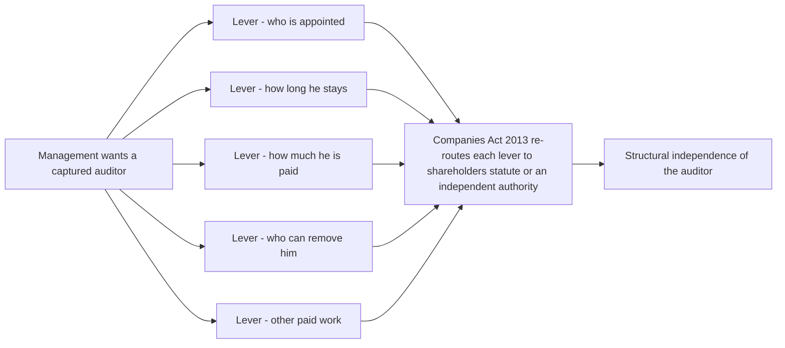
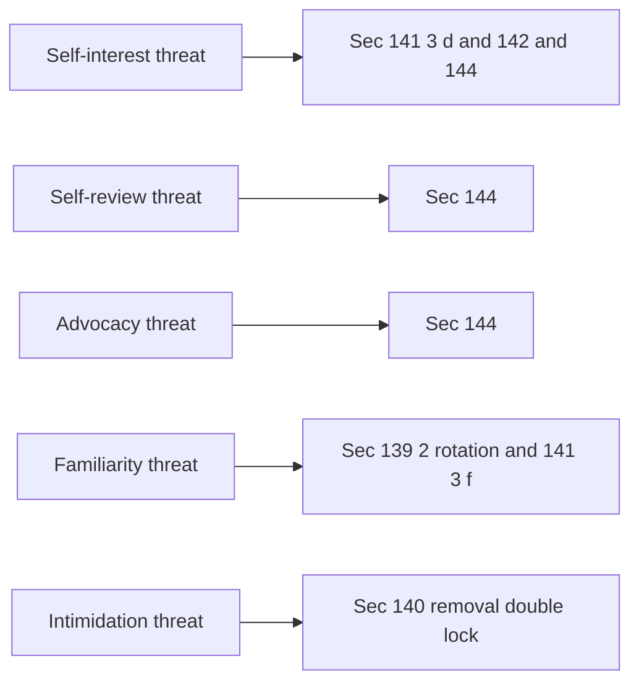
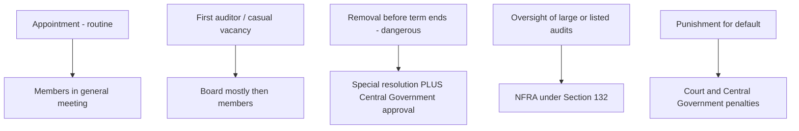
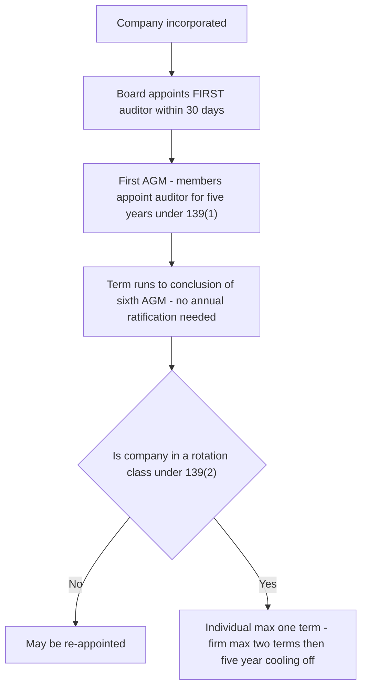
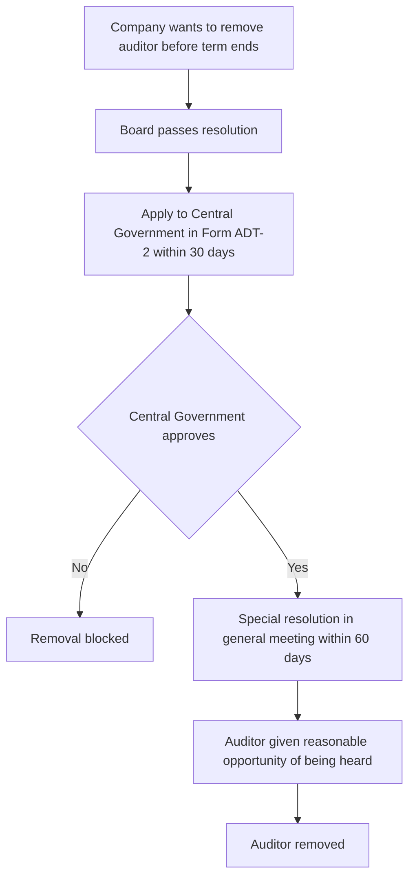
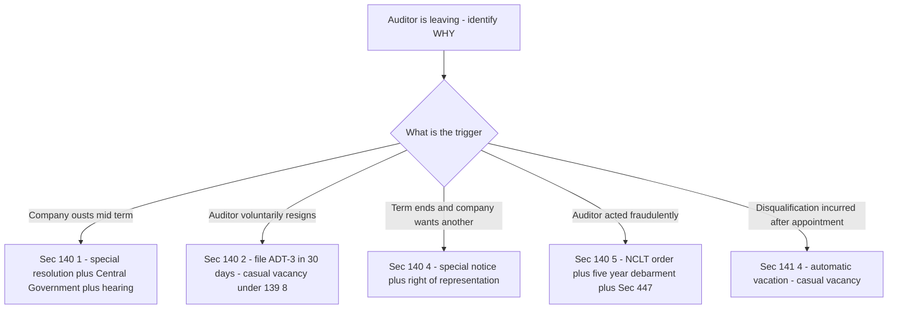

<!-- v2-deep -->

# Chapter 08 — Company Audit (Companies Act Provisions)

## 1. The Problem — Why an auditor who is *chosen and paid by the very people he audits* is a contradiction the law had to defuse

Every earlier chapter treated the audit as a technical exercise: gather evidence, assess risk, form an opinion. This chapter asks a colder, more structural question — **who decides whether an audit happens at all, who the auditor is, how long he stays, how much he is paid, and who can throw him out?** Because the answer to *those* questions determines whether the technical work is worth anything.

Return to the founding tension. Shareholders (owners) hand money to directors (managers) and go away. The auditor exists to tell the owners whether the managers' self-report is honest. But now watch the trap spring: in real corporate life it is the **managers** who run the day-to-day company, who interact with the auditor, who prepare the papers he inspects, and who — if left alone — would happily choose a friendly auditor, pay him well for silence, and sack him the moment he frowned at the accounts.

That is the whole problem in one sentence: **the person being watched must not be allowed to control the watchman.** An auditor who owes his appointment, his fee, and his survival to the management he is supposed to police is not independent — he is a hostage with a signature. The financial statements would carry a clean opinion that means nothing, and the owners, banks, employees, tax authorities and the investing public who rely on it would all be deceived by a document that *looks* assured.

So company audit cannot be left to private contract between a company and "some accountant." A private contract would be written by whoever holds the pen — the directors — and it would neuter the auditor. The **Companies Act, 2013 (Sections 139 to 148)** exists to wrench each of these control levers — appointment, tenure, eligibility, pay, removal, powers, permitted work — **out of the hands of the management and place them with the shareholders, an independent process, and the statute itself.** This chapter is the reading of those sections not as a list to memorise, but as a coordinated defence system, where **each section disarms one specific way management could capture the auditor.**

The risk this chapter counters is **auditor capture** — and every provision below is a bolt on a door the management would otherwise walk through.

**Why the statute, and not just professional ethics, has to do this.** The ICAI Code of Ethics already tells the auditor to be independent. So why did Parliament bother re-legislating it in Sections 139–148? Because ethics binds only the *auditor* — it has no grip on the *company*. A code of conduct can discipline an auditor who takes a bribe, but it cannot stop a Board from refusing to re-appoint an honest auditor, cannot force the company to give him access to books, and cannot compel members to be told why he resigned. Independence has **two sides** — the auditor's willingness to be independent, and the company's inability to punish him for it — and only *statute* can bind the second side, because only statute can impose obligations on the company, its directors, and even the Central Government. Read this way, the Code of Ethics governs the auditor's *mind* while the Companies Act governs the *company's power over him*; the two are complementary halves of a single defence.

---

## 2. The Core Idea — Independence is not a personal virtue; it is a *structure* the law engineers

Students think of independence as an attitude — "a good auditor is brave and objective." That is naive. Brave people still need to eat, and an auditor who can be starved or fired at management's whim will, on average, bend. The Companies Act does not rely on the auditor's character. It **engineers independence into the surrounding structure** so that even an ordinary auditor is protected enough to say "no."

There are two dimensions of independence the law is protecting, and it is worth naming them because the exam does:

- **Independence of mind** — the state that lets the auditor form an opinion without being affected by influences that compromise judgement.
- **Independence in appearance** — the avoidance of facts and circumstances so significant that a reasonable third party would *conclude* the auditor's objectivity was impaired.

The Act protects both by taking each lever of control that management could pull and re-routing it. The core idea is a single repeated move:

> **Identify a lever by which management could reward, punish, compromise or silence the auditor → take that lever away from management → give it to the shareholders, to a fixed statutory rule, or to an independent body (NFRA / Tribunal / Central Government).**

| Lever management would love to hold | How they'd abuse it | The section that removes it | Where the lever is re-routed |
|---|---|---|---|
| **Who is appointed** | Pick a compliant friend | **Sec 139** | Members in general meeting (Board only for first/casual) |
| **How long he stays** | Keep a captured man forever | **Sec 139(2) rotation** | Mandatory rotation by statute |
| **Who is *eligible*** | Appoint someone financially entangled with them | **Sec 141** | Statutory disqualification list |
| **How much he's paid** | Bribe with fees / starve with cuts | **Sec 142** | Fixed by members; disclosed |
| **Who can remove him** | Sack him when he objects | **Sec 140** | Special resolution + Central Government approval |
| **What he can see/ask** | Withhold records | **Sec 143** | Statutory right of access + duty to report |
| **What other lucrative work he does for them** | Buy silence via consulting fees | **Sec 144** | Prohibited-services list |
| **Whether anyone hears him** | Bury the report | **Sec 145–146** | Signing + reading at AGM |
| **Whether he faces consequences** | No cost to a lazy/complicit auditor | **Sec 147** | Punishment / penalties |

Read the whole chapter as this table expanded. Every technical rule you are about to meet is one row of it, explained.

**Map the five ethical "threats" onto the sections — the examiner's favourite bridge.** SA 200 / the Code of Ethics name five threats to independence. Each of the statutory sections is the *hard-wiring* of a defence against one or more of them. Being able to say "Sec X blocks threat Y" is what separates a rote answer from a conceptual one:

| Threat (Code of Ethics) | What it means | Section(s) that hard-wire the defence |
|---|---|---|
| **Self-interest** | Auditor gains financially from a favourable opinion | 141(3)(d) (shareholding/indebtedness), 142 (fees), 144 (non-audit fees) |
| **Self-review** | Auditor evaluating his own earlier work | 144 (accounting, IT-system design, internal audit) |
| **Advocacy** | Auditor promoting the client's position | 144 (investment banking/advisory) |
| **Familiarity** | Long, cosy relationship dulls scepticism | 139(2) rotation, 141(3)(f) (relative as director/KMP) |
| **Intimidation** | Threat of removal/punishment pressures the auditor | 140(1) double-lock on removal, 140(4) right of representation |

*Figure 1 — Each control lever is pulled out of management's hands and re-routed; that re-routing IS the independence.*

*Figure 1A — The five ethical threats map onto specific statutory sections; the exam rewards naming the pairing.*

---

## 3. Why it's built this way — Three design principles behind Sections 139–148

**(a) Public interest, not private contract.** A company's accounts are relied on by people who never signed any contract with it — minority shareholders, prospective investors, lenders, creditors, employees, tax authorities, the whole market. Because the *beneficiaries of the audit are the public*, the terms of the audit cannot be a private bargain the directors negotiate. This is why the audit is **compulsory for every company** regardless of size or profit (unlike a partnership, where audit is optional), and why the rules are **statutory and non-waivable**. You cannot contract out of Section 139.

**(b) Put the decision with the people whose money is at risk — the members.** The default appointer and remunerator is the **general meeting (the shareholders)**, not the Board. The Board acts only in narrow, time-critical gaps (the very first auditor, a mid-term casual vacancy) and even then is often overridden by the members shortly after. The logic is simple: the auditor works *for* the owners *against* the risk posed by managers, so the owners must be the ones who hire, pay and (with extra safeguards) fire him.

**(c) Where even shareholders could be dominated, add an independent gatekeeper.** In a closely held company the "members' meeting" may itself be controlled by the very directors who are the audit's subject. So for the most dangerous act — **removing an auditor before his term ends** — the Act refuses to trust even the shareholders alone; it demands a **special resolution AND the prior approval of the Central Government**. Similarly, oversight of the largest companies' auditors sits with **NFRA (Sec 132)**, and punishment sits with courts and the government. The further an act could harm the public, the more independent the body that must bless it.

**(d) A fourth, quieter principle — everything must be *visible*.** Look again and you will notice the Act does not just relocate levers; it forces each act into daylight. Appointment is filed publicly (ADT-1). Removal needs a public application (ADT-2). Resignation must state reasons on the public record (ADT-3). Qualifications must be *read aloud* at the AGM (Sec 145). Non-audit fees are separated and disclosed (Sec 142). The design bet is that **sunlight deters capture**: an abuse that must be disclosed is an abuse a rational promoter is less willing to attempt, because the disclosure itself is the evidence against him. Independence is protected not only by re-routing power but by making its exercise *observable*.

*Figure 2 — Authority escalates with the danger of the act; routine hiring rests with owners, dangerous removal needs a state gatekeeper.*

---

## 4. Full Technical Content — Every section, its rule, and the capture it prevents

Each provision below is given as **the rule → the "why" (the abuse it blocks)**. All references are to the **Companies Act, 2013** unless stated; where a numeric detail should be re-checked against current ICAI material, it is flagged.

### 4.0 The map of the sections

| Section | Subject | The capture it blocks |
|---|---|---|
| **139** | Appointment (including first auditor, casual vacancy, rotation) | Management choosing/keeping a friendly auditor |
| **140** | Removal, resignation, special notice, NFRA action | Sacking the auditor who objects; silent exits |
| **141** | Eligibility, qualifications & disqualifications | Appointing someone financially entangled with the company |
| **142** | Remuneration | Bribery via fees / starvation via cuts |
| **143** | Powers and duties; the audit report; fraud reporting | Withholding records; a toothless report |
| **144** | Prohibited (non-audit) services | Buying silence through consulting income |
| **145** | Signing of reports | Anonymous/unaccountable opinions |
| **146** | Attendance at general meeting | Burying the report from members |
| **147** | Punishment for contravention | No consequence for a complicit/negligent auditor |
| **148** | Cost audit | Cost records manipulated in regulated industries |

### 4.1 Who must be an auditor — the qualification gate (Sec 141(1)–(2))

Only a **Chartered Accountant** (in practice) can be appointed auditor. A **firm** (including an **LLP**) may be appointed in the firm's name if the **majority of its partners practising in India are qualified CAs**; only the CA partners may act and sign. *Why:* the audit is a technical judgement about the fair presentation of accounts — the law restricts it to a person who has passed the professional gate and is subject to ICAI discipline, so that competence and an enforceable code of conduct sit behind every opinion.

**A finer distinction the exam probes — "qualified" (141(1)–(2)) vs "eligible" (141(3)).** These are two separate gates and candidates conflate them. *Qualification* asks: is this person/firm even the *type* of entity the law lets audit — i.e., a CA in practice, or a firm with a majority of CA partners? *Eligibility* asks a different question: even if he is a CA, is he *free of disqualifying entanglements* with this particular company? A person can be perfectly qualified (a practising CA) yet ineligible for a specific client (because he owns its shares). When a fact pattern says "CA X, who holds 200 shares of the company, is appointed," the issue is **eligibility under 141(3)(d)**, not qualification. Getting this vocabulary right signals to the examiner you understand the architecture.

**LLP nuance.** Note the deliberate asymmetry: 141(3)(a) disqualifies a **body corporate** from being auditor — *except an LLP*. An LLP is a body corporate in law, yet the Act carves it out so that CA firms structured as LLPs can audit. Only the **CA partners** of the LLP may sign; the limited-liability shield does not dilute their professional liability for the audit they sign.

### 4.2 Appointment of the first auditor (Sec 139(6) and 139(7))

The first auditor bridges the gap between incorporation and the first AGM, when no members' meeting has yet happened.

- **Non-Government company (139(6)):** the **Board** appoints the first auditor **within 30 days of registration**. If the Board fails, the **members** do so at an **extraordinary general meeting within 90 days**. The first auditor holds office **till the conclusion of the first AGM**.
- **Government company (139(7)):** the **Comptroller and Auditor-General of India (C&AG)** appoints within **60 days of registration**; failing which the **Board** within the next 30 days; failing which the **members** within 60 days at an EGM. Also holds office till the first AGM.

*Why the Board is allowed here:* there is simply no members' meeting yet to make the choice, and a company cannot run even for a day without an auditor of record. So the law lends the power to the Board **temporarily**, but deliberately makes the first auditor's term expire **at the very first AGM**, where the *members* take over — so management's temporary pick cannot harden into a permanent captive.

**Two precision points the examiner tweaks.** First, the **90-day members' window is measured from registration, not from the Board's failure** — verify the exact wording in current ICAI material, but the trap is students starting the 90-day clock only after day 30. Second, the first auditor is **not subject to rotation counting** and the **ADT-1 filing requirement is generally not triggered by the first-auditor appointment the same way** as a subsequent appointment — the Act's ADT-1 language ties to appointment "under section 139" and ICAI study material treats the first-auditor filing position carefully; *confirm the current ICAI position on whether ADT-1 is required for the first auditor.*

**Edge case — what if the first AGM itself is delayed?** The first auditor's term is defined by an *event* ("conclusion of the first AGM"), not a *date*. So if the company postpones its first AGM, the first auditor continues in office until that meeting actually concludes — his tenure stretches or shrinks with the meeting, never with the calendar. This is why the Act phrases every auditor's term by reference to an AGM rather than a fixed number of months: it locks tenure to the moment the *owners* next convene.

### 4.3 Appointment of subsequent auditors (Sec 139(1)) — the real appointment

At the **first AGM**, the **members** appoint an auditor to hold office **from the conclusion of that meeting until the conclusion of the sixth AGM** (i.e., for **five years**), subject to the rules below. The company must obtain the auditor's **written consent** and a **certificate that the appointment is within the limits and criteria of Sec 141** before appointing, and file **Form ADT-1** with the Registrar within **15 days**.

Two points the exam loves:

- **Annual ratification was originally required but the proviso mandating it was omitted by the Companies (Amendment) Act, 2017.** So a five-year appointment now runs its course **without annual ratification by members** (confirm the exact current wording in ICAI material). The auditor is thus not put up for a management-influenced re-vote every year — a genuine independence gain.
- The five-year appointment is **not** the same as rotation; it sets a *term*, while rotation (below) caps *how many such terms* a person may serve.

*Why members and not Board:* this is the true appointment, and it is placed with the owners — the auditor's principals — so the watchman is chosen by those he protects.

**Why annual ratification was a bad idea and was rightly killed.** The original proviso forcing members to ratify the appointment *every* AGM looked pro-shareholder but quietly *re-created the capture problem*: an auditor facing a management-orchestrated ratification vote each year was, in substance, on a one-year leash — exactly the annual re-vote that lets a promoter apply pressure. Removing it converts the appointment into a genuine five-year *security of tenure*, which is what makes an auditor brave enough to qualify a report in year two without fearing a year-three ouster. This is a beautiful example of the chapter's theme: *removing* a shareholder power actually *strengthened* independence, because the power had become a channel for management pressure.

**Consent and certificate — why *before* appointment, not after.** The written consent and the 141-compliance certificate are demanded *prior* to appointment for a structural reason: they force the eligibility check to happen *before* the auditor is inside the company with access to its books. If the certificate could be furnished afterwards, an ineligible auditor could already have done a year's work before anyone discovered the entanglement. The sequencing quarantines the conflict at the door.

### 4.4 Rotation of auditors (Sec 139(2)–(4)) — the anti-familiarity engine

For **prescribed classes of companies** — broadly **all listed companies**, **unlisted public companies with paid-up capital ≥ ₹10 crore**, **private companies with paid-up capital ≥ ₹50 crore**, and **any such company (other than OPC/small) with public borrowings from banks/FIs or public deposits ≥ ₹50 crore** (Rule 5; *verify current limits in ICAI material — these live in the Rules and are amendable*) — mandatory rotation applies:

- An **individual** auditor may not serve **more than one term of five consecutive years**.
- An **audit firm** may not serve **more than two terms of five consecutive years** (i.e., 10 years).
- After the term ends, a **cooling-off period of five years** applies before that individual/firm can be re-appointed in the same company.
- Firms with **common partners** to the outgoing firm are also barred during cooling-off (to stop rotation on paper only).

*Why:* the deadliest threat to independence over time is the **familiarity/self-interest threat** — a long, cosy relationship where the auditor identifies with management, gets comfortable, and stops challenging. Rotation forces a **fresh, sceptical pair of eyes** at fixed intervals, and denies management the "our man for life" arrangement. It is prevention built into the calendar, not left to the auditor's willpower.

**Which companies are in the rotation net (verify current thresholds).** Rotation does *not* apply to every company. Broadly it catches: **all listed companies**; **unlisted public companies** with paid-up share capital at or above a prescribed limit; **private companies** with paid-up capital at or above a prescribed limit; and **any company (public or private)** with public borrowings from banks/financial institutions or public deposits above a prescribed limit. **One-person companies and small companies are excluded.** *Confirm each threshold against current ICAI material / the Companies (Audit and Auditors) Rules — these figures change.* The examiner's trap is applying rotation to a small private company with no public borrowing (it is *outside* the net) or forgetting that *borrowings alone* can pull an otherwise-small private company *into* the net.

**The anti-avoidance mesh — three ways the law stops "rotation on paper."** Managers wanting to keep a familiar firm might try cosmetic switches. The Act pre-empts each:
1. **Common-partner bar.** A new firm that shares a common partner with the outgoing firm is treated as the *same* firm for cooling-off — you cannot spin off a partner into "New & Co." and re-appoint.
2. **Same network / same brand.** Firms operating under the **same network or a common brand name/trademark** are also aggregated for rotation — you cannot pass the client between two member firms of the same international network.
3. **Counting past tenure.** The years an auditor already served *before* the rotation provisions applied are **counted** in computing the term (a transitional rule that stopped incumbents claiming a fresh 10-year clock). *Confirm the transitional-counting wording in ICAI material.*

**Voluntary rotation of the engagement partner.** Even where firm rotation does not apply, the Act permits the **members to resolve** that the *engagement partner* and his team be rotated at intervals — a softer, self-imposed familiarity control. This is optional, member-driven, and distinct from the mandatory firm rotation above.

*Figure 3 — Appointment and rotation as a timeline of who holds the pen.*

### 4.5 Casual vacancy (Sec 139(8))

A **casual vacancy** (arising from **death, resignation, disqualification**, etc. mid-term) is filled:

- **Non-Government company:** by the **Board within 30 days**; but if the vacancy is due to **resignation**, the Board's appointment must also be **approved by the members at a general meeting within 3 months** of the Board's recommendation. The appointee holds office **till the next AGM**.
- **Government company:** by the **C&AG within 30 days**; failing which the **Board within the next 30 days**.

*Why the special treatment of resignation:* a **resignation** is exactly the event that may signal something is wrong — an auditor walking away from a dispute. So the law does not let the Board quietly slot in a replacement; it drags the choice into the **members' meeting** for approval, ensuring owners are alerted and involved precisely when the exit is suspicious.

**What is *not* a casual vacancy — the distinction the examiner hides.** A casual vacancy means the office fell vacant *unexpectedly, mid-term*. Two look-alikes are **not** casual vacancies: (i) the auditor simply completing his term and retiring at an AGM — that is a normal re-appointment/appointment question, not a vacancy; and (ii) removal of the auditor before term under Sec 140(1) — the Act specifically routes that through the removal machinery, *not* the casual-vacancy route. So death, disqualification (141(4)) and resignation create casual vacancies; term-expiry and Sec-140 removal do not. Miscategorising the event picks the wrong procedure and loses the marks.

**Tenure of a casual-vacancy appointee is short by design.** Whoever fills a casual vacancy holds office only **until the next AGM** — never a fresh five years. The logic is consistent with the whole chapter: a Board-driven appointment is always a *stopgap* that expires at the next gathering of the owners, where the members decide the real appointment. A fact pattern giving the casual-vacancy appointee "five years" is wrong.

### 4.6 Eligibility and disqualifications (Sec 141(3)) — the financial-entanglement filter

A person is **not eligible** for appointment as auditor if he is entangled with the company in ways that would compromise objectivity. The disqualifications include (key ones — verify the full current list in ICAI material):

- **(a)** a **body corporate** (except an LLP registered under the LLP Act);
- **(b)** an **officer or employee** of the company;
- **(c)** a **partner or employee** of an officer/employee of the company;
- **(d)** a person (or his relative/partner) who **holds any security or interest** in the company/its subsidiary/holding/associate — a **relative may hold securities up to face value ₹1,00,000** (*confirm threshold*); or is **indebted** to it beyond **₹5,00,000**; or has given a **guarantee** for another's debt to it beyond **₹1,00,000**;
- **(e)** a person or firm with a **business relationship** with the company (beyond arm's-length professional services);
- **(f)** a person whose **relative is a director or key managerial personnel** of the company;
- **(g)** a person in **full-time employment elsewhere**, or an auditor holding appointments in **more than 20 companies** (the ceiling — with specified exclusions);
- **(h)** a person **convicted of fraud** in the preceding **ten years**;
- **(i)** a person who **directly or indirectly renders prohibited services under Sec 144**.

**Sec 141(4):** if a disqualification is **incurred after appointment**, the auditor **vacates office**, and this is treated as a **casual vacancy**.

*Why:* independence in appearance and in mind both collapse if the auditor has money, employment, family or business skin in the game. If the auditor owns shares, he benefits from a flattering opinion; if he owes the company money, he can be squeezed; if his relative runs it, loyalty splits. The list is a **pre-emptive quarantine** — it removes the conflict *before* it can bias a single judgement, rather than trusting the auditor to resist temptation afterwards.

**Finer distinctions the exam mines from 141(3)(d).** The securities disqualification is stricter than students assume:
- For the **auditor, his partner, or his firm**, holding **any** security or interest — *even one share* — is a disqualification. There is **no de-minimis** for the auditor himself.
- The **₹1,00,000 face-value cushion applies only to a *relative*** of the auditor, not to the auditor. And if a relative acquires securities *above* the limit, the Act gives a **corrective window of (verify) 60 days** to bring the holding within the limit before disqualification bites — a deliberate softening because the auditor cannot control a relative's trades instantly.
- "Interest" is broader than "security" — it catches economic interests that are not shares.

**The "relative" definitions matter.** 141(3)(d) uses *relative* (spouse, and others as defined under the Act), while 141(3)(f) uses *relative is a director/KMP*. Know the difference: a distant cousin who is a director may not be a "relative" within the Act's definition, so 141(3)(f) may not bite; the examiner tests whether you check the *definition* rather than assume every family member counts.

**The ₹5,00,000 indebtedness limit — who owes whom.** The disqualification is the **auditor being indebted *to* the company** beyond the limit, or having *guaranteed another's debt to* the company beyond ₹1,00,000. The direction matters: the company owing the auditor unpaid audit fees is a *different* question (and a threat to independence handled under ethics), not a 141(3)(d) indebtedness disqualification. Read the arrow carefully.

**The 20-company ceiling — the counting rules that get tested.** The ceiling of **20 companies per person** counts *company audits*, but with important exclusions and mechanics (verify current position): **one-person companies, small companies, dormant companies, and private companies with paid-up capital below the prescribed limit are generally excluded** from the count. For a **firm**, the ceiling is applied **per partner** (20 each), and audits are counted against the *signing* partner. The classic trap: a fact pattern loads a CA with 22 audits but several are small/OPC companies that fall outside the count, so he is *within* the ceiling. Always net out the excluded categories before concluding a breach. *Confirm the current exclusion list and threshold.*

**141(4) mechanics — vacation is automatic, not optional.** If a disqualification is *incurred after* appointment, the auditor does not "choose to resign" — he **automatically vacates**, and the resulting gap is a **casual vacancy** filled under 139(8). The nuance: because vacation is automatic on the *event*, any audit work or report signed *after* the disqualifying event is tainted. Students who write "he should resign" understate it — the office is already vacated by operation of law.

*Why the corrective windows exist.* The Act pairs several disqualifications with short grace periods (e.g., a relative's excess shareholding) because some entanglements arise through *no fault of the auditor* and can be cured. The design goal is to quarantine genuine conflicts without ejecting an honest auditor for a momentary, correctable breach outside his control.

### 4.7 Remuneration (Sec 142)

The auditor's remuneration is **fixed by the members in general meeting**, or in such manner as the meeting may determine; the **Board may fix the first auditor's remuneration**. Remuneration **includes** the audit fee plus expenses incurred in connection with the audit and any facility extended, but **excludes** any sum paid for **other services** rendered at the company's request.

*Why:* fees are a two-edged lever. **Excessive** or contingent fees can *bribe* an auditor into silence; **arbitrary cuts** can *punish* a diligent one. Placing the fee decision with the **members** (the auditor's principals) and requiring **disclosure** keeps management from privately dangling money as reward or threat. The careful separation of audit fees from "other services" fees also foreshadows Sec 144 — the law wants the world to see how much non-audit money is flowing, because that money is where silence gets bought.

**Why the "includes/excludes" wording is examinable, not decorative.** The definition deliberately **includes** out-of-pocket expenses and facilities (so a company cannot disguise extra reward as "reimbursements") but deliberately **excludes** fees for *other services* (so that non-audit fees stay visible as a *separate* number). The design intent is transparency: if everything were lumped into "remuneration," a large consulting payment could hide inside the audit-fee line. By fencing "other services" out of the definition, the Act ensures those fees appear separately in the financial statements — and a reader can see the silence-bribe risk that Sec 144 then polices.

**"May be fixed in such manner as the meeting determines."** Members need not vote the exact rupee figure themselves; they may **delegate** the fixing to the Board (commonly done in practice, with the AGM authorising the Board to fix). The lever still *originates* with the members — delegation is a member choice, not a Board seizure of the power. Distinguish this permitted delegation from the Board *unilaterally* setting the fee, which it may do only for the *first* auditor.

### 4.8 Removal, resignation and special notice (Sec 140) — the hardest door to open

This is the section that most directly defeats the "sack the auditor who objects" attack.

- **140(1) — Removal before expiry of term:** requires a **special resolution** of the company **AND the prior approval of the Central Government** (application in **Form ADT-2** within 30 days of the Board resolution; special resolution within 60 days of Central Government approval). The auditor must be given a **reasonable opportunity of being heard**.
- **140(2)–(3) — Resignation:** a resigning auditor must file a **statement (Form ADT-3)** with the company and the Registrar (and the C&AG for Government companies) **within 30 days**, giving the **reasons and other facts** relevant to the resignation. Failure attracts a **penalty**.
- **140(4) — Special notice for not re-appointing the retiring auditor:** where a resolution at an AGM proposes to appoint **someone other than the retiring auditor** (or to expressly not re-appoint him), **special notice** is required; the retiring auditor is entitled to **make written representations and have them circulated** to members / read at the meeting.
- **140(5) — Tribunal-ordered removal:** the **NCLT**, on its own or on application (including by the Central Government), may order a **change of auditor** if satisfied the auditor has acted **fraudulently or colluded** in fraud; such an auditor is **debarred for five years** and faces Sec 447 liability.

*Why each safeguard exists:*
- **The double lock on removal (special resolution + Central Government)** exists because premature removal is the classic retaliation against an honest auditor. Even a shareholder vote is not trusted alone, because in a promoter-dominated company the vote *is* management. The **Central Government** is inserted as an independent check that asks: is this a genuine reason, or is an inconvenient auditor being purged?
- **The resignation statement (ADT-3)** exists because a silent exit is a wasted warning. If an auditor is leaving because of a dispute over the accounts, the owners and the Registrar deserve to know **why**. Forcing him to record the reasons converts a quiet disappearance into a public signal.
- **Special notice + right of representation** exists so that management cannot simply *not re-appoint* an auditor and slide in a friendlier one without the members hearing the outgoing auditor's side.
- **The Tribunal power** exists for the opposite failure — an auditor who is *too* cosy — arming an independent body to eject and bar a complicit auditor.

**The sequence of the removal double-lock is precise — and reversible-order is a trap.** The order is: (1) **Board resolution** to remove → (2) **application to Central Government in ADT-2 within 30 days** of that Board resolution → (3) **Central Government approval** → (4) **special resolution of members within 60 days** of the approval → (5) **opportunity of being heard** given to the auditor. Note the ordering the examiner scrambles: the **Central Government approval comes *before* the special resolution**, not after. The logic is that there is no point troubling the members with a vote until the independent gatekeeper has confirmed the removal is genuine.

**140(4) vs 140(1) — the single most confused pair in this chapter.** Lay them side by side:

| | **140(1) Removal *before* term** | **140(4) Not re-appointing at end of term** |
|---|---|---|
| When | Mid-term, ousting a sitting auditor | At an AGM, choosing not to re-appoint the retiring auditor |
| Trigger event | Board wants him gone now | Term is ending anyway |
| Central Government approval? | **Yes — mandatory** | **No** |
| Special resolution? | Yes | No — **special notice** of the resolution |
| Auditor's protection | Reasonable opportunity of being heard | **Right of written representation, circulated/read at AGM** |

The examiner's favourite move is a fact pattern where the term is *ending* and the company wants a new auditor — students wrongly demand Central Government approval (that is only for *premature* removal). Conversely, a *mid-term* ouster that only used special notice is invalid for lacking Central Government approval. Match the *timing of the event* to the section.

**Resignation (140(2)) — an obligation on the auditor, enforced by penalty on him.** Unusually in this chapter, ADT-3 is a duty on the *auditor*, and the *penalty for default falls on the auditor* (a minimum sum rising to a cap — *verify current amounts*). Why put the burden on the departing auditor? Because he is the only person who knows the *real* reason he left; the company has every incentive to characterise it blandly. Forcing the auditor to state the reasons and facts himself preserves the warning value of the exit.

**140(5) Tribunal power — note who can trigger it and the double consequence.** The NCLT may act **suo motu**, on a Central Government application, or on **any person's** application. If satisfied the auditor acted *fraudulently* or *abetted/colluded* in fraud, it may order a change and the auditor is **debarred for five years** *and* remains liable under **Sec 447 (fraud)**. Distinguish this from 140(1): 140(1) is *management removing an inconvenient honest auditor* (heavily gated to protect the auditor); 140(5) is *an independent body ejecting a complicit dishonest auditor* (fast and punitive). Same "removal" word, opposite purposes.

*Figure 4 — Removing an auditor before term-end is deliberately made hard; every arrow is a safeguard against retaliation.*

*Figure 5 — Three different "exit" routes lead to three different procedures; identify the event first, then pick the door.*

### 4.9 Powers and duties (Sec 143) — giving the watchman eyes and a voice

An auditor with no right to see the records, or whose report no one need heed, would be ornamental. Section 143 arms him.

**Powers / rights (143(1)):**
- A **right of access at all times** to the **books, accounts and vouchers** of the company, **wherever kept**, and to **branch** records.
- A right to **require information and explanations** from officers, on matters including (illustratively) whether loans/advances are properly secured and terms not prejudicial; whether transactions are merely book entries; whether personal expenses have been charged to revenue, etc.

**Access to subsidiary records for consolidation.** The proviso to 143(1) extends the access right to the records of **subsidiaries and associates** so far as it relates to the **consolidation** of financial statements — because the holding-company auditor cannot opine on consolidated accounts he is not allowed to inspect. This closes a gap a group could otherwise exploit by parking problems in a subsidiary the parent's auditor "cannot see."

**Duties — the report (143(2)–(3)):** the auditor must report to the members on the accounts examined and on every financial statement laid before the company, stating whether they give a **true and fair view**. Sec **143(3)** lists the matters the report must **expressly state**, including (key ones):
- whether he **obtained all information and explanations** necessary;
- whether **proper books of account** have been kept and proper returns received from branches;
- whether the accounts **agree with the books and returns**;
- whether the financial statements **comply with accounting standards**;
- **observations/qualifications** having an adverse effect on functioning;
- whether any **director is disqualified** under Sec 164(2);
- **adequacy and operating effectiveness of internal financial controls** (for applicable companies);
- other matters prescribed under **Rule 11** (e.g., pending litigation impact, foreseeable losses on long-term contracts, dividends, and specified disclosures).

**The three "types" of matters in the report — a distinction that structures a good answer.** 143(3) matters are of three flavours: (i) *positive assurances* the auditor must give ("proper books have been kept"); (ii) *reason-if-negative* items (if the answer is "no", he must **state the reasons** — e.g., if books are not proper); and (iii) *report-the-fact* items (disclose the existence of a qualification, a director disqualification, etc.). Understanding that some items require a *reasoned* negative, not a bare "no," is what a 143(3) essay question rewards.

**Duty to report fraud (143(12)):** if, in the course of the audit, the auditor has **reason to believe an offence of fraud** involving the company by its officers/employees is being/has been committed, he must **report it** — to the **Central Government** if the amount is **₹1 crore or above** (via the Board/Audit Committee then Form ADT-4 within prescribed timelines), and to the **Board/Audit Committee** for amounts **below ₹1 crore** (with disclosure in the Board's report). Statutorily mandated fraud reporting made in good faith is **protected** and is **not a breach of confidentiality**.

**Fraud reporting — the precise mechanics and the traps.** The ≥₹1 crore route is a *two-step, time-boxed* process (verify current Rule 13 timelines): the auditor first forwards his report to the **Board/Audit Committee** seeking their reply within a specified number of days (commonly cited as 45), then forwards his report *plus* their reply (or a note that none was received) to the **Central Government** in **Form ADT-4** within a further specified window (commonly cited as 15 days). The key distinctions the examiner tests:
- The threshold is **the amount of the *individual* fraud**, judged per fraud, and it is **"reason to believe,"** not "proof" — the auditor need not have conclusively established the fraud, only have a reasonable basis. Waiting for proof is a *breach* of the duty.
- It applies to fraud **by officers or employees** *against the company*; frauds *by the company against third parties* are handled differently, and fraud by *outsiders* is outside 143(12).
- The duty extends to **cost auditors and secretarial auditors** too, not only the statutory auditor.
- Good-faith reporting enjoys a **statutory safe harbour** — it overrides the confidentiality duty, so an auditor cannot hide behind "client confidentiality" to avoid reporting. *Verify all timelines and the current threshold in ICAI material.*

**143(9)–(10):** the auditor must **comply with the auditing standards (SAs)**, which the Central Government prescribes (recommended by NFRA/ICAI).

**C&AG and Government companies (143(5)–(7)):** for Government companies the C&AG may **direct** the manner of audit, receive the report, and conduct a **supplementary audit** and **test audit**; comments of the C&AG are placed before the members.

*Why:* rights of access exist because you cannot audit what you are not allowed to see — without a statutory right, management could simply withhold the damning ledger. The prescribed report contents exist so the opinion is not a vague blessing but answers **specific public-interest questions** (are the books proper? do they comply with standards? are controls effective?). And **fraud reporting** flips the auditor from a passive reporter to an active whistle-blower, because the people best placed to spot management fraud early are the auditors — the law refuses to let them look away and hide behind "confidentiality."

### 4.10 Prohibited (non-audit) services (Sec 144) — cutting off the silence-bribe

The auditor (whether individual, firm, or through any associated entity) must **not** render, to the company / its holding / subsidiary, certain **non-audit services**, including:
- **accounting and book-keeping**;
- **internal audit**;
- **design and implementation of financial information systems**;
- **actuarial services**;
- **investment advisory / investment banking**;
- **rendering of outsourced financial services**;
- **management services**; and
- **any other service prescribed**.

*Why:* the most modern route to auditor capture is not a crude bribe — it is a **lucrative consulting relationship**. If the audit firm earns huge non-audit fees from the same client, it develops a powerful incentive to keep the client happy and not jeopardise the relationship with an awkward audit opinion — the **self-interest threat**. Worse, some prohibited services create a **self-review threat**: if the auditor *built* the accounting system or *did* the book-keeping, he would be **auditing his own work** and could never be objective about it. Section 144 severs these entanglements at the root, keeping the audit relationship clean and single-purpose.

**"Directly or indirectly" and "associated entity" — the reach the examiner exploits.** 144 is drafted to defeat structuring. The prohibition catches the service rendered *directly* by the auditor, *or indirectly* through: (a) any *relative* of the auditor; (b) any *other person or entity in which the auditor has significant influence or control*, or whose name/brand/trademark the firm uses; and (c) any of the auditor's *partners or the firm*. So an audit firm cannot route the consulting through a sister "advisory LLP" under the same brand — the prohibition follows the substance. And the client-side reach covers the company **plus its holding company and its subsidiary company**, so the firm cannot dodge by billing the parent instead of the audited subsidiary.

**Permitted services — the counter-list students forget.** 144 is a *closed prohibited list*; anything *not* on it (and not otherwise barred) is permissible with the required approvals. In particular, services like **taxation** (many tax services), **company law matters**, **management representation letters**, and certain **certification/attestation** work are generally **not** prohibited (verify current position and required Audit-Committee approvals). The exam trap is treating 144 as "no non-audit work at all" — it is not; it is a *specific* list targeting self-review and heavy self-interest, not a blanket ban.

**Timing wrinkle — services already being rendered on commencement.** The Act gave a transitional window for auditors already rendering a now-prohibited service to a client to **comply before a cut-off date**. In current practice the auditor must ensure he renders *no* prohibited service from the date he is the auditor. A cross-reference the examiner likes: rendering a prohibited service also independently *disqualifies* under **141(3)(i)** — so 144 and 141 bite together.

### 4.11 Signing of audit reports (Sec 145)

The auditor (or the CA partner authorised to act) must **sign the audit report**, and any **qualifications, observations or comments** on financial matters that have an adverse effect on the functioning of the company must be **read out at the AGM** and be **open to inspection** by members. *Why:* a signature attaches **personal accountability** to the opinion — the auditor cannot hide behind the firm's name or issue an anonymous blessing. Requiring qualifications to be aired means an **adverse note cannot be quietly buried** in an appendix no one reads; the owners hear the bad news.

**Only *qualifications* are read aloud, not the whole report.** A precision point: Sec 145 requires the *qualifications, observations or comments having an adverse effect* to be read at the AGM — not the entire clean report. The design intent is proportionate sunlight: force the *bad news* into the room, where members might otherwise skim past it. A fact pattern implying "the auditor need not disclose his qualification because it was minor" is wrong — if it has an adverse effect on functioning, it is read out.

### 4.12 Attendance at general meeting (Sec 146)

**All notices and communications** relating to any general meeting must be **sent to the auditor**, and the auditor (unless exempted by the company) must **attend** the meeting either personally or through an authorised representative (who must be qualified to be an auditor), and has the **right to be heard** on any part of the business that concerns him. *Why:* the auditor's principals are the members, and the AGM is where they gather. If the auditor could be kept away, management could present the accounts and answer questions with no independent voice in the room. Section 146 guarantees the members can **look the auditor in the eye and ask him directly** — closing the gap through which a captured management would otherwise control the narrative.

**"Unless exempted" — a member choice, not a management escape.** Attendance can be dispensed with only where **the company (the members) so decide** to exempt the auditor — it is *their* right to insist on his presence, so only they can waive it. Management cannot unilaterally "excuse" the auditor to keep him out of the room. And the representative who attends in his place must himself be **qualified to be an auditor**, so members cannot be fobbed off with a junior clerk who cannot answer.

### 4.13 Punishment for contravention (Sec 147)

- **Company and officers in default** who contravene Sec 139–146 face **fines** (company) and **fine and/or imprisonment** (officers) — *confirm current amounts in ICAI material*.
- **Auditor** who contravenes Sec 139, 143, 144 or 145 faces a **fine** (a minimum, scaling up to a cap or four times the audit fee, whichever lower); if the contravention was **wilful and intended to deceive**, **imprisonment up to one year and a higher fine**, and the auditor must **refund the audit fee** and **pay for damages** to the company/others for loss arising from an incorrect/misleading statement.
- In a **firm**, where the **partners acted fraudulently or colluded**, the **liability (civil and criminal) is joint and several** for those partners.

*Why:* every safeguard above is toothless without a cost for breaching it. Punishment converts the duties from moral exhortations into **enforceable obligations** — it prices in a real consequence for the negligent or complicit auditor and for a management that games the appointment machinery, so that the cheapest path is genuinely to comply.

**The graduated structure — negligence vs. intent — is the examinable spine.** Sec 147 is deliberately *tiered*: a *non-wilful* contravention draws a **monetary penalty only** (min–max, capped at four times the audit fee — verify amounts); a **wilful** contravention "with intent to deceive" adds **imprisonment up to one year**, a higher fine, and a **restitutionary** limb — **refund of the audit fee plus damages**. The escalation from *fine* to *fine + jail + restitution* tracks the auditor's *state of mind*, mirroring the criminal-law logic that intent aggravates liability. When answering, first classify the auditor's conduct (careless vs. deliberate), then apply the matching tier.

**Which sections' breach exposes the *auditor* specifically.** Note the auditor's personal exposure under 147 is pinned to breaches of **139, 143, 144 and 145** — appointment eligibility, powers/duties/report, prohibited services, and signing. Breach of the *procedural* sections that bind the *company* (like 146 attendance mechanics) primarily exposes the company/officers. Matching the defaulter to the section is the fine distinction here.

**Class-action and Sec 245 link.** Where an auditor's misstatement injures members/depositors, they may pursue a **class action under Sec 245** seeking damages from the audit firm (and, on fraud/collusion, the *individual partners jointly and severally*). This connects 147's "damages" limb to a real enforcement vehicle beyond regulator-led penalties.

### 4.14 Cost audit (Sec 148)

For **specified classes of companies** engaged in the **production of goods or provision of services** (as notified — regulated/strategic industries such as certain manufacturing, utilities, pharma, etc.), the Central Government may direct that **cost records** be maintained and that a **cost audit** be conducted by a **Cost Accountant** (member of ICMAI) appointed by the **Board** (remuneration ratified by members). The cost auditor's report goes to the Board and, in prescribed cases, to the Central Government; the **cost auditor is subject to the same duties and disqualification logic** as a financial auditor, and the **financial (statutory) auditor cannot be the cost auditor**.

*Why:* in **regulated and price-sensitive industries**, the **cost** at which goods/services are produced is a matter of public interest — it underpins **tariff setting, anti-profiteering, subsidy claims and taxation**. Companies have an incentive to misstate costs (inflate them to justify higher prices/subsidies, or manipulate them for tax). A separate, independent cost audit puts an expert eye on the **cost records** specifically, addressing a risk the financial audit is not designed to police. Keeping the cost auditor **separate from the statutory auditor** preserves independence and avoids self-review across the two mandates.

**Appointment mechanics differ from the financial auditor — a comparison the exam draws.** The cost auditor is **appointed by the *Board*** (not the members), with **remuneration recommended by the Board/Audit Committee and *ratified* by the members** — the reverse emphasis from the statutory auditor (members appoint, members fix fee). Why the difference? Cost audit is a more technical, regulatory-compliance exercise supervised by the Central Government rather than a shareholders'-protection mechanism, so the Board leads and the members merely ratify the fee. Filing is via **Form CRA-2 (appointment intimation)** and the report reaches the company in **Form CRA-3**, which the company files with the Central Government in **Form CRA-4** (*verify current form numbers/timelines*).

**Fraud-reporting duty applies here too.** The 143(12) fraud-reporting obligation is extended to the cost auditor — so a cost auditor who spots officer/employee fraud in the cost records carries the same whistle-blowing duty.

### 4.15 Branch audit (Sec 143(8))

Where a company has a **branch office**, its accounts may be audited by the **company's (principal) auditor** or by **another person qualified to be appointed as auditor** — the **branch auditor** — appointed under Sec 139. The **branch auditor prepares a report** on the branch accounts and **sends it to the principal (company) auditor**, who **deals with it in his report in the manner he considers necessary**. For a **foreign branch**, the audit may be done by the company's auditor or by a person duly qualified under the **laws of that foreign country**. The **principal auditor is not liable** for the work of the branch auditor merely by using it, **provided** he deals with the branch report appropriately (mirroring the SA 600 logic on using another auditor's work).

*Why:* a large company may have branches across the country or the world that the principal auditor cannot physically reach for every count and check. Allowing a **local branch auditor** ensures the branch's records are examined by someone with access, while requiring the report to flow **up to the principal auditor** — who must consciously **consider and integrate** it — keeps a **single point of accountability** for the company-wide opinion. It balances practicality (local coverage) against unity of responsibility (one auditor answers to the members).

**The unity-of-responsibility principle — why the principal auditor is not a rubber stamp.** Although not *automatically* liable for the branch auditor's detailed work, the principal auditor must still **deal with** the branch report — meaning he must consider it, follow up on issues, and decide how it affects his overall opinion (per SA 600). He cannot simply staple the branch report to his own and disclaim. So the split of *labour* (branch auditor does the local fieldwork) does not split the *responsibility for the opinion on the whole company*, which remains the principal auditor's. This is the balance the examiner probes: independence and division of work on one side, single accountability to the members on the other.

---

## 5. Applied Scenarios (exam-style)

**Scenario A — The friendly re-appointment that never happened properly.**
*Xylo Ltd, a listed company, has had M/s Rao & Co. as auditors for the last 11 continuous years. The Board proposes them for another year. Comment.*
**Analysis:** Xylo is a listed company, so **rotation under Sec 139(2)** applies. An **audit firm may serve a maximum of two terms of five consecutive years (10 years)**. Eleven years already breaches the cap; re-appointment is **invalid**, and a **five-year cooling-off** must follow before Rao & Co. (or a firm with common partners) can return. The *reason* the examiner is testing: rotation exists to break the **familiarity threat** that an 11-year relationship epitomises. The Board's comfort with the incumbent is exactly the danger, not a justification.

**Scenario B — The auditor who asked too many questions.**
*During the audit of Kavia Pvt Ltd, the auditor CA P raises concerns about related-party loans. The Board, irritated, passes a resolution at a Board meeting removing him and appoints CA Q the same day. Is the removal valid?*
**Analysis:** No. Removal **before expiry of term** is governed by **Sec 140(1)** and requires (i) **prior approval of the Central Government** (Form ADT-2 within 30 days of the Board resolution), (ii) a **special resolution** of members, and (iii) a **reasonable opportunity for the auditor to be heard**. A same-day Board removal satisfies **none** of these. The *reason*: the double lock exists **precisely** to stop retaliatory sacking of an auditor who raises uncomfortable findings — the fact pattern is the textbook abuse the section blocks. CA Q's appointment is void.

**Scenario C — The lucrative side deal.**
*M/s Bright & Co. are statutory auditors of Neon Ltd. Neon also engages them to design and implement its new financial reporting software for a fee three times the audit fee. Permissible?*
**Analysis:** No. **Sec 144** prohibits the auditor from rendering **"design and implementation of any financial information system"** to the audit client. Two threats bite: a **self-interest threat** (the large non-audit fee incentivises keeping Neon happy) and a **self-review threat** (Bright & Co. would later be auditing accounts produced by a system they built). Rendering a prohibited service also **disqualifies** them under **Sec 141(3)(i)**. They must decline the software engagement to remain eligible as auditors.

**Scenario D — The quiet resignation.**
*The auditor of Mango Pvt Ltd resigns mid-year after a dispute over revenue cut-off and simply stops responding. What are the obligations?*
**Analysis:** Under **Sec 140(2)–(3)** the resigning auditor **must file Form ADT-3** stating the **reasons and relevant facts** with the company and the Registrar **within 30 days**; failure attracts a **penalty**. The resulting **casual vacancy (Sec 139(8))** must be filled by the Board **and, because it arises from resignation, approved by members in general meeting within 3 months**. The *reason*: a resignation over a cut-off dispute is a **red flag**; the law forces the reasons into the open and pulls the replacement decision to the members, so a suspicious exit cannot be swept aside.

**Scenario E — First-year gap.**
*Zephyr Ltd was incorporated on 1 April; by 15 May no auditor had been appointed. Who acts, and by when?*
**Analysis:** Under **Sec 139(6)**, the **Board must appoint the first auditor within 30 days of registration** (i.e., by 30 April). Having missed that, the power passes to the **members**, who must appoint at an **EGM within 90 days**. The first auditor then holds office **until the conclusion of the first AGM**. *Reason:* the temporary Board power is a stopgap so the company is never without an auditor, but it expires at the first AGM where the owners take control.

**Scenario F — The audit-ceiling arithmetic (worked, self-verified).**
*CA Meera currently signs the audits of the following: 8 private companies each with paid-up capital of ₹2 crore; 3 private companies each with paid-up capital of ₹50 lakh; 4 one-person companies; 5 dormant companies; and 6 public companies. She is offered the audit of Vera Ltd, an unlisted public company. Can she accept?*
**Analysis — count only what the ceiling counts.** The **20-company ceiling** (Sec 141(3)(g)) excludes (verify current list): **one-person companies, dormant companies, small companies, and private companies with paid-up capital below the prescribed limit** (commonly ₹100 crore — *verify*). Work the count:

| Category | Number | Counts toward 20? | Counted |
|---|---|---|---|
| Private cos, PUC ₹2 cr | 8 | Below the prescribed private-company limit → excluded | 0 |
| Private cos, PUC ₹50 lakh | 3 | Excluded (small/below limit) | 0 |
| One-person companies | 4 | Excluded | 0 |
| Dormant companies | 5 | Excluded | 0 |
| Public companies | 6 | Counted | 6 |

Current count = **6**. Adding Vera Ltd (a public company, counted) → **7**, which is **well within 20**. **She can accept.**
**Self-check:** the trap was the raw total of 26 audits, which *looks* like a breach; netting out the four excluded categories leaves only the 6 public companies counting, so there is no breach. *Reason the examiner tests this:* the ceiling protects audit *quality* (no one can do 200 audits well) but the exclusions recognise that OPC/dormant/small audits are light, so counting them would waste capacity — the arithmetic, not a slogan, decides the answer. *(Confirm the current private-company threshold and exclusion list in ICAI material.)*

**Scenario G — The relative's shares acquired after appointment (worked).**
*CA Arjun is validly appointed auditor of Comet Ltd on 1 August. On 1 October his father (a "relative") buys 3,000 equity shares of Comet Ltd of face value ₹10 each (face value ₹30,000). Later, on 1 December, the father buys 9,000 more shares (further face value ₹90,000). Analyse the eligibility at each date.*
**Analysis — apply the relative cushion and the corrective window (Sec 141(3)(d), verify figures).**
- *At 1 October:* relative's holding = ₹30,000 face value, **within the ₹1,00,000 relative cushion** → **no disqualification**. Arjun continues.
- *At 1 December:* total relative holding = ₹30,000 + ₹90,000 = **₹1,20,000 face value**, which **exceeds ₹1,00,000**. The Act does not eject Arjun instantly; it grants a **corrective window (commonly 60 days — verify)** for the relative to bring the holding back within the limit. If the excess is cured within the window, eligibility is preserved; if not, Arjun **incurs a disqualification after appointment** and **vacates office under Sec 141(4)**, creating a **casual vacancy** to be filled under 139(8).
**Self-check:** the two-date structure tests whether you (i) know the cushion is for a *relative* (not the auditor himself, who has *zero* tolerance), and (ii) know the breach is *curable* within a grace window rather than fatal on the instant. *Reason:* the auditor cannot police a relative's trades in real time, so the law quarantines only *uncured* excesses — punishing the entanglement, not the auditor's bad luck. *(Confirm the ₹1,00,000 limit and the corrective-window length in current ICAI material.)*

**Scenario H — Fraud reporting: which door and what amount (worked).**
*During the audit of Delta Ltd, CA Sona finds credible evidence that the CFO siphoned ₹1.4 crore through fictitious vendors, and separately that a store clerk pilfered ₹6 lakh of inventory. What must she do for each?*
**Analysis — split by amount and recipient (Sec 143(12), verify timelines).**
- *CFO fraud, ₹1.4 crore (≥ ₹1 crore):* report to the **Central Government** via the two-step route — first forward the report to the **Board/Audit Committee** for their reply within the specified period (commonly 45 days), then file **Form ADT-4** with the Central Government within the further specified window (commonly 15 days), enclosing the Board's reply or noting its absence.
- *Clerk's theft, ₹6 lakh (< ₹1 crore):* report to the **Board/Audit Committee**; the fraud is then **disclosed in the Board's report** — no Central Government filing.
**Self-check:** the two frauds sit on opposite sides of the ₹1 crore line, so each takes a *different* door — this is exactly the "threshold + recipient" pairing the examiner rewards. Note also the standard is **"reason to believe,"** so Sona need not have *proven* either fraud; and her good-faith report is **protected as no breach of confidentiality**. *Reason:* the ₹1 crore line rations the Central Government's attention to the most serious frauds while still ensuring smaller frauds are surfaced internally and disclosed. *(Confirm the current threshold and the 45/15-day timelines in ICAI material.)*

**Scenario I — Rotation vs. term confusion (worked).**
*Nimbus Pvt Ltd is a private company with paid-up capital of ₹8 crore and outstanding bank borrowings of ₹60 crore. It appointed M/s Sol & Co. as auditors 10 years ago (two consecutive five-year terms). The Board wants to re-appoint them because "they know the business." Advise.*
**Analysis — first decide if rotation even applies, then apply the cap.** Rotation under Sec 139(2) catches *private companies with public borrowings above the prescribed limit* (verify — commonly borrowings from banks/PFIs of ₹50 crore or more). Nimbus, though private, has **₹60 crore borrowings**, so it is **inside the rotation net**. A **firm's maximum is two terms of five years (10 years)**; Sol & Co. have exhausted exactly that. Re-appointment is **invalid**; a **five-year cooling-off** applies, and any firm with **common partners** or under the **same network** is equally barred. **Advice: appoint a genuinely different firm.**
**Self-check:** the trap is thinking "it's private, so no rotation." Private status alone does not exempt — *borrowings* pull it in. And "they know the business" is precisely the **familiarity threat** rotation is built to sever, not a valid ground. *(Confirm the ₹50 crore borrowing threshold and the private-company capital threshold in current ICAI material.)*

**Scenario J — End-of-term vs. mid-term removal (worked distinction).**
*Orion Ltd's auditor CA Vikram is nearing the end of his five-year term. The Board, unhappy with his qualifications last year, wants a different auditor appointed at the coming AGM. A junior tells the Board they need Central Government approval. Correct?*
**Analysis — identify the event: this is *non-re-appointment*, not *removal*.** Because the **term is ending anyway**, this is governed by **Sec 140(4)**, not 140(1). What is required: **special notice** of the resolution proposing someone other than the retiring auditor, and CA Vikram's **right to make written representations** circulated to members / read at the AGM. **Central Government approval is NOT required** — that is only for *premature* removal under 140(1). The junior is **wrong**.
**Self-check:** the discriminator is *timing* — mid-term ouster (140(1), Central Government) versus letting the term lapse and choosing another (140(4), special notice + representation). Same commercial goal ("get a new auditor"), completely different procedure. *Reason:* premature removal risks purging an honest auditor and needs a state gatekeeper; declining to re-appoint at natural term-end is a normal owners' choice, gated only by the incumbent's right to be heard.

---

## 6. Procedure / Documentation Summary

**Before accepting an appointment, the auditor must:**
1. Confirm he is **qualified and not disqualified** under **Sec 141** (no security/interest, indebtedness within limits, no business relationship, relative not a director/KMP, ceiling of 20 company audits not breached, no prohibited service under Sec 144).
2. Obtain the company's compliance with **Sec 139** — check whether it is a **rotation-class** company and whether tenure/cooling-off permits appointment.
3. Give **written consent** and a **certificate** that the appointment satisfies Sec 141 limits.
4. Ensure the company files **Form ADT-1** with the Registrar within **15 days**.
5. **Communicate with the retiring auditor** in writing before accepting (a professional-ethics requirement under the CA Act / Clause 8 of Part I of the First Schedule) — failure is professional misconduct, distinct from the Companies Act steps but examinable alongside them.

**Key forms and timelines (memorise the pairing of form to event):**

| Event | Form | Who files / when |
|---|---|---|
| Appointment of auditor | **ADT-1** | Company, within 15 days |
| Application for removal before term | **ADT-2** | Company to Central Government, within 30 days of Board resolution |
| Resignation statement | **ADT-3** | Auditor to company & Registrar, within 30 days |
| Fraud report to Central Government (≥₹1 crore) | **ADT-4** | Auditor, within prescribed time |
| Cost auditor appointment intimation | **CRA-2** | Company to Central Government (*verify*) |
| Cost audit report to company | **CRA-3** | Cost auditor to company (*verify*) |
| Cost audit report filing | **CRA-4** | Company to Central Government (*verify*) |

**Who does what — a one-glance authority table (the exam's silent favourite):**

| Act | Statutory auditor | Cost auditor | First auditor |
|---|---|---|---|
| Appointed by | Members (139(1)) | Board (148) | Board (139(6)); C&AG if Govt (139(7)) |
| Fee fixed by | Members (142) | Board, ratified by members (148) | Board (142) |
| Removed by | Special resolution + Central Government (140(1)) | Board (subject to rules) | (Same as statutory if before 1st AGM) |
| Reports to | Members | Board / Central Government | Members (at 1st AGM) |

**What the auditor documents (SA 230 link):** the eligibility check and disqualification declaration; the engagement letter and consent/certificate; the appointment resolution and ADT-1; assessment of rotation applicability and tenure; remuneration approved; any communication on removal/resignation and the reasons; the reasoning behind the report contents under Sec 143(3) and Rule 11; and, where relevant, fraud-reporting steps under 143(12). *Why:* these are statutory obligations whose **breach is punishable (Sec 147)** — the file must prove each was met.

---

## 7. Connections

- **Sec 132 (NFRA):** the independent oversight body for auditors of large/listed companies — monitoring compliance, investigating misconduct, and recommending accounting/auditing standards. It sits *above* the individual-company safeguards as the systemic watchdog. Where NFRA has jurisdiction, it can itself **debar** an auditor and impose penalties — a state-level analogue of the Sec 140(5) Tribunal power.
- **SA 200 / Code of Ethics:** the *concept* of independence (of mind and appearance) and the five threats — self-interest, self-review, advocacy, familiarity, intimidation — are the **conceptual layer**; Sections 139–148 are the **statutory hard-wiring** of that concept. Sec 144 = self-interest/self-review; Sec 139(2) rotation = familiarity; Sec 140 double-lock = intimidation. (See Figure 1A.)
- **SA 210 (Terms of Engagement):** the engagement letter operationalises the appointment made under Sec 139.
- **SA 240 (Fraud):** dovetails with the **Sec 143(12)** duty to report fraud — SA 240 governs *how* the auditor detects and responds to fraud risk; 143(12) governs the *statutory reporting* once fraud is suspected.
- **SA 260 / SA 265 (Communication with those charged with governance / control deficiencies):** the internal reporting to the Board/Audit Committee under 143(12) (< ₹1 crore) and on IFC weaknesses (143(3)) runs through these standards.
- **SA 600 (Using the Work of Another Auditor):** governs how the principal auditor deals with the **branch auditor's** report under **Sec 143(8)**.
- **SA 700/705/706 (Reporting):** the *format and opinion types* of the report whose *contents and signing* are mandated by **Sec 143 and 145**.
- **CA Act / First Schedule (professional ethics):** the duty to **communicate with the retiring auditor** and the bar on **advertising/soliciting** sit alongside the Companies Act appointment rules — the exam often blends a 139 appointment question with a Clause-8 communication point.
- **Sec 164(2) (Director disqualification):** the auditor must report on it under Sec 143(3).
- **Sec 245 (Class action):** the vehicle through which members/depositors enforce the **damages** limb of Sec 147 against an audit firm.
- **CARO (Companies (Auditor's Report) Order):** a Central-Government order **expanding the matters** on which the auditor must report, layered on top of Sec 143(3).

---

## 8. Traps & Examiner Tricks

- **First auditor's term.** The first auditor holds office **till the conclusion of the first AGM** — *not* for five years, and *not* till the next Board meeting. Students routinely give him a five-year term.
- **Board's 30 days ≠ members' 90 days.** For the first auditor (non-Govt), the **Board** has **30 days**; only on Board failure do the **members** get **90 days** (at an EGM). Do not merge the two.
- **Casual-vacancy appointee's tenure.** He holds office only **till the next AGM** — not a fresh five-year term. A common slip.
- **Rotation counts: individual = 1 term (5 yrs), firm = 2 terms (10 yrs).** Reversing these, or applying rotation to *every* company (it applies only to the **prescribed classes**), is a classic error.
- **Private ≠ exempt from rotation.** A private company can be pulled into the rotation net by its **borrowings/deposits** even if its capital is small. Do not exempt it just because it is private.
- **Annual ratification is GONE.** The proviso requiring members to ratify the appointment at every AGM was **omitted by the 2017 Amendment**. Saying "must be ratified annually" is now wrong (confirm in ICAI material).
- **Casual vacancy by resignation needs members' approval.** A casual vacancy is normally filled by the Board within 30 days — **but if caused by resignation**, members must **approve within 3 months**. The resignation carve-out is the tested point.
- **Removal (140(1)) needs BOTH special resolution AND Central Government approval — and in the right order.** Central Government approval comes **before** the special resolution. Distinguish this from **not re-appointing** a retiring auditor (Sec 140(4)), which needs **special notice** and a **right of representation**, *not* Central Government approval. Mixing these two is the single most common error in this chapter.
- **Qualification vs eligibility.** "Qualified" (141(1)–(2)) = the right type of person/firm; "eligible" (141(3)) = free of entanglements with *this* client. A shares-holding CA is qualified but *ineligible*.
- **Sec 141 thresholds.** Relative may hold securities up to **face value ₹1,00,000**; indebtedness limit **₹5,00,000**; guarantee limit **₹1,00,000**; audit ceiling **20 companies** (with exclusions). Precise figures are examinable — *confirm current values*. The auditor himself has **zero** shareholding tolerance; the ₹1,00,000 cushion is only for a **relative**.
- **Direction of indebtedness.** The disqualification is the auditor being indebted **to** the company; unpaid audit fees (company owing the auditor) is a *different* issue.
- **Audit-ceiling arithmetic.** Net out **OPCs, dormant, small and below-threshold private companies** before concluding a breach — a raw total is a trap (see Scenario F).
- **Disqualification after appointment = automatic vacation of office (141(4))**, treated as a **casual vacancy** — not merely "he should resign." Work done after the disqualifying event is tainted.
- **Prohibited services are absolute for the audit client (and its holding/subsidiary), and follow "directly or indirectly."** "But the fee was small / it was a different department / we billed the sister advisory firm" is no defence — Sec 144 is a bright-line list with anti-structuring reach. But remember 144 is a *closed list* — **tax and company-law services are generally permitted** (verify), so "no non-audit work at all" is also wrong.
- **Fraud reporting threshold and two-step route.** **≥ ₹1 crore → Central Government** (via Board/Audit Committee, then Form ADT-4); **< ₹1 crore → Board/Audit Committee** with disclosure in Board's report. The standard is **"reason to believe,"** not proof — waiting for proof breaches the duty. Getting the threshold, recipient, or "proof vs. belief" wrong is common.
- **Only qualifications are read at the AGM (Sec 145)** — not the whole clean report; and only the members may **exempt** the auditor from attending the AGM (Sec 146), not management.
- **Sec 147 tiers.** Fine only for a non-wilful breach; **fine + imprisonment + refund of fee + damages** for a **wilful** breach intended to deceive. Classify the state of mind first.
- **Cost auditor ≠ statutory auditor.** The **statutory (financial) auditor cannot also be the cost auditor** (Sec 148); the cost auditor is a **Cost Accountant (ICMAI)** appointed by the **Board** (fee ratified by members) — the *reverse* emphasis from the statutory auditor.
- **Branch auditor reports to the principal auditor, who "deals with it as necessary" — he is not automatically liable** for the branch auditor's work if he handles the report properly, but he is **not a rubber stamp** either.
- **Only members appoint the *subsequent* auditor.** Board appointment is confined to the **first auditor** and **casual vacancies** (with the resignation caveat) and the **cost auditor**. Any exam fact where the Board "appoints the statutory auditor at the AGM" is a trap.

---

## 9. First-Principles Recap

Company audit is the shareholders' answer to a problem they cannot solve themselves: the managers who run the company also write the report on the company, and the managers would, if allowed, choose, pay, protect and (when it suited them) silence the very auditor meant to check them. The audit is worthless unless the auditor is independent — and independence is not something the law can order into the auditor's heart, so it **engineers it into the structure around him.**

Every section of the company-audit regime is one lever of control taken out of management's hands. **Who is appointed** goes to the **members** (Sec 139), with the Board allowed only a temporary stopgap for the first auditor and casual vacancies. **How long he stays** is capped by **rotation** (Sec 139(2)) to break the familiarity that corrodes scepticism over time. **Who may serve** is filtered by a **disqualification list** (Sec 141) that quarantines financial, employment and family entanglements before they can bias a judgement. **How much he's paid** is set by the **members** and disclosed (Sec 142), so fees cannot be a private bribe or punishment. **Whether he can be removed** is guarded by a **double lock — special resolution plus Central Government approval** (Sec 140) — because premature removal is the classic retaliation against honesty, and even a promoter-dominated shareholder vote is not trusted alone. **What he can see and must say** is fixed by statute (Sec 143), giving him a right of access and a report that must answer specific public-interest questions, plus a duty to blow the whistle on fraud. **What else he may sell the client** is fenced by the **prohibited-services list** (Sec 144), cutting off the modern silence-bribe of lucrative consulting and the self-review of auditing his own handiwork. **Whether anyone hears him** is secured by **signing and reading at the AGM** (Sec 145–146). And **whether any of it has teeth** is answered by **punishment** (Sec 147). Around the edges, **cost audit** (Sec 148) polices costs in regulated industries the financial audit was never built to check, and **branch audit** (Sec 143(8)) extends reach without fracturing accountability.

Notice, finally, the two *meta*-moves that recur across every section. The first is **relocation of power** — each lever is moved from the watched to the owners, to a fixed rule, or to a state gatekeeper, with the *height* of the gatekeeper rising with the *danger* of the act (routine hiring → members; deadly removal → Central Government). The second is **forced visibility** — every relocated act must be filed, certified, disclosed or read aloud, because an abuse that must be shown is an abuse less likely to be tried. Independence, in the end, is these two moves applied nine times over.

Read that way, Sections 139–148 are not ten disconnected rules to memorise. They are a **single coordinated defence against auditor capture**, and once you can name the capture each one blocks, you can reconstruct the whole regime from first principles — which is the only way to answer a fact pattern you have never seen before.

---

## 10. Quick-Revision Sheet

**Section-to-purpose map**

| Sec | Rule (one line) | Capture it blocks |
|---|---|---|
| **139(6)/(7)** | First auditor: Board within 30 days (Govt: C&AG within 60); holds office till 1st AGM | Company running without an auditor; temporary pick becoming permanent |
| **139(1)** | Members appoint at 1st AGM for 5 yrs (to 6th AGM); ADT-1 in 15 days; **no annual ratification** | Board choosing a friendly auditor |
| **139(2)** | Rotation (prescribed cos): individual **1 term (5 yr)**, firm **2 terms (10 yr)**, 5-yr cooling-off; common-partner & same-network bar | Familiarity threat from a lifelong auditor |
| **139(8)** | Casual vacancy: Board in 30 days (appointee holds till next AGM); **if by resignation, members approve in 3 months** | Quiet insertion of a replacement after a suspicious exit |
| **140(1)** | Removal before term: **Board resolution → ADT-2 to Central Government (30 days) → Central Government approval → special resolution (60 days) → hearing** | Retaliatory sacking of an honest auditor |
| **140(2)/(3)** | Resignation statement (**ADT-3**) with reasons in 30 days; penalty on **auditor** for default | Silent exit hiding a dispute |
| **140(4)** | Not re-appointing retiring auditor: **special notice + right of representation** (no Central Government) | Sliding in a friendlier auditor without members hearing the incumbent |
| **140(5)** | NCLT may remove a **fraudulent/colluding** auditor; 5-yr debarment + Sec 447 | A captured, complicit auditor |
| **141(1)/(2)** | Only CA / firm with majority CA partners (LLP allowed); only CA partners sign | An unqualified/undisciplined person auditing |
| **141(3)** | Disqualifications: security/interest (auditor zero, relative ≤₹1L), indebtedness >₹5L, guarantee >₹1L, business relationship, relative director/KMP, >20 cos, fraud conviction (10 yrs), prohibited service | Financial/family/employment entanglement |
| **141(4)** | Post-appointment disqualification → **automatic vacation** → casual vacancy | Continuing an entangled auditor |
| **142** | Remuneration fixed by **members** (Board for first auditor); includes expenses, **excludes other-service fees** | Bribery via fees / punitive cuts |
| **143(1)** | Right of access at all times to books/vouchers, incl. branches & (for consolidation) subsidiaries; require info | Withholding of records |
| **143(3)+Rule 11** | Report must state true & fair, proper books, AS compliance, IFC, director disqualification, etc. | A vague, toothless opinion |
| **143(12)** | Report fraud: **≥₹1 cr → Central Govt (via Board/AC, ADT-4)**; **<₹1 cr → Board/AC** + Board's report; "reason to believe" | Auditor looking away from management fraud |
| **144** | No accounting, internal audit, IT-system design, actuarial, investment/mgmt services — directly or indirectly — to client/holding/subsidiary | Silence-bribe via non-audit fees; self-review |
| **145** | Auditor **signs**; **qualifications** read at AGM | Anonymous opinion; buried qualifications |
| **146** | Notices sent to auditor; **must attend AGM** (only members may exempt); right to be heard | Keeping the auditor away from members |
| **147** | Non-wilful → fine; **wilful/deceive → fine + jail + refund fee + damages**; joint & several for colluding partners | No cost for default |
| **148** | Cost audit by **Cost Accountant (ICMAI)**, **Board-appointed** (fee ratified by members); **not the statutory auditor** | Manipulated cost records in regulated industries |
| **143(8)** | Branch audit by principal or branch auditor; report flows **up** to principal (SA 600); single accountability | Unaudited branches; fractured accountability |

**Forms:** ADT-1 (appointment, 15 days) · ADT-2 (removal application to Central Government, 30 days) · ADT-3 (resignation, 30 days) · ADT-4 (fraud ≥₹1 cr) · CRA-2/CRA-3/CRA-4 (cost audit — *verify*).

**Key numbers:** First auditor Board **30 days** / members **90 days** / Govt C&AG **60 days**. Term **5 yrs to 6th AGM**. Rotation **5 / 10 yrs**, cooling-off **5 yrs**. Audit ceiling **20 companies** (OPC/dormant/small/below-threshold private excluded). Indebtedness **₹5,00,000**; relative security **₹1,00,000** (auditor himself zero); guarantee **₹1,00,000**. Fraud threshold **₹1 crore**; fraud-report route ~45 days (Board) + ~15 days (ADT-4). Fraud conviction look-back **10 years**. *(Confirm all current figures/thresholds and rotation-class limits in ICAI material.)*

**One-line memory hooks**
- *The watched must never control the watchman — that is all of 139 to 148.*
- *Members hire and pay; the Board only bridges gaps; the state must bless a removal.*
- *Rotation kills familiarity by the calendar, not by willpower.*
- *Qualified asks "right type of person"; eligible asks "free of entanglement with this client."*
- *Section 141 quarantines the conflict before it can bias; Section 144 cuts the silence-bribe.*
- *Mid-term ouster needs the Central Government (140(1)); merely not re-appointing needs only special notice (140(4)).*
- *A signature is accountability; reading qualifications at the AGM is refusing to bury the bad news.*
- *Relocation of power plus forced visibility — every section is those two moves.*
- *No safeguard has teeth without Section 147.*
