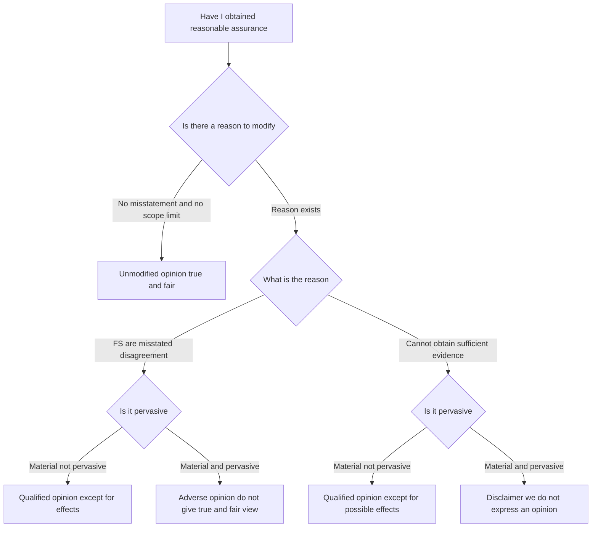
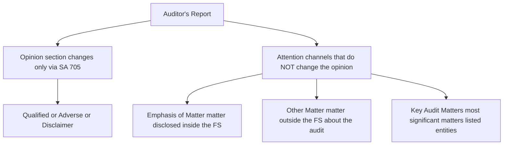
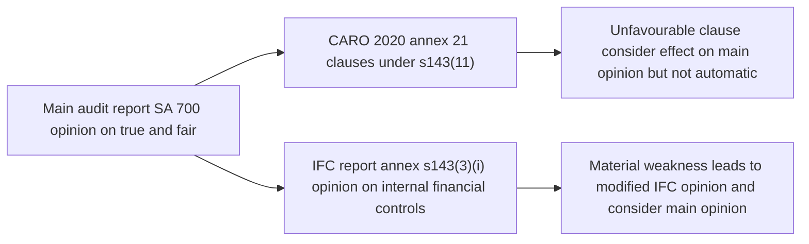

# Chapter 09 — Audit Report & Opinions

## 1. The Problem

Rewind to the very first idea of this whole subject. A company is run by managers (directors) who prepare the financial statements. The people who *own* the company (shareholders) and the people who *fund* it (banks, creditors) are not in the room when those statements are made. They cannot see the ledgers, cannot test the cash, cannot walk the warehouse. There is an **information asymmetry**: management knows the truth, the users only know what management chooses to tell them. And management has incentives to flatter the numbers — bigger profit means bigger bonus, higher share price, easier loans.

So a third party — the auditor — is hired to check the statements and vouch for them. Fine. But here is the sharp problem this chapter exists to solve:

> **The auditor does all the work invisibly. He tests, samples, confirms, recalculates, evaluates — for months. But the user never sees a single working paper. The ONLY thing the user ever receives is one document. If that one document fails to communicate what the auditor actually found, the entire audit was pointless.**

The audit report is the sole channel through which months of assurance work reaches the person who needs it. It is the *delivery pipe*. And a delivery pipe has failure modes of its own:

- **The pipe could be vague.** If every auditor wrote the report in his own style — "the accounts seem fine to me" — no user could compare two companies, and no user would know what "fine" actually promised. Ambiguity re-creates the very information problem the audit was meant to kill.
- **The pipe could over-promise.** A casual reader thinks the auditor *certifies* the accounts are 100% correct, that the company is financially healthy, that no fraud exists anywhere. If the report doesn't police these expectations, the auditor gets blamed for things he never claimed — the **expectation gap**.
- **The pipe could hide bad news.** If the auditor found a problem but the report format let him bury it, the report becomes a rubber stamp and trust collapses.
- **The pipe could be all-or-nothing.** Real audits are messy. Often *most* of the accounts are reliable but *one area* is wrong or un-checkable. A crude "pass/fail" report throws away good information — it either whitewashes the one problem or condemns the whole set.

Every rule you are about to learn — SA 700, 705, 706, 701, CARO, the IFC report — is an engineered answer to one of these failure modes of the delivery pipe.

## 2. The Core Idea

The audit report is a **standardised, structured communication of a conclusion**, engineered so that:

1. **It says one precise thing** — an *opinion* on whether the financial statements give a **true and fair view** in accordance with the applicable financial reporting framework. Not a certificate, not a guarantee — an **opinion**, professionally formed on **reasonable (not absolute) assurance**.
2. **Its wording is largely fixed** so that any user, anywhere, reading any company's report, can decode it instantly and compare across companies. Standardisation is what makes the signal legible.
3. **It has a graded vocabulary of "bad news."** Instead of pass/fail, the auditor has a *dial*: clean → qualified → adverse/disclaimer. The exact position on the dial is chosen by a rigorous logic (materiality × pervasiveness) so the report tells the user not just *that* something is wrong but *how much of the statements you can still rely on*.
4. **It carries side-channels** — Emphasis of Matter, Other Matter, Key Audit Matters — to flag things the user should notice *without* changing the opinion.
5. **It polices its own boundaries** — explicit sections on management's responsibility vs the auditor's responsibility — to shrink the expectation gap.

The mental model: the opinion is a **traffic signal with a diagnostic printout attached**. The colour (opinion type) tells you go/caution/stop; the printout (basis, EOM, KAM, CARO) tells you *why* and *where*.

## 3. Why It's Built This Way

Ask *why standardise?* Because the value of a signal is inversely related to its ambiguity. A bank lending to 500 companies must read 500 reports. If each is bespoke prose, the bank must forensically interpret each one. If all 500 share the same skeleton — same headings, same opinion sentence structure — the bank reads only the *deviations*. Standardisation converts reading into **exception-spotting**. That is why SA 700 fixes the elements and even the order.

Ask *why an opinion and not a certificate?* Because certainty is impossible and promising it would be a lie. Auditors sample (they can't check every transaction — see the concept of testing and materiality), they rely on estimates made by management about the future, and they work within time and cost limits. To reflect this honestly the profession settled on **reasonable assurance** — high, but not absolute — expressed as an **opinion**. Building the report around the word "opinion" is itself an anti-expectation-gap device.

Ask *why a graded scale of modifications?* Because information is valuable and shouldn't be discarded. Imagine a company whose accounts are impeccable except that inventory in one small branch couldn't be verified. A binary system forces the auditor either to pass it (hiding the gap) or fail it (destroying confidence in perfectly good accounts). Neither serves the user. So SA 705 invents a **middle setting** — the qualified opinion, meaning "everything is fine *except* this one thing." The scale exists to preserve as much good information as possible while quarantining the bad.

Ask *why separate EOM/KAM from the opinion?* Because "look at this" and "this is wrong" are different messages and must not be confused. Sometimes the auditor wants to *direct attention* to a correctly-disclosed but important matter (a major lawsuit, going-concern note) without saying the accounts are misstated. Bundling that into the opinion would wrongly signal a problem. So SA 706 (EOM/OM) and SA 701 (KAM) create attention-channels that are structurally *walled off* from the opinion.

Ask *why CARO and the IFC report bolted on?* Because Indian regulators wanted the auditor to also report on *specific* risk-prone matters (loans, statutory dues, fraud, related parties) and on whether the company's **internal financial controls** actually work — things the true-and-fair opinion alone wouldn't surface. These are India-specific extensions of the delivery pipe.

## 4. Full Technical Content

### 4.1 Forming the Opinion — SA 700 (Revised)

**Risk it counters:** the auditor might sign an opinion without having a coherent basis, or might communicate it in a form the user can't decode.

**Standard:** SA 700 (Revised), *"Forming an Opinion and Reporting on Financial Statements."* It governs the **unmodified** (clean) opinion and the *architecture* of every report.

**How the opinion is formed.** Before writing anything, the auditor must **conclude whether he has obtained reasonable assurance** that the financial statements as a whole are free from material misstatement (whether due to fraud or error). To reach that conclusion he evaluates:

- Whether **sufficient appropriate audit evidence** was obtained (per SA 330 on responses to risk and SA 500 on evidence).
- Whether **uncorrected misstatements** are material, individually or in aggregate (per SA 450).
- Qualitatively, whether the financial statements **achieve fair presentation**, including:
  - the selected accounting policies are appropriate and consistently applied;
  - accounting estimates made by management are reasonable;
  - information is **relevant, reliable, comparable, understandable**;
  - disclosures are adequate for users to understand material transactions;
  - the terminology used is appropriate; and
  - the statements **adequately refer to or describe the applicable financial reporting framework** (in India, the Companies Act 2013 read with the applicable Accounting Standards / Ind AS).

Only if all this holds does the auditor express an **unmodified opinion**, using the phrase that the financial statements *"give a true and fair view … in accordance with"* the framework (for a fair-presentation framework). If any of it fails, the opinion must be **modified** under SA 705.

**Elements of the auditor's report (SA 700) — in the required order:**

| # | Element | What it does / risk it addresses |
|---|---------|-----------------------------------|
| 1 | **Title** | "Independent Auditor's Report" — the word *Independent* asserts the auditor is not management's mouthpiece. |
| 2 | **Addressee** | Normally "To the Members of XYZ Ltd" — fixes *who* the report is for (the owners, not management). |
| 3 | **Opinion** paragraph (placed FIRST) | Identifies the entity, the statements audited, and states the opinion. Put first so the conclusion isn't buried. |
| 4 | **Basis for Opinion** | States the audit was conducted per SAs, that the auditor is **independent** under the ICAI Code + Act, and that evidence obtained is sufficient and appropriate. In a modified report this section explains *why*. |
| 5 | **Material Uncertainty Related to Going Concern** (if applicable) | Per SA 570 — flags doubt about the entity continuing as a going concern. |
| 6 | **Key Audit Matters** (SA 701) | Mandatory for listed entities; those matters of most significance in the current audit. |
| 7 | **Responsibilities of Management / TCWG** | Spells out that *management* is responsible for preparing true-and-fair statements, for internal control, and for assessing going concern. Directly attacks the expectation gap. |
| 8 | **Auditor's Responsibilities** | Explains reasonable (not absolute) assurance, materiality, professional judgment and scepticism, that fraud may not be detected, going-concern evaluation, etc. |
| 9 | **Other Reporting Responsibilities** | e.g. the CARO report and the Companies Act 143(3) matters. |
| 10 | **Signature** — name of the engagement partner, membership number, **firm registration number (FRN)**, and **UDIN** | Personal accountability. |
| 11 | **Place and Date** of the report | The date cannot be *before* the auditor obtained sufficient appropriate evidence, including approval of the statements by the board. |

The order (opinion first, then basis) was a deliberate 2018-era redesign so users see the conclusion immediately.

### 4.2 Modifications to the Opinion — SA 705 (Revised)

**Risk it counters:** a single clean/dirty switch would either hide localized problems or destroy trust in good accounts. SA 705, *"Modifications to the Opinion in the Independent Auditor's Report,"* provides the graded scale.

**Two questions drive everything:**

**Question 1 — Is there a *reason* to modify? There are only two:**

1. **The financial statements are materially misstated** (a *disagreement* — the auditor obtained evidence and concludes something is wrong: a wrong policy, an unrecorded liability, inadequate disclosure). Sometimes called a *problem with the statements*.
2. **The auditor cannot obtain sufficient appropriate evidence** (a *scope limitation / inability* — the auditor doesn't *know* whether it's right: records destroyed, management refuses access, a balance couldn't be confirmed, appointed too late to observe stock count). Sometimes called a *problem with the audit*.

**Question 2 — How bad is it? Judge on two axes:**

- **Material:** big enough that it *could reasonably influence* the economic decisions of users.
- **Pervasive:** a special, stronger threshold. A matter is **pervasive** if its effects (or possible effects) are: (a) **not confined** to specific elements/accounts of the statements; or (b) if confined, represent or *could* represent a **substantial proportion** of the statements; or (c) in the case of *disclosures*, are **fundamental to users' understanding** of the statements. Pervasive = it poisons the whole picture, not one corner.

**The 2×2 decision matrix (memorise the logic, not the grid):**

| | **Material but NOT pervasive** | **Material AND pervasive** |
|---|---|---|
| **Financial statements are misstated (disagreement)** | **Qualified opinion** ("except for…") | **Adverse opinion** ("do not give a true and fair view") |
| **Unable to obtain sufficient evidence (scope limitation)** | **Qualified opinion** ("except for the possible effects…") | **Disclaimer of opinion** ("we do not express an opinion") |

**The three modified opinions, decoded:**

- **Qualified opinion.** *"In our opinion, except for the effects of [the matter], the financial statements give a true and fair view…"* Meaning: *everything is reliable except this one carved-out area.* Used when the problem is material but **isolated** (not pervasive). This is the value-preserving middle setting.
- **Adverse opinion.** *"In our opinion, the financial statements do NOT give a true and fair view."* Used only when a **misstatement** is both material **and pervasive** — the statements are so wrong that no user should rely on them. Note: adverse arises only from *disagreement*, never from a scope limitation.
- **Disclaimer of opinion.** *"We do not express an opinion on the financial statements."* Used when a **scope limitation** is so severe (material **and** pervasive) that the auditor couldn't gather enough evidence to have *any* opinion at all. Note: disclaimer arises only from *inability to obtain evidence*, never from disagreement. The auditor is saying "I literally cannot tell you," which is different from "it's wrong."

**Presentation rules under SA 705:**

- The opinion heading changes to **"Qualified Opinion," "Adverse Opinion,"** or **"Disclaimer of Opinion."**
- The "Basis for Opinion" heading becomes **"Basis for Qualified/Adverse/Disclaimer of Opinion,"** and this section must **describe the matter and, where practicable, quantify the financial effect** (e.g. "had this liability been recorded, profit would be lower by ₹X and liabilities higher by ₹X"). Unquantified qualifications are weak; the standard pushes for numbers.
- For a **disclaimer**, because the auditor has no opinion, the report is trimmed: the Auditor's Responsibilities section is shortened, and the auditor does **not** report Key Audit Matters (there is no opinion to add KAM to — it would be misleading).
- A modification for one matter does **not** stop the auditor from reporting KAM on *other* matters (except in the disclaimer case).

### 4.3 Emphasis of Matter & Other Matter — SA 706 (Revised)

**Risk it counters:** the auditor sometimes needs to point at something without implying the accounts are wrong. Confusing "notice this" with "this is misstated" would mislead users. SA 706, *"Emphasis of Matter Paragraphs and Other Matter Paragraphs in the Independent Auditor's Report,"* creates two clearly-labelled attention-channels that **do not modify the opinion**.

**Emphasis of Matter (EOM) paragraph.** Used to draw users' attention to a matter **already presented or disclosed in the financial statements** that is of such importance it is *fundamental to users' understanding*. Two conditions: (a) the auditor is **not** required to modify the opinion in respect of the matter, and (b) the matter is **not** a Key Audit Matter (KAM and EOM are mutually exclusive for the same matter). The paragraph must:
- appear under the heading **"Emphasis of Matter,"**
- clearly **refer to the note in the financial statements** where the matter is disclosed, and
- state that the **opinion is not modified** in respect of the matter.

Examples: an uncertainty about the outcome of exceptional litigation; a major catastrophe (flood, fire) that has affected the entity; early application of a new accounting standard with pervasive effect; a going-concern situation that is *adequately disclosed* (though material uncertainty on going concern now has its own dedicated section under SA 570).

**Other Matter (OM) paragraph.** Used to communicate a matter **NOT presented or disclosed in the financial statements** but relevant to users' understanding of the **audit, the auditor's responsibilities, or the report itself**. Under heading **"Other Matter."** Examples: the prior-year figures were audited by a *predecessor auditor* (and stating so); financial statements prepared for two different frameworks; a restriction on distribution or use of the report.

**The crucial distinction:** EOM points *into* the financial statements (a disclosed matter); OM points *outside* them (about the audit/report). Neither changes the opinion — that separation is the whole point.

### 4.4 Key Audit Matters — SA 701

**Risk it counters:** two companies can both get a clean opinion yet have wildly different risk profiles. A bare "true and fair" opinion is *uninformative about where the audit was hardest*. Users (especially of listed companies) wanted transparency into the auditor's real judgment areas. SA 701, *"Communicating Key Audit Matters in the Independent Auditor's Report,"* answers this.

**Definition.** KAM are *those matters that, in the auditor's professional judgment, were of **most significance** in the audit of the current period's financial statements.* KAM are **selected from matters communicated to Those Charged With Governance (TCWG).**

**When is it required?** KAM is **mandatory for audits of listed entities** (and when law/regulation requires it, or when the auditor otherwise decides to communicate KAM). For unlisted entities it is voluntary. (Under the Companies Act framework, also confirm applicability thresholds in current ICAI material.)

**How KAM are chosen — a funnel:**
1. Start with all matters communicated to TCWG.
2. Narrow to those that **required significant auditor attention**, considering: areas of **higher assessed risk of material misstatement** or significant risks (SA 315); significant **auditor judgments** relating to areas of management judgment/estimates with high estimation uncertainty; and the effect of **significant events/transactions** in the period.
3. From those, select the ones of **most significance** — those are the KAM.

**How each KAM is written.** For each matter: (a) describe *why* it was considered a KAM, (b) describe *how* it was addressed in the audit, and (c) refer to the related **disclosure** in the financial statements. Placed under the **"Key Audit Matters"** heading.

**KAM is NOT a substitute:** communicating a KAM does **not** replace a required modification (SA 705), does **not** replace a going-concern material-uncertainty section, and does **not** relieve the auditor of describing a matter that should be an EOM. And **a matter giving rise to a modified opinion or a going-concern material uncertainty is by its nature a KAM but is NOT reported in the KAM section** — it's reported in its own (Basis/GC) section, with a cross-reference. When the auditor **disclaims** an opinion, he does **not** report KAM at all.

### 4.5 Reporting under the Companies Act — s.143 and CARO 2020

**Risk it counters:** the general true-and-fair opinion doesn't force the auditor to speak on specific fraud-prone or compliance matters that Indian regulators care about. So the Act (s.143) and a delegated order (CARO) mandate *additional, itemised* reporting.

**Section 143(2)-(3), Companies Act 2013 — matters the auditor's report MUST state:** whether he sought and obtained all information and explanations necessary; whether **proper books of account** have been kept; whether the report on the accounts of any **branch** was received; whether the balance sheet and P&L **agree with the books**; whether the financial statements **comply with the accounting standards**; observations having an **adverse effect** on functioning; whether any director is **disqualified** under s.164(2); whether the company has **adequate internal financial controls with reference to financial statements** and their operating effectiveness (the **IFC report** — see 4.6); and any qualification/reservation. Section 143(12) additionally requires the auditor to **report fraud** (above the prescribed threshold, currently ₹1 crore) to the **Central Government**, and below-threshold frauds to the **Audit Committee/Board**.

**CARO 2020** — the *Companies (Auditor's Report) Order, 2020*, issued under s.143(11). It requires a **separate annex** to the auditor's report answering a fixed list of clauses. It applies to most companies but **excludes** certain classes (banking, insurance, s.8 companies, one-person companies, small companies, and certain private companies below specified capital/borrowing/turnover thresholds — confirm exact limits in current ICAI material). CARO 2020 has **21 clauses**; the flavour you must know:

- **(i) Property, Plant & Equipment and intangibles** — records, physical verification, title deeds in company's name, revaluation, benami property proceedings.
- **(ii) Inventory** — physical verification and coverage; working-capital limits above ₹5 crore from banks against current assets and whether returns filed agree with books.
- **(iii) Investments / loans / guarantees** — loans to related parties, terms, overdue amounts, evergreening.
- **(iv)** Compliance with **s.185 and s.186** (loans to directors, investments).
- **(v) Deposits** — compliance with s.73-76.
- **(vi) Cost records** — maintenance where required under s.148.
- **(vii) Statutory dues** — regularity in depositing PF, ESI, GST, income-tax etc., and dues unpaid on account of disputes.
- **(viii)** Unrecorded income surrendered/disclosed in **income-tax** assessments.
- **(ix)** Default in **repayment of loans/borrowings**; wilful defaulter; end-use of term loans; funds raised short-term used long-term.
- **(x)** Money raised by **IPO/FPO** and preferential allotment/private placement — end use.
- **(xi) Fraud** — any fraud by/on the company noticed or reported; reporting under s.143(12)/ADT-4; whistle-blower complaints considered.
- **(xii)** Nidhi company compliances.
- **(xiii)** **Related-party** transactions compliance with s.177 and s.188 and disclosure.
- **(xiv)** **Internal audit** system adequacy.
- **(xv)** Non-cash transactions with directors (s.192).
- **(xvi)** Registration under **s.45-IA of RBI Act** (NBFC), and Core Investment Company status.
- **(xvii)** Cash losses in current and preceding year.
- **(xviii)** **Resignation of statutory auditors** and whether the incoming auditor considered the issues raised.
- **(xix)** Material uncertainty on meeting liabilities — auditor's opinion on **financial ratios, ageing, expected realisation** vs payment of liabilities within one year (a going-concern-adjacent clause).
- **(xx)** Transfer of unspent **CSR** amount to the Fund / special account.
- **(xxi)** Qualifications/adverse remarks in CARO reports of **consolidated** group companies.

Each clause is reported *favourable/unfavourable with reasons and quantum*; an unfavourable CARO remark does **not** automatically qualify the main opinion but the auditor must consider whether it *should*.

### 4.6 Reporting on Internal Financial Controls — s.143(3)(i)

**Risk it counters:** true-and-fair says the *output* (statements) looks right, but says little about whether the *machine* producing them (the control system) is reliable. A company could produce correct figures this year by luck while its controls are broken. Post-Satyam, Indian law wanted assurance on the **controls themselves**.

**Requirement.** Under **s.143(3)(i)**, the auditor's report must state whether the company has **adequate internal financial controls with reference to financial statements (IFCoFR)** in place and the **operating effectiveness** of such controls. This is guided by the ICAI **Guidance Note on Audit of Internal Financial Controls Over Financial Reporting**.

**Nature of the report.** It is a *separate report* (an **annexure** to the main audit report), expressing an **opinion on IFC**, and it can itself be **unmodified, qualified, adverse, or disclaimed** based on identified **material weaknesses**. A *material weakness* is a deficiency (or combination) such that there is a **reasonable possibility that a material misstatement will not be prevented or detected on a timely basis**. If a material weakness exists → the IFC opinion is **modified**; the auditor then considers the effect on the **main** financial-statement opinion too.

**Applicability nuance:** reporting on IFC operating effectiveness is required for all companies under s.143(3)(i), but **certain private companies are exempted** (notably by MCA notification for small/one-person and specified private companies meeting turnover/borrowing conditions) — confirm the current exemption thresholds in ICAI material.

## 5. Applied Scenarios

**Scenario 1 — The unrecorded liability (disagreement, isolated).**
During the audit of Ceres Ltd, you find a supplier invoice of ₹40 lakh for goods received before year-end that management refused to record, claiming a dispute. You are satisfied the liability is real. Profit before tax is ₹8 crore. The ₹40 lakh understatement of liabilities/expenses is **material** (it distorts profit and payables) but its effect is **confined** to two line items and is not a substantial proportion of the whole — **not pervasive**.
→ **Reason:** misstatement (disagreement). **Extent:** material, not pervasive. **Result: Qualified opinion** — *"except for the effects of the non-recording of trade payables of ₹40 lakh…"* The **Basis for Qualified Opinion** section quantifies: payables understated by ₹40 lakh, profit overstated by ₹40 lakh (pre-tax).

**Scenario 2 — The missing branch records (scope limitation, pervasive).**
You are auditing Helios Ltd. Its largest division (60% of total assets and revenue) had its accounting server destroyed by fire; backups are unrecoverable and no alternative evidence (confirmations, reconstructions) is obtainable. You simply cannot audit 60% of the company.
→ **Reason:** inability to obtain sufficient appropriate evidence (scope limitation). **Extent:** so large it affects a *substantial proportion* of the statements — **pervasive**. **Result: Disclaimer of opinion** — *"We do not express an opinion… because we were unable to obtain sufficient appropriate audit evidence…"* Note: **not** adverse — you don't know the numbers are *wrong*, you just can't verify them. And **no KAM section**.

**Scenario 3 — Wrong framework applied throughout (disagreement, pervasive).**
Nyx Ltd, required to follow Ind AS, has instead prepared its entire financial statements on a cash basis, affecting virtually every line — revenue, receivables, payables, provisions. You disagree, and the effect is everywhere.
→ **Reason:** misstatement (disagreement). **Extent:** **pervasive** (not confined; affects the statements as a whole). **Result: Adverse opinion** — *"the financial statements do not give a true and fair view…"*

**Scenario 4 — Big lawsuit, correctly disclosed (no modification).**
Atlas Ltd is defending a ₹200 crore claim; the outcome is uncertain and management has disclosed it fully and appropriately in Note 32, with no provision required yet under the standard. You agree with the accounting and disclosure.
→ No misstatement, no scope limit → **opinion unmodified.** But the matter is fundamental to users' understanding and is *disclosed in the statements*. **Result: Emphasis of Matter** paragraph referring to Note 32, stating the opinion is not modified. (If the entity is *listed* and this was an area of most significance in the audit, it may instead be reported as a **KAM** — and if so, *not* also as EOM.)

**Scenario 5 — Predecessor auditor (Other Matter).**
You are the newly appointed auditor of Rhea Ltd; the prior-year comparatives were audited by the outgoing firm, who issued an unmodified opinion. You want users to know you didn't audit the comparatives.
→ Nothing is disclosed *in* the statements about this; it concerns *the audit*. **Result: Other Matter** paragraph stating the corresponding figures were audited by the predecessor auditor.

**Scenario 6 — Material weakness in controls, correct numbers.**
In Selene Ltd, you find that anyone in accounts can post journal entries with no review — a control failure that could allow material misstatement. This year, by testing, you're satisfied the *figures* are actually correct.
→ **Main opinion:** the statements are true and fair → **unmodified.** **IFC report (s.143(3)(i)):** a **material weakness** exists → **qualified/adverse IFC opinion**, describing the weakness. This shows the two reports are decoupled: clean financial-statement opinion + modified IFC opinion.

## 6. Procedure & Documentation Summary

**Forming and reporting — the sequence:**
1. Complete audit procedures; accumulate misstatements (SA 450); obtain **written representations** (SA 580).
2. Evaluate sufficiency/appropriateness of evidence and whether uncorrected misstatements are material.
3. **Decide: modify or not?** Apply SA 705 logic (reason × extent).
4. Consider **going concern** (SA 570) — separate section if material uncertainty.
5. Identify **KAM** (SA 701) for listed entities from matters communicated to TCWG.
6. Determine any **EOM/OM** (SA 706).
7. Draft the report per **SA 700** structure; draft **CARO** annex and **IFC** annex.
8. **Communicate** planned report modifications/KAM to TCWG (SA 260) before finalising.
9. Ensure the **date** is not earlier than the date sufficient appropriate evidence was obtained (incl. board approval of statements); **sign** with FRN, membership no., **UDIN**; state place.

**Documentation the auditor must retain (SA 230):**
- The **conclusion** on whether reasonable assurance was obtained and the basis for the opinion type chosen.
- For each modification: the **reason** (disagreement vs inability), the **materiality/pervasiveness judgment**, and the **quantification**.
- The **KAM determination** — matters communicated to TCWG, those requiring significant attention, and how the final KAM were selected (the funnel).
- Rationale for any **EOM/OM**.
- **CARO** working — evidence supporting each clause conclusion.
- **IFC** testing — design and operating-effectiveness tests, identified deficiencies and their classification (deficiency vs significant deficiency vs **material weakness**).
- Communications with **TCWG** on the report.

## 7. Connections

- **← SA 200** gives us *reasonable assurance* and *materiality* — the two ideas that make the opinion an "opinion" and drive the modification thresholds.
- **← SA 315 / SA 330** (risk assessment and responses) feed KAM (areas of higher risk) and the IFC report (control testing).
- **← SA 450** (evaluation of misstatements) determines whether uncorrected misstatements are material → whether to modify.
- **← SA 570** (going concern) plugs directly into the report as a dedicated *Material Uncertainty* section and can itself trigger a modification.
- **← SA 260/265** (communication with TCWG; deficiencies) — KAM are *drawn from* TCWG communications; IFC material weaknesses come from SA 265 deficiency evaluation.
- **← SA 510** (opening balances) and **SA 710** (comparatives) — a problem with opening balances/comparatives can force a modification or an Other Matter paragraph.
- **← SA 720** (other information) — if the annual-report narrative is inconsistent with the audited statements, the auditor reports it in an *Other Information* section.
- **→ Companies Act ss.139-147** (appointment, rotation, powers, duties) — the *authority* to sign this report and the consequences (s.147 penalties) live there.
- **→ Ethics / Independence** — the "Basis for Opinion" section *asserts* independence; a breach undermines the entire report.

## 8. Traps & Examiner Tricks

1. **Adverse vs Disclaimer confusion.** *Adverse* comes ONLY from a **misstatement (disagreement)** that is pervasive — "it's wrong." *Disclaimer* comes ONLY from an **inability to get evidence** that is pervasive — "I can't tell." Examiners give a fact pattern and ask for the exact opinion; identify **reason first** (disagreement vs scope), *then* extent.
2. **Qualified is the answer for *both* reasons when NOT pervasive.** A scope limitation that is material-but-isolated gives a *qualified* opinion ("except for the possible effects…") — students wrongly jump to disclaimer.
3. **"Material" ≠ "Pervasive."** Pervasive is a *higher* bar with a specific three-part definition (not confined / substantial proportion / fundamental to understanding). A big number isn't automatically pervasive.
4. **EOM does NOT modify the opinion.** A favourite trick: describe a disclosed uncertainty and ask "what opinion?" — answer: unmodified opinion *with* an EOM. And EOM requires the matter to be **already disclosed** in the statements — if it *should* have been disclosed and wasn't, that's a **misstatement → modification**, not an EOM.
5. **EOM vs OM direction.** EOM = matter *inside* the financial statements; OM = matter *outside* them (about the audit/report). Predecessor auditor = **OM**, not EOM.
6. **KAM ≠ modification and ≠ substitute.** A matter causing a modified opinion or a going-concern material uncertainty is described in its **own** section, not the KAM section (though it *is* by nature a key matter). On a **disclaimer**, KAM is **not** reported at all.
7. **KAM only mandatory for listed entities** — don't force KAM onto a small private company.
8. **CARO remark does not auto-qualify.** An unfavourable CARO clause is reported in the CARO annex; the auditor *separately considers* whether the underlying issue also affects the main opinion. They are not automatically linked.
9. **IFC opinion is separate from the FS opinion.** You can have a clean true-and-fair opinion and a *qualified/adverse* IFC opinion (material weakness) simultaneously — Scenario 6.
10. **Report date and UDIN.** The report must not be dated before sufficient appropriate evidence (including board approval) was obtained; the signature block needs **FRN, membership number and UDIN**. Missing UDIN is a real-world (and exam) red flag.
11. **Opinion paragraph comes FIRST** in the revised SA 700 format (before Basis). A common presentation-order trap.
12. **Going concern has its own home now.** Post-revision, a *material uncertainty related to going concern* goes in a dedicated **"Material Uncertainty Related to Going Concern"** section (SA 570), not merely an EOM — provided disclosure is adequate. If disclosure is inadequate → **modify** the opinion.

## 9. First-Principles Recap

Strip everything away and you are left with one chain of reasoning. Owners can't watch managers, so an auditor is hired to vouch for the accounts. The auditor's *entire* output is one document, so that document must communicate with zero ambiguity — hence a **standardised structure** (SA 700) and a single precise conclusion, an **opinion** of *true and fair* on *reasonable assurance* (honest about the limits of sampling and estimates). Because reality is messy, the conclusion can't be a binary stamp; it needs a **graded dial** (SA 705) that quarantines bad news by asking two questions — *is the problem a disagreement or an inability?* and *is it isolated or pervasive?* — yielding qualified / adverse / disclaimer. Because the auditor sometimes needs to *point* without *condemning*, two walled-off attention channels exist (SA 706 EOM/OM), and because clean opinions hide where the audit was hardest, listed-company reports carry **KAM** (SA 701). Because Indian regulators want more than true-and-fair, the auditor also answers a fixed checklist of risk-prone matters (**CARO** under s.143) and gives a *separate* verdict on whether the control machine works (**IFC**, s.143(3)(i)). Every element is an engineered fix to a way the delivery pipe could fail. If you can rebuild that chain, you never need to memorise the report — you can *derive* it.

## 10. Quick-Revision Sheet

**Standards map:**

| Standard | Governs |
|---|---|
| **SA 700 (Rev.)** | Forming the opinion + report elements (unmodified) |
| **SA 701** | Key Audit Matters (listed entities) |
| **SA 705 (Rev.)** | Modified opinions — qualified / adverse / disclaimer |
| **SA 706 (Rev.)** | Emphasis of Matter & Other Matter (no opinion change) |
| **SA 570** | Going concern → Material Uncertainty section |
| **s.143, Companies Act** | Statutory reporting matters; fraud (143(12)); CARO (143(11)); IFC (143(3)(i)) |
| **CARO 2020** | 21-clause annex on risk-prone matters |

**The decision, in one line:** *Reason (disagreement vs inability) × Extent (material-not-pervasive vs material-and-pervasive) → opinion.*

| | Material, NOT pervasive | Material AND pervasive |
|---|---|---|
| **Misstatement (disagree)** | Qualified | **Adverse** |
| **Can't get evidence (scope)** | Qualified | **Disclaimer** |

**Opinion phrases:**
- Unmodified: *"…give a true and fair view in accordance with…"*
- Qualified: *"except for the effects / possible effects of… the FS give a true and fair view"*
- Adverse: *"…do NOT give a true and fair view"*
- Disclaimer: *"…we do not express an opinion"*

**Report elements order (SA 700):** Title → Addressee → **Opinion** → Basis for Opinion → [Material Uncertainty—Going Concern] → **KAM** → Responsibilities of Management/TCWG → Auditor's Responsibilities → Other Reporting (CARO/143(3)) → Signature (FRN, M.No., **UDIN**) → Place & Date.

**Remember-these switches:**
- Adverse ← only disagreement. Disclaimer ← only inability.
- EOM = disclosed matter *inside* FS; OM = matter *outside* FS (audit/report).
- KAM: listed only; a modified-opinion matter goes in its own section, not KAM; no KAM on a disclaimer.
- CARO remark ≠ automatic qualification.
- IFC opinion is separate and can be modified while the FS opinion is clean (material weakness = reasonable possibility a material misstatement won't be prevented/detected).
- Report date ≥ date of sufficient appropriate evidence (incl. board approval). UDIN mandatory.

---

### Diagram 1 — The full opinion decision tree

*Figure 9.1 — First identify the reason disagreement vs inability then the extent material vs pervasive; the pair fixes the opinion.*

### Diagram 2 — Where each communication channel goes

*Figure 9.2 — The opinion moves only through SA 705; EOM, OM and KAM are walled-off channels that inform without modifying.*

### Diagram 3 — Report vs the two Indian bolt-ons

*Figure 9.3 — Beyond the true-and-fair opinion Indian law bolts on a CARO checklist and a separate opinion on the control system itself.*
