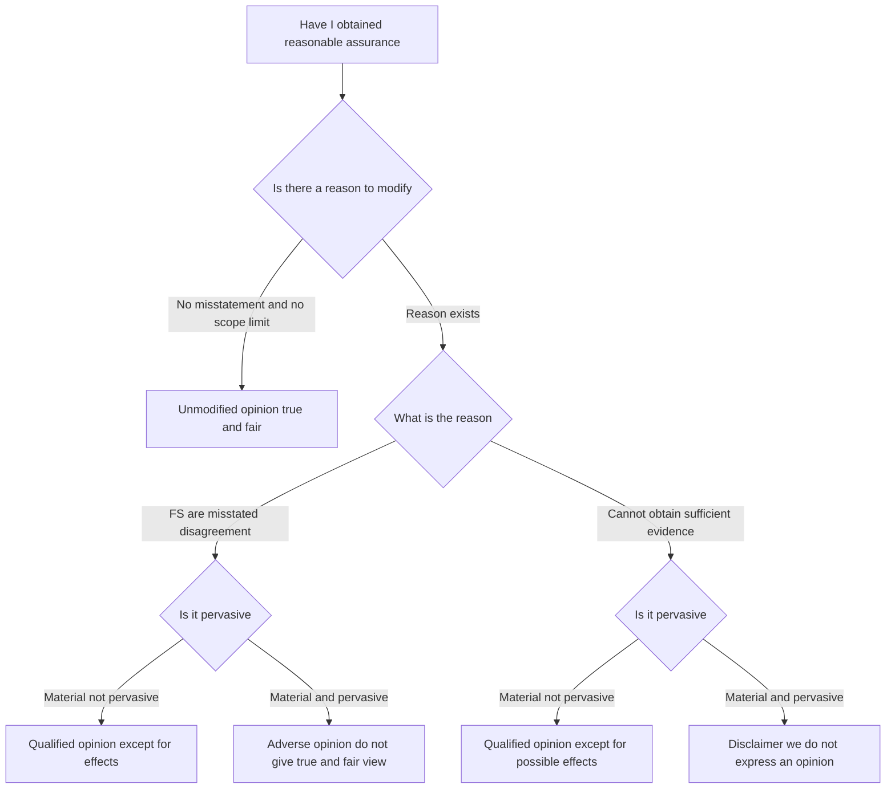
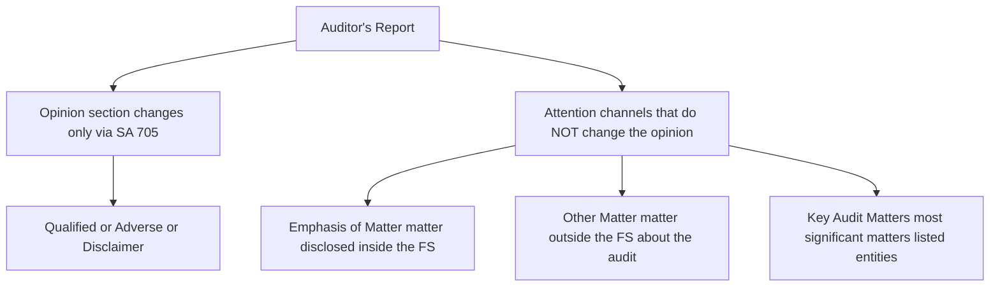
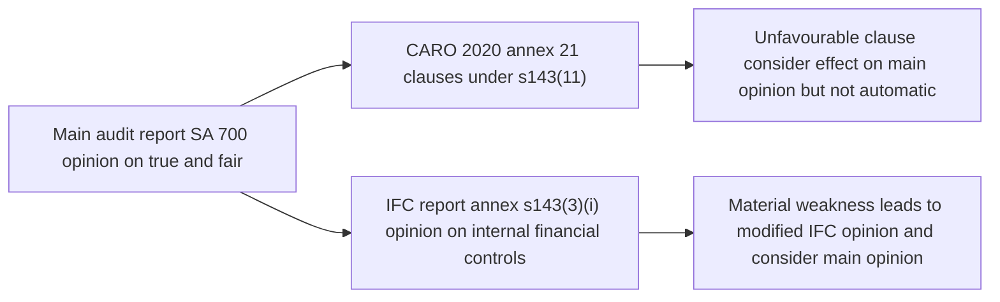
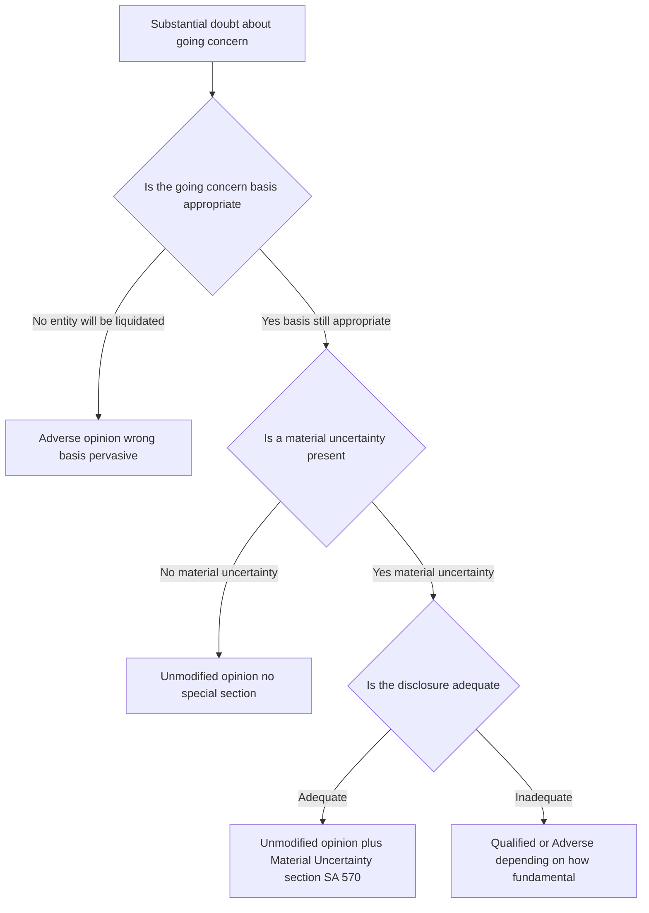
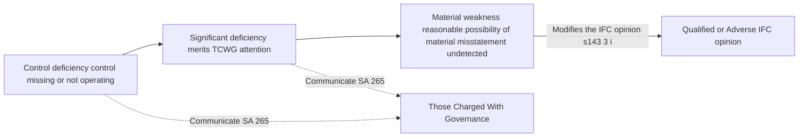

<!-- v2-deep -->

# Chapter 09 — Audit Report & Opinions

## 1. The Problem

Rewind to the very first idea of this whole subject. A company is run by managers (directors) who prepare the financial statements. The people who *own* the company (shareholders) and the people who *fund* it (banks, creditors) are not in the room when those statements are made. They cannot see the ledgers, cannot test the cash, cannot walk the warehouse. There is an **information asymmetry**: management knows the truth, the users only know what management chooses to tell them. And management has incentives to flatter the numbers — bigger profit means bigger bonus, higher share price, easier loans.

So a third party — the auditor — is hired to check the statements and vouch for them. Fine. But here is the sharp problem this chapter exists to solve:

> **The auditor does all the work invisibly. He tests, samples, confirms, recalculates, evaluates — for months. But the user never sees a single working paper. The ONLY thing the user ever receives is one document. If that one document fails to communicate what the auditor actually found, the entire audit was pointless.**

The audit report is the sole channel through which months of assurance work reaches the person who needs it. It is the *delivery pipe*. And a delivery pipe has failure modes of its own:

- **The pipe could be vague.** If every auditor wrote the report in his own style — "the accounts seem fine to me" — no user could compare two companies, and no user would know what "fine" actually promised. Ambiguity re-creates the very information problem the audit was meant to kill.
- **The pipe could over-promise.** A casual reader thinks the auditor *certifies* the accounts are 100% correct, that the company is financially healthy, that no fraud exists anywhere. If the report doesn't police these expectations, the auditor gets blamed for things he never claimed — the **expectation gap**.
- **The pipe could hide bad news.** If the auditor found a problem but the report format let him bury it, the report becomes a rubber stamp and trust collapses.
- **The pipe could be all-or-nothing.** Real audits are messy. Often *most* of the accounts are reliable but *one area* is wrong or un-checkable. A crude "pass/fail" report throws away good information — it either whitewashes the one problem or condemns the whole set.

Every rule you are about to learn — SA 700, 705, 706, 701, CARO, the IFC report — is an engineered answer to one of these failure modes of the delivery pipe.

**Two failure modes worth naming precisely, because the exam leans on them.** First, the **expectation gap** has two sub-species: the *knowledge gap* (users don't understand what an audit actually promises — they think "true and fair" means "arithmetically perfect and fraud-free") and the *performance gap* (the auditor didn't do what standards required). The report can only attack the knowledge gap — through the Responsibilities and Auditor's Responsibilities sections that spell out the limits — it cannot cure the performance gap. Second, the **"report is a snapshot" problem**: the opinion speaks *as at* the balance-sheet date and *as of* the report date, on evidence available then. It is not a rolling guarantee. This is why the report's *date* is load-bearing and why *subsequent events* (SA 560) can force the auditor to revisit a report he has already dated but not yet issued. Keep these framings in your head; they convert a dozen scattered rules into three or four root causes.

## 2. The Core Idea

The audit report is a **standardised, structured communication of a conclusion**, engineered so that:

1. **It says one precise thing** — an *opinion* on whether the financial statements give a **true and fair view** in accordance with the applicable financial reporting framework. Not a certificate, not a guarantee — an **opinion**, professionally formed on **reasonable (not absolute) assurance**.
2. **Its wording is largely fixed** so that any user, anywhere, reading any company's report, can decode it instantly and compare across companies. Standardisation is what makes the signal legible.
3. **It has a graded vocabulary of "bad news."** Instead of pass/fail, the auditor has a *dial*: clean → qualified → adverse/disclaimer. The exact position on the dial is chosen by a rigorous logic (materiality × pervasiveness) so the report tells the user not just *that* something is wrong but *how much of the statements you can still rely on*.
4. **It carries side-channels** — Emphasis of Matter, Other Matter, Key Audit Matters — to flag things the user should notice *without* changing the opinion.
5. **It polices its own boundaries** — explicit sections on management's responsibility vs the auditor's responsibility — to shrink the expectation gap.

The mental model: the opinion is a **traffic signal with a diagnostic printout attached**. The colour (opinion type) tells you go/caution/stop; the printout (basis, EOM, KAM, CARO) tells you *why* and *where*.

**A second mental model that unlocks the modification logic: two independent switches, not one dial.** Beginners imagine a single slider from "clean" to "disclaimer." That is wrong and it costs marks. There are *two* switches. Switch A asks **what kind of trouble** — is it a *disagreement* (I have evidence, and the numbers are wrong) or an *inability* (I lack evidence, and I don't know if they're wrong)? Switch B asks **how far the trouble spreads** — *isolated* or *pervasive*? The opinion is the *coordinate* where the two switches meet, not a point on one line. Adverse and disclaimer are not "more severe versions of the same thing"; they live in different columns because they answer switch A differently. Hold the 2×2 grid, never a 1×4 ladder.

**Fair-presentation vs compliance frameworks — a distinction the revised standards bake in.** In India, company financial statements use a **fair-presentation framework** (Companies Act + AS/Ind AS), where the auditor opines that the statements *"give a true and fair view."* A **compliance framework** (rare for companies, seen in some special-purpose statements) only requires the statements to be *prepared in accordance with* the framework — there the auditor says they are *"prepared, in all material respects, in accordance with"* the framework and drops the "true and fair" language. The exam mostly tests fair presentation, but if a question hands you a special-purpose statement prepared purely for a regulator's compliance rules, the opinion wording shifts — that shift is itself a testable point (see SA 800 in Connections).

## 3. Why It's Built This Way

Ask *why standardise?* Because the value of a signal is inversely related to its ambiguity. A bank lending to 500 companies must read 500 reports. If each is bespoke prose, the bank must forensically interpret each one. If all 500 share the same skeleton — same headings, same opinion sentence structure — the bank reads only the *deviations*. Standardisation converts reading into **exception-spotting**. That is why SA 700 fixes the elements and even the order.

Ask *why an opinion and not a certificate?* Because certainty is impossible and promising it would be a lie. Auditors sample (they can't check every transaction — see the concept of testing and materiality), they rely on estimates made by management about the future, and they work within time and cost limits. To reflect this honestly the profession settled on **reasonable assurance** — high, but not absolute — expressed as an **opinion**. Building the report around the word "opinion" is itself an anti-expectation-gap device. A *certificate* asserts an absolute fact ("this cash of ₹X exists"); an *opinion* asserts a professional judgment ("in our opinion the accounts are true and fair"). The auditor *certifies* only where he has verified an exact fact and *opines* on the statements as a whole. Examiners exploit the loose everyday use of "certify" — the audit *report* is an opinion, never a certificate.

Ask *why a graded scale of modifications?* Because information is valuable and shouldn't be discarded. Imagine a company whose accounts are impeccable except that inventory in one small branch couldn't be verified. A binary system forces the auditor either to pass it (hiding the gap) or fail it (destroying confidence in perfectly good accounts). Neither serves the user. So SA 705 invents a **middle setting** — the qualified opinion, meaning "everything is fine *except* this one thing." The scale exists to preserve as much good information as possible while quarantining the bad.

Ask *why separate EOM/KAM from the opinion?* Because "look at this" and "this is wrong" are different messages and must not be confused. Sometimes the auditor wants to *direct attention* to a correctly-disclosed but important matter (a major lawsuit, going-concern note) without saying the accounts are misstated. Bundling that into the opinion would wrongly signal a problem. So SA 706 (EOM/OM) and SA 701 (KAM) create attention-channels that are structurally *walled off* from the opinion.

Ask *why CARO and the IFC report bolted on?* Because Indian regulators wanted the auditor to also report on *specific* risk-prone matters (loans, statutory dues, fraud, related parties) and on whether the company's **internal financial controls** actually work — things the true-and-fair opinion alone wouldn't surface. These are India-specific extensions of the delivery pipe.

Ask *why put the Opinion first and the Basis right after it?* This is a genuine 2018-era design decision worth understanding, not memorising. Older reports buried the opinion at the bottom after a long "scope" paragraph, so a hurried reader met the caveats before the conclusion. Reversing the order — **conclusion first, justification second** — mirrors how a good news dispatch works: headline, then supporting detail. It also forces the *Basis for Opinion* to explicitly assert independence and evidence sufficiency right beside the opinion, so the reader cannot take the opinion without immediately seeing the ground it stands on. Structure encodes emphasis.

Ask *why must materiality drive all of this rather than a fixed rupee limit?* Because "material" is defined by the *user's decision*, not by the auditor's convenience. A ₹40 lakh error is trivial for Reliance and catastrophic for a small NBFC. Tying the threshold to *"could reasonably influence the economic decisions of users"* keeps the standard scale-free — the same principle works for a ₹10 crore company and a ₹10,000 crore one. Pervasiveness then adds a *spread* dimension on top of *size*, because a small-but-everywhere problem (wrong framework) can be more damaging than a large-but-contained one.

## 4. Full Technical Content

### 4.1 Forming the Opinion — SA 700 (Revised)

**Risk it counters:** the auditor might sign an opinion without having a coherent basis, or might communicate it in a form the user can't decode.

**Standard:** SA 700 (Revised), *"Forming an Opinion and Reporting on Financial Statements."* It governs the **unmodified** (clean) opinion and the *architecture* of every report.

**How the opinion is formed.** Before writing anything, the auditor must **conclude whether he has obtained reasonable assurance** that the financial statements as a whole are free from material misstatement (whether due to fraud or error). To reach that conclusion he evaluates:

- Whether **sufficient appropriate audit evidence** was obtained (per SA 330 on responses to risk and SA 500 on evidence).
- Whether **uncorrected misstatements** are material, individually or in aggregate (per SA 450).
- Qualitatively, whether the financial statements **achieve fair presentation**, including:
  - the selected accounting policies are appropriate and consistently applied;
  - accounting estimates made by management are reasonable;
  - information is **relevant, reliable, comparable, understandable**;
  - disclosures are adequate for users to understand material transactions;
  - the terminology used is appropriate; and
  - the statements **adequately refer to or describe the applicable financial reporting framework** (in India, the Companies Act 2013 read with the applicable Accounting Standards / Ind AS).

Only if all this holds does the auditor express an **unmodified opinion**, using the phrase that the financial statements *"give a true and fair view … in accordance with"* the framework (for a fair-presentation framework). If any of it fails, the opinion must be **modified** under SA 705.

**Why "the financial statements as a whole."** The phrase is deliberate. The auditor does not opine line-by-line; he forms a *holistic* judgment. This is why a single isolated error doesn't automatically sink the opinion — it is weighed against the whole. It is also why *pervasiveness* is framed as an effect on "the statements as a whole." Keep the unit of analysis in mind: the opinion is on the *set*, modified only to the extent a problem infects it.

**Elements of the auditor's report (SA 700) — in the required order:**

| # | Element | What it does / risk it addresses |
|---|---------|-----------------------------------|
| 1 | **Title** | "Independent Auditor's Report" — the word *Independent* asserts the auditor is not management's mouthpiece. |
| 2 | **Addressee** | Normally "To the Members of XYZ Ltd" — fixes *who* the report is for (the owners, not management). |
| 3 | **Opinion** paragraph (placed FIRST) | Identifies the entity, the statements audited, and states the opinion. Put first so the conclusion isn't buried. |
| 4 | **Basis for Opinion** | States the audit was conducted per SAs, that the auditor is **independent** under the ICAI Code + Act, and that evidence obtained is sufficient and appropriate. In a modified report this section explains *why*. |
| 5 | **Material Uncertainty Related to Going Concern** (if applicable) | Per SA 570 — flags doubt about the entity continuing as a going concern. |
| 6 | **Key Audit Matters** (SA 701) | Mandatory for listed entities; those matters of most significance in the current audit. |
| 7 | **Responsibilities of Management / TCWG** | Spells out that *management* is responsible for preparing true-and-fair statements, for internal control, and for assessing going concern. Directly attacks the expectation gap. |
| 8 | **Auditor's Responsibilities** | Explains reasonable (not absolute) assurance, materiality, professional judgment and scepticism, that fraud may not be detected, going-concern evaluation, etc. |
| 9 | **Other Reporting Responsibilities** | e.g. the CARO report and the Companies Act 143(3) matters. |
| 10 | **Signature** — name of the engagement partner, membership number, **firm registration number (FRN)**, and **UDIN** | Personal accountability. |
| 11 | **Place and Date** of the report | The date cannot be *before* the auditor obtained sufficient appropriate evidence, including approval of the statements by the board. |

The order (opinion first, then basis) was a deliberate 2018-era redesign so users see the conclusion immediately.

**What the Opinion paragraph must actually name.** It is not enough to say "we give a true and fair view." SA 700 requires the paragraph to (a) **identify the entity** whose statements were audited; (b) state that the statements **have been audited**; (c) **identify the title of each statement** comprising the financial statements (balance sheet, statement of P&L including OCI where applicable, cash flow statement, statement of changes in equity); (d) **refer to the notes** including the summary of significant accounting policies; and (e) **specify the date or period** each statement covers. Examiners sometimes give a badly drafted opinion paragraph and ask "what is missing?" — the answer is usually one of these five identifiers, or the reference to the framework.

**Signing and multiplicity of framework references.** Where the statements are prepared under a framework *and* the auditor also reports on compliance with law, the Opinion refers to the framework and the *Other Reporting Responsibilities* section (element 9) carries the legal/CARO reporting. Do not merge them; SA 700 keeps the true-and-fair opinion visually separate from statutory-checklist reporting so users don't confuse a CARO remark with a modification of the opinion.

**The report date — deeper than it looks.** The date is the auditor's assertion that he has considered the effect of events up to that date on the statements and the opinion (link to SA 560, subsequent events). Three ordering constraints must all hold: the date is **not earlier than** (i) the date sufficient appropriate evidence was obtained, (ii) the date the financial statements (including notes) were **prepared**, and (iii) the date those with recognised authority (the **Board**) have **asserted they take responsibility** for them (i.e., approved them). If the auditor dates the report before board approval, the report is defective regardless of the quality of the underlying work. This is a favourite one-mark trap dressed as a scenario.

### 4.2 Modifications to the Opinion — SA 705 (Revised)

**Risk it counters:** a single clean/dirty switch would either hide localized problems or destroy trust in good accounts. SA 705, *"Modifications to the Opinion in the Independent Auditor's Report,"* provides the graded scale.

**Two questions drive everything:**

**Question 1 — Is there a *reason* to modify? There are only two:**

1. **The financial statements are materially misstated** (a *disagreement* — the auditor obtained evidence and concludes something is wrong: a wrong policy, an unrecorded liability, inadequate disclosure). Sometimes called a *problem with the statements*.
2. **The auditor cannot obtain sufficient appropriate evidence** (a *scope limitation / inability* — the auditor doesn't *know* whether it's right: records destroyed, management refuses access, a balance couldn't be confirmed, appointed too late to observe stock count). Sometimes called a *problem with the audit*.

**Sub-classifying misstatements (why "disagreement" is broader than "wrong number").** A material misstatement can arise from any of three sources: (a) the **appropriateness of selected accounting policies** (e.g., a policy that conflicts with the framework, or a policy applied where it doesn't belong); (b) the **application** of selected policies (e.g., a policy is fine in principle but management applied it inconsistently or with a computational error); or (c) the **appropriateness or adequacy of disclosures** (a required disclosure is missing, misleading, or the note is present but inadequate). Students collapse "misstatement" into "the figure is wrong," then miss cases where the *figures* are right but a *disclosure* is missing — that too is a misstatement and can trigger a qualification or, if pervasive to understanding, an adverse opinion.

**Sub-classifying scope limitations (who caused it matters).** An inability to obtain evidence can be (a) **circumstances beyond anyone's control** (fire destroyed records; the auditor was appointed after year-end and could not observe the physical stock count); (b) **circumstances relating to the nature/timing of the auditor's work** (the entity's controls prevent alternative procedures; the auditor cannot get an external confirmation and no substitute evidence exists); or (c) a **limitation imposed by management** (management refuses to let the auditor confirm a balance, or restricts access). Category (c) is special: if management imposes a limitation *after acceptance* and the auditor believes the effect could be *material and pervasive*, the auditor should **request removal** of the limitation; if management refuses, the auditor **communicates with TCWG** and, if unable to obtain sufficient evidence and the effect could be pervasive, should **disclaim** or, where practicable and permitted, **withdraw** from the engagement. A management-imposed limitation is treated more seriously than an act-of-God limitation because it hints at concealment.

**Question 2 — How bad is it? Judge on two axes:**

- **Material:** big enough that it *could reasonably influence* the economic decisions of users.
- **Pervasive:** a special, stronger threshold. A matter is **pervasive** if its effects (or possible effects) are: (a) **not confined** to specific elements/accounts of the statements; or (b) if confined, represent or *could* represent a **substantial proportion** of the statements; or (c) in the case of *disclosures*, are **fundamental to users' understanding** of the statements. Pervasive = it poisons the whole picture, not one corner.

**Reading pervasiveness correctly — it is about *reach*, not *size alone*.** Notice each limb is about spread or centrality: not-confined (spread across many items), substantial-proportion (dominates the balance sheet/P&L even if in one item), or fundamental-to-understanding (a disclosure without which the whole picture is unreadable). A ₹500 crore error confined to one asset in a ₹50,000 crore company may be material but *not* pervasive; a wrong going-concern basis affecting every line is pervasive even before you compute a rupee figure. The exam rewards you for stating *which limb* of the definition is satisfied, not merely asserting "pervasive."

**The 2×2 decision matrix (memorise the logic, not the grid):**

| | **Material but NOT pervasive** | **Material AND pervasive** |
|---|---|---|
| **Financial statements are misstated (disagreement)** | **Qualified opinion** ("except for…") | **Adverse opinion** ("do not give a true and fair view") |
| **Unable to obtain sufficient evidence (scope limitation)** | **Qualified opinion** ("except for the possible effects…") | **Disclaimer of opinion** ("we do not express an opinion") |

**The three modified opinions, decoded:**

- **Qualified opinion.** *"In our opinion, except for the effects of [the matter], the financial statements give a true and fair view…"* Meaning: *everything is reliable except this one carved-out area.* Used when the problem is material but **isolated** (not pervasive). This is the value-preserving middle setting.
- **Adverse opinion.** *"In our opinion, the financial statements do NOT give a true and fair view."* Used only when a **misstatement** is both material **and pervasive** — the statements are so wrong that no user should rely on them. Note: adverse arises only from *disagreement*, never from a scope limitation.
- **Disclaimer of opinion.** *"We do not express an opinion on the financial statements."* Used when a **scope limitation** is so severe (material **and** pervasive) that the auditor couldn't gather enough evidence to have *any* opinion at all. Note: disclaimer arises only from *inability to obtain evidence*, never from disagreement. The auditor is saying "I literally cannot tell you," which is different from "it's wrong."

**A subtle wording difference to nail.** For a **disagreement**-based qualification the phrase is *"except for the **effects** of…"* (the auditor knows the effect). For a **scope**-based qualification it is *"except for the **possible effects** of…"* (the auditor doesn't know the actual effect because he lacked evidence). The single word "possible" tells the reader which switch was flipped. Examiners have awarded/deducted marks purely on whether a candidate used "effects" vs "possible effects" correctly.

**Presentation rules under SA 705:**

- The opinion heading changes to **"Qualified Opinion," "Adverse Opinion,"** or **"Disclaimer of Opinion."**
- The "Basis for Opinion" heading becomes **"Basis for Qualified/Adverse/Disclaimer of Opinion,"** and this section must **describe the matter and, where practicable, quantify the financial effect** (e.g. "had this liability been recorded, profit would be lower by ₹X and liabilities higher by ₹X"). Unquantified qualifications are weak; the standard pushes for numbers.
- For a **disclaimer**, because the auditor has no opinion, the report is trimmed: the Auditor's Responsibilities section is shortened, and the auditor does **not** report Key Audit Matters (there is no opinion to add KAM to — it would be misleading).
- A modification for one matter does **not** stop the auditor from reporting KAM on *other* matters (except in the disclaimer case).

**Two further presentation rules the exam tests.** First, when the auditor expresses an **adverse or disclaimer of opinion on the financial statements as a whole**, he must **not** *also* express an *unmodified* opinion within the *same report* on a *single statement* or *single item* prepared under the *same framework* — doing so would contradict and dilute the adverse/disclaimer conclusion. Second, the **Opinion and Basis** sections' interaction is directional: in a modified report the *Basis* must appear **immediately after** the *Opinion* section and must state that the auditor believes the evidence obtained is sufficient and appropriate to provide a basis for the *modified* opinion (for a disclaimer, this evidence-sufficiency sentence is *removed*, because by definition he lacked sufficient evidence — a neat internal-consistency point).

**What the Basis section must contain, by type.** For a *misstatement that is quantifiable*: a description **and** the rupee quantification of its effect (on profit, on the affected assets/liabilities, on tax where relevant). For a *misstatement in narrative disclosures*: an explanation of *how* the disclosure is misstated. For a *missing disclosure*: the auditor should **include the omitted disclosure in the Basis section itself**, where practicable and where he has obtained the information — actually supplying to the user what management withheld. For a *scope limitation*: a description of what could not be obtained and why. Failing to quantify a quantifiable misstatement is a substantive defect, not a stylistic one.

### 4.3 Emphasis of Matter & Other Matter — SA 706 (Revised)

**Risk it counters:** the auditor sometimes needs to point at something without implying the accounts are wrong. Confusing "notice this" with "this is misstated" would mislead users. SA 706, *"Emphasis of Matter Paragraphs and Other Matter Paragraphs in the Independent Auditor's Report,"* creates two clearly-labelled attention-channels that **do not modify the opinion**.

**Emphasis of Matter (EOM) paragraph.** Used to draw users' attention to a matter **already presented or disclosed in the financial statements** that is of such importance it is *fundamental to users' understanding*. Two conditions: (a) the auditor is **not** required to modify the opinion in respect of the matter, and (b) the matter is **not** a Key Audit Matter (KAM and EOM are mutually exclusive for the same matter). The paragraph must:
- appear under the heading **"Emphasis of Matter,"**
- clearly **refer to the note in the financial statements** where the matter is disclosed, and
- state that the **opinion is not modified** in respect of the matter.

Examples: an uncertainty about the outcome of exceptional litigation; a major catastrophe (flood, fire) that has affected the entity; early application of a new accounting standard with pervasive effect; a going-concern situation that is *adequately disclosed* (though material uncertainty on going concern now has its own dedicated section under SA 570).

**The three gates an EOM must pass (why it's not a free-for-all).** Auditors are tempted to sprinkle EOMs to cover themselves. SA 706 restrains this with three tests: (1) the matter is **appropriately presented/disclosed** in the statements (if it isn't, the fix is a *modification*, not an EOM); (2) the auditor has **obtained sufficient evidence** the matter is not materially misstated (an EOM cannot paper over a scope limitation); and (3) the matter is **not** one that would be a KAM or require a modification. Overusing EOM is itself a defect — it dilutes the signal, so that a genuine EOM stops standing out. "When everything is emphasised, nothing is."

**Other Matter (OM) paragraph.** Used to communicate a matter **NOT presented or disclosed in the financial statements** but relevant to users' understanding of the **audit, the auditor's responsibilities, or the report itself**. Under heading **"Other Matter."** Examples: the prior-year figures were audited by a *predecessor auditor* (and stating so); financial statements prepared for two different frameworks; a restriction on distribution or use of the report; the fact that the auditor has *not* been able to *withdraw* although a limitation exists but the report is still issued for statutory reasons.

**Placement and TCWG communication.** The *position* of an EOM/OM in the report depends on its nature and on the presence of a KAM section — SA 706 gives ordering guidance (e.g., an EOM about going concern sits with related material; an OM restricting distribution may come after KAM). And whenever the auditor expects to include an EOM or OM, he must **communicate this to TCWG** along with the proposed wording — the same governance loop as KAM and modifications. Users should never learn of an emphasis the board had no chance to see first.

**The crucial distinction:** EOM points *into* the financial statements (a disclosed matter); OM points *outside* them (about the audit/report). Neither changes the opinion — that separation is the whole point.

### 4.4 Key Audit Matters — SA 701

**Risk it counters:** two companies can both get a clean opinion yet have wildly different risk profiles. A bare "true and fair" opinion is *uninformative about where the audit was hardest*. Users (especially of listed companies) wanted transparency into the auditor's real judgment areas. SA 701, *"Communicating Key Audit Matters in the Independent Auditor's Report,"* answers this.

**Definition.** KAM are *those matters that, in the auditor's professional judgment, were of **most significance** in the audit of the current period's financial statements.* KAM are **selected from matters communicated to Those Charged With Governance (TCWG).**

**When is it required?** KAM is **mandatory for audits of listed entities** (and when law/regulation requires it, or when the auditor otherwise decides to communicate KAM). For unlisted entities it is voluntary. (There is **no separate Companies-Act size/turnover threshold** that makes KAM mandatory beyond listed entities — the trigger is *listed status* (or law/regulation/auditor election), so don't hunt for a numeric limit that doesn't exist.)

**How KAM are chosen — a funnel:**
1. Start with all matters communicated to TCWG.
2. Narrow to those that **required significant auditor attention**, considering: areas of **higher assessed risk of material misstatement** or significant risks (SA 315); significant **auditor judgments** relating to areas of management judgment/estimates with high estimation uncertainty; and the effect of **significant events/transactions** in the period.
3. From those, select the ones of **most significance** — those are the KAM.

**How each KAM is written.** For each matter: (a) describe *why* it was considered a KAM, (b) describe *how* it was addressed in the audit, and (c) refer to the related **disclosure** in the financial statements. Placed under the **"Key Audit Matters"** heading.

**The confidentiality tension and the "original information" rule.** KAM forces the auditor to reveal, in a public report, matters that would otherwise be confidential. SA 701 resolves this with a principle: the auditor describes the matter *without* himself becoming the **original source** of information about the entity — i.e., he should not disclose entity information that management has *not* disclosed, unless law requires it. If a matter can only be described meaningfully by revealing something management chose not to disclose, the auditor's route is to *encourage management to disclose it*; describing "how it was addressed" must not become a back-door leak of undisclosed sensitive data. This "not the original source" idea is a genuine, testable nuance.

**The rare "no KAM to communicate" case.** Even for a listed entity, it is *conceivable* (though unusual) that the auditor determines there are **no** key audit matters. In that case SA 701 requires the auditor to *state that there are no key audit matters to communicate*, under the KAM heading, with an explanation — he cannot simply omit the section. Contrast this with the disclaimer case, where the section is dropped entirely.

**KAM is NOT a substitute:** communicating a KAM does **not** replace a required modification (SA 705), does **not** replace a going-concern material-uncertainty section, and does **not** relieve the auditor of describing a matter that should be an EOM. And **a matter giving rise to a modified opinion or a going-concern material uncertainty is by its nature a KAM but is NOT reported in the KAM section** — it's reported in its own (Basis/GC) section, with a cross-reference. When the auditor **disclaims** an opinion, he does **not** report KAM at all.

### 4.5 Reporting under the Companies Act — s.143 and CARO 2020

**Risk it counters:** the general true-and-fair opinion doesn't force the auditor to speak on specific fraud-prone or compliance matters that Indian regulators care about. So the Act (s.143) and a delegated order (CARO) mandate *additional, itemised* reporting.

**Section 143(1) — the auditor's inquiry duties (the often-forgotten sub-section).** Before the *reporting* matters of 143(3), section **143(1)** casts a duty to *inquire* into specific things — e.g., whether **loans and advances** made on the basis of security are properly secured and the terms not prejudicial; whether **book entries** are prejudicial to the company's interests; whether **personal expenses** have been charged to revenue; whether the company's investments are sold at less than cost, etc. Note the design: 143(1) is an **inquiry** duty (the auditor need not report the *results* unless he has an adverse comment), whereas 143(3) is a positive **reporting** duty (he must state a view either way). Examiners like the trap that 143(1) requires *reporting only if there's something adverse* — a "report by exception" duty.

**Section 143(2)-(3), Companies Act 2013 — matters the auditor's report MUST state:** whether he sought and obtained all information and explanations necessary; whether **proper books of account** have been kept; whether the report on the accounts of any **branch** was received; whether the balance sheet and P&L **agree with the books**; whether the financial statements **comply with the accounting standards**; observations having an **adverse effect** on functioning; whether any director is **disqualified** under s.164(2); whether the company has **adequate internal financial controls with reference to financial statements** and their operating effectiveness (the **IFC report** — see 4.6); and any qualification/reservation. Section 143(12) additionally requires the auditor to **report fraud** (above the prescribed threshold, currently ₹1 crore — *verify current ICAI material / AY*) to the **Central Government**, and below-threshold frauds to the **Audit Committee/Board**.

**Section 143(12) mechanics — the timeline you must know.** When the auditor has *reason to believe* an offence of **fraud** involving an amount **≥ ₹1 crore** (threshold — *verify current ICAI material*) is being or has been committed *against the company by officers or employees*, he reports it to the **Central Government** via the prescribed route: first report to the **Board/Audit Committee** seeking their reply within a stated number of days, then forward his report plus their reply (or a note that no reply was received) to the Central Government within a further prescribed window, in Form **ADT-4**. For frauds **below** the threshold, he reports to the **Audit Committee (or Board)** and the matter is **disclosed in the Board's Report**. Two nuances: (a) the duty covers fraud *by officers/employees against the company* — not every fraud the auditor stumbles on; and (b) an auditor acting in *good faith* under 143(12) is **protected from liability** for that reporting. Note also that this fraud-reporting duty extends to *cost auditors, secretarial auditors and branch auditors* by cross-reference.

**CARO 2020** — the *Companies (Auditor's Report) Order, 2020*, issued under s.143(11). It requires a **separate annex** to the auditor's report answering a fixed list of clauses. It applies to most companies but **excludes** certain classes (banking companies, insurance companies, s.8 companies, one-person companies (OPC), small companies, and certain private companies below specified paid-up capital + reserves, borrowing, and turnover thresholds — *confirm exact limits in current ICAI material*). CARO 2020 has **21 clauses**; the flavour you must know:

- **(i) Property, Plant & Equipment and intangibles** — records, physical verification, title deeds in company's name, revaluation, benami property proceedings.
- **(ii) Inventory** — physical verification and coverage; working-capital limits above ₹5 crore from banks/FIs against current assets and whether quarterly returns/statements filed agree with books.
- **(iii) Investments / loans / guarantees / security** — loans to related parties, terms not prejudicial, schedule of repayment, overdue amounts, evergreening (fresh loans to settle old ones), loans repayable on demand or without stipulation of terms.
- **(iv)** Compliance with **s.185 and s.186** (loans to directors, investments/loans/guarantees).
- **(v) Deposits** — compliance with s.73-76 and rules; RBI/tribunal/court orders.
- **(vi) Cost records** — maintenance where required under s.148(1).
- **(vii) Statutory dues** — regularity in depositing PF, ESI, GST, income-tax, customs, cess etc., undisputed dues outstanding > 6 months, and dues unpaid on account of disputes (with forum and amount).
- **(viii)** Unrecorded income surrendered/disclosed in **income-tax** assessments/search.
- **(ix)** Default in **repayment of loans/borrowings** to lenders; declared **wilful defaulter**; end-use of term loans; short-term funds used for long-term purposes; funds raised to meet obligations of subsidiaries/associates/JVs; loans on pledge of securities of others.
- **(x)** Money raised by **IPO/FPO** (including debt) and **preferential allotment/private placement** — end use and compliance.
- **(xi) Fraud** — any fraud by/on the company noticed or reported during the year; reporting under s.143(12) in Form ADT-4 to CG; whistle-blower complaints considered.
- **(xii)** Nidhi company compliances (net owned funds to deposits ratio, etc.).
- **(xiii)** **Related-party** transactions compliance with s.177 and s.188 and disclosure in FS per accounting standards.
- **(xiv)** **Internal audit** system commensurate with size, and whether the auditor considered its reports.
- **(xv)** Non-cash transactions with directors/persons connected (s.192).
- **(xvi)** Registration under **s.45-IA of RBI Act** (NBFC), whether conducting NBFC/HFC activity without a valid CoR, and Core Investment Company (CIC) status.
- **(xvii)** Cash losses in current and immediately preceding financial year.
- **(xviii)** **Resignation of statutory auditors** during the year and whether the incoming auditor considered the issues/objections raised.
- **(xix)** Material uncertainty on meeting liabilities — auditor's opinion, on the basis of **financial ratios, ageing, expected realisation of financial assets and payment of financial liabilities**, on whether liabilities falling due within one year can be met (a going-concern-adjacent clause).
- **(xx)** Transfer of unspent **CSR** amount — to the specified Fund (unspent, not relating to an ongoing project) and to a special account (ongoing project), per s.135.
- **(xxi)** Qualifications/adverse remarks in CARO reports of companies included in the **consolidated** financial statements.

Each clause is reported *favourable/unfavourable with reasons and quantum*; an unfavourable CARO remark does **not** automatically qualify the main opinion but the auditor must consider whether it *should*. If any clause answer is **unfavourable/negative**, CARO requires the auditor to *state the reasons*; and where the auditor is *unable to express an opinion* on a specific clause, he must state that fact **with reasons**.

### 4.6 Reporting on Internal Financial Controls — s.143(3)(i)

**Risk it counters:** true-and-fair says the *output* (statements) looks right, but says little about whether the *machine* producing them (the control system) is reliable. A company could produce correct figures this year by luck while its controls are broken. Post-Satyam, Indian law wanted assurance on the **controls themselves**.

**Requirement.** Under **s.143(3)(i)**, the auditor's report must state whether the company has **adequate internal financial controls with reference to financial statements (IFCoFR)** in place and the **operating effectiveness** of such controls. This is guided by the ICAI **Guidance Note on Audit of Internal Financial Controls Over Financial Reporting**.

**IFC vs "internal financial controls with reference to FS" — a definitional trap.** The *Companies Act* uses two scopes. The **directors' responsibility** (s.134) and the term "internal financial controls" (IFC) in some contexts is **broad** — it covers controls over the *orderly and efficient conduct of business*, safeguarding of assets, prevention/detection of fraud, accuracy/completeness of records, and timely preparation of reliable financial information. But the **auditor's reporting** under s.143(3)(i) is on the **narrower "IFCoFR"** — controls *with reference to financial statements* only. The auditor does not opine on operational or compliance controls that have no bearing on financial reporting. Candidates lose marks by asserting the auditor opines on the whole broad IFC universe; he opines on the *financial-reporting subset*.

**Nature of the report.** It is a *separate report* (an **annexure** to the main audit report), expressing an **opinion on IFCoFR**, and it can itself be **unmodified, qualified, adverse, or disclaimed** based on identified **material weaknesses**. A *material weakness* is a deficiency (or combination) such that there is a **reasonable possibility that a material misstatement will not be prevented, or detected and corrected, on a timely basis**. If a material weakness exists → the IFC opinion is **modified**; the auditor then considers the effect on the **main** financial-statement opinion too.

**The severity ladder of control deficiencies (link to SA 265).** Not every control flaw is a material weakness. The ladder runs: **control deficiency** (a control is missing or doesn't operate so it *can't* prevent/detect misstatements) → **significant deficiency** (important enough to merit attention of TCWG) → **material weakness** (reasonable possibility of a *material* misstatement going undetected). Only a **material weakness** forces a *modified IFC opinion*. A significant deficiency is *communicated to TCWG* (SA 265) but does not by itself modify the IFC opinion. The distinction between "significant deficiency" and "material weakness" is a classic two-mark discriminator.

**Applicability nuance:** reporting on IFC operating effectiveness is required for companies under s.143(3)(i), but **certain private companies are exempted** (per MCA notification dated 13 June 2017: a private company that is a **one-person or small company**, **or** has **turnover < ₹50 crore** (latest audited FS) **and** aggregate **borrowings < ₹25 crore** from banks/FIs/any body corporate at any point in the FY — *verify the current exemption thresholds in ICAI material, as these Rule-based figures are amendable*). The exemption is from the **auditor's reporting on operating effectiveness**, granted because forcing full IFCoFR reporting on tiny private companies was disproportionately costly.

## 5. Applied Scenarios

**Scenario 1 — The unrecorded liability (disagreement, isolated).**
During the audit of Ceres Ltd, you find a supplier invoice of ₹40 lakh for goods received before year-end that management refused to record, claiming a dispute. You are satisfied the liability is real. Profit before tax is ₹8 crore. The ₹40 lakh understatement of liabilities/expenses is **material** (it distorts profit and payables) but its effect is **confined** to two line items and is not a substantial proportion of the whole — **not pervasive**.
→ **Reason:** misstatement (disagreement). **Extent:** material, not pervasive. **Result: Qualified opinion** — *"except for the effects of the non-recording of trade payables of ₹40 lakh…"* The **Basis for Qualified Opinion** section quantifies: payables understated by ₹40 lakh, profit overstated by ₹40 lakh (pre-tax).

**Scenario 2 — The missing branch records (scope limitation, pervasive).**
You are auditing Helios Ltd. Its largest division (60% of total assets and revenue) had its accounting server destroyed by fire; backups are unrecoverable and no alternative evidence (confirmations, reconstructions) is obtainable. You simply cannot audit 60% of the company.
→ **Reason:** inability to obtain sufficient appropriate evidence (scope limitation). **Extent:** so large it affects a *substantial proportion* of the statements — **pervasive**. **Result: Disclaimer of opinion** — *"We do not express an opinion… because we were unable to obtain sufficient appropriate audit evidence…"* Note: **not** adverse — you don't know the numbers are *wrong*, you just can't verify them. And **no KAM section**.

**Scenario 3 — Wrong framework applied throughout (disagreement, pervasive).**
Nyx Ltd, required to follow Ind AS, has instead prepared its entire financial statements on a cash basis, affecting virtually every line — revenue, receivables, payables, provisions. You disagree, and the effect is everywhere.
→ **Reason:** misstatement (disagreement). **Extent:** **pervasive** (not confined; affects the statements as a whole). **Result: Adverse opinion** — *"the financial statements do not give a true and fair view…"*

**Scenario 4 — Big lawsuit, correctly disclosed (no modification).**
Atlas Ltd is defending a ₹200 crore claim; the outcome is uncertain and management has disclosed it fully and appropriately in Note 32, with no provision required yet under the standard. You agree with the accounting and disclosure.
→ No misstatement, no scope limit → **opinion unmodified.** But the matter is fundamental to users' understanding and is *disclosed in the statements*. **Result: Emphasis of Matter** paragraph referring to Note 32, stating the opinion is not modified. (If the entity is *listed* and this was an area of most significance in the audit, it may instead be reported as a **KAM** — and if so, *not* also as EOM.)

**Scenario 5 — Predecessor auditor (Other Matter).**
You are the newly appointed auditor of Rhea Ltd; the prior-year comparatives were audited by the outgoing firm, who issued an unmodified opinion. You want users to know you didn't audit the comparatives.
→ Nothing is disclosed *in* the statements about this; it concerns *the audit*. **Result: Other Matter** paragraph stating the corresponding figures were audited by the predecessor auditor.

**Scenario 6 — Material weakness in controls, correct numbers.**
In Selene Ltd, you find that anyone in accounts can post journal entries with no review — a control failure that could allow material misstatement. This year, by testing, you're satisfied the *figures* are actually correct.
→ **Main opinion:** the statements are true and fair → **unmodified.** **IFC report (s.143(3)(i)):** a **material weakness** exists → **qualified/adverse IFC opinion**, describing the weakness. This shows the two reports are decoupled: clean financial-statement opinion + modified IFC opinion.

**Scenario 7 — Two isolated problems that *aggregate* into pervasiveness (numerical, exam-hard).**
Theia Ltd (profit before tax ₹10 crore; total assets ₹120 crore) has *three* separate issues you have concluded on: (a) inventory overstated by ₹1.2 crore (a costing error you disagree with); (b) a required related-party disclosure entirely omitted from the notes; (c) a ₹0.9 crore development cost wrongly capitalised instead of expensed. Individually each looks "material but isolated."
Work it through. Quantifiable misstatements: ₹1.2 cr + ₹0.9 cr = **₹2.1 crore overstatement of profit**, i.e. 21% of PBT — clearly material. Are they *pervasive*? Test each limb: they touch *inventory, intangible assets, P&L, and the notes* — no longer "confined to specific elements"; the aggregate 21% profit distortion is a **substantial proportion** of earnings; and the omitted related-party disclosure is arguably **fundamental to users' understanding** of who the company transacts with.
→ **Reasoning:** although each item alone might justify a *qualified* opinion, SA 450 requires evaluating uncorrected misstatements **in aggregate**, and SA 705 pervasiveness includes "not confined to specific elements." The combination spreads across multiple statements and a fundamental disclosure. **Result: this tips toward an Adverse opinion** (disagreement + pervasive), *provided* the auditor judges the cumulative effect fundamental. **Self-check / reconciliation:** if instead only item (a) existed (₹1.2 cr = 12% of PBT, confined to inventory/COGS, disclosures intact), the answer would be a **qualified** opinion — the *only* thing that changed the verdict is the *spread across elements and the fundamental disclosure omission*, i.e. pervasiveness, exactly as the definition predicts. This scenario teaches: **materiality is additive; pervasiveness is about reach — and both are assessed on the accumulated picture, not item by item.**

**Scenario 8 — Inadequate going-concern disclosure flips an EOM into a modification (exam-hard).**
Prometheus Ltd has negative working capital and has defaulted on loan repayments; substantial doubt exists about going concern. Management continues to prepare the accounts on a going-concern basis. Consider two sub-cases.
*Sub-case A:* management discloses the doubt and its plans **adequately** in Note 40, and you agree going-concern basis is still appropriate. → No modification. **Result: a dedicated "Material Uncertainty Related to Going Concern" section** (SA 570) cross-referencing Note 40 — *not* an EOM, because going-concern uncertainty now has its own home.
*Sub-case B:* the material uncertainty exists but management's disclosure is **inadequate** (it downplays the defaults and omits the plans). → Now the *financial statements are misstated* (inadequate disclosure = a disagreement). **Result: a Qualified or Adverse opinion** depending on how fundamental the omission is — *not* a going-concern section, *not* an EOM.
*Sub-case C (the trap):* going-concern basis is **inappropriate** (the company has actually ceased operations and will be liquidated) but management still uses going-concern basis. → This is a *pervasive* misstatement of the entire basis of preparation. **Result: Adverse opinion.**
**Reconciliation:** the *same underlying fact* (going-concern doubt) produces three different report outcomes depending purely on **whether disclosure is adequate and whether the basis is appropriate** — proving that the report responds to *management's accounting and disclosure*, not to the bad news itself.

**Scenario 9 — Management-imposed limitation discovered mid-audit (exam-hard, procedure-focused).**
After you accepted the audit of Iapetus Ltd, management refuses to allow you to send external confirmations to debtors constituting 45% of receivables, and blocks any alternative procedure (no subsequent-receipt evidence available). Receivables are 40% of total assets.
→ **Step 1 — classify:** a **management-imposed scope limitation** (not act-of-god). **Step 2 — required response under SA 705:** *request management to remove* the limitation; if refused, *communicate with TCWG*; determine whether alternative procedures can give sufficient evidence (here they can't). **Step 3 — extent:** the possible effects on receivables (40% of assets) could be **material and pervasive**. **Step 4 — outcome:** the auditor should **disclaim** the opinion; and if he had not yet accepted, the correct course would have been to **not accept**; if practicable and permitted by law he may consider **withdrawal**. **Trap:** many candidates jump to "qualified" — but *management-imposed* limitations affecting a *substantial proportion* with *no alternative evidence* push to **disclaimer**, and the *process steps* (request removal → tell TCWG → consider withdrawal) carry their own marks.

## 6. Procedure & Documentation Summary

**Forming and reporting — the sequence:**
1. Complete audit procedures; accumulate misstatements (SA 450); obtain **written representations** (SA 580).
2. Evaluate sufficiency/appropriateness of evidence and whether uncorrected misstatements are material — **individually and in aggregate**.
3. **Decide: modify or not?** Apply SA 705 logic (reason × extent).
4. Consider **going concern** (SA 570) — separate section if material uncertainty; modify if disclosure inadequate or basis inappropriate.
5. Identify **KAM** (SA 701) for listed entities from matters communicated to TCWG.
6. Determine any **EOM/OM** (SA 706).
7. Draft the report per **SA 700** structure; draft **CARO** annex and **IFC** annex.
8. **Communicate** planned report modifications/KAM/EOM/OM to TCWG (SA 260) before finalising.
9. Ensure the **date** is not earlier than the date sufficient appropriate evidence was obtained (incl. board approval of statements); **sign** with FRN, membership no., **UDIN**; state place.

**Documentation the auditor must retain (SA 230):**
- The **conclusion** on whether reasonable assurance was obtained and the basis for the opinion type chosen.
- For each modification: the **reason** (disagreement vs inability), the **materiality/pervasiveness judgment** (naming which limb of the pervasiveness definition applies), and the **quantification**.
- The **KAM determination** — matters communicated to TCWG, those requiring significant attention, and how the final KAM were selected (the funnel); and, where relevant, the basis for concluding a matter is *not* to be communicated.
- Rationale for any **EOM/OM** and evidence the three EOM gates were met.
- **CARO** working — evidence supporting each clause conclusion and reasons for every unfavourable answer.
- **IFC** testing — design and operating-effectiveness tests, identified deficiencies and their classification (deficiency vs significant deficiency vs **material weakness**).
- Communications with **TCWG** on the report (SA 260) and any deficiency communications (SA 265).
- For a **s.143(12) fraud** matter: the reasoning, the ADT-4 filing, and Board/Audit-Committee communications.

## 7. Connections

- **← SA 200** gives us *reasonable assurance* and *materiality* — the two ideas that make the opinion an "opinion" and drive the modification thresholds.
- **← SA 315 / SA 330** (risk assessment and responses) feed KAM (areas of higher risk) and the IFC report (control testing).
- **← SA 450** (evaluation of misstatements) determines whether uncorrected misstatements are material **in aggregate** → whether to modify (Scenario 7 lives here).
- **← SA 560** (subsequent events) — events up to the report date can change the opinion; the report *date* asserts they were considered.
- **← SA 570** (going concern) plugs directly into the report as a dedicated *Material Uncertainty* section and can itself trigger a modification (Scenario 8).
- **← SA 580** (written representations) — a refusal by management to provide agreed representations is itself a scope limitation that can force a disclaimer.
- **← SA 260/265** (communication with TCWG; deficiencies) — KAM/EOM/OM are *communicated to* TCWG before issue; IFC material weaknesses come from SA 265 deficiency evaluation.
- **← SA 510** (opening balances) and **SA 710** (comparatives) — a problem with opening balances/comparatives can force a modification or an Other Matter paragraph (Scenario 5).
- **← SA 720** (other information) — if the annual-report narrative is inconsistent with the audited statements, the auditor reports it in an *Other Information* section.
- **← SA 800 / SA 805 / SA 810** — special-purpose frameworks, single statements/elements, and summary financial statements change the *opinion wording* (compliance vs fair-presentation).
- **→ Companies Act ss.139-147** (appointment, rotation, powers, duties) — the *authority* to sign this report and the consequences (s.147 penalties) live there.
- **→ Ethics / Independence** — the "Basis for Opinion" section *asserts* independence; a breach undermines the entire report.

## 8. Traps & Examiner Tricks

1. **Adverse vs Disclaimer confusion.** *Adverse* comes ONLY from a **misstatement (disagreement)** that is pervasive — "it's wrong." *Disclaimer* comes ONLY from an **inability to get evidence** that is pervasive — "I can't tell." Examiners give a fact pattern and ask for the exact opinion; identify **reason first** (disagreement vs scope), *then* extent.
2. **Qualified is the answer for *both* reasons when NOT pervasive.** A scope limitation that is material-but-isolated gives a *qualified* opinion ("except for the possible effects…") — students wrongly jump to disclaimer.
3. **"Material" ≠ "Pervasive."** Pervasive is a *higher* bar with a specific three-part definition (not confined / substantial proportion / fundamental to understanding). A big number isn't automatically pervasive — name the *limb* you're relying on.
4. **"Effects" vs "possible effects."** Disagreement qualification says *"except for the effects"* (you know the effect); scope qualification says *"except for the possible effects"* (you don't). One word encodes which switch flipped.
5. **EOM does NOT modify the opinion.** A favourite trick: describe a disclosed uncertainty and ask "what opinion?" — answer: unmodified opinion *with* an EOM. And EOM requires the matter to be **already disclosed** in the statements — if it *should* have been disclosed and wasn't, that's a **misstatement → modification**, not an EOM.
6. **EOM vs OM direction.** EOM = matter *inside* the financial statements; OM = matter *outside* them (about the audit/report). Predecessor auditor = **OM**, not EOM.
7. **KAM ≠ modification and ≠ substitute.** A matter causing a modified opinion or a going-concern material uncertainty is described in its **own** section, not the KAM section (though it *is* by nature a key matter). On a **disclaimer**, KAM is **not** reported at all. But if a listed entity genuinely has *no* KAM, you must *say so* under the heading — you don't drop the section.
8. **KAM only mandatory for listed entities** — don't force KAM onto a small private company.
9. **CARO remark does not auto-qualify.** An unfavourable CARO clause is reported in the CARO annex; the auditor *separately considers* whether the underlying issue also affects the main opinion. They are not automatically linked. But every unfavourable clause answer needs *reasons* stated.
10. **IFC opinion is separate from the FS opinion.** You can have a clean true-and-fair opinion and a *qualified/adverse* IFC opinion (material weakness) simultaneously — Scenario 6. And the auditor opines only on IFC **with reference to financial statements**, not the broad operational-IFC universe.
11. **Significant deficiency ≠ material weakness.** Only a *material weakness* (reasonable possibility a *material* misstatement won't be prevented/detected timely) modifies the IFC opinion; a significant deficiency is merely communicated to TCWG.
12. **Report date and UDIN.** The report must not be dated before sufficient appropriate evidence (including board approval) was obtained; the signature block needs **FRN, membership number and UDIN**. Missing UDIN is a real-world (and exam) red flag.
13. **Opinion paragraph comes FIRST** in the revised SA 700 format (before Basis). A common presentation-order trap.
14. **Going concern has its own home now.** Post-revision, a *material uncertainty related to going concern* goes in a dedicated **"Material Uncertainty Related to Going Concern"** section (SA 570), not merely an EOM — provided disclosure is adequate. If disclosure is inadequate → **modify**; if the basis itself is inappropriate → **adverse** (Scenario 8).
15. **s.143(1) is report-by-exception.** The inquiry duties (secured loans, personal expenses, etc.) are reported only if there's something adverse — don't confuse with the always-state duties of 143(3).
16. **Fraud reporting is threshold-driven and routed.** ≥ ₹1 crore (*verify*) → Central Government via ADT-4; below → Audit Committee/Board + Board's Report. Only fraud *by officers/employees against the company* triggers 143(12); good-faith reporting is protected.
17. **Aggregate before you decide.** SA 450 requires evaluating uncorrected misstatements *in aggregate* — several "isolated" errors can jointly become pervasive (Scenario 7). Don't grade each in isolation.

## 9. First-Principles Recap

Strip everything away and you are left with one chain of reasoning. Owners can't watch managers, so an auditor is hired to vouch for the accounts. The auditor's *entire* output is one document, so that document must communicate with zero ambiguity — hence a **standardised structure** (SA 700) and a single precise conclusion, an **opinion** of *true and fair* on *reasonable assurance* (honest about the limits of sampling and estimates). Because reality is messy, the conclusion can't be a binary stamp; it needs a **graded dial** (SA 705) that quarantines bad news by asking two *independent* questions — *is the problem a disagreement or an inability?* and *is it isolated or pervasive?* — yielding qualified / adverse / disclaimer as a *coordinate* on a 2×2, never a point on a single ladder. Because the auditor sometimes needs to *point* without *condemning*, two walled-off attention channels exist (SA 706 EOM/OM), and because clean opinions hide where the audit was hardest, listed-company reports carry **KAM** (SA 701). Because Indian regulators want more than true-and-fair, the auditor also answers a fixed checklist of risk-prone matters (**CARO** under s.143), gives a *separate* verdict on whether the control machine works (**IFC**, s.143(3)(i)), and blows the whistle on large fraud (**143(12)**). Every element is an engineered fix to a way the delivery pipe could fail. If you can rebuild that chain — asymmetry → single output → standardise + opine + grade + side-channel + bolt-on — you never need to memorise the report; you can *derive* it, and you can *derive* the right opinion for any fact pattern by flipping the two switches.

## 10. Quick-Revision Sheet

**Standards map:**

| Standard | Governs |
|---|---|
| **SA 700 (Rev.)** | Forming the opinion + report elements (unmodified) |
| **SA 701** | Key Audit Matters (listed entities) |
| **SA 705 (Rev.)** | Modified opinions — qualified / adverse / disclaimer |
| **SA 706 (Rev.)** | Emphasis of Matter & Other Matter (no opinion change) |
| **SA 570** | Going concern → Material Uncertainty section |
| **SA 260 / 265** | Communicate report matters / deficiencies to TCWG |
| **SA 450** | Aggregate uncorrected misstatements → modify or not |
| **s.143, Companies Act** | Statutory reporting; inquiry (143(1)); fraud (143(12)); CARO (143(11)); IFC (143(3)(i)) |
| **CARO 2020** | 21-clause annex on risk-prone matters |

**The decision, in one line:** *Reason (disagreement vs inability) × Extent (material-not-pervasive vs material-and-pervasive) → opinion.*

| | Material, NOT pervasive | Material AND pervasive |
|---|---|---|
| **Misstatement (disagree)** | Qualified | **Adverse** |
| **Can't get evidence (scope)** | Qualified | **Disclaimer** |

**Opinion phrases:**
- Unmodified: *"…give a true and fair view in accordance with…"*
- Qualified (disagreement): *"except for the **effects** of… the FS give a true and fair view"*
- Qualified (scope): *"except for the **possible effects** of… the FS give a true and fair view"*
- Adverse: *"…do NOT give a true and fair view"*
- Disclaimer: *"…we do not express an opinion"*

**Report elements order (SA 700):** Title → Addressee → **Opinion** → Basis for Opinion → [Material Uncertainty—Going Concern] → **KAM** → Responsibilities of Management/TCWG → Auditor's Responsibilities → Other Reporting (CARO/143(3)) → Signature (FRN, M.No., **UDIN**) → Place & Date.

**Remember-these switches:**
- Adverse ← only disagreement. Disclaimer ← only inability.
- "Effects" = disagreement; "possible effects" = scope.
- Pervasive = not confined / substantial proportion / fundamental to understanding (name the limb).
- Aggregate misstatements before grading (SA 450).
- EOM = disclosed matter *inside* FS; OM = matter *outside* FS (audit/report). Three EOM gates: disclosed + not misstated + not KAM.
- KAM: listed only; modified-opinion matter goes in its own section, not KAM; no KAM on a disclaimer; if truly none, *state so*.
- Going concern: adequate disclosure → MURGC section; inadequate disclosure → modify; wrong basis → adverse.
- CARO remark ≠ automatic qualification; every unfavourable clause needs reasons.
- IFC opinion is separate (with reference to FS only); material weakness modifies it; significant deficiency only goes to TCWG.
- Fraud ≥ ₹1 cr (*verify*) → CG via ADT-4; below → Audit Committee/Board.
- Report date ≥ date of sufficient appropriate evidence (incl. board approval). UDIN mandatory.

---

### Diagram 1 — The full opinion decision tree

*Figure 9.1 — First identify the reason disagreement vs inability then the extent material vs pervasive; the pair fixes the opinion.*

### Diagram 2 — Where each communication channel goes

*Figure 9.2 — The opinion moves only through SA 705; EOM, OM and KAM are walled-off channels that inform without modifying.*

### Diagram 3 — Report vs the two Indian bolt-ons

*Figure 9.3 — Beyond the true-and-fair opinion Indian law bolts on a CARO checklist and a separate opinion on the control system itself.*

### Diagram 4 — Going concern routes to four different report outcomes

*Figure 9.4 — The same going concern doubt maps to four outcomes depending only on whether the basis is appropriate and whether disclosure is adequate.*

### Diagram 5 — The severity ladder of internal control deficiencies

*Figure 9.5 — Only a material weakness modifies the IFC opinion; deficiencies and significant deficiencies are communicated to those charged with governance.*
