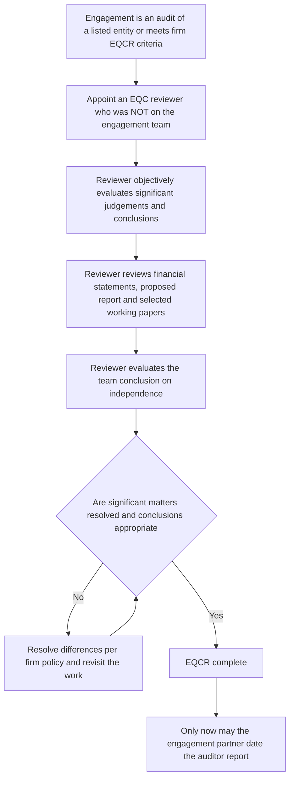
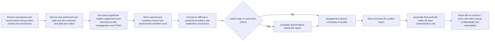

# Chapter 10 — Audit Documentation & Quality Control

## 1. The Problem

Imagine an auditor signs a report on a company's financial statements. The report is one page. It says, in effect, *"I looked; the numbers are true and fair."* Two years later something goes wrong — a fraud surfaces, a bank that lent on the strength of those accounts loses money, a regulator opens an inquiry. Everyone now turns to the auditor and asks a single, brutal question:

> **"Prove you actually did the work."**

Here is the trap. Auditing is invisible. Unlike a builder who leaves a bridge, or a surgeon who leaves a scar, the auditor leaves almost nothing physical behind. The *judgement* happened inside the auditor's head. The *procedures* happened across weeks, spread over a team of juniors, seniors and a partner. The *conversations* with management evaporated the moment they ended. If the auditor cannot reconstruct what was done, then from the outside there is **no difference between a diligent audit and a lazy one** — both produce the same one-page report.

This is the first problem: **the work product is invisible, so its quality is unverifiable.**

The second problem sits on top of it. An audit is never done by one person in one sitting. A junior tests bank reconciliations, a senior reviews the junior, the manager reviews the senior, the engagement partner signs. Each layer must be able to *check* the layer below. But you cannot review what you cannot see. If the junior's work lives only in the junior's memory, the senior is reviewing nothing — merely trusting.

The third problem is the deepest. A firm may have a brilliant partner and a reckless one working under the same letterhead. The client, the shareholder, the regulator cannot tell them apart before the fact — they all buy "an audit by XYZ & Co." So the *firm itself* becomes the unit of trust, and the firm must somehow guarantee that **every** engagement, done by **anyone** in its name, meets a minimum standard. One weak audit stains the whole firm's signature.

So we have three linked failures of trust waiting to happen:

- The individual auditor cannot **prove** the work (evidence problem).
- The team cannot **review** the work (supervision problem).
- The firm cannot **guarantee** consistency across engagements (quality problem).

Every rule in this chapter exists to close one of these three gaps.

## 2. The Core Idea

The core idea is disarmingly simple and worth stating as a single sentence you can carry through the whole chapter:

> **An audit opinion is only as good as the evidence that the audit was properly done — so the "record of the audit" is itself part of the audit.**

Two words do the heavy lifting: **documentation** and **quality control**. They are not two separate topics that happen to share a chapter. They are the *same* answer to the *same* problem, applied at two different levels.

- **Documentation** (SA 230) is how a single engagement makes its invisible work **visible and permanent**. It converts memory, judgement and conversation into a durable file that a stranger could pick up and understand.

- **Quality control** (SA 220 at the engagement level, and **SQC 1** at the firm level) is the system that makes sure the documented work is actually *good* — that competent people did it, that it was reviewed, that independence was protected, that difficult judgements got a second set of eyes.

The mental model to hold: **documentation is the evidence; quality control is the process that the evidence must record.** Quality control says *"a review must happen."* Documentation says *"and here is the proof it happened."* They interlock. A review that is not documented might as well not have occurred (nobody can prove it). Documentation of a process that has no quality-control requirement is just paperwork. Together they answer *"prove you did the work, and prove the work was good."*

Notice the recurring auditing DNA here: audit exists to solve the **trust/agency problem** between management (who prepare the accounts) and users (who rely on them). The auditor is the trusted intermediary. But *who audits the auditor?* Documentation and quality control are the profession's answer — they make the auditor's own work reviewable, so that the chain of trust does not simply dead-end at "trust me."

## 3. Why It's Built This Way

Before the technical content, understand *why* the architecture looks the way it does. Every design choice is a response to a specific risk.

**Why not just trust the auditor's word?**
Because the auditor has a subtle conflict. The auditor is *paid by the audited* (the company pays the audit fee), and the auditor's own reputation is on the line. When something goes wrong, there is every incentive to say *"of course I checked that"* after the fact. A contemporaneous, dated, un-editable-after-assembly file removes the temptation and the ambiguity. The file speaks; the auditor's later memory does not have to.

**Why demand a specific standard of documentation ("experienced auditor with no prior connection")?**
Because a private shorthand only the preparer understands proves nothing to a reviewer or a court. The benchmark forces the file to be self-explanatory to an *outsider*. This is the single most tested idea in SA 230 and the reason for its exact wording.

**Why put quality control at *two* levels (firm and engagement)?**
Because the two risks are different. A single engagement can go wrong because *that* team cut corners — so you need engagement-level control (SA 220): a partner responsible for *this* audit. But engagements can *systematically* go wrong because the *firm* hires badly, trains badly, or tolerates independence breaches — so you need firm-level control (SQC 1): policies that apply to *all* engagements. Fixing one level cannot fix the other. A great partner cannot save a rotten firm; great firm policies cannot save an engagement where the partner ignores them.

**Why an *independent* second review (EQCR) for high-risk engagements?**
Because the engagement partner is the very person whose judgement is under stress on a tough call — self-review bias means the person who made a decision is the worst-placed to spot its flaw. For listed companies and other high-risk cases, the profession inserts a reviewer who was *not* on the engagement, precisely so the second opinion is genuinely second.

**Why fixed retention periods?**
Because disputes surface *late*. Litigation, regulatory inquiry, tax reassessment — these often arrive years after the report. If the file is destroyed, the auditor is defenceless and the public-interest record is gone. But keeping everything forever is costly and pointless. So the profession fixes a period long enough to cover the realistic tail of disputes and no longer.

Hold this frame: **documentation and quality control are risk-management architecture, not bureaucracy.** Each rule below maps to a risk you can now name.

## 4. Full Technical Content

This is the exam-complete core. Every requirement is wrapped in the risk it counters. The four pillars are: **SA 230** (documentation), **SA 220** (engagement quality control), **SQC 1** (firm quality control), and **EQCR** (the independent review).

### 4.1 SA 230 — Audit Documentation

**What "audit documentation" means.** SA 230 defines it as the record of (a) audit procedures performed, (b) relevant audit evidence obtained, and (c) conclusions the auditor reached. The old term was "working papers"; the file as a whole is the **audit file**. This tri-part definition is deliberate — it forces the file to answer *what did you do, what did you find, and what did you conclude*, which are exactly the three things a sceptic will interrogate.

**The purpose (the "why" is examinable).** SA 230 lists why documentation matters, and each maps to a Section-1 problem:

| Purpose of documentation | Risk it counters |
|---|---|
| Evidence of the basis for the auditor's opinion | "Prove you did the work" — defends the opinion |
| Evidence the audit was planned and performed per SAs and law | Regulatory/peer-review challenge |
| Enables the engagement team to be directed, supervised, reviewed | Supervision problem — the team can check itself |
| Retains a record of matters of continuing significance to future audits | Efficiency and continuity across years |
| Enables quality control reviews and inspections (internal and external) | Firm-level and regulatory oversight |
| Enables the conduct of external inspections per legal/regulatory requirements | NFRA / peer review / QRB inspection |
| Assists in defending against litigation | The late-dispute problem |

**The governing standard — the benchmark of "enough."** This is the heart of SA 230 and the most common exam hook. Documentation must be sufficient to enable an **experienced auditor, having no previous connection with the audit, to understand**:

- (a) the **nature, timing and extent** of the audit procedures performed (the "what and how much");
- (b) the **results** of those procedures and the audit evidence obtained;
- (c) **significant matters** arising, the **conclusions** reached, and **significant professional judgements** made in reaching those conclusions.

Unpack why each phrase exists. *"Experienced auditor"* — so the standard is not "understandable to the person who wrote it" (that proves nothing) but understandable to a competent peer. *"No previous connection"* — strips away all the context that lived in the original auditor's head; the file must stand alone. *"Nature, timing and extent"* — the three dimensions of any procedure; a file that says "checked sales" without saying *how, when, and how much* is worthless. This benchmark is the operational meaning of "sufficient documentation."

**What must be recorded to identify the work (the identifiability rule).** Because the file must be reconstructable, SA 230 requires the auditor to record:

- **who performed** the work and the **date** it was completed;
- **who reviewed** the work, the **date**, and the **extent** of review.

Reason: this is the audit trail of the *supervision* itself. It proves not just that testing happened but that the review layers actually operated.

**Documenting identifying characteristics of items tested.** When recording procedures, the auditor records the **identifying characteristics** of the items tested — e.g., for a sample of purchase orders, the specific PO numbers and range; for a walkthrough, the specific transaction reference. Reason: it must be possible to *re-perform* or *trace back* to the exact items, otherwise "we tested a sample" is unfalsifiable.

**Significant matters and professional judgement.** The auditor must document discussions of significant matters with management, TCWG and others, including *when* and *with whom*. Reason: oral discussions evaporate; the significant, contentious, judgemental parts of an audit are exactly where later disputes cluster, so those are the parts that most need a written record.

**Departure from a relevant requirement (the exception log).** If, in exceptional circumstances, the auditor departs from a *relevant requirement* of an SA, the auditor must document **how the alternative procedures performed achieve the aim of that requirement, and the reasons for the departure.** Reason: SAs are mandatory; a documented, reasoned departure is accountable, an undocumented one is a violation.

**Matters arising *after* the date of the auditor's report.** If, in exceptional circumstances, the auditor performs new or additional procedures or draws new conclusions *after* the report date, the auditor documents: the circumstances, the new procedures/evidence/conclusions, and *when and by whom* the file changes were made and reviewed. Reason: this is the anti-backdating rule — it prevents silently "fixing" the file after signing.

**Assembly of the final audit file.** SQC 1 (and SA 230 by reference) requires the auditor to **assemble the final audit file on a timely basis after the date of the auditor's report.** The time limit fixed by SQC 1 is **ordinarily not more than 60 days** after the date of the auditor's report. Reason: assembly is an *administrative* completion — collating, sorting, discarding superseded drafts — **not** a window to do new audit work. Fixing 60 days prevents the file from staying "open" indefinitely (which would let the auditor keep changing conclusions).

> **Critical distinction (heavily tested):** *before* the report date the auditor can still do audit work; the **assembly period (≤60 days after)** is only for administrative completion. After assembly, the auditor **must not delete or discard** documentation before the end of the retention period, and any change/addition must be documented with who, when, why (as above).

**Retention period.** SQC 1 requires that the retention period for audit engagements is **ordinarily no shorter than seven years from the date of the auditor's report** (or, if later, the date of the group auditor's report). Reason: covers the realistic tail of litigation, regulatory inquiry and inspection. (Note the interaction with law — see Section 7; **confirm the exact interplay with Companies Act record-retention in current ICAI material.**)

**Form, contents and extent — what drives "how much."** SA 230 says the extent of documentation is a matter of professional judgement influenced by: size and complexity of the entity, nature of procedures, identified risks of material misstatement, significance of evidence obtained, nature and extent of exceptions identified, and the need to document a conclusion not readily determinable from the work itself. The guiding principle: **document enough for the "experienced auditor" benchmark to be met — no more, no less.** Reason: over-documentation wastes cost and buries the significant; under-documentation fails the proof test.

**What need NOT be documented (a favourite trap).** The auditor need not document *every* matter considered or *every* professional judgement made — only the significant ones. Superseded drafts, notes reflecting incomplete or preliminary thinking, duplicate documents, and copies of documents corrected for typographical errors need not be retained in the final file. Reason: the file records *conclusions and their basis*, not the messy scaffolding used to reach them.

### 4.2 SA 220 — Quality Control for an Audit of Financial Statements (Engagement Level)

SA 220 sits *inside* the firm's overall system (SQC 1) and asks: for **this specific engagement**, how is quality delivered? The unifying idea: **the engagement partner is responsible for the overall quality of the engagement** and must take the lead on it. Each requirement below is the partner discharging a specific quality risk.

- **Leadership responsibility for quality on the engagement.** The engagement partner sets the tone; quality is not delegated away. Risk: without a single accountable owner, quality falls between chairs.

- **Relevant ethical requirements, including independence.** The partner must remain alert, throughout the engagement, to evidence of non-compliance with ethics, and specifically form a conclusion on **independence** — considering threats, safeguards, and the firm's independence information. Risk: an audit by a non-independent auditor is worthless (the whole point of audit is an *independent* check).

- **Acceptance and continuance of the client relationship.** The partner must be satisfied that appropriate procedures were followed and that the conclusions reached (about integrity of the client, competence and capabilities, and ability to comply with ethics) are appropriate. Risk: some clients should never be accepted; taking on a dishonest or infeasible client poisons the engagement from the start.

- **Assignment of engagement teams.** The partner must be satisfied the team collectively has the **competence and capabilities** to perform the engagement and prepare an appropriate report. Risk: putting unqualified staff on a complex audit guarantees failure.

- **Engagement performance — direction, supervision and review.** The partner directs the team, supervises the work, and reviews it. The rule: **review by more experienced team members of work done by less experienced members.** Risk: the supervision problem from Section 1 — unreviewed junior work is unverified.

- **Consultation.** For difficult or contentious matters, the team must consult (internally or externally), and the partner must be satisfied that consultation happened, that the conclusion was agreed with the party consulted, and that the conclusion was **implemented**. Risk: a lone auditor over-confident on a hard technical point.

- **Engagement quality control review (EQCR).** For audits of listed entities (and other engagements the firm decides), the partner must ensure an EQCR is appointed, discuss significant matters with the reviewer, and **not date the report until the EQCR is completed** (detail in 4.4). Risk: self-review bias on high-stakes judgements.

- **Differences of opinion.** Within the team, or with the EQC reviewer or those consulted, differences must be resolved per firm policy, and the **report must not be dated until the matter is resolved.** Risk: unresolved dissent buried under a signature.

- **Monitoring.** The partner considers the results of the firm's monitoring process (and any deficiencies flagged) and whether they affect this engagement. Risk: firm-wide problems silently recurring on this file.

- **Documentation (SA 220's own doc requirements — links back to SA 230).** The partner documents: issues on ethical requirements and how resolved; conclusion on independence; conclusions on acceptance/continuance; and the nature, scope and conclusions of consultations. Risk: none of the above is provable unless recorded.

### 4.3 SQC 1 — Quality Control for Firms (Firm Level)

SQC 1 applies to **firms** performing audits, reviews, and other assurance and related services. Its objective: the firm establishes and maintains a **system of quality control** giving reasonable assurance that (a) the firm and its personnel comply with professional standards and legal/regulatory requirements, and (b) reports issued are appropriate in the circumstances. The system rests on **six elements** — each answering a firm-wide risk.

| # | SQC 1 element | Firm-level risk it addresses |
|---|---|---|
| 1 | **Leadership responsibilities for quality within the firm** (the "tone at the top") | If leadership prizes fees over quality, everyone follows; quality must be led from the top and not undercut by commercial pressure |
| 2 | **Ethical requirements** (integrity, objectivity, professional competence, confidentiality, professional behaviour) including **independence** | Firm-wide independence breaches — the firm must gather independence data, identify threats, apply safeguards, and enforce **rotation** where required |
| 3 | **Acceptance and continuance of client relationships and specific engagements** | Taking on clients the firm cannot serve competently, ethically, or that lack integrity |
| 4 | **Human resources** (recruitment, competence, career development, capabilities, performance evaluation, assignment of engagement teams) | Incompetent or under-resourced staff doing audits in the firm's name |
| 5 | **Engagement performance** (consistent quality, supervision, review, consultation, EQCR, differences of opinion, documentation, assembly & retention) | Inconsistent quality across engagements; this element *houses* the documentation/assembly/retention rules |
| 6 | **Monitoring** (ongoing consideration and evaluation of the firm's system, including periodic inspection of completed engagements) | The system decaying unnoticed — someone must audit the quality-control system itself |

Two of these elements deserve emphasis because they carry the specific rules examiners love:

**Element 5 (Engagement performance) is where the file lives.** SQC 1 mandates the firm to set policies on: completion of engagement documentation in a timely basis, the **assembly of the final file (≤60 days)**, the **confidentiality, safe custody, integrity, accessibility and retrievability** of documentation, and the **retention of documentation (≥7 years)**. Reason: the firm — not just the individual — must guarantee the file survives, stays confidential, and can be produced. A file that is lost, leaked, or tampered with fails its purpose.

**Element 6 (Monitoring) is the "audit of the audit system."** The firm must appoint someone competent and with sufficient authority to take responsibility for monitoring, and must perform **cyclical inspection of at least one completed engagement per engagement partner.** Reason: without monitoring, a quality-control *system* is just a document nobody checks; the periodic inspection is how the firm discovers its own weak spots before a regulator does. Deficiencies found must be communicated and remedial action taken.

### 4.4 Engagement Quality Control Review (EQCR)

The EQCR is the sharpest instrument in the toolkit, so it gets its own treatment.

**What it is.** An EQCR is an **objective evaluation, by a reviewer who is *not* part of the engagement team**, of the significant judgements the team made and the conclusions reached in formulating the report. The reviewer is the **engagement quality control reviewer (EQC reviewer)** — a partner, other person in the firm, a suitably qualified external person, or a team of such persons, with sufficient and appropriate experience and authority, and who meets the required objectivity/independence.

**When it is mandatory.** For all audits of financial statements of **listed entities**. The firm's policies must also require an EQCR for **other engagements that meet the firm's criteria** for review (e.g., high public interest, unusual risk, unusual nature/circumstances). Reason: EQCR is expensive; it is targeted at the engagements where a wrong opinion does the most public damage.

**What the reviewer does.** The EQC reviewer performs an **objective evaluation** of: the significant judgements made by the team; the conclusions reached (especially the appropriateness of the report); discussion of significant matters with the engagement partner; review of the financial statements and the proposed report; review of selected working papers relating to significant judgements; and evaluation of the conclusions on independence.

**The timing rule (the key control).** The engagement partner **must not date the auditor's report until the EQCR is complete.** Reason: the whole value of a second review is that it happens *before* the opinion is locked in. A review after the report is signed cannot change the opinion and is therefore worthless as a control.

**Why the reviewer must be independent of the team.** Because the reviewer's job is to catch the *self-review bias* of the very people who made the judgements. If the reviewer were on the team, they would be reviewing their own decisions — the exact conflict the mechanism exists to break.

*Figure 10.1 — The EQCR gate: the report cannot be dated until the independent review is complete.*

## 5. Applied Scenarios

Work these the way the exam frames them: identify the risk, then the requirement that answers it, then the conclusion.

**Scenario A — The confident senior with an empty file.**
CA Raghav, a senior on the audit of Meridian Ltd, tested the entire revenue cycle himself. His working paper says: *"Revenue tested, found correct."* Two years later NFRA inspects the file. The engagement partner insists the testing was thorough. *Was the documentation adequate?*

**Analysis.** No. Apply the SA 230 benchmark: could an **experienced auditor with no previous connection** understand the **nature, timing and extent** of procedures, their **results**, and the **conclusions**? "Revenue tested, found correct" reveals none of these — not *which* transactions (identifying characteristics), not *how* they were tested, not *how many*, not *what results* supported the conclusion. The work may well have been done, but SA 230's whole point is that undocumented work is *unprovable* work. The file fails, and the partner cannot defend the opinion. Additionally, there is no record of **who reviewed** the senior's work and **when** — the supervision trail is missing too.

**Scenario B — Fixing the file after signing.**
The auditor of Vault Finance Ltd signed the report on 15 May. On 10 July (56 days later), while assembling the file, a manager realises a key going-concern discussion with the CFO was never written up. She adds a memo dated 10 July recording the May conversation. Separately, on 20 August the auditor *learns of a new fact* about a lawsuit and performs additional procedures. *What are the documentation rules?*

**Analysis.** Two different things are happening. (1) The 10 July memo falls **within the ≤60-day assembly period** and is an **administrative completion** of documentation — permissible, provided it records the discussion that actually occurred and is not new audit work. It should note who added it and when. (2) The 20 August work is *after* the report date and involves **new procedures/conclusions after the report** — SA 230 requires documenting the **circumstances, the new procedures and evidence and conclusions reached, and when and by whom the changes were made and reviewed.** The auditor must **never delete** the original file contents. This is the anti-backdating architecture in action: the file grows transparently; it is never silently rewritten.

**Scenario C — The listed client and the tight deadline.**
Sterling Industries Ltd is listed. The engagement partner, under pressure from the audit committee to release results, wants to date and issue the report on 28 June. The EQC reviewer has raised a question on the impairment of goodwill and has not finished her review. The partner argues the EQCR can be "wrapped up next week." *Is this acceptable?*

**Analysis.** No — and this is the single hardest control in the chapter. Because Sterling is **listed**, an **EQCR is mandatory** (SA 220 / SQC 1). The rule is absolute: **the engagement partner must not date the auditor's report until the EQCR is complete.** Dating on 28 June with an open EQCR defeats the purpose of an independent pre-issuance review — a review that cannot change the opinion is no control at all. Moreover, the reviewer's open question on goodwill is precisely a **significant judgement**; if it amounts to a **difference of opinion**, firm policy for resolving differences applies and, again, the report is not dated until resolved. The deadline pressure is real but the sequence is non-negotiable: EQCR complete → then date the report.

**Scenario D — The firm with no monitoring (bonus, firm-level).**
A small firm has excellent partners but has never inspected any completed engagement, arguing "our partners are experienced, we don't need to." *Does the firm comply with SQC 1?*

**Analysis.** No. SQC 1 **Element 6 (Monitoring)** requires ongoing evaluation of the quality-control system, including **cyclical inspection of at least one completed engagement per engagement partner.** Competence of partners does not substitute for monitoring — monitoring is the mechanism by which the *firm* discovers whether its system is actually working. "Trust the partners" is exactly the un-checked trust the whole architecture is designed to replace.

## 6. Procedure & Documentation Summary

A compact operational walkthrough — the lifecycle of the file and the quality gates around it.

*Figure 10.2 — Lifecycle of the audit file from procedure to retention, with the quality gates in sequence.*

**Documentation checklist (what a strong file contains):**

| Item | Requirement source | The "why" |
|---|---|---|
| Nature, timing, extent of procedures | SA 230 | Reconstructable by an outsider |
| Identifying characteristics of items tested | SA 230 | Re-traceable to exact items |
| Results and evidence obtained | SA 230 | Supports the conclusion |
| Significant matters, judgements, conclusions | SA 230 | Where disputes cluster |
| Discussions with management/TCWG — when, with whom | SA 230 | Oral record made durable |
| Who performed / who reviewed — names, dates, extent | SA 230 | Supervision trail |
| Departures from a relevant SA requirement — how alternative met the aim, why | SA 230 | Accountable, not a violation |
| Post-report changes — circumstances, new work, who/when | SA 230 | Anti-backdating |
| Conclusion on independence; ethics issues and resolution | SA 220 | Independence is the point of audit |
| Consultation nature, scope, conclusions | SA 220 | Proof hard calls got expert input |
| EQCR completion before report date (where applicable) | SA 220 / SQC 1 | Independent pre-issuance check |
| Final file assembled ≤ 60 days | SQC 1 | Administrative closure, not new work |
| Retention ≥ 7 years; safe custody, confidentiality, retrievability | SQC 1 | Survives the late dispute |

## 7. Connections

Documentation and quality control are not an island — they thread through the entire syllabus.

- **SA 200 (Overall objectives).** SA 200 establishes professional scepticism, professional judgement, and sufficient appropriate audit evidence. Documentation is where scepticism and judgement leave a *trace*, and where "sufficient appropriate evidence" becomes provable. SA 230 is SA 200 made auditable.

- **SA 220 ⇄ SQC 1.** These are the same subject at two scales. SQC 1 sets *firm* policy; SA 220 requires the *engagement* to operate within it. SA 220 repeatedly says "the engagement partner may rely on the firm's system (SQC 1) unless information indicates otherwise." Learn them as a pair, not as rivals.

- **Ethics / Independence (Code of Ethics & Companies Act s.141 disqualifications).** Both SA 220 and SQC 1 make **independence** a first-order quality element. The rotation of auditors (**Companies Act s.139(2)**) and the firm-level independence policies of SQC 1 are two enforcement arms of the same idea — familiarity threatens objectivity, so the system forces fresh eyes.

- **Companies Act 2013 record-keeping.** The Act (e.g., books-of-account retention, and the auditor's own reporting under **s.143**) interacts with SQC 1's seven-year retention. The audit *file* (auditor's record) and the *books of account* (company's record) are distinct but both are subject to statutory retention regimes. **Confirm the exact company-law retention interaction in current ICAI/RTP material.**

- **SA 240 (Fraud) and SA 260/265 (Communication with TCWG / deficiencies).** These generate specific documentation obligations — fraud discussions, communicated deficiencies — that flow into the SA 230 file. Documentation is the common downstream repository of nearly every other SA.

- **NFRA / Peer Review / Quality Review Board.** External inspection regimes are the *reason* the file must satisfy the "experienced auditor with no previous connection" standard. The stranger in SA 230 is, in practice, an NFRA or peer-review inspector.

- **SA 230 ⇄ SA 500 (Audit Evidence).** SA 500 says *obtain* sufficient appropriate evidence; SA 230 says *record* it. Evidence not documented is, for accountability purposes, evidence not obtained.

## 8. Traps & Examiner Tricks

The examiner mines this chapter for precise-number and precise-wording questions. Guard against these:

- **60 days vs 7 years — never confuse them.** **60 days** is the *assembly* period (administrative completion, *after* the report). **7 years** is the *retention* period (how long the assembled file is kept). Both run *from the date of the auditor's report*. Mixing these up is the classic slip.

- **"Assembly" is administrative, not substantive.** A favourite trap: a scenario where, during the 60-day window, the auditor performs *new audit procedures*. That is **not** assembly. Assembly = collating, sorting, discarding superseded drafts. New procedures after the report date trigger the "changes after the report date" documentation rule, not a free extension of the audit.

- **The SA 230 benchmark wording.** The examiner wants the exact phrase: **"experienced auditor, having no previous connection with the audit."** Answers that paraphrase it as "any reader" or "a knowledgeable person" lose the point. And it must understand **nature, timing and extent + results + significant matters/conclusions/judgements** — list all three limbs.

- **"You must document everything" — FALSE.** You document *significant* matters and judgements, not every thought. Superseded drafts and preliminary notes need **not** be retained. A question that pushes "the auditor failed because he didn't document every single consideration" is testing whether you know the *significance* filter.

- **EQCR is not for every audit.** It is mandatory for **listed entities** and firm-defined high-risk engagements — *not* every client. A trap scenario applies EQCR to a small private company with no such trigger.

- **The EQCR timing rule is absolute.** "The report was dated first and the EQCR finished a few days later" is *always* wrong for a listed entity. Report date **cannot precede** EQCR completion.

- **SA 220 vs SQC 1 level confusion.** If the question is about *firm* policies (recruitment, monitoring, tone at the top, retention policy), it's **SQC 1**. If it's about *this engagement* (this partner, this team, this independence conclusion), it's **SA 220**. Answering "SA 220" for a firm-monitoring question is a level error.

- **Ownership of working papers.** Trap: "the working papers belong to the client because the client paid." **False.** Working papers are the **property of the auditor.** The auditor may, at discretion, make portions available to the client, but the client has no right to them; the auditor must keep them confidential and in safe custody (SQC 1). (Confirm the precise treatment in ICAI's SA 230 guidance.)

- **Departure from an SA requirement.** Trap answer: "the auditor can never depart from an SA." Reality: in *exceptional* circumstances the auditor may perform *alternative* procedures, **provided** he documents how the alternative achieves the requirement's aim and the reasons. The sin is undocumented departure, not departure itself.

- **Monitoring inspection frequency.** The "at least one completed engagement per engagement partner on a cyclical basis" detail is examinable — vague answers ("the firm should review some files sometimes") lose marks.

## 9. First-Principles Recap

Strip everything back and rebuild it from the three original problems:

1. **The work is invisible → make it visible and permanent.** That is **SA 230 documentation**. The test of "enough" is not the writer's satisfaction but a *stranger's* comprehension — the experienced auditor with no prior connection. Record what you did (nature, timing, extent), what you found (results, evidence), and what you concluded (significant matters, judgements). Record who did it and who reviewed it. Because memory and conversation evaporate, only the file survives to prove the audit happened.

2. **A team must review itself → build the review into the process and the record.** That is **SA 220 engagement quality control**: one accountable partner, competent staff, more-experienced reviewing less-experienced, consultation on hard calls, independence concluded, and — for high-stakes engagements — an *independent* second reviewer (EQCR) whose review must finish *before* the opinion is locked. Self-review bias is broken by putting the second opinion in genuinely different hands.

3. **A firm's signature must mean the same thing every time → govern quality at the firm level.** That is **SQC 1**: six elements (leadership, ethics/independence, acceptance/continuance, human resources, engagement performance, monitoring) that make quality a *system*, not a personal virtue. And the system audits itself through **monitoring**.

4. **Disputes arrive late → keep the proof.** Assemble the file promptly (**≤60 days**, administrative only) and retain it long enough to cover the tail (**≥7 years**), in safe custody, confidential, retrievable — and *never* silently rewritten; post-report changes are documented in the open.

The unifying sentence again: **documentation is the evidence that the work was done; quality control is the process that the evidence must show was good.** One proves *that* you worked; the other proves the work was *worth trusting*. Together they answer the profession's own agency problem — *who audits the auditor?* — with: the file does, the reviewer does, the firm's system does, and the inspector can.

## 10. Quick-Revision Sheet

**Four pillars**

| Pillar | Level | One-line purpose |
|---|---|---|
| SA 230 | Engagement | Record the audit so it is provable and reviewable |
| SA 220 | Engagement | Deliver quality on *this* audit; partner is responsible |
| SQC 1 | Firm | System giving reasonable assurance of quality across *all* engagements |
| EQCR | Engagement (high-risk) | Independent objective review of significant judgements before the report is dated |

**SA 230 must-knows**
- Definition: record of **procedures performed + evidence obtained + conclusions reached** (formerly "working papers"; whole = **audit file**).
- Benchmark: understandable by an **experienced auditor, no previous connection** — the **nature, timing, extent**; the **results**; the **significant matters, conclusions, judgements**.
- Record **who performed/date** and **who reviewed/date/extent**; record **identifying characteristics** of items tested.
- Document **significant discussions** (when, with whom); document **departures** from an SA requirement (how alternative met the aim + why).
- **Post-report changes:** document circumstances, new work, who/when; **never delete** original contents.
- Need **not** document every judgement; need **not** retain superseded drafts/preliminary notes.

**Numbers (from the auditor's report date)**
- **Assembly of final file: ≤ 60 days** (administrative completion only — no new audit work).
- **Retention: ≥ 7 years** (safe custody, confidentiality, integrity, accessibility, retrievability).
- **Working papers = auditor's property** (client has no right; auditor may share portions at discretion).

**SA 220 — engagement partner's responsibilities**
Leadership on quality · ethics + **independence conclusion** · acceptance/continuance · competent team · **direction, supervision, review** (senior reviews junior) · **consultation** (implemented) · **EQCR where applicable** · resolve **differences of opinion** before dating report · consider **monitoring** results · document all of it.

**SQC 1 — six elements**
1. Leadership (tone at the top) · 2. Ethical requirements + independence (incl. **rotation**) · 3. Acceptance & continuance · 4. Human resources · 5. Engagement performance (houses **assembly, retention, EQCR, consultation, differences**) · 6. **Monitoring** (cyclical inspection of **≥ 1 completed engagement per engagement partner**).

**EQCR — the sharp control**
- Mandatory for **listed entities** + firm-defined high-risk engagements.
- Reviewer is **NOT** on the engagement team (breaks self-review bias).
- Reviews significant judgements, conclusions, the report, selected working papers, independence.
- **Report must NOT be dated until EQCR is complete.**

**The one sentence:** *Documentation is the evidence the work was done; quality control is the process the evidence must prove was good — together they answer "who audits the auditor?"*

> **Confirm in current ICAI material:** exact interaction of SQC 1's 7-year retention with Companies Act 2013 record-retention; any migration references to the newer quality-management framework (SQM 1 / SQM 2 / SA 220 (Revised)) if adopted for your attempt — this chapter states the SQC 1 / SA 220 position per the extant CA Intermediate syllabus.
