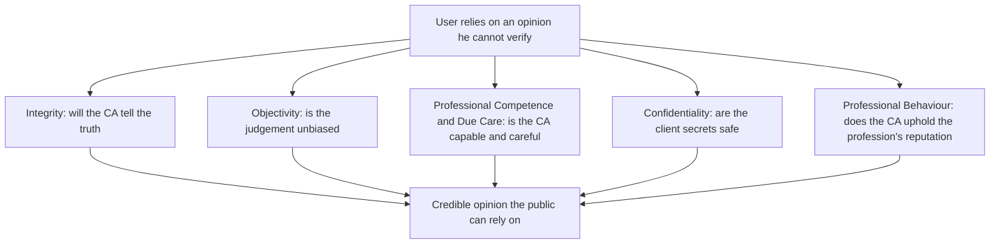
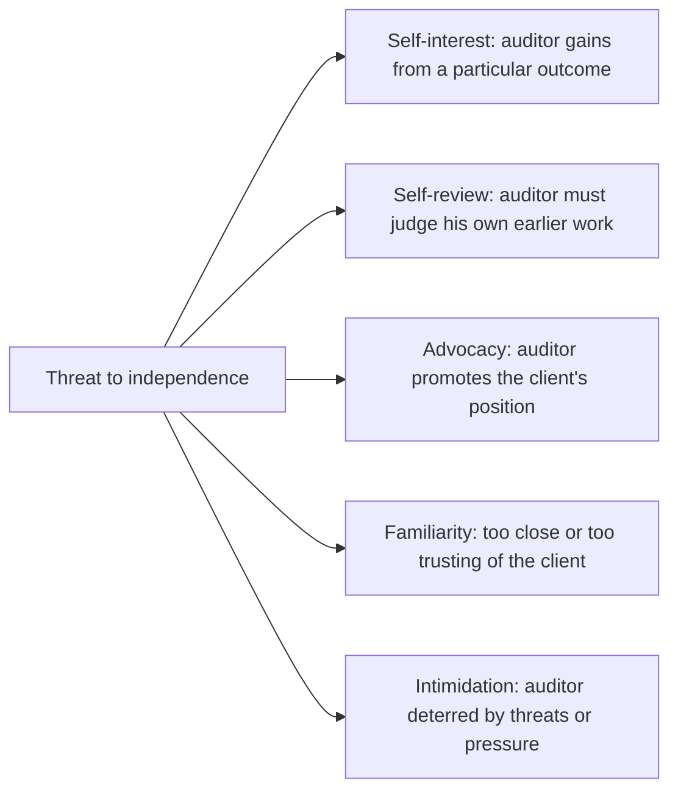
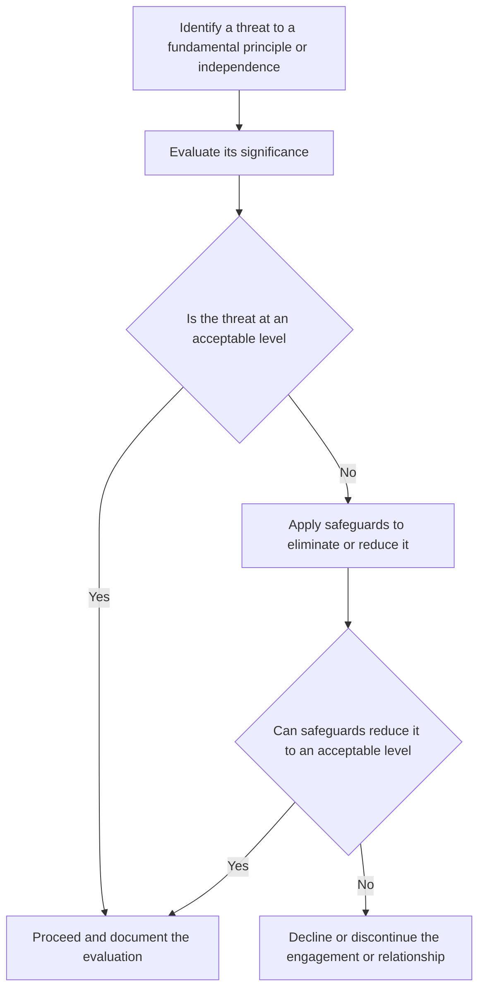
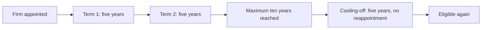

# Chapter 11 — Professional Ethics & Independence

## 1. The Problem

Strip away everything decorative about an audit and one uncomfortable fact remains: **the auditor is paid by the very people whose work he is checking.** The company's directors negotiate his fee, sit across the table at every meeting, can decline to reappoint him, and control the flow of information he depends on. Yet the people who actually *rely* on his opinion — the retail shareholder in Coimbatore, the bank about to lend ₹50 crore, the ITC officer, the prospective investor — are nowhere in the room. They never meet the auditor. They cannot verify his working papers. They simply read three or four paragraphs at the end of the annual report and, on the strength of them, part with their money.

This is the **agency problem** dressed in its sharpest clothes. Management has the information; outsiders have the risk. The audit is supposed to bridge that gap — but the bridge is only as trustworthy as the person who built it. And that person has every commercial incentive to keep his paying client happy.

So the reader who refuses to memorise should sit with the real question first: **Why would anyone believe an auditor's opinion at all?** He's not a government official. He's not disinterested. He's a professional running a firm that needs revenue. What stops him from quietly signing whatever keeps the fees flowing?

The answer cannot be "because he's honest," because you cannot verify honesty from the outside. The profession's answer is structural: an audit opinion is only worth reading if the person giving it is **independent** of the outcome and **bound by enforceable principles** that override his self-interest. Ethics, in auditing, is not a soft topic bolted onto the end of the syllabus. It is the *load-bearing wall*. Remove it and the entire assurance edifice — SA 700 opinions, materiality, sampling, the lot — collapses into an expensive formality.

That is the problem this chapter addresses: **how do you make a paid opinion believable to people who cannot check it?**

---

## 2. The Core Idea

The core idea is a single sentence you should be able to reconstruct from first principles:

> **An audit opinion has value only to the extent that its author is independent in fact and in appearance and behaves according to principles that a rational outsider can trust to hold even when the client would prefer otherwise.**

Two words in that sentence do the heavy lifting.

**Independence** answers: *is the auditor free of any interest that would bias the conclusion?* If the auditor owns shares in the client, his wealth rises when the accounts look good — his interest is no longer aligned with the truth. Independence is the machinery that keeps the auditor's self-interest from contaminating his judgement.

**Integrity and the other fundamental principles** answer: *even where no financial bias exists, will the auditor behave in a way the public can rely on?* Will he tell the truth even when it costs the engagement? Keep client secrets? Refuse work he isn't competent to do?

Crucially, independence is demanded in **two forms**, and understanding *why both* is the conceptual crux:

- **Independence of mind (independence in fact)** — the actual state of mind that permits an unbiased conclusion. This is the substance.
- **Independence in appearance** — the avoidance of facts and circumstances so significant that a *reasonable and informed third party* would conclude the auditor's objectivity was compromised.

A student's instinct is: "surely only the real thing matters — if the auditor is genuinely unbiased, who cares how it looks?" But recall the problem statement. **The user cannot see inside the auditor's mind.** He can only observe circumstances. If the audit firm's partner is the CFO's brother, the shareholder has no way to confirm the audit was actually objective — and rationally, he *won't believe it was.* The moment appearance is compromised, the opinion loses its power to reassure, regardless of the underlying truth. Assurance is a product sold on *credibility*, and credibility lives in the eye of the user. Hence appearance is not vanity; it is half the product.

Everything technical in this chapter — the five fundamental principles, the five threat categories, the safeguards, the Companies Act prohibitions — is machinery built to protect these two things.

---

## 3. Why It's Built This Way

Before the rules, understand the design logic. Three structural choices explain almost every specific provision you'll meet.

**Choice 1: Principles over an infinite rulebook.** You could try to list every forbidden act — "don't own client shares, don't lend to the client, don't marry the CFO…" — but reality generates novel conflicts faster than any list can grow. So the Code of Ethics (issued by ICAI, aligned with the IESBA International Code) is built on a **conceptual framework**: five broad *fundamental principles*, plus a *threats-and-safeguards* method for handling anything the specific rules don't name. The professional is required to *think*, not just look up. This is precisely the temperament of a self-learner: the framework tells you how to reason about a situation the examiner invented that no textbook lists.

**Choice 2: Categorise threats by their psychological mechanism.** Rather than memorising 200 risky situations, the Code groups them into **five families by *why* they bias judgement** — self-interest, self-review, advocacy, familiarity, intimidation. Once you understand the *mechanism*, you can classify any new fact pattern. This is the single most exam-productive idea in the chapter.

**Choice 3: Layer three defences — the profession's rules, the firm's safeguards, and hard legal prohibitions.** Some threats are so severe that no safeguard can reduce them to acceptable levels, so the law simply bans the situation outright (e.g., a statutory auditor holding shares in the company). Others can be managed with safeguards (rotate the engagement partner, add an independent reviewer). The system is deliberately layered because threats vary in severity.

Keep this scaffolding in mind: **principles → threats → safeguards → outright prohibitions.** The rest of the chapter fills it in.

---

## 4. Full Technical Content

### 4.1 The Governing Instruments (know the sources)

| Instrument | What it governs | Why it exists |
|---|---|---|
| **ICAI Code of Ethics** (based on IESBA Code) | Fundamental principles, conceptual framework, threats & safeguards, independence for assurance engagements | Makes ethical reasoning enforceable and profession-wide |
| **Chartered Accountants Act, 1949 — Schedules I & II** | "Professional misconduct"; disciplinary machinery | Gives the Code legal teeth — breach = misconduct |
| **SA 200** | Overall objectives; requires compliance with *relevant ethical requirements including independence* | Ties ethics into every audit as a precondition |
| **SQC 1 / SA 220** | Firm-level and engagement-level quality controls, including independence procedures | Makes the firm, not just the individual, responsible |
| **Companies Act, 2013 — ss. 141, 144, 139(2)** | Eligibility/disqualifications of auditors, prohibited non-audit services, rotation | Hard legal backstop for the most dangerous conflicts |

> *Note: confirm the current edition's paragraph numbering in the latest ICAI Code of Ethics, as ICAI periodically revises to track IESBA updates.*

The relationship, in one line: **SA 200 says "comply with ethical requirements"; the Code of Ethics says *what* they are; the CA Act and Companies Act make some of them legally binding with penalties.**

### 4.2 The Five Fundamental Principles — each as an answer to a risk

The Code requires a Chartered Accountant to comply with five fundamental principles. Do not learn them as a list; learn each as **the specific betrayal it prevents.**

*Figure 11.1 — The five fundamental principles, each closing a different gap in the user's trust.*

**(a) Integrity.** To be *straightforward and honest* in all professional and business relationships; it implies fair dealing and truthfulness. *The risk it counters:* the auditor's core deliverable is a truthful statement; if he'll knowingly associate with false or misleading information, the opinion is worthless at the root. Integrity specifically forbids being associated with reports the CA knows to contain materially false, misleading, or recklessly-made statements, or that omit/obscure information. It is the principle that survives even commercial pressure — the one that says *walk away rather than sign a lie.*

**(b) Objectivity.** To *not allow bias, conflict of interest, or undue influence of others* to override professional judgement. *The risk it counters:* the whole point of an *independent* opinion is that it isn't management's opinion in disguise. Objectivity is the mental state; independence (below) is the set of circumstances that protects it. A CA must not perform a service if a circumstance unduly influences his judgement.

**(c) Professional Competence and Due Care.** To *maintain professional knowledge and skill* at the level required to give competent service (keeping up with technical, legislative developments), and to *act diligently* per applicable standards. *The risk it counters:* an honest, unbiased auditor who simply *doesn't know* the applicable Ind AS or misses a required procedure produces a wrong opinion just as damaging as a dishonest one. Competence has two limbs — **attainment** (getting the knowledge) and **maintenance** (CPE, staying current). Due care demands diligent, careful application.

**(d) Confidentiality.** To *respect the confidentiality* of information acquired through professional relationships and *not disclose it without proper authority* (unless a legal/professional right or duty to disclose exists), nor *use it for personal advantage.* *The risk it counters:* an audit only works if management hands over sensitive data — margins, contracts, litigation. If clients feared leakage, they'd conceal information and the audit would be starved of evidence. Confidentiality is the *lubricant* that makes candid disclosure to the auditor safe. Note the two prohibited acts: **disclosing** *and* **using** (even without disclosure — e.g., trading on inside knowledge). It continues **after** the relationship ends and extends to family/social settings.

*Permitted/required disclosures (the exam favourite):* (i) permitted by law and authorised by the client; (ii) *required by law* — e.g., producing documents in legal proceedings, disclosing infringements to authorities; (iii) *professional duty or right* — e.g., complying with a peer/quality review, ICAI investigation, defending oneself in litigation, or complying with technical/ethical standards.

**(e) Professional Behaviour.** To *comply with relevant laws and regulations and avoid any conduct that discredits the profession.* *The risk it counters:* the value of a CA's signature depends on the *collective* reputation of "Chartered Accountant." One member's disgraceful conduct — or misleading advertising, or unsubstantiated claims about competitors — debases the currency for everyone. This principle governs solicitation, advertising, and general conduct so the brand stays trustworthy.

### 4.3 Independence — the special demand for assurance engagements

Independence is *not* one of the five fundamental principles — it is a **distinct, additional requirement** that applies specifically to **assurance engagements** (audits and reviews). Why single it out? Because in assurance work the *entire value proposition* is that the conclusion is unbiased; independence is objectivity's structural guarantee. The Code requires independence in the two forms established in Part 2:

- **Independence of mind** — the state permitting a conclusion without bias, conflict, or undue influence; acting with integrity, objectivity, professional scepticism.
- **Independence in appearance** — avoiding circumstances so significant that a *reasonable and informed third party* would likely conclude integrity/objectivity/scepticism had been compromised.

The test for appearance — the **"reasonable and informed third party"** test — is worth memorising verbatim, because examiners phrase problems around it: *not* "would this actually bias me?" but "would an informed outsider reasonably doubt it?"

### 4.4 The Five Threats to Independence — mechanisms, not lists

Any circumstance that endangers independence is classified by its **psychological mechanism** into one of five categories. Learn the *why* of each, and you can classify anything.

*Figure 11.2 — Five threat families, grouped by the mechanism through which each corrupts judgement.*

**(1) Self-interest threat — "I gain if the numbers look a certain way."**
*Mechanism:* a financial or other interest of the auditor (or a close family member) aligns his personal benefit with a particular audit outcome, so the incentive to find and report problems is dulled.
*Examples:* holding shares in the audit client; a loan to/from the client; **fee dependence** — a single client contributing an undue proportion of the firm's total fees; a contingent fee; a close business relationship with the client; the auditor being offered employment by the client.

**(2) Self-review threat — "I'd be marking my own homework."**
*Mechanism:* the auditor is asked to evaluate, as part of the audit, results of a service *he himself* previously performed. People are psychologically incapable of neutrally auditing their own work — admitting an error means admitting *personal* fault.
*Examples:* the firm prepared the client's accounts/financial statements and now audits them; provided bookkeeping, valuation, actuarial, or the design of the internal financial-control system, then audits those very outputs; a former firm member now a director whose decisions the audit must assess.

**(3) Advocacy threat — "I've publicly taken the client's side."**
*Mechanism:* the auditor promotes or champions the client's position to the point where his objectivity as a neutral verifier is compromised — a promoter cannot also be a neutral referee.
*Examples:* representing the client in litigation or a tax dispute *against a third party or authority*; promoting/underwriting the client's shares; acting as an advocate for the client in a legal matter material to the financials.

**(4) Familiarity threat — "I'm too close to them to be sceptical."**
*Mechanism:* a long or close relationship makes the auditor overly sympathetic, overly trusting, or emotionally invested, dulling the professional scepticism the audit depends on.
*Examples:* a close family member of the audit team in a key position at the client; a long association of senior personnel with the same client (why **partner rotation** exists); a former partner now in a key management role at the client; accepting significant gifts or hospitality (unless trivial and inconsequential).

**(5) Intimidation threat — "I'm afraid of what happens if I don't comply."**
*Mechanism:* actual or perceived pressures deter the auditor from acting objectively — fear overrides judgement.
*Examples:* threat of dismissal or non-reappointment over a disagreement on accounting treatment; threat of litigation; pressure to reduce work inappropriately to cut fees; a dominant, aggressive client personality.

> A single set of facts can trigger **more than one** threat. Preparing the client's accounts *and* depending heavily on its fees is *both* self-review *and* self-interest. Examiners love this — always scan all five.

### 4.5 Safeguards — reducing threats to an acceptable level

A safeguard is an action that eliminates a threat or reduces it to an **acceptable level** (the level at which a reasonable and informed third party would conclude compliance with the fundamental principles is not compromised). The Code groups safeguards into two broad sources:

**A. Safeguards created by the profession, legislation, or regulation** — educational/training/experience entry requirements; CPE requirements; professional standards; monitoring and disciplinary procedures; external review of reports by a legally empowered third party.

**B. Safeguards within the firm's own systems and environment** — firm-wide (e.g., leadership stressing independence, quality-control policies per **SQC 1**, documented independence policies, rotation of senior personnel, disciplinary mechanisms) and engagement-specific (e.g., an **engagement quality control reviewer (EQCR)** who was not on the team, rotating the engagement partner, using different partners/teams for non-assurance services, consulting a third party such as ICAI).

The evaluation logic is a loop, and it is examinable as a procedure:

*Figure 11.3 — The conceptual framework in action: no engagement proceeds while an unacceptable threat lacks an effective safeguard.*

The critical takeaway: **if no safeguard can bring the threat to an acceptable level, the only ethical response is to refuse or resign.** There is no "manage it and hope" option.

### 4.6 The Legal Backstop — Companies Act, 2013 (where safeguards aren't trusted)

For the most dangerous conflicts, Parliament did not leave it to professional judgement — it *legislated prohibitions.* These convert an ethical threat into a legal disqualification. Understand each as a *frozen* threat-and-safeguard decision: the legislature decided the threat is so severe that outright prohibition is the only adequate safeguard.

**Section 141 — Eligibility, Qualifications and Disqualifications of Auditor.** A person is **not eligible** for appointment as auditor if, among others:
- a **body corporate** (except an LLP) — accountability must rest on identifiable professionals;
- an **officer or employee** of the company — self-review/familiarity in the extreme;
- a partner/employee of an officer or employee of the company;
- a person (or his partner/relative) holding **any security or interest** in the company (relatives may hold face value up to the prescribed limit — *confirm current threshold, historically ₹1,00,000*) — a naked **self-interest** threat;
- a person indebted to the company beyond the prescribed amount, or who has given a guarantee for a third party's indebtedness beyond the prescribed limit — **self-interest/intimidation**;
- a person with a **business relationship** with the company (beyond prescribed exceptions) — self-interest;
- a person whose **relative is a director** or in key managerial personnel — **familiarity**;
- a person in **full-time employment elsewhere**, or holding audits of **more than 20 companies** (ceiling limit) — competence/due-care;
- a person convicted of fraud in the last 10 years — professional behaviour/integrity;
- a person who **directly or indirectly renders prohibited services under s. 144**.

**Section 144 — Auditor not to render certain services.** The auditor (and its network) must **not** provide to the audit client (or its holding/subsidiary) these services, precisely because each creates a self-review or advocacy or self-interest threat too severe to safeguard: accounting and book-keeping; internal audit; design and implementation of any **financial information system**; actuarial services; investment advisory; investment banking; rendering of outsourced financial services; management services; and any other prescribed service. *Map each to its threat:* bookkeeping/internal audit/financial-system design = **self-review**; investment banking/advisory = **advocacy/self-interest**. This is the Companies Act codifying the self-review and advocacy threats.

**Section 139(2) — Rotation of auditors** (listed companies and prescribed classes). An individual auditor may serve **one term of five consecutive years**; an audit firm **two terms of five consecutive years (max 10)**, followed by a **five-year cooling-off** period during which neither the firm (nor a firm with common partners under the same network) may be reappointed. *Why:* this is the legislative response to the **familiarity threat** — no relationship, however professional, is allowed to run indefinitely.

*Figure 11.4 — Section 139(2) firm rotation: the familiarity threat, capped and cooled by statute.*

> Sections 139–148 are covered in depth in the "Company Audit" chapter; here they appear as the *legal embodiment* of the ethics framework. Cross-refer, don't duplicate.

### 4.7 Fees — a threat hiding in plain sight

Fees deserve their own note because they touch three threats at once.
- **Fee dependence / undue proportion:** if one client generates too large a share of total firm income, the fear of losing it (intimidation) and the desire to keep it (self-interest) both bite. Safeguard: monitor the proportion, use an external quality review, reduce dependence.
- **Contingent fees** (fees dependent on the outcome or on a result — e.g., "a percentage of the tax you save") are **prohibited for assurance engagements** — they align the fee directly with a particular outcome, a self-interest threat by construction.
- **Overdue fees** from the prior year functioning like a loan to the client — a self-interest threat; assess before accepting reappointment.

### 4.8 The disciplinary consequence

Breach of the Code is not merely frowned upon — under the **Chartered Accountants Act, 1949**, conduct falling within the **First and Second Schedules** constitutes **"professional misconduct,"** triable by the ICAI's disciplinary mechanism (Board of Discipline / Disciplinary Committee), with penalties up to **removal of name from the Register** and monetary fines. This legal enforceability is *what makes the ethics believable* — it is the ultimate safeguard standing behind every principle.

---

## 5. Applied Scenarios

**Scenario 1 — The convenient bookkeeping.**
*Facts:* CA Meera's firm has audited Zephyr Pvt Ltd for years. To help the small client, her firm also maintains Zephyr's books and prepares its draft financial statements, then audits them. The director says, "You know the numbers best — just sign off."
*Analysis:* Two threats. Preparing and then auditing the same financial statements is a textbook **self-review threat** — Meera cannot neutrally evaluate work her own firm produced. Under **s. 144**, providing **accounting and book-keeping services** to an audit client is *prohibited outright* if Zephyr falls within the Act's audit framework — there is *no* safeguard that rescues it. *Conclusion:* the firm must cease providing the bookkeeping service or resign as auditor; it cannot do both. If Zephyr were a client to which s.144 did not apply, the self-review threat would still require robust safeguards (separate personnel, independent review) and may still be untenable.

**Scenario 2 — The valuable client.**
*Facts:* A single listed client, Orion Ltd, contributes 42% of CA Rahul's firm's total fee income. During the audit Rahul finds an aggressive revenue-recognition treatment he believes is wrong. The CFO says, "Push back on this and we'll reconsider the appointment next year."
*Analysis:* Three threats stacking. The 42% dependence is a **self-interest threat** (Rahul's firm needs the money) *and* a **familiarity/self-interest** dependence problem; the CFO's explicit warning is an **intimidation threat.** *Safeguards:* because the threats are severe, professional-level safeguards are needed — an **engagement quality control review** by an independent partner, consultation with ICAI, and reducing dependence on the single client over time. Critically, on the accounting disagreement itself, integrity and objectivity *override* the fee: if the treatment is materially wrong and uncorrected, Rahul must **modify the opinion** (SA 705) regardless of the threat to reappointment. If no safeguard can protect his objectivity, resignation is the ethical floor.

**Scenario 3 — The family connection.**
*Facts:* CA Anjali is offered the statutory audit of Bluewave Ltd. Her brother is the company's Finance Director (a KMP). She reasons, "I'm completely professional; my judgement won't be affected."
*Analysis:* This is where the *appearance* test bites. Even accepting Anjali's genuine objectivity (independence of mind), a **reasonable and informed third party** would doubt an audit where the auditor's brother runs the finances — **independence in appearance** is destroyed. Moreover, under **s. 141**, a person whose **relative is a director or KMP** of the company is *disqualified* from appointment — the legislature froze this familiarity threat into a legal bar. *Conclusion:* Anjali is **ineligible**; she must decline. Her personal confidence is irrelevant, because the user cannot see inside her mind — which is the whole reason appearance matters.

**Scenario 4 — The confidential tip.**
*Facts:* During Falcon Ltd's audit, CA Vikram learns of an unannounced merger that will lift Falcon's share price. His cousin asks him for "any good stock tips."
*Analysis:* **Confidentiality** prohibits both *disclosing* the information *and* *using it for personal (or another's) advantage* — even a hint to the cousin, and certainly any trading, breaches the principle (and securities law). No safeguard makes this acceptable; the duty persists even after the engagement ends. *Conclusion:* Vikram must say nothing and use nothing. Silence is the only compliant response.

---

## 6. Procedure & Documentation Summary

The examinable *process* for handling any ethics/independence question — reproduce this as your answer skeleton:

1. **Identify** — scan the facts against the five fundamental principles and the five threat categories. Name the threat(s) precisely; note if several apply.
2. **Evaluate significance** — quantitative (e.g., % of fees, size of shareholding) and qualitative (seniority of the person, materiality to the FS). Apply the **reasonable and informed third party** test for appearance.
3. **Check for an outright legal bar first** — is this disqualified under **s. 141**, or a prohibited service under **s. 144**, or a rotation breach under **s. 139(2)**? If so, safeguards are irrelevant — decline/resign.
4. **Apply safeguards** — profession-created and firm/engagement-level (EQCR, partner rotation, separate teams, independent review, ICAI consultation).
5. **Re-assess** — is the residual threat now at an acceptable level? If not, **decline or discontinue.**
6. **Document** — record the threat identified, its evaluation, the safeguards applied, and the conclusion (SQC 1 / SA 220 require this; independence conclusions must be documented). Obtain **written independence confirmations** from engagement team members.

| Requirement | Standard/Source | The "why" |
|---|---|---|
| Comply with relevant ethical requirements incl. independence | SA 200 | Precondition of any credible audit |
| Firm-level independence policies & monitoring | SQC 1 | Makes the firm accountable, not just the individual |
| Engagement partner to form conclusion on independence | SA 220 | Front-line responsibility on each audit |
| Document threats, safeguards, conclusions | SQC 1 / SA 220 | Evidence the framework was actually applied |
| Written independence confirmation from team | SA 220 / firm policy | Converts a principle into an auditable act |

---

## 7. Connections

- **To SA 200 (Chapter on basic concepts):** SA 200 lists ethics + independence as *preconditions* of an audit conducted per SAs. This chapter is the content of that precondition.
- **To SA 705/706 (opinions):** Scenarios 2 shows the link — ethical courage is what makes an auditor *actually* modify an opinion when the client resists. Ethics without the willingness to qualify is decoration.
- **To Company Audit (ss. 139–148):** ss. 141, 144, 139(2) are the *legal skeleton* of the ethics framework; study them there in procedural detail, here for their *rationale*.
- **To Quality Control (SQC 1 / SA 220):** safeguards live inside the firm's quality-control system; ethics is operationalised through QC.
- **To Professional Scepticism (SA 200/SA 240):** the *familiarity* threat is precisely the erosion of scepticism; independence protects the sceptical mindset fraud detection needs.
- **To the CA Act, 1949 (Schedules I & II):** the disciplinary enforcement that gives the whole Code its bite.

---

## 8. Traps & Examiner Tricks

- **"He's honest, so it's fine."** No — *appearance* is an independent requirement. If a reasonable third party would doubt it, independence fails *regardless* of actual integrity. Scenario 3 is built on this.
- **Confusing objectivity with independence.** Objectivity is a fundamental *principle* (state of mind, applies to all services); **independence** is a *separate additional* requirement specifically for **assurance** engagements. Don't call independence a "fundamental principle."
- **Only spotting one threat.** Fee-dependence + client pressure = self-interest **and** intimidation. Bookkeeping-then-audit = self-review, often + self-interest. Always scan all five.
- **Assuming safeguards can fix anything.** Some situations (s.141 disqualifications, s.144 prohibited services, contingent fees for assurance) admit **no** safeguard — the answer is *decline/resign*, not "apply safeguards."
- **Confidentiality = only 'don't disclose'.** It *also* forbids **using** the information (insider trading), continues **after** the engagement, and has recognised **exceptions** (required by law, professional duty/right). Examiners test the exceptions.
- **Forgetting the enforcement.** Breach isn't abstract — it's **professional misconduct** under the CA Act Schedules, punishable up to removal from the Register. Stating this earns marks.
- **Mislabelling advocacy vs self-review.** Representing the client *against a third party/tax authority* = **advocacy**. Auditing your *own prior work* = **self-review.** Keep the mechanism straight.
- **Relative shareholding.** Relatives *may* hold securities up to a prescribed face-value limit (*confirm current figure in ICAI material*); it is not an absolute zero. But a *relative as director/KMP* is a flat disqualification.

---

## 9. First-Principles Recap

Rebuild the whole chapter from the opening problem:

1. An audit opinion is a **paid** opinion, relied on by **outsiders who cannot verify it.** Why believe it?
2. Because two things are guaranteed: the author is **independent of the outcome**, and he is bound by **enforceable principles** stronger than his self-interest.
3. Independence must hold **in fact** (real objectivity) *and* **in appearance** (because users judge only what they can see — a "reasonable and informed third party").
4. Objectivity is protected by naming the **five ways judgement gets corrupted** — self-interest, self-review, advocacy, familiarity, intimidation — so any new situation can be classified by *mechanism.*
5. Each threat is met with **safeguards**; if safeguards can't reduce it to an acceptable level, you **decline or resign.** No middle path.
6. The most dangerous threats aren't left to judgement — the **Companies Act (ss. 141, 144, 139(2))** bans them outright.
7. The five **fundamental principles** — integrity, objectivity, competence & due care, confidentiality, professional behaviour — each close a distinct gap in user trust.
8. The whole system is credible only because breach = **professional misconduct** under the CA Act, enforceable up to removal from the Register.

If you can narrate those eight steps, you can derive every specific rule rather than recall it.

---

## 10. Quick-Revision Sheet

**Why ethics is foundational:** an opinion is worthless unless its author is independent (in fact + appearance) and principled; assurance is a *credibility* product sold to users who cannot verify.

**Five Fundamental Principles (I-O-C-C-P):**
| Principle | One-line duty | Risk it counters |
|---|---|---|
| **Integrity** | Straightforward & honest | Association with false/misleading info |
| **Objectivity** | No bias / conflict / undue influence | Opinion becomes management's in disguise |
| **Professional Competence & Due Care** | Attain + maintain skill; act diligently | Wrong opinion from ignorance/carelessness |
| **Confidentiality** | Don't disclose *or* use client info | Clients would conceal data |
| **Professional Behaviour** | Comply with law; no discredit | Debases the "CA" brand |

**Independence (assurance only):** *of mind* (real) + *in appearance* (reasonable & informed third party test). Not a fundamental principle — a separate requirement.

**Five Threats (mechanism):**
| Threat | Mechanism | Classic example |
|---|---|---|
| **Self-interest** | Auditor gains from an outcome | Shares/loan in client; fee dependence; contingent fee |
| **Self-review** | Judging own prior work | Firm keeps books then audits them |
| **Advocacy** | Promoting client's position | Representing client vs tax authority |
| **Familiarity** | Too close/trusting | Relative as KMP; long tenure |
| **Intimidation** | Deterred by pressure | Threat of non-reappointment |

**Safeguards:** (A) profession/legislation/regulation — CPE, standards, discipline, external review; (B) firm/engagement — SQC 1 policies, EQCR, partner rotation, separate teams, ICAI consultation. **If none suffices → decline/resign.**

**Legal backstop:**
- **s. 141** — disqualifications (officer/employee, security/interest holder, relative-director, indebtedness, >20 audits, body corporate…).
- **s. 144** — prohibited services (accounting/bookkeeping, internal audit, financial-system design, actuarial, investment advisory/banking, management services…).
- **s. 139(2)** — rotation: individual 1×5 yrs; firm 2×5 (max 10) + 5-yr cooling-off.

**Fees:** contingent fees banned for assurance; monitor fee dependence; watch overdue fees (loan-like).

**Enforcement:** breach = **professional misconduct** under CA Act, 1949 (Schedules I & II) → up to removal from Register.

**Answer skeleton:** Identify threat(s) → evaluate significance (+ third-party test) → check legal bar (ss.141/144/139) → apply safeguards → re-assess → decline if unacceptable → document.

> *Verify all monetary thresholds, prescribed limits, and current Code paragraph numbers against the latest ICAI Code of Ethics and Companies (Audit and Auditors) Rules before the exam.*
