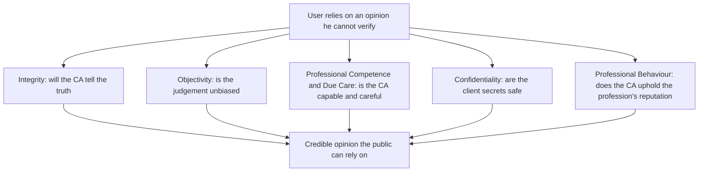
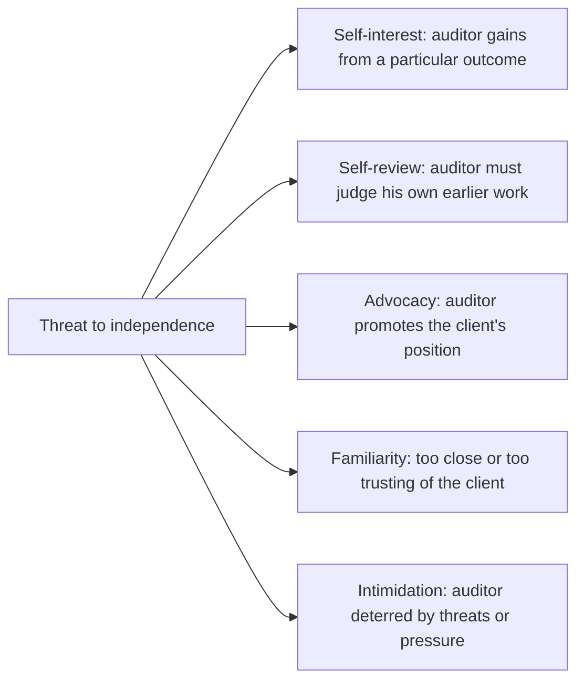
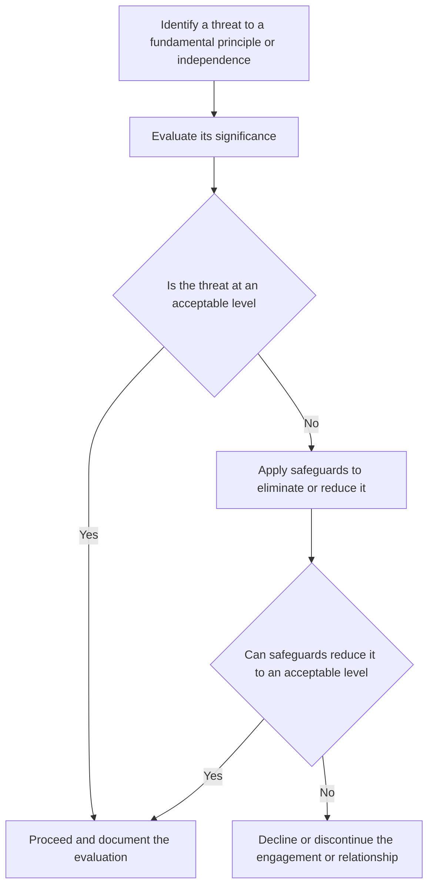
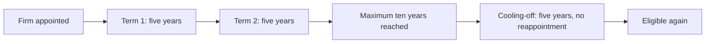
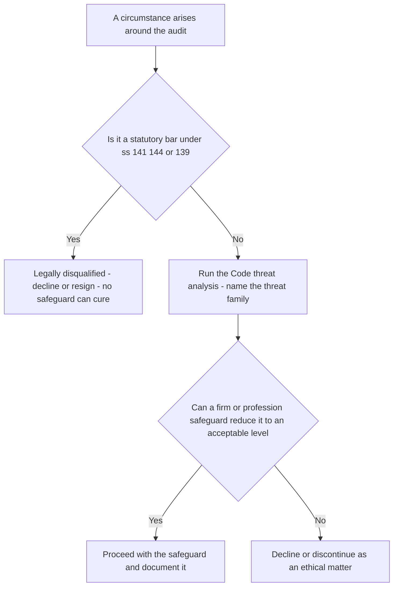

<!-- v2-deep -->

# Chapter 11 — Professional Ethics & Independence

## 1. The Problem

Strip away everything decorative about an audit and one uncomfortable fact remains: **the auditor is paid by the very people whose work he is checking.** The company's directors negotiate his fee, sit across the table at every meeting, can decline to reappoint him, and control the flow of information he depends on. Yet the people who actually *rely* on his opinion — the retail shareholder in Coimbatore, the bank about to lend ₹50 crore, the ITC officer, the prospective investor — are nowhere in the room. They never meet the auditor. They cannot verify his working papers. They simply read three or four paragraphs at the end of the annual report and, on the strength of them, part with their money.

This is the **agency problem** dressed in its sharpest clothes. Management has the information; outsiders have the risk. The audit is supposed to bridge that gap — but the bridge is only as trustworthy as the person who built it. And that person has every commercial incentive to keep his paying client happy.

So the reader who refuses to memorise should sit with the real question first: **Why would anyone believe an auditor's opinion at all?** He's not a government official. He's not disinterested. He's a professional running a firm that needs revenue. What stops him from quietly signing whatever keeps the fees flowing?

The answer cannot be "because he's honest," because you cannot verify honesty from the outside. The profession's answer is structural: an audit opinion is only worth reading if the person giving it is **independent** of the outcome and **bound by enforceable principles** that override his self-interest. Ethics, in auditing, is not a soft topic bolted onto the end of the syllabus. It is the *load-bearing wall*. Remove it and the entire assurance edifice — SA 700 opinions, materiality, sampling, the lot — collapses into an expensive formality.

There is a deeper economic reason this matters, and it explains why the *profession itself* — not just each individual member — polices ethics so ferociously. The value of an audit is a **shared reputational asset**. When one shareholder learns to trust "an audited balance sheet," that trust spills onto every other audited company. But the reverse is also true: a single Satyam, a single Enron, a single collapse where the auditor signed a clean report on cooked books, poisons trust in *every* auditor's signature. This is the **tragedy of the commons** applied to credibility. Each individual auditor has a private incentive to shade toward the client (keep the fee), but the collective depends on every auditor holding the line. Left to individual choice, the commons gets over-grazed and the whole assurance market dies. That is precisely why ethics cannot be left to conscience: it must be a *rule*, *enforced by the profession*, so that no single member can free-ride on everyone else's honesty while cashing in his own dishonesty.

That is the problem this chapter addresses: **how do you make a paid opinion believable to people who cannot check it — and keep it believable across the whole profession, forever?**

---

## 2. The Core Idea

The core idea is a single sentence you should be able to reconstruct from first principles:

> **An audit opinion has value only to the extent that its author is independent in fact and in appearance and behaves according to principles that a rational outsider can trust to hold even when the client would prefer otherwise.**

Two words in that sentence do the heavy lifting.

**Independence** answers: *is the auditor free of any interest that would bias the conclusion?* If the auditor owns shares in the client, his wealth rises when the accounts look good — his interest is no longer aligned with the truth. Independence is the machinery that keeps the auditor's self-interest from contaminating his judgement.

**Integrity and the other fundamental principles** answer: *even where no financial bias exists, will the auditor behave in a way the public can rely on?* Will he tell the truth even when it costs the engagement? Keep client secrets? Refuse work he isn't competent to do?

Crucially, independence is demanded in **two forms**, and understanding *why both* is the conceptual crux:

- **Independence of mind (independence in fact)** — the actual state of mind that permits an unbiased conclusion. This is the substance.
- **Independence in appearance** — the avoidance of facts and circumstances so significant that a *reasonable and informed third party* would conclude the auditor's objectivity was compromised.

A student's instinct is: "surely only the real thing matters — if the auditor is genuinely unbiased, who cares how it looks?" But recall the problem statement. **The user cannot see inside the auditor's mind.** He can only observe circumstances. If the audit firm's partner is the CFO's brother, the shareholder has no way to confirm the audit was actually objective — and rationally, he *won't believe it was.* The moment appearance is compromised, the opinion loses its power to reassure, regardless of the underlying truth. Assurance is a product sold on *credibility*, and credibility lives in the eye of the user. Hence appearance is not vanity; it is half the product.

Push this one layer deeper, because examiners reward students who can articulate *why appearance is a rational rule, not a paranoid one*. The audit exists to reduce **information asymmetry** — the user knows less than management. If the user then had to independently investigate whether the auditor was truly unbiased, you would have created a *second* information asymmetry (the user knows less than the auditor about the auditor's own state of mind) that is *even harder to close* than the first. Appearance-based rules solve this elegantly: instead of asking the user to verify an invisible mental state, the rules make the *observable circumstances* themselves clean. The user doesn't have to trust the auditor's mind; he only has to observe that no disqualifying relationship exists. Appearance converts an unverifiable question ("is he really objective?") into a verifiable one ("does he hold shares? is his relative a director?"). That substitution is the whole trick, and it is why the law prefers bright-line prohibitions to case-by-case honesty assessments.

Everything technical in this chapter — the five fundamental principles, the five threat categories, the safeguards, the Companies Act prohibitions — is machinery built to protect these two things.

**A distinction the exam repeatedly tests: independence vs objectivity.** Objectivity is a *state of mind* required of a CA in **every** professional service (tax, consulting, audit alike). Independence is a *set of circumstances and relationships* required specifically for **assurance** engagements to *protect* that objectivity where an external user is relying on the conclusion. A tax adviser must be objective but need not be independent of his client — no external user is relying on a "true and fair" assurance. An auditor must be *both*. If you can state that objectivity is universal-but-internal while independence is assurance-specific-but-external, you have the axis on which half the theory questions turn.

---

## 3. Why It's Built This Way

Before the rules, understand the design logic. Three structural choices explain almost every specific provision you'll meet.

**Choice 1: Principles over an infinite rulebook.** You could try to list every forbidden act — "don't own client shares, don't lend to the client, don't marry the CFO…" — but reality generates novel conflicts faster than any list can grow. So the Code of Ethics (issued by ICAI, aligned with the IESBA International Code) is built on a **conceptual framework**: five broad *fundamental principles*, plus a *threats-and-safeguards* method for handling anything the specific rules don't name. The professional is required to *think*, not just look up. This is precisely the temperament of a self-learner: the framework tells you how to reason about a situation the examiner invented that no textbook lists.

There is a subtlety here worth naming, because it looks like a contradiction until you see the design. If principles are so flexible, *why does the Companies Act then impose rigid, mechanical bans* (you cannot audit if you hold even one share)? The answer is a deliberate division of labour. **Principles govern the vast middle ground of situations too varied to enumerate; bright-line rules govern the narrow band of situations so dangerous, or so common, that leaving them to judgement would invite abuse.** A rule that says "use judgement about your shareholding" would be gamed by every marginal auditor claiming his 500 shares "didn't really affect" him. So the law removes judgement exactly where judgement is least trustworthy — where self-interest is most direct. Principles and rules are not in tension; they are matched to the reliability of judgement in each zone.

**Choice 2: Categorise threats by their psychological mechanism.** Rather than memorising 200 risky situations, the Code groups them into **five families by *why* they bias judgement** — self-interest, self-review, advocacy, familiarity, intimidation. Once you understand the *mechanism*, you can classify any new fact pattern. This is the single most exam-productive idea in the chapter. The genius of a mechanism-based taxonomy is that it is *complete by construction*: any pressure on judgement must operate through gain (self-interest), reviewing oneself (self-review), taking a side (advocacy), closeness (familiarity), or fear (intimidation). There is no sixth way to corrupt a human judgement, so a new fact pattern *must* land in one of the five — you are never left without a category.

**Choice 3: Layer three defences — the profession's rules, the firm's safeguards, and hard legal prohibitions.** Some threats are so severe that no safeguard can reduce them to acceptable levels, so the law simply bans the situation outright (e.g., a statutory auditor holding shares in the company). Others can be managed with safeguards (rotate the engagement partner, add an independent reviewer). The system is deliberately layered because threats vary in severity.

Keep this scaffolding in mind: **principles → threats → safeguards → outright prohibitions.** The rest of the chapter fills it in.

One more design fact the exam quietly relies on: after ICAI's convergence with the revised IESBA Code, the framework's operative verb is **"threats must be addressed"**, not merely "safeguards applied." The revised Code recognises that for some threats the correct response is not a safeguard at all but *eliminating the circumstance that creates the threat* (e.g., disposing of the interest, removing the individual, declining the service). Do not reflexively write "apply safeguards" — first ask whether the *circumstance itself* can be removed, because that is often cleaner and is what the current Code prefers.

---

## 4. Full Technical Content

### 4.1 The Governing Instruments (know the sources)

| Instrument | What it governs | Why it exists |
|---|---|---|
| **ICAI Code of Ethics** (based on IESBA Code) | Fundamental principles, conceptual framework, threats & safeguards, independence for assurance engagements | Makes ethical reasoning enforceable and profession-wide |
| **Chartered Accountants Act, 1949 — Schedules I & II** | "Professional misconduct"; disciplinary machinery | Gives the Code legal teeth — breach = misconduct |
| **SA 200** | Overall objectives; requires compliance with *relevant ethical requirements including independence* | Ties ethics into every audit as a precondition |
| **SQC 1 / SA 220** | Firm-level and engagement-level quality controls, including independence procedures | Makes the firm, not just the individual, responsible |
| **Companies Act, 2013 — ss. 141, 144, 139(2)** | Eligibility/disqualifications of auditors, prohibited non-audit services, rotation | Hard legal backstop for the most dangerous conflicts |

> *Note: confirm the current edition's paragraph numbering in the latest ICAI Code of Ethics, as ICAI periodically revises to track IESBA updates.*

The relationship, in one line: **SA 200 says "comply with ethical requirements"; the Code of Ethics says *what* they are; the CA Act and Companies Act make some of them legally binding with penalties.**

A structural point the exam sometimes probes: the **ICAI Code of Ethics is now organised in three parts** — Part A (the fundamental principles and the conceptual framework, applicable to *all* members), Part B (members in *practice*), and Part C (members in *service / employment*). Independence requirements sit within the practice sections dealing with assurance and audit engagements. The takeaway distinction: a **member in service** (say, a CA who is the CFO of a manufacturing company) is still bound by integrity, objectivity, competence, confidentiality and professional behaviour — the fundamental principles are *not* the exclusive property of practising auditors. What the CFO is *not* subject to is the independence requirement, because he is not giving an assurance opinion. Watch for a question where the "CA" in the facts is an employee, not an auditor — the analysis shifts from independence to the fundamental principles and to *Part C* pressures (e.g., a superior pressuring him to misstate).

### 4.2 The Five Fundamental Principles — each as an answer to a risk

The Code requires a Chartered Accountant to comply with five fundamental principles. Do not learn them as a list; learn each as **the specific betrayal it prevents.**

*Figure 11.1 — The five fundamental principles, each closing a different gap in the user's trust.*

**(a) Integrity.** To be *straightforward and honest* in all professional and business relationships; it implies fair dealing and truthfulness. *The risk it counters:* the auditor's core deliverable is a truthful statement; if he'll knowingly associate with false or misleading information, the opinion is worthless at the root. Integrity specifically forbids being associated with reports the CA knows to contain materially false, misleading, or recklessly-made statements, or that omit/obscure information. It is the principle that survives even commercial pressure — the one that says *walk away rather than sign a lie.* Note the finer distinction the Code draws: integrity is breached not only by *asserting* a falsehood but by *knowingly being associated* with one, and by *recklessness* (not caring whether it is true). A CA who signs "I didn't actually check, so I didn't *know* it was false" does not escape — reckless indifference is treated as a want of integrity. The cure once a CA discovers he is associated with misleading information is to *disassociate* — insist on correction, and if refused, withdraw.

**(b) Objectivity.** To *not allow bias, conflict of interest, or undue influence of others* to override professional judgement. *The risk it counters:* the whole point of an *independent* opinion is that it isn't management's opinion in disguise. Objectivity is the mental state; independence (below) is the set of circumstances that protects it. A CA must not perform a service if a circumstance unduly influences his judgement. Objectivity is the *broadest* principle in scope — it governs the CA even where no assurance is given (advising two competing clients, for instance, is an objectivity/conflict-of-interest issue even though no audit opinion is at stake).

**(c) Professional Competence and Due Care.** To *maintain professional knowledge and skill* at the level required to give competent service (keeping up with technical, legislative developments), and to *act diligently* per applicable standards. *The risk it counters:* an honest, unbiased auditor who simply *doesn't know* the applicable Ind AS or misses a required procedure produces a wrong opinion just as damaging as a dishonest one. Competence has two limbs — **attainment** (getting the knowledge) and **maintenance** (CPE, staying current). Due care demands diligent, careful application. A commonly-tested corollary: competence obliges a CA to make clients aware of the *limitations* of the service, and to *decline or seek help* on matters beyond his competence rather than bluff. Accepting an engagement you cannot competently perform is itself a breach — the failure occurs at *acceptance*, before a single procedure is done.

**(d) Confidentiality.** To *respect the confidentiality* of information acquired through professional relationships and *not disclose it without proper authority* (unless a legal/professional right or duty to disclose exists), nor *use it for personal advantage.* *The risk it counters:* an audit only works if management hands over sensitive data — margins, contracts, litigation. If clients feared leakage, they'd conceal information and the audit would be starved of evidence. Confidentiality is the *lubricant* that makes candid disclosure to the auditor safe. Note the two prohibited acts: **disclosing** *and* **using** (even without disclosure — e.g., trading on inside knowledge). It continues **after** the relationship ends and extends to family/social settings. A subtle limb often missed: the duty also requires the CA to take reasonable steps to ensure **staff and outside advisers** under his control respect confidentiality — it is not merely a personal duty but a supervisory one.

*Permitted/required disclosures (the exam favourite):* (i) permitted by law and authorised by the client; (ii) *required by law* — e.g., producing documents in legal proceedings, disclosing infringements to authorities; (iii) *professional duty or right* — e.g., complying with a peer/quality review, ICAI investigation, defending oneself in litigation, or complying with technical/ethical standards. When deciding whether a *permitted* (not mandatory) disclosure is appropriate, the Code says to weigh: whether all relevant facts are known and substantiated, the type of communication and the audience, and whether the CA could incur legal liability. Do not treat "there's an exception" as a licence to gossip — even a permitted disclosure must be justified and proportionate.

**(e) Professional Behaviour.** To *comply with relevant laws and regulations and avoid any conduct that discredits the profession.* *The risk it counters:* the value of a CA's signature depends on the *collective* reputation of "Chartered Accountant." One member's disgraceful conduct — or misleading advertising, or unsubstantiated claims about competitors — debases the currency for everyone. This principle governs solicitation, advertising, and general conduct so the brand stays trustworthy. Under this head sit the CA Act's restrictions on **advertising and solicitation**: a member in practice must not solicit clients or professional work by advertising, and must not make disparaging or exaggerated claims. The rationale is not prudishness — it is that a race to advertise degrades into a race to *over-promise*, and over-promising is corrosive of the honesty the whole brand rests on. (ICAI has progressively liberalised what a member may publish — website details, permitted directories — so *verify the current permitted-disclosures position*; the *principle* of no-solicitation endures even as the *boundaries* move.)

### 4.3 Independence — the special demand for assurance engagements

Independence is *not* one of the five fundamental principles — it is a **distinct, additional requirement** that applies specifically to **assurance engagements** (audits and reviews). Why single it out? Because in assurance work the *entire value proposition* is that the conclusion is unbiased; independence is objectivity's structural guarantee. The Code requires independence in the two forms established in Part 2:

- **Independence of mind** — the state permitting a conclusion without bias, conflict, or undue influence; acting with integrity, objectivity, professional scepticism.
- **Independence in appearance** — avoiding circumstances so significant that a *reasonable and informed third party* would likely conclude integrity/objectivity/scepticism had been compromised.

The test for appearance — the **"reasonable and informed third party"** test — is worth memorising verbatim, because examiners phrase problems around it: *not* "would this actually bias me?" but "would an informed outsider reasonably doubt it?" Unpack every word: *reasonable* (not a paranoid or a naive observer — a sensible one); *informed* (someone who knows the relevant facts and the safeguards in place, not an ignorant bystander who panics at nothing); *third party* (an outsider, not the auditor congratulating himself). The "informed" limb matters in defence: if a threat exists but a robust, *disclosed* safeguard neutralises it, an *informed* observer — who knows the safeguard exists — may reasonably conclude independence is intact. The test is not "could anyone imagine a doubt?" but "would a reasonable person, knowing everything including the safeguards, still doubt?"

**Period and scope of independence (frequently under-answered).** Independence must be maintained throughout **both** the *engagement period* **and** the *period covered by the financial statements*. So a prohibited interest held during the financial year under audit taints independence even if disposed of before the report is signed — you cannot audit a year during part of which you held the client's shares. Independence also extends beyond the individual signing partner to the **firm, the network firm, and members of the engagement team** — a self-interest interest held by a *team member's spouse* can disqualify, not only one held by the engagement partner. Students routinely restrict the analysis to "the auditor" personally and lose marks by ignoring the firm/network/team perimeter.

### 4.4 The Five Threats to Independence — mechanisms, not lists

Any circumstance that endangers independence is classified by its **psychological mechanism** into one of five categories. Learn the *why* of each, and you can classify anything.

*Figure 11.2 — Five threat families, grouped by the mechanism through which each corrupts judgement.*

**(1) Self-interest threat — "I gain if the numbers look a certain way."**
*Mechanism:* a financial or other interest of the auditor (or a close family member) aligns his personal benefit with a particular audit outcome, so the incentive to find and report problems is dulled.
*Examples:* holding shares in the audit client; a loan to/from the client; **fee dependence** — a single client contributing an undue proportion of the firm's total fees; a contingent fee; a close business relationship with the client; the auditor being offered employment by the client.

**(2) Self-review threat — "I'd be marking my own homework."**
*Mechanism:* the auditor is asked to evaluate, as part of the audit, results of a service *he himself* previously performed. People are psychologically incapable of neutrally auditing their own work — admitting an error means admitting *personal* fault.
*Examples:* the firm prepared the client's accounts/financial statements and now audits them; provided bookkeeping, valuation, actuarial, or the design of the internal financial-control system, then audits those very outputs; a former firm member now a director whose decisions the audit must assess.

**(3) Advocacy threat — "I've publicly taken the client's side."**
*Mechanism:* the auditor promotes or champions the client's position to the point where his objectivity as a neutral verifier is compromised — a promoter cannot also be a neutral referee.
*Examples:* representing the client in litigation or a tax dispute *against a third party or authority*; promoting/underwriting the client's shares; acting as an advocate for the client in a legal matter material to the financials.

**(4) Familiarity threat — "I'm too close to them to be sceptical."**
*Mechanism:* a long or close relationship makes the auditor overly sympathetic, overly trusting, or emotionally invested, dulling the professional scepticism the audit depends on.
*Examples:* a close family member of the audit team in a key position at the client; a long association of senior personnel with the same client (why **partner rotation** exists); a former partner now in a key management role at the client; accepting significant gifts or hospitality (unless trivial and inconsequential).

**(5) Intimidation threat — "I'm afraid of what happens if I don't comply."**
*Mechanism:* actual or perceived pressures deter the auditor from acting objectively — fear overrides judgement.
*Examples:* threat of dismissal or non-reappointment over a disagreement on accounting treatment; threat of litigation; pressure to reduce work inappropriately to cut fees; a dominant, aggressive client personality.

> A single set of facts can trigger **more than one** threat. Preparing the client's accounts *and* depending heavily on its fees is *both* self-review *and* self-interest. Examiners love this — always scan all five.

**Finer distinctions the examiner exploits.** Three pairs are routinely confused; keep the *mechanism* in front of you and they separate cleanly:

- **Advocacy vs Self-review.** Both can arise from tax work, so the mark is in *what the CA did*. If the CA *computed/filed* the tax and now audits the resulting provision, that is **self-review** (judging his own output). If the CA *argued the client's case before the tax authority or a tribunal*, taking the client's side against a third party, that is **advocacy** (championing a position). Same client, same tax — different threat, decided by the *activity*.
- **Self-interest vs Intimidation** in the fee scenario. Wanting to *keep* a lucrative client is **self-interest**; being *threatened* with the loss ("agree or we drop you") is **intimidation**. A single sentence from a CFO can trigger both at once — name both.
- **Familiarity vs Self-interest** in a job offer. If the *client offers the audit-team member a job*, note that the very *prospect* of employment is a **self-interest** threat (he may soften the audit to protect the offer) — and if he has *already been* a firm partner now sitting in management, the residual closeness is **familiarity**. The direction of the relationship and its timing decide the label.

**A structural refinement from the revised Code: distinguishing management responsibilities.** The current Code sharpens *why* many non-audit services are dangerous: an auditor must never *assume a management responsibility* for an audit client (e.g., authorising transactions, taking decisions, designing/implementing controls). If he does, he ends up auditing decisions he himself made — the purest self-review — and he also loses the independence to challenge them. This "no management responsibility" line is the conceptual root beneath the s.144 list; if a question gives a novel service not on the s.144 list, ask *"is the CA stepping into management's shoes?"* — if yes, it is impermissible even if unnamed.

### 4.5 Safeguards — reducing threats to an acceptable level

A safeguard is an action that eliminates a threat or reduces it to an **acceptable level** (the level at which a reasonable and informed third party would conclude compliance with the fundamental principles is not compromised). The Code groups safeguards into two broad sources:

**A. Safeguards created by the profession, legislation, or regulation** — educational/training/experience entry requirements; CPE requirements; professional standards; monitoring and disciplinary procedures; external review of reports by a legally empowered third party.

**B. Safeguards within the firm's own systems and environment** — firm-wide (e.g., leadership stressing independence, quality-control policies per **SQC 1**, documented independence policies, rotation of senior personnel, disciplinary mechanisms) and engagement-specific (e.g., an **engagement quality control reviewer (EQCR)** who was not on the team, rotating the engagement partner, using different partners/teams for non-assurance services, consulting a third party such as ICAI).

The evaluation logic is a loop, and it is examinable as a procedure:

*Figure 11.3 — The conceptual framework in action: no engagement proceeds while an unacceptable threat lacks an effective safeguard.*

The critical takeaway: **if no safeguard can bring the threat to an acceptable level, the only ethical response is to refuse or resign.** There is no "manage it and hope" option.

**What counts as a *genuine* safeguard — and what does not.** A recurring exam trap is to offer a fake safeguard and see if you accept it. A valid safeguard must be *independent of the threat itself*. Two things a client says or does can never be safeguards: (i) **management's own assurance** ("the directors confirmed they were honest") — the very party being audited cannot certify away the auditor's independence; and (ii) a **larger fee or the client's importance** — commercial magnitude *worsens* self-interest, it does not cure it. Note too that the revised Code deliberately narrowed the old idea of "safeguards created by the client" — the current framework is sceptical that client-side controls can genuinely safeguard the *auditor's* independence, and leans instead on *removing the circumstance* or on *firm/profession* safeguards. If your proposed safeguard is really the client promising to behave, it is not a safeguard.

**Safeguards scale with severity — a worked intuition.** Think of significance as a dial. A *trivial* threat (an audit senior owns a token number of shares in an unrelated group company, immaterial to both) may need no more than routine firm policies. A *moderate* threat (a non-key family relationship, a modest one-off non-audit service) may be cured by an EQCR and separate teams. A *severe* threat (a partner's spouse is the client's CFO; 40%+ fee dependence on one client) often **cannot** be safeguarded at all and forces removal of the person or exit from the engagement. The examiner's mark is in your matching the *strength of the response to the size of the threat* — proposing a token safeguard for a fatal threat, or resigning over a trivial one, both lose marks.

### 4.6 The Legal Backstop — Companies Act, 2013 (where safeguards aren't trusted)

For the most dangerous conflicts, Parliament did not leave it to professional judgement — it *legislated prohibitions.* These convert an ethical threat into a legal disqualification. Understand each as a *frozen* threat-and-safeguard decision: the legislature decided the threat is so severe that outright prohibition is the only adequate safeguard.

**Section 141 — Eligibility, Qualifications and Disqualifications of Auditor.** A person is **not eligible** for appointment as auditor if, among others:
- a **body corporate** (except an LLP) — accountability must rest on identifiable professionals;
- an **officer or employee** of the company — self-review/familiarity in the extreme;
- a partner/employee of an officer or employee of the company;
- a person (or his partner/relative) holding **any security or interest** in the company (relatives may hold face value up to the prescribed limit — *confirm current threshold, historically ₹1,00,000*) — a naked **self-interest** threat;
- a person indebted to the company beyond the prescribed amount, or who has given a guarantee for a third party's indebtedness beyond the prescribed limit — **self-interest/intimidation**;
- a person with a **business relationship** with the company (beyond prescribed exceptions) — self-interest;
- a person whose **relative is a director** or in key managerial personnel — **familiarity**;
- a person in **full-time employment elsewhere**, or holding audits of **more than 20 companies** (ceiling limit) — competence/due-care;
- a person convicted of fraud in the last 10 years — professional behaviour/integrity;
- a person who **directly or indirectly renders prohibited services under s. 144**.

*A frequently-tested subtlety within s.141:* the **security-or-interest** bar is *absolute for the auditor and his firm* (not even one share), but relatives are allowed a *limited* holding up to the prescribed face value — and if a relative acquires securities *above* the limit, the Act gives a corrective window (historically **60 days** to take corrective action) rather than instant disqualification. *Verify the current limit and the corrective period in the Companies (Audit and Auditors) Rules.* Also note "interest" is read widely — it is not confined to equity shares. And the **>20 company ceiling** carries its own carve-outs (e.g., one-person companies, dormant companies, small companies and certain private companies are excluded from the count under the current rules) — *verify the current exclusions*, because a numerical question ("the CA already audits 22 companies, 4 of which are small companies") turns entirely on which ones count.

**Section 144 — Auditor not to render certain services.** The auditor (and its network) must **not** provide to the audit client (or its holding/subsidiary) these services, precisely because each creates a self-review or advocacy or self-interest threat too severe to safeguard: accounting and book-keeping; internal audit; design and implementation of any **financial information system**; actuarial services; investment advisory; investment banking; rendering of outsourced financial services; management services; and any other prescribed service. *Map each to its threat:* bookkeeping/internal audit/financial-system design = **self-review**; investment banking/advisory = **advocacy/self-interest**. This is the Companies Act codifying the self-review and advocacy threats.

*The trap inside s.144:* the prohibition covers services rendered **directly or indirectly** to the company **and to its holding company and subsidiary company** — so a firm cannot dodge it by having a network firm render the service, nor by rendering it to the parent instead of the audited entity. "Indirectly" is expressly defined to catch services routed through a relative or a network. What s.144 does **not** bar is *ordinary audit-related and tax work* — the auditor may still do statutory audit, tax representation, and certification work not on the list. So the correct answer to "can the auditor also file the client's tax return?" is generally *yes* (tax is not a s.144-prohibited service), which surprises students who over-apply the ban. Distinguish sharply: **s.144 lists the banned services; everything not listed is permitted** unless a threat analysis independently defeats it.

**Section 139(2) — Rotation of auditors** (listed companies and prescribed classes). An individual auditor may serve **one term of five consecutive years**; an audit firm **two terms of five consecutive years (max 10)**, followed by a **five-year cooling-off** period during which neither the firm (nor a firm with common partners under the same network) may be reappointed. *Why:* this is the legislative response to the **familiarity threat** — no relationship, however professional, is allowed to run indefinitely.

*Figure 11.4 — Section 139(2) firm rotation: the familiarity threat, capped and cooled by statute.*

*Rotation subtleties worth a mark:* the anti-circumvention clauses mean the cooling-off catches not just the *same firm* but a *different firm with common partners* and firms *under the same network* — so a firm cannot dodge rotation by shuffling the engagement to a sister firm. There is also an **incoming-auditor bar**: on rotation, the *outgoing* firm/its associates cannot be reappointed for the cooling period, and the classes of company subject to rotation are prescribed (listed companies plus certain unlisted public and private companies above prescribed capital/borrowing thresholds). *Verify the current class thresholds and network definition.* Distinguish rotation (s.139(2), *mandatory and mechanical* for prescribed classes) from ordinary reappointment and from *partner* rotation (an ethics-Code safeguard applying more broadly than the statute).

> Sections 139–148 are covered in depth in the "Company Audit" chapter; here they appear as the *legal embodiment* of the ethics framework. Cross-refer, don't duplicate.

Here is the layered defence — profession, firm, and statute — in one picture, showing *when each layer takes over*:

*Figure 11.5 — Three layers of defence and the order to test them: statute first, then Code threats, then safeguards, then exit.*

### 4.7 Fees — a threat hiding in plain sight

Fees deserve their own note because they touch three threats at once.
- **Fee dependence / undue proportion:** if one client generates too large a share of total firm income, the fear of losing it (intimidation) and the desire to keep it (self-interest) both bite. Safeguard: monitor the proportion, use an external quality review, reduce dependence. The Code flags heightened concern where a *single client (or group)* provides a *large proportion of total fees*, and greater concern still where fees are *overdue* or the client is a *public interest entity*. *Verify whether the current ICAI Code specifies a numerical percentage trigger* — the *principle* (undue proportion is a threat) is settled even where a *hard figure* is not one you should quote from memory.
- **Contingent fees** (fees dependent on the outcome or on a result — e.g., "a percentage of the tax you save") are **prohibited for assurance engagements** — they align the fee directly with a particular outcome, a self-interest threat by construction. Beware the definitional edge: a fee is *not* "contingent" merely because it was fixed by a court or public authority, and *percentage-based professional fees* were traditionally restricted under the CA Act's misconduct schedules for members in practice — *verify the current permitted bases of fees*, as ICAI has relaxed some historically-barred percentage arrangements for certain non-assurance work.
- **Overdue fees** from the prior year functioning like a loan to the client — a self-interest threat; assess before accepting reappointment. The mechanism: if the client owes you last year's fee and you must sign this year's report, you are effectively an *unsecured creditor* dependent on the client's goodwill to get paid — precisely the alignment independence forbids. The cure is to collect the overdue amount *before* issuing the current report, or to treat the balance as a threat requiring safeguards.
- **Lowballing / low fees:** quoting a fee so low it cannot fund a competent audit is a **professional competence and due care** threat (not primarily self-interest) — the risk is that corners get cut to make the engagement economic. A low fee is not *itself* misconduct, but the CA must still perform the work to standard; inability to do so at the quoted fee means the quote was improper.

### 4.8 The disciplinary consequence

Breach of the Code is not merely frowned upon — under the **Chartered Accountants Act, 1949**, conduct falling within the **First and Second Schedules** constitutes **"professional misconduct,"** triable by the ICAI's disciplinary mechanism (Board of Discipline / Disciplinary Committee), with penalties up to **removal of name from the Register** and monetary fines. This legal enforceability is *what makes the ethics believable* — it is the ultimate safeguard standing behind every principle.

*Know the split between the two schedules, because it is directly testable.* Broadly, the **First Schedule** covers the *less grave* misconduct (heard by the **Board of Discipline**, with lighter maximum penalties — reprimand, removal up to a limited period, and a capped fine), while the **Second Schedule** covers the *graver* misconduct — including gross negligence, failure to obtain sufficient information before expressing an opinion, and disclosure of confidential information — heard by the **Disciplinary Committee** with the *heaviest* penalties, including **removal from the Register permanently or for a longer period** and a higher fine. *Verify the current penalty amounts and the exact clause allocations*, but retain the architecture: **First Schedule = less serious / Board of Discipline; Second Schedule = more serious / Disciplinary Committee.** Two classic Second-Schedule items connect straight back to this chapter — *"grossly negligent in the conduct of professional duties"* is the disciplinary face of a *competence/due-care* failure, and *"discloses information acquired in the course of professional engagement without consent"* is the disciplinary face of a *confidentiality* breach. Naming the schedule *and* the underlying principle in an answer signals mastery.

---

## 5. Applied Scenarios

**Scenario 1 — The convenient bookkeeping.**
*Facts:* CA Meera's firm has audited Zephyr Pvt Ltd for years. To help the small client, her firm also maintains Zephyr's books and prepares its draft financial statements, then audits them. The director says, "You know the numbers best — just sign off."
*Analysis:* Two threats. Preparing and then auditing the same financial statements is a textbook **self-review threat** — Meera cannot neutrally evaluate work her own firm produced. Under **s. 144**, providing **accounting and book-keeping services** to an audit client is *prohibited outright* if Zephyr falls within the Act's audit framework — there is *no* safeguard that rescues it. *Conclusion:* the firm must cease providing the bookkeeping service or resign as auditor; it cannot do both. If Zephyr were a client to which s.144 did not apply, the self-review threat would still require robust safeguards (separate personnel, independent review) and may still be untenable.

**Scenario 2 — The valuable client.**
*Facts:* A single listed client, Orion Ltd, contributes 42% of CA Rahul's firm's total fee income. During the audit Rahul finds an aggressive revenue-recognition treatment he believes is wrong. The CFO says, "Push back on this and we'll reconsider the appointment next year."
*Analysis:* Three threats stacking. The 42% dependence is a **self-interest threat** (Rahul's firm needs the money) *and* a **familiarity/self-interest** dependence problem; the CFO's explicit warning is an **intimidation threat.** *Safeguards:* because the threats are severe, professional-level safeguards are needed — an **engagement quality control review** by an independent partner, consultation with ICAI, and reducing dependence on the single client over time. Critically, on the accounting disagreement itself, integrity and objectivity *override* the fee: if the treatment is materially wrong and uncorrected, Rahul must **modify the opinion** (SA 705) regardless of the threat to reappointment. If no safeguard can protect his objectivity, resignation is the ethical floor.

**Scenario 3 — The family connection.**
*Facts:* CA Anjali is offered the statutory audit of Bluewave Ltd. Her brother is the company's Finance Director (a KMP). She reasons, "I'm completely professional; my judgement won't be affected."
*Analysis:* This is where the *appearance* test bites. Even accepting Anjali's genuine objectivity (independence of mind), a **reasonable and informed third party** would doubt an audit where the auditor's brother runs the finances — **independence in appearance** is destroyed. Moreover, under **s. 141**, a person whose **relative is a director or KMP** of the company is *disqualified* from appointment — the legislature froze this familiarity threat into a legal bar. *Conclusion:* Anjali is **ineligible**; she must decline. Her personal confidence is irrelevant, because the user cannot see inside her mind — which is the whole reason appearance matters.

**Scenario 4 — The confidential tip.**
*Facts:* During Falcon Ltd's audit, CA Vikram learns of an unannounced merger that will lift Falcon's share price. His cousin asks him for "any good stock tips."
*Analysis:* **Confidentiality** prohibits both *disclosing* the information *and* *using it for personal (or another's) advantage* — even a hint to the cousin, and certainly any trading, breaches the principle (and securities law). No safeguard makes this acceptable; the duty persists even after the engagement ends. *Conclusion:* Vikram must say nothing and use nothing. Silence is the only compliant response.

**Scenario 5 — The shareholding that "doesn't count" (numerical, self-verifying).**
*Facts:* CA Suresh is offered the statutory audit of Kestrel Ltd. He holds **no** shares. However, (a) his **wife** holds **900 equity shares of face value ₹100 each** (total face value ₹90,000) in Kestrel, and (b) his **audit partner's brother** holds shares worth face value ₹1,50,000. Assume the prescribed relative face-value limit is **₹1,00,000** (*verify current limit*).
*Step-by-step:*
1. *The auditor's own holding:* nil — the absolute bar on the auditor holding *any* security is not triggered. Good so far.
2. *The wife (a "relative"):* face value held = 900 × ₹100 = **₹90,000**. This is *below* the ₹1,00,000 relative limit, so it does **not** disqualify — but it must be monitored, and if she buys more and crosses ₹1,00,000 the corrective window (historically 60 days) applies.
3. *The partner's brother:* here the analysis turns on whether "brother of a partner" is a **relative of the partner** whose holding is aggregated, and whether the ₹1,50,000 exceeds the limit. Face value ₹1,50,000 is **above** ₹1,00,000. If the brother qualifies as a relative under the Act's relative definition and the holding is attributed to the partner, the firm is **disqualified** unless corrected.
*Reconciliation / self-check:* the decisive line is that s.141 disqualifies "a person **or his partner or relative**" holding security beyond the permitted limit. The wife's ₹90,000 is inside the limit → not fatal. The partner-side holding of ₹1,50,000 is outside the limit → fatal unless corrected within the allowed window. *Conclusion:* the firm cannot accept (or must procure disposal to bring the relative's holding within limit within the corrective period) **because of the partner-side holding, not the wife's.** *The exam trap this scenario defeats:* candidates fixate on the auditor's own zero holding and declare "eligible," missing that the disqualification reaches **partners and relatives**. *Verify the exact relative face-value limit and corrective period before relying on the figures.*

**Scenario 6 — The ceiling count (numerical, self-verifying).**
*Facts:* CA Priya is a sole practitioner. She currently holds appointment as auditor of **19 companies**, of which **3 are small companies** and **1 is a dormant company** (assume these classes are *excluded* from the ceiling count under the current rules — *verify*). She is now offered **4 more** audits, all ordinary (non-excluded) public companies.
*Step-by-step:*
1. Start from the statutory ceiling: an individual may not hold audit of **more than 20 companies** (s.141 read with s.139/141 ceiling; *verify current treatment and exclusions*).
2. Compute her *counting* number now: 19 held − 3 small − 1 dormant = **15 counting audits**.
3. Add the 4 new (all counting): 15 + 4 = **19 counting audits**.
4. Compare to ceiling of 20: 19 ≤ 20 → **within limit**; she may accept all four.
*Reconciliation / self-check:* had the excluded companies been ignored, a naive count would be 19 + 4 = 23 and she'd wrongly refuse. The reconciliation is that *only counting audits* press against the ceiling; excluded classes fall out first. *Variation the examiner may add:* make one of the 4 new companies itself a small company — then counting number = 15 + 3 = 18, even more room. Or state she is a *partner in a firm* — then the ceiling is generally computed **per partner** across the firm, which changes the arithmetic entirely. *Conclusion:* she may accept the four; the load-bearing step is *excluding the exempt classes before counting.* *Verify current exclusions and whether the limit is 20 per individual/partner in the latest Rules.*

**Scenario 7 — The tax work that changes colour (self-review vs advocacy).**
*Facts:* CA Nikhil audits Comet Ltd. Separately, his firm (i) *prepared and filed* Comet's income-tax return, computing a large contentious deduction, and next year (ii) *appeared before the Tribunal to argue* that the deduction is valid, when the department challenged it. Both the provision for tax and the contingent-liability disclosure sit in the financials Nikhil must audit.
*Analysis:*
- Activity (i) — *computing and filing* the return whose provision he now audits — is a **self-review threat**: he would be auditing figures his own firm produced.
- Activity (ii) — *arguing Comet's side before the Tribunal against the department* — is an **advocacy threat**: he has publicly championed the client's position, so a reasonable third party doubts he can neutrally assess whether the disclosure/provision is fairly stated.
*Reconciliation:* same client, same tax issue, **two different threats decided by the activity** — a distinction Scenario 5/6's numbers don't test but theory questions love. *Response:* tax representation is **not** a s.144-prohibited service, so this is not an automatic legal bar; but the *combined* self-review + advocacy on a *material* item may be un-safeguardable. Safeguards to consider: use *separate teams/partners* for the tax advocacy and the audit, an EQCR, and — if the item is material and the advocacy is aggressive — decline the advocacy role or the audit. *Conclusion:* not illegal per se, but likely untenable together where the item is material; separate the roles or step back. *The tweak to watch:* if instead the firm had only *filed a routine return with no contentious position and did not represent Comet*, the threat is a mild self-review often curable by review — showing how the *facts*, not the label "tax work," drive the answer.

---

## 6. Procedure & Documentation Summary

The examinable *process* for handling any ethics/independence question — reproduce this as your answer skeleton:

1. **Identify** — scan the facts against the five fundamental principles and the five threat categories. Name the threat(s) precisely; note if several apply.
2. **Evaluate significance** — quantitative (e.g., % of fees, size of shareholding) and qualitative (seniority of the person, materiality to the FS). Apply the **reasonable and informed third party** test for appearance.
3. **Check for an outright legal bar first** — is this disqualified under **s. 141**, or a prohibited service under **s. 144**, or a rotation breach under **s. 139(2)**? If so, safeguards are irrelevant — decline/resign.
4. **Apply safeguards** — profession-created and firm/engagement-level (EQCR, partner rotation, separate teams, independent review, ICAI consultation).
5. **Re-assess** — is the residual threat now at an acceptable level? If not, **decline or discontinue.**
6. **Document** — record the threat identified, its evaluation, the safeguards applied, and the conclusion (SQC 1 / SA 220 require this; independence conclusions must be documented). Obtain **written independence confirmations** from engagement team members.

*Exam tip on ordering:* in a written answer, put **step 3 (legal bar) before the safeguards discussion** whenever the facts smell of s.141/144/139. Wasting a paragraph designing safeguards for a situation that is a flat statutory disqualification signals you missed the bar — and the examiner docks for it. Lead with "Is this even permissible?" then, only if yes, "how do we safeguard it?"

| Requirement | Standard/Source | The "why" |
|---|---|---|
| Comply with relevant ethical requirements incl. independence | SA 200 | Precondition of any credible audit |
| Firm-level independence policies & monitoring | SQC 1 | Makes the firm accountable, not just the individual |
| Engagement partner to form conclusion on independence | SA 220 | Front-line responsibility on each audit |
| Document threats, safeguards, conclusions | SQC 1 / SA 220 | Evidence the framework was actually applied |
| Written independence confirmation from team | SA 220 / firm policy | Converts a principle into an auditable act |

---

## 7. Connections

- **To SA 200 (Chapter on basic concepts):** SA 200 lists ethics + independence as *preconditions* of an audit conducted per SAs. This chapter is the content of that precondition.
- **To SA 705/706 (opinions):** Scenario 2 shows the link — ethical courage is what makes an auditor *actually* modify an opinion when the client resists. Ethics without the willingness to qualify is decoration.
- **To Company Audit (ss. 139–148):** ss. 141, 144, 139(2) are the *legal skeleton* of the ethics framework; study them there in procedural detail, here for their *rationale*.
- **To Quality Control (SQC 1 / SA 220):** safeguards live inside the firm's quality-control system; ethics is operationalised through QC. (Note: at the global level SQC 1 is being superseded by the SQM standards on *quality management*; ICAI adoption timing should be *verified* — the *concept* that the firm owns independence controls is unchanged.)
- **To Professional Scepticism (SA 200/SA 240):** the *familiarity* threat is precisely the erosion of scepticism; independence protects the sceptical mindset fraud detection needs.
- **To SA 210 (Agreeing terms) & SA 220 (acceptance/continuance):** the ethics screen runs *at acceptance* — an engagement that fails the independence test should never be accepted, tying this chapter to the acceptance decision.
- **To the CA Act, 1949 (Schedules I & II):** the disciplinary enforcement that gives the whole Code its bite; gross negligence and confidentiality breaches surface here as Second-Schedule misconduct.

---

## 8. Traps & Examiner Tricks

- **"He's honest, so it's fine."** No — *appearance* is an independent requirement. If a reasonable third party would doubt it, independence fails *regardless* of actual integrity. Scenario 3 is built on this.
- **Confusing objectivity with independence.** Objectivity is a fundamental *principle* (state of mind, applies to all services); **independence** is a *separate additional* requirement specifically for **assurance** engagements. Don't call independence a "fundamental principle."
- **Only spotting one threat.** Fee-dependence + client pressure = self-interest **and** intimidation. Bookkeeping-then-audit = self-review, often + self-interest. Always scan all five.
- **Assuming safeguards can fix anything.** Some situations (s.141 disqualifications, s.144 prohibited services, contingent fees for assurance) admit **no** safeguard — the answer is *decline/resign*, not "apply safeguards."
- **Designing safeguards before checking the legal bar.** Reverse of the trap above: if it's a flat s.141/144/139 disqualification, jumping to "apply an EQCR" wastes the paragraph and reveals you missed the bar. Test permissibility first.
- **Confidentiality = only 'don't disclose'.** It *also* forbids **using** the information (insider trading), continues **after** the engagement, and has recognised **exceptions** (required by law, professional duty/right). Examiners test the exceptions.
- **Treating an exception to confidentiality as a free pass.** A *permitted* disclosure still requires judgement — verify the facts, weigh the audience and legal exposure; don't disclose more than the exception warrants.
- **Forgetting the enforcement.** Breach isn't abstract — it's **professional misconduct** under the CA Act Schedules, punishable up to removal from the Register. State the *schedule* (First = less grave/Board of Discipline; Second = grave/Disciplinary Committee) for extra marks.
- **Mislabelling advocacy vs self-review.** Representing the client *against a third party/tax authority* = **advocacy**. Auditing your *own prior work* (e.g., a return you filed) = **self-review.** Same tax, different threat — decided by the activity (Scenario 7).
- **The "safeguard" that isn't.** Management's own assurances, a bigger fee, or the client's importance are **not** safeguards — the first is the audited party certifying itself, the latter two *worsen* self-interest.
- **Relative shareholding is not zero.** The *auditor and firm* may hold **no** security, but *relatives* may hold up to a prescribed face-value limit, with a corrective window if exceeded. *Confirm the current figure.* A *relative as director/KMP*, by contrast, is a flat disqualification.
- **Miscounting the audit ceiling.** Exclude the exempt classes (small/OPC/dormant/certain private companies — *verify*) **before** counting against the 20-company limit, and remember the count is generally *per partner* for a firm (Scenario 6).
- **Ignoring the independence period.** Independence must hold across the *whole financial year audited*, not just at signing — a share sold the day before the report is signed doesn't cleanse a year of holding it.
- **Restricting the perimeter to the signing partner.** Interests of the *firm, network firm, and team members' immediate family* also count — don't analyse only the individual auditor.
- **Assuming all tax work is banned.** s.144 does **not** bar tax representation or certification; over-applying the ban is as wrong as ignoring it.

---

## 9. First-Principles Recap

Rebuild the whole chapter from the opening problem:

1. An audit opinion is a **paid** opinion, relied on by **outsiders who cannot verify it.** Why believe it?
2. Because two things are guaranteed: the author is **independent of the outcome**, and he is bound by **enforceable principles** stronger than his self-interest.
3. Independence must hold **in fact** (real objectivity) *and* **in appearance** (because users judge only what they can see — a "reasonable and informed third party") — and appearance works by converting an unverifiable question about his mind into a verifiable one about his circumstances.
4. Objectivity is protected by naming the **five ways judgement gets corrupted** — self-interest, self-review, advocacy, familiarity, intimidation — a taxonomy *complete by construction*, so any new situation classifies by *mechanism.*
5. Each threat is met with **safeguards** matched to its severity; if safeguards can't reduce it to an acceptable level, you **remove the circumstance, decline, or resign.** No middle path.
6. The most dangerous threats aren't left to judgement — the **Companies Act (ss. 141, 144, 139(2))** bans them outright; test these *before* designing safeguards.
7. The five **fundamental principles** — integrity, objectivity, competence & due care, confidentiality, professional behaviour — each close a distinct gap in user trust, and bind *every* CA (practice or service), while independence binds only assurance engagements.
8. The whole system is credible only because breach = **professional misconduct** under the CA Act (First/Second Schedules), enforceable up to removal from the Register — the ultimate safeguard behind every principle.

If you can narrate those eight steps, you can derive every specific rule rather than recall it.

---

## 10. Quick-Revision Sheet

**Why ethics is foundational:** an opinion is worthless unless its author is independent (in fact + appearance) and principled; assurance is a *credibility* product sold to users who cannot verify. Credibility is a *shared* asset — one bad audit poisons trust in all — which is why the profession, not just conscience, enforces it.

**Five Fundamental Principles (I-O-C-C-P):**
| Principle | One-line duty | Risk it counters |
|---|---|---|
| **Integrity** | Straightforward & honest (incl. no reckless association) | Association with false/misleading info |
| **Objectivity** | No bias / conflict / undue influence | Opinion becomes management's in disguise |
| **Professional Competence & Due Care** | Attain + maintain skill; act diligently | Wrong opinion from ignorance/carelessness |
| **Confidentiality** | Don't disclose *or* use client info; survives engagement | Clients would conceal data |
| **Professional Behaviour** | Comply with law; no discredit; no improper solicitation | Debases the "CA" brand |

**Independence (assurance only):** *of mind* (real) + *in appearance* (reasonable & informed third party test — reasonable, informed, outsider). Not a fundamental principle — a separate requirement. Holds across the *whole FS period* and covers *firm/network/team*, not just the signing partner.

**Objectivity vs Independence:** objectivity = internal state, *all* services; independence = external relationships, *assurance* only.

**Five Threats (mechanism):**
| Threat | Mechanism | Classic example |
|---|---|---|
| **Self-interest** | Auditor gains from an outcome | Shares/loan in client; fee dependence; contingent fee |
| **Self-review** | Judging own prior work | Firm keeps books / files return, then audits it |
| **Advocacy** | Promoting client's position | Representing client vs tax authority/tribunal |
| **Familiarity** | Too close/trusting | Relative as KMP; long tenure; gifts |
| **Intimidation** | Deterred by pressure | Threat of non-reappointment |

*Decide advocacy vs self-review by the activity: argued the case = advocacy; produced the figure = self-review.*

**Safeguards:** (A) profession/legislation/regulation — CPE, standards, discipline, external review; (B) firm/engagement — SQC 1 policies, EQCR, partner rotation, separate teams, ICAI consultation. **Not safeguards:** management's assurances, a bigger fee, client's importance. **If none suffices → remove circumstance / decline / resign.**

**Legal backstop (test these FIRST):**
- **s. 141** — disqualifications (body corporate except LLP; officer/employee; security/interest holder — auditor/firm *zero*, relative up to prescribed limit with corrective window; relative-director/KMP; indebtedness/guarantee; business relationship; >20-company ceiling with exclusions; fraud conviction 10 yrs; renders s.144 service).
- **s. 144** — prohibited services (accounting/bookkeeping, internal audit, financial-system design, actuarial, investment advisory/banking, management services…) — direct **or indirect**, incl. to holding/subsidiary. Tax & certification *not* barred.
- **s. 139(2)** — rotation: individual 1×5 yrs; firm 2×5 (max 10) + 5-yr cooling-off; anti-circumvention catches common-partner/network firms.

**Fees:** contingent fees banned for assurance; monitor fee dependence (undue proportion); collect overdue fees before signing (loan-like); lowballing = competence/due-care risk.

**Enforcement:** breach = **professional misconduct** under CA Act, 1949 — **First Schedule** (less grave → Board of Discipline) / **Second Schedule** (grave, incl. gross negligence & confidentiality breach → Disciplinary Committee) → up to removal from Register + fine.

**Answer skeleton:** Identify threat(s) → evaluate significance (+ third-party test) → **check legal bar first (ss.141/144/139)** → apply safeguards → re-assess → remove/decline if unacceptable → document + written independence confirmations.

> *Verify all monetary thresholds, prescribed limits, percentage triggers, ceiling exclusions, penalty amounts, and current Code paragraph numbers against the latest ICAI Code of Ethics, the Chartered Accountants Act Schedules, and the Companies (Audit and Auditors) Rules before the exam / for the current AY.*
