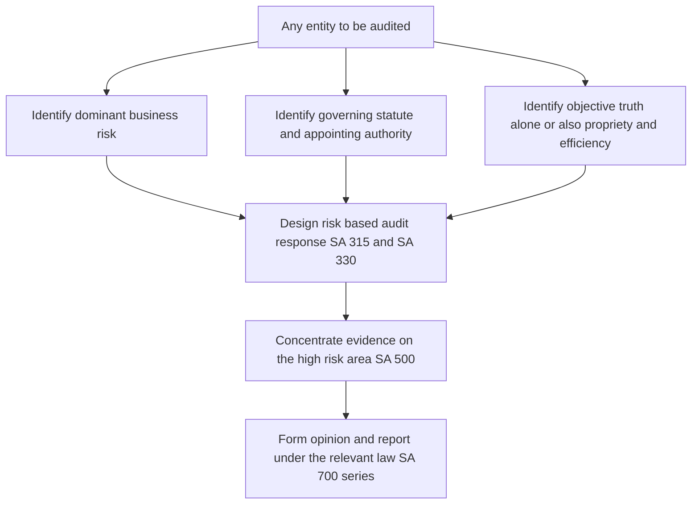
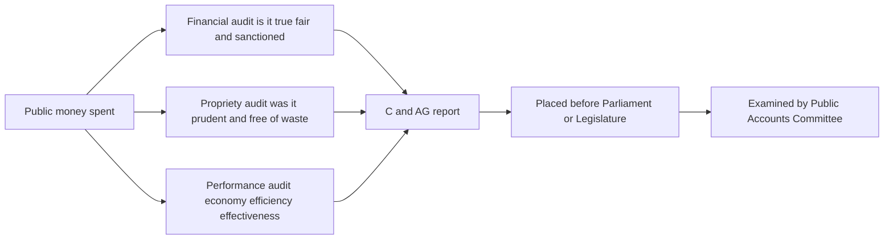

# Chapter 12 — Audit of Different Entities (Overview)

## 1. The Problem

Imagine you are handed a single, universal checklist and told: "Use this to audit anything." On Monday you walk into a nationalised bank whose entire balance sheet is *other people's money* lent out to strangers you cannot see. On Tuesday you audit a life-insurance company whose largest liability — the money it owes policyholders decades from now — does not even appear on any invoice; it must be *estimated by a mathematician*. On Wednesday you audit a rural cooperative credit society governed not by the Companies Act at all but by a State law, whose auditor is sometimes appointed by a government Registrar. On Thursday, a charitable NGO that pays no tax *only if* it spends its money the way it promised. On Friday, a two-person partnership firm with no statutory audit requirement whatsoever, that just wants the accounts checked so the partners stop suspecting each other.

Your universal checklist is now useless. Not because auditing principles changed — they did not. **The risks changed. The laws changed. The very purpose of the audit changed.** A bank's central risk is that its loans are worth less than the books claim (credit risk hiding behind "assets"). An insurer's central risk is that its promised future payouts are under-provided (a valuation and actuarial risk). A government body's central concern is not just whether numbers are *true* but whether public money was spent *wisely and with authority* (propriety). A partnership firm may have no legal obligation to be audited at all — so the audit's scope is defined by a private contract, not a statute.

The problem this chapter solves: **one auditing framework, radically different entities.** If you memorise "the audit of a bank" as a list of steps, you will drown — the syllabus spans banks, insurers, NBFCs, government, cooperatives, NGOs, LLPs, sole proprietors and partnership firms. But if you understand *why* each entity's risk profile forces a specific adaptation, you can reconstruct the special considerations for any of them from first principles. That is the promise of this chapter.

## 2. The Core Idea

The auditor's job never changes: obtain reasonable assurance that the financial statements are free from material misstatement, and report. What changes across entities is the *shape of the risk* — where misstatement is most likely to hide, how large it could be, and what "true and fair" even means for that entity.

> **The Adaptation Principle:** The audit approach is a function of three variables — (1) the entity's dominant business risk (what could go catastrophically wrong with *this* kind of organisation), (2) the governing legal framework (which statute defines the auditor's appointment, powers and reporting duties), and (3) the objective of the audit (truth-and-fairness alone, or also legality, propriety and efficiency).

Everything in this chapter is a working-out of that single equation. When you meet a bank, ask: *what is the dominant risk?* Answer: credit risk — loans that will not be repaid, dressed up as good assets. So the audit *concentrates its firepower on advances and their classification/provisioning.* When you meet an insurer, ask the same question: the dominant risk is under-reserving for future claims, so the audit concentrates on *the actuarial valuation of liabilities.* Same principle, different pressure point.

The legal framework is the second lever. A company auditor draws powers from the Companies Act 2013 (Sections 139–148, covered fully in Chapter 8). But a bank auditor *also* answers to the Banking Regulation Act 1949 and the RBI; an insurance auditor to the Insurance Act 1938 and the IRDAI; a government auditor to the Comptroller and Auditor General (C&AG) under Article 149 of the Constitution and the C&AG's (DPC) Act 1971; a cooperative auditor to a *State* Cooperative Societies Act. The statute decides *who appoints you, what you can demand, and what you must report.*

The third lever is the objective. For most private entities the objective is financial truth and fairness. For government and public-money entities the objective widens to include **propriety** (was the expenditure prudent, was there authority) and **efficiency/effectiveness** (did the money achieve its purpose). This is why government audit is not merely "financial audit" but includes *performance* and *propriety* audit.

Hold those three levers — risk, law, objective — and the rest is detail you can derive.

## 3. Why It's Built This Way

Why doesn't the law just impose one uniform audit regime? Because auditing is a response to an **agency problem**, and different entities have *different principals and different agents.*

In a company, shareholders (principals) cannot watch the directors (agents) who run the business with the shareholders' money; the statutory audit is the mechanism that restores trust. But a **bank** has a second, more dangerous principal: the *depositor*. A bank runs on leverage — a small sliver of owners' capital supporting a vast tower of public deposits. If the bank's loans quietly go bad and nobody forces recognition, depositors' savings evaporate and the failure can cascade through the whole payment system. Society cannot tolerate that, so a *regulator* (RBI) is inserted as a super-principal, and the audit is bent to serve prudential regulation — hence mandatory income-recognition and asset-classification (IRAC) norms, and an auditor duty to verify them.

An **insurer** collects premiums today for promises maturing far in the future; the principal (the policyholder) is exposed for decades. The single greatest way to defraud or mismanage an insurer is to under-state the liability for those future promises. So the regulatory architecture (Insurance Act, IRDAI) forces an independent *actuarial* valuation, and the audit is built around trusting-but-verifying that actuary.

**Government** spends *taxpayers'* money; the principal is the entire citizenry and, constitutionally, Parliament/State Legislature. Truth and fairness of accounts is necessary but not sufficient — the citizen also demands that money was spent *lawfully, without waste, and for the intended public purpose.* That is why the Constitution itself (Articles 148–151) creates an independent C&AG, insulated from the executive, and why government audit uniquely includes propriety and performance dimensions.

**Cooperatives** embody a self-help principle — members pooling resources — and are creatures of *State* law, reflecting the constitutional division of powers. **NGOs/charities** enjoy tax exemption as a *bargain with society*: spend on your stated charitable object and you pay no tax; so their audit focuses on whether receipts were properly applied to that object. **LLPs, partnerships and sole proprietors** are, at the small end, private arrangements where the state has little stake — so statutory audit is thin or absent, and the audit that occurs is largely *contractual*, serving the partners or the taxman rather than a public constituency.

In short: the audit regime is built to match *whose money is at risk and who needs protecting.* The greater the public interest and the more diffuse the principals, the heavier the regulatory overlay on top of ordinary auditing.

## 4. Full Technical Content

We now go entity by entity. For each: the dominant risk, the governing law and appointment mechanism, the key focus areas, and the special considerations an examiner expects you to know. Throughout, the *Standards on Auditing (SAs)* still apply — SA 315 (risk assessment), SA 330 (responses), SA 500 (evidence), SA 620 (using an expert), SA 700/705/706 (reporting) run underneath everything. What changes is *where the risk concentrates.*

### 4.1 The unifying diagram

*Figure 12.1 — The three levers (risk, law, objective) converge into a single risk-based audit design for every entity.*

### 4.2 Audit of Banks

**Dominant risk.** Credit risk — that advances (loans) are overstated because bad loans are not recognised as bad. Also treasury/market risk on investments, and heavy reliance on IT systems (Core Banking Solution), making it a computerised-environment audit.

**Governing law and appointment.** The Banking Regulation Act 1949 governs banking companies; the RBI is the regulator. Auditors of a banking company are appointed by the entity but the appointment requires **RBI approval** (BR Act, and for public-sector banks the framework flows through the C&AG/RBI). This is heavier than an ordinary company appointment under Section 139 — reflecting the public-deposit interest. *(Confirm the exact current appointment mechanics for each bank type in ICAI material, as PSB/private-bank routes differ.)*

**Key focus areas.**
- **Advances — the heart of a bank audit.** Verify that advances are correctly classified per the RBI's **Income Recognition and Asset Classification (IRAC) norms** into Standard, Sub-Standard, Doubtful and Loss assets, and that **provisioning** is adequate. Interest on Non-Performing Assets (NPAs) must **not** be recognised as income on accrual — income recognition on NPAs is on realisation only. This is the single most examinable area.
- **Long Form Audit Report (LFAR).** In addition to the statutory audit report, bank auditors submit a detailed **LFAR** in an RBI-prescribed questionnaire format covering assets, advances, systems and controls.
- **Investments** — valuation and classification (Held to Maturity, Available for Sale, Held for Trading) per RBI norms.
- **Provisioning and CRAR** — capital adequacy (Capital to Risk-weighted Assets Ratio) disclosures.
- **Reliance on internal controls and CBS** — with concurrent audit, internal audit and control testing given the transaction volume.
- **Branch audit and consolidation** — banks are audited branch-wise; statutory central auditors consolidate and rely on branch auditors (SA 600, using the work of another auditor).

**Special considerations.** The auditor's report on a banking company additionally states matters required by the BR Act. Balances with other banks, inter-branch reconciliation, and cash verification are classic control-risk areas.

### 4.3 Audit of Insurance Companies

**Dominant risk.** Under-provisioning of policy liabilities (the "reserve" for future claims), premium recognition timing, and claims validity.

**Governing law and appointment.** The Insurance Act 1938 and the **IRDAI** (Insurance Regulatory and Development Authority of India) regulations govern. IRDAI prescribes the financial-statement formats (Revenue Account/Policyholders' Account, Profit & Loss/Shareholders' Account, Balance Sheet). Appointment of auditors follows IRDAI norms (often joint auditors for insurers).

**Key focus areas.**
- **Actuarial valuation of liabilities.** For life insurers especially, the reserve for future policy liabilities is certified by an **Appointed Actuary**. The auditor uses this actuarial certificate as expert evidence under **SA 620 (Using the Work of an Auditor's Expert)** — evaluating the actuary's competence, objectivity and the reasonableness of assumptions, not re-doing the maths.
- **Premium income recognition** — recognised when due; unearned premium reserve for the unexpired risk period in general insurance.
- **Claims** — verifying claims incurred, claims outstanding (including IBNR — Incurred But Not Reported), and adequacy of claim provisions.
- **Reinsurance** — that ceded/accepted reinsurance and recoveries are properly accounted.
- **Investments** — subject to IRDAI investment regulations (pattern of investment, exposure norms).
- **Solvency margin** — the insurer must maintain a required solvency margin; the auditor checks the computation.

**Special considerations.** Segregation of the *policyholders'* fund and *shareholders'* fund; commission and management-expense limits; compliance with IRDAI-prescribed formats.

### 4.4 Audit of Non-Banking Financial Companies (NBFCs)

**Dominant risk.** Similar to banks — credit risk on financing/lending — but under a *different* regulatory regime, plus classification risk (is this entity even correctly registered as an NBFC?).

**Governing law and appointment.** Regulated by the **RBI** under the RBI Act 1934 and RBI's NBFC Directions. NBFCs registered as companies are also under the Companies Act (so Section 139 appointment applies), *plus* RBI-specific duties.

**Key focus areas.**
- **Registration and classification** — verify the NBFC holds a valid Certificate of Registration and is correctly categorised (e.g., Investment and Credit Company, Infrastructure Finance Company, Micro-Finance Institution). The **principal-business criteria** ("50-50 test": financial assets ≥ 50% of total assets and financial income ≥ 50% of gross income) determine NBFC status.
- **Income recognition and asset classification / provisioning** — NBFCs follow RBI prudential norms broadly parallel to banks (NPA recognition and provisioning), though thresholds differ; the auditor checks compliance.
- **Public deposits** — whether the NBFC is permitted to and does accept deposits within ceilings; compliance with liquid-asset and credit-rating requirements.
- **NBFC Auditor's Report** — the RBI (through its Directions) requires the auditor to submit an **additional report to the Board/RBI** ("NBFC Auditor's Report Directions") certifying matters such as registration, principal business, capital adequacy and net-owned-fund position, and to report exceptions directly to the RBI.

**Special considerations.** The auditor has a duty, on exception, to report certain non-compliances directly to the RBI — an unusual *third-party reporting* duty flowing from the public-interest overlay.

### 4.5 Government Audit (C&AG)

**Dominant risk / objective.** Here the objective *itself* is broader: not only whether accounts are true and fair, but whether public money was spent with **authority (regularity), prudence (propriety), and results (efficiency/effectiveness).**

**Governing law and appointment.** The **Comptroller and Auditor General of India** is a constitutional authority under **Articles 148–151**; the office's duties and powers flow from the **C&AG's (Duties, Powers and Conditions of Service) Act 1971**. The C&AG audits the accounts of the Union and States, and audits government companies (under Section 143(5)–(7) of the Companies Act, the C&AG can direct the manner of audit, comment upon, or supplement the company auditor's report, and order a **test/supplementary audit**).

**The three limbs of government audit.**

| Type of government audit | Question it answers | Focus |
|---|---|---|
| **Financial (regularity) audit** | Are the accounts true and fair and expenditure within sanction? | Accuracy, legality, sanction |
| **Propriety audit** | Was the expenditure *wise, faithful and economical* — would a prudent person spend own money this way? | Prudence, avoidance of waste, no undue benefit |
| **Performance (efficiency-cum-effectiveness) audit** | Did the programme achieve its objectives economically, efficiently and effectively? | The "3 Es" — Economy, Efficiency, Effectiveness |

**Key features.**
- **Audit against provision of funds** (did spending stay within budget/appropriation) and **audit of sanctions** (was there competent authority).
- **Propriety audit** is the distinctive feature — it goes beyond legality to *reasonableness*, guarding against extravagance and improper benefit to any person.
- The C&AG's reports are submitted to the President/Governor and laid before Parliament/Legislature, examined by the **Public Accounts Committee (PAC)** — closing the accountability loop back to the citizen-principal.

*Figure 12.2 — Government audit widens the objective from truth-and-fairness to propriety and performance, ending in legislative accountability.*

### 4.6 Audit of Cooperative Societies

**Dominant risk.** Member-related risks — proper maintenance of member records, overdue loans to members, and distribution of profits under statutory formula; plus weaker internal controls in small rural societies.

**Governing law and appointment.** Cooperative societies are governed by the **Cooperative Societies Act 1912** or the relevant **State Cooperative Societies Act** (cooperation being a State subject; multi-State societies fall under the Multi-State Cooperative Societies Act 2002). Crucially, the **auditor is often appointed by the Registrar of Cooperative Societies**, and may need to be from a panel maintained by the Registrar — a different appointment channel from the Companies Act.

**Key focus areas.**
- **Compliance with the Act, Rules and bye-laws** — e.g., restrictions on loans to non-members, limits on borrowing, and the requirement to transfer a portion of profits to a **Reserve Fund** (commonly at least 25% of net profit — *confirm the exact percentage in the applicable State Act/ICAI material*).
- **Overdue debts** — classification and reporting of overdue loans is a special reporting requirement.
- **Valuation of assets and adherence to cooperative principles.**
- **Special report / audit classification** — the auditor awards an **audit classification (grading such as A, B, C, D)** to the society reflecting its overall performance — a feature unique to cooperative audit.
- **Distribution of profit** — only after mandatory appropriations (reserve fund, and contribution to cooperative education fund, dividend limits per the Act).

**Special considerations.** The auditor has powers under the State Act to summon records and persons; the report goes to the Registrar as well as the society.

### 4.7 Audit of Non-Profit Organisations (NGOs / Charitable Trusts / Societies)

**Dominant risk.** That receipts (donations, grants) are **not applied to the stated charitable object**, that grant conditions are breached, and that tax-exemption conditions fail. Cash donations and control weaknesses are also high-risk.

**Governing law and appointment.** Depending on legal form: a **Trust** (Indian Trusts Act / State Public Trusts Act), a **Society** (Societies Registration Act 1860), or a **Section 8 company** (Companies Act 2013 — audit under Section 139 like any company). Tax law adds **Income-tax Act** requirements — registration under Section 12A/12AB and audit report in **Form 10B** where income exceeds the exemption limit. Foreign contributions bring in the **FCRA 2010**, requiring separate accounting and audit of foreign funds.

**Key focus areas.**
- **Application of funds to objects** — the core test: was income spent on the charitable purpose? Grant-utilisation as per donor conditions.
- **Receipts** — completeness of donations (especially anonymous/cash donations), corpus vs. general donations (corpus donations are capital receipts).
- **Restricted/tied funds** — that funds earmarked for a specific project were used only for it (fund accounting).
- **Compliance** — Income-tax exemption conditions, FCRA compliance for foreign contributions, and utilisation certificates for government grants.
- **Fixed assets and investments** — that investments are in permitted modes (Income-tax Act Section 11(5) prescribes modes for charitable trusts).

**Special considerations.** The auditor may need to certify separate statements for donors/regulators; internal control over cash donations is a recurring emphasis.

### 4.8 Audit of Limited Liability Partnerships (LLPs)

**Dominant risk.** Ordinary financial-statement risk, but with a *threshold-based* audit requirement — many small LLPs are exempt, so the first question is whether an audit is even mandatory.

**Governing law and appointment.** The **LLP Act 2008** and LLP Rules. Audit is mandatory **only if** turnover exceeds ₹40 lakh **or** contribution exceeds ₹25 lakh in any financial year. Below both thresholds, statutory audit is not required (though the LLP may voluntarily get audited). *(Confirm current threshold figures in ICAI material as they can be revised.)*

**Key focus areas.**
- **The LLP Agreement** — an LLP is governed by a private agreement among partners; the auditor reads it to understand profit-sharing, capital contribution, partners' rights, and duties (analogous to a partnership deed).
- **Contribution and its recording** — verifying partners' capital contributions and obligations.
- **Whether audit is mandatory** — checking turnover/contribution thresholds; if voluntary, obtaining a clear engagement letter defining scope.
- **Statutory filings** — Statement of Account and Solvency, and annual returns filed with the Registrar (LLPs limit liability, so solvency disclosure protects creditors).

**Special considerations.** No board/shareholder structure — governance rests on the agreement; the auditor's engagement terms and scope should be clearly agreed (SA 210).

### 4.9 Audit of Sole Proprietorships

**Dominant risk / status.** There is **no statutory requirement** under any general law for a sole proprietor's accounts to be audited. Any audit is *voluntary/contractual* (e.g., a bank requires audited accounts for a loan) or arises under a *specific* law — most commonly the **Income-tax Act Section 44AB (tax audit)** when turnover/gross receipts exceed the prescribed limits.

**Key focus areas.**
- **Scope defined by the engagement** — because there is no statute prescribing scope, the auditor must obtain a clear **engagement letter (SA 210)** specifying objective, scope and the proprietor's responsibilities.
- **Separation of personal and business transactions** — the biggest practical risk: personal expenses/drawings mixed into business books.
- **Tax-audit requirements** — if under Section 44AB, reporting in Form 3CA/3CB and 3CD as prescribed.

**Special considerations.** No public interest and no statutory backing means the auditor's rights flow from the *contract*, not law — so the engagement terms are everything.

### 4.10 Audit of Partnership Firms

**Dominant risk / status.** Like sole proprietors, an ordinary partnership firm has **no statutory audit requirement** under the Partnership Act 1932; audit is voluntary or driven by the **Income-tax Act (Section 44AB tax audit)** or a partner's demand. The purpose is often to *resolve the agency conflict between partners themselves* — each partner is both principal and agent, and an independent audit reduces mutual suspicion.

**Key focus areas.**
- **The Partnership Deed** — the auditor's primary reference document. It governs profit-sharing ratios, interest on capital/drawings, partners' salaries, admission/retirement terms. Verifying that the accounts follow the deed is central.
- **In the absence of a deed** — the provisions of the **Indian Partnership Act 1932** apply by default (e.g., equal profit sharing, no interest on capital, no salary to partners). The auditor should know these defaults.
- **Division of profits, interest and remuneration** — verified against the deed; remuneration and interest to partners also constrained by Income-tax Act Section 40(b) for tax-deductibility.
- **Capital and current accounts of partners** — correct maintenance and adjustment on admission/retirement/death (including goodwill and revaluation).

**Special considerations.** Because the audit is contractual, the **engagement letter (SA 210)** should define scope, and the auditor should confirm authority (are they appointed by all partners?). The report is addressed to the partners.

### 4.11 Summary comparison table

| Entity | Dominant risk | Governing law / regulator | Who appoints auditor | Signature focus area |
|---|---|---|---|---|
| Bank | Credit risk — NPA classification & provisioning | BR Act 1949 / RBI | Entity + RBI approval | Advances, IRAC norms, LFAR |
| Insurer | Under-reserved future liabilities | Insurance Act 1938 / IRDAI | Per IRDAI (often joint) | Actuarial valuation (SA 620) |
| NBFC | Credit risk under RBI regime; registration | RBI Act 1934 / RBI + Cos Act | Sec 139 + RBI framework | Registration, prudential norms, RBI report |
| Government | Propriety & performance of public money | Constitution Arts 148-151 / C&AG Act 1971 | C&AG | Propriety + performance audit |
| Cooperative society | Member/overdue & compliance risk | State Coop Act / MSCS Act 2002 | Registrar of Cooperative Societies | Overdue debts, reserve fund, audit classification |
| NGO / Trust | Misapplication of funds vs object | Trust/Societies/Sec 8 + IT Act, FCRA | Per form (Registrar/members/Sec139) | Application to objects, grant/FCRA compliance |
| LLP | Ordinary; threshold-based audit | LLP Act 2008 | Partners (if audit due) | LLP agreement, thresholds, solvency statement |
| Sole proprietor | None statutory; personal/business mixing | No general law; IT Act 44AB | Proprietor (contract) | Engagement scope, separation of transactions |
| Partnership firm | None statutory; inter-partner conflict | Partnership Act 1932; IT Act 44AB | Partners (contract) | Partnership deed, profit division |

## 5. Applied Scenarios

**Scenario 1 — The bank branch and the evergreen loan.**
You are auditing a bank branch. A borrower's account shows interest being serviced right up to year-end, so it is classified "Standard." Digging in, you find the branch had sanctioned a *fresh* loan to the same borrower just before year-end, and the borrower used part of it to pay the overdue interest on the old loan. *Question: How do you treat this?*
**Answer.** This is "evergreening" — using a new advance to service an old one to disguise a Non-Performing Asset. In substance the original account is not being serviced from the borrower's own cash flows; the "income" is illusory. Under **RBI IRAC norms**, income cannot be recognised on an account that is effectively non-performing, and the account should be classified per its real status (likely Sub-Standard/NPA) with appropriate **provisioning**. You would also flag the practice in the **LFAR**. The lever at work: *dominant risk = credit risk hidden as a good asset*, and the audit's job is to pierce the disguise.

**Scenario 2 — The insurer and the optimistic actuary.**
A life insurer's Appointed Actuary certifies the policy-liability reserve using a mortality assumption noticeably more favourable than industry experience, which reduces the reserve and boosts reported profit. The management points to the actuary's certificate and says "it's the expert's call." *Question: Can you simply rely on it?*
**Answer.** Under **SA 620 (Using the Work of an Auditor's Expert)**, reliance on the actuary is not automatic. You must evaluate the actuary's *competence and objectivity* and, critically, assess the *reasonableness of the assumptions and methods*. An assumption inconsistent with observable experience and IRDAI norms is a red flag; if it materially understates the liability, the financial statements are misstated regardless of the certificate. You would challenge the assumption, seek justification, and if unresolved and material, **modify the opinion (SA 705)**. Lever at work: *dominant risk = under-reserving*, so the audit concentrates on validating — not rubber-stamping — the actuarial valuation.

**Scenario 3 — The NGO and the tied grant.**
A charitable society received a ₹50 lakh government grant earmarked for building a rural school. At year-end, ₹15 lakh of it was spent on the society's general administrative salaries because cash was tight. *Question: What is the audit implication?*
**Answer.** This is a **misapplication of restricted funds.** The grant carried a condition (build a school); diverting it to general admin breaches the donor condition, likely triggers a refund/utilisation-certificate problem, and may jeopardise tax exemption if income was not applied to the stated object. Under fund accounting you would ensure the tied grant is separately tracked and disclose the diversion; you would report the non-utilisation/misapplication and its consequences. Lever at work: *dominant risk = funds not applied to object*, the defining risk of NGO audit.

**Scenario 4 — Is there even an audit? (LLP thresholds).**
An LLP has turnover of ₹35 lakh and partners' contribution of ₹30 lakh. The partners ask whether a statutory audit is required. *Answer.* Turnover (₹35 lakh) is below the ₹40 lakh limit, **but** contribution (₹30 lakh) exceeds the ₹25 lakh limit — the test is turnover ₹40 lakh **OR** contribution ₹25 lakh, so **statutory audit is mandatory** because *either* threshold triggers it. A common trap is to check only turnover. *(Confirm current thresholds in ICAI material.)*

**Scenario 5 — Propriety in government.**
A government department, within its sanctioned budget and with competent authority's approval, spends ₹2 crore refurnishing officers' lounges with luxury imports. Every rupee is *legally* sanctioned. *Question: Is there anything for the C&AG auditor to say?*
**Answer.** Yes. Even though the expenditure passes the **regularity** test (legal, sanctioned, within budget), **propriety audit** asks whether a *prudent person spending their own money* would incur this — the test of economy and avoidance of extravagance. Lavish, disproportionate spending of public money invites a propriety comment even when strictly legal. This is precisely why government audit adds the propriety limb beyond ordinary truth-and-fairness.

## 6. Procedure / Documentation Summary

Across all these entities, the *engine* is the same risk-based methodology; only the fuel (the risk area) differs. A practical sequence:

1. **Engagement & appointment check (SA 210).** Confirm you are validly appointed under the *correct* statute (RBI approval for a bank; Registrar panel for a cooperative; partners' authority for a firm) and, where audit is contractual (proprietor, partnership, voluntary LLP), obtain a precise **engagement letter** defining scope.
2. **Understand the entity and its regulatory framework (SA 315).** Identify the dominant risk and the governing law before designing anything — the whole chapter in one step.
3. **Design responses (SA 330)** concentrated on the pressure point: advances for a bank, reserves for an insurer, application-of-funds for an NGO, deed-compliance for a firm.
4. **Use experts where the risk is technical (SA 620)** — actuary for insurers, valuers where needed — evaluating, not outsourcing, the judgement.
5. **Gather sufficient appropriate evidence (SA 500)** on the concentrated area; use another auditor's work where structure demands it (SA 600 for bank branches).
6. **Check entity-specific compliance:** IRAC norms and LFAR (bank); solvency margin and IRDAI formats (insurer); registration and RBI report (NBFC); reserve fund, overdue debts and audit classification (cooperative); Section 12AB/Form 10B and FCRA (NGO); thresholds and Statement of Account & Solvency (LLP); Section 44AB (proprietor/firm).
7. **Form and express the opinion (SA 700 / 705 / 706)** in the format and to the addressee the *relevant law* prescribes — plus special reports (LFAR, C&AG comments under Section 143(5)-(7), NBFC auditor's report to RBI, cooperative report to Registrar).
8. **Documentation (SA 230).** Retain evidence that the risk assessment was *entity-tailored* — this is what an examiner and a reviewer look for.

## 7. Connections

- **Chapter 8 (Company Audit, Sec 139-148):** The Companies Act framework is the *default*; bank, insurer, NBFC and Section 8 company audits *build on top of it* with regulatory overlays. Section **143(5)-(7)** links the ordinary company auditor to the **C&AG** for government companies — the bridge between company audit and government audit.
- **Chapter on Risk (SA 315/330):** This entire chapter is an application of risk-based auditing — "identify the dominant risk, respond to it."
- **SA 620 (Using an Expert):** Central to insurance (actuary) and relevant wherever valuation is technical.
- **SA 600 (Using the work of another auditor):** Directly relevant to branch audits of banks and consolidation.
- **SA 210 (Terms of engagement):** Load-bearing wherever audit is *contractual* — proprietors, partnerships, voluntary LLP audits.
- **Reporting chapter (SA 700/705/706):** Every entity ends in an opinion, but the *format and addressee* are set by the entity's own statute.
- **Ethics chapter:** Independence pressures are acute where the regulator inserts itself (banks/insurers) and where the auditor owes duties to *third parties* (RBI/Registrar), sharpening the objectivity requirement.

## 8. Traps & Examiner Tricks

- **"NPA interest as income."** The classic bank trap: recognising interest on a Non-Performing Asset on accrual. It must be recognised **only on realisation**. Watch for evergreening disguising an NPA (Scenario 1).
- **LLP threshold — OR not AND.** Audit is required if turnover exceeds ₹40 lakh **OR** contribution exceeds ₹25 lakh. Candidates who check only turnover miss it (Scenario 4).
- **"Legally sanctioned so nothing to report" in government audit.** Wrong — **propriety** audit can still comment on extravagance even when spending is legal (Scenario 5). Don't confuse regularity with propriety.
- **Blind reliance on the actuary/expert.** SA 620 requires evaluating competence, objectivity and *reasonableness of assumptions* — the certificate is not a shield (Scenario 2).
- **Wrong appointing authority.** A cooperative auditor may be appointed by the **Registrar**, a bank auditor's appointment needs **RBI approval** — not the plain Section 139 route. Examiners test whether you know the correct channel.
- **Sole proprietor / partnership "statutory audit."** There is **no statutory audit** under general law; don't assert one exists. Any audit is contractual or under Section 44AB of the Income-tax Act.
- **Corpus vs. general donation (NGO).** Corpus (tied to capital) donations are **capital receipts**, not income — misclassifying them inflates income and can distort the "application to object" test.
- **Cooperative reserve fund %.** Often tested; a portion of profit (commonly at least 25%) must go to the Reserve Fund before distribution — *confirm the exact figure in the applicable Act.*
- **NBFC "50-50" principal-business test.** Financial assets ≥ 50% of total assets *and* financial income ≥ 50% of gross income — both limbs, not one.
- **Confusing regulator with appointer.** RBI *approves/regulates* bank auditors; IRDAI regulates insurers — but that is different from who formally *appoints*. Read the question precisely.

## 9. First-Principles Recap

Strip everything away and one idea remains: **audit is a response to an agency problem, and the response is shaped by whose money is at risk.** Where the principal is a diffuse, vulnerable public — depositors, policyholders, taxpayers — society inserts a *regulator* and bends the audit toward that regulator's prudential and public-interest concerns. Where the principal is a small circle of private parties — partners, a proprietor — the state steps back and the audit becomes a *contract* serving those parties (or the tax authority).

From that single seed you can regenerate the whole chapter:
- A **bank** lives on public deposits and leverage → its killer risk is hidden bad loans → the audit concentrates on advances, IRAC classification, provisioning, and reports to the RBI's world (LFAR).
- An **insurer** owes the future → its killer risk is under-reserving → the audit concentrates on the actuarial valuation via SA 620.
- **Government** spends the citizen's money → truth alone is not enough → add **propriety** and **performance**, guaranteed by a constitutionally independent C&AG.
- **Cooperatives** are State-law self-help bodies → Registrar-driven appointment, member/overdue focus, audit classification.
- **NGOs** trade tax exemption for spending on their object → the audit tests *application of funds*.
- **LLPs, proprietors, partnerships** are increasingly private → audit is threshold-based or purely contractual → the *agreement/deed and engagement letter* become the auditor's compass.

You never memorised nine audits. You learned *one* — risk-based assurance — and watched it deform to fit nine different pressure fields.

## 10. Quick-Revision Sheet

- **Master equation:** Audit approach = f(dominant risk, governing law, objective). Derive everything from this.
- **Bank:** BR Act 1949 / RBI; appointment needs **RBI approval**; focus **advances → IRAC (Standard/Sub-Standard/Doubtful/Loss) + provisioning**; **no income on NPA except on realisation**; submit **LFAR**; branch audits + SA 600.
- **Insurer:** Insurance Act 1938 / IRDAI; killer risk **under-reserving**; rely-but-verify **Appointed Actuary via SA 620**; premium recognition, IBNR, reinsurance, **solvency margin**; policyholder vs shareholder funds.
- **NBFC:** RBI Act 1934 / RBI (+ Companies Act); check **Certificate of Registration** and **50-50 principal-business test**; prudential NPA norms; **additional NBFC auditor's report to RBI**, exception-reporting duty.
- **Government (C&AG):** Constitution **Arts 148-151**, C&AG Act 1971; three limbs — **financial (regularity), propriety, performance (3 Es: economy, efficiency, effectiveness)**; Section **143(5)-(7)** link for govt companies; PAC accountability.
- **Cooperative society:** State Coop Act / MSCS Act 2002; **appointed by Registrar**; **Reserve Fund** appropriation (commonly ≥25% — confirm), **overdue debts**, **audit classification (A/B/C/D)**.
- **NGO/Trust:** Trust/Societies Act or **Sec 8 company**; **Income-tax 12A/12AB + Form 10B**, **FCRA** for foreign funds; core test = **application of income to object**; corpus donation = capital receipt.
- **LLP:** LLP Act 2008; audit if **turnover > ₹40 lakh OR contribution > ₹25 lakh** (confirm figures); read the **LLP Agreement**; **Statement of Account & Solvency**.
- **Sole proprietor:** **No statutory audit**; only voluntary or **Sec 44AB tax audit**; scope = **engagement letter (SA 210)**; watch personal/business mixing.
- **Partnership firm:** **No statutory audit** under Partnership Act 1932; voluntary or **Sec 44AB**; primary document = **Partnership Deed** (defaults under the Act if none); verify profit division, interest, remuneration (Sec 40(b) for tax).
- **Cross-cutting SAs:** 315/330 (risk), 500 (evidence), 620 (expert — insurer), 600 (another auditor — bank branches), 210 (terms — contractual audits), 700/705/706 (report).
- **Top traps:** NPA interest on accrual; LLP threshold is **OR**; propriety comment survives legal sanction; no statutory audit for proprietor/firm; Registrar vs Sec 139 appointment; blind reliance on actuary.

*Flag for confirmation in ICAI material: exact LLP thresholds, cooperative reserve-fund percentage, precise bank-auditor appointment mechanics by bank type, and current NBFC categorisation — these are periodically revised.*
