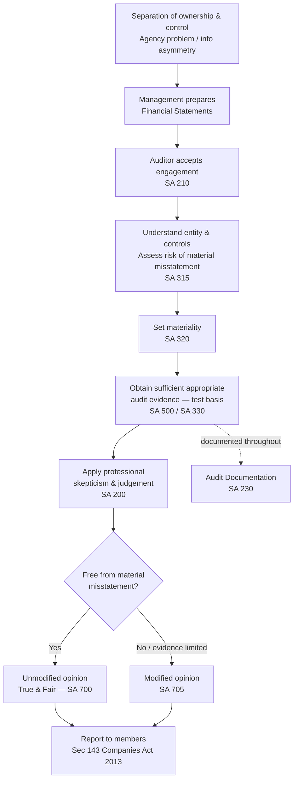

# Q&A — Nature, Objective & Scope of Audit

> CA Intermediate — Auditing & Ethics | Chapter 1
> Exam-oriented question bank. Every question is followed by a complete model answer with SA / Companies Act citations. Standards referenced are the Indian Standards on Auditing (SAs) issued by ICAI and provisions of the Companies Act, 2013. No invented standards are used.

---

## SECTION A — Concept-Check Questions (with answers)

**A1. Why does an audit exist? Explain the "agency problem" that gives rise to the need for audit.**

**Answer:** In a company, ownership (shareholders) is separated from control (management/directors). Management acts as *steward* of the owners' funds. This separation creates an **agency problem** and **information asymmetry** — management knows more about the true state of affairs than the owners, and its self-interest may not align with the owners'. The financial statements prepared by management are the medium through which they report their stewardship. An **independent audit** adds credibility to those statements, reducing information asymmetry and giving owners reasonable assurance that the accounts are reliable. This is the foundational rationale recognised in **SA 200**.

---

**A2. Define "audit" and identify the three vertices of the "audit triangle".**

**Answer:** Audit is an **independent examination of financial information** of any entity, whether profit-oriented or not, and irrespective of size or legal form, **when such an examination is conducted with a view to expressing an opinion thereon** (ICAI's definition; consistent with **SA 200**). The audit triangle links three elements:
1. **Subject matter** — the financial statements prepared by management.
2. **Criteria** — the applicable financial reporting framework (e.g., Accounting Standards / Ind AS read with the Companies Act, 2013).
3. **Opinion/Assurance** — the auditor's conclusion on whether the subject matter conforms to the criteria, communicated to intended users.

---

**A3. State the overall objectives of the independent auditor as laid down in SA 200.**

**Answer:** Per **SA 200 ("Overall Objectives of the Independent Auditor and the Conduct of an Audit in Accordance with SAs")**, the objectives are:
(a) to obtain **reasonable assurance** about whether the financial statements as a whole are free from **material misstatement**, whether due to fraud or error, thereby enabling the auditor to express an opinion on whether the financial statements are prepared, in all material respects, in accordance with an applicable financial reporting framework; and
(b) to **report** on the financial statements, and communicate as required by the SAs, in accordance with the auditor's findings.

---

**A4. Distinguish between "reasonable assurance" and "absolute assurance". Why can an audit never provide absolute assurance?**

**Answer:** **Reasonable assurance** is a *high, but not absolute,* level of assurance. **Absolute assurance** is not attainable because of the **inherent limitations of an audit**, which (per SA 200) arise from:
- The **nature of financial reporting** — involving management judgement and estimates.
- The **nature of audit procedures** — auditor works on **test/sample** basis, and may be given incomplete information or be subject to management fraud/collusion/forgery.
- The **need to conduct the audit within a reasonable time and cost** — audit is not exhaustive; it balances timeliness against a limitless investigation.
Additionally, most audit evidence is **persuasive rather than conclusive**. Hence the auditor reduces audit risk to an acceptably low level but cannot eliminate it.

---

**A5. What is meant by "true and fair view"? Which section of the Companies Act, 2013 requires it?**

**Answer:** "True and fair view" means the financial statements are **free from material misstatement** and **faithfully represent** the entity's financial position, performance and cash flows in accordance with the applicable framework. It does not mean arithmetical accuracy alone; it requires proper disclosure and adherence to Accounting Standards. **Section 143(2)** of the Companies Act, 2013 requires the auditor to report whether the accounts give a **true and fair view**, and **Section 129(1)** requires the financial statements to give a true and fair view and comply with the notified Accounting Standards.

---

**A6. What are "assertions"? List the categories of assertions used by the auditor.**

**Answer:** **Assertions** are representations, explicit or otherwise, embodied in the financial statements by management, used by the auditor to consider the different types of potential misstatements (**SA 315**). They fall into:
- **Assertions about classes of transactions and events:** Occurrence, Completeness, Accuracy, Cut-off, Classification (and Presentation).
- **Assertions about account balances at period end:** Existence, Rights & Obligations, Completeness, Valuation & Allocation (Accuracy, Classification, Presentation).
The auditor designs procedures to obtain evidence supporting each relevant assertion.

---

**A7. Distinguish between a statutory audit and an internal audit (any four points).**

**Answer:**

| Basis | Statutory Audit | Internal Audit |
|---|---|---|
| **Governing law** | Mandatory under Companies Act, 2013 (Sec 139) | Sec 138 (for prescribed companies); largely a management tool |
| **Appointed by** | Shareholders (members) | Management/Board (Audit Committee) |
| **Objective** | Express opinion on true & fair view | Evaluate and improve internal control, risk and governance |
| **Scope** | Determined by statute; cannot be restricted | Determined by management |
| **Reporting to** | Members/shareholders | Management/Board |
| **Independence** | External and independent | Employee/outsourced; less independent |

---

**A8. What is professional skepticism, and how does it differ from professional judgement (SA 200)?**

**Answer:** **Professional skepticism** is an attitude that includes a **questioning mind**, being **alert to conditions** that may indicate possible misstatement due to fraud or error, and a **critical assessment of audit evidence** (SA 200). **Professional judgement** is the application of relevant **training, knowledge and experience** in making informed decisions about appropriate courses of action throughout the audit. Skepticism is the *mindset* (do not accept representations at face value); judgement is the *reasoned application* of expertise to decisions (materiality, nature/extent of procedures, evaluating evidence).

---

## SECTION B — Applied Scenario Questions (Situation → Audit Response with Reasoning)

**B1. During the audit, the CFO says: "Trust us, our internal team already checked all invoices — no need to test again." How should the auditor respond?**

**Answer:** The auditor must apply **professional skepticism (SA 200)** and **not accept management's representation as a substitute for audit evidence**. Management representations are corroborative, not conclusive (**SA 580** cautions that written representations are not sufficient appropriate evidence on their own). The auditor should design and perform independent substantive and control-testing procedures on a sample basis (**SA 500 — Audit Evidence**). Reliance on internal team's work is permissible only after evaluating internal controls (**SA 315**) and, if relying on internal audit, applying **SA 610 (Using the Work of Internal Auditors)**. Reasoning: an audit provides *independent* assurance; blanket reliance would compromise independence and defeat the audit's purpose.

---

**B2. A client, a small proprietorship, asks the auditor to "check every single transaction" so the accounts are "100% correct and guaranteed error-free." Can the auditor promise this?**

**Answer:** No. The auditor can offer only **reasonable assurance, not absolute assurance (SA 200)**, because of **inherent limitations** — audit is conducted on a **test basis**, evidence is **persuasive not conclusive**, and there are constraints of **time and cost**. Even a 100% check cannot guarantee detection of misstatements arising from **collusion, forgery, or management override of controls**. The auditor should manage expectations, explain the concept of materiality and reasonable assurance, and document the scope in the **engagement letter (SA 210)**. Reasoning: promising a guarantee would create an "expectation gap" and expose the auditor to unwarranted liability.

---

**B3. Midway through the audit, management refuses to give the auditor access to certain board minutes and bank confirmations, saying they are "confidential." What is the implication for scope?**

**Answer:** This is a **limitation on the scope of the audit**. Under **Section 143(1)** of the Companies Act, 2013, the auditor has a **right of access at all times to the books, accounts and vouchers** and is entitled to require information and explanations. A management-imposed scope limitation prevents the auditor from obtaining **sufficient appropriate audit evidence (SA 500)**. If the possible effects are **material but not pervasive**, the auditor issues a **qualified opinion**; if **material and pervasive**, a **disclaimer of opinion (SA 705)**. Reasoning: the auditor cannot express an unmodified opinion where scope is restricted and evidence is unavailable.

---

**B4. The auditor detects a suspicious round-sum journal entry passed on the last day of the year by a senior manager, bypassing normal approval. What should the auditor do?**

**Answer:** This is a **fraud risk indicator — management override of controls**, an area SA 240 specifically requires the auditor to address. Applying **professional skepticism (SA 200)** and **SA 240 (The Auditor's Responsibilities Relating to Fraud)**, the auditor should: (i) test the **appropriateness of journal entries** and other adjustments; (ii) investigate the business rationale for significant unusual transactions; (iii) obtain corroborating evidence; and (iv) if fraud is suspected, communicate with **Those Charged With Governance (SA 260)** and consider reporting under **Section 143(12)** of the Companies Act, 2013 (fraud reporting to the Central Government / Audit Committee above the prescribed threshold). All work is documented per **SA 230**. Reasoning: the auditor must maintain skepticism precisely where management can override controls.

---

## SECTION C — Past-Paper-Style Descriptive Questions (with model answers)

**C1. "An audit is an independent examination of financial information conducted with a view to expressing an opinion thereon." Explain the key features of an audit implicit in this definition. (5 marks)**

**Answer:** The definition (aligned with **SA 200**) contains the following key features:
1. **Audit is independent** — the examiner must be free from bias and influence to lend credibility.
2. **Examination of financial information** — the subject matter is financial statements/records.
3. **Of any entity** — profit or non-profit, irrespective of size, constitution or objective.
4. **Systematic and scientific** — conducted through planned procedures to gather sufficient appropriate evidence.
5. **Objective is opinion formation** — the end product is an **opinion on true and fair view**, not certification of accuracy.
6. **Based on evidence** — the opinion rests on audit evidence, judgement and skepticism.
The audit thus enhances the **degree of confidence** of intended users in the financial statements (SA 200).

---

**C2. Explain the inherent limitations of an audit as recognised in SA 200. (6 marks)**

**Answer:** Per **SA 200**, an auditor cannot obtain absolute assurance because of inherent limitations arising from:
1. **Nature of financial reporting** — Financial statements involve **subjective decisions, judgements and estimates** by management (e.g., provisions, fair values), which are inherently uncertain.
2. **Nature of audit procedures** — The auditor works on a **test (sample) basis**; there is a possibility that management may not provide complete information; and evidence may be concealed through **fraud, collusion, or forgery**. Audit evidence is largely **persuasive rather than conclusive**.
3. **Timeliness and cost-benefit** — The audit must be completed within a **reasonable time and at reasonable cost**; it is not practicable to examine everything exhaustively.
4. **Other limitations** — Areas like **related party relationships**, **non-compliance with laws**, and **future events / going concern** carry higher inherent limitation because evidence is harder to obtain.
Because of these, the audit provides **reasonable, not absolute, assurance** and reduces audit risk to an acceptably low level.

---

**C3. Discuss the scope of an audit of financial statements. What matters should the auditor consider in determining scope? (6 marks)**

**Answer:** The **scope** of an audit refers to the audit procedures deemed necessary to achieve the objective of the audit. In determining scope, the auditor considers:
1. **Requirements of relevant legislation** — e.g., the Companies Act, 2013, and any special statute governing the entity.
2. **Pronouncements of ICAI** — the **Standards on Auditing (SAs)**, Guidance Notes and the Code of Ethics.
3. **Terms of the engagement** — but the terms **cannot restrict** the auditor's statutory duties or override the SAs.
4. **Coverage of all aspects** — the audit should cover all aspects of the entity relevant to the financial statements.
5. **Reliability and sufficiency of evidence** — obtained through study/evaluation of internal controls and substantive procedures.
6. **No restriction** — where the auditor's work is restricted such that sufficient appropriate evidence cannot be obtained, the auditor should consider modifying the report (**SA 705**). The scope should never be constrained by any limitation that would cause the auditor to disclaim responsibility without justification.

---

**C4. Classify audits on different bases and give examples. (5 marks)**

**Answer:** Audits may be classified as follows:

*On the basis of legal requirement (organisation):*
- **Statutory audits** — mandatory by law (e.g., company audit under Companies Act, 2013; bank audit; insurance audit; co-operative societies).
- **Non-statutory / voluntary audits** — undertaken by choice (e.g., audit of a sole proprietor or partnership firm not required by law).

*On the basis of specific objective/purpose:*
- **Tax audit** (Sec 44AB, Income-tax Act), **cost audit** (Sec 148, Companies Act), **management audit**, **operational audit**, **secretarial audit** (Sec 204).

*On the basis of function/who performs:*
- **External/independent audit** and **internal audit** (Sec 138).

*On the basis of degree of independence and appointment* the audit may further be **government audit** (by C&AG). This classification shows that audit, though rooted in a common objective, is applied across varied statutory and voluntary contexts.

---

**C5. Explain the relationship between "materiality" and "reasonable assurance", and how they shape the auditor's opinion. (4 marks)**

**Answer:** The auditor's objective (SA 200) is reasonable assurance that the statements are free from **material** misstatement — not *any* misstatement. **Materiality (SA 320)** is the threshold above which misstatements, individually or in aggregate, could reasonably be expected to **influence the economic decisions** of users. Because assurance is targeted at material items and is *reasonable* (high but not absolute), the auditor accepts a low level of **audit risk (SA 320/SA 200)** rather than zero risk. If uncorrected misstatements exceed materiality, or scope limitations prevent evidence on material items, the opinion is **modified under SA 705**; otherwise an **unmodified (clean) opinion** is expressed. Thus materiality operationalises reasonable assurance in forming the opinion.

---

## Process Diagram — Flow of an Audit (Objective to Opinion)

---

## Procedure & Documentation Summary (SA 230)

**C6. State the purpose and essentials of audit documentation under SA 230. (4 marks)**

**Answer:** **SA 230 ("Audit Documentation")** requires the auditor to prepare documentation (working papers) that is **sufficient to enable an experienced auditor, having no previous connection with the audit, to understand**: (a) the **nature, timing and extent** of procedures performed; (b) the **results** and evidence obtained; and (c) **significant matters** and conclusions reached, including significant professional judgements.
Key points:
- **Purpose:** provides evidence of the auditor's basis for the opinion and evidence that the audit was **planned and performed in accordance with SAs**; assists in planning, supervision, review, quality control and future references; helps discharge accountability.
- **Timely preparation:** documentation should be prepared on a timely basis.
- **Assembly of final file:** within **60 days** after the date of the auditor's report.
- **Retention:** ordinarily **not shorter than 7 years** from the date of the auditor's report.
- Identify the **preparer and reviewer**, and record who performed the work and the date.

---

## SECTION D — MCQs / Case Scenarios (correct option + one-line reasoning)

**D1.** The overall objectives of the auditor are laid down in which Standard on Auditing?
(a) SA 210 (b) SA 200 (c) SA 230 (d) SA 700
**Answer: (b) SA 200** — it prescribes the overall objectives and governs the conduct of an audit per SAs.

---

**D2.** An audit provides:
(a) Absolute assurance (b) No assurance (c) Reasonable assurance (d) Limited assurance
**Answer: (c) Reasonable assurance** — high but not absolute, owing to inherent limitations (SA 200).

---

**D3.** The right of the auditor to access books of account "at all times" flows from:
(a) Sec 129 (b) Sec 143(1) (c) Sec 139 (d) Sec 134
**Answer: (b) Section 143(1), Companies Act, 2013** — grants the auditor the statutory right of access.

---

**D4.** "Existence", "Rights and obligations", "Completeness" and "Valuation" are assertions relating to:
(a) Classes of transactions (b) Account balances at period end (c) Presentation only (d) Audit evidence
**Answer: (b) Account balances at period end** — as classified under SA 315.

---

**D5.** A questioning mind and critical assessment of audit evidence describes:
(a) Professional judgement (b) Professional skepticism (c) Due diligence (d) Materiality
**Answer: (b) Professional skepticism** — defined in SA 200.

---

**D6.** Audit documentation should ordinarily be retained for a period not shorter than:
(a) 3 years (b) 5 years (c) 7 years (d) 10 years
**Answer: (c) 7 years** — from the date of the auditor's report (SA 230).

---

**D7. Case Scenario:** M/s XYZ Ltd's management asks the auditor to sign the report before evidence on a material litigation is available, promising a representation letter instead. The auditor should:
(a) Sign, relying on the representation letter
(b) Refuse; obtain sufficient appropriate evidence and modify if unavailable
(c) Sign with a note
(d) Resign immediately
**Answer: (b)** — Written representations are not a substitute for audit evidence (SA 580); if material evidence is unavailable, modify the opinion under SA 705.

---

**D8. Case Scenario:** During audit, the auditor selects only a sample of the thousands of sales invoices rather than all of them. This reflects:
(a) Negligence (b) A scope limitation imposed by management (c) The test-basis inherent limitation of audit (d) A violation of SA 500
**Answer: (c)** — Auditing on a **test/sample basis** is an inherent limitation recognised in SA 200; it is normal audit practice, not negligence.

---

## SECTION — Connections, Traps, First-Principles Recap & Quick Revision

### Connections
- **SA 200** (objectives, assurance, skepticism) is the umbrella; **SA 210** (engagement terms) → **SA 315/320** (risk & materiality) → **SA 500/330** (evidence & responses) → **SA 700/705** (opinion) → **SA 230** (documentation throughout). The Companies Act, 2013 supplies the statutory duties (**Sec 143**), the true-and-fair mandate (**Sec 129**), and appointment (**Sec 139**).

### Traps & Examiner Tricks
- **Trap:** "Audit guarantees accounts are 100% accurate." → **False**; only *reasonable assurance* of *true and fair* view.
- **Trap:** Confusing **true and fair** with **arithmetical accuracy** — true & fair requires proper disclosure and AS compliance, not mere accuracy.
- **Trap:** Treating **skepticism** and **judgement** as the same — skepticism is the mindset; judgement is applied expertise.
- **Trap:** Assuming management representation (SA 580) can replace audit evidence — it cannot.
- **Trap:** Citing a wrong SA number — objectives are **SA 200**, documentation is **SA 230**, evidence is **SA 500**, opinion modification is **SA 705**. Never invent standards.
- **Trap:** Believing engagement terms can shrink statutory scope — they cannot override the Companies Act or SAs.

### First-Principles Recap
Ownership is separated from control → information asymmetry → owners need credible accounts → an **independent** examiner tests the financial statements against a **framework** and expresses an **opinion**. Because reporting involves judgement, evidence is sampled and persuasive, and time/cost are finite, the opinion offers **reasonable (not absolute) assurance** that the statements show a **true and fair view**, free from **material** misstatement.

### Quick-Revision Sheet
- **Definition:** Independent examination of financial information → opinion (SA 200).
- **Audit triangle:** Subject matter (FS) — Criteria (framework) — Opinion (assurance).
- **Objective (SA 200):** Reasonable assurance FS free of material misstatement (fraud/error) + report.
- **Assurance:** Reasonable, not absolute — due to inherent limitations (reporting nature, test basis, time/cost, persuasive evidence).
- **True & fair:** Sec 129 (prepare) & Sec 143(2) (report), Companies Act 2013.
- **Assertions (SA 315):** Transactions — OCCAC; Balances — ExRiCoVa; Presentation & disclosure.
- **Skepticism:** questioning mind + alert + critical evaluation (SA 200).
- **Statutory vs internal:** law-mandated opinion vs management control tool (Sec 139 vs Sec 138).
- **Fraud:** SA 240; report under Sec 143(12).
- **Documentation:** SA 230 — experienced-auditor test; file assembly 60 days; retain min 7 years.
- **Opinion:** Unmodified (SA 700) vs Modified (SA 705).
